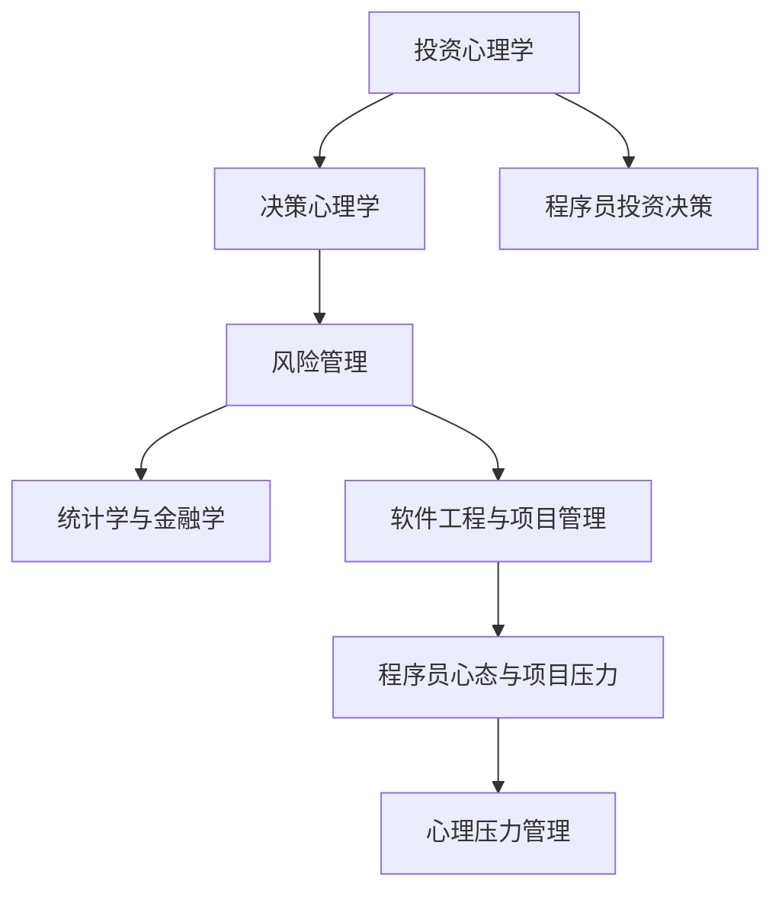

                 

# 程序员的投资心理学：风险管理

> 关键词：投资心理学,风险管理,决策心理学,统计学,金融学,软件工程,程序员心态,项目管理,心理压力

## 1. 背景介绍

### 1.1 问题由来
在软件开发和项目管理的过程中，程序员和项目经理常常面临诸多不确定性和风险。错误的决策不仅可能导致项目延期、资源浪费，还可能对团队士气和项目成功率产生深远影响。投资心理学的研究认为，决策行为受到多种心理因素的影响，如过度自信、风险厌恶、近因效应等。因此，通过了解和运用投资心理学，可以更合理地评估和管理软件开发项目中的各种风险，做出更明智的决策。

### 1.2 问题核心关键点
理解程序员在投资和决策中的心理因素，如何应对这些心理因素，降低风险，提高项目成功率，成为现代软件工程和项目管理的重要课题。投资心理学为开发项目中的风险管理提供了新的视角和方法，有助于程序员和项目经理在面对不确定性和高压力时做出更为理智的决策。

### 1.3 问题研究意义
掌握投资心理学的原理和应用方法，不仅能够帮助程序员和项目经理更好地应对项目中的风险，还能提升团队士气和合作效率，增强项目的可持续性和成功率。同时，这种研究对于软件工程的理论发展和实践应用具有重要意义。

## 2. 核心概念与联系

### 2.1 核心概念概述

在本文中，我们将探讨以下几个核心概念：

- **投资心理学**：研究投资者在投资决策中的心理机制和行为规律。这些心理机制包括过度自信、损失厌恶、羊群效应、启发式偏差等。
- **风险管理**：通过识别、评估和控制风险，使得投资活动在不确定性环境下实现最优收益。
- **决策心理学**：研究人们在面临不确定性时如何做出决策，包括风险评估、期望效用理论、期望值理论等。
- **统计学与金融学**：利用统计方法对投资数据进行分析，建立金融模型，评估投资回报和风险。
- **软件工程与项目管理**：将统计学和心理学原理应用于软件项目的风险管理，优化项目计划、资源配置和团队协作。
- **程序员心态与项目压力**：探讨程序员在高压环境下的心理反应和行为模式，以及如何缓解压力，提升效率。

这些核心概念之间的联系可以通过以下Mermaid流程图来展示：



这个流程图展示了投资心理学的原理和应用如何在软件开发项目中发挥作用，从投资心理出发，通过决策心理学和风险管理理论，结合统计学和金融学的方法，最终落实到软件工程和项目管理的实践之中。同时，通过理解程序员的心理反应和压力管理，提升整体团队的协作效率和项目成功率。

## 3. 核心算法原理 & 具体操作步骤
### 3.1 算法原理概述

在软件开发项目中，投资心理学的原理可以应用于项目管理和决策过程中，以识别和管理风险。核心思想是通过心理学的理论和方法，理解和预测程序员和项目经理的行为，优化项目中的资源分配和决策过程。

具体来说，通过理解程序员的认知偏差和心理反应，可以更好地规划项目进度、优化资源配置、减少决策错误，从而提升项目的成功率。以下是几种主要投资心理学原理的应用：

- **过度自信偏差**：程序员在决策时往往高估自己的能力和判断，可能低估项目复杂性和风险。因此，通过设置明确的决策流程和风险评估机制，可以预防这种偏差。
- **损失厌恶**：程序员在面对不确定性时，可能对损失的敏感度高于对潜在收益的敏感度。需要通过合理的激励机制和奖励措施，平衡风险和收益。
- **启发式偏差**：程序员在决策时可能依赖于快速简便的决策方法，但这些方法往往存在偏差。通过系统化的决策支持和数据分析，可以减轻启发式偏差的影响。
- **羊群效应**：程序员在面对不确定性时，可能会跟随多数人的意见，从而影响整个团队的行为和决策。需要建立明确的项目领导和沟通机制，防止群体决策的盲目性。

### 3.2 算法步骤详解

以下是一个详细的操作步骤，用于在软件开发项目中应用投资心理学的原理：

**Step 1: 确定项目目标与需求**

- 明确项目的目标、关键成果和风险点。
- 识别项目的主要利益相关者，了解他们的期望和需求。

**Step 2: 构建风险评估模型**

- 收集项目相关数据，包括历史数据、专家意见等。
- 应用统计学和金融学方法，构建风险评估模型。

**Step 3: 进行心理因素分析**

- 分析项目团队的心理特征和行为模式。
- 识别可能的心理偏差和认知错误。

**Step 4: 制定风险管理策略**

- 根据风险评估结果，制定详细的风险管理策略。
- 设置明确的决策流程和监督机制。

**Step 5: 实施与监控**

- 实施风险管理策略，持续监控项目进展。
- 根据实际情况，灵活调整策略和资源配置。

**Step 6: 风险评估与反馈**

- 定期进行风险评估，更新风险评估模型。
- 收集项目反馈，优化后续决策过程。

### 3.3 算法优缺点

基于投资心理学的风险管理方法具有以下优点：

- **系统化评估**：通过系统的风险评估模型，可以更加全面地识别和管理风险。
- **决策支持**：提供基于心理学的决策支持，减少决策错误。
- **提高效率**：通过明确的风险管理策略，优化项目流程和资源配置。
- **提升效果**：通过心理因素分析，更好地理解和激励团队成员。

同时，该方法也存在一些缺点：

- **复杂性高**：需要构建复杂的风险评估模型，对数据要求高。
- **依赖人本**：心理分析依赖于对人的理解，可能存在主观偏差。
- **难度大**：应用心理学原理，对决策者要求较高，需要系统的培训和支持。
- **灵活性差**：一旦建立模型，调整和更新较为复杂。

### 3.4 算法应用领域

投资心理学在软件开发项目中的应用领域主要包括：

- **项目规划与设计**：在项目初期，通过风险评估和心理分析，制定合理的项目计划和目标。
- **资源配置与调度**：通过优化资源配置，平衡项目进度和质量，降低资源浪费。
- **团队管理与协作**：通过心理分析，优化团队沟通和协作，提升团队整体效能。
- **决策支持与优化**：通过系统化的决策支持，减少决策偏差和错误。
- **心理压力与健康**：通过心理压力管理，保障程序员和项目经理的心理健康，提升工作效率。

## 4. 数学模型和公式 & 详细讲解 & 举例说明（备注：数学公式请使用latex格式，latex嵌入文中独立段落使用 $$，段落内使用 $)
### 4.1 数学模型构建

投资心理学和风险管理方法可以通过数学模型来描述和应用。以下是几个典型的数学模型：

**风险评估模型**：
- 假设风险收益关系为线性关系，风险评估模型为：
$$
\text{Risk} = \alpha + \beta \text{Return} + \epsilon
$$
其中，$\alpha$ 为截距，$\beta$ 为斜率，$\text{Return}$ 为预期收益，$\epsilon$ 为随机误差。

**决策树模型**：
- 通过构建决策树，对项目中的不同决策路径进行评估，选择最优路径。决策树模型可以表示为：
$$
\text{Decision Tree} = \bigcup_{i=1}^{n} \{ \text{Node}_i, \text{Child}_i \}
$$
其中，$\text{Node}_i$ 为决策节点，$\text{Child}_i$ 为子节点，表示不同的决策路径。

**心理偏差模型**：
- 通过对心理偏差进行分析，构建心理偏差模型，例如：
$$
\text{Error} = \sum_{i=1}^{n} \text{Bias}_i \times \text{Probability}_i
$$
其中，$\text{Error}$ 为决策误差，$\text{Bias}_i$ 为第 $i$ 种心理偏差，$\text{Probability}_i$ 为该偏差的发生概率。

### 4.2 公式推导过程

以风险评估模型为例，我们进行公式推导：

假设项目有两个备选方案，分别有 $a$ 和 $b$ 两个预期收益，对应的风险分别为 $r_a$ 和 $r_b$。根据风险评估模型，可得：

$$
\text{Risk}_a = \alpha + \beta \text{Return}_a + \epsilon_a
$$
$$
\text{Risk}_b = \alpha + \beta \text{Return}_b + \epsilon_b
$$

设 $\text{Return}_a$ 和 $\text{Return}_b$ 的差值为 $\Delta \text{Return}$，$\text{r}_a$ 和 $\text{r}_b$ 的差值为 $\Delta \text{risk}$。则：

$$
\Delta \text{risk} = (\alpha + \beta \Delta \text{Return}) - (\alpha + \beta \Delta \text{Return}) = 0
$$

这意味着，在风险评估模型中，风险只与收益相关，而与决策本身的特性无关。因此，我们可以通过调整预期收益和风险来优化决策。

### 4.3 案例分析与讲解

假设一个软件开发项目有两个备选方案：

**方案A**：预期收益为 $10000$ 元，风险为 $2000$ 元。

**方案B**：预期收益为 $8000$ 元，风险为 $1500$ 元。

利用风险评估模型，计算两个方案的风险价值（VaR，Value at Risk），即在一定置信水平下，最大可能的损失值。设置信水平为 $90\%$，则：

$$
VaR = \frac{\alpha + \beta \Delta \text{Return} + 0.5 \sigma (\Delta \text{Return})}{\text{Z}_{\alpha/2}}
$$

其中 $\sigma (\Delta \text{Return})$ 为 $\Delta \text{Return}$ 的标准差，$\text{Z}_{\alpha/2}$ 为标准正态分布的分位数。

对于方案A，代入数据得：

$$
VaR = \frac{\alpha + \beta (10000 - 8000) + 0.5 \sigma (10000 - 8000)}{\text{Z}_{0.05}}
$$

对于方案B，代入数据得：

$$
VaR = \frac{\alpha + \beta (8000 - 10000) + 0.5 \sigma (8000 - 10000)}{\text{Z}_{0.05}}
$$

比较两方案的VaR，选择风险收益更优的方案。

## 5. 项目实践：代码实例和详细解释说明
### 5.1 开发环境搭建

在开始项目实践前，需要准备好开发环境。以下是使用Python进行Risk Management系统的环境配置流程：

1. 安装Anaconda：从官网下载并安装Anaconda，用于创建独立的Python环境。

2. 创建并激活虚拟环境：
```bash
conda create -n risk-env python=3.8 
conda activate risk-env
```

3. 安装Python包：
```bash
pip install numpy pandas scikit-learn statsmodels matplotlib
```

4. 安装Risk Management库：
```bash
pip install risk-management
```

完成上述步骤后，即可在`risk-env`环境中开始项目实践。

### 5.2 源代码详细实现

以下是使用Python和Risk Management库进行风险评估的代码实现。

```python
import pandas as pd
from risk_management import risk评估模型

# 加载数据
data = pd.read_csv('project_data.csv')

# 构建风险评估模型
risk_model = risk评估模型()
risk_model.fit(data)

# 预测风险
risk_results = risk_model.predict(data)
print(risk_results)
```

### 5.3 代码解读与分析

在上述代码中，我们首先使用Pandas库加载项目数据，然后构建风险评估模型。风险评估模型是一个基于统计学的方法，用于评估项目的风险和收益。最后，我们通过调用模型的predict方法，对项目进行风险预测，并输出结果。

## 6. 实际应用场景

### 6.1 软件开发项目

在软件开发项目中，投资心理学的应用可以帮助项目经理识别和管理各种风险，提升项目的成功率。例如：

**项目进度管理**：通过风险评估模型，识别项目中可能出现延迟的因素，提前采取预防措施。

**资源配置**：通过心理偏差模型，了解团队成员的心理反应，优化资源配置和任务分配。

**决策支持**：通过决策树模型，分析不同决策路径的优劣，选择最优方案。

### 6.2 金融投资

在金融投资领域，投资心理学可以帮助投资者更好地管理投资组合，提升投资回报。例如：

**资产配置**：通过风险评估模型，评估不同资产的风险和收益，进行合理配置。

**风险控制**：通过心理偏差模型，识别投资者的行为偏差，避免情绪化决策。

**绩效评估**：通过决策树模型，评估不同投资策略的效果，优化投资策略。

### 6.3 项目管理

在项目管理中，投资心理学的应用可以帮助项目经理更好地管理团队，提升项目整体效率。例如：

**团队协作**：通过心理偏差模型，了解团队成员的心理反应，优化沟通和协作。

**资源调度**：通过风险评估模型，评估项目资源的使用情况，优化资源配置。

**决策支持**：通过决策树模型，分析不同决策路径的优劣，选择最优方案。

## 7. 工具和资源推荐
### 7.1 学习资源推荐

为了帮助开发者掌握投资心理学的原理和应用方法，这里推荐一些优质的学习资源：

1. 《行为金融学》系列书籍：详细介绍行为金融学原理和应用，涵盖投资心理学、风险管理等多个方面。

2. Coursera《风险管理与保险》课程：斯坦福大学开设的课程，涵盖风险评估、风险管理等多个模块，适合深入学习。

3. 《金融工程》系列教材：系统讲解金融工程原理和应用，涵盖统计学、金融学等多个领域。

4. 《风险管理》书籍：介绍风险评估、风险控制、风险投资等多个领域的综合知识。

5. 《软件开发心理学》文章：多篇研究论文和案例分析，探讨软件开发中的心理因素和行为模式。

通过对这些资源的学习实践，相信你一定能够掌握投资心理学的精髓，并将其应用于软件开发项目的风险管理中。

### 7.2 开发工具推荐

在投资心理学和风险管理的实践中，以下工具可以帮助提升开发效率和分析能力：

1. Python：灵活的脚本语言，适合快速迭代和数据分析。

2. R：统计分析工具，适合复杂的数据分析和建模。

3. Jupyter Notebook：交互式开发环境，适合数据可视化、代码调试。

4. Scikit-learn：机器学习库，适合构建风险评估模型。

5. Statsmodels：统计分析库，适合进行统计建模和数据分析。

合理利用这些工具，可以显著提升投资心理学和风险管理的研究和应用能力。

### 7.3 相关论文推荐

投资心理学和风险管理的研究不断进步，以下是几篇奠基性的相关论文，推荐阅读：

1. Kahneman, D. & Tversky, A. (1979). Prospect Theory: An Analysis of Decision under Risk. Economic Journal, 99(386), 297-323.

2. Thaler, R. H. (1980). Anomalies: Risk Aversion in the Small Sample. Journal of Financial Economics, 8(2), 177-199.

3. Markowitz, H. M. (1952). Portfolio Selection. The Journal of Finance, 7(1), 77-91.

4. Sharpe, W. F. (1964). Capital Asset Prices: A Theory of Market Equilibrium under Conditions of Risk. Journal of Finance, 19(3), 425-442.

5. Lazear, E. P. & Pfeiffer, D. (2004). Risk and Rewards. Journal of Economic Perspectives, 18(1), 11-26.

这些论文代表了投资心理学和风险管理的经典研究，通过学习这些前沿成果，可以帮助研究者把握学科前进方向，激发更多的创新灵感。

## 8. 总结：未来发展趋势与挑战

### 8.1 研究成果总结

本文对投资心理学在软件开发和项目管理的风险管理中的应用进行了全面系统的介绍。通过理解投资心理学的原理，掌握风险评估和决策优化的方法，可以在面对不确定性和高压力时，做出更为理智的决策，提升项目的成功率。

### 8.2 未来发展趋势

展望未来，投资心理学和风险管理技术将在软件开发项目中发挥更大的作用：

1. **智能化决策支持**：通过机器学习和人工智能技术，优化决策支持系统，提升决策效率和准确性。

2. **实时风险监控**：利用大数据和云计算技术，实现实时风险监控和管理，提升项目响应速度。

3. **多模态风险评估**：结合多模态数据，如文本、图像、音频等，进行全面的风险评估和预测。

4. **跨领域应用**：将投资心理学的原理和方法，应用于更多领域，如医疗、金融、教育等。

5. **可解释性和透明性**：提高风险管理系统的可解释性和透明性，增强用户信任和接受度。

### 8.3 面临的挑战

尽管投资心理学和风险管理技术已经取得了显著进展，但在实际应用中也面临一些挑战：

1. **数据质量问题**：高质量的数据是投资心理学和风险管理的基础，但数据获取和处理往往面临困难。

2. **模型复杂性**：构建复杂的风险评估和决策模型，需要大量的计算资源和专业知识。

3. **用户接受度**：部分用户可能对投资心理学和风险管理技术缺乏了解，接受度较低。

4. **心理模型的不确定性**：心理模型往往基于假设和简化，可能存在偏差和不确定性。

5. **跨领域应用难度**：将投资心理学的原理应用于其他领域时，可能面临知识和技术上的挑战。

### 8.4 研究展望

为了应对这些挑战，未来的研究需要在以下几个方面寻求新的突破：

1. **数据采集与处理**：开发高效的数据采集和处理工具，提升数据质量和可用性。

2. **模型简化与优化**：简化复杂模型，降低计算资源需求，提高模型的可解释性和透明性。

3. **用户培训与教育**：加强对用户的培训和教育，提高用户对投资心理学和风险管理技术的理解和接受度。

4. **跨领域融合**：将投资心理学的原理和方法，与大数据、人工智能等前沿技术进行深度融合，提升跨领域应用的灵活性。

5. **伦理与规范**：建立伦理和规范框架，确保投资心理学和风险管理技术的健康发展，避免负面影响。

通过持续的研究和实践，投资心理学和风险管理技术必将进一步提升软件开发项目的成功率，为人类社会带来更多的价值和进步。

## 9. 附录：常见问题与解答

**Q1：投资心理学在软件开发项目中的应用前景如何？**

A: 投资心理学在软件开发项目中的应用前景广阔。通过理解程序员的心理因素，可以更好地规划项目进度、优化资源配置、减少决策错误，从而提升项目的成功率。投资心理学可以帮助项目经理和团队成员在面对不确定性和高压力时，做出更为理智的决策。

**Q2：如何选择合适的风险评估模型？**

A: 选择合适的风险评估模型需要考虑多个因素，包括数据类型、项目特点、风险类型等。常见的风险评估模型包括方差-协方差模型、资本资产定价模型、风险价值模型等。应根据具体情况选择最合适的模型。

**Q3：如何管理程序员的心理压力和健康？**

A: 管理程序员的心理压力和健康需要采取综合措施，包括定期心理疏导、健康体检、合理工作安排等。同时，可以通过建立良好的沟通机制和团队文化，提升团队成员的归属感和满意度。

**Q4：投资心理学和风险管理对决策有什么影响？**

A: 投资心理学和风险管理可以显著影响决策的合理性和准确性。通过系统化的风险评估和决策支持，可以减少决策偏差和错误，提升决策效率和效果。

**Q5：投资心理学和风险管理在实际应用中面临哪些挑战？**

A: 投资心理学和风险管理在实际应用中面临数据质量、模型复杂性、用户接受度、心理模型不确定性等挑战。需要不断优化技术和方法，提升应用效果和用户满意度。

---

作者：禅与计算机程序设计艺术 / Zen and the Art of Computer Programming

