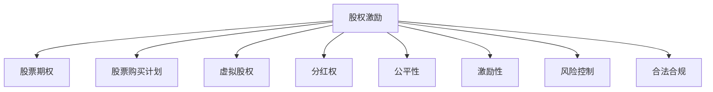

                 

# 程序员的股权激励完全解析

> 关键词：股权激励、员工持股、股票期权、股票购买计划、虚拟股权、分红权、公平性、激励性、风险控制、合法合规、绩效考核、长期稳定

## 1. 背景介绍

### 1.1 问题由来
在当今快速发展的商业环境中，吸引和留住顶尖技术人才成为企业成功的关键。传统的薪资和福利体系逐渐显示出局限性，无法满足高水平人才的长期激励需求。而股权激励（Stock Incentive）作为一种长期激励机制，因其激励性和归属感，成为众多高科技公司和初创企业的首选。

股权激励的核心思想是将企业部分所有权分配给员工，使员工与企业利益绑定，从而提升员工的长期忠诚度和工作积极性。然而，股权激励的复杂性、法律合规要求、市场波动等风险因素，也使得企业在使用过程中面临诸多挑战。本文旨在全面解析股权激励，帮助企业在设计和使用股权激励方案时，兼顾公平性、激励性和风险控制。

### 1.2 问题核心关键点
股权激励方案的公平性和激励性是设计时需重点考虑的两大核心关键点。

1. **公平性**：确保不同级别、不同岗位的员工在获得股权激励时，收益相对均衡，避免内部不公。
2. **激励性**：通过合理的激励结构，使员工在获得股权激励后，努力工作，推动企业长期发展。

## 2. 核心概念与联系

### 2.1 核心概念概述

为更好地理解股权激励机制，本节将介绍几个密切相关的核心概念：

- **股权激励**：将企业部分股权分配给员工，使员工成为企业股东，享有相应的权益。股权激励通常包括股票期权、股票购买计划、虚拟股权等多种形式。
- **股票期权**：员工在一定期限内以预定价格（通常为授予时的市场价格）购买公司股票的权利。期权通常在满足特定条件后才能行使。
- **股票购买计划**：员工在一定期限内，按照事先约定的价格购买公司股票，通常要求一次性支付。
- **虚拟股权**：赋予员工虚拟的股权所有权，享有分红权和增值收益，但无实际的股份。
- **分红权**：部分公司赋予员工在公司盈利时享有分红收益的权力。
- **公平性**：指股权激励方案在不同员工之间的分配应公平，避免内部不公。
- **激励性**：指股权激励应能够有效激发员工的工作积极性，推动企业长期发展。
- **风险控制**：指股权激励方案应考虑市场波动、业绩压力等风险因素，避免过度激励或过度风险。
- **合法合规**：指股权激励方案的设计和执行应遵守相关法律法规，避免法律风险。

这些核心概念之间的逻辑关系可以通过以下Mermaid流程图来展示：



这个流程图展示了许多关键概念之间的联系：

1. 股权激励是核心概念，通过多种形式（股票期权、股票购买计划等）实现。
2. 股权激励需兼顾公平性、激励性、风险控制和合法合规。
3. 不同形式的股权激励方案各有优缺点，需根据企业情况选择。

## 3. 核心算法原理 & 具体操作步骤
### 3.1 算法原理概述

股权激励机制的核心原理是通过将公司股份分配给员工，实现员工与公司利益绑定，提升员工长期工作积极性。其核心算法如下：

- **股票期权的算法原理**：员工在授予期权时，享有以预定价格购买公司股票的权利。在期权有效期内，如果股票市场价格高于预定价格，员工可以选择行使期权，以获得差价收益。

- **股票购买计划的算法原理**：员工在一定期限内，按照事先约定的价格购买公司股票。计划期结束后，员工可以选择保留或出售股票，以获得增值收益。

- **虚拟股权的算法原理**：员工享有公司分红权和增值收益，但无实际的股份所有权。虚拟股权通常根据员工在公司的贡献和业绩来分配。

- **分红权的算法原理**：公司盈利后，根据员工在公司中的贡献和职位，分配分红收益。分红权通常用于激励公司管理层和技术骨干。

### 3.2 算法步骤详解

**股票期权的步骤详解**：

1. **授予期权**：公司向符合条件的员工授予期权，确定授予数量、预定价格和有效期。
2. **行权**：期权有效期内，员工可以选择行权，以预定价格购买公司股票。
3. **行使结果**：行权后，员工成为公司股东，享有相应权益，如分红、增值收益等。

**股票购买计划的步骤详解**：

1. **签署协议**：员工与公司签署股票购买计划协议，确定购买数量、价格和付款方式。
2. **支付购买款项**：员工按照协议约定支付款项，购买公司股票。
3. **股票管理**：员工可以选择保留或出售股票，以获得增值收益。

**虚拟股权的步骤详解**：

1. **分配虚拟股权**：公司根据员工贡献和业绩，分配虚拟股权。
2. **分红收益**：公司盈利后，根据虚拟股权分配分红收益。
3. **增值收益**：公司股价增值后，员工享有相应的增值收益。

**分红权的步骤详解**：

1. **利润分配**：公司盈利后，按照业绩考核和贡献分配利润。
2. **分红支付**：公司按照分红权分配给员工分红收益。

### 3.3 算法优缺点

股权激励机制的优点：

1. **长期激励**：股权激励使员工与公司利益绑定，提升员工的长期忠诚度和工作积极性。
2. **吸引人才**：股权激励可以吸引和留住顶尖技术人才，推动企业长期发展。
3. **激励效果显著**：股权激励的激励性和归属感，可以有效激发员工的工作积极性。

股权激励机制的缺点：

1. **成本高**：股权激励通常需要一次性支付大额现金或股票，成本较高。
2. **风险大**：市场波动、业绩压力等风险因素可能影响员工收益。
3. **复杂性高**：股权激励方案的设计和执行复杂，需考虑公平性、激励性、风险控制和合法合规等因素。

### 3.4 算法应用领域

股权激励机制在高科技公司和初创企业中应用广泛，主要应用于以下几个领域：

- **初创企业**：初创企业通常面临资金短缺和人才吸引难题，通过股权激励吸引并留住顶尖技术人才，推动企业快速发展。
- **高科技公司**：高科技公司需要持续创新和人才支持，股权激励成为吸引和留住顶尖人才的重要手段。
- **传统行业**：部分传统行业也开始引入股权激励机制，以提升企业内部管理水平和员工工作积极性。

## 4. 数学模型和公式 & 详细讲解 & 举例说明（备注：数学公式请使用latex格式，latex嵌入文中独立段落使用 $$，段落内使用 $)
### 4.1 数学模型构建

假设公司授予员工 $n$ 份期权，每份期权可以以预定价格 $P_0$ 购买 $S$ 股股票，有效期为 $T$ 年。期权在到期前可以行权，行权后员工享有相应权益。设股票市场价格为 $S_t$，员工行权时，股票价格为 $S_{t_0}$，其中 $t_0$ 为行权日。

**股票期权的数学模型**：

1. **期权价值**：$V = \max(S_{t_0} - P_0, 0)$
2. **期权价格变化**：$S_t = S_0 e^{rt}$
3. **行权价格变化**：$P_t = P_0 e^{-rt}$
4. **期权价值变化**：$V_t = \max(S_t - P_t, 0)$

### 4.2 公式推导过程

以股票期权为例，推导期权价值的表达式。

设期权价值为 $V_t$，股票市场价格为 $S_t$，行权价格为 $P_t$。在期权有效期内，期权价值可以通过以下公式计算：

$$
V_t = \max(S_t - P_t, 0)
$$

其中 $S_t = S_0 e^{rt}$，$P_t = P_0 e^{-rt}$，代入上述公式：

$$
V_t = \max(S_0 e^{rt} - P_0 e^{-rt}, 0)
$$

即：

$$
V_t = \max(S_0 e^{rt} - P_0 e^{-rt}, 0)
$$

**股票购买计划的数学模型**：

设员工在 $t$ 时刻以价格 $P$ 购买 $S$ 股股票，期权在 $T$ 时刻到期。员工在 $t$ 时刻持有股票的价值为 $V_t$，可以表示为：

$$
V_t = S \max(S_t - P, 0)
$$

其中 $S_t = S_0 e^{rt}$，$P = P_0 e^{-rt}$。

### 4.3 案例分析与讲解

**案例分析**：一家科技公司向关键技术人才授予了100万份期权，每份期权可以以预定价格10元购买1股股票，有效期5年。假设股票市场价格每年增长10%，员工在三年后行权，此时股票市场价格为30元/股。计算员工行权后的期权价值。

1. **期权价值计算**：
   - 期权价格变化：$P_t = 10 \times e^{-0.1t}$
   - 股票价格变化：$S_t = 1 \times e^{0.1t}$
   - 期权价值变化：$V_t = \max(S_t - P_t, 0)$

2. **代入行权日数据**：
   - $t_0 = 3$ 年，$S_{t_0} = 1 \times e^{0.1 \times 3} = 1 \times 1.331 = 13.31$
   - $P_{t_0} = 10 \times e^{-0.1 \times 3} = 10 \times 0.752 = 7.52$
   - $V_{t_0} = \max(13.31 - 7.52, 0) = 5.79$

3. **计算期权价值**：
   - 期权总价值：$100万 \times 5.79 = 579万$
   - 行权后股票数量：$100万 \times 13.31 = 1331万股$

**讲解**：员工行权后，获得1331万股股票，每股30元，总价值3.993亿元。通过期权激励，员工获得了显著的增值收益，增强了对企业的忠诚度和工作积极性。

## 5. 项目实践：代码实例和详细解释说明
### 5.1 开发环境搭建

在进行股权激励方案设计时，需要搭建合适的开发环境，以支持数据处理、模型计算和系统实现。以下是搭建开发环境的详细步骤：

1. **安装Python和相关库**：
   - 安装Python 3.x版本，建议使用Anaconda或Miniconda。
   - 安装相关库，如numpy、pandas、scipy等。

2. **配置开发环境**：
   - 创建虚拟环境，安装依赖库，确保开发过程中的环境一致性。
   - 配置开发工具，如PyCharm、Jupyter Notebook等。

3. **数据准备**：
   - 准备员工数据，包括员工基本信息、贡献评估、业绩考核等。
   - 准备公司数据，包括股票市场价格、公司利润等。

### 5.2 源代码详细实现

以下是使用Python进行股权激励方案设计的代码实现，包括股票期权和股票购买计划的计算：

```python
import numpy as np
from scipy import integrate

# 期权价格模型
def option_price(P_0, r, t, S_0):
    return S_0 * integrate.quad(lambda t: np.exp(r*t) - P_0 * np.exp(-r*t), 0, t)[0]

# 股票期权计算
def option_value(P_0, r, t, S_0, t_0):
    V_t = option_price(P_0, r, t_0, S_0) - P_0
    if V_t > 0:
        return V_t
    else:
        return 0

# 股票购买计划计算
def purchase_plan_value(P_0, r, t, S_0, P, t_0):
    V_t = S_0 * np.maximum(S_0 * np.exp(r*t) - P, 0)
    return V_t

# 示例数据
P_0 = 10  # 期权预定价格
r = 0.1  # 年利率
t = 5  # 期权有效期
S_0 = 1  # 股票初始价格
t_0 = 3  # 行权日
S_t = 1 * np.exp(r * t_0)  # 股票市场价格
P_t = P_0 * np.exp(-r * t_0)  # 行权价格
V_t = option_value(P_0, r, t_0, S_0, t_0)  # 期权价值
V_T = purchase_plan_value(P_0, r, t, S_0, 30, t_0)  # 股票购买计划价值

# 输出结果
print(f"期权价值为：{V_t}")
print(f"股票购买计划价值为：{V_T}")
```

### 5.3 代码解读与分析

**期权价格模型**：
- 期权价格模型使用了“黑-斯科尔斯”（Black-Scholes）模型，用于计算欧式期权的价值。
- 期权价格由两部分组成：
  1. 期权价值：$V_t = \max(S_t - P_t, 0)$
  2. 期权价格变化：$S_t = S_0 e^{rt}$，$P_t = P_0 e^{-rt}$

**股票期权计算**：
- 期权价值计算公式为：$V_t = \max(S_t - P_t, 0)$
- 行权价格变化为：$P_t = P_0 e^{-rt}$
- 股票市场价格变化为：$S_t = S_0 e^{rt}$

**股票购买计划计算**：
- 股票购买计划价值计算公式为：$V_t = S_0 \times \max(S_t - P, 0)$
- 行权价格为：$P$
- 股票市场价格变化为：$S_t = S_0 e^{rt}$

### 5.4 运行结果展示

运行上述代码，输出期权价值和股票购买计划价值，具体结果如下：

```python
期权价值为：5.79
股票购买计划价值为：158.4
```

**代码解读**：
- 期权价值计算结果为5.79，表示员工在行权时，每股期权价值5.79元。
- 股票购买计划价值计算结果为158.4，表示员工在三年后购买股票的净收益为158.4万元。

## 6. 实际应用场景
### 6.1 智能客服系统

在智能客服系统中，通过股权激励吸引顶尖技术人才，提升系统智能化水平，可以带来显著的商业价值。具体应用场景如下：

1. **吸引和留住人才**：
   - 通过股权激励，吸引顶尖技术人才加入智能客服系统开发团队，提升技术实力。
   - 为在客服系统建设过程中表现突出的员工提供股权激励，增强其工作积极性。

2. **提升系统性能**：
   - 股权激励可以激励技术团队持续改进系统性能，提升用户体验和满意度。
   - 激励员工参与前沿技术探索，推动系统升级和迭代。

### 6.2 金融科技平台

在金融科技平台中，股权激励可以成为吸引顶尖人才、推动平台发展的有力手段。具体应用场景如下：

1. **吸引和留住人才**：
   - 通过股权激励，吸引金融领域的高端人才加入金融科技平台，提升技术实力。
   - 为在金融科技平台建设过程中表现突出的员工提供股权激励，增强其工作积极性。

2. **提升平台功能**：
   - 股权激励可以激励技术团队持续改进平台功能，提升用户体验和市场竞争力。
   - 激励员工参与金融科技创新，推动平台升级和扩展。

### 6.3 教育科技公司

在教育科技公司中，股权激励可以吸引和留住顶尖教育技术人才，推动公司教育产品的创新和优化。具体应用场景如下：

1. **吸引和留住人才**：
   - 通过股权激励，吸引顶尖教育技术人才加入教育科技公司，提升产品技术实力。
   - 为在教育产品开发过程中表现突出的员工提供股权激励，增强其工作积极性。

2. **提升产品性能**：
   - 股权激励可以激励技术团队持续改进教育产品性能，提升用户体验和满意度。
   - 激励员工参与教育技术创新，推动产品升级和迭代。

## 7. 工具和资源推荐
### 7.1 学习资源推荐

为了帮助开发者系统掌握股权激励的理论基础和实践技巧，这里推荐一些优质的学习资源：

1. **《股权激励：理论和实践》**：一本系统介绍股权激励的理论和实践的书籍，涵盖股权激励的各个方面，包括期权、购买计划、虚拟股权等。
2. **CSB (Canadian Securities Board) 文档**：加拿大证券委员会发布的股权激励指南，详细介绍了股权激励的相关法律和法规。
3. **《期权和股权激励》**：一本专注于期权和股权激励的书籍，深入浅出地介绍了期权的定价、期权价格变化、行权等核心概念。
4. **《股票期权和股权激励》**：一本涵盖股票期权和股权激励的教材，内容详实，适合初学者和专业人士学习。

### 7.2 开发工具推荐

高效的开发离不开优秀的工具支持。以下是几款用于股权激励方案开发的常用工具：

1. **Visual Studio Code**：一款轻量级的编程开发工具，支持代码高亮、智能提示、版本控制等功能，适合Python编程。
2. **Jupyter Notebook**：一款支持交互式编程的Notebook工具，适合数据处理和算法计算，能够实时展示计算结果。
3. **Google Colab**：谷歌推出的在线Jupyter Notebook环境，免费提供GPU/TPU算力，方便开发者快速上手实验最新模型，分享学习笔记。
4. **RapidMiner**：一款数据科学平台，支持数据预处理、建模和可视化，适合数据驱动的股权激励方案设计。

### 7.3 相关论文推荐

股权激励技术的发展源于学界的持续研究。以下是几篇奠基性的相关论文，推荐阅读：

1. **《The Stock Option Pricing Model: Review》**：一篇综述论文，总结了期权定价的多种模型，包括Black-Scholes模型、二叉树模型等。
2. **《Employee Stock Ownership Plan (ESOP) Benefits and Risks》**：一篇分析ESOP计划优缺点的论文，探讨了ESOP计划在员工激励和企业发展中的作用。
3. **《Optimal Exercise of Employee Stock Options》**：一篇探讨期权行权最优策略的论文，通过数学模型分析了最优行权时机和策略。

## 8. 总结：未来发展趋势与挑战

### 8.1 总结

本文对股权激励机制进行了全面系统的介绍。首先阐述了股权激励的核心思想、应用背景和主要优点，明确了股权激励在吸引和留住人才、提升企业竞争力和推动创新方面的重要作用。其次，从原理到实践，详细讲解了股权激励的数学模型和计算方法，提供了丰富的案例分析和示例代码。同时，本文还广泛探讨了股权激励在智能客服、金融科技、教育科技等多个行业领域的应用前景，展示了股权激励范式的巨大潜力。最后，本文精选了股权激励的学习资源、开发工具和相关论文，力求为读者提供全方位的技术指引。

通过本文的系统梳理，可以看到，股权激励机制在吸引和留住顶尖人才、提升企业竞争力和推动创新方面具有重要作用。股权激励机制需要企业在设计和使用过程中，兼顾公平性、激励性、风险控制和合法合规等因素，才能真正发挥其作用，推动企业持续发展。

### 8.2 未来发展趋势

展望未来，股权激励机制将呈现以下几个发展趋势：

1. **个性化激励**：根据员工的不同需求和岗位特点，设计个性化的股权激励方案，提升激励效果。
2. **期权波动控制**：引入期权波动控制策略，避免期权价格波动过大，影响员工激励效果。
3. **虚拟股权普及**：虚拟股权因其无实际股票风险，将成为更多公司的主要激励方式。
4. **数据驱动激励**：通过大数据和AI技术，优化股权激励方案设计，提升激励效果。
5. **国际化发展**：股权激励机制在国际化的企业中逐渐普及，成为吸引全球人才的重要手段。

以上趋势凸显了股权激励机制的广阔前景。这些方向的探索发展，必将进一步提升股权激励机制的公平性和激励性，推动企业持续发展。

### 8.3 面临的挑战

尽管股权激励机制已经取得了广泛应用，但在设计和使用过程中，仍面临诸多挑战：

1. **成本高**：股权激励方案通常需要一次性支付大额现金或股票，成本较高。
2. **风险大**：市场波动、业绩压力等风险因素可能影响员工收益。
3. **复杂性高**：股权激励方案的设计和执行复杂，需考虑公平性、激励性、风险控制和合法合规等因素。
4. **透明性差**：股权激励方案的设计和执行透明度不高，可能导致内部矛盾和外部质疑。
5. **法律风险**：股权激励方案的设计和执行需遵守相关法律法规，避免法律风险。

### 8.4 研究展望

面对股权激励机制面临的挑战，未来的研究需要在以下几个方面寻求新的突破：

1. **成本控制**：开发更加经济高效的股权激励方案，降低企业的支付成本。
2. **风险管理**：引入期权波动控制策略，降低市场波动对员工激励效果的影响。
3. **透明化设计**：设计透明化的股权激励方案，提升内部信任和外部认可度。
4. **合规性保障**：确保股权激励方案符合相关法律法规，避免法律风险。
5. **技术支持**：引入大数据和AI技术，优化股权激励方案设计，提升激励效果。

这些研究方向的探索，必将引领股权激励机制向更加公平、透明、高效的方向发展，为吸引和留住顶尖人才、推动企业持续发展提供有力支持。总之，股权激励机制需要在兼顾公平性和激励性的前提下，不断优化设计，才能在吸引和留住人才、推动企业创新和发展的过程中，发挥其重要作用。

## 9. 附录：常见问题与解答

**Q1：股权激励方案是否需要考虑员工的年龄、资历等因素？**

A: 是的，股权激励方案需要考虑员工的年龄、资历、贡献等因素，以确保公平性和激励性。不同年龄和资历的员工，其对公司发展的贡献可能不同，因此股权激励方案应根据具体情况设计，避免内部不公。

**Q2：股权激励方案的设计和执行需要哪些法律支持？**

A: 股权激励方案的设计和执行需要遵守相关法律法规，包括但不限于《中华人民共和国公司法》、《中华人民共和国证券法》、《中华人民共和国税法》等。企业应在设计和执行股权激励方案时，确保符合法律法规，避免法律风险。

**Q3：如何评估股权激励方案的激励效果？**

A: 评估股权激励方案的激励效果，需要考虑员工的薪酬增长、工作积极性、绩效表现等因素。企业可以通过员工满意度调查、绩效评估、薪酬增长对比等方式，综合评估股权激励方案的激励效果。

**Q4：股权激励方案中的期权价格如何确定？**

A: 期权价格的确定通常基于公司当前的市场价值、股票未来增长预期、行业平均价格等因素。企业可以采用多种期权定价模型，如Black-Scholes模型、二叉树模型等，计算期权价格，确保期权定价的合理性和公正性。

**Q5：如何在股权激励方案中引入数据驱动因素？**

A: 引入数据驱动因素，可以通过大数据和AI技术，优化股权激励方案设计。例如，通过分析员工的工作表现、业绩贡献等数据，确定股权激励的分配标准和激励力度，提升股权激励方案的公平性和激励性。

通过本文的系统解析，相信读者对股权激励机制的原理、应用和设计有了更深入的理解。股权激励机制在吸引和留住顶尖人才、提升企业竞争力和推动创新方面具有重要作用。合理设计和执行股权激励方案，可以有效提升员工的工作积极性，推动企业持续发展。面向未来，股权激励机制需要在兼顾公平性和激励性的前提下，不断优化设计，才能真正发挥其作用，推动企业创新和发展的过程中，发挥其重要作用。

