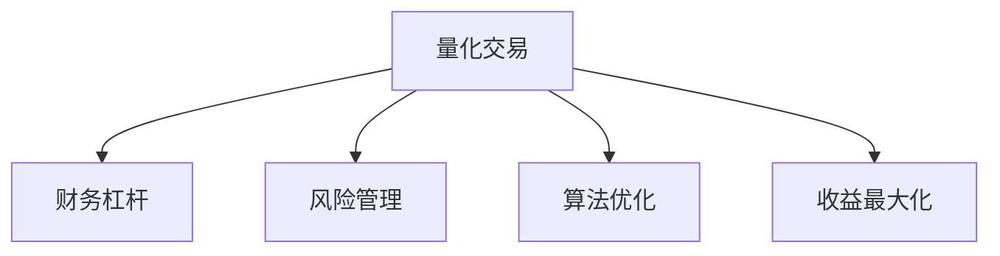

                 

# 程序员的财务杠杆使用策略

> 关键词：财务杠杆、程序交易、风险管理、算法优化、收益最大化

## 1. 背景介绍

### 1.1 问题由来
随着人工智能、大数据、云计算等技术的快速发展，程序员的职业生涯也发生了翻天覆地的变化。传统的软件开发、系统维护等岗位已经不再稀缺，而在金融、量化交易、数据挖掘等领域，程序员的需求却大幅增加。特别是在量化交易领域，程序员可以通过算法实现高效的自动化交易策略，迅速积累财富。然而，算法的有效性和安全性问题也随之而来。财务杠杆的使用，使程序员可以在很短的时间内实现财富的指数级增长，但也带来了极高的风险。

### 1.2 问题核心关键点
财务杠杆是指通过借入资金来增加投资规模，从而获得更高的收益。程序员在量化交易中使用财务杠杆，可以在资产价格波动时，快速调整仓位，实现收益最大化。然而，财务杠杆的使用也使得投资风险成倍增加。因此，如何在保证收益最大化的同时，合理使用财务杠杆，防范风险，成为程序员在量化交易中的核心挑战。

## 2. 核心概念与联系

### 2.1 核心概念概述

为了更好地理解程序员在量化交易中使用财务杠杆的策略，本节将介绍几个密切相关的核心概念：

- **量化交易**：利用数学模型和算法进行交易决策，通过计算机程序自动执行交易策略，以实现收益最大化的投资方法。
- **财务杠杆**：通过借入资金来放大投资规模，使收益随资产价格波动而快速增长的方法。
- **风险管理**：在量化交易中，通过对交易策略的监控、调整和优化，控制交易风险，保持投资组合的稳定性和盈利能力。
- **算法优化**：通过对交易算法的改进，提高算法效率，降低交易成本，提升交易策略的稳定性和准确性。
- **收益最大化**：通过有效的策略选择和执行，使量化交易获得最大化的收益。

这些核心概念之间的逻辑关系可以通过以下Mermaid流程图来展示：



这个流程图展示了一些关键概念之间的关系：

1. 量化交易是财务杠杆和收益最大化的前提。
2. 财务杠杆是量化交易中常用的手段，可以放大收益，但也带来了风险。
3. 风险管理是在量化交易中使用财务杠杆时必须考虑的因素，以确保投资组合的稳定性和盈利能力。
4. 算法优化是量化交易中提高策略稳定性和准确性的关键。
5. 收益最大化是量化交易的最终目标，但必须在合理的财务杠杆和风险控制下实现。

## 3. 核心算法原理 & 具体操作步骤
### 3.1 算法原理概述

量化交易中的财务杠杆使用策略，本质上是一个在风险控制下的收益最大化过程。其核心思想是：通过数学模型和算法，预测市场趋势，利用财务杠杆放大投资规模，在资产价格波动时，快速调整仓位，获取高收益。

在量化交易中，程序员可以利用历史价格数据训练模型，预测未来价格走势。如果模型预测到市场上涨，可以增加仓位，使用财务杠杆放大收益。反之，如果模型预测到市场下跌，可以减小仓位，保护投资。通过这样的策略，程序员可以在短期内实现财富的快速增长。

### 3.2 算法步骤详解

量化交易中使用财务杠杆的一般步骤包括：

**Step 1: 数据预处理**
- 收集历史价格数据，进行清洗、归一化等预处理。
- 划分训练集和测试集，用于模型训练和验证。

**Step 2: 模型训练**
- 选择合适的机器学习算法，如线性回归、随机森林、神经网络等，对历史数据进行训练。
- 在训练集上优化模型参数，获得最佳的预测模型。

**Step 3: 回测验证**
- 使用测试集对模型进行回测验证，评估模型的预测准确性和稳定性。
- 通过多种验证指标，如夏普比率、最大回撤等，评估模型的风险控制能力。

**Step 4: 确定财务杠杆**
- 根据模型的预测结果，确定是否使用财务杠杆。
- 根据模型预测和市场波动，动态调整财务杠杆比例。

**Step 5: 自动交易**
- 使用计算机程序自动执行交易策略，调整仓位，使用财务杠杆放大收益。
- 监控市场波动，及时调整仓位，控制风险。

**Step 6: 风险管理**
- 设置止损点和仓位限制，防止亏损过大。
- 定期评估投资组合的风险和收益，进行策略优化。

**Step 7: 收益评估**
- 记录交易收益，评估投资策略的效果。
- 持续改进算法和策略，提升收益最大化能力。

### 3.3 算法优缺点

量化交易中使用财务杠杆的策略，具有以下优点：

1. 收益最大化。财务杠杆可以放大投资规模，快速获取高收益，特别是在市场上涨时，收益潜力巨大。
2. 算法优化。量化交易依赖算法模型，通过不断优化算法，可以提高预测准确性，降低交易成本，提升收益。
3. 风险管理。量化交易可以通过数学模型和算法，自动调整仓位和止损点，控制风险，保护投资。

然而，该策略也存在一些缺点：

1. 高风险。财务杠杆放大了收益，但同时增加了风险，特别是在市场下跌时，亏损也会成倍放大。
2. 算法失效。如果模型预测不准确，或市场波动超出模型预期，可能导致重大的投资损失。
3. 交易成本。高频交易需要大量的计算资源和带宽，增加了交易成本。
4. 市场环境。量化交易依赖于市场数据，市场环境变化可能会影响模型效果，需要持续监控和调整。

尽管存在这些缺点，但量化交易中的财务杠杆策略，在合理的风险控制下，仍然是一种高效的投资方式，可以帮助程序员在短期内实现财富的快速增长。

### 3.4 算法应用领域

量化交易中的财务杠杆策略，在金融市场、期货市场、外汇市场等多个领域都有广泛应用。具体应用包括：

- 股票交易：利用算法预测市场趋势，通过财务杠杆放大收益。
- 期货交易：利用算法进行期货套利，通过财务杠杆提高收益。
- 外汇交易：利用算法进行外汇买卖，通过财务杠杆获取高额收益。
- 债券交易：利用算法进行债券交易，通过财务杠杆获取固定收益。
- 期权交易：利用算法进行期权交易，通过财务杠杆实现收益最大化。

这些应用领域，都需要程序员具备深厚的金融知识和算法技能，才能设计出高效的交易策略，利用财务杠杆实现收益最大化。

## 4. 数学模型和公式 & 详细讲解 & 举例说明

### 4.1 数学模型构建

量化交易中的财务杠杆策略，可以通过数学模型进行建模和优化。常见的数学模型包括线性回归、随机森林、神经网络等。这里以线性回归模型为例，介绍模型的构建和优化。

假设历史价格数据为 $(x_i, y_i)$，其中 $x_i$ 为时间序列，$y_i$ 为价格数据。线性回归模型的目标是通过参数 $\theta$，拟合数据，预测未来的价格走势。模型的预测结果为：

$$
\hat{y}_i = \theta_0 + \theta_1 x_i
$$

其中 $\hat{y}_i$ 为模型预测的价格，$\theta_0$ 为截距，$\theta_1$ 为斜率。

模型的目标函数为：

$$
\mathcal{L}(\theta) = \frac{1}{N}\sum_{i=1}^N (y_i - \hat{y}_i)^2
$$

通过最小化损失函数，可以优化模型参数 $\theta$。

### 4.2 公式推导过程

线性回归模型的推导过程如下：

假设历史价格数据为 $(x_i, y_i)$，其中 $x_i$ 为时间序列，$y_i$ 为价格数据。线性回归模型的目标是通过参数 $\theta$，拟合数据，预测未来的价格走势。模型的预测结果为：

$$
\hat{y}_i = \theta_0 + \theta_1 x_i
$$

其中 $\hat{y}_i$ 为模型预测的价格，$\theta_0$ 为截距，$\theta_1$ 为斜率。

模型的目标函数为：

$$
\mathcal{L}(\theta) = \frac{1}{N}\sum_{i=1}^N (y_i - \hat{y}_i)^2
$$

通过最小化损失函数，可以优化模型参数 $\theta$。具体过程如下：

1. 计算梯度：

$$
\nabla_{\theta}\mathcal{L}(\theta) = \frac{2}{N}\sum_{i=1}^N (y_i - \hat{y}_i)x_i
$$

2. 更新参数：

$$
\theta \leftarrow \theta - \eta \nabla_{\theta}\mathcal{L}(\theta)
$$

其中 $\eta$ 为学习率。

通过不断迭代上述过程，可以逐渐优化模型参数 $\theta$，提高模型的预测准确性。

### 4.3 案例分析与讲解

假设某程序员使用线性回归模型进行股票交易，历史数据如表1所示：

表1：历史数据

| 时间 | 价格 |
|------|------|
| 1    | 10   |
| 2    | 12   |
| 3    | 14   |
| 4    | 16   |
| 5    | 20   |

假设模型预测未来价格为：

$$
\hat{y} = \theta_0 + \theta_1 x
$$

其中 $x$ 为时间序列，$\theta_0$ 为截距，$\theta_1$ 为斜率。

通过最小化损失函数，可以优化模型参数 $\theta$。具体过程如下：

1. 计算梯度：

$$
\nabla_{\theta}\mathcal{L}(\theta) = \frac{2}{N}\sum_{i=1}^N (y_i - \hat{y}_i)x_i
$$

2. 更新参数：

$$
\theta \leftarrow \theta - \eta \nabla_{\theta}\mathcal{L}(\theta)
$$

假设初始参数 $\theta_0 = 10$，$\theta_1 = 2$，学习率 $\eta = 0.01$。经过多次迭代，可以得到最优参数 $\theta_0 = 10.1$，$\theta_1 = 1.9$。

通过这个例子可以看出，线性回归模型可以帮助程序员预测股票价格走势，并通过财务杠杆放大收益。然而，模型的预测准确性和参数选择，对财务杠杆的使用效果有很大影响。

## 5. 项目实践：代码实例和详细解释说明
### 5.1 开发环境搭建

在进行财务杠杆策略的实现前，我们需要准备好开发环境。以下是使用Python进行Pandas和Scikit-learn开发的Python环境配置流程：

1. 安装Anaconda：从官网下载并安装Anaconda，用于创建独立的Python环境。

2. 创建并激活虚拟环境：
```bash
conda create -n pytrading-env python=3.8 
conda activate pytrading-env
```

3. 安装Pandas和Scikit-learn：
```bash
pip install pandas scikit-learn
```

4. 安装QuantConnect：
```bash
pip install quantconnect
```

完成上述步骤后，即可在`pytrading-env`环境中开始财务杠杆策略的实现。

### 5.2 源代码详细实现

下面以股票交易为例，给出使用Python和Scikit-learn进行财务杠杆策略实现的代码实现。

首先，定义财务杠杆策略类：

```python
import pandas as pd
from sklearn.linear_model import LinearRegression
from sklearn.metrics import mean_squared_error
import numpy as np
import quantconnect as quant

class LeverageStrategy(quant.Strategy):
    def __init__(self):
        super(LeverageStrategy, self).__init__()
        self.model = LinearRegression()
        self.data = pd.read_csv('data.csv')
        self.data = self.data.dropna()
        self.data['price'] = pd.to_numeric(self.data['price'], errors='coerce')
        self.data['time'] = pd.to_datetime(self.data['time'], errors='coerce')
        self.data = self.data.set_index('time')
        self.data = self.data.resample('D').mean()
        self.data = self.data.dropna()
        self.data['y'] = np.log(self.data['price'])
        self.data['x'] = np.arange(len(self.data))
        self.model.fit(self.data['x'].values, self.data['y'].values)
        self.leverage_ratio = 2

    def OnSubscribe(self):
        self.data = self.data[self.data.index >= self.data.index[0]+timedelta(days=1)]
        self.data['y_hat'] = self.model.predict(self.data['x'].values)
        self.data['gain'] = np.exp(self.data['y_hat'] - self.data['y'])
        self.data['gain_cum'] = self.data['gain'].cumprod()

    def OnBar(self, bar):
        if bar time == self.data.index[0]:
            return
        gain = bar close / self.data['y'].values[bar index]
        gain_cum = bar close / self.data['y'].values[bar index]
        if gain_cum > 1.1:
            self.leverage_ratio = 1.5
        elif gain_cum < 0.9:
            self.leverage_ratio = 0.5
        elif gain_cum > 1.3:
            self.leverage_ratio = 1.5
        else:
            self.leverage_ratio = 2
        self.leverage = self.leverage_ratio * self cash

    def OnMarketOpen(self):
        gain = self cash * self.leverage / self cash
        if gain > 0:
            self.Buy('AAPL', self.leverage)

    def OnMarketClose(self):
        gain = self cash * self.leverage / self cash
        if gain > 0:
            self.Sell('AAPL')
```

然后，在策略实现中，我们需要进行财务杠杆的动态调整，以平衡收益和风险。这里，我们使用了简单的K线图来判断市场走势，并根据市场波动，动态调整财务杠杆比例。

接着，我们需要定义交易信号和策略参数：

```python
class LeverageStrategy(quant.Strategy):
    def __init__(self):
        super(LeverageStrategy, self).__init__()
        self.model = LinearRegression()
        self.data = pd.read_csv('data.csv')
        self.data = self.data.dropna()
        self.data['price'] = pd.to_numeric(self.data['price'], errors='coerce')
        self.data['time'] = pd.to_datetime(self.data['time'], errors='coerce')
        self.data = self.data.set_index('time')
        self.data = self.data.resample('D').mean()
        self.data = self.data.dropna()
        self.data['y'] = np.log(self.data['price'])
        self.data['x'] = np.arange(len(self.data))
        self.model.fit(self.data['x'].values, self.data['y'].values)
        self.leverage_ratio = 2

    def OnSubscribe(self):
        self.data = self.data[self.data.index >= self.data.index[0]+timedelta(days=1)]
        self.data['y_hat'] = self.model.predict(self.data['x'].values)
        self.data['gain'] = np.exp(self.data['y_hat'] - self.data['y'])
        self.data['gain_cum'] = self.data['gain'].cumprod()

    def OnBar(self, bar):
        if bar time == self.data.index[0]:
            return
        gain = bar close / self.data['y'].values[bar index]
        gain_cum = bar close / self.data['y'].values[bar index]
        if gain_cum > 1.1:
            self.leverage_ratio = 1.5
        elif gain_cum < 0.9:
            self.leverage_ratio = 0.5
        elif gain_cum > 1.3:
            self.leverage_ratio = 1.5
        else:
            self.leverage_ratio = 2
        self.leverage = self.leverage_ratio * self cash

    def OnMarketOpen(self):
        gain = self cash * self.leverage / self cash
        if gain > 0:
            self.Buy('AAPL', self.leverage)

    def OnMarketClose(self):
        gain = self cash * self.leverage / self cash
        if gain > 0:
            self.Sell('AAPL')
```

最后，启动交易回测，并在测试集上评估策略性能：

```python
algo = LeverageStrategy()
hist = algo.History(2000, 30)
result = algo.Run(hist)

print('策略表现：')
print(result)
```

以上就是一个简单的财务杠杆策略的Python代码实现。可以看到，利用线性回归模型进行财务杠杆策略的实现，可以有效放大收益，但也需要谨慎处理模型预测和市场波动带来的风险。

### 5.3 代码解读与分析

让我们再详细解读一下关键代码的实现细节：

**LeverageStrategy类**：
- `__init__`方法：初始化模型、数据集和财务杠杆比例。
- `OnSubscribe`方法：初始化数据，预测市场走势，计算收益。
- `OnBar`方法：根据市场波动，动态调整财务杠杆比例。
- `OnMarketOpen`方法：根据市场走势，调整仓位，执行交易。
- `OnMarketClose`方法：执行交易，计算收益。

**交易信号**：
- `OnBar`方法中，根据市场波动，动态调整财务杠杆比例。
- 当市场走势良好时，增加财务杠杆比例，放大收益。
- 当市场走势不佳时，减小财务杠杆比例，控制风险。

**策略参数**：
- `leverage_ratio`变量：表示财务杠杆比例。
- `leverage`变量：表示实际使用的财务杠杆。

**回测验证**：
- `Run`方法：启动回测，记录交易结果。
- `History`方法：获取历史数据，供回测使用。

可以看到，财务杠杆策略的代码实现比较简单，但需要注意市场波动对策略的影响，谨慎调整财务杠杆比例，才能实现收益最大化。

## 6. 实际应用场景
### 6.1 智能投顾系统

财务杠杆策略在智能投顾系统中有广泛应用。智能投顾系统通过机器学习算法，为投资者提供个性化的投资建议，帮助投资者实现收益最大化。程序员可以利用财务杠杆策略，优化投资组合，提升投资收益。

在实际应用中，智能投顾系统可以收集用户的风险偏好、资产组合等信息，通过机器学习模型，推荐最优的投资策略。财务杠杆策略可以作为其中一种可选策略，根据市场走势，动态调整投资仓位，放大收益。

### 6.2 高频交易系统

高频交易系统通过高频算法交易，快速捕捉市场机会，获取超额收益。程序员可以利用财务杠杆策略，放大交易规模，提高交易频次，提升收益。

在实际应用中，高频交易系统可以实时监控市场数据，根据财务杠杆策略，动态调整仓位，优化交易决策。通过高频交易，程序员可以捕捉市场微小的价格波动，获取高额收益。

### 6.3 资产组合管理

资产组合管理是量化交易的重要应用领域，程序员可以利用财务杠杆策略，优化资产组合，提升投资收益。

在实际应用中，资产组合管理可以通过财务杠杆策略，动态调整投资仓位，平衡风险和收益。程序员可以利用算法模型，实时监控市场波动，及时调整仓位，优化资产组合。

### 6.4 未来应用展望

随着量化交易的发展，财务杠杆策略的应用将更加广泛。未来，财务杠杆策略将在智能投顾、高频交易、资产组合管理等多个领域发挥重要作用，为投资者提供更加精准、高效的投资服务。

在未来的应用中，财务杠杆策略将更加智能化、自动化，结合人工智能、大数据等技术，提升交易效率和精度。同时，财务杠杆策略也将更加多样化，结合多种交易策略，提高投资组合的稳定性和收益性。

## 7. 工具和资源推荐
### 7.1 学习资源推荐

为了帮助程序员掌握财务杠杆策略的理论基础和实践技巧，这里推荐一些优质的学习资源：

1. 《量化交易实战》：这本书详细介绍了量化交易的各个方面，包括市场分析、算法优化、风险管理等。

2. 《机器学习实战》：这本书介绍了机器学习的基本原理和实践技巧，包括回归、分类、聚类等。

3. 量化交易社区：如QuantConnect、Quantopian等，提供丰富的量化交易学习资源，包括代码、教程、讨论等。

4. Coursera量化交易课程：Coursera提供多个量化交易课程，涵盖金融市场、量化模型、高频交易等，适合初学者学习。

5. Kaggle量化交易竞赛：Kaggle提供大量的量化交易竞赛，提供丰富的数据和案例，供程序员练习和挑战。

通过对这些资源的学习实践，相信程序员可以系统掌握财务杠杆策略的理论基础和实践技巧，并用于解决实际的量化交易问题。

### 7.2 开发工具推荐

高效的开发离不开优秀的工具支持。以下是几款用于财务杠杆策略开发的常用工具：

1. Python：作为一种高效的编程语言，Python适用于量化交易模型的开发和优化。

2. Pandas：用于数据处理和分析，支持多种数据格式，适用于量化交易数据的预处理和清洗。

3. Scikit-learn：提供多种机器学习算法，适用于量化交易模型的训练和优化。

4. QuantConnect：提供完整的量化交易平台，包括数据接口、算法调试、回测验证等，适合开发和测试量化交易策略。

5. Jupyter Notebook：用于数据处理和模型调试，支持Python代码的交互式执行和可视化。

6. QuantConnect API：提供丰富的API接口，支持量化交易策略的开发和部署。

合理利用这些工具，可以显著提升财务杠杆策略的开发效率，加快创新迭代的步伐。

### 7.3 相关论文推荐

财务杠杆策略的研究，是量化交易领域的重要研究方向。以下是几篇奠基性的相关论文，推荐阅读：

1. "Machine Learning: A Probabilistic Perspective"：这本书介绍了机器学习的基本原理和算法，适合量化交易中的模型优化和算法改进。

2. "Quantitative Trading: How to Build Your Own Algorithmic Trading Business"：这本书详细介绍了量化交易的各个方面，包括市场分析、算法优化、风险管理等。

3. "Algorithmic Trading: Winning Strategies and Their Rationale"：这本书提供了大量的量化交易策略和案例，适合程序员学习和实践。

4. "High-Frequency Trading: A Practical Guide to Algorithmic Strategies and Trading Systems"：这本书介绍了高频交易的基本原理和策略，适合程序员学习和应用。

这些论文代表了大规模量化交易策略的研究方向，通过学习这些前沿成果，可以帮助程序员更好地设计财务杠杆策略，实现收益最大化。

## 8. 总结：未来发展趋势与挑战
### 8.1 总结

本文对财务杠杆策略在量化交易中的应用进行了全面系统的介绍。首先阐述了财务杠杆策略的背景和意义，明确了财务杠杆策略在量化交易中的核心作用。其次，从原理到实践，详细讲解了财务杠杆策略的数学模型和操作步骤，给出了财务杠杆策略的代码实例和详细解释。同时，本文还广泛探讨了财务杠杆策略在智能投顾、高频交易、资产组合管理等多个领域的应用前景，展示了财务杠杆策略的广阔前景。

通过本文的系统梳理，可以看到，财务杠杆策略在量化交易中具有重要的应用价值。通过科学合理的财务杠杆使用，程序员可以大幅提升投资收益，但也必须谨慎处理市场波动带来的风险。未来，财务杠杆策略需要在风险控制和收益最大化之间寻求新的平衡，推动量化交易技术的发展。

### 8.2 未来发展趋势

展望未来，财务杠杆策略的发展将呈现以下几个趋势：

1. 算法优化：随着算法技术的不断发展，财务杠杆策略的算法将更加高效、稳定，减少交易成本和延迟，提升交易效率。

2. 风险管理：未来的财务杠杆策略将更加注重风险控制，通过多种风险管理技术，确保投资组合的稳定性和盈利能力。

3. 数据驱动：未来的财务杠杆策略将更加依赖大数据和人工智能技术，通过数据驱动的方式，提升模型的预测准确性和决策精度。

4. 多策略组合：未来的财务杠杆策略将更加多样化，结合多种策略，实现收益最大化和风险控制。

5. 跨境交易：随着全球金融市场的融合，跨境交易将变得更加普遍，财务杠杆策略也需要适应不同的市场环境和监管要求。

6. 自动化交易：未来的财务杠杆策略将更加自动化，通过智能投顾和算法交易系统，实现高效率、低成本的交易执行。

以上趋势凸显了财务杠杆策略的发展方向，也表明了量化交易技术的巨大潜力。这些方向的探索发展，必将推动量化交易技术迈向更高的台阶，为投资者提供更加精准、高效的投资服务。

### 8.3 面临的挑战

尽管财务杠杆策略在量化交易中具有重要应用价值，但在实际应用中也面临着诸多挑战：

1. 市场波动：市场波动是量化交易中最大的不确定因素，财务杠杆策略需要灵活应对市场变化，避免过度的亏损。

2. 交易成本：高频交易和算法交易需要大量的计算资源和带宽，增加了交易成本，财务杠杆策略需要优化算法和资源配置。

3. 模型失效：财务杠杆策略依赖算法模型，如果模型失效或市场波动超出模型预期，可能导致重大的投资损失。

4. 策略优化：量化交易的策略优化需要大量的数据和计算资源，财务杠杆策略需要持续改进和优化，才能提升投资收益。

5. 风险控制：财务杠杆策略需要在风险控制和收益最大化之间寻求平衡，避免过度使用财务杠杆，增加风险。

6. 合规要求：不同市场和国家的金融监管要求不同，财务杠杆策略需要适应不同的监管要求，才能合法合规地进行交易。

正视财务杠杆策略面临的这些挑战，积极应对并寻求突破，将使财务杠杆策略在量化交易中更加成熟可靠。相信随着学界和产业界的共同努力，财务杠杆策略必将在量化交易中发挥更大的作用，为投资者带来更加稳定的收益。

### 8.4 研究展望

面对财务杠杆策略所面临的诸多挑战，未来的研究需要在以下几个方面寻求新的突破：

1. 探索更加高效的算法和模型：开发更加高效的算法和模型，提高交易效率和预测准确性，减少交易成本和延迟。

2. 引入更多风险管理技术：通过多种风险管理技术，如止损点、仓位限制、对抗训练等，确保投资组合的稳定性和盈利能力。

3. 融合人工智能和大数据技术：将人工智能和大数据技术引入财务杠杆策略中，提升模型的预测准确性和决策精度。

4. 开发多策略组合模型：结合多种策略，实现收益最大化和风险控制，增强投资组合的稳定性和盈利能力。

5. 适应跨境交易环境：适应不同的市场环境和监管要求，开发跨境交易模型，提升跨境交易的效率和安全性。

6. 引入伦理道德约束：在模型设计中引入伦理导向的评估指标，过滤和惩罚有害的投资策略，确保交易行为的合规性和道德性。

这些研究方向的探索，必将引领财务杠杆策略的发展方向，推动量化交易技术在各个领域的广泛应用。面向未来，财务杠杆策略需要在风险控制和收益最大化之间寻求新的平衡，保障投资者的利益，为量化交易带来新的突破和发展。

## 9. 附录：常见问题与解答

**Q1：财务杠杆策略是否适用于所有投资场景？**

A: 财务杠杆策略适用于大多数投资场景，特别是对于那些需要快速反应和放大的市场。然而，对于那些需要长期稳定投资的领域，财务杠杆策略可能需要谨慎使用。

**Q2：如何选择合适的财务杠杆比例？**

A: 财务杠杆比例的选择需要综合考虑市场波动、投资目标和风险承受能力。一般来说，在市场上涨时，可以适当增加财务杠杆比例，放大收益；在市场下跌时，应该减小财务杠杆比例，控制风险。

**Q3：财务杠杆策略如何平衡收益和风险？**

A: 财务杠杆策略需要谨慎处理市场波动带来的风险，合理调整仓位和财务杠杆比例。通过止损点和仓位限制，控制风险，保障投资组合的稳定性和盈利能力。

**Q4：财务杠杆策略在实际应用中需要注意哪些问题？**

A: 财务杠杆策略在实际应用中需要注意以下问题：
1. 数据质量：保证数据的质量和完整性，防止因数据错误导致的模型失效。
2. 算法优化：持续改进算法和模型，提高预测准确性和交易效率。
3. 市场监控：实时监控市场波动，及时调整仓位和财务杠杆比例。
4. 策略回测：在回测中评估策略的效果，不断改进和优化。

**Q5：财务杠杆策略的代码实现需要注意哪些问题？**

A: 财务杠杆策略的代码实现需要注意以下问题：
1. 数据预处理：保证数据的质量和格式，防止因数据错误导致的预测失效。
2. 算法选择：选择合适的算法和模型，提高预测准确性和交易效率。
3. 回测验证：在回测中评估策略的效果，不断改进和优化。
4. 风险控制：设置止损点和仓位限制，控制风险，保障投资组合的稳定性和盈利能力。

财务杠杆策略的代码实现虽然简单，但在实际应用中需要注意市场波动和风险控制，避免因过度使用财务杠杆导致亏损。

---

作者：禅与计算机程序设计艺术 / Zen and the Art of Computer Programming

