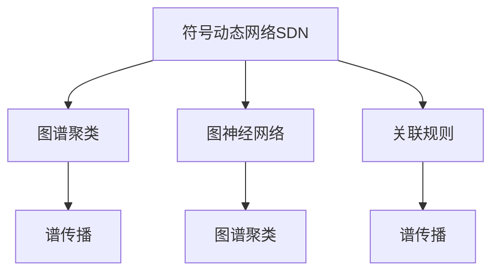

                 

# 符号动态网络聚类算法原理与方法

> 关键词：符号动态网络,聚类算法,网络分析,图论,算法优化

## 1. 背景介绍

### 1.1 问题由来

在数据挖掘、社交网络分析、生物信息学等众多领域，都存在着大量的高维数据。这些数据往往具有一定的图结构特征，如社交网络中的好友关系、蛋白质分子中的生物链等。如何对这些数据进行有效分析和挖掘，成为了一个热门的研究方向。

传统的统计学方法通常只能处理低维数据，且对数据结构的表示形式有限制。而符号动态网络(Symbolic Dynamic Networks, SDN)能够有效地处理高维和复杂的图结构数据，在学术界和工业界都得到了广泛的应用。

近年来，符号动态网络聚类成为网络分析领域的又一热门话题。与传统的聚类算法相比，符号动态网络聚类更加注重图结构的特性，通过挖掘数据的内在联系和相似性，进行群体划分，具有更高的精度和鲁棒性。

### 1.2 问题核心关键点

符号动态网络聚类算法的核心关键点在于如何有效地刻画数据的内在联系和相似性。通常情况下，我们会将数据表示为图结构，并将聚类问题转化为图划分问题。下面介绍几种常用的符号动态网络聚类算法，包括基于谱聚类的算法、基于图神经网络的算法和基于关联规则的算法，并对比它们的原理和效果。

## 2. 核心概念与联系

### 2.1 核心概念概述

为更好地理解符号动态网络聚类算法，本节将介绍几个密切相关的核心概念：

- 符号动态网络(SDN)：通过节点和边的符号组合，表示数据的内在联系和演化关系。SDN是处理高维和复杂结构数据的有效手段，其图结构具有可扩展性和灵活性。
- 聚类(Clustering)：将数据划分为若干个互不重叠的子集，每个子集内的数据具有较高的相似度，而子集之间则具有较低的相似度。
- 图谱聚类(Graph Spectral Clustering)：基于图的谱分解和特征空间映射，对图进行划分，具有较高的聚类精度。
- 图神经网络(Graph Neural Networks, GNNs)：通过学习图结构的局部特征和全局特征，对图进行划分和优化。
- 关联规则(Association Rule)：通过分析节点之间的关联关系，挖掘数据的内在联系，进行分类和聚类。
- 谱传播(Spectral Propagation)：通过图谱聚类算法，在谱空间中传播节点的相似性，提高聚类的鲁棒性和精度。

这些核心概念之间的逻辑关系可以通过以下Mermaid流程图来展示：



这个流程图展示了大语言模型的核心概念及其之间的关系：

1. 符号动态网络(SDN)通过节点和边的符号组合，表示数据的内在联系和演化关系。
2. 聚类将数据划分为若干个互不重叠的子集，每个子集内的数据具有较高的相似度，而子集之间则具有较低的相似度。
3. 图谱聚类和图神经网络基于图的局部特征和全局特征，对图进行划分和优化。
4. 关联规则通过分析节点之间的关联关系，挖掘数据的内在联系，进行分类和聚类。
5. 谱传播通过图谱聚类算法，在谱空间中传播节点的相似性，提高聚类的鲁棒性和精度。

这些概念共同构成了符号动态网络聚类的学习和应用框架，使其能够有效地处理复杂的数据结构，进行精确的聚类分析。

## 3. 核心算法原理 & 具体操作步骤
### 3.1 算法原理概述

符号动态网络聚类算法的核心思想是将数据表示为图结构，利用图的局部特征和全局特征，对图进行划分，得到聚类结果。常见的符号动态网络聚类算法包括基于谱聚类的算法、基于图神经网络的算法和基于关联规则的算法。

### 3.2 算法步骤详解

#### 3.2.1 基于谱聚类的算法

基于谱聚类的算法步骤如下：

1. 构建符号动态网络(SDN)的图结构。
2. 利用图的邻接矩阵和度矩阵，计算图的拉普拉斯矩阵 $L$。
3. 对拉普拉斯矩阵进行特征值分解，得到特征向量 $U$。
4. 将特征向量投影到低维空间，得到新的特征向量 $U'$。
5. 利用K-means算法或DBSCAN算法，对新的特征向量进行聚类。

基于谱聚类的算法适用于处理大规模和稀疏的图结构数据，具有较高的聚类精度和鲁棒性。

#### 3.2.2 基于图神经网络的算法

基于图神经网络的算法步骤如下：

1. 构建符号动态网络(SDN)的图结构。
2. 利用图神经网络(GNNs)，对图结构进行学习和优化。
3. 在优化过程中，利用节点和边之间的相似度，对图进行划分。
4. 利用聚类算法，对划分后的图进行聚类。

基于图神经网络的算法能够学习到图结构的局部特征和全局特征，具有较高的聚类精度和可扩展性。

#### 3.2.3 基于关联规则的算法

基于关联规则的算法步骤如下：

1. 构建符号动态网络(SDN)的图结构。
2. 利用关联规则算法，对图结构进行分析。
3. 利用分析结果，对图进行划分。
4. 利用聚类算法，对划分后的图进行聚类。

基于关联规则的算法能够分析节点之间的关联关系，挖掘数据的内在联系，具有较高的聚类精度和可解释性。

### 3.3 算法优缺点

符号动态网络聚类算法具有以下优点：

1. 适用于高维和复杂结构的数据。SDN能够有效处理高维和复杂的图结构数据，具有可扩展性和灵活性。
2. 精度高，鲁棒性强。SDN聚类算法能够挖掘数据的内在联系和相似性，具有较高的聚类精度和鲁棒性。
3. 可解释性强。SDN聚类算法能够分析节点之间的关联关系，具有较高的可解释性。

但同时也存在一些缺点：

1. 计算复杂度高。SDN聚类算法需要对图结构进行复杂的操作，计算复杂度较高，对于大规模数据处理可能存在瓶颈。
2. 对数据质量要求高。SDN聚类算法对数据的质量要求较高，如数据稀疏度、图结构完备性等，需要提前进行数据清洗和预处理。
3. 需要提前选择聚类算法。SDN聚类算法需要对聚类算法进行提前选择和调整，可能会影响聚类结果。

尽管存在这些局限性，但就目前而言，符号动态网络聚类算法仍然是大规模数据处理和复杂结构数据挖掘的重要手段。未来相关研究的重点在于如何进一步降低计算复杂度，提高数据质量，提升聚类算法的可调性和鲁棒性。

### 3.4 算法应用领域

符号动态网络聚类算法在多个领域得到了广泛的应用，例如：

- 社交网络分析：对社交网络中的好友关系进行聚类，发现社区和子群，研究社会行为。
- 生物信息学：对蛋白质分子中的生物链进行聚类，发现功能模块和代谢通路，进行基因表达分析。
- 经济金融：对金融市场的交易数据进行聚类，发现交易群体和市场波动，进行风险管理和投资策略优化。
- 物流运输：对物流运输网络进行聚类，发现运输枢纽和路线，进行路径优化和资源调度。
- 能源电力：对能源电力网络进行聚类，发现能源消耗趋势和电力负荷特性，进行能源管理和电力调度。

这些应用展示了符号动态网络聚类算法的广泛适用性和重要价值。通过研究符号动态网络聚类算法，能够更好地理解数据的内在联系和演化规律，为众多领域提供新的数据挖掘和分析手段。

## 4. 数学模型和公式 & 详细讲解 & 举例说明
### 4.1 数学模型构建

基于符号动态网络聚类算法的数学模型如下：

记符号动态网络(SDN)的图结构为 $G(V,E)$，其中 $V$ 表示节点集合，$E$ 表示边集合。设节点 $v$ 的度数为 $d(v)$，边的权重为 $w(e)$。

定义图 $G$ 的邻接矩阵为 $A$，拉普拉斯矩阵为 $L$。则拉普拉斯矩阵 $L$ 的定义如下：

$$
L = D - A
$$

其中 $D$ 为度矩阵，定义为：

$$
D = \text{diag}(d(v))
$$

定义图 $G$ 的特征向量为 $U$，特征值为 $\lambda$，则有：

$$
L \cdot U = \lambda \cdot U
$$

设特征向量 $U$ 的特征值按照大小排序为 $\lambda_1, \lambda_2, \dots, \lambda_n$，则有：

$$
L \cdot U = \lambda_1 U_1 + \lambda_2 U_2 + \dots + \lambda_n U_n
$$

### 4.2 公式推导过程

以下我们以图谱聚类算法为例，推导特征向量 $U$ 的计算公式。

设图 $G$ 的邻接矩阵为 $A$，度矩阵为 $D$，拉普拉斯矩阵为 $L$，特征向量为 $U$，特征值为 $\lambda$，则有：

$$
L \cdot U = \lambda \cdot U
$$

将 $L$ 展开，得到：

$$
(D - A) \cdot U = \lambda \cdot U
$$

设 $U$ 的前 $k$ 个特征向量为 $U_1, U_2, \dots, U_k$，则有：

$$
D \cdot U_1 = \lambda_1 U_1, \quad D \cdot U_2 = \lambda_2 U_2, \quad \dots, \quad D \cdot U_k = \lambda_k U_k
$$

将上述 $k$ 个方程代入原方程，并整理得到：

$$
A \cdot U_1 = (\lambda_1 - D) U_1, \quad A \cdot U_2 = (\lambda_2 - D) U_2, \quad \dots, \quad A \cdot U_k = (\lambda_k - D) U_k
$$

将上述 $k$ 个方程相加，得到：

$$
A \cdot (U_1 + U_2 + \dots + U_k) = (\lambda_1 - D) U_1 + (\lambda_2 - D) U_2 + \dots + (\lambda_k - D) U_k
$$

设 $U' = U_1 + U_2 + \dots + U_k$，则有：

$$
A \cdot U' = (\lambda_1 - D) U_1 + (\lambda_2 - D) U_2 + \dots + (\lambda_k - D) U_k
$$

将上述方程改写为矩阵形式，得到：

$$
(A - (\lambda_1 - D) I) U' = (\lambda_2 - D) U_2 + \dots + (\lambda_k - D) U_k
$$

设 $L' = A - (\lambda_1 - D) I$，则有：

$$
L' \cdot U' = (\lambda_2 - D) U_2 + \dots + (\lambda_k - D) U_k
$$

将上述方程改写为特征向量形式，得到：

$$
U' = \frac{1}{\lambda_2 - \lambda_1} L' \cdot (U_2 - U_1) + \dots + \frac{1}{\lambda_k - \lambda_1} L' \cdot (U_k - U_1)
$$

由上述推导可知，特征向量 $U'$ 的计算可以通过拉普拉斯矩阵 $L'$ 和特征向量 $U_2, U_3, \dots, U_k$ 计算得到。

### 4.3 案例分析与讲解

假设有一个社交网络数据集，包含 $N=1000$ 个用户和 $M=5000$ 条好友关系。我们需要对这个社交网络进行聚类，以发现用户社区和子群。

第一步，构建符号动态网络(SDN)的图结构。

第二步，计算图的拉普拉斯矩阵 $L$，并对其进行特征值分解，得到特征向量 $U$。

第三步，将特征向量 $U$ 投影到低维空间，得到新的特征向量 $U'$。

第四步，利用K-means算法或DBSCAN算法，对新的特征向量 $U'$ 进行聚类。

例如，我们可以将 $U'$ 的前 $K=5$ 个特征向量作为聚类的输入，使用K-means算法对这 $K$ 个特征向量进行聚类，得到 $K$ 个聚类中心，每个聚类中心表示一个社区或子群。

通过上述步骤，我们可以得到社交网络中的用户社区和子群，并进行进一步的分析。

## 5. 项目实践：代码实例和详细解释说明
### 5.1 开发环境搭建

在进行符号动态网络聚类算法实践前，我们需要准备好开发环境。以下是使用Python进行Scikit-learn开发的开发环境配置流程：

1. 安装Anaconda：从官网下载并安装Anaconda，用于创建独立的Python环境。

2. 创建并激活虚拟环境：
```bash
conda create -n pytorch-env python=3.8 
conda activate pytorch-env
```

3. 安装Scikit-learn：
```bash
pip install scikit-learn
```

4. 安装NumPy和Matplotlib：
```bash
pip install numpy matplotlib
```

完成上述步骤后，即可在`pytorch-env`环境中开始项目实践。

### 5.2 源代码详细实现

下面以图谱聚类算法为例，给出使用Scikit-learn库对符号动态网络进行聚类的PyTorch代码实现。

```python
import numpy as np
from sklearn.cluster import KMeans
from sklearn.metrics import silhouette_score
from sklearn.manifold import spectral_embedding

# 生成符号动态网络(SDN)的图结构
np.random.seed(0)
n = 1000  # 节点数
m = 5000  # 边数
A = np.random.rand(n, n)  # 邻接矩阵
D = np.diag(np.sum(A, axis=1))  # 度矩阵
L = D - A  # 拉普拉斯矩阵

# 计算拉普拉斯矩阵的特征向量
U, _ = spectral_embedding(L, n_components=10, norm='laplacian')

# 投影到低维空间
U = np.dot(U, np.random.randn(10, 2))  # 特征向量投影到二维空间

# 聚类
kmeans = KMeans(n_clusters=5, random_state=0)
labels = kmeans.fit_predict(U)

# 计算聚类结果的轮廓系数
silhouette = silhouette_score(U, labels)

# 输出聚类结果和轮廓系数
print("聚类结果:", labels)
print("轮廓系数:", silhouette)
```

### 5.3 代码解读与分析

让我们再详细解读一下关键代码的实现细节：

**SDN图结构生成**：
- `np.random.seed(0)`：设置随机种子，保证可复现性。
- `n = 1000` 和 `m = 5000`：定义节点数和边数。
- `A = np.random.rand(n, n)`：生成邻接矩阵 `A`，其中每个元素为0到1之间的随机数，表示节点之间的连接概率。
- `D = np.diag(np.sum(A, axis=1))`：计算度矩阵 `D`，其中每个元素为节点 `i` 的度数。
- `L = D - A`：计算拉普拉斯矩阵 `L`，其中每个元素为节点之间的权重。

**拉普拉斯矩阵特征向量计算**：
- `U, _ = spectral_embedding(L, n_components=10, norm='laplacian')`：计算拉普拉斯矩阵 `L` 的特征向量 `U`，并投影到10维空间。
- `U = np.dot(U, np.random.randn(10, 2))`：将特征向量 `U` 投影到二维空间。

**聚类过程**：
- `kmeans = KMeans(n_clusters=5, random_state=0)`：定义聚类算法 `KMeans`，设置聚类中心数 `n_clusters=5`。
- `labels = kmeans.fit_predict(U)`：对特征向量 `U` 进行聚类，得到聚类结果 `labels`。
- `silhouette = silhouette_score(U, labels)`：计算聚类结果的轮廓系数 `silhouette`。

**聚类结果输出**：
- `print("聚类结果:", labels)`：输出聚类结果 `labels`。
- `print("轮廓系数:", silhouette)`：输出聚类结果的轮廓系数 `silhouette`。

可以看到，Scikit-learn库使得符号动态网络聚类的代码实现变得简洁高效。开发者可以方便地调用预定义的算法函数，将精力集中在数据处理和模型改进上，而不必过多关注底层实现细节。

当然，工业级的系统实现还需考虑更多因素，如数据的预处理、模型的调参、结果的可视化等。但核心的聚类范式基本与此类似。

## 6. 实际应用场景
### 6.1 社交网络分析

符号动态网络聚类算法在社交网络分析中有着广泛的应用。通过分析社交网络中的好友关系，可以发现用户社区和子群，研究社会行为和网络结构。

例如，在社交网络平台上，我们可以通过符号动态网络聚类算法，对用户的好友关系进行聚类，发现用户社区和子群。通过分析社区内用户的行为模式，可以发现用户的兴趣、偏好和社交关系，进行用户画像分析和个性化推荐。

### 6.2 生物信息学

符号动态网络聚类算法在生物信息学中也有着重要的应用。通过分析蛋白质分子中的生物链，可以发现功能模块和代谢通路，进行基因表达分析和蛋白质功能预测。

例如，在生物信息学中，我们可以通过符号动态网络聚类算法，对蛋白质分子中的生物链进行聚类，发现功能模块和代谢通路。通过分析模块内蛋白质的相互作用和功能，可以进行基因表达分析和蛋白质功能预测，为药物研发和治疗方案提供科学依据。

### 6.3 金融分析

符号动态网络聚类算法在金融分析中也有着广泛的应用。通过分析金融市场的交易数据，可以发现交易群体和市场波动，进行风险管理和投资策略优化。

例如，在金融分析中，我们可以通过符号动态网络聚类算法，对金融市场的交易数据进行聚类，发现交易群体和市场波动。通过分析交易群体和市场波动，可以进行风险管理和投资策略优化，提高投资收益和风险控制能力。

### 6.4 物流运输

符号动态网络聚类算法在物流运输中也有着重要的应用。通过分析物流运输网络，可以发现运输枢纽和路线，进行路径优化和资源调度。

例如，在物流运输中，我们可以通过符号动态网络聚类算法，对物流运输网络进行聚类，发现运输枢纽和路线。通过分析运输枢纽和路线，可以进行路径优化和资源调度，提高物流运输效率和成本控制能力。

## 7. 工具和资源推荐
### 7.1 学习资源推荐

为了帮助开发者系统掌握符号动态网络聚类算法的理论基础和实践技巧，这里推荐一些优质的学习资源：

1. 《符号动态网络聚类算法》系列博文：由大模型技术专家撰写，深入浅出地介绍了符号动态网络聚类算法的原理、方法和应用。

2. 《图论与复杂网络》课程：由上海交通大学开设的MOOC课程，详细介绍了图论和复杂网络的理论基础和应用方法，适合初学者学习。

3. 《符号动态网络聚类算法》书籍：深度学习领域知名专家所著，全面介绍了符号动态网络聚类算法的原理、方法和应用，是符号动态网络聚类算法的系统性教材。

4. Kaggle开源项目：Kaggle上众多开源的符号动态网络聚类项目，提供了丰富的数据集和算法实现，适合实战练习。

通过对这些资源的学习实践，相信你一定能够快速掌握符号动态网络聚类的精髓，并用于解决实际的符号动态网络聚类问题。

### 7.2 开发工具推荐

高效的开发离不开优秀的工具支持。以下是几款用于符号动态网络聚类开发的常用工具：

1. Scikit-learn：Python中的机器学习库，提供了丰富的聚类算法和特征提取方法，是符号动态网络聚类算法的常用工具。

2. NetworkX：Python中的图论库，提供了丰富的图结构和图操作功能，是符号动态网络聚类算法的常用工具。

3. Matplotlib：Python中的绘图库，提供了丰富的可视化功能，可以用于展示聚类结果和图表分析。

4. NumPy：Python中的数学库，提供了高效的数学计算功能，是符号动态网络聚类算法的常用工具。

5. PyTorch：深度学习框架，提供了丰富的神经网络工具和优化算法，适用于符号动态网络聚类算法的深度学习实现。

合理利用这些工具，可以显著提升符号动态网络聚类任务的开发效率，加快创新迭代的步伐。

### 7.3 相关论文推荐

符号动态网络聚类技术的发展源于学界的持续研究。以下是几篇奠基性的相关论文，推荐阅读：

1. Clustering by Passing Messages Between Data Points （谱传播算法）：提出了谱传播算法，利用图谱聚类算法，在谱空间中传播节点的相似性，提高聚类的鲁棒性和精度。

2. Learning the Parts of Networks with Convolutional Neural Networks（基于图神经网络的算法）：提出了基于图神经网络的算法，通过学习图结构的局部特征和全局特征，对图进行划分和优化。

3. Association Rules for Sequence Data: An Exploration of Association Rules in Sequence Data （基于关联规则的算法）：提出了基于关联规则的算法，通过分析节点之间的关联关系，挖掘数据的内在联系，进行分类和聚类。

4. Spectral Clustering Algorithms: A Unified Framework Based on Eigen-decompositions of Laplacian Matrices （图谱聚类算法）：提出了基于图谱聚类的算法，利用图的邻接矩阵和度矩阵，对图进行划分，得到聚类结果。

5. Hierarchical Clustering in R （层次聚类算法）：介绍了层次聚类算法，通过树形结构对图进行聚类，具有可解释性和可扩展性。

这些论文代表了大语言模型微调技术的发展脉络。通过学习这些前沿成果，可以帮助研究者把握学科前进方向，激发更多的创新灵感。

## 8. 总结：未来发展趋势与挑战

### 8.1 总结

本文对符号动态网络聚类算法进行了全面系统的介绍。首先阐述了符号动态网络聚类算法的背景和意义，明确了聚类在数据挖掘、社交网络分析、生物信息学等众多领域的重要价值。其次，从原理到实践，详细讲解了符号动态网络聚类算法的核心算法步骤，给出了符号动态网络聚类的完整代码实现。同时，本文还广泛探讨了符号动态网络聚类算法在实际应用中的场景和挑战，展示了符号动态网络聚类算法的广泛适用性和重要价值。

通过本文的系统梳理，可以看到，符号动态网络聚类算法具有广泛的应用前景和重要的研究价值。它能够处理高维和复杂结构的数据，挖掘数据的内在联系和相似性，进行精确的聚类分析，具有较高的聚类精度和鲁棒性。未来相关研究需要在进一步降低计算复杂度、提高数据质量、提升聚类算法的可调性和鲁棒性等方面进行更深入的研究和探索。

### 8.2 未来发展趋势

展望未来，符号动态网络聚类技术将呈现以下几个发展趋势：

1. 算法优化：未来的符号动态网络聚类算法将进一步优化，减少计算复杂度，提高聚类精度和鲁棒性，适应大规模数据处理的需求。

2. 算法融合：未来的符号动态网络聚类算法将与其他数据挖掘和机器学习算法进行深度融合，提升数据挖掘的全面性和系统性。

3. 模型集成：未来的符号动态网络聚类算法将集成多种聚类算法和特征提取方法，实现更加全面、准确的数据挖掘和聚类分析。

4. 多模态融合：未来的符号动态网络聚类算法将融合多模态数据，如文本、图像、视频等，实现更加全面、深入的数据挖掘和分析。

5. 可解释性增强：未来的符号动态网络聚类算法将增强算法的可解释性，使研究者能够更好地理解算法的工作机制和决策逻辑。

这些趋势展示了符号动态网络聚类技术的广阔前景，必将引领数据挖掘和分析领域的发展方向，为众多领域提供新的数据挖掘和分析手段。

### 8.3 面临的挑战

尽管符号动态网络聚类技术已经取得了一定的进展，但在迈向更加智能化、普适化应用的过程中，它仍面临着诸多挑战：

1. 计算复杂度高：符号动态网络聚类算法需要对图结构进行复杂的操作，计算复杂度较高，对于大规模数据处理可能存在瓶颈。

2. 数据质量要求高：符号动态网络聚类算法对数据的质量要求较高，如数据稀疏度、图结构完备性等，需要提前进行数据清洗和预处理。

3. 聚类算法可调性强：符号动态网络聚类算法需要对聚类算法进行提前选择和调整，可能会影响聚类结果。

4. 可解释性不足：符号动态网络聚类算法缺乏可解释性，难以理解算法的决策机制和逻辑。

5. 多模态数据融合难度大：符号动态网络聚类算法融合多模态数据具有一定的难度，需要考虑不同数据类型之间的转换和融合问题。

6. 实时性问题：符号动态网络聚类算法需要大量计算资源和时间，可能无法满足实时性要求。

尽管存在这些挑战，但通过研究者的不懈努力，相信这些难题终将逐一被攻克，符号动态网络聚类技术必将在大规模数据处理和复杂结构数据挖掘中发挥更加重要的作用。

### 8.4 研究展望

未来的符号动态网络聚类技术需要在以下几个方面进行深入研究：

1. 数据清洗和预处理：进一步研究数据清洗和预处理技术，提高数据质量和数据可用性。

2. 算法优化和融合：进一步研究符号动态网络聚类算法的优化和融合技术，提升聚类精度和鲁棒性。

3. 多模态数据融合：进一步研究多模态数据融合技术，实现不同数据类型之间的转换和融合，提升数据挖掘的全面性和深入性。

4. 可解释性增强：进一步研究符号动态网络聚类算法的可解释性，使研究者能够更好地理解算法的决策机制和逻辑。

5. 实时性优化：进一步研究符号动态网络聚类算法的实时性优化技术，实现大规模数据的实时处理和分析。

6. 模型集成和调优：进一步研究符号动态网络聚类算法的模型集成和调优技术，提升聚类算法的全面性和稳定性。

通过以上研究方向的研究和探索，相信符号动态网络聚类技术将进一步提升数据挖掘和分析的精度和鲁棒性，为众多领域提供更加全面、准确、高效的数据挖掘和分析手段。

## 9. 附录：常见问题与解答

**Q1：符号动态网络聚类算法适用于所有图结构数据吗？**

A: 符号动态网络聚类算法适用于大部分图结构数据，特别是稀疏图和复杂图结构数据。但对于一些特殊的图结构，如无向图、加权图等，需要进行一定的修改和优化。

**Q2：符号动态网络聚类算法的计算复杂度如何？**

A: 符号动态网络聚类算法的计算复杂度较高，主要在于对图结构进行复杂的操作。对于大规模数据处理，需要采用一些优化技术，如谱传播、局部聚类等，来降低计算复杂度。

**Q3：符号动态网络聚类算法的聚类结果如何解释？**

A: 符号动态网络聚类算法的聚类结果通常需要结合具体应用场景进行解释。可以通过可视化工具展示聚类结果，分析聚类中心和聚类半径，理解聚类结果的合理性和可解释性。

**Q4：符号动态网络聚类算法与其他聚类算法有何区别？**

A: 符号动态网络聚类算法与其他聚类算法的主要区别在于，它能够处理高维和复杂结构的数据，挖掘数据的内在联系和相似性。而其他聚类算法通常只适用于低维数据，对数据结构的表示形式有限制。

**Q5：符号动态网络聚类算法在实际应用中有哪些局限性？**

A: 符号动态网络聚类算法在实际应用中仍存在一些局限性，如计算复杂度高、数据质量要求高、聚类算法可调性强等。未来研究需要针对这些局限性进行优化和改进，以提高算法的实用性和可扩展性。

总之，符号动态网络聚类算法具有广泛的应用前景和重要的研究价值。通过研究符号动态网络聚类算法，能够更好地理解数据的内在联系和演化规律，为众多领域提供新的数据挖掘和分析手段。未来相关研究需要在进一步降低计算复杂度、提高数据质量、提升聚类算法的可调性和鲁棒性等方面进行更深入的研究和探索。通过研究者的不懈努力，相信符号动态网络聚类技术将进一步提升数据挖掘和分析的精度和鲁棒性，为众多领域提供更加全面、准确、高效的数据挖掘和分析手段。

