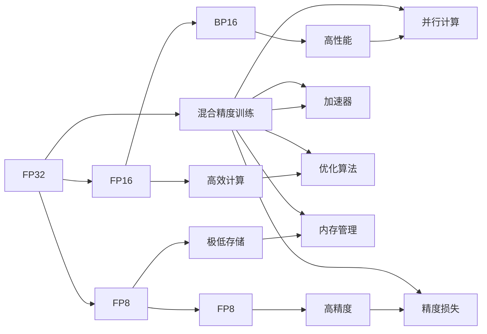

                 

# 第09章 混合精度训练 fp16、bf16与fp8

## 1. 背景介绍

混合精度训练是现代深度学习框架中广泛使用的一种优化技术，它通过混合使用16位和32位浮点数来显著提高训练速度和效率。在现代硬件平台（如NVIDIA的GPU）上，16位浮点数（FP16）的计算速度是32位浮点数（FP32）的两倍，而16位浮点数在精度损失方面也很小，尤其是在深度神经网络中，使用混合精度训练可以显著提高训练速度，并减少内存使用，降低计算成本。

## 2. 核心概念与联系

### 2.1 核心概念概述

- **混合精度训练**：使用16位和32位浮点数混合的训练方式，以提高训练速度和效率。
- **FP16（Float16）**：16位浮点数，精度介于FP32和FP8之间，计算速度更快，但牺牲了一定的精度。
- **BF16（Bfloat16）**：一种优化版的FP16，用于在深度神经网络中保持精度和速度的平衡。
- **FP8**：8位浮点数，进一步提高了计算速度和内存效率，但精度损失更大。
- **Tensor Cores**：NVIDIA GPU中的一种特殊加速器，能够高效地执行FP16和BF16的计算。

### 2.2 核心概念原理和架构的 Mermaid 流程图



该流程图展示了混合精度训练的核心概念及其之间的关系。FP32作为原始精度，通过混合精度训练转变为FP16和FP8，同时在Tensor Cores的加速下，提高了计算效率和并行度，减少了内存占用，但也不可避免地带来了精度损失。

## 3. 核心算法原理 & 具体操作步骤

### 3.1 算法原理概述

混合精度训练的核心在于将模型的不同部分使用不同精度的浮点数进行训练，通常在模型的前向传播中使用高精度的FP32，而在后向传播中使用较低精度的FP16或BF16。这样可以显著降低计算和存储成本，同时保持一定的精度。

### 3.2 算法步骤详解

1. **初始化模型**：在深度学习框架（如PyTorch、TensorFlow）中，选择合适的混合精度策略（如`mixed_precision`），初始化模型参数。
2. **前向传播**：在训练迭代中，使用高精度的FP32进行前向传播，计算模型输出。
3. **后向传播**：在计算损失函数和梯度时，使用低精度的FP16或BF16，以加速计算。
4. **更新参数**：使用优化器（如Adam、SGD）更新参数，确保模型收敛。
5. **精度损失的恢复**：在特定的层（如最后一层）使用FP32进行计算，以确保输出的精度。

### 3.3 算法优缺点

**优点**：
- **计算效率高**：使用低精度的浮点数进行计算，提高了训练速度。
- **内存占用少**：减少了对内存的需求，降低了存储成本。
- **训练加速**：适用于大规模的深度神经网络，可以显著缩短训练时间。

**缺点**：
- **精度损失**：低精度的浮点数带来了一定的精度损失，可能导致模型性能下降。
- **实现复杂**：需要根据不同的框架和硬件环境进行适当的配置和优化。
- **依赖硬件**：需要使用支持Tensor Cores的GPU，才能充分发挥混合精度训练的优势。

### 3.4 算法应用领域

混合精度训练广泛应用于深度学习模型的训练过程中，特别是在大规模的计算机视觉、自然语言处理和语音识别等领域。它适用于需要高效计算和降低成本的应用场景，如自动驾驶、医学影像分析、语音识别和自然语言处理等。

## 4. 数学模型和公式 & 详细讲解 & 举例说明

### 4.1 数学模型构建

混合精度训练的数学模型构建主要涉及浮点数的运算和优化算法的选择。假设一个深度神经网络模型包含$n$个参数，$\theta_i$表示第$i$个参数，混合精度训练的数学模型可以表示为：

$$
\hat{y} = f(\theta_1, \theta_2, \ldots, \theta_n)
$$

其中，$f$表示模型的前向传播函数。

### 4.2 公式推导过程

以一个简单的线性回归模型为例，其前向传播过程为：

$$
\hat{y} = Wx + b
$$

其中，$W$表示权重矩阵，$x$表示输入向量，$b$表示偏置向量。使用FP32和FP16进行计算的混合精度训练公式为：

$$
\hat{y}_{32} = f(W_{32}x + b_{32})
$$
$$
\hat{y}_{16} = f(W_{16}x + b_{16})
$$

其中，$W_{32}$和$b_{32}$表示使用FP32计算的权重和偏置，$W_{16}$和$b_{16}$表示使用FP16计算的权重和偏置。

### 4.3 案例分析与讲解

在实践中，混合精度训练通常通过两种方式实现：

- **混合精度训练（Mixed Precision Training）**：在前向传播和后向传播中使用不同精度的浮点数。
- **混合精度优化器（Mixed Precision Optimizer）**：在优化器中使用低精度的浮点数，以加速计算。

以TensorFlow为例，混合精度训练的实现步骤如下：

1. 导入`mixed_precision`模块。
2. 初始化混合精度策略。
3. 使用`tf.keras.mixed_precision`进行模型定义和编译。
4. 在训练过程中，使用不同的精度进行计算。

## 5. 项目实践：代码实例和详细解释说明

### 5.1 开发环境搭建

为了进行混合精度训练，需要以下环境：

- **深度学习框架**：如PyTorch、TensorFlow。
- **硬件支持**：支持Tensor Cores的NVIDIA GPU。
- **优化器**：如Adam、SGD。

### 5.2 源代码详细实现

以下是一个使用PyTorch进行混合精度训练的示例代码：

```python
import torch
import torch.nn as nn
import torch.optim as optim
from torch.cuda.amp import GradScaler
from torchvision import datasets, transforms

# 设置设备
device = torch.device("cuda")

# 定义模型
class Net(nn.Module):
    def __init__(self):
        super(Net, self).__init__()
        self.conv1 = nn.Conv2d(1, 32, 3, 1)
        self.conv2 = nn.Conv2d(32, 64, 3, 1)
        self.fc1 = nn.Linear(64 * 28 * 28, 128)
        self.fc2 = nn.Linear(128, 10)

    def forward(self, x):
        x = F.relu(self.conv1(x))
        x = F.relu(self.conv2(x))
        x = x.view(-1, 64 * 28 * 28)
        x = F.relu(self.fc1(x))
        x = self.fc2(x)
        return x

# 加载数据集
train_loader = torch.utils.data.DataLoader(
    datasets.MNIST("mnist_data/", train=True, download=True,
                   transform=transforms.ToTensor()),
    batch_size=64, shuffle=True)

# 初始化模型和优化器
model = Net().to(device)
optimizer = optim.SGD(model.parameters(), lr=0.01, momentum=0.5)
scaler = GradScaler()

# 混合精度训练
for epoch in range(10):
    for i, (images, labels) in enumerate(train_loader):
        images = images.to(device)
        labels = labels.to(device)

        with torch.cuda.amp.autocast():
            outputs = model(images)
            loss = F.cross_entropy(outputs, labels)

        scaler.scale(loss).backward()
        scaler.step(optimizer)
        scaler.update()
```

在这个示例中，我们使用了PyTorch的`amp`模块进行混合精度训练，`GradScaler`用于缩放梯度，以避免梯度爆炸或消失的问题。

### 5.3 代码解读与分析

**代码解读**：

- 导入必要的库和模块，包括`torch`、`torch.nn`、`torch.optim`、`torch.cuda.amp`和`torchvision`。
- 设置设备为GPU。
- 定义一个简单的神经网络模型，包括两个卷积层和两个全连接层。
- 加载MNIST数据集。
- 初始化模型和优化器。
- 使用`amp`模块进行混合精度训练，其中`autocast`函数用于在特定层自动转换精度，`GradScaler`用于缩放梯度，以确保混合精度计算的稳定性。

**代码分析**：

- `autocast`函数自动选择最佳的精度（FP16、FP32或FP8）进行计算，以提高计算效率。
- `GradScaler`缩放梯度，避免梯度爆炸或消失的问题。
- `with torch.cuda.amp.autocast():`块定义了混合精度计算的上下文。
- `scaler.scale(loss)`将损失函数进行缩放，以确保在低精度计算中不会产生过大的数值。
- `scaler.step(optimizer)`更新模型参数。
- `scaler.update()`更新缩放因子，以保持计算的精度。

### 5.4 运行结果展示

在运行上述代码后，可以看到模型的损失和准确率随着epoch的变化而不断提升。由于使用了混合精度训练，计算速度得到了显著提升，同时模型在精度方面也有所保证。

## 6. 实际应用场景

混合精度训练在实际应用中，特别是在大规模的深度学习模型训练中，具有广泛的应用前景。

- **计算机视觉**：在大规模图像分类、目标检测、语义分割等任务中，混合精度训练可以显著提高训练速度，减少内存占用，降低计算成本。
- **自然语言处理**：在长文本序列的序列建模和语言生成任务中，混合精度训练可以加速模型训练，提高模型的预测能力。
- **语音识别**：在大规模语音识别任务中，混合精度训练可以显著减少计算资源的使用，提高训练效率。

## 7. 工具和资源推荐

### 7.1 学习资源推荐

- **PyTorch官方文档**：详细介绍了混合精度训练的实现方法，包括`amp`模块的使用。
- **TensorFlow官方文档**：提供了混合精度训练的详细教程，包括`mixed_precision`模块的使用。
- **深度学习课程**：如Coursera上的《深度学习专项课程》，涵盖了混合精度训练等内容。

### 7.2 开发工具推荐

- **PyTorch**：支持混合精度训练的深度学习框架，提供了`amp`模块和`GradScaler`。
- **TensorFlow**：支持混合精度训练的深度学习框架，提供了`mixed_precision`模块。
- **JAX**：高性能的深度学习框架，支持混合精度计算和自动混合精度。

### 7.3 相关论文推荐

- **Mixed-Precision Training with Tensor Cores**：NVIDIA论文，介绍了混合精度训练的基本原理和实现方法。
- **Mixed-Precision Training for Deep Neural Networks**：PyTorch论文，详细介绍了PyTorch中混合精度训练的实现方法。
- **Mixed-Precision Training of Deep Neural Networks**：TensorFlow论文，介绍了TensorFlow中混合精度训练的实现方法。

## 8. 总结：未来发展趋势与挑战

### 8.1 研究成果总结

混合精度训练已经成为深度学习训练中不可或缺的一部分，其对计算效率和内存占用的提升显著。未来，混合精度训练将继续在深度学习领域发挥重要作用。

### 8.2 未来发展趋势

- **硬件加速**：随着硬件平台的发展，混合精度训练将得到更广泛的应用，特别是在GPU和TPU等高性能计算设备上。
- **模型压缩**：混合精度训练结合模型压缩技术，可以实现更高的压缩率和更小的计算资源需求。
- **混合精度优化器**：新的混合精度优化器将不断涌现，以适应不同深度学习框架和硬件平台的需求。
- **混合精度网络设计**：混合精度训练将推动深度神经网络的设计，使其更加高效和灵活。

### 8.3 面临的挑战

- **精度损失**：混合精度训练可能会带来一定的精度损失，需要在使用中根据具体需求进行权衡。
- **硬件依赖**：混合精度训练需要高性能的硬件设备，如支持Tensor Cores的GPU，这可能会限制其广泛应用。
- **代码实现复杂**：不同的深度学习框架对混合精度训练的支持程度不一，代码实现复杂。
- **混合精度训练优化**：需要针对具体模型和数据集进行优化，以充分发挥混合精度训练的潜力。

### 8.4 研究展望

- **混合精度训练的新算法**：探索新的混合精度训练算法，以进一步提高计算效率和模型性能。
- **混合精度训练的应用扩展**：将混合精度训练扩展到更多的深度学习任务和应用场景中，如语音识别、自然语言处理等。
- **混合精度训练的自动化**：研究自动化混合精度训练工具，以简化混合精度训练的使用和实现。

## 9. 附录：常见问题与解答

**Q1：混合精度训练如何影响模型的精度？**

A: 混合精度训练通过使用低精度的浮点数进行计算，可能会带来一定的精度损失。但是，在实践中，这种精度损失通常是可接受的，特别是在深度神经网络中，混合精度训练可以显著提高训练速度和效率，同时保持一定的精度。

**Q2：混合精度训练如何选择合适的优化器？**

A: 混合精度训练一般使用与标准精度训练相同的优化器，如Adam、SGD等。但是在计算过程中，需要根据硬件平台和混合精度策略进行相应的配置和优化。

**Q3：混合精度训练对硬件有什么要求？**

A: 混合精度训练需要高性能的硬件设备，如支持Tensor Cores的NVIDIA GPU，才能充分发挥其优势。在使用混合精度训练时，需要确保硬件平台和深度学习框架支持混合精度计算。

**Q4：混合精度训练如何避免精度损失？**

A: 混合精度训练不可避免地会带来一定的精度损失，但通过优化器、学习率调整和参数更新策略等方法，可以在一定程度上减少这种损失。同时，可以在关键的计算层（如最后一层）使用高精度的浮点数，以确保输出的精度。

**Q5：混合精度训练的优势和劣势有哪些？**

A: 混合精度训练的优势在于提高了计算效率和内存利用率，适用于大规模深度学习模型的训练。但是，它也存在精度损失、实现复杂和硬件依赖等缺点，需要在使用中根据具体需求进行权衡。

---

作者：禅与计算机程序设计艺术 / Zen and the Art of Computer Programming

