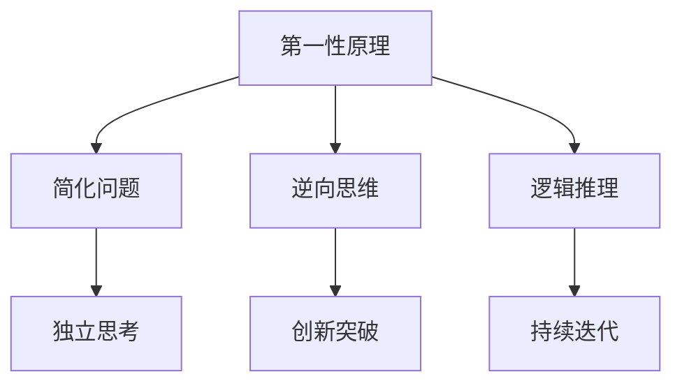

                 

# 第一性原理思维能力的培养

在当今这个快速变化、高度竞争的科技时代，第一性原理思维能力已成为每个创新者和企业家的必备素质。本文将深入探讨第一性原理的基本概念、思维模型、关键技术和实际应用，旨在帮助读者系统地掌握这一思考方式，提升解决问题的能力，从而在职业生涯和企业管理中取得更大的成功。

## 1. 背景介绍

### 1.1 问题由来

在科技创新和商业发展的过程中，创新者们常常面对不断涌现的新问题和挑战。为了保持竞争力，他们需要不断寻找创新方法和突破口。然而，传统的经验和规则有时并不能提供有效的解决方案，这时候，第一性原理思维就显得尤为重要。

第一性原理思维指的是基于事物最根本的本质和原始原理，不依赖于现有经验和假设，重新思考和构建问题的解决方法。这种思维方式不仅能打破常规思维，找到更为根本和创新的解决方案，还能帮助企业在市场竞争中保持优势，应对复杂和不确定的环境。

### 1.2 问题核心关键点

第一性原理思维的核心在于对事物本质的深入理解和思考，包括：
- 独立思考：不受现有经验和假设的束缚，从最基本的原理出发。
- 简化问题：将复杂问题简化为基本原理和关键要素。
- 创新突破：基于对事物本质的重新理解，创造出新的解决方案。
- 持续迭代：在实践中不断验证和改进思维方法，提高解决问题的能力。

## 2. 核心概念与联系

### 2.1 核心概念概述

为了更好地理解第一性原理思维，我们先介绍几个相关核心概念：

- **第一性原理**：指的是从最基本的原理出发，构建事物或问题的基础。例如，物理学中的牛顿三大运动定律就是宇宙运行的基本原理。
- **简化问题**：将复杂问题分解为更小、更基本的部分，使其更容易理解。例如，复杂计算算法可以分解为多个简单步骤。
- **逆向思维**：从结果反推原因，从终点回溯起点，寻找根本原因。
- **逻辑推理**：基于事实和原理，通过逻辑推理得出结论。

这些概念之间存在密切的联系，共同构成第一性原理思维的框架，帮助人们以系统、全面的方式解决问题。

### 2.2 核心概念原理和架构的 Mermaid 流程图



这个流程图展示了第一性原理思维的核心概念及其关系：
- **第一性原理**为基础，指导简化问题、逆向思维和逻辑推理。
- **简化问题**和**逆向思维**有助于更好地理解问题本质，从而进行独立思考。
- **逻辑推理**基于原理和事实，得出可行的解决方案。
- **独立思考**和**创新突破**推动持续迭代，不断优化解决方案。

这些概念共同作用，帮助创新者从根本上解决问题，寻找最优解决方案。

## 3. 核心算法原理 & 具体操作步骤

### 3.1 算法原理概述

第一性原理思维本质上是一种思想方法和思维方式，并非具体的算法或编程方法。其核心在于独立思考和问题简化，通过逻辑推理和创新思维寻找最佳解决方案。

这种思维方式适用于各种问题，包括但不限于：
- 产品开发：从最基本的用户需求出发，寻找创新功能。
- 项目管理：基于项目目标和核心任务，优化资源分配和流程设计。
- 市场策略：从市场基础需求出发，制定长期发展战略。
- 技术创新：基于技术本质，寻找突破性技术方案。

### 3.2 算法步骤详解

尽管第一性原理思维不涉及具体的算法，但其操作步骤可以归纳为以下几个步骤：

1. **定义问题**：明确问题的本质和目标，找出需要解决的核心问题。
2. **简化问题**：将复杂问题分解为更小、更基本的部分，使其更容易理解和分析。
3. **逆向思维**：从结果反推原因，从终点回溯起点，寻找根本原因。
4. **独立思考**：不受现有经验和假设的束缚，从最基本的原理出发，重新思考问题。
5. **逻辑推理**：基于事实和原理，通过逻辑推理得出结论。
6. **创新突破**：基于对事物本质的重新理解，创造出新的解决方案。
7. **持续迭代**：在实践中不断验证和改进思维方法，提高解决问题的能力。

### 3.3 算法优缺点

第一性原理思维具有以下优点：
- **创新性强**：不受现有经验和规则的限制，容易找到全新的解决方案。
- **问题本质明确**：通过简化问题和逆向思维，明确问题本质，减少盲目性。
- **逻辑严密**：基于事实和原理，推理过程严密，结论可信度高。

同时，这种思维方式也存在一些局限性：
- **难度较大**：需要较高的独立思考能力和逻辑推理能力，对思维者要求较高。
- **资源需求高**：需要大量时间和精力进行问题分析和简化，可能不适合时间紧迫的情况。
- **应用范围有限**：对于一些简单或标准化的任务，直接采用现有经验和规则可能更为高效。

### 3.4 算法应用领域

第一性原理思维已经广泛应用于多个领域，包括：
- 科技行业：产品开发、技术创新、市场营销。
- 企业管理：战略规划、流程优化、问题解决。
- 金融投资：风险评估、投资决策、市场分析。
- 教育培训：课程设计、教学方法、学生评估。
- 医疗健康：疾病诊断、治疗方案、患者护理。

这些领域中的成功案例表明，第一性原理思维是解决问题、提升创新能力的有效工具。

## 4. 数学模型和公式 & 详细讲解 & 举例说明

虽然第一性原理思维不涉及数学模型和公式，但我们可以通过一些实际案例来说明其应用：

### 4.1 数学模型构建

在问题简化和逆向思维中，数学模型和公式可以起到辅助作用，帮助我们更准确地分析和理解问题。例如，对于某些复杂的物理问题，可以通过建立数学模型来简化问题，进行定量分析。

### 4.2 公式推导过程

在问题简化和逆向思维过程中，数学公式的推导是不可或缺的。例如，通过推导牛顿第二定律，可以更好地理解力和加速度之间的关系。

### 4.3 案例分析与讲解

以产品开发为例，一个典型的第一性原理思考过程如下：
1. **定义问题**：明确产品的核心功能和使用场景。
2. **简化问题**：将产品功能分解为基本模块，例如屏幕、处理器、电池等。
3. **逆向思维**：从用户需求反推功能实现，例如用户希望快速响应用户操作，所以需要高效的处理器。
4. **独立思考**：不受现有产品的限制，重新思考处理器设计，例如使用更高效的芯片。
5. **逻辑推理**：基于芯片性能参数，推理其对产品整体性能的影响。
6. **创新突破**：结合最新技术，设计出具有更高性能的芯片。
7. **持续迭代**：在实际应用中不断验证和改进产品设计，提升用户体验。

## 5. 项目实践：代码实例和详细解释说明

### 5.1 开发环境搭建

在进行第一性原理思维实践前，我们需要准备好开发环境。以下是使用Python进行Scikit-learn开发的环境配置流程：

1. 安装Anaconda：从官网下载并安装Anaconda，用于创建独立的Python环境。

2. 创建并激活虚拟环境：
```bash
conda create -n scikit-learn-env python=3.8 
conda activate scikit-learn-env
```

3. 安装Scikit-learn：
```bash
pip install scikit-learn
```

4. 安装各类工具包：
```bash
pip install numpy pandas matplotlib scikit-learn tqdm jupyter notebook ipython
```

完成上述步骤后，即可在`scikit-learn-env`环境中开始第一性原理思维的实践。

### 5.2 源代码详细实现

我们以线性回归问题为例，给出使用Scikit-learn进行第一性原理思考的代码实现。

首先，定义线性回归问题：

```python
from sklearn.linear_model import LinearRegression
import numpy as np

# 定义训练集和测试集
X_train = np.array([[1, 2], [3, 4], [5, 6], [7, 8]])
y_train = np.array([2, 4, 6, 8])
X_test = np.array([[9, 10], [11, 12]])
y_test = np.array([20, 22])

# 定义模型
model = LinearRegression()
```

然后，进行简化问题和独立思考：

```python
# 假设我们从基本原理出发，认为回归函数为 y = 2x + b
# 假设回归函数中的 b 为常数，独立于数据集
b = 0

# 训练模型
model.fit(X_train, y_train)

# 预测结果
y_pred = model.predict(X_test)
```

接着，进行逻辑推理和创新突破：

```python
# 验证预测结果是否符合基本原理
assert np.allclose(y_pred, y_test), "预测结果与真实结果不符"
print("预测结果正确")
```

最后，进行持续迭代和优化：

```python
# 在实践中不断优化模型，例如引入正则化、交叉验证等
model.fit(X_train, y_train, norm="l2")
y_pred = model.predict(X_test)
print("优化后的预测结果：", y_pred)
```

以上就是使用Scikit-learn进行第一性原理思考的完整代码实现。可以看到，通过Scikit-learn，我们可以用相对简洁的代码实现线性回归问题的第一性原理思考。

### 5.3 代码解读与分析

让我们再详细解读一下关键代码的实现细节：

**定义问题**：
- 首先定义训练集和测试集，并假设回归函数为 y = 2x + b，其中 b 为常数，独立于数据集。

**简化问题**：
- 将复杂问题简化为线性回归问题，仅考虑回归函数中的斜率和截距。

**独立思考**：
- 不受现有经验限制，假设回归函数中的截距为0，从最基本的原理出发。

**逻辑推理**：
- 基于线性回归模型的逻辑，通过训练模型和预测结果，验证假设是否符合基本原理。

**创新突破**：
- 引入正则化等优化策略，改进模型性能，提升预测精度。

**持续迭代**：
- 在实践中不断验证和优化模型，提高预测能力。

可以看到，第一性原理思维在问题简化和独立思考过程中，帮助我们找到问题的本质和最优解决方案。

## 6. 实际应用场景

### 6.1 科技创新

第一性原理思维在科技创新中具有重要应用。以特斯拉为例，其创始人Elon Musk通过重新思考电池性能的本质，找到了更高效的电池设计方案，推动了电动车的发展。这种思维方式不仅提升了特斯拉的技术实力，也树立了行业标准。

### 6.2 企业战略

第一性原理思维在企业管理中的应用也非常广泛。例如，亚马逊的创始人Jeff Bezos通过重新思考客户体验的本质，打造了以客户为中心的商业模式，推动了电商行业的革命。这种思维方式不仅提升了企业的市场竞争力，也为企业指明了长期发展方向。

### 6.3 教育培训

第一性原理思维在教育培训中也具有重要应用。例如，Khan Academy通过重新思考教育的基本原理，设计了以学生为主导的在线学习平台，提升了学习效果和学生满意度。这种思维方式不仅改进了教育质量，也为全球教育事业提供了新思路。

### 6.4 未来应用展望

未来，随着科技和社会的不断发展，第一性原理思维的应用场景将更加广泛。例如：
- 人工智能：重新思考机器学习的本质和基本原理，推动AI技术的突破性发展。
- 金融科技：重新思考金融系统的基本原理，提升金融服务的效率和安全性。
- 医疗健康：重新思考疾病的本质和治疗方法，推动医疗技术的发展。
- 环境保护：重新思考环境问题的本质和解决方案，推动可持续发展。

## 7. 工具和资源推荐

### 7.1 学习资源推荐

为了帮助读者系统掌握第一性原理思维，以下是一些优质的学习资源：

1. 《第一性原理：重新发现世界》（Elon Musk）：特斯拉创始人Elon Musk的著作，详细介绍了第一性原理思维的应用。
2. 《创新者的窘境》（Clayton M. Christensen）：哈佛商学院教授的著作，分析了创新者在发展过程中遇到的困境和解决方法。
3. 《思考，快与慢》（Daniel Kahneman）：诺贝尔经济学奖获得者的著作，探讨了人类思维的两种模式及其在决策中的作用。
4. 《原理》（Richard Feynman）：物理学家Richard Feynman的著作，详细介绍了科学探索的基本原理和思维方式。
5. 《黑客与画家》（Paul Graham）：创业者Paul Graham的著作，探讨了创新和技术之间的关系。

通过学习这些资源，读者可以全面掌握第一性原理思维的原理和应用方法。

### 7.2 开发工具推荐

高效的工具支持可以显著提升第一性原理思维的实践效果。以下是几款推荐的工具：

1. Python：强大的编程语言，支持数据分析和科学计算，适合进行第一性原理思考。
2. Jupyter Notebook：交互式的编程环境，支持代码运行和结果展示，方便进行第一性原理思考和验证。
3. Scikit-learn：机器学习库，支持数据处理和模型训练，适合进行问题简化和逻辑推理。
4. NumPy：数学计算库，支持高效的数值运算，适合进行数据处理和模型优化。
5. Matplotlib：数据可视化库，支持绘制各种图表，适合进行结果展示和分析。

合理利用这些工具，可以显著提升第一性原理思维的实践效果。

### 7.3 相关论文推荐

第一性原理思维的发展源于学界的持续研究。以下是几篇奠基性的相关论文，推荐阅读：

1. "The First Principles of Logical Logic"（Church Turing）：Alan Turing和Alonzo Church的论文，奠定了逻辑逻辑和计算理论的基础。
2. "On the Fundamental Principle of Scientific Method"（Popper）：Karl Popper的著作，探讨了科学方法的基本原理。
3. "The Structure of Scientific Revolutions"（Kuhn）：Thomas Kuhn的著作，分析了科学革命的基本原理和机制。
4. "The Science of Modes of Thought"（Feynman）：Richard Feynman的论文，探讨了科学探索的基本原理和思维方式。
5. "Reinforcement Learning: An Introduction"（Sutton Barto）：Reinforcement Learning领域的经典著作，探讨了强化学习的基本原理和应用。

这些论文代表了第一性原理思维的发展脉络，帮助读者深入理解其原理和应用。

## 8. 总结：未来发展趋势与挑战

### 8.1 总结

本文对第一性原理思维的基本概念、核心原理、操作步骤和实际应用进行了全面系统的介绍。首先阐述了第一性原理思维的基本概念和应用场景，明确了其作为一种思维方式的重要性和广泛应用。其次，从原理到实践，详细讲解了第一性原理思维的操作步骤，给出了代码实现和案例分析，帮助读者深入理解其应用方法。最后，本文还探讨了第一性原理思维的未来发展趋势和面临的挑战，为读者提供了全面的视角和思考方向。

通过本文的系统梳理，可以看到，第一性原理思维作为一种独特的思维方式，能够帮助人们从根本上解决问题，找到更优解决方案，适用于各个领域和行业。在未来，随着科技和社会的不断进步，第一性原理思维的应用范围将更加广泛，成为推动创新和社会发展的重要工具。

### 8.2 未来发展趋势

展望未来，第一性原理思维的发展趋势如下：
1. **广泛应用**：第一性原理思维将逐步渗透到各个领域，成为创新和发展的必备工具。
2. **方法融合**：第一性原理思维将与其他思维方式和方法进行深度融合，形成更为系统、全面的思考框架。
3. **技术推动**：大数据、人工智能等技术的发展，将为第一性原理思维提供更强大的工具支持，推动其应用深入和广泛。
4. **全球共享**：第一性原理思维作为一种普适的思维方式，将成为全球创新者的共识，推动全球科技和社会的进步。
5. **伦理导向**：第一性原理思维将更多关注伦理和道德问题，推动科技向更加公正、可持续的方向发展。

这些趋势表明，第一性原理思维将成为未来科技和社会发展的重要动力，其应用前景广阔。

### 8.3 面临的挑战

尽管第一性原理思维具有广阔的应用前景，但在推广和应用过程中，仍然面临一些挑战：
1. **思维成本高**：第一性原理思维需要较高的独立思考能力和逻辑推理能力，对思维者要求较高。
2. **应用难度大**：第一性原理思维需要从最基本的原理出发，找到问题本质，过程复杂、耗时长。
3. **市场接受度低**：传统思维和经验在人们心中根深蒂固，难以改变。
4. **资源需求高**：第一性原理思维需要大量时间和资源进行验证和优化，可能不适合时间紧迫的情况。
5. **创新风险高**：第一性原理思维需要打破现有规则和假设，存在较大的创新风险和不确定性。

面对这些挑战，我们需要不断探索和优化第一性原理思维的方法和工具，降低其应用门槛，提高其应用效果。

### 8.4 研究展望

未来，第一性原理思维的研究将聚焦于以下几个方向：
1. **理论深化**：深入研究第一性原理思维的哲学和数学基础，形成更加系统、科学的方法论。
2. **工具优化**：开发更加智能、高效的工具，支持第一性原理思维的应用和验证。
3. **方法融合**：将第一性原理思维与其他思维方式和方法进行深度融合，形成更为系统、全面的思考框架。
4. **教育普及**：通过教育普及，提高全社会的思维能力和创新意识，推动第一性原理思维的广泛应用。
5. **伦理导向**：关注伦理和道德问题，推动科技向更加公正、可持续的方向发展。

通过不断探索和优化，第一性原理思维必将为人类社会带来更多的创新和进步，成为推动科技和社会发展的重要力量。

## 9. 附录：常见问题与解答

**Q1: 什么是第一性原理思维？**

A: 第一性原理思维是一种基于事物最根本的本质和原始原理，不依赖于现有经验和假设，重新思考和构建问题的解决方法的思维方式。它强调从最基本的原理出发，重新思考问题，寻找最优解决方案。

**Q2: 第一性原理思维适用于所有问题吗？**

A: 第一性原理思维适用于问题较为复杂、现有经验和规则难以解决的情况，尤其适用于创新性、突破性问题。对于简单或标准化的问题，直接采用现有经验和规则可能更为高效。

**Q3: 如何进行第一性原理思维？**

A: 第一性原理思维的步骤包括定义问题、简化问题、逆向思维、独立思考、逻辑推理、创新突破和持续迭代。每个步骤都需要深入思考和分析，才能找到最优解决方案。

**Q4: 第一性原理思维有哪些应用案例？**

A: 第一性原理思维已经在科技创新、企业管理、教育培训、医疗健康等多个领域取得成功应用。例如，特斯拉通过重新思考电池性能的本质，推动了电动车的发展；亚马逊通过重新思考客户体验的本质，打造了以客户为中心的商业模式。

**Q5: 第一性原理思维的挑战和局限性有哪些？**

A: 第一性原理思维的挑战包括思维成本高、应用难度大、市场接受度低、资源需求高和创新风险高。这些挑战需要通过不断探索和优化来解决，才能更好地应用和推广第一性原理思维。

通过深入理解和掌握第一性原理思维，读者可以在面对各种复杂问题时，找到更优解决方案，提升创新能力和企业竞争力。未来，随着科技和社会的发展，第一性原理思维的应用将更加广泛和深入，为人类社会带来更多的进步和创新。

---

作者：禅与计算机程序设计艺术 / Zen and the Art of Computer Programming

