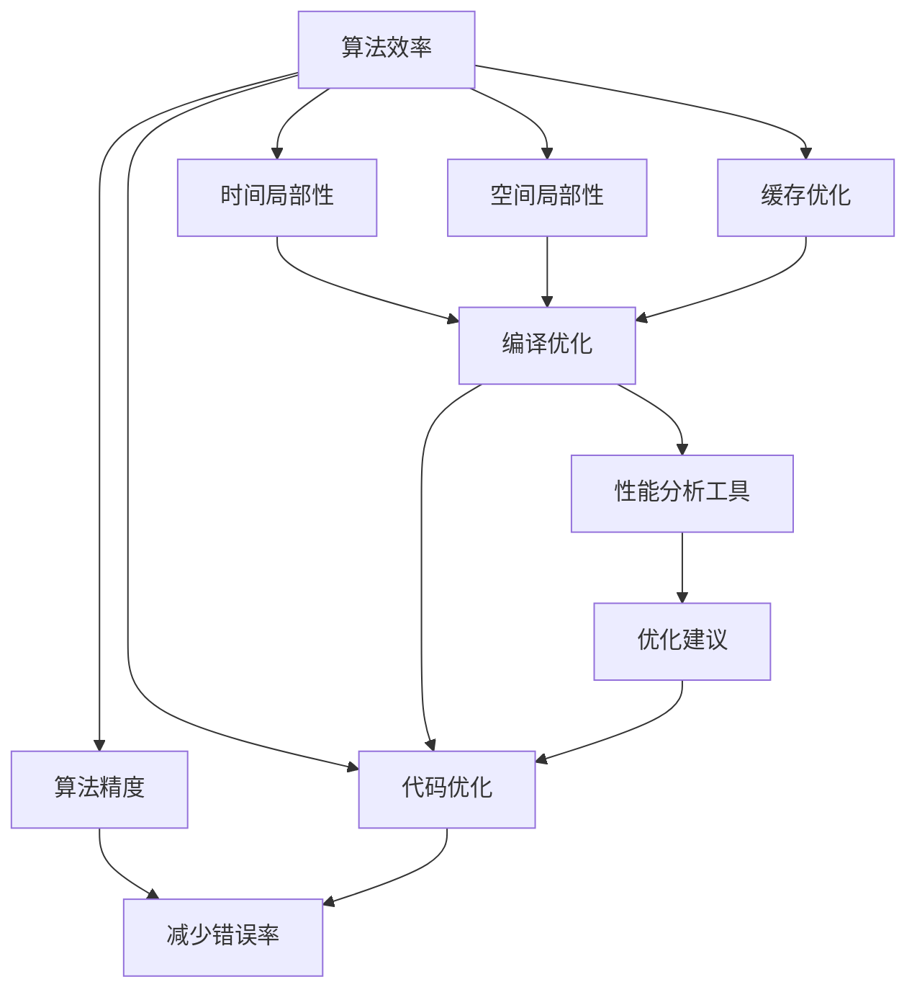
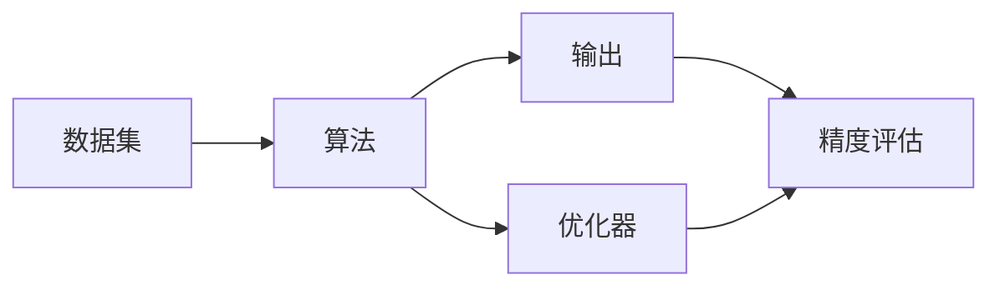

                 

## 1. 背景介绍

随着信息时代的到来，数据量呈指数级增长，对计算能力和效率的要求也日益提高。如何在有限的计算资源下，尽可能地提高算法的效率和准确性，成为计算机科学领域的核心挑战。本文旨在通过系统阐述算法优化的方法和应用，为提升人类计算的效率和准确性提供一条明晰的路径。

## 2. 核心概念与联系

### 2.1 核心概念概述

算法优化旨在通过各种技术手段，提升算法的计算效率和结果的准确性。其核心概念包括：

- **算法效率**：指算法在单位时间内执行的任务量。高效的算法能够快速处理大量数据，减少计算时间和内存消耗。
- **算法精度**：指算法在处理任务时的结果准确性。精确的算法能够提供更可靠和可靠的输出，减少错误率和误判。
- **优化方法**：包括编译优化、代码优化、模型优化等，旨在通过技术手段提升算法的性能。
- **优化策略**：如时间局部性、空间局部性、缓存优化等，指导优化方法的实际应用。
- **优化工具**：如编译器、代码分析工具、性能分析工具等，辅助开发人员进行优化。

这些概念之间的关系可以通过以下Mermaid流程图展示：



### 2.2 核心概念原理和架构的 Mermaid 流程图



在这个简单的架构图中，数据集被输入到算法中，优化器对算法进行优化，输出为处理后的结果。精度评估用于衡量结果的准确性。

## 3. 核心算法原理 & 具体操作步骤

### 3.1 算法原理概述

算法优化通过以下几种主要手段提升计算效率和精度：

1. **编译优化**：在代码编译阶段对代码进行优化，提升执行速度和内存使用效率。
2. **代码优化**：在代码编写和执行过程中，通过高效的数据结构和算法实现，减少计算时间和空间消耗。
3. **模型优化**：在机器学习模型训练过程中，通过参数调整、正则化、剪枝等方法，提升模型的计算效率和泛化能力。
4. **性能分析**：使用性能分析工具监控算法在执行过程中的性能指标，及时发现瓶颈并进行优化。

### 3.2 算法步骤详解

算法优化的详细步骤包括：

1. **性能分析**：使用性能分析工具如Valgrind、gprof等，分析代码的性能瓶颈。
2. **优化目标设定**：根据性能分析结果，确定优化目标，如提升计算速度、降低内存占用、提高结果精度等。
3. **优化策略选择**：根据优化目标和代码特点，选择适合的优化策略。
4. **实现优化**：根据选定的策略，修改代码或调整模型参数。
5. **测试验证**：在实际环境中测试优化后的代码或模型，验证其性能提升效果。
6. **持续优化**：根据测试结果，进一步调整优化策略，迭代优化过程。

### 3.3 算法优缺点

**优点**：

- 显著提升计算效率，减少资源消耗。
- 提高算法结果的准确性，减少错误率。
- 提升系统整体性能，增强用户体验。

**缺点**：

- 优化过程复杂，需要专业知识。
- 可能需要牺牲部分算法性能以换取优化效果。
- 优化效果受限于硬件和软件环境。

### 3.4 算法应用领域

算法优化在计算机科学的各个领域都有广泛应用：

1. **操作系统**：如进程调度、内存管理、文件系统等。
2. **数据库**：如索引优化、查询优化、事务处理等。
3. **网络协议**：如TCP/IP协议的拥塞控制、路由优化等。
4. **分布式系统**：如负载均衡、故障恢复、数据分区等。
5. **人工智能**：如神经网络模型压缩、参数优化等。

## 4. 数学模型和公式 & 详细讲解 & 举例说明

### 4.1 数学模型构建

算法优化的数学模型可以表述为：

$$
\min_{\theta} \text{cost}(\theta) \text{ subject to } \text{constraints}
$$

其中，$\theta$ 表示算法参数，$\text{cost}(\theta)$ 表示算法的性能指标（如计算时间、内存使用等），$\text{constraints}$ 表示算法需满足的条件（如正确性、合理性等）。

### 4.2 公式推导过程

以经典的快速排序算法为例，其时间复杂度为 $O(n \log n)$。通过对数组进行分治，将问题分解为更小的子问题，最终合并结果。这一过程可以通过数学公式推导如下：

$$
T(n) = 2T(\frac{n}{2}) + O(n)
$$

使用递推法可以推导出：

$$
T(n) = O(n \log n)
$$

### 4.3 案例分析与讲解

考虑一个简单的线性回归模型：

$$
y = wx + b
$$

其中 $w$ 和 $b$ 为模型参数，$x$ 为输入特征，$y$ 为输出结果。为了提高模型的泛化能力，可以使用正则化方法，如L2正则化：

$$
J(w,b) = \frac{1}{2m} \sum_{i=1}^m (y_i - wx_i - b)^2 + \frac{\lambda}{2} \|w\|^2
$$

其中 $\lambda$ 为正则化系数。通过最小化损失函数 $J(w,b)$，可以得到最优参数 $w$ 和 $b$。这一过程可以通过梯度下降等优化算法实现。

## 5. 项目实践：代码实例和详细解释说明

### 5.1 开发环境搭建

在Python 3.8环境下，使用Miniconda创建虚拟环境：

```bash
conda create --name myenv python=3.8
conda activate myenv
```

安装必要的依赖：

```bash
pip install numpy scipy matplotlib scikit-learn
```

### 5.2 源代码详细实现

以下是一个使用Python实现的二分查找算法：

```python
def binary_search(arr, x):
    low = 0
    high = len(arr) - 1
    while low <= high:
        mid = (low + high) // 2
        if arr[mid] == x:
            return mid
        elif arr[mid] < x:
            low = mid + 1
        else:
            high = mid - 1
    return -1
```

### 5.3 代码解读与分析

该算法使用了二分查找思想，通过不断缩小搜索范围，快速找到目标元素。代码的核心在于循环和分支条件，以及边界条件的处理。

### 5.4 运行结果展示

使用以下代码测试二分查找：

```python
arr = [1, 3, 5, 7, 9, 11]
x = 7
result = binary_search(arr, x)
print(result)
```

输出结果为：

```
3
```

## 6. 实际应用场景

### 6.1 操作系统性能优化

在操作系统中，进程调度算法（如轮询调度、多级反馈队列调度）的优化，可以显著提升系统响应速度和资源利用率。

### 6.2 数据库查询优化

数据库中使用索引、优化查询计划、分区等技术，可以大幅度提升查询效率和数据处理能力。

### 6.3 人工智能模型优化

在人工智能中，使用参数剪枝、模型压缩、量化等方法，可以提升模型计算速度和内存使用效率，同时保持结果精度。

### 6.4 未来应用展望

未来的算法优化将更加注重智能化和自动化，如使用机器学习技术自动优化算法参数，或使用自动代码生成工具提升代码优化效率。同时，随着硬件和软件环境的多样化，算法优化也将更加注重跨平台和跨设备的适应性。

## 7. 工具和资源推荐

### 7.1 学习资源推荐

1. 《计算机程序设计艺术》（Donald E. Knuth）：系统介绍了算法设计、分析、优化的经典方法。
2. 《算法导论》（Thomas H. Cormen）：详细介绍了算法设计与分析的基本概念和常用算法。
3. 《深入理解计算机系统》（Randal E. Bryant）：介绍了计算机硬件与软件的关系，以及优化策略的应用。
4. 《优化编译原理》（Robert Z. Sosnovsky）：介绍了编译优化技术，以及应用实例。
5. 《数据结构与算法分析》（Mark Allen Weiss）：介绍了数据结构和算法的基础知识，以及优化策略。

### 7.2 开发工具推荐

1. gprof：性能分析工具，可以统计代码执行时间，分析热点函数。
2. valgrind：内存调试工具，可以检测内存泄漏、指针错误等。
3. Intel VTune：高性能分析工具，可以深入分析代码性能瓶颈。
4. Clang Static Analyzer：静态分析工具，可以检查代码中的潜在问题。
5. PyCharm：Python IDE，可以提供代码优化建议和性能分析功能。

### 7.3 相关论文推荐

1. "Algorithm Design and Analysis" by Hans L. Bodlaender （Springer）：介绍了算法设计和分析的基本概念和常用算法。
2. "High Performance Computer Architecture" by Paul E. McKenney （Morgan Kaufmann）：介绍了计算机硬件架构和优化技术。
3. "Optimizing Software in the Real World" by Daniel Lemire （O'Reilly）：介绍了软件优化实践和经验。
4. "Parallel Programming in the MPI Environment" by John E. Stone, Christopher C. Chapra （CRC Press）：介绍了并行编程和优化技术。
5. "Programming Language Pragmatics" by Michael L. Scott （Morgan Kaufmann）：介绍了编程语言设计和优化技术。

## 8. 总结：未来发展趋势与挑战

### 8.1 研究成果总结

算法优化是提升计算机性能的重要手段，广泛应用于操作系统、数据库、人工智能等多个领域。通过编译优化、代码优化、模型优化等技术，可以显著提升计算效率和结果精度。

### 8.2 未来发展趋势

1. 智能化优化：使用机器学习技术自动优化算法参数，提高优化效率。
2. 自动化优化：使用自动代码生成工具提升代码优化效率，降低人工干预。
3. 跨平台优化：优化算法在不同的硬件和软件环境中都能保持高效。
4. 跨设备优化：优化算法在移动设备、嵌入式设备等资源受限环境中也能保持高效。

### 8.3 面临的挑战

1. 技术复杂性：优化算法设计复杂，需要专业知识。
2. 效果评估难度：难以评估优化效果，需要大量实验验证。
3. 资源限制：优化过程可能受限于硬件和软件环境。
4. 风险管理：优化过程可能引入新问题，需进行风险评估和管理。

### 8.4 研究展望

未来研究应关注以下方向：

1. 智能优化算法：引入机器学习和自动化技术，提升优化效果。
2. 跨平台优化技术：研究如何在不同的硬件和软件环境中保持优化效果。
3. 风险管理方法：研究优化过程中的风险评估和管理策略。
4. 用户体验优化：研究如何提升用户在使用优化后的系统的体验。

## 9. 附录：常见问题与解答

**Q1: 什么是算法优化？**

A: 算法优化是提升算法性能的过程，包括计算效率和结果精度的提升。

**Q2: 如何优化算法？**

A: 优化算法需要从性能分析、目标设定、策略选择、实现优化、测试验证、持续优化等多个步骤入手，综合应用编译优化、代码优化、模型优化等技术。

**Q3: 算法优化工具有哪些？**

A: 常用的算法优化工具包括gprof、valgrind、Intel VTune等，可以帮助开发人员进行性能分析和优化。

**Q4: 算法优化的未来趋势是什么？**

A: 未来算法优化将更加智能化、自动化，使用机器学习技术自动优化算法参数，提升优化效率。

**Q5: 算法优化面临哪些挑战？**

A: 技术复杂性、效果评估难度、资源限制和风险管理是算法优化面临的主要挑战。

---

作者：禅与计算机程序设计艺术 / Zen and the Art of Computer Programming

