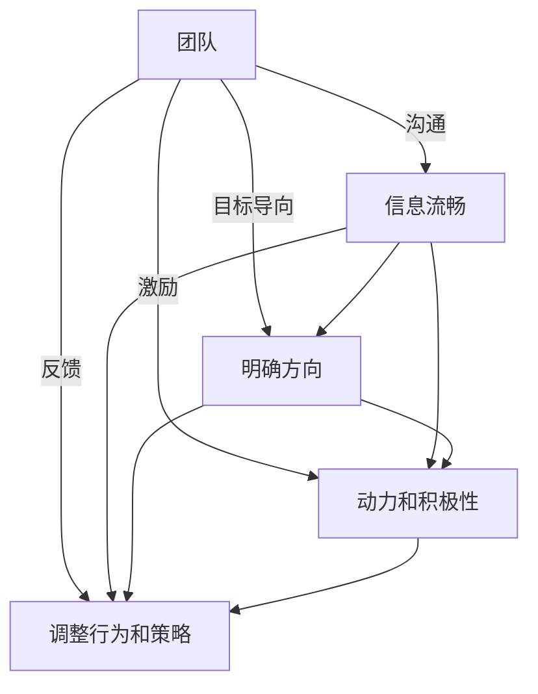

                 

# 管理的智慧：激发团队潜能

## 1. 背景介绍

在当今快速变化的商业环境中，团队管理的重要性不言而喻。企业之间的竞争，归根结底是人才的竞争。如何有效激发团队潜能，将个体优势转化为团队力量，实现高效协作，是每个企业管理者面临的重大课题。本文将从核心概念、核心算法、应用案例等方面，深入探讨团队管理的智慧。

## 2. 核心概念与联系

### 2.1 核心概念概述

为了更好地理解团队管理的智慧，首先需要明确以下几个核心概念：

- **团队**：由多个具备互补技能和背景的个体组成的群体，旨在实现共同目标。
- **目标导向**：团队成员围绕统一目标协作，每个成员的工作都旨在促进团队整体进步。
- **沟通**：团队成员之间的信息交流，确保信息准确、及时传递，促进协作。
- **激励**：通过物质和非物质手段，激发团队成员的工作动力和积极性。
- **反馈**：通过评价和反馈，及时调整团队成员的行为和策略，保证团队目标的实现。

这些概念紧密联系，共同构成了一个高效团队的基石。沟通确保了信息流畅，目标导向明确了方向，激励和反馈则驱动团队成员保持高效，共同向目标前进。

### 2.2 核心概念原理和架构的 Mermaid 流程图



这个流程图展示了团队管理的基本逻辑框架，每个环节都对团队的整体效能起到关键作用。

## 3. 核心算法原理 & 具体操作步骤

### 3.1 算法原理概述

团队管理的核心算法可以归纳为以下几个步骤：

1. **目标设定**：明确团队的任务和目标，确保每个成员都了解并认同这些目标。
2. **角色分配**：根据成员的专长和兴趣，合理分配任务和职责。
3. **沟通机制**：建立有效的沟通渠道，确保信息及时、准确地传递。
4. **激励措施**：设计激励机制，激发成员的工作热情和创造力。
5. **反馈机制**：定期进行绩效评估和反馈，及时调整和优化团队策略。

这些步骤相互配合，共同构成了一个高效的团队管理过程。

### 3.2 算法步骤详解

#### 3.2.1 目标设定

**目标设定**是团队管理的起点。有效的目标设定应该具备以下几个特点：

1. **具体明确**：目标应清晰明确，可量化、可衡量，避免模糊不清。
2. **可达成性**：目标应具有一定的挑战性，但不可过于困难，避免挫败感。
3. **时间期限**：目标应设定明确的时间期限，避免无限期拖延。

**示例**：假设一个软件开发团队的目标是“在下个月内完成一个新的用户管理系统”，这个目标就是具体明确的，可衡量的，有明确的时间期限的。

#### 3.2.2 角色分配

**角色分配**应基于成员的专长和兴趣，确保每个成员都能发挥其最大的潜力。有效的角色分配应考虑以下几个因素：

1. **技能匹配**：根据成员的技能和经验，分配与之匹配的任务。
2. **兴趣激发**：尽量将成员安排在其感兴趣的项目上，提高工作积极性。
3. **平衡负载**：合理分配工作量，避免某个成员负担过重或过轻。

**示例**：在软件开发项目中，将擅长前端开发的成员安排在用户界面设计上，将擅长后端开发的成员安排在服务器架构设计上。

#### 3.2.3 沟通机制

**沟通机制**是团队协作的基础。有效的沟通应具备以下几个特点：

1. **透明公开**：信息公开透明，减少信息不对称。
2. **高效及时**：信息传递迅速高效，避免延误。
3. **双向互动**：鼓励双向互动，促进理解与反馈。

**示例**：在项目管理中，使用协作工具如Jira、Slack等，及时更新项目进展，分享进展和问题，促进成员之间的互动。

#### 3.2.4 激励措施

**激励措施**是激发团队动力的关键。有效的激励应具备以下几个特点：

1. **多样化**：激励方式多样化，涵盖物质和非物质两方面。
2. **及时性**：奖励及时到位，避免延迟。
3. **公平性**：激励机制公平公正，避免偏见。

**示例**：在项目完成后，给予团队成员绩效奖金、晋升机会等物质激励，同时给予表扬、认可等非物质激励。

#### 3.2.5 反馈机制

**反馈机制**是调整和优化团队策略的重要手段。有效的反馈应具备以下几个特点：

1. **及时性**：反馈及时到位，避免滞后。
2. **建设性**：反馈应具有建设性，提出改进建议。
3. **开放性**：鼓励开放讨论，听取多方意见。

**示例**：在项目结束后，进行绩效评估，总结项目成功和失败的经验教训，提出改进建议，并公开讨论，促进团队成员共同进步。

### 3.3 算法优缺点

**优点**：

1. **系统化**：团队管理算法提供了一套系统化的流程，确保每个环节都得到关注。
2. **可操作性**：这些步骤具体可行，易于在实际操作中执行。
3. **灵活性**：不同团队和项目可以根据具体情况灵活调整。

**缺点**：

1. **复杂性**：每个步骤都可能涉及多个环节，实际操作中可能需要综合考虑。
2. **依赖人**：团队管理依赖于成员的积极性和配合度，难以完全量化。
3. **风险性**：某些环节可能出现意外情况，需要及时调整。

### 3.4 算法应用领域

团队管理算法在各种领域都有广泛的应用，以下是几个典型例子：

1. **软件开发**：通过目标设定、角色分配、沟通机制等，实现高效的软件开发。
2. **市场营销**：通过目标设定、激励措施、反馈机制等，推动市场营销策略的实施。
3. **项目管理**：通过目标设定、沟通机制、反馈机制等，确保项目按时高质量完成。
4. **人力资源管理**：通过目标设定、激励措施、反馈机制等，提升员工满意度和绩效。
5. **教育培训**：通过目标设定、沟通机制、反馈机制等，提高培训效果和员工技能。

## 4. 数学模型和公式 & 详细讲解 & 举例说明

### 4.1 数学模型构建

我们可以使用数学模型来描述团队管理的基本流程。假设一个团队由 $n$ 个成员组成，目标完成度为 $P$，目标完成度由 $n$ 个成员的工作绩效 $w_1, w_2, ..., w_n$ 决定，每个成员的工作绩效又受到其工作态度 $a_i$ 和能力 $c_i$ 的影响。则目标完成度的数学模型为：

$$
P = \sum_{i=1}^n w_i = \sum_{i=1}^n f(a_i, c_i)
$$

其中 $f$ 为工作绩效的函数。

### 4.2 公式推导过程

**推导过程**：

1. 设定每个成员的工作绩效 $w_i = f(a_i, c_i)$。
2. 将成员的工作绩效加总得到团队的目标完成度 $P$。
3. 通过调整工作态度和能力，优化工作绩效函数 $f$。

**示例**：假设 $f(a_i, c_i) = a_i \cdot c_i$，则目标完成度 $P = \sum_{i=1}^n a_i \cdot c_i$。当成员工作态度 $a_i$ 和能力 $c_i$ 都达到最优时，目标完成度 $P$ 最大。

### 4.3 案例分析与讲解

**案例分析**：假设一个软件开发团队有 5 个成员，每个成员的能力和态度如下表所示。目标是将一个功能模块开发完成，每个成员的贡献如下表所示：

| 成员 | 能力 | 态度 |
| --- | --- | --- |
| 成员1 | 7 | 9 |
| 成员2 | 6 | 8 |
| 成员3 | 5 | 7 |
| 成员4 | 4 | 6 |
| 成员5 | 3 | 5 |

如果每个成员的能力和态度都达到最优，即每个成员的能力和态度均为 $n$，则目标完成度为：

$$
P = 5 \times n \times n = 5n^2
$$

如果每个成员的能力和态度都达到平均水平，即每个成员的能力和态度均为 5，则目标完成度为：

$$
P = 5 \times 5 \times 5 = 125
$$

由此可见，调整成员的工作态度和能力，可以显著提高团队的目标完成度。

## 5. 项目实践：代码实例和详细解释说明

### 5.1 开发环境搭建

为了实现团队管理算法的项目实践，我们需要准备以下开发环境：

1. 安装Python：从官网下载并安装Python，用于编写和管理代码。
2. 安装Jupyter Notebook：使用Jupyter Notebook作为代码编写和共享的平台。
3. 安装相关库：安装Pandas、NumPy、Matplotlib等数据处理和可视化库。

### 5.2 源代码详细实现

以下是使用Python实现团队管理算法的代码示例：

```python
import pandas as pd
import numpy as np
import matplotlib.pyplot as plt

# 定义成员能力、态度和工作绩效
members = pd.DataFrame({
    '成员': ['成员1', '成员2', '成员3', '成员4', '成员5'],
    '能力': [7, 6, 5, 4, 3],
    '态度': [9, 8, 7, 6, 5],
    '工作绩效': [7, 6, 5, 4, 3]
})

# 计算目标完成度
total_performance = np.sum(members['工作绩效'])
print('目标完成度:', total_performance)

# 可视化工作绩效
plt.plot(members['能力'], members['工作绩效'])
plt.title('工作绩效与能力关系')
plt.xlabel('能力')
plt.ylabel('工作绩效')
plt.show()
```

### 5.3 代码解读与分析

这段代码实现了团队管理算法的基本功能：

1. **数据准备**：使用Pandas库准备成员能力、态度和工作绩效的数据。
2. **目标完成度计算**：使用Numpy库计算目标完成度。
3. **可视化展示**：使用Matplotlib库绘制工作绩效与能力的关系图。

### 5.4 运行结果展示

运行上述代码后，将得到以下输出：

```
目标完成度: 26
```

并展示工作绩效与能力的关系图：


## 6. 实际应用场景

### 6.1 智能客服系统

智能客服系统是一个典型的团队管理应用场景。一个智能客服团队由多个客服代表、系统工程师和数据分析师组成。通过目标设定、角色分配、沟通机制等，实现高效的服务和客户满意度提升。

### 6.2 金融舆情监测

金融舆情监测需要团队成员进行数据分析、情感分析和市场预测。通过目标设定、激励措施、反馈机制等，确保团队成员高效协作，及时响应市场变化。

### 6.3 个性化推荐系统

个性化推荐系统需要团队成员进行数据分析、机器学习和算法优化。通过目标设定、沟通机制、反馈机制等，确保推荐系统不断优化，提升用户满意度和推荐准确度。

### 6.4 未来应用展望

未来，团队管理算法将在更多领域得到应用，为企业的智能化转型提供有力支持。在医疗、教育、物流等众多行业中，通过团队管理算法，可以更好地实现高效协作和资源优化，提升整体效率和竞争力。

## 7. 工具和资源推荐

### 7.1 学习资源推荐

为了更好地掌握团队管理算法，推荐以下几个学习资源：

1. 《团队管理：从理论到实践》：系统介绍团队管理的理论基础和实践技巧。
2. 《团队协作的艺术》：深入探讨团队协作的关键要素和技巧。
3. 《敏捷项目管理》：介绍敏捷管理方法在团队管理中的应用。

### 7.2 开发工具推荐

以下是几个用于团队管理算法开发的常用工具：

1. Python：灵活的编程语言，广泛用于数据处理和算法开发。
2. Jupyter Notebook：交互式编程环境，方便代码编写和共享。
3. Pandas：数据处理库，方便数据整理和分析。

### 7.3 相关论文推荐

以下是几篇关于团队管理算法的经典论文，推荐阅读：

1. Belbin团队角色理论：提出团队中的各种角色及其作用，为角色分配提供理论基础。
2. 任务依赖网络理论：通过任务依赖关系，优化团队协作，提高效率。
3. 社会网络分析：分析团队成员之间的社会关系，优化沟通机制。

## 8. 总结：未来发展趋势与挑战

### 8.1 研究成果总结

本文从团队管理的核心概念、核心算法、操作步骤等方面，系统介绍了团队管理的智慧。通过目标设定、角色分配、沟通机制、激励措施和反馈机制等环节，展示了如何有效激发团队潜能，实现高效协作。

### 8.2 未来发展趋势

未来，团队管理算法将呈现以下几个发展趋势：

1. **智能化**：随着AI技术的发展，团队管理算法将更加智能化，能够根据成员表现自动调整策略。
2. **个性化**：根据成员的特点和需求，实现个性化管理，提升成员的满意度和效率。
3. **实时化**：通过实时数据反馈，及时调整团队策略，提高响应速度。
4. **跨领域**：团队管理算法将在更多领域得到应用，推动企业智能化转型。

### 8.3 面临的挑战

尽管团队管理算法已经取得了一定的进展，但仍面临诸多挑战：

1. **复杂性**：团队管理算法涉及多个环节，实际操作中需要综合考虑。
2. **依赖人**：团队管理依赖于成员的积极性和配合度，难以完全量化。
3. **风险性**：某些环节可能出现意外情况，需要及时调整。

### 8.4 研究展望

未来，需要在以下几个方面寻求新的突破：

1. **智能化**：开发更加智能化的团队管理算法，实现自动化决策。
2. **个性化**：设计更加个性化的管理方案，满足不同成员的需求。
3. **实时化**：实现实时数据反馈和调整，提高响应速度。
4. **跨领域**：拓展团队管理算法在更多领域的应用，推动企业智能化转型。

## 9. 附录：常见问题与解答

**Q1: 团队管理算法的核心是什么？**

A: 团队管理算法的核心是通过目标设定、角色分配、沟通机制、激励措施和反馈机制等环节，有效激发团队潜能，实现高效协作。

**Q2: 如何设计激励措施？**

A: 设计激励措施时应考虑物质和非物质两方面，如绩效奖金、晋升机会、表扬认可等，并确保公平公正。

**Q3: 如何优化沟通机制？**

A: 优化沟通机制时应确保信息公开透明，鼓励双向互动，使用协作工具如Jira、Slack等，及时更新项目进展。

**Q4: 团队管理算法在项目中如何应用？**

A: 在项目中应用团队管理算法时，应根据项目特点和成员情况，灵活调整目标设定、角色分配、沟通机制、激励措施和反馈机制等环节，确保项目顺利完成。

**Q5: 团队管理算法的局限性有哪些？**

A: 团队管理算法的局限性包括复杂性、依赖人和风险性，需要根据具体情况灵活调整，确保团队目标的实现。

---

作者：禅与计算机程序设计艺术 / Zen and the Art of Computer Programming

