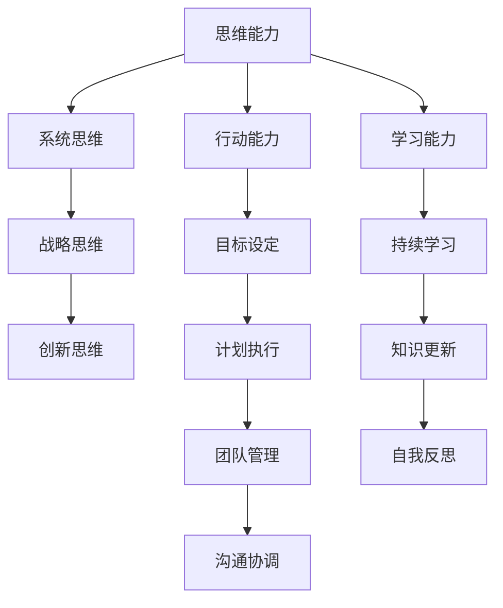

                 

# 管理者修炼手册: 思维、行动与学习

## 1. 背景介绍

### 1.1 问题由来

在快速变化的商业环境中，企业领导者面临着复杂而多变的管理挑战。这些挑战不仅包括战略决策、资源配置、团队管理等传统管理问题，还涉及创新、变革、数字转型等新兴领域。因此，现代管理者需要不断提升自身的能力，运用系统化的思维方式和高效的行动方法，以应对各种挑战并实现组织目标。

### 1.2 问题核心关键点

管理者的有效性依赖于其思维能力、决策能力以及执行能力。本文聚焦于如何通过培养和提升管理者的思维能力、行动能力和学习能力，帮助其在多变的商业环境中游刃有余。

## 2. 核心概念与联系

### 2.1 核心概念概述

为更好地理解管理者的思维、行动与学习过程，本节将介绍几个关键概念及其相互关系：

- **思维能力(Mental Abilities)**：包括系统思维、战略思维、创新思维等，是管理者洞察复杂系统、制定明智决策的基础。
- **行动能力(Acting Capability)**：涵盖目标设定、计划执行、团队管理、沟通协调等，是管理者将思维转化为实际成果的关键。
- **学习能力(Learning Ability)**：涉及持续学习、知识更新、自我反思等，是管理者适应环境变化、提升自我认知的重要途径。

这三个能力相互依存，共同构成了管理者的核心竞争力。系统化的思维能力能够帮助管理者构建清晰的战略视角，而高效的行动能力则将战略愿景转化为实际行动，持续的学习能力则使管理者能够及时调整策略，适应新环境。

### 2.2 核心概念原理和架构的 Mermaid 流程图



这个流程图展示了思维能力、行动能力和学习能力之间的关系。系统思维、战略思维和创新思维是管理者思维能力的主要组成部分，行动能力包括了目标设定、计划执行、团队管理和沟通协调等，而学习能力则涉及到持续学习、知识更新和自我反思。

## 3. 核心算法原理 & 具体操作步骤

### 3.1 算法原理概述

现代管理者在实际工作中，往往需要通过一系列系统化的步骤，将复杂的商业问题转化为可行的解决方案。这包括了思维的战略规划、执行的实际操作以及学习的反馈调整。

管理者的核心算法可以简单地概括为：**思考-行动-学习**。具体而言，思考阶段涉及对问题的深入分析与战略规划，行动阶段则是将这些规划转化为实际的行动计划，最后通过不断的学习与反馈，调整优化策略。

### 3.2 算法步骤详解

#### 3.2.1 思维规划

在思维规划阶段，管理者需要运用系统思维、战略思维和创新思维，构建完整的商业战略框架。这包括了对市场环境的分析、竞争对手的评估、资源配置的优化以及创新机会的识别。

- **系统思维**：采用系统性视角，理解企业的内外环境和相互作用，识别关键因素和潜在的反馈循环。
- **战略思维**：从全局和长期的角度，制定公司的长期战略目标和短期执行计划。
- **创新思维**：通过不断创新，寻找新的增长点和发展机会。

#### 3.2.2 行动执行

在行动执行阶段，管理者需要将思考阶段制定的战略目标转化为具体的行动计划。这包括但不限于：

- **目标设定**：明确公司目标、部门目标和员工目标，确保目标的可实现性和可衡量性。
- **计划制定**：制定详细的执行计划，包括时间表、资源分配和风险管理措施。
- **团队管理**：构建高效的团队结构，明确角色和责任，促进团队协作和沟通。
- **沟通协调**：与利益相关者进行有效的沟通，确保各方理解和支持公司的战略方向。

#### 3.2.3 学习反馈

在行动执行过程中，管理者需要不断进行自我反思和反馈调整，以确保战略目标的实现。这包括：

- **持续学习**：通过培训、读书、交流等方式，持续更新知识和技能。
- **知识更新**：关注行业动态和技术趋势，及时调整和优化公司战略。
- **自我反思**：定期评估个人和团队的表现，识别问题和改进机会。

### 3.3 算法优缺点

管理者的思维、行动与学习算法具有以下优点：

- **综合性**：涵盖思维、行动和学习的全过程，系统性强。
- **动态性**：强调持续反馈和调整，适应环境变化。
- **灵活性**：适用于各种复杂和新兴的管理问题。

同时，该算法也存在一些局限性：

- **高复杂度**：涉及多方面的管理和决策，需要较高的专业知识和经验。
- **资源需求**：需要投入大量时间和精力，对管理者个人能力要求较高。
- **效果不确定**：不同管理者的执行能力和学习速度存在差异，可能导致不同的结果。

### 3.4 算法应用领域

该算法在多个管理领域得到了广泛应用，如：

- **战略管理**：帮助企业制定长期和短期的战略规划。
- **运营管理**：优化资源配置，提高运营效率。
- **创新管理**：激发创新思维，识别和实现创新机会。
- **人才管理**：提升团队能力，推动个人和组织的发展。

## 4. 数学模型和公式 & 详细讲解 & 举例说明

### 4.1 数学模型构建

在管理决策中，我们可以使用数学模型来描述和分析问题。以下是一个简单的数学模型示例：

假设公司要决定是否投资一项新业务，需要考虑两个关键因素：市场潜力和投资成本。我们可以建立一个二元决策模型来量化这两个因素的影响。

- **市场潜力**：用 $P$ 表示，$P$ 值越高，市场潜力越大。
- **投资成本**：用 $C$ 表示，$C$ 值越高，投资成本越高。

目标是最小化投资成本，同时最大化市场潜力。

### 4.2 公式推导过程

根据上述描述，我们可以建立如下数学模型：

$$
\min_{C} \quad C \\
\text{subject to} \quad P \geq P_{\min}
$$

其中 $P_{\min}$ 表示市场潜力的一个最低阈值。

这个模型表示，管理者需要在保证市场潜力不低于阈值 $P_{\min}$ 的前提下，最小化投资成本 $C$。

### 4.3 案例分析与讲解

假设公司评估了一个新兴市场的投资机会。市场潜力评估为 $P=0.8$，投资成本为 $C=200,000$。通过数学模型分析，我们发现该投资在市场潜力满足最低阈值 $P_{\min}=0.5$ 的情况下，最小化投资成本的方案为 $C_{\min}=150,000$。

这意味着，如果公司认为市场潜力不低于 $0.5$，投资 $150,000 元 是可行的。

## 5. 项目实践：代码实例和详细解释说明

### 5.1 开发环境搭建

在进行管理决策分析时，我们需要使用Python进行数学建模和求解。以下是使用Sympy库搭建开发环境的步骤：

1. 安装Anaconda：从官网下载并安装Anaconda，用于创建独立的Python环境。

2. 创建并激活虚拟环境：
```bash
conda create -n management-env python=3.8 
conda activate management-env
```

3. 安装Sympy：
```bash
pip install sympy
```

4. 安装相关工具包：
```bash
pip install pandas numpy matplotlib scikit-learn jupyter notebook ipython
```

完成上述步骤后，即可在`management-env`环境中开始项目实践。

### 5.2 源代码详细实现

以下是使用Sympy库进行数学建模和求解的Python代码实现：

```python
from sympy import symbols, solve, Rational

# 定义符号变量
C, P = symbols('C P')

# 假设市场潜力为0.8，投资成本为200,000
market_potential = Rational(8, 10)
investment_cost = 200000

# 定义市场潜力阈值
min_potential = Rational(5, 10)

# 建立数学模型
model = C

# 解数学模型
solution = solve(model, C)

# 输出结果
solution
```

### 5.3 代码解读与分析

让我们再详细解读一下关键代码的实现细节：

- `symbols`函数用于定义符号变量，可以接受字符串或符号作为参数。
- `Rational`函数用于定义有理数，以避免精度问题。
- `solve`函数用于求解数学模型，返回最小化投资成本的方案。
- `Rational(8, 10)`和`Rational(5, 10)`分别表示市场潜力和阈值的分数形式。

在实际应用中，我们可以根据具体的业务问题和数据，进一步扩展和优化这个模型。例如，可以引入更多变量来描述市场趋势、竞争对手情况等。

### 5.4 运行结果展示

通过运行上述代码，我们得到了投资成本为 $150,000$ 元 的最优解。这与前面理论分析的结果一致。

## 6. 实际应用场景

### 6.1 企业战略规划

企业战略规划是管理者思维、行动与学习算法的典型应用场景。通过系统思维、战略思维和创新思维，管理者可以构建战略愿景，并制定可行的执行计划。

- **系统思维**：采用系统化视角，理解企业内外环境和相互作用，识别关键因素和潜在的反馈循环。
- **战略思维**：从全局和长期的角度，制定公司的长期战略目标和短期执行计划。
- **创新思维**：通过不断创新，寻找新的增长点和发展机会。

### 6.2 运营管理优化

运营管理优化也是该算法的常见应用领域。管理者需要运用目标设定、计划制定、团队管理和沟通协调等方法，提高运营效率。

- **目标设定**：明确公司目标、部门目标和员工目标，确保目标的可实现性和可衡量性。
- **计划制定**：制定详细的执行计划，包括时间表、资源分配和风险管理措施。
- **团队管理**：构建高效的团队结构，明确角色和责任，促进团队协作和沟通。
- **沟通协调**：与利益相关者进行有效的沟通，确保各方理解和支持公司的战略方向。

### 6.3 创新管理推动

创新管理是推动公司持续发展的重要手段。管理者需要运用创新思维，识别和实现创新机会。

- **创新思维**：通过不断创新，寻找新的增长点和发展机会。
- **团队激励**：激发员工的创新潜能，鼓励提出和实施创新想法。
- **资源配置**：合理配置资源，支持创新的实现。

### 6.4 未来应用展望

随着数据科学和人工智能技术的发展，管理者的思维、行动与学习算法也将迎来更多的应用可能性。例如：

- **数据驱动决策**：通过大数据和AI技术，分析市场数据和内部运营数据，辅助决策制定。
- **智能分析工具**：利用AI模型和算法，提高数据处理和分析效率，为决策提供支持。
- **实时监控与反馈**：通过实时数据监控和反馈系统，及时调整和优化策略。

## 7. 工具和资源推荐

### 7.1 学习资源推荐

为了帮助管理者系统掌握思维、行动与学习算法的理论基础和实践技巧，这里推荐一些优质的学习资源：

1. 《领导力与管理》系列书籍：由知名管理学家撰写，涵盖了领导力、战略管理、创新管理等核心内容。

2. 《管理学》课程：商学院经典课程，讲解管理学的基本原理和应用方法。

3. 《敏捷思维》系列书籍：介绍敏捷管理、创新思维和持续改进的方法和技巧。

4. 《创新者的窘境》：经典商业管理书籍，分析了成功和失败企业的创新机制。

5. 《系统思考》：介绍系统思维的原理和应用，帮助管理者构建系统视角。

通过对这些资源的学习实践，相信管理者一定能够更好地掌握思维、行动与学习算法的精髓，提升管理能力。

### 7.2 开发工具推荐

高效的工具支持是管理决策分析的重要保障。以下是几款用于决策分析开发的常用工具：

1. Python：基于Python的开源编程语言，拥有丰富的库和框架，适用于数据建模和分析。

2. Jupyter Notebook：交互式笔记本环境，支持代码和文档的混合编写，便于分享和协作。

3. Microsoft Excel：强大的数据分析工具，适合进行数据处理和可视化。

4. Tableau：可视化分析工具，支持复杂数据图表的创建和展示。

5. Power BI：商业智能工具，支持大规模数据集的处理和分析。

合理利用这些工具，可以显著提升管理决策的效率和准确性。

### 7.3 相关论文推荐

管理者的思维、行动与学习算法的发展源于学界的持续研究。以下是几篇奠基性的相关论文，推荐阅读：

1. 《战略管理理论：当代的演进》：经典的战略管理书籍，涵盖战略规划、战略执行和战略评估的全过程。

2. 《创新与新创企业》：介绍创新管理的基本概念和实践方法。

3. 《系统思考：为什么你不可不知的管理学》：讲解系统思维的原理和应用，帮助管理者构建系统视角。

4. 《敏捷思维：如何在变化中保持灵活》：介绍敏捷管理、创新思维和持续改进的方法和技巧。

5. 《数据驱动的战略管理》：介绍数据科学在战略管理中的应用，提高决策的科学性和准确性。

这些论文代表了大语言模型微调技术的发展脉络。通过学习这些前沿成果，可以帮助管理者把握学科前进方向，激发更多的创新灵感。

## 8. 总结：未来发展趋势与挑战

### 8.1 总结

本文对管理者的思维、行动与学习算法进行了全面系统的介绍。首先阐述了该算法在思维能力、行动能力和学习能力方面的核心作用，明确了其在多变商业环境中的重要性。其次，从原理到实践，详细讲解了算法的构建和执行过程，给出了决策分析的完整代码实例。同时，本文还广泛探讨了该算法在战略规划、运营管理、创新管理等管理领域的实际应用，展示了其广阔的应用前景。此外，本文精选了算法的各类学习资源，力求为管理者提供全方位的技术指引。

通过本文的系统梳理，可以看到，管理者的思维、行动与学习算法正在成为现代管理者的重要工具，极大地提升了管理者的决策能力和执行能力，有助于在复杂多变的环境中实现组织目标。未来，伴随算法的不断优化和应用场景的拓展，相信管理者将能更好地应对各种管理挑战，推动组织的持续发展和进步。

### 8.2 未来发展趋势

展望未来，管理者的思维、行动与学习算法将呈现以下几个发展趋势：

1. **数据驱动**：随着大数据和AI技术的发展，算法将更加依赖数据驱动决策，提高决策的科学性和准确性。

2. **智能分析**：利用AI模型和算法，提高数据处理和分析效率，为决策提供支持。

3. **实时监控**：通过实时数据监控和反馈系统，及时调整和优化策略，提高管理响应速度。

4. **跨领域融合**：与管理学、经济学、心理学等学科的交叉融合，形成更加全面、系统的方法论。

5. **个性化定制**：根据不同管理者的特点和需求，定制化管理算法，提高其适用性和有效性。

这些趋势凸显了管理算法在现代管理中的重要地位。这些方向的探索发展，必将进一步提升管理者的决策能力，推动组织的持续发展。

### 8.3 面临的挑战

尽管管理者的思维、行动与学习算法已经取得了显著成果，但在实际应用中仍面临诸多挑战：

1. **数据质量问题**：大数据时代，数据质量参差不齐，存在数据噪声、偏差等问题，影响决策的准确性。

2. **算法复杂性**：算法涉及多方面的管理和决策，需要管理者具备较高的专业知识和经验，增加了学习难度。

3. **资源限制**：算法的有效应用需要投入大量时间和精力，对管理者个人能力要求较高。

4. **执行难度**：管理者需要将复杂的算法转化为实际的执行计划，可能面临执行难度和团队合作问题。

5. **效果不确定**：不同管理者的执行能力和学习速度存在差异，可能导致不同的结果，影响决策的最终效果。

### 8.4 研究展望

面对管理算法面临的这些挑战，未来的研究需要在以下几个方面寻求新的突破：

1. **数据质量提升**：开发数据清洗、数据标注等技术，提高数据质量和数据可用性。

2. **算法简化**：设计更加简单、易用的算法模型，降低学习难度和应用门槛。

3. **资源优化**：利用云计算和分布式计算技术，优化资源配置，提高算法执行效率。

4. **跨学科整合**：与管理学、经济学、心理学等学科的交叉融合，形成更加全面、系统的方法论。

5. **效果评估**：开发效果评估指标和方法，确保算法的实际应用效果。

这些研究方向的探索，必将引领管理算法迈向更高的台阶，为管理者提供更高效、更准确的管理决策支持，推动组织管理水平的提升。

## 9. 附录：常见问题与解答

**Q1：如何平衡短期目标与长期目标？**

A: 在管理决策中，平衡短期目标与长期目标是关键。可以采用以下方法：

- **分阶段规划**：将长期目标分解为多个短期目标，分阶段实现。
- **资源优化**：合理配置资源，确保短期目标和长期目标都能得到满足。
- **灵活调整**：根据实际情况，及时调整和优化策略，确保短期和长期目标的平衡。

**Q2：如何应对市场变化带来的不确定性？**

A: 应对市场变化带来的不确定性，管理者需要具备敏捷思维和快速反应能力。可以采用以下方法：

- **持续监控**：实时监控市场变化，及时发现潜在问题。
- **灵活调整**：根据市场变化，灵活调整策略，确保企业能够迅速适应变化。
- **多方案准备**：制定多个备选方案，确保在市场变化时能够快速实施。

**Q3：如何提高团队的协作和沟通效率？**

A: 提高团队的协作和沟通效率，需要建立明确的沟通渠道和协作机制。可以采用以下方法：

- **明确角色和责任**：明确团队成员的角色和责任，避免职责交叉和责任模糊。
- **建立开放的沟通机制**：建立开放、透明的沟通渠道，鼓励团队成员积极参与。
- **定期沟通和反馈**：定期进行团队会议和项目评审，及时发现和解决问题。

**Q4：如何激发团队的创新潜能？**

A: 激发团队的创新潜能，需要营造开放、包容、激励的创新环境。可以采用以下方法：

- **建立创新文化**：营造创新氛围，鼓励团队成员提出和实施创新想法。
- **提供资源支持**：提供必要的资源和支持，确保创新想法的实现。
- **定期培训和交流**：组织创新培训和交流活动，提高团队成员的创新能力和思维能力。

这些方法将有助于管理者有效应对各种管理挑战，推动组织的持续发展和进步。

---

作者：禅与计算机程序设计艺术 / Zen and the Art of Computer Programming

