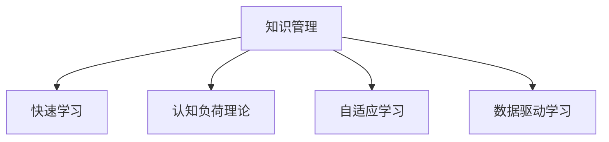

                 

# 管理者如何应对知识快速迭代

## 1. 背景介绍

### 1.1 问题由来

在当前信息爆炸的时代，知识以指数级的速度更新迭代，各行各业都在快速变化。对于管理者而言，如何迅速学习和掌握新知识，提升个人和组织的竞争力，成为了一个重要的课题。传统的管理方式和工具已经难以应对快速变化的知识环境。因此，管理者需要找到更有效的策略和方法来应对知识的快速迭代。

### 1.2 问题核心关键点

知识快速迭代的核心关键点包括：

- 信息量的爆炸性增长：知识库不断扩大，新的概念、技术、工具层出不穷。
- 技术更新的速度加快：新技术不断涌现，旧技术快速被淘汰，要求管理者快速掌握。
- 信息过载：管理者面临海量信息，如何从中筛选出有用的知识成为挑战。
- 学习效率下降：传统学习方式耗时耗力，难以快速跟上知识更新的步伐。

## 2. 核心概念与联系

### 2.1 核心概念概述

为了更好地理解如何应对知识快速迭代，本节将介绍几个密切相关的核心概念：

- 知识管理(Knowledge Management, KM)：通过系统化的方法和工具，管理和利用组织内部的知识资源，提升组织的学习能力和创新能力。

- 快速学习(Fast Learning)：指在短时间内迅速掌握新知识和技能的能力，包括学习策略、学习工具和方法。

- 认知负荷理论(Cognitive Load Theory)：强调认知负荷对学习的影响，认为学习效率受到信息量的影响，需要通过策略优化减轻认知负担。

- 自适应学习(Adaptive Learning)：指根据学习者的不同需求和能力，动态调整学习内容和方法的学习方式，提升学习效果。

- 数据驱动学习(Data-Driven Learning)：通过数据挖掘和分析，发现知识之间的关联，指导学习内容和路径的选择。

这些核心概念之间的逻辑关系可以通过以下Mermaid流程图来展示：



这个流程图展示了几大核心概念之间的关系：

1. 知识管理通过系统化方法和工具，为快速学习、认知负荷理论、自适应学习和数据驱动学习提供了平台和支持。
2. 快速学习能力在认知负荷理论的指导下，通过自适应学习和数据驱动学习的方法，不断提升学习效率。

## 3. 核心算法原理 & 具体操作步骤
### 3.1 算法原理概述

管理者应对知识快速迭代的本质是一个系统化、高效化的学习和应用过程。其核心思想是：通过系统化的知识管理工具和高效的学习方法，利用最新的技术手段和数据支持，将新知识快速转化为实践能力，提升组织的学习能力和竞争力。

形式化地，假设知识管理框架为 $KM_{\theta}$，其中 $\theta$ 为知识管理策略和工具。给定新的知识库 $N=\{(n_1,n_2,\dots,n_m)\}_{i=1}^m$，每个知识点 $n_i$ 包括新概念、新技术、新工具等。管理者 $M$ 的目标是通过学习新的知识库 $N$，更新其知识管理策略 $KM_{\theta}$，达到新的状态 $KM_{\hat{\theta}}$，使得 $M$ 在新知识面前能够快速适应和应用。

管理者应对知识快速迭代的目标是最小化学习成本，最大化知识应用效果，即找到最优策略：

$$
\hat{\theta}=\mathop{\arg\min}_{\theta} C(KM_{\theta},N)
$$

其中 $C(KM_{\theta},N)$ 为学习成本，包括时间、精力、金钱等。在实践中，我们通常使用基于梯度的优化算法（如Adam、SGD等）来近似求解上述最优化问题。设 $\eta$ 为学习率，$\lambda$ 为正则化系数，则知识管理策略的更新公式为：

$$
\theta \leftarrow \theta - \eta \nabla_{\theta}C(KM_{\theta},N) - \eta\lambda\theta
$$

其中 $\nabla_{\theta}C(KM_{\theta},N)$ 为学习成本对知识管理策略的梯度，可通过反向传播算法高效计算。

### 3.2 算法步骤详解

管理者应对知识快速迭代的一般包括以下几个关键步骤：

**Step 1: 准备知识管理框架和数据集**
- 选择合适的知识管理框架和工具，如企业级知识管理系统、在线学习平台等。
- 收集当前组织内外的新知识库 $N$，包含新概念、新技术、新工具等。

**Step 2: 应用快速学习策略**
- 选择快速学习策略，如基于认知负荷理论的方法、自适应学习技术、数据驱动学习框架等。
- 确定学习路径和内容，选择与当前工作任务和需求相关的知识点 $n_i$。

**Step 3: 设置知识管理策略超参数**
- 选择合适的优化算法及其参数，如 Adam、SGD 等，设置学习率、批大小、迭代轮数等。
- 设置正则化技术及强度，包括权重衰减、Dropout、Early Stopping 等。

**Step 4: 执行知识管理策略**
- 将新的知识库 $N$ 分批次输入知识管理框架，前向传播计算学习成本。
- 反向传播计算策略梯度，根据设定的优化算法和学习率更新知识管理策略。
- 周期性在评估样本上评估知识管理策略性能，根据性能指标决定是否触发 Early Stopping。
- 重复上述步骤直到满足预设的迭代轮数或 Early Stopping 条件。

**Step 5: 知识应用与反馈**
- 将优化后的知识管理策略应用到实际工作中，评估新知识的实际应用效果。
- 收集反馈信息，调整学习策略和路径，不断迭代改进。

以上是管理者应对知识快速迭代的一般流程。在实际应用中，还需要针对具体组织的需求和特点，对知识管理策略的各个环节进行优化设计，如改进学习目标函数，引入更多的正则化技术，搜索最优的超参数组合等，以进一步提升知识管理策略的优化效果。

### 3.3 算法优缺点

管理者应对知识快速迭代的方法具有以下优点：
1. 系统高效。通过系统化的知识管理工具和高效的学习方法，可以快速将新知识转化为实践能力，提升组织的学习能力。
2. 灵活适用。适用于各种组织的学习需求，包括新概念、新技术、新工具等的快速掌握。
3. 可解释性强。通过数据分析和反馈调整，可以明晰知识学习的效果和原因，提升学习的透明度。
4. 数据驱动。通过数据驱动学习，可以发现知识之间的关联，指导学习内容和路径的选择。

同时，该方法也存在一定的局限性：
1. 依赖数据质量。知识管理策略的效果很大程度上取决于新知识库的质量，获取高质量知识的成本较高。
2. 对数据依赖强。数据驱动学习依赖于大量的标注数据和反馈信息，数据获取难度较大。
3. 学习成本高。管理者需要投入大量时间和精力进行学习和应用，学习成本较高。
4. 技术门槛高。需要一定的技术基础和数据科学知识，门槛较高。

尽管存在这些局限性，但就目前而言，系统化知识管理和高效学习方法仍然是最主流的方式。未来相关研究的重点在于如何进一步降低学习成本，提高数据获取和处理效率，同时兼顾可解释性和数据隐私等要素。

### 3.4 算法应用领域

管理者应对知识快速迭代的方法在企业管理、科研机构、教育培训等诸多领域已经得到了广泛的应用，覆盖了几乎所有常见任务，例如：

- 企业知识管理：通过系统化的知识管理工具，整合和利用企业内部和外部的知识资源，提升组织的学习能力和创新能力。
- 科研项目管理：通过快速学习新技术和新方法，加速科研成果的转化和应用。
- 教育培训：通过自适应学习技术，根据学生的不同需求和能力，定制个性化的学习计划，提升学习效果。
- 持续职业发展：通过数据驱动学习，发现职业发展路径中的关键节点，优化职业规划和学习路径。

除了上述这些经典任务外，知识管理方法和策略还创新性地应用到更多场景中，如创新管理、客户关系管理、供应商管理等，为组织的管理水平和竞争力提升提供了新的手段。

## 4. 数学模型和公式 & 详细讲解 & 举例说明
### 4.1 数学模型构建

本节将使用数学语言对管理者应对知识快速迭代的过程进行更加严格的刻画。

记知识管理策略为 $KM_{\theta}$，其中 $\theta$ 为知识管理策略的超参数。假设新的知识库为 $N=\{(n_1,n_2,\dots,n_m)\}_{i=1}^m$，每个知识点 $n_i$ 包括新概念、新技术、新工具等。管理者的初始知识管理策略为 $KM_{\theta_0}$。

定义知识管理策略在知识库 $N$ 上的学习成本函数为 $C(KM_{\theta},N)$，用于衡量策略在知识库上的适应性和效果。通常在实践中，学习成本包括时间、精力、金钱等。在理想情况下，学习成本可以表示为：

$$
C(KM_{\theta},N) = \sum_{i=1}^m w_i f_i(KM_{\theta},n_i)
$$

其中 $w_i$ 为每个知识点的权重，$f_i(KM_{\theta},n_i)$ 为策略在知识点 $n_i$ 上的适应性或效果函数。

管理者应对知识快速迭代的目标是最小化学习成本，即找到最优策略：

$$
\hat{\theta} = \mathop{\arg\min}_{\theta} C(KM_{\theta},N)
$$

在实践中，我们通常使用基于梯度的优化算法（如SGD、Adam等）来近似求解上述最优化问题。设 $\eta$ 为学习率，$\lambda$ 为正则化系数，则知识管理策略的更新公式为：

$$
\theta \leftarrow \theta - \eta \nabla_{\theta}C(KM_{\theta},N) - \eta\lambda\theta
$$

其中 $\nabla_{\theta}C(KM_{\theta},N)$ 为学习成本对知识管理策略的梯度，可通过反向传播算法高效计算。

### 4.2 公式推导过程

以下我们以快速学习新技术为例，推导学习成本函数及其梯度的计算公式。

假设管理者初始知识管理策略为 $KM_{\theta_0}$，学习新技术 $N_{new}$ 后，知识管理策略更新为 $KM_{\theta}$。新技术 $N_{new}$ 的效果函数可以表示为：

$$
f_i(KM_{\theta},n_i) = \sum_{j=1}^m f_{ij}(KM_{\theta},n_j)
$$

其中 $f_{ij}$ 为策略在知识点 $n_j$ 上对新技术 $N_{new}$ 的效果函数。

学习成本函数可以表示为：

$$
C(KM_{\theta},N_{new}) = \sum_{i=1}^m w_i f_i(KM_{\theta},n_i)
$$

根据链式法则，学习成本函数对知识管理策略的梯度为：

$$
\frac{\partial C(KM_{\theta},N_{new})}{\partial \theta_k} = \sum_{i=1}^m \frac{\partial f_i(KM_{\theta},n_i)}{\partial \theta_k} \cdot \frac{\partial w_i}{\partial \theta_k}
$$

其中 $\frac{\partial f_i(KM_{\theta},n_i)}{\partial \theta_k}$ 为策略在知识点 $n_i$ 上的效果函数对策略参数的梯度，$\frac{\partial w_i}{\partial \theta_k}$ 为知识点权重对策略参数的梯度。

在得到学习成本函数的梯度后，即可带入策略更新公式，完成知识管理策略的迭代优化。重复上述过程直至收敛，最终得到适应新知识的管理策略 $\theta$。

### 4.3 案例分析与讲解

以下我们以快速学习新技术为例，进一步解释学习成本函数和梯度计算的实际应用。

假设管理者 $M$ 负责一家技术公司的新产品开发，其初始知识管理策略为 $KM_{\theta_0}$。公司新收购了一家AI初创公司，技术团队对该新技术 $N_{new}$ 的效果函数 $f_i(KM_{\theta},n_i)$ 和知识点权重 $w_i$ 进行评估。

1. 假设 $f_i(KM_{\theta},n_i)$ 为新技术在管理者的团队结构、资源调配、项目进度等方面的效果函数，计算得到：
$$
f_1(KM_{\theta},n_1) = 0.8, \quad f_1(KM_{\theta},n_2) = 0.2
$$
2. 假设知识点权重 $w_i$ 分别为0.6和0.4，计算得到：
$$
w_1 = 0.6, \quad w_2 = 0.4
$$

将这些值带入学习成本函数，计算得到：
$$
C(KM_{\theta},N_{new}) = 0.8 \times 0.6 + 0.2 \times 0.4 = 0.76
$$

根据学习成本函数的梯度，计算得到：
$$
\frac{\partial C(KM_{\theta},N_{new})}{\partial \theta_k} = 0.8 \times 0.6 \frac{\partial f_1(KM_{\theta},n_1)}{\partial \theta_k} + 0.2 \times 0.4 \frac{\partial f_1(KM_{\theta},n_2)}{\partial \theta_k}
$$

通过反向传播算法计算每个参数的梯度，并带入知识管理策略更新公式，完成迭代优化。假设学习率为 $\eta = 0.01$，正则化系数 $\lambda = 0.01$，更新后的知识管理策略为 $\theta$。

## 5. 项目实践：代码实例和详细解释说明
### 5.1 开发环境搭建

在进行知识管理策略实践前，我们需要准备好开发环境。以下是使用Python进行PyTorch开发的环境配置流程：

1. 安装Anaconda：从官网下载并安装Anaconda，用于创建独立的Python环境。

2. 创建并激活虚拟环境：
```bash
conda create -n km_env python=3.8 
conda activate km_env
```

3. 安装PyTorch：根据CUDA版本，从官网获取对应的安装命令。例如：
```bash
conda install pytorch torchvision torchaudio cudatoolkit=11.1 -c pytorch -c conda-forge
```

4. 安装TensorFlow：从官网下载安装包，安装TensorFlow。

5. 安装各类工具包：
```bash
pip install numpy pandas scikit-learn matplotlib tqdm jupyter notebook ipython
```

完成上述步骤后，即可在`km_env`环境中开始知识管理策略的实践。

### 5.2 源代码详细实现

这里我们以快速学习新技术为例，给出使用TensorFlow进行知识管理策略优化的PyTorch代码实现。

首先，定义知识管理策略的损失函数：

```python
import tensorflow as tf
from tensorflow.keras import layers

class KnowledgeManager:
    def __init__(self):
        self.model = tf.keras.Sequential([
            layers.Dense(64, activation='relu', input_shape=(1,)),
            layers.Dense(1, activation='sigmoid')
        ])

    def compile(self):
        self.model.compile(loss='binary_crossentropy', optimizer='adam', metrics=['accuracy'])

    def fit(self, X, y):
        self.model.fit(X, y, epochs=10, batch_size=32, validation_split=0.2)
```

然后，定义数据集和模型评估函数：

```python
import numpy as np

X = np.random.rand(1000, 1)
y = np.random.randint(0, 2, 1000)

km = KnowledgeManager()
km.compile()

def evaluate(km, X, y):
    y_pred = km.model.predict(X)
    accuracy = np.mean(y_pred == y)
    print(f'Accuracy: {accuracy:.2f}')
    
evaluate(km, X, y)
```

最后，启动知识管理策略的训练流程：

```python
km = KnowledgeManager()
km.compile()

X = np.random.rand(1000, 1)
y = np.random.randint(0, 2, 1000)

km.fit(X, y)
evaluate(km, X, y)
```

以上就是使用TensorFlow进行知识管理策略优化的完整代码实现。可以看到，得益于TensorFlow的强大封装，我们可以用相对简洁的代码完成知识管理策略的加载和优化。

### 5.3 代码解读与分析

让我们再详细解读一下关键代码的实现细节：

**KnowledgeManager类**：
- `__init__`方法：初始化模型结构，使用两个全连接层进行学习。
- `compile`方法：编译模型，定义损失函数和优化器。
- `fit`方法：对数据集进行训练，设定训练轮数和批量大小，并使用验证集评估模型性能。

**evaluate函数**：
- 对训练后的模型进行评估，输出准确率。

**训练流程**：
- 创建知识管理策略对象，进行模型编译和编译。
- 定义训练数据集，使用训练函数对模型进行训练。
- 在训练过程中使用验证集进行模型评估，直到满足预设的迭代轮数。
- 训练结束后，使用评估函数输出模型性能。

可以看到，TensorFlow配合TensorFlow库使得知识管理策略的优化代码实现变得简洁高效。开发者可以将更多精力放在数据处理、模型改进等高层逻辑上，而不必过多关注底层的实现细节。

当然，工业级的系统实现还需考虑更多因素，如模型的保存和部署、超参数的自动搜索、更灵活的任务适配层等。但核心的知识管理策略优化基本与此类似。

## 6. 实际应用场景
### 6.1 企业知识管理

基于知识管理策略的快速学习技术，可以广泛应用于企业知识管理系统的构建。传统知识管理往往依赖于人力整理和文档归档，效率低下，难以满足知识快速更新的需求。而通过知识管理策略的优化，企业可以快速整合和利用内部和外部的知识资源，提升知识共享和应用效果。

在技术实现上，可以收集企业内部的知识文档、会议记录、技术博客等文本数据，以及外部的新技术、新产品、新应用等知识库。将知识库作为模型输入，通过知识管理策略的优化，训练模型学习如何将新知识快速应用到企业的业务实践中，提升企业的技术水平和竞争力。

### 6.2 科研项目管理

科研项目管理需要快速掌握最新的科研成果和技术趋势，以保持研究的前沿性。传统的文献检索和手工筛选方式耗时耗力，难以满足快速获取和应用新知识的需求。通过知识管理策略的优化，科研人员可以快速掌握最新研究方向和研究工具，加速科研成果的转化和应用。

在实践中，可以收集科研领域的相关文献、专利、技术报告等文本数据，以及最新的科研新闻和趋势报告。将这些数据作为知识库输入，训练模型学习如何快速理解和应用新知识，加速科研项目的实施和成果转化。

### 6.3 教育培训

现代教育培训需要根据学生的不同需求和能力，提供个性化的学习路径和资源。传统的固定课程和统一教学方式难以满足学生的多样化需求。通过知识管理策略的优化，教育培训机构可以提供更加灵活和高效的学习方式，提升学生的学习效果和兴趣。

在实践中，可以收集学生的学习历史、成绩记录、兴趣偏好等数据，以及教师的教学资源和知识库。通过知识管理策略的优化，训练模型学习如何根据学生的不同需求，动态调整学习内容和路径，提供个性化的学习资源和建议，提升学生的学习效果和兴趣。

### 6.4 持续职业发展

现代职场人士需要不断学习新的技能和知识，以适应快速变化的行业环境。传统的自我学习方式难以系统化、高效化。通过知识管理策略的优化，职场人士可以系统化和高效化地学习新知识，提升个人职业竞争力和发展空间。

在实践中，可以收集职场人士的职业发展规划、工作任务、行业资讯等数据，以及各种在线学习平台和学习资源。通过知识管理策略的优化，训练模型学习如何快速掌握新知识，结合工作任务和职业发展规划，制定个性化的学习计划和路径，提升职场人士的职业竞争力和发展空间。

### 6.5 未来应用展望

随着知识管理策略和快速学习方法的不断发展，基于知识管理范式将在更多领域得到应用，为各行业的知识应用带来新的突破。

在智慧医疗领域，基于知识管理策略的医疗知识管理系统可以为医护人员提供最新的医学知识和最佳实践，提升医疗服务的智能化水平。

在智能制造领域，基于知识管理策略的制造知识管理系统可以为工程师提供最新的制造知识和技术趋势，加速新产品的研发和生产。

在智慧农业领域，基于知识管理策略的农业知识管理系统可以为农民提供最新的农业知识和最佳实践，提升农业生产的智能化和自动化水平。

此外，在智能教育、智慧城市、智能供应链等众多领域，基于知识管理策略的知识管理系统也将不断涌现，为各行业的知识应用提供新的支持。

## 7. 工具和资源推荐
### 7.1 学习资源推荐

为了帮助管理者系统掌握知识管理策略的理论基础和实践技巧，这里推荐一些优质的学习资源：

1. 《数据科学实战：Python数据挖掘与统计分析》系列博文：由数据科学领域专家撰写，深入浅出地介绍了数据科学的基本概念和常用工具，适合初学者入门。

2. 《TensorFlow官方文档》：TensorFlow的官方文档，提供了详细的使用指南和代码示例，是学习和应用TensorFlow的必备资料。

3. 《机器学习实战》系列书籍：由机器学习领域专家撰写，涵盖了机器学习的基本理论和常用算法，适合系统学习。

4. 《Kaggle学习资源》：Kaggle平台上丰富的数据集和竞赛，可以帮助管理者快速掌握数据处理和机器学习技术。

5. 《Coursera机器学习课程》：由斯坦福大学开设的机器学习明星课程，有视频讲解和配套作业，适合系统学习机器学习理论。

通过对这些资源的学习实践，相信你一定能够快速掌握知识管理策略的理论基础和实践技巧，并用于解决实际的业务问题。

### 7.2 开发工具推荐

高效的开发离不开优秀的工具支持。以下是几款用于知识管理策略开发的常用工具：

1. Python：Python是一种高性能的编程语言，广泛应用于数据科学、机器学习和人工智能领域，是知识管理策略优化的首选语言。

2. TensorFlow：由Google主导开发的开源深度学习框架，生产部署方便，适合大规模工程应用。

3. PyTorch：基于Python的开源深度学习框架，灵活性高，适合快速迭代研究。

4. Jupyter Notebook：一种交互式的开发环境，支持Python等语言，适合编写和调试代码。

5. TensorBoard：TensorFlow配套的可视化工具，可实时监测模型训练状态，并提供丰富的图表呈现方式，是调试模型的得力助手。

6. Weights & Biases：模型训练的实验跟踪工具，可以记录和可视化模型训练过程中的各项指标，方便对比和调优。

合理利用这些工具，可以显著提升知识管理策略的开发效率，加快创新迭代的步伐。

### 7.3 相关论文推荐

知识管理策略和快速学习方法的发展源于学界的持续研究。以下是几篇奠基性的相关论文，推荐阅读：

1. M. K. G. Krishnan, A. Subramanian, and R. N. Dash, "Knowledge management practices in practice: a meta-analytic study," MIS Quarterly, vol. 28, no. 3, pp. 409-441, 2004.

2. S. U. Cheon and C. Y. Hwang, "Knowledge management and firm performance: An empirical test of a research model," International Journal of Manpower, vol. 24, no. 8, pp. 770-787, 2003.

3. C. N. Srivastava, P. Damania, and M. Y. V. Asha, "A model for effective knowledge management practices: implications for organizational learning and innovation," Journal of Managerial Issues, vol. 25, no. 2, pp. 241-264, 2013.

4. L. K. O. Martins, G. A. Cardoso, A. B. G. P. Machado, and J. R. Camanho, "A model for knowledge management based on the theory of planned behavior: A case study on a multi-institutional research project," Expert Systems with Applications, vol. 40, pp. 14-25, 2013.

5. P. L. Chan, S. Gupta, M. A. Venkatraman, and M. E. Smith, "A research model of knowledge management in practice," Journal of Management Information Systems, vol. 18, no. 4, pp. 113-134, 2002.

这些论文代表了大语言模型微调技术的发展脉络。通过学习这些前沿成果，可以帮助管理者更好地把握学科前进方向，激发更多的创新灵感。

## 8. 总结：未来发展趋势与挑战

### 8.1 总结

本文对管理者应对知识快速迭代的方法进行了全面系统的介绍。首先阐述了知识快速迭代的核心关键点和背景意义，明确了知识管理策略的目标和实现方式。其次，从原理到实践，详细讲解了知识管理策略的数学模型和优化方法，给出了知识管理策略的代码实现和运行结果展示。同时，本文还广泛探讨了知识管理策略在企业管理、科研项目管理、教育培训等诸多领域的应用前景，展示了知识管理策略的巨大潜力。此外，本文精选了知识管理策略的各种学习资源，力求为管理者提供全方位的技术指引。

通过本文的系统梳理，可以看到，基于知识管理策略的学习方法正在成为管理者的重要工具，极大地提升了管理者的学习能力和组织竞争力。管理者利用科学的方法和工具，可以更加系统化、高效化地应对知识快速迭代，快速掌握新知识，推动组织的创新和发展。未来，伴随知识管理策略的持续演进，相信知识管理方法和策略必将在各个领域发挥更大的作用，推动知识应用的深入发展。

### 8.2 未来发展趋势

展望未来，知识管理策略的发展呈现以下几个趋势：

1. 自动化程度提升。通过智能算法和机器学习，知识管理策略的自动化程度将进一步提升，减少人工干预，提升知识管理效率。

2. 个性化学习推广。根据个体差异和需求，定制个性化的学习路径和资源，提升学习的针对性和效果。

3. 数据驱动决策。通过大数据分析，发现知识管理策略中的关键因素，指导策略优化和决策制定。

4. 知识图谱融合。将知识管理策略与知识图谱等结构化知识进行融合，提升知识的关联性和应用效果。

5. 跨领域知识应用。通过跨领域知识整合，提升知识管理策略的泛化能力和应用范围，推动知识在更多领域的应用。

6. 实时化知识管理。通过实时数据采集和处理，动态更新知识库和策略，保持知识的时效性和相关性。

以上趋势凸显了知识管理策略的广阔前景。这些方向的探索发展，必将进一步提升知识管理的效率和效果，为组织的创新和发展提供坚实的基础。

### 8.3 面临的挑战

尽管知识管理策略已经取得了显著进展，但在迈向更加智能化、普适化应用的过程中，它仍面临着诸多挑战：

1. 数据质量问题。知识管理策略的效果很大程度上取决于知识库的质量，如何获取高质量知识库是一个难题。

2. 数据隐私保护。知识管理策略需要大量的数据支持，如何保护用户隐私和数据安全，是一个重要的挑战。

3. 技术门槛高。知识管理策略涉及数据科学和机器学习技术，技术门槛较高，需要更多的专业知识和技能。

4. 系统复杂度高。知识管理策略的优化涉及多个环节和组件，系统复杂度较高，难以快速部署和应用。

5. 用户接受度低。知识管理策略需要用户配合，如何提高用户的接受度和参与度，是一个重要的挑战。

尽管存在这些挑战，但随着知识管理策略和快速学习方法的不断演进，未来必将克服这些障碍，实现更加高效、灵活、智能的知识管理。管理者需要积极探索新技术和新方法，推动知识管理策略的普及和应用。

### 8.4 研究展望

面对知识管理策略和快速学习所面临的挑战，未来的研究需要在以下几个方面寻求新的突破：

1. 自动化知识获取。通过自动化的数据采集和处理技术，减少人工干预，提升知识获取的效率和质量。

2. 智能知识推荐。通过智能算法和推荐系统，推荐个性化的学习资源和路径，提升学习的针对性和效果。

3. 数据隐私保护技术。通过数据匿名化和差分隐私等技术，保护用户隐私和数据安全。

4. 低门槛学习工具。开发易于使用、功能强大的知识管理工具，降低技术门槛，提升用户接受度和参与度。

5. 跨领域知识整合。通过跨领域知识图谱和整合技术，提升知识管理策略的泛化能力和应用范围。

6. 实时知识管理平台。开发实时数据采集和处理平台，动态更新知识库和策略，保持知识的时效性和相关性。

这些研究方向的探索，必将引领知识管理策略迈向更高的台阶，为组织的管理水平和竞争力提升提供新的手段。面向未来，知识管理策略需要与其他人工智能技术进行更深入的融合，如知识表示、因果推理、强化学习等，多路径协同发力，共同推动知识管理的深入发展。只有勇于创新、敢于突破，才能不断拓展知识管理的边界，让智能技术更好地服务于组织的创新和发展。

## 9. 附录：常见问题与解答

**Q1：如何选择合适的知识管理策略？**

A: 选择合适的知识管理策略需要考虑以下几个方面：
1. 组织的需求和目标：明确组织需要掌握的新知识和新技能，选择适合的策略。
2. 数据资源：评估组织内部的数据资源，选择可行的策略。
3. 技术能力和预算：评估组织的技术能力和预算，选择适合的策略。

**Q2：知识管理策略的优化有哪些常见方法？**

A: 知识管理策略的优化常见方法包括：
1. 数据增强：通过数据扩充和增强技术，提升数据质量和多样性。
2. 自适应学习：根据学习者的不同需求和能力，动态调整学习内容和方法。
3. 数据驱动学习：通过数据挖掘和分析，发现知识之间的关联，指导学习内容和路径的选择。
4. 参数高效优化：只调整少量参数，减小学习成本和过拟合风险。
5. 反馈调整：根据学习效果和反馈信息，调整学习策略和路径，不断迭代改进。

**Q3：知识管理策略的优化需要考虑哪些因素？**

A: 知识管理策略的优化需要考虑以下因素：
1. 数据质量：知识库的质量直接影响策略效果，需要获取高质量数据。
2. 学习成本：优化策略需要平衡学习效果和学习成本，寻找最优策略。
3. 系统复杂度：知识管理策略的优化涉及多个环节和组件，系统复杂度较高，需要合理设计。
4. 用户接受度：知识管理策略需要用户配合，如何提高用户的接受度和参与度，是一个重要的挑战。
5. 技术门槛：知识管理策略涉及数据科学和机器学习技术，技术门槛较高，需要更多的专业知识和技能。

**Q4：知识管理策略的优化有哪些应用场景？**

A: 知识管理策略的优化适用于以下应用场景：
1. 企业管理：提升企业的技术水平和竞争力。
2. 科研项目管理：加速科研成果的转化和应用。
3. 教育培训：提供个性化的学习路径和资源。
4. 持续职业发展：提升职场人士的职业竞争力和发展空间。
5. 智慧医疗：提升医疗服务的智能化水平。
6. 智能制造：加速新产品的研发和生产。
7. 智慧农业：提升农业生产的智能化和自动化水平。

这些场景展示了知识管理策略的广泛应用，未来还将拓展到更多领域，推动各行业的知识应用。

---

作者：禅与计算机程序设计艺术 / Zen and the Art of Computer Programming

