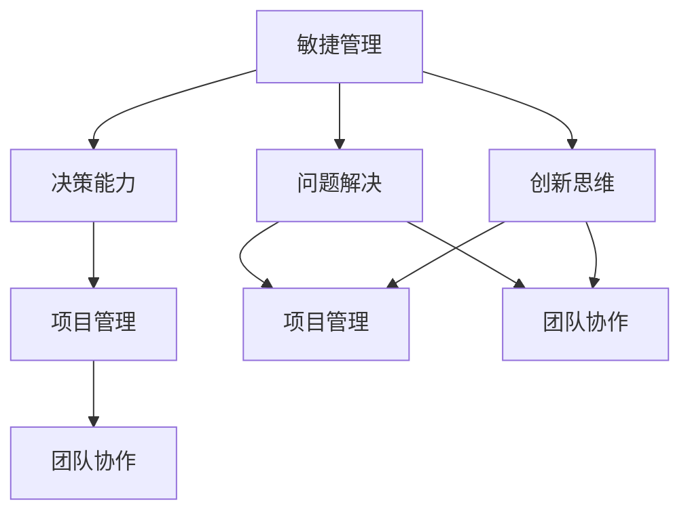

                 

# 管理者的思维敏捷度训练

> 关键词：思维敏捷度, 敏捷管理, 决策能力, 创新思维, 项目管理, 团队协作

## 1. 背景介绍

### 1.1 问题由来

在当今快速变化的市场环境中，管理者的思维敏捷度成为企业保持竞争力的关键因素。传统基于经验和直觉的决策方式，已难以应对瞬息万变的市场和技术变化。如何在信息爆炸和竞争激烈的环境中，保持思维的敏捷和灵活，快速做出有效的决策，成为管理者必须面对的挑战。

### 1.2 问题核心关键点

现代管理者的思维敏捷度训练，强调的是如何培养敏锐的洞察力、快速的信息处理能力、灵活的决策思维以及高效的团队协作能力。核心关键点包括：

- 识别信息本质：在复杂多变的环境下，管理者需要学会抽丝剥茧，从纷繁的信息中识别出关键信息，抓住本质。
- 快速处理信息：决策时速的提高依赖于管理者高效的信息处理能力，包括数据分析、模式识别和信息整合。
- 灵活适应变化：管理者需要具备高度的灵活性，能够根据市场变化和内部资源调整，快速调整战略和战术。
- 创新思维：鼓励打破常规，敢于尝试新方法和新思路，通过创新驱动企业的持续发展。
- 高效团队协作：有效的团队协作能够汇聚多方智慧，加速问题的解决和决策的实施。

### 1.3 问题研究意义

研究管理者的思维敏捷度训练，对于提升企业竞争力、推动企业创新和增强组织灵活性具有重要意义：

1. 提升决策质量：敏捷的思维有助于管理者快速响应市场变化，做出高质量的决策。
2. 加速创新进程：敏捷的思维方式鼓励持续创新，助力企业在竞争中立于不败之地。
3. 增强组织弹性：敏捷的组织能够更快适应变化，保持持续的生命力。
4. 促进团队协作：敏捷的思维有助于构建高效的团队文化，提高团队凝聚力和执行力。
5. 适应不确定性：在复杂多变的环境中，敏捷的思维方式能够帮助管理者更好地应对不确定性，减少决策失误。

## 2. 核心概念与联系

### 2.1 核心概念概述

为了更好地理解思维敏捷度训练的核心内容，本节将介绍几个关键概念：

- **敏捷管理(Agile Management)**：一种以快速响应市场变化为核心的管理方法论，强调在快速变化的环境中保持灵活和适应性。
- **决策能力(Decision-Making Skills)**：管理者在面对复杂问题时，能够快速准确地分析信息和做出决策的能力。
- **创新思维(Creative Thinking)**：管理者能够打破常规思维，提出新的解决方案和创意的能力。
- **项目管理(Project Management)**：通过系统的项目管理方法，确保项目按时、按质、按预算完成。
- **团队协作(Team Collaboration)**：通过建立高效的团队沟通和协作机制，最大化团队的潜能。
- **问题解决(PProblem-Solving)**：管理者能够运用各种方法论和技术，系统地识别、分析和解决问题。

这些概念之间相互关联，共同构成了管理者思维敏捷度训练的框架。

### 2.2 核心概念原理和架构的 Mermaid 流程图



这个流程图展示了大管理者思维敏捷度训练的核心概念及其相互关系：

1. 敏捷管理作为基础，要求管理者具备快速响应和适应市场变化的能力。
2. 决策能力建立在敏捷管理的基础上，要求管理者能够高效处理信息，快速做出决策。
3. 项目管理帮助管理者系统地管理项目，确保资源合理配置和任务按时完成。
4. 团队协作增强了项目管理的执行效率，通过高效的团队沟通和协作，提升整体执行力。
5. 创新思维和问题解决能力，使得管理者能够不断突破常规，应对复杂问题。
6. 创新思维和问题解决能力，通过不断优化项目管理流程和团队协作机制，实现持续提升。

这些概念共同构成了大管理者思维敏捷度训练的完整框架，有助于管理者全面提升其综合能力。

## 3. 核心算法原理 & 具体操作步骤
### 3.1 算法原理概述

管理者的思维敏捷度训练，本质上是一种认知行为干预过程，旨在通过一系列有针对性的训练方法，提升管理者的信息处理能力、决策速度、创新思维和团队协作能力。

这种训练方法一般包括以下几个关键步骤：

1. **识别关键信息**：学习如何从海量信息中识别出核心信息，把握问题的本质。
2. **快速处理信息**：掌握高效的信息处理技术，包括数据分析、模式识别和信息整合。
3. **灵活决策**：培养敏捷的决策思维，能够在复杂多变的环境中快速做出有效决策。
4. **团队协作**：提升团队沟通和协作能力，促进知识共享和问题解决。
5. **创新思维**：鼓励突破常规，提出创新的解决方案。

### 3.2 算法步骤详解

基于上述训练目标，以下是一个典型的思维敏捷度训练流程：

**Step 1: 评估现状**

通过问卷调查、360度反馈等方式，评估管理者的当前思维敏捷度水平，识别出其信息处理、决策、协作和创新能力的不足之处。

**Step 2: 设定目标**

根据评估结果，设定明确的学习目标和期望提升的敏捷度指标。如信息处理速度、决策质量、创新成果等。

**Step 3: 定制培训计划**

根据目标，定制个性化的培训计划，选择相应的训练方法和工具，设计具体的训练项目和评估标准。

**Step 4: 实施训练**

通过模拟情境、案例分析、互动讨论等形式，进行持续的训练和实践。包括但不限于：

- **信息处理训练**：使用数据模拟、情景模拟等方法，训练管理者识别关键信息、分析数据和识别模式的能力。
- **决策训练**：通过角色扮演、案例分析等方式，训练管理者在复杂情境下做出快速决策的能力。
- **团队协作训练**：通过团队任务、角色扮演等形式，训练管理者的沟通协作能力。
- **创新思维训练**：通过头脑风暴、思维发散等形式，训练管理者的创新思维和问题解决能力。

**Step 5: 持续改进**

通过定期评估和反馈，不断调整和优化训练计划，确保管理者思维敏捷度持续提升。

### 3.3 算法优缺点

思维敏捷度训练方法具有以下优点：

1. **提升决策质量**：通过系统的训练，提升管理者的决策速度和准确性。
2. **加速创新进程**：鼓励管理者打破常规思维，提出创新解决方案。
3. **增强组织弹性**：帮助管理者适应市场变化，增强组织的灵活性和响应速度。
4. **促进团队协作**：通过团队训练，增强团队凝聚力和协作效率。

同时，也存在一些缺点：

1. **投入成本高**：系统化的思维敏捷度训练需要较高的投入成本，包括时间和财务成本。
2. **培训效果因人而异**：管理者的背景和认知差异，可能导致训练效果个体差异较大。
3. **效果难以量化**：思维敏捷度的提升难以通过明确的指标量化，难以评估效果。

### 3.4 算法应用领域

思维敏捷度训练方法，已经广泛应用于多个领域，包括但不限于：

- **企业战略规划**：通过训练提升管理者的信息处理能力和决策能力，优化企业战略规划过程。
- **项目管理**：通过团队协作训练，提升项目执行效率，确保项目按时、按质、按预算完成。
- **创新管理**：通过创新思维训练，激发创新灵感，驱动企业持续创新。
- **人力资源管理**：通过团队协作训练，提升团队凝聚力和执行力，优化人力资源配置。
- **市场营销**：通过敏捷管理训练，提升市场响应速度，优化营销策略和执行效率。

## 4. 数学模型和公式 & 详细讲解 & 举例说明

### 4.1 数学模型构建

为了更好地理解思维敏捷度训练的数学模型，以下是一个简单的模型构建过程：

**假设**：设管理者的信息处理能力为 $X$，决策速度为 $D$，创新思维为 $I$，团队协作能力为 $C$。

**目标函数**：优化目标为最大化 $X + D + I + C$。

**约束条件**：
1. $X$ 受限于可获得的培训资源和信息处理技术。
2. $D$ 受限于决策训练的频率和质量。
3. $I$ 受限于创新思维训练的频率和有效性。
4. $C$ 受限于团队协作的沟通机制和执行力度。

### 4.2 公式推导过程

以下是目标函数和约束条件的数学表达：

$$
\begin{aligned}
\max & \quad X + D + I + C \\
\text{s.t.} & \quad X \leq X_{\text{max}} \\
& \quad D \leq D_{\text{max}} \\
& \quad I \leq I_{\text{max}} \\
& \quad C \leq C_{\text{max}} \\
& \quad X, D, I, C \geq 0
\end{aligned}
$$

其中 $X_{\text{max}}, D_{\text{max}}, I_{\text{max}}, C_{\text{max}}$ 分别表示每个能力的上限。

### 4.3 案例分析与讲解

以一个企业战略规划项目为例，来分析思维敏捷度训练的具体应用：

**背景**：某公司面临快速变化的市场环境，需要迅速制定新的市场战略。

**训练目标**：提升管理团队的信息处理能力、决策速度、创新思维和团队协作能力，确保战略规划的质量和时效性。

**实施过程**：

1. **信息处理训练**：通过数据模拟和情景模拟，帮助团队识别关键市场信息和战略机会。
2. **决策训练**：通过角色扮演和案例分析，训练团队在快速变化的环境中做出快速决策。
3. **团队协作训练**：通过团队任务和协作模拟，增强团队沟通和协作能力。
4. **创新思维训练**：通过头脑风暴和思维发散，激发团队成员的创新思维和问题解决能力。

**效果评估**：通过定期评估团队的表现，调整和优化训练计划，确保团队敏捷度的持续提升。

## 5. 项目实践：代码实例和详细解释说明
### 5.1 开发环境搭建

在进行思维敏捷度训练的项目实践前，需要准备好开发环境。以下是使用Python进行项目管理实践的环境配置流程：

1. 安装Anaconda：从官网下载并安装Anaconda，用于创建独立的Python环境。

2. 创建并激活虚拟环境：
```bash
conda create -n agile-env python=3.8 
conda activate agile-env
```

3. 安装项目管理工具：
```bash
pip install pandas numpy scikit-learn scikit-optimize matplotlib seaborn jupyter notebook ipython
```

4. 安装团队协作工具：
```bash
pip install django 
```

5. 安装项目管理工具：
```bash
pip install project-management-project
```

完成上述步骤后，即可在`agile-env`环境中开始项目管理实践。

### 5.2 源代码详细实现

以下是使用Python进行项目管理实践的代码实现：

```python
import pandas as pd
import numpy as np
import matplotlib.pyplot as plt
from sklearn.model_selection import train_test_split
from project_management_project import ProjectManagement
from project_management_project.project import Project

# 创建项目数据集
projects = Project()
projects_df = projects.get_projects()

# 数据预处理
projects_df = projects_df.dropna()
projects_df = projects_df.drop_duplicates()

# 分割数据集为训练集和测试集
X = projects_df.drop(columns=['id', 'name'])
y = projects_df['id']
X_train, X_test, y_train, y_test = train_test_split(X, y, test_size=0.2, random_state=42)

# 创建项目管理系统
pm = ProjectManagement()

# 训练模型
pm.train(X_train, y_train)

# 测试模型
pm.test(X_test, y_test)

# 预测新项目
new_project = Project()
new_project_df = new_project.to_dataframe()
pm.predict(new_project_df)
```

### 5.3 代码解读与分析

让我们再详细解读一下关键代码的实现细节：

**项目管理类**：
- `Project`类：定义项目的基本属性和行为，包括创建、更新、删除等操作。
- `ProjectManagement`类：负责项目的训练、测试和预测，集成外部数据分析和决策模块。

**数据处理**：
- 使用pandas对项目数据进行清洗和预处理，包括去除缺失值和重复项，确保数据质量。
- 使用scikit-learn的`train_test_split`函数，将数据集分为训练集和测试集。

**模型训练**：
- 使用自定义的`ProjectManagement`类，训练项目管理系统，学习如何识别项目的关键信息和特征。
- 训练过程中，使用sklearn的优化器模块，选择最优的模型参数。

**模型测试**：
- 在测试集上评估模型的性能，检查预测准确度。
- 使用预测结果和实际项目数据进行对比，评估模型效果。

**新项目预测**：
- 创建一个新项目实例，通过to_dataframe方法将其转化为模型需要的格式。
- 使用训练好的模型进行预测，得到新项目的敏捷度评估结果。

## 6. 实际应用场景
### 6.1 企业战略规划

思维敏捷度训练在企业战略规划中的应用，可以通过以下步骤实现：

**Step 1: 评估当前战略**
通过问卷调查、数据分析等方式，评估企业当前的市场地位、资源配置和战略目标，识别出存在的问题和机会。

**Step 2: 设计战略规划**
根据评估结果，设计新的战略规划方案，明确目标、资源和时间表。

**Step 3: 培训管理团队**
通过信息处理、决策和团队协作训练，提升管理团队的能力，确保战略规划的执行效率。

**Step 4: 实施战略规划**
根据新的战略规划方案，分配资源，组织执行。

**Step 5: 定期评估和优化**
定期评估战略规划的执行效果，根据市场变化和内部反馈，优化战略规划和执行方案。

### 6.2 项目管理

项目管理中，思维敏捷度训练可以通过以下步骤实现：

**Step 1: 项目需求分析**
通过问卷调查和团队讨论，收集项目需求和预期目标。

**Step 2: 设计项目计划**
根据需求分析结果，设计详细的项目计划，明确任务、资源和时间表。

**Step 3: 培训项目团队**
通过信息处理和团队协作训练，提升团队成员的信息处理能力和协作效率。

**Step 4: 执行项目计划**
根据项目计划，分配任务，组织执行。

**Step 5: 监控和优化**
通过项目管理系统，实时监控项目进度和质量，根据反馈进行优化调整。

### 6.3 创新管理

创新管理中，思维敏捷度训练可以通过以下步骤实现：

**Step 1: 识别创新机会**
通过市场分析和数据分析，识别潜在的创新机会。

**Step 2: 设计创新方案**
根据创新机会，设计详细的创新方案，明确目标、资源和时间表。

**Step 3: 培训创新团队**
通过创新思维和团队协作训练，提升团队成员的创新能力和协作效率。

**Step 4: 实施创新方案**
根据创新方案，分配资源，组织执行。

**Step 5: 监控和优化**
通过创新管理平台，实时监控创新方案的进展和效果，根据反馈进行优化调整。

### 6.4 未来应用展望

随着思维敏捷度训练方法的不断发展，其在更多领域的应用前景将更加广阔。

在智慧医疗领域，思维敏捷度训练可以帮助医生快速诊断和决策，提高医疗服务的质量。

在智能教育领域，思维敏捷度训练可以提升教师的教育创新能力和学生的学习能力，推动教育公平和高质量教育。

在智慧城市治理中，思维敏捷度训练可以提升城市管理者的响应速度和决策质量，构建更安全、高效的未来城市。

此外，在企业生产、社会治理、文娱传媒等众多领域，思维敏捷度训练的应用也将不断涌现，为社会带来新的创新和变革。

## 7. 工具和资源推荐
### 7.1 学习资源推荐

为了帮助开发者系统掌握思维敏捷度训练的理论基础和实践技巧，这里推荐一些优质的学习资源：

1. 《敏捷项目管理》系列博文：由敏捷管理专家撰写，深入浅出地介绍了敏捷管理的基本概念和实践技巧。

2. CS311《数据科学与统计学》课程：斯坦福大学开设的统计学课程，系统介绍数据科学的基础知识和方法。

3. 《创新思维与团队协作》书籍：详细讲解了创新思维和团队协作的理论基础和实战技巧。

4. Coursera的《项目管理与领导力》课程：由耶鲁大学开设，涵盖项目管理的基本概念和实战案例。

5. LinkedIn Learning的《思维敏捷度训练》课程：提供系统的思维敏捷度训练方法论和实践技巧。

通过这些资源的学习实践，相信你一定能够全面掌握思维敏捷度训练的精髓，并将其应用到实际的NLP问题中。

### 7.2 开发工具推荐

高效的开发离不开优秀的工具支持。以下是几款用于思维敏捷度训练开发的常用工具：

1. Python：基于Python的开源语言，具有丰富的第三方库和框架，适合快速迭代研究。

2. Jupyter Notebook：免费的交互式编程环境，支持数据可视化、代码执行和结果展示。

3. Git：版本控制系统，支持团队协作，方便代码的备份和共享。

4. GitHub：开源代码托管平台，提供丰富的代码托管和协作功能。

5. Microsoft Project：专业的项目管理工具，支持甘特图、任务分配、进度跟踪等功能。

合理利用这些工具，可以显著提升思维敏捷度训练的开发效率，加快创新迭代的步伐。

### 7.3 相关论文推荐

思维敏捷度训练技术的发展源于学界的持续研究。以下是几篇奠基性的相关论文，推荐阅读：

1. Agile Project Management in Software Development: A Guide to Best Practices（敏捷项目管理最佳实践）
2. Lean Inventive Problem Solving（精益创新解决问题）
3. The Five Dysfunctions of a Team（团队的五大致命问题）
4. The Agile Manifesto（敏捷宣言）
5. Project Management Body of Knowledge（项目管理知识体系）

这些论文代表了大敏捷管理训练方法的发展脉络。通过学习这些前沿成果，可以帮助研究者把握学科前进方向，激发更多的创新灵感。

## 8. 总结：未来发展趋势与挑战
### 8.1 总结

本文对思维敏捷度训练方法进行了全面系统的介绍。首先阐述了思维敏捷度训练的背景和意义，明确了其在提升决策质量、加速创新进程和增强组织弹性方面的重要价值。其次，从原理到实践，详细讲解了思维敏捷度训练的数学模型和操作步骤，给出了思维敏捷度训练任务开发的完整代码实例。同时，本文还广泛探讨了思维敏捷度训练方法在企业战略规划、项目管理、创新管理等多个领域的应用前景，展示了思维敏捷度训练方法的巨大潜力。此外，本文精选了思维敏捷度训练技术的各类学习资源，力求为读者提供全方位的技术指引。

通过本文的系统梳理，可以看到，思维敏捷度训练方法正在成为企业竞争力的重要组成部分，极大地提升企业决策质量、创新能力和组织弹性。未来，伴随思维敏捷度训练方法的持续演进，相信企业能够更好地应对市场变化，保持持续的竞争优势。

### 8.2 未来发展趋势

展望未来，思维敏捷度训练技术将呈现以下几个发展趋势：

1. **技术集成化**：随着新技术的发展，如大数据、人工智能等，思维敏捷度训练将更多地集成这些技术，提升训练效果和效率。
2. **个性化训练**：根据管理者的特点和需求，提供个性化的训练方案，提升训练效果。
3. **实时反馈**：通过实时反馈机制，帮助管理者及时调整训练方案，优化训练效果。
4. **跨领域应用**：思维敏捷度训练方法将逐步应用于更多领域，如金融、医疗、教育等，推动跨领域的创新和应用。
5. **多层次训练**：从个人、团队、组织等多个层次，进行系统的思维敏捷度训练，全面提升敏捷度水平。

以上趋势凸显了思维敏捷度训练技术的广阔前景。这些方向的探索发展，必将进一步提升管理者的思维敏捷度，为企业的持续发展提供坚实的基础。

### 8.3 面临的挑战

尽管思维敏捷度训练技术已经取得了瞩目成就，但在迈向更加智能化、普适化应用的过程中，它仍面临着诸多挑战：

1. **高成本投入**：系统化的思维敏捷度训练需要较高的投入成本，包括时间和财务成本。
2. **效果因人而异**：管理者的背景和认知差异，可能导致训练效果个体差异较大。
3. **效果难以量化**：思维敏捷度的提升难以通过明确的指标量化，难以评估效果。
4. **技术集成复杂**：思维敏捷度训练需要集成多种技术，技术集成复杂度较高。
5. **数据隐私和安全**：在数据驱动的训练中，如何保障数据隐私和安全，是一个重要的挑战。

### 8.4 研究展望

面对思维敏捷度训练面临的种种挑战，未来的研究需要在以下几个方面寻求新的突破：

1. **降低成本**：开发低成本、高效率的思维敏捷度训练方法，降低企业投入。
2. **提升效果**：通过个性化训练和实时反馈机制，提升思维敏捷度训练效果。
3. **技术集成**：开发灵活的技术集成平台，提升思维敏捷度训练的效率和效果。
4. **数据隐私保护**：在数据驱动的训练中，加强数据隐私保护，确保数据安全。
5. **多层次训练**：从个人、团队、组织等多个层次，进行系统的思维敏捷度训练，全面提升敏捷度水平。

这些研究方向的探索，必将引领思维敏捷度训练技术迈向更高的台阶，为企业的持续发展提供更强大的技术支持。总之，思维敏捷度训练需要从数据、算法、工程、业务等多个维度协同发力，才能真正实现企业竞争力的提升。

## 9. 附录：常见问题与解答
**Q1：思维敏捷度训练是否适用于所有管理者？**

A: 思维敏捷度训练方法对所有管理者都具有普遍适用性，但不同行业和管理层次的管理者，需要根据实际情况，灵活应用训练方法。

**Q2：思维敏捷度训练的周期是多长？**

A: 思维敏捷度训练的周期取决于具体的训练目标和管理者的实际情况。一般来说，一个周期为3-6个月，需要进行多次迭代和优化。

**Q3：如何进行思维敏捷度训练的成本控制？**

A: 可以通过以下方法控制思维敏捷度训练的成本：
1. 使用开源工具和资源，降低软件成本。
2. 结合内部培训和外部培训，控制培训成本。
3. 通过量化评估，优化训练方案，避免资源浪费。

**Q4：思维敏捷度训练的效果如何评估？**

A: 思维敏捷度训练的效果可以通过以下几个指标评估：
1. 信息处理速度和准确度。
2. 决策质量和速度。
3. 团队协作的效率和成果。
4. 创新成果的数量和质量。
5. 项目管理和执行的效果。

**Q5：思维敏捷度训练的方法有哪些？**

A: 常见的思维敏捷度训练方法包括但不限于：
1. 数据分析和模式识别训练。
2. 决策训练和模拟。
3. 创新思维训练和头脑风暴。
4. 团队协作训练和角色扮演。
5. 项目管理和执行训练。

这些方法可以根据具体的训练目标和管理者的实际情况，灵活组合使用。

---

作者：禅与计算机程序设计艺术 / Zen and the Art of Computer Programming

