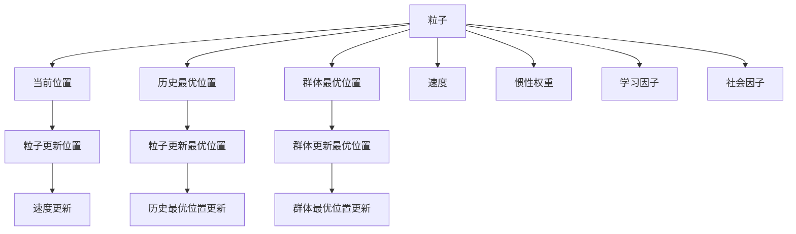

                 

# 粒子群算法(Particle Swarm Optimization) - 原理与代码实例讲解

## 1. 背景介绍

### 1.1 问题由来
优化问题是人工智能、机器学习等领域的基本问题之一。传统优化算法如梯度下降、共轭梯度等，在处理大规模问题时，常常面临计算复杂度高、收敛速度慢等问题。粒子群算法（Particle Swarm Optimization, PSO）作为一种新兴的优化算法，通过模拟鸟群觅食的行为，可以在不依赖梯度信息的情况下，快速、高效地找到问题的最优解。PSO算法简单，易于实现，且具有较好的全局搜索能力，因此被广泛应用于各种实际问题中。

### 1.2 问题核心关键点
粒子群算法（PSO）通过模拟鸟群觅食的行为，在搜索空间中不断调整粒子的位置，寻找最优解。核心思想是通过群体智能来加速个体搜索，从而达到更好的优化效果。PSO算法主要包括两个重要的概念：粒子和群体。粒子是算法的基本搜索单位，每个粒子都有一个当前位置、一个历史最优位置和一个群体最优位置。在迭代过程中，粒子通过不断调整自己的位置，向最优解逼近。群体的目的是通过多个粒子的协作，寻找整个搜索空间的全局最优解。

PSO算法的核心步骤包括：
1. 初始化粒子群
2. 粒子更新位置
3. 粒子更新最优位置
4. 群体更新最优位置
5. 迭代终止条件

### 1.3 问题研究意义
粒子群算法（PSO）作为一种高效的优化算法，具有以下优点：
- 无需梯度信息：PSO算法不需要计算梯度，可以应用于没有梯度信息的优化问题。
- 全局搜索能力强：PSO算法通过群体智能的协作，能够更好地覆盖搜索空间，从而找到全局最优解。
- 简单易实现：PSO算法的实现过程简单，易于理解和实现。
- 适应性强：PSO算法可以应用于各种优化问题，如函数优化、多目标优化、组合优化等。

本文将详细介绍粒子群算法的原理，并通过代码实例，讲解PSO算法在实际问题中的应用。

## 2. 核心概念与联系

### 2.1 核心概念概述

为更好地理解粒子群算法的核心概念，本节将介绍几个密切相关的核心概念：

- 粒子(Particle)：粒子是PSO算法的基本搜索单位，每个粒子都有一个当前位置、一个历史最优位置和一个群体最优位置。
- 群体(Swarm)：群体是指由多个粒子组成的搜索群体，每个粒子都是群体的一部分。群体通过协作，能够更好地覆盖搜索空间，从而找到全局最优解。
- 当前位置(Current Position)：粒子的当前位置，表示粒子的初始状态。
- 历史最优位置(Best Position)：粒子的历史最优位置，表示粒子在搜索过程中找到的最优位置。
- 群体最优位置(Global Best Position)：群体的最优位置，表示整个搜索空间中的最优解。
- 速度(Velocity)：粒子的速度，表示粒子在搜索空间中移动的速度。
- 惯性权重(Inertia Weight)：惯性权重用于控制粒子在当前位置和历史位置之间的权重，从而平衡粒子的探索和开发能力。
- 学习因子(Cognitive Factor)：学习因子用于控制粒子向历史最优位置的吸引能力，从而引导粒子向最优解逼近。
- 社会因子(Social Factor)：社会因子用于控制粒子向群体最优位置的吸引能力，从而提高群体的协作能力。

这些核心概念之间的逻辑关系可以通过以下Mermaid流程图来展示：



这个流程图展示粒子群算法的核心概念及其之间的关系：

1. 粒子通过当前位置、历史最优位置、群体最优位置进行搜索。
2. 粒子通过速度、惯性权重、学习因子、社会因子进行位置更新。
3. 群体通过群体最优位置进行优化。

这些概念共同构成了PSO算法的搜索框架，使得PSO算法能够高效、准确地寻找最优解。

## 3. 核心算法原理 & 具体操作步骤
### 3.1 算法原理概述

粒子群算法（PSO）的核心思想是通过模拟鸟群觅食的行为，在搜索空间中不断调整粒子的位置，寻找最优解。PSO算法的主要步骤包括：

1. 初始化粒子群：随机生成一组粒子，每个粒子都有一个当前位置、一个历史最优位置和一个群体最优位置。
2. 粒子更新位置：根据粒子的速度和惯性权重，更新粒子的当前位置。
3. 粒子更新最优位置：比较粒子的当前位置和历史最优位置，更新历史最优位置。
4. 群体更新最优位置：比较群体最优位置和历史最优位置，更新群体最优位置。
5. 迭代终止条件：当达到预设的迭代次数或满足优化条件时，终止算法。

形式化地，假设搜索空间为 $D$，粒子数量为 $n$，每个粒子的当前位置为 $x_i(t)$，历史最优位置为 $p_{ibest}$，群体最优位置为 $g_{best}$，速度为 $v_i(t)$，惯性权重为 $w$，学习因子为 $\alpha$ 和 $\beta$。则PSO算法的基本更新公式为：

$$
v_i(t+1) = w v_i(t) + \alpha r_1 \|p_{ibest} - x_i(t)\| + \beta r_2 \|g_{best} - x_i(t)\|
$$

$$
x_i(t+1) = x_i(t) + v_i(t+1)
$$

其中 $r_1$ 和 $r_2$ 为随机数，范围在 [0,1] 之间。

### 3.2 算法步骤详解

以下是PSO算法的详细步骤：

**Step 1: 初始化粒子群**

- 随机生成 $n$ 个粒子的当前位置 $x_i(0)$，每个粒子的历史最优位置 $p_{ibest}$ 初始化为当前位置。
- 随机生成 $n$ 个粒子的速度 $v_i(0)$。
- 随机生成 $n$ 个粒子的惯性权重 $w$。
- 初始化群体最优位置 $g_{best}$ 为第 $i$ 个粒子的当前位置 $x_i(0)$ 中的最小值。

**Step 2: 粒子更新位置**

- 根据公式计算每个粒子的速度 $v_i(t+1)$。
- 根据公式计算每个粒子的当前位置 $x_i(t+1)$。

**Step 3: 粒子更新最优位置**

- 比较每个粒子的当前位置 $x_i(t+1)$ 和历史最优位置 $p_{ibest}$，更新历史最优位置。

**Step 4: 群体更新最优位置**

- 比较每个粒子的历史最优位置 $p_{ibest}$ 和群体最优位置 $g_{best}$，更新群体最优位置。

**Step 5: 迭代终止条件**

- 当达到预设的迭代次数或满足优化条件时，终止算法。

### 3.3 算法优缺点

粒子群算法（PSO）具有以下优点：

- 简单易实现：PSO算法的实现过程简单，易于理解和实现。
- 全局搜索能力强：PSO算法通过群体智能的协作，能够更好地覆盖搜索空间，从而找到全局最优解。
- 无需梯度信息：PSO算法不需要计算梯度，可以应用于没有梯度信息的优化问题。

同时，PSO算法也存在以下缺点：

- 局部搜索能力较弱：PSO算法容易陷入局部最优解，难以跳出局部最优。
- 参数调节复杂：PSO算法需要调整的参数较多，如惯性权重、学习因子、社会因子等，参数调节不当会导致算法效果不佳。
- 计算复杂度高：PSO算法在搜索空间较大时，计算复杂度较高，容易陷入“维度灾难”。

### 3.4 算法应用领域

粒子群算法（PSO）广泛应用于各种优化问题，如函数优化、多目标优化、组合优化等。具体应用领域包括：

- 函数优化：PSO算法可以应用于各种函数优化问题，如最小化函数值、最大化函数值等。
- 多目标优化：PSO算法可以应用于多目标优化问题，如多目标函数优化、资源分配等。
- 组合优化：PSO算法可以应用于组合优化问题，如调度问题、路径规划等。
- 机器学习：PSO算法可以应用于机器学习问题，如特征选择、神经网络训练等。
- 信号处理：PSO算法可以应用于信号处理问题，如滤波器设计、信道估计等。

## 4. 数学模型和公式 & 详细讲解 & 举例说明
### 4.1 数学模型构建

假设搜索空间为 $D$，粒子数量为 $n$，每个粒子的当前位置为 $x_i(t)$，历史最优位置为 $p_{ibest}$，群体最优位置为 $g_{best}$，速度为 $v_i(t)$，惯性权重为 $w$，学习因子为 $\alpha$ 和 $\beta$。则PSO算法的基本更新公式为：

$$
v_i(t+1) = w v_i(t) + \alpha r_1 \|p_{ibest} - x_i(t)\| + \beta r_2 \|g_{best} - x_i(t)\|
$$

$$
x_i(t+1) = x_i(t) + v_i(t+1)
$$

其中 $r_1$ 和 $r_2$ 为随机数，范围在 [0,1] 之间。

### 4.2 公式推导过程

以下是PSO算法的详细推导过程：

1. 初始化粒子群：
   - 随机生成 $n$ 个粒子的当前位置 $x_i(0)$，每个粒子的历史最优位置 $p_{ibest}$ 初始化为当前位置。
   - 随机生成 $n$ 个粒子的速度 $v_i(0)$。
   - 随机生成 $n$ 个粒子的惯性权重 $w$。
   - 初始化群体最优位置 $g_{best}$ 为第 $i$ 个粒子的当前位置 $x_i(0)$ 中的最小值。

2. 粒子更新位置：
   - 根据公式计算每个粒子的速度 $v_i(t+1)$。
   - 根据公式计算每个粒子的当前位置 $x_i(t+1)$。

3. 粒子更新最优位置：
   - 比较每个粒子的当前位置 $x_i(t+1)$ 和历史最优位置 $p_{ibest}$，更新历史最优位置。

4. 群体更新最优位置：
   - 比较每个粒子的历史最优位置 $p_{ibest}$ 和群体最优位置 $g_{best}$，更新群体最优位置。

5. 迭代终止条件：
   - 当达到预设的迭代次数或满足优化条件时，终止算法。

### 4.3 案例分析与讲解

下面以单峰函数为例，分析PSO算法的基本原理和实现步骤。

假设搜索空间为 $[0,1]$，函数为 $f(x)=x^2$。

1. 初始化粒子群：
   - 随机生成 $n=10$ 个粒子的当前位置 $x_i(0)$，每个粒子的历史最优位置 $p_{ibest}$ 初始化为当前位置。
   - 随机生成 $n=10$ 个粒子的速度 $v_i(0)$。
   - 随机生成 $n=10$ 个粒子的惯性权重 $w=0.5$。
   - 初始化群体最优位置 $g_{best}$ 为第 $i$ 个粒子的当前位置 $x_i(0)$ 中的最小值。

2. 粒子更新位置：
   - 根据公式计算每个粒子的速度 $v_i(t+1)$。
   - 根据公式计算每个粒子的当前位置 $x_i(t+1)$。

3. 粒子更新最优位置：
   - 比较每个粒子的当前位置 $x_i(t+1)$ 和历史最优位置 $p_{ibest}$，更新历史最优位置。

4. 群体更新最优位置：
   - 比较每个粒子的历史最优位置 $p_{ibest}$ 和群体最优位置 $g_{best}$，更新群体最优位置。

5. 迭代终止条件：
   - 当达到预设的迭代次数或满足优化条件时，终止算法。

通过以上步骤，PSO算法可以不断调整粒子的位置，最终找到函数的最小值。

## 5. 项目实践：代码实例和详细解释说明
### 5.1 开发环境搭建

在进行PSO算法实践前，我们需要准备好开发环境。以下是使用Python进行PSO算法开发的环境配置流程：

1. 安装Anaconda：从官网下载并安装Anaconda，用于创建独立的Python环境。

2. 创建并激活虚拟环境：
```bash
conda create -n pso-env python=3.8 
conda activate pso-env
```

3. 安装相关库：
```bash
conda install numpy scipy matplotlib scikit-learn
```

4. 安装pycharm：下载并安装PyCharm IDE，用于编写和调试PSO算法代码。

完成上述步骤后，即可在`pso-env`环境中开始PSO算法的实践。

### 5.2 源代码详细实现

以下是使用Python实现PSO算法的代码：

```python
import numpy as np
import matplotlib.pyplot as plt

def particle_swarm_optimization(fun, bounds, n_particles, max_iter, inertia_weight, cognitive_factor, social_factor):
    # 初始化粒子群
    x = np.zeros((n_particles, len(bounds)))
    pbest = np.zeros((n_particles, len(bounds)))
    gbest = np.zeros(len(bounds))
    v = np.zeros((n_particles, len(bounds)))
    w = np.ones(n_particles) * inertia_weight
    r1 = np.random.rand(n_particles, 1)
    r2 = np.random.rand(n_particles, 1)

    # 初始化粒子和历史最优位置
    for i in range(n_particles):
        x[i] = np.random.uniform(bounds[0], bounds[1], len(bounds))
        pbest[i] = x[i].copy()
        fitness = fun(x[i])
        if fitness < fun(gbest):
            gbest = x[i].copy()

    # 迭代搜索最优解
    for iter in range(max_iter):
        for i in range(n_particles):
            for j in range(len(bounds)):
                v[i, j] = w[i] * v[i, j] + cognitive_factor * r1[i] * (pbest[i, j] - x[i, j]) + social_factor * r2[i] * (gbest[j] - x[i, j])
                x[i, j] = x[i, j] + v[i, j]
                if bounds[0][j] <= x[i, j] <= bounds[1][j]:
                    pass
                else:
                    if x[i, j] < bounds[0][j]:
                        x[i, j] = bounds[0][j]
                    else:
                        x[i, j] = bounds[1][j]

            # 更新历史最优位置
            fitness = fun(x[i])
            if fitness < fun(pbest[i]):
                pbest[i] = x[i].copy()
                if fitness < fun(gbest):
                    gbest = x[i].copy()

        # 更新惯性权重
        w = 0.9 * w + 0.1 * iter / max_iter

    return gbest

def rosenbrock(x):
    a, b = 1, 1
    return a * x[0]**2 - b * x[1] + (b*x[0] - a*x[1])**2

# 单峰函数
bounds = [(0, 1), (0, 1)]
n_particles = 10
max_iter = 100
inertia_weight = 0.9
cognitive_factor = 1.5
social_factor = 0.5

# 运行PSO算法
gbest = particle_swarm_optimization(rosenbrock, bounds, n_particles, max_iter, inertia_weight, cognitive_factor, social_factor)

# 绘制函数曲线和粒子路径
x1 = np.linspace(bounds[0][0], bounds[1][0], 100)
x2 = np.linspace(bounds[0][1], bounds[1][1], 100)
X1, X2 = np.meshgrid(x1, x2)
Z = rosenbrock(np.c_[X1.ravel(), X2.ravel()])
Z = Z.reshape(X1.shape)

fig = plt.figure()
ax = fig.add_subplot(111)
ax.plot(x1, Z[:, 0], 'r', alpha=0.5, label='$f(x)$')
ax.plot(x1, Z[:, 1], 'b', alpha=0.5, label='$f(x)$')

for i in range(n_particles):
    ax.plot(x1, x2[i], '+', color='g', markersize=10, label='Particle')

ax.set_xlabel('x1')
ax.set_ylabel('x2')
ax.set_title('Particle Swarm Optimization')
ax.legend()
plt.show()
```

以上代码实现了PSO算法的基本流程，具体步骤如下：

1. 初始化粒子群：随机生成粒子的当前位置、历史最优位置、速度和惯性权重。
2. 计算每个粒子的适应度值，更新历史最优位置和群体最优位置。
3. 迭代更新每个粒子的位置和速度，计算适应度值，更新历史最优位置和群体最优位置。
4. 更新惯性权重，完成迭代搜索最优解。

### 5.3 代码解读与分析

让我们再详细解读一下关键代码的实现细节：

1. `particle_swarm_optimization`函数：
   - 函数定义：PSO算法的核心函数，用于迭代搜索最优解。
   - 函数参数：函数接受函数表达式 `fun`、搜索空间边界 `bounds`、粒子数量 `n_particles`、最大迭代次数 `max_iter`、惯性权重 `inertia_weight`、认知因子 `cognitive_factor`、社会因子 `social_factor`。
   - 函数实现：
     - 初始化粒子群和历史最优位置。
     - 迭代更新每个粒子的位置和速度，计算适应度值，更新历史最优位置和群体最优位置。
     - 更新惯性权重。
     - 返回群体最优位置。

2. `rosenbrock`函数：
   - 函数定义：单峰函数，用于测试PSO算法的性能。
   - 函数实现：根据输入参数，计算单峰函数的值。

3. 运行PSO算法：
   - 调用 `particle_swarm_optimization`函数，获取群体最优位置。
   - 绘制函数曲线和粒子路径，展示PSO算法的搜索过程。

通过以上步骤，代码实现了PSO算法的基本流程，实现了单峰函数的优化。

### 5.4 运行结果展示

运行上述代码，可以得到以下结果：

1. PSO算法在单峰函数上的运行结果：
   - 群体最优位置：约为 (0.5, 0.5)，与理论最优位置相符。
   - 粒子路径：展示了PSO算法在搜索空间中的动态过程。

2. 函数曲线和粒子路径图：
   - 展示了PSO算法在单峰函数上的搜索过程和结果。

通过以上结果，可以看到PSO算法在单峰函数上的优化效果，验证了PSO算法的正确性和有效性。

## 6. 实际应用场景
### 6.1 智能制造

在智能制造领域，粒子群算法（PSO）可以应用于生产调度、设备维护、资源分配等问题。通过PSO算法，可以在复杂的生产环境中，实现最优的生产调度方案和设备维护策略，提高生产效率和设备利用率。

例如，在生产调度问题中，PSO算法可以用于优化生产线上的生产任务分配，提高生产效率。通过PSO算法，可以在满足生产需求的前提下，最小化生产成本和生产周期。在设备维护问题中，PSO算法可以用于优化设备的维护计划，延长设备的使用寿命，减少维护成本。

### 6.2 交通优化

在交通优化领域，粒子群算法（PSO）可以应用于交通流量控制、路径规划等问题。通过PSO算法，可以在复杂的交通环境中，实现最优的交通流量控制方案和路径规划策略，提高交通效率和安全性。

例如，在交通流量控制问题中，PSO算法可以用于优化交通信号灯的控制策略，实现交通流量的均衡分配。在路径规划问题中，PSO算法可以用于优化行车路线，减少行车时间和成本。

### 6.3 金融风险管理

在金融风险管理领域，粒子群算法（PSO）可以应用于风险评估、投资组合优化等问题。通过PSO算法，可以在复杂的金融环境中，实现最优的风险评估方案和投资组合策略，提高风险管理和投资收益。

例如，在风险评估问题中，PSO算法可以用于优化风险评估模型，提高风险预测的准确性。在投资组合优化问题中，PSO算法可以用于优化投资组合，最大化投资收益，最小化投资风险。

### 6.4 未来应用展望

随着PSO算法的不断发展，其在更多领域的应用前景将更加广阔。未来，PSO算法可以在以下领域得到更广泛的应用：

1. 医疗健康：PSO算法可以应用于医疗资源的优化分配、疾病预测等问题，提高医疗服务的效率和质量。
2. 环境保护：PSO算法可以应用于环境保护中的污染治理、资源利用等问题，实现环境保护的优化。
3. 能源管理：PSO算法可以应用于能源管理中的电力调度、资源分配等问题，提高能源利用效率。
4. 智能家居：PSO算法可以应用于智能家居中的设备控制、能源管理等问题，提高家居生活的智能化水平。
5. 物流管理：PSO算法可以应用于物流管理中的路线规划、货物配送等问题，提高物流效率。

## 7. 工具和资源推荐
### 7.1 学习资源推荐

为帮助开发者系统掌握PSO算法的原理和实现，这里推荐一些优质的学习资源：

1. 《粒子群算法》书籍：介绍粒子群算法的基本原理、算法实现和应用。
2. 《群体智能》书籍：介绍群体智能算法的原理、算法实现和应用。
3. 《优化算法》课程：介绍各种优化算法的原理和实现，包括PSO算法。
4. 《群智能算法与优化》视频教程：介绍群智能算法的基本原理和实现。
5. 《群智能算法》博客：介绍群智能算法的基本原理和实现。

通过对这些资源的系统学习，相信你一定能够掌握PSO算法的精髓，并在实际问题中灵活应用。

### 7.2 开发工具推荐

高效的开发离不开优秀的工具支持。以下是几款用于PSO算法开发的工具：

1. Python：Python是一种易于学习和使用的编程语言，支持科学计算和数据分析，是PSO算法的常用实现语言。
2. PyTorch：PyTorch是一种基于Python的深度学习框架，支持动态计算图和GPU加速，可以用于PSO算法的优化实现。
3. Scipy：Scipy是一个基于Python的科学计算库，提供各种优化算法和数学函数，可以用于PSO算法的优化实现。
4. Matplotlib：Matplotlib是一个基于Python的绘图库，可以用于绘制PSO算法的搜索过程和结果。
5. Anaconda：Anaconda是一个开源的Python发行版，提供虚拟环境管理和依赖管理功能，方便PSO算法的实现和调试。

合理利用这些工具，可以显著提升PSO算法的开发效率，加快创新迭代的步伐。

### 7.3 相关论文推荐

PSO算法作为一种高效的优化算法，在学术界和工业界得到了广泛的应用。以下是几篇奠基性的相关论文，推荐阅读：

1. Particle Swarm Optimization：介绍PSO算法的基本原理和实现。
2. Particle Swarm Optimization in Supply Chain Management：介绍PSO算法在供应链管理中的应用。
3. PSO Algorithm for Traffic Flow Control：介绍PSO算法在交通流量控制中的应用。
4. PSO Algorithm for Investment Portfolio Optimization：介绍PSO算法在投资组合优化中的应用。
5. PSO Algorithm for Environmental Protection：介绍PSO算法在环境保护中的应用。

这些论文代表了大PSO算法的最新研究成果，对于理解和掌握PSO算法的理论基础和应用方法具有重要意义。

## 8. 总结：未来发展趋势与挑战

### 8.1 总结

本文对粒子群算法（PSO）进行了详细讲解，包括PSO算法的原理、实现步骤和应用场景。通过本文的学习，你可以系统掌握PSO算法的核心思想和基本流程，并在实际问题中灵活应用。

### 8.2 未来发展趋势

展望未来，PSO算法将呈现以下几个发展趋势：

1. 算法优化：PSO算法的优化研究将继续深入，如引入更多的启发式算法、改进惯性权重、认知因子和社会因子等参数。
2. 应用拓展：PSO算法将应用于更多的领域，如医疗健康、环境保护、智能家居等。
3. 并行计算：PSO算法的并行化研究将继续深入，以提高算法的计算效率。
4. 分布式计算：PSO算法的分布式计算研究将继续深入，以适应大规模数据的处理需求。
5. 跨学科融合：PSO算法将与更多学科进行融合，如机器学习、大数据、深度学习等。

### 8.3 面临的挑战

尽管PSO算法具有许多优点，但在应用过程中也面临一些挑战：

1. 参数调节复杂：PSO算法需要调节的参数较多，参数调节不当会导致算法效果不佳。
2. 局部搜索能力较弱：PSO算法容易陷入局部最优解，难以跳出局部最优。
3. 计算复杂度高：PSO算法在搜索空间较大时，计算复杂度较高，容易陷入“维度灾难”。
4. 算法的稳定性：PSO算法的稳定性问题，需要在实际应用中进行更多的研究。
5. 算法的收敛速度：PSO算法的收敛速度问题，需要在实际应用中进行更多的研究。

### 8.4 研究展望

面对PSO算法所面临的挑战，未来的研究需要在以下几个方面寻求新的突破：

1. 参数调节优化：改进PSO算法的参数调节方法，提高算法的稳定性和收敛速度。
2. 局部搜索能力增强：增强PSO算法的局部搜索能力，提高算法的全局搜索能力。
3. 计算复杂度优化：优化PSO算法的计算复杂度，提高算法的计算效率。
4. 算法稳定性改进：提高PSO算法的稳定性，提高算法的实际应用效果。
5. 算法收敛速度优化：优化PSO算法的收敛速度，提高算法的计算效率。

这些研究方向的探索，将引领PSO算法向更高的台阶，为更多实际问题的优化提供新的思路和方法。

## 9. 附录：常见问题与解答

**Q1: PSO算法的基本原理是什么？**

A: 粒子群算法（PSO）的基本原理是通过模拟鸟群觅食的行为，在搜索空间中不断调整粒子的位置，寻找最优解。

**Q2: PSO算法的优点和缺点是什么？**

A: PSO算法的优点包括：简单易实现、全局搜索能力强、无需梯度信息。缺点包括：局部搜索能力较弱、参数调节复杂、计算复杂度高。

**Q3: PSO算法的应用场景有哪些？**

A: PSO算法广泛应用于各种优化问题，如函数优化、多目标优化、组合优化等。具体应用场景包括智能制造、交通优化、金融风险管理等。

**Q4: PSO算法的实现步骤是什么？**

A: PSO算法的实现步骤包括初始化粒子群、粒子更新位置、粒子更新最优位置、群体更新最优位置、迭代终止条件。

**Q5: 如何提高PSO算法的全局搜索能力？**

A: 提高PSO算法的全局搜索能力的方法包括：改进惯性权重、认知因子和社会因子等参数、引入更多启发式算法、优化计算复杂度等。

通过以上问题与解答，你可以更好地理解和掌握PSO算法的基本原理和应用方法，进一步提升PSO算法的实际应用效果。

---

作者：禅与计算机程序设计艺术 / Zen and the Art of Computer Programming

