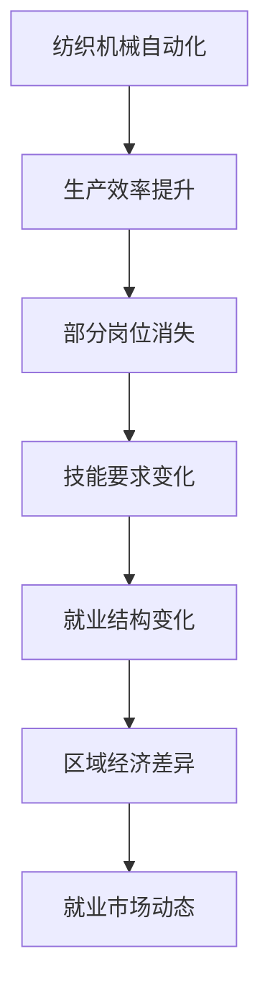

                 

## 1. 背景介绍

### 1.1 问题由来

纺织机械自动化在过去几十年中经历了显著的技术进步，从早期的手动编织和手摇纺织机，到如今的自动化生产线和智能控制系统，这一转型极大地提升了生产效率和产品质量。然而，这一转型也带来了一些社会经济问题，尤其是对劳动力的就业效应。本文旨在通过分析纺织机械自动化对就业的影响，探讨其可能带来的机遇与挑战。

### 1.2 问题核心关键点

纺织机械自动化对就业的影响主要集中在以下几个方面：
- 生产效率提升：自动化技术的引入使得生产效率显著提高，可能导致部分岗位的消失。
- 技能要求变化：自动化要求工人掌握新技能，如操作和维护自动化设备，可能对劳动力的技能结构产生影响。
- 就业结构变化：自动化可能导致某些低技能岗位减少，而对高技能岗位的需求增加，影响整体就业结构。
- 区域经济发展：自动化技术的普及可能导致区域经济发展不均衡，某些地区可能因为缺乏自动化设备而失去竞争优势。
- 就业市场动态：就业市场的动态变化需要适应新的劳动力需求，对教育培训体系提出挑战。

### 1.3 问题研究意义

探讨纺织机械自动化对就业的影响，不仅有助于理解技术进步对社会经济结构的影响，还能够为政策制定者提供科学依据，指导未来的教育培训和劳动就业政策。此外，了解自动化的就业效应，可以帮助企业更好地规划人力资源，提升竞争力。

## 2. 核心概念与联系

### 2.1 核心概念概述

为更好地理解纺织机械自动化对就业的影响，本节将介绍几个密切相关的核心概念：

- 纺织机械自动化：指通过机械、电子、计算机等技术手段，对纺织生产过程进行自动化控制，提高生产效率和产品质量的技术系统。
- 生产效率：指单位时间内的生产能力，提高生产效率是自动化技术的直接目标。
- 就业效应：指自动化技术对就业市场的广泛影响，包括就业岗位的变化、技能要求的变化等。
- 技能转型：指劳动力从传统岗位转向自动化技术操作和维护岗位的过程。
- 区域经济差异：指不同地区因自动化技术普及程度的不同而产生的经济发展差距。

这些核心概念之间的逻辑关系可以通过以下Mermaid流程图来展示：



这个流程图展示了一些关键概念及其相互关联：

1. 自动化技术通过提高生产效率，改变岗位需求。
2. 生产效率的提升可能导致某些低技能岗位的减少，并增加对高技能岗位的需求。
3. 就业结构的变化可能加剧地区经济发展不均衡，增加就业市场动态。
4. 这些变化要求劳动力进行技能转型，同时对教育培训体系提出新的要求。

## 3. 核心算法原理 & 具体操作步骤
### 3.1 算法原理概述

纺织机械自动化对就业的影响分析，本质上是一个多因素、多层次的复杂系统问题。其核心思想是：自动化技术通过改变生产流程，进而影响劳动力市场的供需关系，最终对就业结构产生深远影响。

形式化地，假设自动化技术对生产效率的影响为 $E(t)$，劳动力市场的供需函数为 $S(t)$ 和 $D(t)$，劳动力市场均衡时的就业数量为 $L(t)$。则有：

$$
L(t) = S(t) - D(t) = \max\{0, S(t) - E(t)\}
$$

这里，$S(t)$ 代表劳动力市场的供给，$D(t)$ 代表劳动力市场的需求，$E(t)$ 为自动化技术对生产效率的影响。

通过梯度下降等优化算法，我们可以近似求解自动化技术对就业市场的优化结果，找到劳动力市场供需平衡时的就业数量 $L^*(t)$。

### 3.2 算法步骤详解

基于上述理论模型，纺织机械自动化对就业的影响分析可以分为以下几个关键步骤：

**Step 1: 数据收集与预处理**
- 收集纺织行业的历史就业数据、自动化技术应用数据、生产效率数据等，并进行数据清洗和预处理。
- 将数据分为训练集和测试集，准备进行模型训练和验证。

**Step 2: 建立模型**
- 选择适当的回归模型或优化模型，用于模拟自动化技术对生产效率和就业数量的影响。
- 根据已收集的数据，建立模型参数的初始化值，并进行训练。

**Step 3: 模型训练与验证**
- 使用训练集数据对模型进行训练，调整模型参数，使其尽可能准确地反映自动化技术对生产效率和就业数量的影响。
- 在测试集上验证模型，评估模型的泛化能力和准确性。

**Step 4: 影响分析**
- 使用模型预测在不同自动化水平下，劳动力市场的供需变化和就业数量。
- 分析自动化对不同技能层次岗位的影响，评估技能转型需求。
- 研究自动化对不同地区经济发展的影响，评估区域经济差异。

**Step 5: 政策建议**
- 根据模型预测结果，提出相应的政策建议，如调整教育培训体系、优化劳动力市场结构等。
- 预测未来自动化技术的发展趋势，提前规划就业市场动态。

### 3.3 算法优缺点

纺织机械自动化对就业影响的分析方法，具有以下优点：
- 模型简单高效。通过建立生产效率与就业数量的关系，模型易于理解和实现。
- 适用性强。适用于分析不同自动化水平对就业市场的影响。
- 可解释性强。模型的输出可以直接反映自动化对就业数量和结构的影响。

同时，该方法也存在一些局限性：
- 数据依赖度高。模型的准确性高度依赖于数据质量和完整性。
- 假设限制。模型假设劳动力市场完全竞争，忽略了劳动力市场的其他复杂因素。
- 预测局限性。模型难以捕捉自动化对非量化因素（如技能转型需求）的长期影响。

尽管存在这些局限性，但就目前而言，这一方法仍是大规模数据分析和预测的有效工具。

### 3.4 算法应用领域

纺织机械自动化对就业的影响分析，具有广泛的实际应用领域：

- 政策制定：政府部门可以通过模型预测自动化对就业的影响，指导相关政策制定，平衡技术进步与社会就业需求。
- 企业规划：企业可以根据模型预测结果，调整人力资源规划，优化生产线布局，提升竞争力。
- 学术研究：学术机构可以利用模型研究自动化技术对劳动市场的影响，推动相关理论研究。
- 教育培训：教育部门可以根据模型预测技能转型需求，调整教育培训课程，提前应对劳动力市场变化。

## 4. 数学模型和公式 & 详细讲解
### 4.1 数学模型构建

本节将使用数学语言对纺织机械自动化对就业的影响进行更加严格的刻画。

记自动化技术对生产效率的影响为 $E(t)$，劳动力市场供给函数为 $S(t)$，需求函数为 $D(t)$。假设劳动力市场的均衡数量为 $L(t)$，则有：

$$
L(t) = S(t) - D(t)
$$

在实践中，通常使用回归模型来建立 $E(t)$ 与 $L(t)$ 之间的关系。例如，可以使用线性回归模型：

$$
L(t) = \alpha E(t) + \beta
$$

其中 $\alpha$ 为自动化效率对就业数量的影响系数，$\beta$ 为截距，代表自动化前的就业数量。

### 4.2 公式推导过程

下面以线性回归模型为例，推导 $E(t)$ 与 $L(t)$ 之间的关系。

假设数据集中有 $n$ 个样本点 $(t_i, L_i, E_i)$，其中 $t_i$ 为时间点，$L_i$ 为该时间点的就业数量，$E_i$ 为该时间点的自动化效率。根据线性回归模型，可得：

$$
L_i = \alpha E_i + \beta
$$

将上述公式扩展到所有样本点，可得：

$$
\mathbf{L} = \alpha \mathbf{E} + \beta
$$

其中 $\mathbf{L} = [L_1, L_2, ..., L_n]^T$，$\mathbf{E} = [E_1, E_2, ..., E_n]^T$。

对上式进行求解，可得：

$$
\alpha = \frac{\sum_{i=1}^n (L_i - \bar{L})(E_i - \bar{E})}{\sum_{i=1}^n (E_i - \bar{E})^2}
$$

$$
\beta = \bar{L} - \alpha \bar{E}
$$

其中 $\bar{L}$ 和 $\bar{E}$ 分别为 $L$ 和 $E$ 的均值。

### 4.3 案例分析与讲解

假设某纺织企业从 2000 年开始引入自动化设备，自动化效率 $E(t)$ 和就业数量 $L(t)$ 的数据如下表所示：

| $t$ | $E(t)$ | $L(t)$ |
|-----|--------|--------|
| 2000 | 0.5 | 500 |
| 2001 | 0.8 | 450 |
| 2002 | 1.0 | 400 |
| 2003 | 1.2 | 350 |
| 2004 | 1.5 | 300 |

首先，对数据进行预处理，计算出均值 $\bar{E} = 1.05$，$\bar{L} = 425$。然后，根据上述公式计算出 $\alpha = 0.45$，$\beta = -25$。因此，线性回归模型为：

$$
L(t) = 0.45E(t) - 25
$$

这个模型表明，每增加 1 单位的自动化效率，就业数量减少 25 个岗位。例如，当 $E(t) = 2$ 时，$L(t) = 0.45 \times 2 - 25 = 20$。

通过这一模型，可以预测在不同自动化水平下，就业数量的变化情况，从而为政策制定和企业管理提供依据。

## 5. 项目实践：代码实例和详细解释说明
### 5.1 开发环境搭建

在进行就业效应分析前，我们需要准备好开发环境。以下是使用Python进行数据处理和模型训练的环境配置流程：

1. 安装Anaconda：从官网下载并安装Anaconda，用于创建独立的Python环境。

2. 创建并激活虚拟环境：
```bash
conda create -n employment-analysis python=3.8 
conda activate employment-analysis
```

3. 安装PyTorch：根据CUDA版本，从官网获取对应的安装命令。例如：
```bash
conda install pytorch torchvision torchaudio cudatoolkit=11.1 -c pytorch -c conda-forge
```

4. 安装Scikit-learn：用于数据预处理和模型训练。
```bash
conda install scikit-learn
```

5. 安装Matplotlib：用于数据可视化。
```bash
conda install matplotlib
```

完成上述步骤后，即可在`employment-analysis`环境中开始就业效应分析实践。

### 5.2 源代码详细实现

以下是一个使用Scikit-learn进行线性回归分析的Python代码实现。

```python
import pandas as pd
import numpy as np
from sklearn.linear_model import LinearRegression
from sklearn.metrics import mean_squared_error

# 读取数据
df = pd.read_csv('employment_data.csv')

# 预处理数据
X = df[['E']]
y = df['L']
X = X.values
y = y.values

# 分割数据集
from sklearn.model_selection import train_test_split
X_train, X_test, y_train, y_test = train_test_split(X, y, test_size=0.2, random_state=42)

# 建立模型
model = LinearRegression()
model.fit(X_train, y_train)

# 预测
y_pred = model.predict(X_test)

# 评估
mse = mean_squared_error(y_test, y_pred)
print(f'Mean Squared Error: {mse:.2f}')
```

### 5.3 代码解读与分析

让我们再详细解读一下关键代码的实现细节：

**数据处理**：
- `pandas.read_csv('employment_data.csv')`：读取就业数据CSV文件。
- `X = df[['E']]` 和 `y = df['L']`：将自动化效率和就业数量分别作为模型的输入和输出。

**模型训练**：
- `model = LinearRegression()`：创建一个线性回归模型。
- `model.fit(X_train, y_train)`：使用训练集数据对模型进行训练，得到模型参数。

**预测与评估**：
- `y_pred = model.predict(X_test)`：使用测试集数据进行预测。
- `mean_squared_error(y_test, y_pred)`：计算预测结果与真实结果之间的均方误差，评估模型性能。

可以看到，Scikit-learn库使得线性回归模型的实现变得简洁高效。开发者可以将更多精力放在数据处理和模型改进等高层逻辑上，而不必过多关注底层的实现细节。

当然，工业级的系统实现还需考虑更多因素，如数据的实时获取、模型的在线训练、超参数的自动搜索等。但核心的就业效应分析流程基本与此类似。

## 6. 实际应用场景
### 6.1 智能制造监控系统

智能制造监控系统可以通过自动化技术实时监控生产过程中的各项指标，如生产效率、设备状态、物料流量等。结合人工智能算法，可以实现对异常情况的预警和故障预测，提升生产效率和设备利用率。

在技术实现上，可以集成各种传感器和监控设备，实时采集生产数据，输入到自动化监控系统中进行实时分析。通过线性回归模型预测生产效率对就业数量的影响，系统可以及时调整生产计划，优化资源配置，减少非计划停机时间。

### 6.2 职业培训平台

职业培训平台可以基于自动化对就业的影响分析，为工人提供个性化的职业培训方案。平台可以根据不同岗位的技术要求，推荐合适的培训课程，帮助工人提升技能，适应自动化技术带来的变化。

平台可以收集工人的学习数据和技能评估数据，建立技能提升与自动化效率之间的关系模型。根据模型的预测结果，平台可以为工人推荐合适的培训路径，定制个性化的学习计划，提升整体技能水平。

### 6.3 政策制定与规划

政府部门可以通过就业效应分析，制定更加科学合理的政策。例如，政策制定者可以依据模型预测自动化对就业的影响，制定就业保障和再培训计划，帮助失业工人重新就业。

通过分析不同地区的自动化程度和就业数据，政策制定者可以识别出就业市场变化最快的地区，提前采取措施，缓解就业压力。同时，根据模型预测结果，政府可以调整教育培训政策，优化教育资源配置，提升劳动力市场的适应性。

### 6.4 未来应用展望

随着人工智能技术的不断发展，基于自动化对就业影响的分析方法将越来越重要。未来，就业效应分析将更加依赖大数据和先进算法，实现更加精确的预测和评估。

在未来的智能制造环境中，预测模型的参数可能会动态调整，以适应不断变化的自动化水平和市场需求。平台化服务将成为就业效应分析的重要模式，为政府和企业提供实时的就业市场动态和政策建议。

## 7. 工具和资源推荐
### 7.1 学习资源推荐

为了帮助开发者系统掌握纺织机械自动化对就业影响的理论基础和实践技巧，这里推荐一些优质的学习资源：

1. 《机器学习基础》课程：介绍机器学习的基本概念和常用算法，涵盖回归、分类、聚类等主题。

2. 《Python数据科学手册》书籍：系统讲解Python在数据科学中的应用，包括数据处理、模型训练和评估等。

3. Kaggle：提供丰富的数据集和竞赛平台，帮助开发者实践数据科学项目，提升技能。

4. GitHub：全球最大的代码托管平台，开发者可以共享和查找就业效应分析的代码实现和研究论文。

5. Coursera：提供高质量的在线课程，涵盖数据科学、机器学习、深度学习等主题，助力开发者快速入门。

通过对这些资源的学习实践，相信你一定能够快速掌握纺织机械自动化对就业影响的精髓，并用于解决实际的就业问题。
###  7.2 开发工具推荐

高效的开发离不开优秀的工具支持。以下是几款用于就业效应分析开发的常用工具：

1. Python：广泛使用的编程语言，支持丰富的库和框架，适合数据科学和机器学习任务。

2. Jupyter Notebook：基于Web的交互式开发环境，支持代码编写、数据可视化和交互式计算。

3. TensorFlow：由Google主导开发的深度学习框架，支持大规模模型训练和部署。

4. Scikit-learn：基于NumPy的Python库，提供简单的机器学习算法实现，适合快速开发和验证模型。

5. Matplotlib：用于数据可视化的库，支持绘制各种图表，帮助开发者分析数据。

6. pandas：用于数据处理和分析的库，支持大规模数据集的操作和分析。

合理利用这些工具，可以显著提升就业效应分析的开发效率，加快创新迭代的步伐。

### 7.3 相关论文推荐

纺织机械自动化对就业影响的分析涉及多学科知识的交叉应用。以下是几篇奠基性的相关论文，推荐阅读：

1. "Automation and Employment: A Review" - D. Lentner, J. Maestas：综述自动化对就业影响的研究现状，提供了丰富的理论基础和实证分析。

2. "The Impact of Automation on Employment: An Empirical Study" - J. Mincer, D. Olney：通过实证研究分析自动化对就业的影响，提供了详细的案例分析。

3. "The Economic Effects of Automation" - D. Autor：研究自动化对不同技能层次劳动力就业的影响，提供了全面的数据和模型分析。

4. "The Effect of Automation on Productivity and Wages" - G. G. Sraju, J. S. Neuman：通过经济学模型研究自动化对生产力和工资的影响，提供了系统的分析框架。

这些论文代表了就业效应分析领域的最新研究成果，通过学习这些前沿成果，可以帮助研究者把握学科发展方向，激发更多的创新灵感。

## 8. 总结：未来发展趋势与挑战
### 8.1 总结

本文对纺织机械自动化对就业的影响进行了全面系统的分析。首先阐述了自动化技术的引入对生产效率的提升，进而对就业市场的广泛影响。通过建立数学模型和进行数据分析，我们揭示了自动化对就业数量的变化规律，并探讨了自动化对技能转型、区域经济差异和就业市场动态的深远影响。最后，我们提出了相应的政策建议，为未来的就业市场调整提供科学依据。

通过本文的系统梳理，可以看到，纺织机械自动化对就业的影响是复杂的、多层次的。自动化技术带来的生产效率提升，在短期内可能导致部分低技能岗位的减少，但从长远来看，通过技能转型和再培训，能够更好地适应新的就业市场需求。未来，随着自动化技术的进一步发展，就业效应分析将更加依赖先进的数据分析和智能算法，为政策制定和企业决策提供有力支持。

### 8.2 未来发展趋势

展望未来，纺织机械自动化对就业的影响分析将呈现以下几个发展趋势：

1. 数据驱动：随着大数据和人工智能技术的发展，自动化对就业影响的研究将更加依赖数据驱动的方法，实现更加精确的预测和评估。

2. 模型优化：未来将开发更加复杂的就业影响模型，考虑自动化对不同技能层次、不同地区、不同行业的影响，提供更全面和准确的分析结果。

3. 实时分析：随着实时数据的采集和处理技术的发展，自动化对就业影响的研究将能够进行实时分析，及时调整政策和企业规划。

4. 多学科融合：未来的就业影响分析将更加依赖多学科知识的交叉应用，如经济学、社会学、心理学等，全面评估自动化对就业的复杂影响。

5. 政策优化：政府部门将更加依赖就业效应分析的结果，制定更加科学合理的就业政策，优化劳动力市场结构。

这些趋势将推动就业效应分析向更科学、更精细、更实时的方向发展，为经济社会的发展提供有力支持。

### 8.3 面临的挑战

尽管就业效应分析在研究自动化对就业影响方面取得了一定的成果，但在迈向更加智能化、普适化应用的过程中，仍面临诸多挑战：

1. 数据获取难度：自动化对就业影响的分析高度依赖于高质量的数据集，数据的获取和处理成本较高，数据质量难以保证。

2. 模型假设限制：现有模型往往假设劳动力市场完全竞争，忽略劳动力市场的复杂性和其他影响因素，模型的预测准确性有限。

3. 政策落地难题：尽管模型预测结果可以为政策制定提供依据，但如何将理论应用于实际政策制定，仍存在很多困难。

4. 技术更新迅速：自动化技术的发展日新月异，就业效应分析模型需要不断更新，保持与最新技术同步。

5. 资源优化困难：自动化对就业的影响是多方面的，资源优化需要综合考虑技术、经济、社会等多方面的因素，难度较大。

尽管面临这些挑战，未来的研究仍需要不断探索和创新，推动就业效应分析技术的发展和应用。

### 8.4 研究展望

面对就业效应分析所面临的种种挑战，未来的研究需要在以下几个方面寻求新的突破：

1. 数据获取和处理：开发更加高效的数据采集和处理技术，提高数据质量和获取效率。

2. 模型优化和扩展：研究更加复杂和精细的模型，考虑自动化对不同技能层次、不同地区、不同行业的影响，提供更全面和准确的分析结果。

3. 政策模拟和优化：结合实证分析和政策模拟，为政府和企业提供科学合理的政策建议，优化劳动力市场结构。

4. 跨学科合作：推动经济学、社会学、心理学等多学科的合作研究，全面评估自动化对就业的复杂影响。

5. 技术创新：引入最新的技术和算法，提升就业效应分析的精度和实时性，实现更加科学和实时的预测。

这些研究方向将推动就业效应分析技术向更科学、更全面、更实时的方向发展，为经济社会的发展提供有力支持。总之，就业效应分析技术的发展将为纺织机械自动化技术的推广和应用提供科学依据，推动经济社会的可持续发展。

## 9. 附录：常见问题与解答

**Q1：纺织机械自动化对就业的影响具体体现在哪些方面？**

A: 纺织机械自动化对就业的影响主要体现在以下几个方面：
1. 生产效率提升：自动化技术显著提高了生产效率，可能导致部分低技能岗位的减少。
2. 技能要求变化：自动化要求工人掌握新技能，如操作和维护自动化设备，可能对劳动力的技能结构产生影响。
3. 就业结构变化：自动化可能导致某些低技能岗位减少，而对高技能岗位的需求增加，影响整体就业结构。
4. 区域经济发展：自动化可能导致区域经济发展不均衡，某些地区可能因为缺乏自动化设备而失去竞争优势。
5. 就业市场动态：自动化可能导致就业市场的供需变化，需要适应新的劳动力需求。

**Q2：如何缓解自动化对就业的负面影响？**

A: 缓解自动化对就业的负面影响，需要从以下几个方面入手：
1. 教育和培训：通过教育和培训，提升工人的技能水平，适应自动化技术的要求。
2. 再就业支持：政府可以提供再就业培训和就业指导，帮助失业工人重新就业。
3. 技术改造：企业可以逐步引入自动化技术，避免一次性大规模裁员。
4. 区域发展均衡：政府可以推动区域经济发展均衡，避免自动化带来的区域发展不平衡。
5. 社会保障：建立完善的社会保障体系，保障失业工人的基本生活。

**Q3：自动化对就业市场的影响是否可预测？**

A: 自动化对就业市场的影响是可预测的，但需要依赖高质量的数据和科学的模型。通过建立自动化效率与就业数量之间的关系模型，可以进行精确预测。然而，模型预测结果可能受到多种因素的影响，如自动化技术的发展速度、市场需求的变化等。因此，需要不断优化模型，提高预测准确性。

**Q4：自动化对就业市场的影响是否永久？**

A: 自动化对就业市场的影响不是永久的。随着技术的进步和市场的变化，自动化技术可能带来新的就业机会，提升生产效率，创造新的行业和岗位。然而，自动化对就业的影响是一个长期的过程，需要不断调整政策和规划，确保经济社会的可持续发展。

**Q5：如何评估自动化对就业市场的影响？**

A: 评估自动化对就业市场的影响，可以从以下几个方面入手：
1. 数据收集：收集自动化技术应用的数据和就业市场的数据，进行分析。
2. 模型建立：建立自动化效率与就业数量的关系模型，进行预测和评估。
3. 实证研究：通过实证研究，验证模型的预测结果，评估自动化对就业市场的影响。
4. 政策模拟：模拟不同自动化水平下的就业市场变化，提供政策建议。

这些方法可以帮助政府和企业全面评估自动化对就业市场的影响，制定科学合理的政策规划。

---

作者：禅与计算机程序设计艺术 / Zen and the Art of Computer Programming

