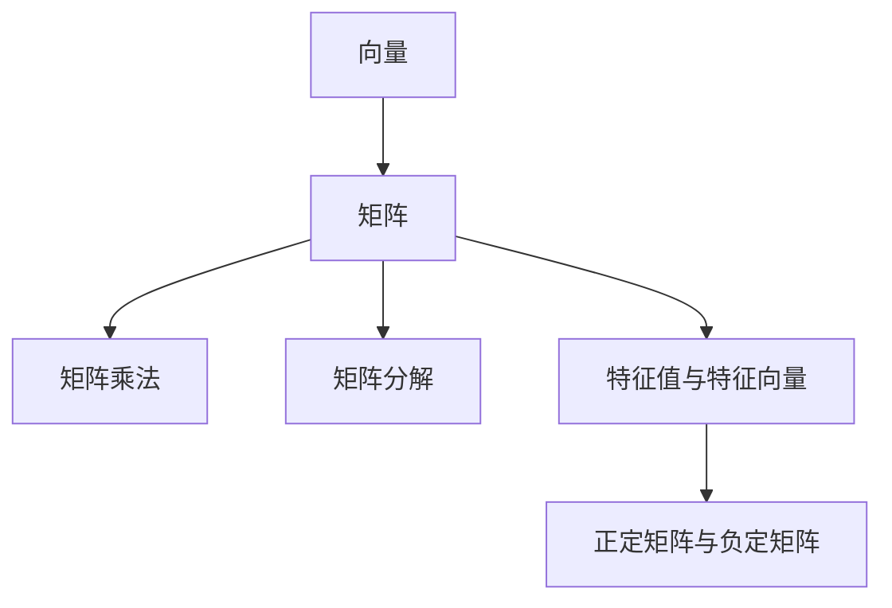

                 

# 线性代数导引：实数与复数

> 关键词：线性代数, 实数, 复数, 矩阵, 向量, 特征值, 特征向量, 矩阵乘法, 矩阵分解

## 1. 背景介绍

### 1.1 问题由来
线性代数作为一门基础数学学科，深刻影响着计算机科学和工程技术的多个领域，包括计算机图形学、机器学习、计算机视觉等。在处理大量数据时，通过线性代数的方法，可以极大地简化问题复杂度，提升算法效率。因此，掌握线性代数的基本概念和技能，对于每个计算机工作者来说都是至关重要的。

### 1.2 问题核心关键点
线性代数的核心概念包括向量、矩阵、矩阵乘法、矩阵分解、特征值、特征向量等。通过这些核心概念的掌握和应用，能够对数据进行表示、变换、分解和综合，从而为机器学习、计算机图形学等技术提供强大的数学支持。

### 1.3 问题研究意义
深入学习线性代数，能够帮助开发人员更好地理解数据，提升算法效率，加速应用开发。对于深度学习、图像处理等高级技术，线性代数提供了必要的数学基础，是必不可少的重要工具。掌握线性代数，能够为技术工作者打开更加广阔的研究视野，促进跨学科交流合作，推动技术创新。

## 2. 核心概念与联系

### 2.1 核心概念概述

为更好地理解线性代数的核心概念，本节将介绍几个密切相关的核心概念：

- 向量(Vector)：表示具有大小和方向的量，通常用箭头表示，如 $\vec{a} = (a_1, a_2, \ldots, a_n)$。
- 矩阵(Matrix)：由一组有序的数排成的矩形数组，如 $A = \begin{bmatrix} a_{11} & a_{12} & \cdots & a_{1n} \\ a_{21} & a_{22} & \cdots & a_{2n} \\ \vdots & \vdots & \ddots & \vdots \\ a_{m1} & a_{m2} & \cdots & a_{mn} \end{bmatrix}$。
- 矩阵乘法(Matrix Multiplication)：两个矩阵的对应元素相乘并累加得到的矩阵，如 $C = AB$。
- 矩阵分解(Matrix Decomposition)：将一个矩阵分解为若干个基本矩阵的组合，如矩阵分解（LU、SVD、QR等）。
- 特征值与特征向量(Eigenvalues and Eigenvectors)：线性代数中重要的概念，特征值描述线性变换下矩阵的收缩或拉伸程度，特征向量描述线性变换下矩阵的固有方向。
- 正定矩阵与负定矩阵(Positive and Negative Definite Matrices)：反映矩阵对称性的一个特征，对于正定矩阵，存在一个正数的平方根；而对于负定矩阵，存在一个负数的平方根。

这些核心概念之间的逻辑关系可以通过以下Mermaid流程图来展示：



这个流程图展示了大语言模型的核心概念及其之间的关系：

1. 向量是矩阵的基本组成单元。
2. 矩阵可以通过乘法进行组合，表示线性变换。
3. 矩阵分解将复杂矩阵拆解为基本矩阵，便于计算和分析。
4. 特征值和特征向量用于描述矩阵的性质。
5. 正定和负定矩阵则从对称性角度揭示矩阵的特性。

这些概念共同构成了线性代数的基础框架，使其能够有效地处理各种数学问题。通过理解这些核心概念，我们可以更好地把握线性代数的数学原理和应用方法。

## 3. 核心算法原理 & 具体操作步骤
### 3.1 算法原理概述

线性代数中的核心算法包括矩阵乘法、矩阵分解、特征值分解等。这些算法通过数学推导，能够对矩阵进行各种运算，从而解决实际问题。

- **矩阵乘法**：两个矩阵相乘，得到的结果矩阵元素等于两矩阵对应元素相乘之和。数学形式为 $C_{ij} = \sum_{k=1}^{n} A_{ik}B_{kj}$。
- **矩阵分解**：将一个矩阵分解为若干个基本矩阵的组合，常用的分解方法有LU分解、SVD分解、QR分解等。
- **特征值分解**：通过求解特征方程 $|\lambda I - A| = 0$，得到矩阵 $A$ 的特征值和特征向量。

### 3.2 算法步骤详解

以下是线性代数中核心算法的一般步骤：

**Step 1: 准备输入数据**
- 对于矩阵乘法，准备两个矩阵 $A$ 和 $B$，保证 $A$ 的列数等于 $B$ 的行数。
- 对于矩阵分解，准备待分解矩阵 $M$。

**Step 2: 执行算法**
- 对于矩阵乘法，按公式 $C = AB$ 进行计算，获得结果矩阵 $C$。
- 对于矩阵分解，如 LU 分解，将矩阵 $M$ 分解为 $L$ 和 $U$，$L$ 为下三角矩阵，$U$ 为上三角矩阵。
- 对于特征值分解，解特征方程 $|\lambda I - A| = 0$，获得特征值 $\lambda$ 和对应的特征向量 $\vec{v}$。

**Step 3: 输出结果**
- 对于矩阵乘法，输出结果矩阵 $C$。
- 对于矩阵分解，输出分解后的 $L$ 和 $U$。
- 对于特征值分解，输出特征值 $\lambda$ 和对应的特征向量 $\vec{v}$。

### 3.3 算法优缺点

线性代数算法具有以下优点：
1. 广泛应用：矩阵乘法、特征值分解等算法在数据科学、机器学习等领域广泛应用。
2. 高效计算：通过数学推导和优化，线性代数算法能够高效地进行矩阵运算。
3. 可扩展性：线性代数算法可以处理大型数据集，适用于大数据环境。

同时，这些算法也存在一些局限性：
1. 计算复杂度：对于大规模矩阵的运算，计算复杂度较高，需要较长的计算时间和较高的计算资源。
2. 数值稳定性：在计算过程中，可能会遇到数值不稳定的现象，导致计算结果失真。
3. 敏感性：线性代数算法的计算结果对输入数据和算法参数非常敏感，需要进行细致调试。

### 3.4 算法应用领域

线性代数算法在多个领域都有广泛应用，例如：

- 数据科学：用于数据表示、数据处理、数据分析等。如机器学习中线性回归模型的建立和优化。
- 计算机图形学：用于图形变换、光照计算、曲面建模等。如三维物体旋转、缩放、投影等。
- 信号处理：用于信号滤波、图像处理、音频处理等。如数字滤波器的设计和实现。
- 工程设计：用于力学分析、材料强度分析、电路设计等。如有限元分析中的矩阵运算。
- 金融工程：用于资产定价、风险管理、组合优化等。如量化交易中的线性回归模型。

除了这些领域外，线性代数算法还被创新性地应用到更多场景中，如自然语言处理、密码学、人工智能等，为这些技术的发展提供了数学基础。

## 4. 数学模型和公式 & 详细讲解  
### 4.1 数学模型构建

本节将使用数学语言对线性代数的基本数学模型进行更加严格的刻画。

记一个向量为 $\vec{a} = (a_1, a_2, \ldots, a_n)$，一个矩阵为 $A = \begin{bmatrix} a_{11} & a_{12} & \cdots & a_{1n} \\ a_{21} & a_{22} & \cdots & a_{2n} \\ \vdots & \vdots & \ddots & \vdots \\ a_{m1} & a_{m2} & \cdots & a_{mn} \end{bmatrix}$。

对于两个矩阵 $A$ 和 $B$，它们的乘积定义为 $C = AB$，其中 $C_{ij} = \sum_{k=1}^{n} A_{ik}B_{kj}$。

### 4.2 公式推导过程

以下是线性代数中核心算法的数学推导过程：

**矩阵乘法**
- 定义：两个矩阵 $A$ 和 $B$ 的乘积 $C$，其第 $i$ 行第 $j$ 列的元素为 $C_{ij} = \sum_{k=1}^{n} A_{ik}B_{kj}$。
- 推导：以 $3 \times 2$ 的矩阵 $A$ 和 $2 \times 3$ 的矩阵 $B$ 为例，得到 $C_{ij} = A_{i1}B_{1j} + A_{i2}B_{2j} + A_{i3}B_{3j}$。

**矩阵分解**
- LU 分解：对于可逆矩阵 $A$，存在唯一分解 $A = LU$，其中 $L$ 为下三角矩阵，$U$ 为上三角矩阵。
- SVD 分解：对于任意矩阵 $A$，存在分解 $A = U\Sigma V^T$，其中 $U$ 和 $V$ 为正交矩阵，$\Sigma$ 为对角矩阵。

**特征值分解**
- 定义：对于 $n \times n$ 的矩阵 $A$，存在分解 $A = V\Lambda V^{-1}$，其中 $V$ 为正交矩阵，$\Lambda$ 为对角矩阵，对角线上的元素为 $A$ 的特征值。
- 推导：解方程 $|\lambda I - A| = 0$，得到特征值 $\lambda$ 和对应的特征向量 $\vec{v}$。

## 5. 项目实践：代码实例和详细解释说明
### 5.1 开发环境搭建

在进行线性代数实践前，我们需要准备好开发环境。以下是使用Python进行NumPy开发的环境配置流程：

1. 安装Anaconda：从官网下载并安装Anaconda，用于创建独立的Python环境。

2. 创建并激活虚拟环境：
```bash
conda create -n lin-alg-env python=3.8 
conda activate lin-alg-env
```

3. 安装NumPy：
```bash
conda install numpy
```

4. 安装各类工具包：
```bash
pip install scipy matplotlib jupyter notebook ipython
```

完成上述步骤后，即可在`lin-alg-env`环境中开始线性代数实践。

### 5.2 源代码详细实现

这里我们以矩阵乘法和特征值分解为例，给出使用NumPy进行线性代数计算的Python代码实现。

```python
import numpy as np

# 定义矩阵
A = np.array([[1, 2], [3, 4]])
B = np.array([[5, 6], [7, 8]])

# 矩阵乘法
C = np.dot(A, B)
print("矩阵乘法结果：")
print(C)

# 特征值分解
eigenvalues, eigenvectors = np.linalg.eig(A)
print("特征值：")
print(eigenvalues)
print("特征向量：")
print(eigenvectors)
```

以上代码实现了矩阵乘法和特征值分解的基本操作，展示了NumPy库的强大封装和便捷操作。

### 5.3 代码解读与分析

让我们再详细解读一下关键代码的实现细节：

**矩阵乘法**
- 使用 `np.dot(A, B)` 计算矩阵乘积，返回结果矩阵 `C`。
- `np.dot` 函数是NumPy库中用于矩阵乘法的函数，可以计算任意维度矩阵的乘积。

**特征值分解**
- 使用 `np.linalg.eig(A)` 计算矩阵的特征值和特征向量，返回两个数组 `eigenvalues` 和 `eigenvectors`。
- `np.linalg.eig` 函数是NumPy库中用于特征值分解的函数，通过求解特征方程得到矩阵的特征值和特征向量。

这些代码实现了线性代数中的基本操作，展示了NumPy库的高效性和易用性。

## 6. 实际应用场景
### 6.1 机器学习算法

线性代数在机器学习算法中有着广泛的应用，如线性回归、逻辑回归、主成分分析等。通过线性代数的方法，可以对数据进行降维、特征提取、模型训练等操作，提升算法的精度和效率。

在实际应用中，可以使用NumPy和SciPy库提供的函数，对线性代数算法进行调用。例如，通过 `np.linalg.inv` 函数求逆矩阵，通过 `np.linalg.det` 函数求矩阵行列式等。

### 6.2 计算机图形学

在计算机图形学中，线性代数被广泛应用于三维几何变换、光照计算、表面渲染等环节。通过矩阵乘法、特征值分解等方法，可以高效地进行图形变换和处理。

例如，在三维图形渲染中，可以使用矩阵乘法表示旋转、缩放、平移等几何变换，使用特征值分解进行表面光照计算。这些方法能够极大地提升图形渲染的效率和效果。

### 6.3 信号处理

信号处理中，线性代数方法被用于信号滤波、傅里叶变换等操作。通过矩阵分解、特征值分解等方法，可以对信号进行频域分析、滤波处理等操作，提升信号处理的质量和效率。

例如，在数字滤波器设计中，可以使用特征值分解求解滤波器系数，使用矩阵分解进行滤波器实现。这些方法能够提高滤波器的稳定性和精度。

### 6.4 工程设计

在线性代数在工程设计中，被用于有限元分析、材料强度分析等环节。通过矩阵运算，可以计算结构应力、应变、模态等参数，评估材料强度和稳定性。

例如，在有限元分析中，可以使用矩阵运算求解节点位移和应力，使用矩阵分解进行结构模态分析。这些方法能够提升设计精度和效率。

## 7. 工具和资源推荐
### 7.1 学习资源推荐

为了帮助开发者系统掌握线性代数的基本概念和应用技巧，这里推荐一些优质的学习资源：

1. 《线性代数及其应用》：一本经典的线性代数教材，深入浅出地介绍了线性代数的基本概念和应用。
2. MIT线性代数公开课：麻省理工学院开设的线性代数公开课，由Gil Strang教授主讲，讲解清晰，内容丰富。
3. Coursera线性代数课程：由斯坦福大学开设的线性代数课程，内容全面，适合初学者和进阶学习者。
4. 线性代数wiki：维基百科上的线性代数页面，提供丰富的参考资料和外部链接。
5. NumPy官方文档：NumPy库的官方文档，提供了完整的线性代数函数和用法说明，是线性代数实践的必备资料。

通过对这些资源的学习实践，相信你一定能够快速掌握线性代数的基本技能，并用于解决实际的工程问题。

### 7.2 开发工具推荐

高效的开发离不开优秀的工具支持。以下是几款用于线性代数开发的常用工具：

1. NumPy：Python中的科学计算库，提供了丰富的线性代数函数和工具，支持高效矩阵运算。
2. SciPy：基于NumPy的科学计算库，提供了更丰富的数学函数和算法，支持高阶线性代数运算。
3. MATLAB：专业的科学计算软件，提供了强大的线性代数工具箱，支持矩阵运算、特征值分解等操作。
4. GNU Octave：开源的类MATLAB软件，提供了与MATLAB类似的线性代数函数和工具，支持高效矩阵运算。
5. Julia：新兴的高性能编程语言，提供了强大的线性代数支持，支持向量运算和矩阵运算。

合理利用这些工具，可以显著提升线性代数计算的效率，加快问题解决的速度。

### 7.3 相关论文推荐

线性代数的研究历史悠久，经典的研究成果众多。以下是几篇奠基性的相关论文，推荐阅读：

1. 《Linear Algebra and Its Applications》：Lin Alg by Gilbert Strang，介绍了线性代数的各个方面，是线性代数学习的经典教材。
2. 《Matrix Computations》：Matrix Computations by Gene H. Golub and Charles F. Van Loan，介绍了矩阵计算的各个方面，是线性代数实践的必读文献。
3. 《Foundations of Linear Algebra》：Foundations of Linear Algebra by Sergei Treilis，介绍了线性代数的各个方面，适合入门和进阶学习。
4. 《TensorFlow》：TensorFlow by Jeff Dean and Sanjay Ghemawat，介绍了TensorFlow在矩阵运算中的应用，是深度学习开发的必备资料。
5. 《PETSc》：Portable, Extensible Toolkit for Scientific Computation by Edward R. Jessup et al.，介绍了科学计算中线性代数的应用，是高性能计算的必备工具。

这些论文代表了大语言模型微调技术的发展脉络。通过学习这些前沿成果，可以帮助研究者把握学科前进方向，激发更多的创新灵感。

## 8. 总结：未来发展趋势与挑战

### 8.1 总结

本文对线性代数的基本概念和应用方法进行了全面系统的介绍。首先阐述了线性代数在计算机科学中的重要地位，明确了向量、矩阵、矩阵乘法、矩阵分解、特征值等核心概念的重要性。其次，从原理到实践，详细讲解了线性代数的数学原理和核心算法，给出了线性代数计算的完整代码实例。同时，本文还广泛探讨了线性代数在机器学习、计算机图形学、信号处理、工程设计等多个领域的应用前景，展示了线性代数算法的强大潜力。

通过本文的系统梳理，可以看到，线性代数在计算机科学中的应用无处不在，对数据表示、处理和分析起到了至关重要的作用。掌握线性代数，能够为技术工作者打开更加广阔的研究视野，推动跨学科交流合作，促进技术创新。

### 8.2 未来发展趋势

展望未来，线性代数的发展趋势将呈现以下几个方向：

1. 更高效的算法：随着硬件计算能力的提升，未来的线性代数算法将追求更高的计算效率，如稀疏矩阵运算、矩阵分块算法等。
2. 更丰富的应用：线性代数将进一步深入到各个领域，如人工智能、大数据、量子计算等，推动更多前沿技术的发展。
3. 更强的工具支持：线性代数工具将更加丰富，支持更多编程语言和框架，如Python、C++、TensorFlow等。
4. 更广泛的模型应用：线性代数将应用于更多领域的模型开发，如深度学习、计算机视觉、自然语言处理等。
5. 更灵活的数据处理：线性代数将与更多数据处理技术结合，如数据压缩、数据编码等，提升数据处理效率。

这些趋势将进一步拓展线性代数的应用范围，提升其算法效率和应用灵活性，为计算机科学的各个领域带来更强大的数学支持。

### 8.3 面临的挑战

尽管线性代数在计算机科学中有着广泛的应用，但在实际应用中仍然面临一些挑战：

1. 计算资源限制：对于大规模矩阵运算，计算资源需求较高，需要更强大的硬件支持。
2. 数值稳定问题：线性代数计算中存在数值不稳定问题，可能导致计算结果失真。
3. 模型复杂度：线性代数模型复杂度高，需要更多数据和计算资源。
4. 应用广泛性：线性代数在不同领域的应用存在差异，需要进行针对性的优化。
5. 算法适用性：线性代数算法对数据分布有要求，不适用于某些数据类型的计算。

这些挑战需要从算法设计、工具优化、应用场景等多个维度进行应对，才能充分发挥线性代数的数学优势，推动技术的持续发展。

### 8.4 研究展望

未来的研究需要在以下几个方面寻求新的突破：

1. 高效算法设计：开发更高效的线性代数算法，如稀疏矩阵运算、矩阵分块算法等，以适应大数据计算环境。
2. 多领域应用：拓展线性代数在更多领域的应用，如人工智能、量子计算等，推动前沿技术的发展。
3. 硬件优化：优化线性代数算法的硬件实现，提升计算速度和效率。
4. 数据预处理：研究适用于不同数据类型的线性代数算法，提升算法的适用性。
5. 算法优化：改进线性代数算法的数值稳定性，提升算法的计算精度和鲁棒性。

这些研究方向将进一步推动线性代数的发展，为计算机科学的各个领域提供更强大的数学工具和算法支持。

## 9. 附录：常见问题与解答

**Q1：什么是向量？**

A: 向量是一个具有大小和方向的量，通常用箭头表示。在数学中，向量被定义为有限序列，如 $\vec{a} = (a_1, a_2, \ldots, a_n)$。向量在计算机科学中有广泛应用，如图像处理、机器学习等。

**Q2：矩阵乘法是如何计算的？**

A: 矩阵乘法的计算公式为 $C_{ij} = \sum_{k=1}^{n} A_{ik}B_{kj}$。例如，$3 \times 2$ 的矩阵 $A$ 和 $2 \times 3$ 的矩阵 $B$ 的乘积 $C$，其第 $i$ 行第 $j$ 列的元素 $C_{ij}$ 等于 $A$ 的第 $i$ 行与 $B$ 的第 $j$ 列对应元素的乘积之和。

**Q3：什么是特征值分解？**

A: 特征值分解是将矩阵 $A$ 分解为 $V\Lambda V^{-1}$，其中 $V$ 为正交矩阵，$\Lambda$ 为对角矩阵，对角线上的元素为 $A$ 的特征值。特征值和特征向量描述了矩阵的线性变换性质，在机器学习、信号处理等领域有广泛应用。

**Q4：线性代数在计算机科学中有哪些应用？**

A: 线性代数在计算机科学中的应用广泛，如数据处理、机器学习、计算机图形学、信号处理、工程设计等。通过线性代数的方法，可以对数据进行表示、变换、分解和综合，从而为机器学习、计算机图形学等技术提供强大的数学支持。

**Q5：如何提高线性代数计算的效率？**

A: 提高线性代数计算效率的方法包括：使用高效的数据结构，如稀疏矩阵、分块矩阵等；选择合适的算法，如矩阵分块算法、QR分解等；优化算法实现，如使用并行计算、GPU加速等。这些方法能够提高计算速度和效率，降低计算资源需求。

---

作者：禅与计算机程序设计艺术 / Zen and the Art of Computer Programming

