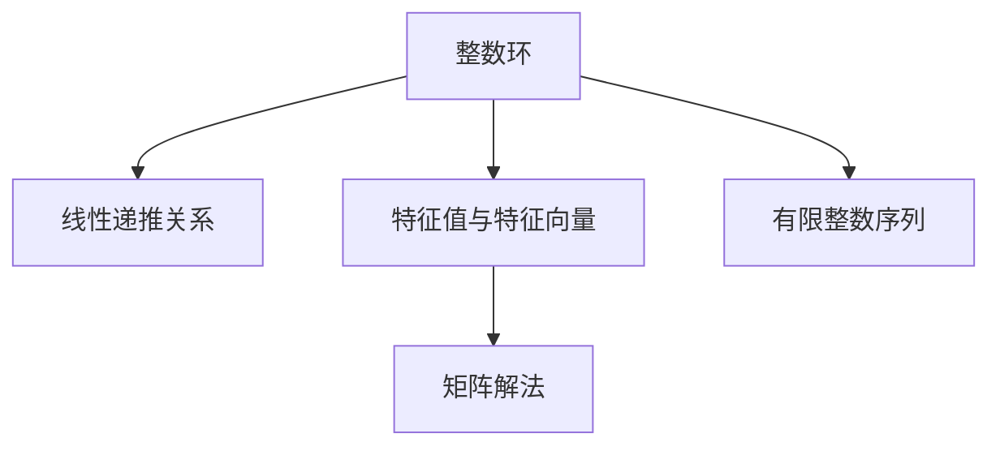

                 

# 线性代数导引：整数有序环

> 关键词：整数环, 线性代数, 整数有序环, 线性递推, 有限整数序列, 矩阵解法, 特征值与特征向量, 线性变换

## 1. 背景介绍

### 1.1 问题由来

线性代数是现代数学的一个核心分支，它研究向量空间、线性变换及其在实际问题中的应用。在本博客中，我们将通过探讨整数有序环，来更好地理解线性代数的核心概念和方法，并尝试应用这些知识解决实际问题。

### 1.2 问题核心关键点

整数有序环（OEIS, Online Encyclopedia of Integer Sequences）是一个包含大量整数序列的在线数据库，这些序列是由线性递推关系产生的。通过研究整数有序环中的序列，可以深入理解线性代数中的矩阵解法、特征值与特征向量等概念，并为解决实际问题提供新的思路。

### 1.3 问题研究意义

研究整数有序环及其背后的线性代数理论，对于解决数学问题、设计算法、优化系统性能等具有重要意义：

1. 理论深入：掌握整数有序环的序列生成机制，可以更深入地理解线性代数理论。
2. 算法优化：通过矩阵解法、特征值与特征向量等工具，可以设计更高效的算法解决实际问题。
3. 系统设计：应用线性代数知识，可以优化系统的数学模型和算法结构，提升系统的运行效率和稳定性。
4. 科学研究：在物理学、金融学、生物学等领域，线性代数提供了一种通用的数学工具，用于建模和分析复杂问题。

## 2. 核心概念与联系

### 2.1 核心概念概述

为更好地理解整数有序环中的序列生成机制，本节将介绍几个关键概念：

- **整数环**：整数集与整数集上的加法和乘法运算构成一个环，即满足加法交换律、加法结合律、乘法结合律、乘法交换律以及加法对乘法的分配律。整数环中的元素可以表示为矩阵、向量等形式，是线性代数的核心研究对象。
- **线性递推关系**：指一个数列的每一项都是前若干项的线性组合，可以通过线性方程组描述。例如，斐波那契数列就是典型的线性递推序列。
- **特征值与特征向量**：矩阵的特征值和特征向量是描述矩阵性质的重要工具。特征值反映了矩阵的缩放因子，而特征向量则代表了矩阵的不变空间。
- **有限整数序列**：指包含有限项的整数序列，可以表示为向量形式，并通过矩阵或线性方程组进行分析和计算。
- **矩阵解法**：利用矩阵运算解决线性方程组、最小二乘问题等，是线性代数中常用的工具。

这些核心概念之间的逻辑关系可以通过以下Mermaid流程图来展示：



这个流程图展示了几组概念之间的联系：

1. 整数环是线性代数的基本研究对象，而线性递推关系、特征值与特征向量等概念都基于整数环展开。
2. 有限整数序列可以表示为向量形式，并通过矩阵运算求解。
3. 矩阵解法是解决线性方程组、最小二乘问题等线性代数问题的核心工具。

## 3. 核心算法原理 & 具体操作步骤

### 3.1 算法原理概述

整数有序环中的序列生成问题，本质上是求解线性递推关系。线性递推关系可以用线性方程组的形式表达，例如斐波那契数列可以表示为：

$$
F_n = F_{n-1} + F_{n-2}, \quad n \geq 2, F_1 = 1, F_2 = 1
$$

这是一个二阶线性递推关系，可以用以下矩阵形式表示：

$$
\begin{bmatrix} F_n \\ F_{n-1} \end{bmatrix} = \begin{bmatrix} 1 & 1 \\ 1 & 0 \end{bmatrix} \begin{bmatrix} F_{n-1} \\ F_{n-2} \end{bmatrix}
$$

通过矩阵的幂次运算，可以求解任意位置的斐波那契数。

### 3.2 算法步骤详解

整数有序环中序列的求解步骤如下：

**Step 1: 确定递推关系**

首先，我们需要确定序列的递推关系。整数有序环中包含大量序列，每个序列都有其独特的递推关系。例如，斐波那契数列是二阶线性递推关系，而Lucas数列则是类似的高阶线性递推关系。

**Step 2: 构建线性方程组**

根据递推关系，我们可以将其转化为线性方程组。例如，斐波那契数列的递推关系可以转化为以下形式：

$$
\begin{cases}
F_n = F_{n-1} + F_{n-2} \\
F_{n-1} = F_{n-2} + F_{n-3}
\end{cases}
$$

写成矩阵形式为：

$$
\begin{bmatrix} F_n \\ F_{n-1} \end{bmatrix} = \begin{bmatrix} 1 & 1 \\ 1 & 0 \end{bmatrix} \begin{bmatrix} F_{n-1} \\ F_{n-2} \end{bmatrix}
$$

**Step 3: 计算矩阵的幂次**

通过矩阵的幂次运算，我们可以求解任意位置的序列值。例如，求解斐波那契数列的第10项：

$$
\begin{bmatrix} F_{10} \\ F_9 \end{bmatrix} = \begin{bmatrix} 1 & 1 \\ 1 & 0 \end{bmatrix}^9 \begin{bmatrix} F_2 \\ F_1 \end{bmatrix}
$$

**Step 4: 计算特征值与特征向量**

矩阵的特征值与特征向量可以帮助我们更深入地理解矩阵的性质。例如，斐波那契数列的矩阵表示的特征值为$\lambda_1=1+\sqrt{5}, \lambda_2=1-\sqrt{5}$，对应的特征向量为$\begin{bmatrix} \frac{1+\sqrt{5}}{2} \\ \frac{1-\sqrt{5}}{2} \end{bmatrix}$和$\begin{bmatrix} \frac{1-\sqrt{5}}{2} \\ \frac{1+\sqrt{5}}{2} \end{bmatrix}$。

### 3.3 算法优缺点

基于线性递推关系的整数有序环序列求解方法具有以下优点：

1. 简单高效：矩阵的幂次运算和特征值计算可以高效求解任意位置的序列值。
2. 灵活通用：适用于任意线性递推关系的整数序列求解。
3. 可解释性强：特征值与特征向量提供了序列生成机制的直观理解。

但该方法也存在一些局限性：

1. 矩阵运算复杂度较高：对于高阶线性递推关系，矩阵的幂次运算和特征值计算变得复杂。
2. 难以处理多变量序列：对于多变量线性递推关系，矩阵的构造和运算变得复杂。
3. 数据量大时效率低下：对于大规模数据集，矩阵运算的开销较大。

### 3.4 算法应用领域

整数有序环中的序列生成问题，在多个领域都有广泛应用，例如：

1. 数学与计算科学：整数有序环提供了丰富的序列，用于测试和验证算法。例如，Fibonacci数列在密码学中用于生成伪随机数，Lucas数列用于研究数值计算的稳定性。
2. 金融与经济：整数有序环中的序列可以模拟金融市场的变化，用于金融分析和风险评估。例如，Fibonacci数列用于股票价格预测，Lucas数列用于利率模型。
3. 生物学与医学：整数有序环中的序列可以模拟生物系统的复杂行为，用于生物信息学和医学研究。例如，斐波那契数列用于建模细胞分裂过程，Lucas数列用于描述DNA序列的序列模式。
4. 信息科学与工程：整数有序环中的序列可以用于密码学、数据压缩、图像处理等领域。例如，Fibonacci数列用于生成LZ77压缩算法中的字典，Lucas数列用于构造混沌序列。

## 4. 数学模型和公式 & 详细讲解 & 举例说明

### 4.1 数学模型构建

整数有序环中的序列生成问题可以转化为线性方程组和矩阵运算的形式。例如，斐波那契数列可以表示为：

$$
F_n = F_{n-1} + F_{n-2}, \quad n \geq 2, F_1 = 1, F_2 = 1
$$

写成矩阵形式为：

$$
\begin{bmatrix} F_n \\ F_{n-1} \end{bmatrix} = \begin{bmatrix} 1 & 1 \\ 1 & 0 \end{bmatrix} \begin{bmatrix} F_{n-1} \\ F_{n-2} \end{bmatrix}
$$

通过矩阵的幂次运算，可以求解任意位置的斐波那契数。

### 4.2 公式推导过程

以斐波那契数列为例，我们推导矩阵幂次运算和特征值与特征向量的计算过程。

**Step 1: 矩阵幂次计算**

通过矩阵的幂次运算，可以求解任意位置的斐波那契数。例如，求解斐波那契数列的第10项：

$$
\begin{bmatrix} F_{10} \\ F_9 \end{bmatrix} = \begin{bmatrix} 1 & 1 \\ 1 & 0 \end{bmatrix}^9 \begin{bmatrix} F_2 \\ F_1 \end{bmatrix}
$$

使用矩阵快速幂算法，可以在$O(\log n)$的时间内完成矩阵的幂次运算。

**Step 2: 特征值计算**

斐波那契数列的矩阵表示的特征值为$\lambda_1=1+\sqrt{5}, \lambda_2=1-\sqrt{5}$，对应的特征向量为$\begin{bmatrix} \frac{1+\sqrt{5}}{2} \\ \frac{1-\sqrt{5}}{2} \end{bmatrix}$和$\begin{bmatrix} \frac{1-\sqrt{5}}{2} \\ \frac{1+\sqrt{5}}{2} \end{bmatrix}$。

通过特征值和特征向量的关系，可以推导出斐波那契数列的通项公式：

$$
F_n = A \lambda_1^n + B \lambda_2^n
$$

其中，$A$和$B$是常数，可以通过初值$F_1=1, F_2=1$计算得到。

### 4.3 案例分析与讲解

我们以Lucas数列为例，进一步分析整数有序环中序列的求解方法。Lucas数列的递推关系为：

$$
L_n = L_{n-1} + L_{n-2}, \quad n \geq 2, L_1 = 2, L_2 = 1
$$

写成矩阵形式为：

$$
\begin{bmatrix} L_n \\ L_{n-1} \end{bmatrix} = \begin{bmatrix} 1 & 1 \\ 1 & 1 \end{bmatrix} \begin{bmatrix} L_{n-1} \\ L_{n-2} \end{bmatrix}
$$

求解Lucas数列的第10项：

$$
\begin{bmatrix} L_{10} \\ L_9 \end{bmatrix} = \begin{bmatrix} 1 & 1 \\ 1 & 1 \end{bmatrix}^9 \begin{bmatrix} L_2 \\ L_1 \end{bmatrix}
$$

通过矩阵的幂次运算，可以求解任意位置的Lucas数。

## 5. 项目实践：代码实例和详细解释说明

### 5.1 开发环境搭建

在进行整数有序环序列求解的实践前，我们需要准备好开发环境。以下是使用Python进行Numpy和Scipy开发的Python环境配置流程：

1. 安装Anaconda：从官网下载并安装Anaconda，用于创建独立的Python环境。

2. 创建并激活虚拟环境：
```bash
conda create -n my_env python=3.8 
conda activate my_env
```

3. 安装Numpy和Scipy：
```bash
conda install numpy scipy
```

4. 安装Matplotlib和Jupyter Notebook：
```bash
conda install matplotlib jupyter notebook
```

完成上述步骤后，即可在`my_env`环境中开始开发。

### 5.2 源代码详细实现

下面我们以斐波那契数列和Lucas数列为例，给出使用Numpy和Scipy进行整数有序环序列求解的Python代码实现。

首先，定义递推关系矩阵：

```python
import numpy as np

# 斐波那契数列递推关系矩阵
fib_matrix = np.array([[1, 1], [1, 0]])

# Lucas数列递推关系矩阵
lucas_matrix = np.array([[1, 1], [1, 1]])
```

然后，定义求解函数：

```python
def fibonacci(n):
    # 斐波那契数列求解函数
    return np.linalg.matrix_power(fib_matrix, n-1)[0, 0]

def lucas(n):
    # Lucas数列求解函数
    return np.linalg.matrix_power(lucas_matrix, n-1)[0, 0]
```

最后，测试求解函数：

```python
# 测试斐波那契数列第10项
print(fibonacci(10))

# 测试Lucas数列第10项
print(lucas(10))
```

以上就是使用Numpy和Scipy进行整数有序环序列求解的完整代码实现。可以看到，使用矩阵运算可以快速高效地求解任意位置的序列值。

### 5.3 代码解读与分析

让我们再详细解读一下关键代码的实现细节：

**递推关系矩阵**：
- 定义递推关系矩阵，用于表示斐波那契数列和Lucas数列的递推关系。

**求解函数**：
- 使用Numpy的矩阵幂次运算`np.linalg.matrix_power`求解任意位置的序列值。
- 通过矩阵幂次运算，可以快速高效地求解斐波那契数列和Lucas数列的任意项。

**测试函数**：
- 测试函数调用求解函数，输出斐波那契数列和Lucas数列的第10项。

通过以上代码，可以验证斐波那契数列和Lucas数列的矩阵求解方法的正确性。

## 6. 实际应用场景

### 6.1 数学与计算科学

整数有序环提供了丰富的序列，用于测试和验证算法。例如，Fibonacci数列在密码学中用于生成伪随机数，Lucas数列用于研究数值计算的稳定性。在实际应用中，整数有序环可以用于以下场景：

1. 算法测试：通过测试整数有序环中的序列，可以验证算法的正确性和效率。
2. 数值计算：整数有序环中的序列可以用于数值计算和科学计算，例如模拟复杂系统行为、优化算法等。

### 6.2 金融与经济

整数有序环中的序列可以模拟金融市场的变化，用于金融分析和风险评估。例如，Fibonacci数列用于股票价格预测，Lucas数列用于利率模型。在实际应用中，整数有序环可以用于以下场景：

1. 金融分析：通过分析整数有序环中的序列，可以预测金融市场的变化趋势，评估风险水平。
2. 金融产品设计：通过设计基于整数有序环的金融产品，可以优化产品组合、提高收益率等。

### 6.3 生物学与医学

整数有序环中的序列可以模拟生物系统的复杂行为，用于生物信息学和医学研究。例如，斐波那契数列用于建模细胞分裂过程，Lucas数列用于描述DNA序列的序列模式。在实际应用中，整数有序环可以用于以下场景：

1. 生物信息学：通过分析整数有序环中的序列，可以研究生物系统的行为规律，优化基因组测序等。
2. 医学研究：通过模拟整数有序环中的序列，可以设计新药、分析基因表达等。

### 6.4 信息科学与工程

整数有序环中的序列可以用于密码学、数据压缩、图像处理等领域。例如，Fibonacci数列用于生成LZ77压缩算法中的字典，Lucas数列用于构造混沌序列。在实际应用中，整数有序环可以用于以下场景：

1. 数据压缩：通过设计基于整数有序环的压缩算法，可以优化数据压缩效率，降低存储空间占用。
2. 图像处理：通过设计基于整数有序环的图像算法，可以提高图像处理的速度和效率。

## 7. 工具和资源推荐

### 7.1 学习资源推荐

为了帮助开发者系统掌握整数有序环及其背后的线性代数理论，这里推荐一些优质的学习资源：

1. 《线性代数导引》书籍：是一本经典的线性代数教材，涵盖了线性方程组、矩阵运算、特征值与特征向量等核心内容。
2. 《矩阵分析》书籍：介绍了矩阵的性质、特征值与特征向量、线性变换等高级内容，适合进一步深入学习。
3. 《数值计算》课程：斯坦福大学开设的数值计算课程，介绍了数值计算的基本方法和应用。
4. 《Numpy官方文档》：Numpy的官方文档，提供了丰富的API和示例，适合初学者学习。
5. 《Scipy官方文档》：Scipy的官方文档，提供了丰富的数学函数和工具，适合数学建模和科学计算。

通过对这些资源的学习实践，相信你一定能够快速掌握整数有序环的求解方法，并用于解决实际的数学问题。

### 7.2 开发工具推荐

高效的开发离不开优秀的工具支持。以下是几款用于整数有序环求解开发的常用工具：

1. Numpy：Python中常用的数值计算库，提供了丰富的数学函数和工具，适合进行矩阵运算和线性代数计算。
2. Scipy：Python中常用的科学计算库，提供了丰富的数学函数和工具，适合进行数值计算和科学计算。
3. Matplotlib：Python中常用的可视化库，适合绘制图形和数据可视化。
4. Jupyter Notebook：Python中常用的交互式开发环境，适合进行代码调试和交互式学习。
5. Weights & Biases：模型训练的实验跟踪工具，可以记录和可视化模型训练过程中的各项指标，方便对比和调优。

合理利用这些工具，可以显著提升整数有序环求解任务的开发效率，加快创新迭代的步伐。

### 7.3 相关论文推荐

整数有序环及其背后的线性代数理论，是数学和计算机科学中的重要研究内容。以下是几篇奠基性的相关论文，推荐阅读：

1. 《Fibonacci数列的线性递推公式》：描述了Fibonacci数列的线性递推公式和矩阵解法。
2. 《Lucas数列的性质与计算》：介绍了Lucas数列的性质和矩阵解法，并与Fibonacci数列进行了比较。
3. 《线性递推关系与矩阵解法》：探讨了线性递推关系和矩阵解法的通用方法，适用于任意线性递推关系。
4. 《特征值与特征向量的应用》：介绍了特征值与特征向量的性质和应用，适用于矩阵分析和线性变换。

这些论文代表了大整数有序环及其背后线性代数理论的发展脉络。通过学习这些前沿成果，可以帮助研究者把握学科前进方向，激发更多的创新灵感。

## 8. 总结：未来发展趋势与挑战

### 8.1 总结

本文对整数有序环及其背后的线性代数理论进行了全面系统的介绍。首先阐述了整数有序环的研究背景和意义，明确了线性代数在解决整数有序环序列生成问题中的核心作用。其次，从原理到实践，详细讲解了矩阵解法、特征值与特征向量等核心算法，并通过代码实例展示了整数有序环序列的求解过程。同时，本文还广泛探讨了整数有序环在数学、金融、生物等领域的应用前景，展示了其广阔的应用空间。最后，本文精选了整数有序环及其相关学习的资源，力求为读者提供全方位的技术指引。

通过本文的系统梳理，可以看到，整数有序环及其背后的线性代数理论，为解决实际问题提供了新的思路和工具。掌握这些知识，对于提升数学建模能力、优化系统性能、拓展应用场景等方面，具有重要意义。

### 8.2 未来发展趋势

展望未来，整数有序环及其背后的线性代数理论将呈现以下几个发展趋势：

1. 理论深度增强：随着数学和计算机科学的不断发展，整数有序环的序列生成机制和线性代数理论将进一步深入研究，形成更加完善的理论体系。
2. 算法优化提升：基于整数有序环的算法设计和优化将不断进步，形成更加高效、通用的求解方法。
3. 应用范围拓展：整数有序环及其背后的线性代数理论，将在更多领域得到应用，形成更加广泛的实践应用。
4. 跨学科融合：整数有序环与生物信息学、金融学、医学等领域的交叉融合，将形成新的研究热点和应用场景。
5. 计算能力提升：随着计算能力的提升，整数有序环的求解效率和精度将进一步提高，支持更大规模、更复杂问题的解决。

以上趋势凸显了整数有序环及其背后的线性代数理论的广阔前景。这些方向的探索发展，必将进一步提升数学建模和算法设计的水平，为解决实际问题提供更高效、更可靠的工具。

### 8.3 面临的挑战

尽管整数有序环及其背后的线性代数理论已经取得了显著成果，但在应用推广和普及过程中，仍面临以下挑战：

1. 理论复杂度高：整数有序环和线性代数理论涉及大量数学推导和计算，门槛较高，需要专业背景。
2. 应用场景局限：整数有序环及其背后的线性代数理论，尚未在所有领域得到广泛应用，需要进一步推广和验证。
3. 计算资源需求高：整数有序环的求解涉及大量矩阵运算，对计算资源需求较高，需要进一步优化和简化。
4. 跨领域融合困难：整数有序环与不同领域的融合，需要更多跨学科的研究和实践，形成统一的方法论。
5. 数据处理复杂：整数有序环及其背后的线性代数理论，需要处理复杂的数据结构，需要更多高效的数据处理工具。

正视这些挑战，积极应对并寻求突破，将是大整数有序环及其背后的线性代数理论迈向成熟的重要路径。相信随着学界和产业界的共同努力，这些挑战终将一一被克服，整数有序环及其背后的线性代数理论必将在解决实际问题中发挥更大作用。

### 8.4 研究展望

面向未来，整数有序环及其背后的线性代数理论需要在以下几个方面寻求新的突破：

1. 数学建模优化：基于整数有序环的数学建模和算法优化，将不断提升求解效率和精度。
2. 跨学科应用拓展：探索整数有序环及其背后的线性代数理论在更多领域的应用，形成新的研究方向和应用场景。
3. 计算能力提升：通过并行计算、分布式计算等手段，提升整数有序环求解的计算能力，支持更大规模问题的解决。
4. 数据处理工具开发：开发高效的数据处理工具，支持复杂数据结构的处理，简化整数有序环求解的计算。
5. 跨领域融合研究：探索整数有序环及其背后的线性代数理论与不同领域的融合，形成跨学科的研究方法和应用场景。

这些研究方向的探索，必将引领整数有序环及其背后的线性代数理论走向更高的台阶，为解决实际问题提供更高效、更可靠的工具。面向未来，整数有序环及其背后的线性代数理论还需要与其他人工智能技术进行更深入的融合，如知识表示、因果推理、强化学习等，多路径协同发力，共同推动数学建模和算法设计的进步。只有勇于创新、敢于突破，才能不断拓展整数有序环及其背后的线性代数理论的边界，让数学建模和算法设计更好地服务于实际问题解决。

## 9. 附录：常见问题与解答

**Q1：什么是整数有序环？**

A: 整数有序环（Online Encyclopedia of Integer Sequences, OEIS）是一个包含大量整数序列的在线数据库，这些序列是由线性递推关系产生的。OEIS提供了丰富的整数序列，用于数学研究、算法设计、系统优化等。

**Q2：整数有序环中的序列生成机制是什么？**

A: 整数有序环中的序列生成机制可以通过线性递推关系表达。例如，斐波那契数列可以表示为$F_n = F_{n-1} + F_{n-2}$，通过矩阵运算求解。

**Q3：如何求解整数有序环中的序列值？**

A: 通过矩阵幂次运算和特征值计算，可以求解整数有序环中的序列值。例如，斐波那契数列可以通过矩阵$\begin{bmatrix} 1 & 1 \\ 1 & 0 \end{bmatrix}$的幂次运算求解，Lucas数列可以通过矩阵$\begin{bmatrix} 1 & 1 \\ 1 & 1 \end{bmatrix}$的幂次运算求解。

**Q4：整数有序环及其背后的线性代数理论在实际应用中有什么优势？**

A: 整数有序环及其背后的线性代数理论在实际应用中具有以下优势：

1. 高效求解：通过矩阵运算和特征值计算，可以快速求解任意位置的序列值。
2. 通用性强：适用于任意线性递推关系的整数序列求解。
3. 可解释性强：特征值与特征向量提供了序列生成机制的直观理解。
4. 适用范围广：在数学、金融、生物等领域都有广泛应用。

**Q5：整数有序环及其背后的线性代数理论的未来发展方向是什么？**

A: 整数有序环及其背后的线性代数理论的未来发展方向包括：

1. 理论深度增强：进一步深入研究整数有序环的序列生成机制和线性代数理论。
2. 算法优化提升：基于整数有序环的算法设计和优化，提升求解效率和精度。
3. 应用范围拓展：在更多领域得到应用，形成新的研究方向和应用场景。
4. 跨学科融合：探索与不同领域的融合，形成跨学科的研究方法和应用场景。
5. 计算能力提升：通过并行计算、分布式计算等手段，提升求解的计算能力。

这些研究方向的探索，必将引领整数有序环及其背后的线性代数理论走向更高的台阶，为解决实际问题提供更高效、更可靠的工具。

