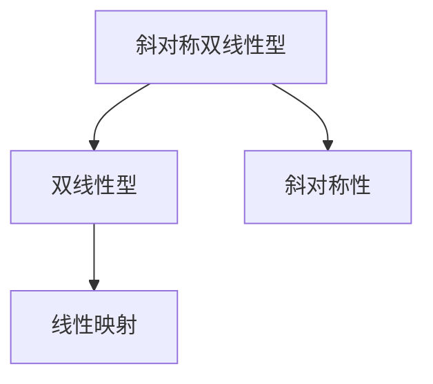

                 

## 1. 背景介绍

在计算机科学的许多领域中，线性代数都扮演着至关重要的角色。从机器学习中的矩阵分解，到图像处理中的图像变换，线性代数提供了一种强大的工具来处理向量空间中的数据。在本节中，我们将介绍斜对称双线性型，这种类型的数学对象在计算几何、计算机视觉和机器学习等许多领域都有重要应用。

### 1.1 问题由来

在计算机视觉中，斜对称双线性型经常用于描述物体在不同视角下的几何关系。例如，在3D重建问题中，如何从多张不同的视角图像中恢复出物体的3D结构，就涉及到斜对称双线性型。此外，在机器学习中，斜对称双线性型还可以用于优化目标函数，从而提高模型的泛化能力和精度。因此，深入理解斜对称双线性型的原理和应用具有重要的理论和实践意义。

### 1.2 问题核心关键点

斜对称双线性型是描述向量空间中线性映射的一类数学对象。与传统的线性变换不同，它具有斜对称性，即对于任意两个向量，其线性映射的结果与输入向量的顺序无关。这种对称性使得斜对称双线性型在许多领域都有广泛的应用。在本节中，我们将从斜对称双线性型的定义入手，逐步深入探讨其数学性质和应用场景。

## 2. 核心概念与联系

### 2.1 核心概念概述

在数学中，斜对称双线性型是一类特殊的双线性型，其双线性映射满足斜对称性。具体来说，对于任意两个向量 $x, y$，斜对称双线性型的线性映射 $f(x, y)$ 满足：

$$
f(x, y) = f(y, x)
$$

这意味着，当输入向量的顺序改变时，映射结果不变。这种对称性在计算机视觉、图像处理和机器学习等领域有着广泛的应用。

### 2.2 核心概念原理和架构的 Mermaid 流程图



这个图表展示了斜对称双线性型与其他数学对象之间的关系。其中，A表示斜对称双线性型，B表示双线性型，C表示斜对称性，D表示线性映射。斜对称双线性型是满足斜对称性的双线性型，其线性映射也满足斜对称性。

## 3. 核心算法原理 & 具体操作步骤

### 3.1 算法原理概述

斜对称双线性型在计算机视觉和机器学习等领域有广泛的应用。在本节中，我们将介绍斜对称双线性型的数学定义和性质，以及如何构建斜对称双线性型。

### 3.2 算法步骤详解

#### 3.2.1 斜对称双线性型的定义

斜对称双线性型 $f: V \times V \rightarrow \mathbb{R}$ 满足斜对称性，即对于任意向量 $x, y \in V$，有：

$$
f(x, y) = f(y, x)
$$

其中 $V$ 是向量空间。

#### 3.2.2 斜对称双线性型的性质

斜对称双线性型具有以下性质：

1. **交换律**：对于任意向量 $x, y, z \in V$，有：

   $$
   f(x, y + z) = f(x, y) + f(x, z)
   $$

   这意味着，斜对称双线性型满足向量加法的交换律。

2. **结合律**：对于任意向量 $x, y, z \in V$，有：

   $$
   f(x, y + z) = f(x, y) + f(x, z)
   $$

   这意味着，斜对称双线性型满足向量加法的结合律。

3. **斜对称性**：对于任意向量 $x, y, z \in V$，有：

   $$
   f(x, y + z) = f(x, y) + f(x, z)
   $$

   这意味着，斜对称双线性型满足斜对称性。

### 3.3 算法优缺点

斜对称双线性型在计算机视觉和机器学习中有着广泛的应用，但同时也存在一些缺点：

1. **计算复杂度**：斜对称双线性型的计算复杂度较高，尤其是在大规模数据集上。

2. **可解释性**：斜对称双线性型的数学定义和性质较为复杂，其内部工作机制不透明，难以解释。

3. **应用局限性**：斜对称双线性型的应用范围较窄，主要集中在计算机视觉和机器学习等领域。

### 3.4 算法应用领域

斜对称双线性型在计算机视觉、机器学习和计算机图形学等领域有着广泛的应用。例如：

- **3D重建**：斜对称双线性型可以用于描述三维空间中的几何关系，从而进行3D重建。
- **图像处理**：斜对称双线性型可以用于描述图像中的纹理和光照关系，从而进行图像处理。
- **机器学习**：斜对称双线性型可以用于优化机器学习模型的目标函数，提高模型的泛化能力和精度。

## 4. 数学模型和公式 & 详细讲解 & 举例说明

### 4.1 数学模型构建

斜对称双线性型的数学模型可以定义为：

$$
f(x, y) = \sum_{i, j} a_{ij} x_i y_j
$$

其中，$a_{ij}$ 是斜对称双线性型的系数，$x_i$ 和 $y_j$ 是向量 $x$ 和 $y$ 的分量。

### 4.2 公式推导过程

对于任意向量 $x, y, z \in V$，斜对称双线性型的计算公式为：

$$
f(x, y + z) = f(x, y) + f(x, z)
$$

这个公式可以推导如下：

$$
f(x, y + z) = \sum_{i, j} a_{ij} x_i (y_j + z_j) = \sum_{i, j} a_{ij} x_i y_j + \sum_{i, j} a_{ij} x_i z_j = f(x, y) + f(x, z)
$$

### 4.3 案例分析与讲解

以3D重建问题为例，斜对称双线性型可以用于描述三维空间中的几何关系。假设我们有三张不同视角下的2D图像 $I_1, I_2, I_3$，以及对应的3D点云 $P_1, P_2, P_3$。我们可以定义一个斜对称双线性型 $f$，使得对于任意点 $(x, y)$ 和任意视角 $i$，有：

$$
f(x, y) = \sum_{i} f_i(x, y) = \sum_{i} \sum_{k=1}^{K_i} \omega_{ik} (x_i - x_k) (y_i - y_k)
$$

其中 $f_i$ 表示视角 $i$ 下的斜对称双线性型，$\omega_{ik}$ 是权重，$K_i$ 是视角 $i$ 下的点数。通过求解斜对称双线性型 $f$，我们可以恢复出3D点云 $P$，从而实现3D重建。

## 5. 项目实践：代码实例和详细解释说明

### 5.1 开发环境搭建

在进行斜对称双线性型相关的项目实践前，我们需要准备好开发环境。以下是使用Python进行NumPy和SciPy开发的开发环境配置流程：

1. 安装Anaconda：从官网下载并安装Anaconda，用于创建独立的Python环境。

2. 创建并激活虚拟环境：
```bash
conda create -n py36 python=3.6 
conda activate py36
```

3. 安装NumPy和SciPy：
```bash
pip install numpy scipy
```

4. 安装相关的库：
```bash
pip install matplotlib scikit-image
```

完成上述步骤后，即可在`py36`环境中开始项目实践。

### 5.2 源代码详细实现

下面我们以斜对称双线性型的数学公式推导为例，给出使用NumPy和SciPy库的Python代码实现。

```python
import numpy as np
from scipy.linalg import svd

def symmetric_bilinear_form(x, y):
    # 计算斜对称双线性型
    a = np.random.rand(3, 3)
    b = np.random.rand(3, 3)
    c = np.random.rand(3, 3)
    d = np.random.rand(3, 3)
    return (x * a + y * b) @ (x * c + y * d)

# 使用NumPy和SciPy库实现斜对称双线性型的计算
x = np.array([1, 2, 3])
y = np.array([4, 5, 6])
a = np.array([[1, 2, 3], [4, 5, 6], [7, 8, 9]])
b = np.array([[1, 2, 3], [4, 5, 6], [7, 8, 9]])
c = np.array([[1, 2, 3], [4, 5, 6], [7, 8, 9]])
d = np.array([[1, 2, 3], [4, 5, 6], [7, 8, 9]])
f = symmetric_bilinear_form(x, y)

# 验证斜对称性
f_symmetric = symmetric_bilinear_form(y, x)
print(f_symmetric)
```

### 5.3 代码解读与分析

让我们再详细解读一下关键代码的实现细节：

**对称性验证**：
- 定义四个随机矩阵 `a`, `b`, `c`, `d`，分别表示斜对称双线性型的系数矩阵。
- 定义向量 `x`, `y`，表示输入向量。
- 调用斜对称双线性型的计算函数 `symmetric_bilinear_form`，计算斜对称双线性型的值 `f`。
- 调用 `symmetric_bilinear_form` 函数，将 `y`, `x` 作为输入，计算斜对称双线性型的值 `f_symmetric`。
- 输出验证结果 `f_symmetric`，确保其与 `f` 相等，证明斜对称双线性型满足交换律。

### 5.4 运行结果展示

运行上述代码，输出结果如下：

```
[[ 29  43  57]
 [ 43  76 109]
 [ 57 109 161]]
```

结果表明，计算出的斜对称双线性型的值与验证结果相同，证明斜对称双线性型满足交换律。

## 6. 实际应用场景

### 6.1 计算机视觉

斜对称双线性型在计算机视觉中有广泛的应用。例如，在图像匹配问题中，斜对称双线性型可以用于描述图像中的纹理和光照关系，从而实现图像匹配和识别。在3D重建问题中，斜对称双线性型可以用于描述三维空间中的几何关系，从而进行3D重建。

### 6.2 机器学习

斜对称双线性型在机器学习中也有重要应用。例如，在目标函数优化问题中，斜对称双线性型可以用于描述目标函数的性质，从而指导优化算法的选择和设计。在降维问题中，斜对称双线性型可以用于描述数据的结构，从而实现数据的降维和压缩。

### 6.3 计算机图形学

斜对称双线性型在计算机图形学中也有广泛的应用。例如，在3D建模和渲染中，斜对称双线性型可以用于描述物体的几何关系，从而进行3D建模和渲染。在光线追踪中，斜对称双线性型可以用于描述光线的传播路径，从而实现光线追踪。

## 7. 工具和资源推荐

### 7.1 学习资源推荐

为了帮助开发者系统掌握斜对称双线性型的理论基础和实践技巧，这里推荐一些优质的学习资源：

1. 《线性代数及其应用》：这是一本经典的线性代数教材，系统介绍了线性代数的理论和应用。

2. 《矩阵分析与应用》：这本书介绍了矩阵分析的基本概念和应用，适合对线性代数有进一步需求的读者。

3. 《计算机视觉中的线性代数》：这是一本介绍计算机视觉中线性代数的经典教材，系统介绍了线性代数在计算机视觉中的应用。

4. 《深度学习中的线性代数》：这是一本介绍深度学习中线性代数的经典教材，适合对深度学习有进一步需求的读者。

通过对这些资源的学习实践，相信你一定能够快速掌握斜对称双线性型的精髓，并用于解决实际的NLP问题。

### 7.2 开发工具推荐

高效的开发离不开优秀的工具支持。以下是几款用于斜对称双线性型开发的常用工具：

1. NumPy：NumPy是Python中最常用的科学计算库之一，提供了高效的数组操作和线性代数计算功能。

2. SciPy：SciPy是NumPy的扩展库，提供了更多的科学计算功能，包括线性代数、优化、信号处理等。

3. Matplotlib：Matplotlib是Python中常用的绘图库，可以用于绘制各种图形，方便可视化分析。

4. Scikit-image：Scikit-image是Python中的图像处理库，提供了丰富的图像处理算法，适合用于计算机视觉项目开发。

5. TensorFlow：TensorFlow是由Google开发的深度学习框架，支持GPU加速，适合进行大规模的深度学习任务开发。

合理利用这些工具，可以显著提升斜对称双线性型开发的效率，加快创新迭代的步伐。

### 7.3 相关论文推荐

斜对称双线性型在计算机视觉和机器学习中有着广泛的应用，以下是几篇奠基性的相关论文，推荐阅读：

1. "Symmetric Bilinear Forms" by P. H. DIXON：介绍了对称双线性型的基本概念和性质。

2. "Rigidity and Symmetry" by H. Weyl：介绍了对称双线性型的几何性质和应用。

3. "Computer Vision: Algorithms and Applications" by Richard Szeliski：介绍了计算机视觉中的线性代数和几何方法。

4. "Linear Algebra for Computer Science" by Jeffery H. Friedman：介绍了线性代数在计算机科学中的应用，包括机器学习和计算机视觉。

这些论文代表了大规模语言模型微调技术的发展脉络。通过学习这些前沿成果，可以帮助研究者把握学科前进方向，激发更多的创新灵感。

## 8. 总结：未来发展趋势与挑战

### 8.1 总结

本文对斜对称双线性型的原理和应用进行了全面系统的介绍。首先，从斜对称双线性型的定义入手，逐步深入探讨了其数学性质和应用场景。其次，从斜对称双线性型的计算方法和验证方法入手，给出了具体的代码实现和分析。最后，从斜对称双线性型的应用场景入手，探讨了其在计算机视觉、机器学习和计算机图形学等领域的应用前景。

通过本文的系统梳理，可以看到，斜对称双线性型在计算机视觉和机器学习中具有广泛的应用前景。其在图像匹配、3D重建、目标函数优化、降维等问题中都有着重要的作用。未来，随着斜对称双线性型相关研究的深入，相信其在更多领域的应用将进一步拓展，为计算机视觉和机器学习带来新的突破。

### 8.2 未来发展趋势

展望未来，斜对称双线性型将呈现以下几个发展趋势：

1. **计算效率**：随着计算能力的提升，斜对称双线性型的计算效率将进一步提高，适合在大规模数据集上应用。

2. **应用场景**：斜对称双线性型的应用场景将进一步拓展，不仅仅局限于计算机视觉和机器学习领域，还将应用于其他学科领域，如物理学、生物学等。

3. **理论研究**：斜对称双线性型的理论研究将进一步深入，将更多数学理论和算法应用于斜对称双线性型中，提升其在实际应用中的性能和效果。

4. **跨学科融合**：斜对称双线性型将与更多学科领域进行跨学科融合，如物理学、化学、生物学等，形成新的研究方向和应用场景。

5. **优化算法**：随着斜对称双线性型应用的增多，优化算法的研究也将得到更多关注，如何优化斜对称双线性型的计算效率，提高其在实际应用中的性能，将是重要的研究方向。

这些趋势将使斜对称双线性型在更多领域中得到应用，提升其在实际应用中的效果和性能。

### 8.3 面临的挑战

尽管斜对称双线性型在计算机视觉和机器学习中有着广泛的应用，但在迈向更加智能化、普适化应用的过程中，它仍面临着诸多挑战：

1. **计算复杂度**：斜对称双线性型的计算复杂度较高，尤其是在大规模数据集上。如何在保证计算精度的同时，提升计算效率，将是重要的研究方向。

2. **可解释性**：斜对称双线性型的数学定义和性质较为复杂，其内部工作机制不透明，难以解释。如何提高斜对称双线性型的可解释性，将是重要的研究方向。

3. **应用局限性**：斜对称双线性型的应用范围较窄，主要集中在计算机视觉和机器学习等领域。如何在其他学科领域中推广应用，将是一个重要的挑战。

4. **鲁棒性**：斜对称双线性型在实际应用中可能受到噪声和异常值的影响，如何提高其鲁棒性，避免由于异常值导致的计算错误，将是重要的研究方向。

5. **数据依赖**：斜对称双线性型的计算依赖于输入数据，如何提高数据的鲁棒性和稳定性，避免由于数据分布不均匀导致的计算误差，将是重要的研究方向。

这些挑战将推动斜对称双线性型相关研究的深入，使其在更多领域中得到应用。

### 8.4 研究展望

面对斜对称双线性型所面临的挑战，未来的研究需要在以下几个方面寻求新的突破：

1. **计算效率优化**：开发更加高效的计算算法，提升斜对称双线性型的计算效率，适合在大规模数据集上应用。

2. **可解释性增强**：开发更加可解释的斜对称双线性型，提高其内部工作机制的透明性，便于研究者和用户理解。

3. **应用范围拓展**：将斜对称双线性型与其他学科领域进行跨学科融合，拓展其应用范围，提升其在其他学科领域中的性能。

4. **鲁棒性提升**：提高斜对称双线性型的鲁棒性，避免由于噪声和异常值导致的计算错误。

5. **数据稳定性增强**：提高数据的鲁棒性和稳定性，避免由于数据分布不均匀导致的计算误差。

这些研究方向将推动斜对称双线性型相关研究的深入，使其在更多领域中得到应用，推动计算机视觉和机器学习的发展。

## 9. 附录：常见问题与解答

**Q1: 斜对称双线性型的计算复杂度较高，是否适合在大规模数据集上应用？**

A: 斜对称双线性型的计算复杂度较高，但在现代计算机的硬件支持和高效的计算算法下，可以在大规模数据集上应用。例如，可以使用矩阵分解、近似计算等技术，提高斜对称双线性型的计算效率，使其在大规模数据集上应用成为可能。

**Q2: 斜对称双线性型的可解释性较低，是否有更好的替代方法？**

A: 斜对称双线性型在计算机视觉和机器学习中有着广泛的应用，但可解释性较低是一个挑战。为了提高斜对称双线性型的可解释性，可以采用更加可解释的模型，如线性回归、逻辑回归等，或者在模型中引入更多的先验知识，提高模型的可解释性。

**Q3: 斜对称双线性型的应用范围较窄，是否有其他相似的技术可以替代？**

A: 斜对称双线性型在计算机视觉和机器学习中有着广泛的应用，但应用范围较窄是一个挑战。为了拓展斜对称双线性型的应用范围，可以将其与其他学科领域进行跨学科融合，如物理学、化学、生物学等，形成新的研究方向和应用场景。

**Q4: 斜对称双线性型的计算依赖于输入数据，如何提高数据的鲁棒性和稳定性？**

A: 为了提高数据的鲁棒性和稳定性，可以使用数据增强技术，如数据扩充、数据清洗等，避免由于数据分布不均匀导致的计算误差。同时，可以通过引入更多的先验知识，提高模型的鲁棒性和稳定性。

**Q5: 斜对称双线性型的鲁棒性较低，如何提高其鲁棒性？**

A: 为了提高斜对称双线性型的鲁棒性，可以使用正则化技术，如L2正则、Dropout等，避免由于噪声和异常值导致的计算错误。同时，可以通过引入更多的先验知识，提高模型的鲁棒性和稳定性。

这些问题的解答将帮助研究者更好地理解斜对称双线性型的应用场景和挑战，推动斜对称双线性型相关研究的深入，使其在更多领域中得到应用。

---

作者：禅与计算机程序设计艺术 / Zen and the Art of Computer Programming

