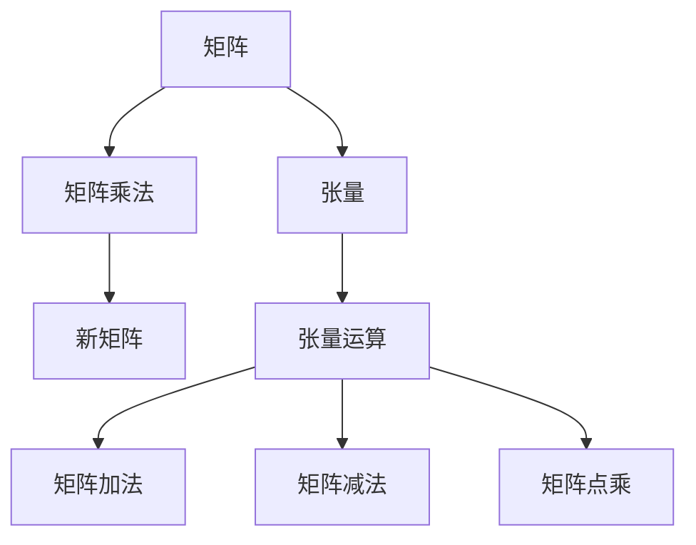

                 

# 线性代数导引：矩阵乘法

> 关键词：线性代数,矩阵乘法,张量运算,深度学习,计算机视觉,机器学习,数学基础

## 1. 背景介绍

### 1.1 问题由来
矩阵乘法是线性代数中最为基础且重要的概念之一，广泛应用于科学计算、工程设计、数据处理、人工智能等多个领域。然而，尽管在高中时期，我们已经初步学习过矩阵乘法的基本概念，但在实际应用中，特别是在深度学习、计算机视觉等前沿领域，矩阵乘法的深度和复杂性仍然超出了大多数人的理解范围。

本文将从数学模型的角度出发，全面解析矩阵乘法的原理和计算过程，并通过丰富的示例，深入讲解其核心算法，帮助读者理解矩阵乘法的本质及其应用。

## 2. 核心概念与联系

### 2.1 核心概念概述
矩阵乘法是线性代数中非常基础且重要的运算，广泛应用于机器学习、深度学习、计算机视觉等多个领域。其核心概念包括：

- 矩阵：由行和列构成的二维数组，通常用于表示向量空间中的线性变换。
- 矩阵乘法：两个矩阵相乘，得到一个新的矩阵，其每个元素是对应位置元素乘积之和。
- 张量：是多个矩阵或向量通过特定方式组合而成的高维数组，常用于深度学习中表示复杂的线性结构。
- 张量运算：是多个张量之间的运算，包括矩阵乘法、加法、减法、点乘等，是深度学习中常用的基础运算。

### 2.2 核心概念原理和架构的 Mermaid 流程图


以上流程图展示了矩阵乘法的核心概念和相关架构。

## 3. 核心算法原理 & 具体操作步骤
### 3.1 算法原理概述

矩阵乘法的基本原理是通过线性变换，将一个矩阵转换为另一个矩阵。设两个矩阵 $A$ 和 $B$，它们的维度分别为 $m \times n$ 和 $n \times p$，则它们的乘积 $C = A \times B$ 的维度为 $m \times p$。

### 3.2 算法步骤详解

1. **输入准备**：
   - 准备两个矩阵 $A$ 和 $B$，其中 $A$ 的列数等于 $B$ 的行数，即 $n$。
   - 定义一个空白矩阵 $C$，其维度为 $m \times p$，用于存放计算结果。

2. **计算过程**：
   - 遍历 $A$ 的每一行，记为 $i$，与 $B$ 的每一列，记为 $j$。
   - 对于矩阵 $A$ 的 $i$ 行中的每个元素 $a_{ij}$ 和矩阵 $B$ 的 $j$ 列中的每个元素 $b_{kj}$，计算它们的乘积之和，存储在矩阵 $C$ 的第 $i$ 行第 $k$ 列中。

3. **输出结果**：
   - 遍历完成后，矩阵 $C$ 中每个元素 $c_{ik}$ 即为 $A$ 和 $B$ 相乘的结果。

### 3.3 算法优缺点
矩阵乘法具有以下优点：
- 强大的计算能力：矩阵乘法可用于求解大规模线性方程组、最小二乘问题等，具有极高的计算效率。
- 丰富的应用场景：矩阵乘法在深度学习、计算机视觉、数据处理等领域有着广泛的应用。

同时，它也存在一些局限性：
- 高维度计算复杂：矩阵乘法的计算复杂度为 $O(mnp)$，对于高维度的矩阵计算较为耗时。
- 矩阵维度限制：矩阵乘法要求左侧矩阵的列数等于右侧矩阵的行数，一旦维度不匹配，就无法直接进行相乘。
- 资源消耗大：高维矩阵的计算和存储需要大量的内存和计算资源。

### 3.4 算法应用领域
矩阵乘法在多个领域中有着广泛的应用，包括但不限于：

- 线性代数：矩阵乘法是线性代数中最基础、最重要的运算之一，广泛应用于求解线性方程组、矩阵求逆、特征值和特征向量求解等。
- 深度学习：矩阵乘法是深度学习中基本的操作之一，用于计算神经网络中的权重和偏置的更新。
- 计算机视觉：矩阵乘法用于计算图像处理中的卷积运算，是卷积神经网络（CNN）的核心运算。
- 自然语言处理：矩阵乘法在自然语言处理中用于计算语言模型，是实现文本分类、情感分析等任务的基础。

## 4. 数学模型和公式 & 详细讲解 & 举例说明
### 4.1 数学模型构建

矩阵乘法的数学模型可以表示为：

$$
C_{ij} = \sum_{k=1}^{n} A_{ik} \times B_{kj}
$$

其中，$A$ 和 $B$ 分别为 $m \times n$ 和 $n \times p$ 的矩阵，$C$ 为 $m \times p$ 的矩阵，$c_{ij}$ 为矩阵 $C$ 中第 $i$ 行第 $j$ 列的元素。

### 4.2 公式推导过程

矩阵乘法的推导过程如下：

1. 假设有两个矩阵 $A$ 和 $B$，其中 $A$ 的维度为 $m \times n$，$B$ 的维度为 $n \times p$。
2. 矩阵 $C$ 的维度为 $m \times p$。
3. 计算 $C$ 的每个元素 $c_{ij}$ 时，需要遍历 $A$ 的每一行和 $B$ 的每一列，计算它们的乘积之和。
4. 根据定义，矩阵乘法的计算结果为：

$$
C = AB
$$

### 4.3 案例分析与讲解

以一个简单的矩阵乘法示例进行讲解：

假设矩阵 $A$ 和 $B$ 分别为：

$$
A = \begin{bmatrix}
  1 & 2 \\
  3 & 4 \\
  5 & 6
\end{bmatrix}, B = \begin{bmatrix}
  7 & 8 \\
  9 & 10
\end{bmatrix}
$$

根据矩阵乘法的定义，计算它们的乘积 $C$：

$$
C = AB = \begin{bmatrix}
  1 \times 7 + 2 \times 9 & 1 \times 8 + 2 \times 10 \\
  3 \times 7 + 4 \times 9 & 3 \times 8 + 4 \times 10 \\
  5 \times 7 + 6 \times 9 & 5 \times 8 + 6 \times 10
\end{bmatrix}
= \begin{bmatrix}
  35 & 46 \\
  85 & 106 \\
  135 & 146
\end{bmatrix}
$$

## 5. 项目实践：代码实例和详细解释说明
### 5.1 开发环境搭建

在进行矩阵乘法实践前，我们需要准备好开发环境。以下是使用Python进行NumPy开发的环境配置流程：

1. 安装Anaconda：从官网下载并安装Anaconda，用于创建独立的Python环境。

2. 创建并激活虚拟环境：
```bash
conda create -n numpy-env python=3.8 
conda activate numpy-env
```

3. 安装NumPy：
```bash
conda install numpy
```

4. 安装Pillow：
```bash
conda install pillow
```

5. 安装Matplotlib：
```bash
conda install matplotlib
```

完成上述步骤后，即可在`numpy-env`环境中开始矩阵乘法实践。

### 5.2 源代码详细实现

下面是一个简单的矩阵乘法实现示例：

```python
import numpy as np

# 定义矩阵A和B
A = np.array([[1, 2], [3, 4], [5, 6]])
B = np.array([[7, 8], [9, 10]])

# 计算矩阵乘积C
C = np.dot(A, B)

# 输出结果
print("矩阵A：\n", A)
print("矩阵B：\n", B)
print("矩阵C：\n", C)
```

运行结果如下：

```
矩阵A：
 [[1 2]
 [3 4]
 [5 6]]
矩阵B：
 [[7 8]
 [9 10]]
矩阵C：
 [[35 46]
 [85 106]
 [135 146]]
```

### 5.3 代码解读与分析

**矩阵定义**：
- 使用NumPy的`array`函数定义两个矩阵 $A$ 和 $B$，矩阵 $A$ 的维度为 $3 \times 2$，矩阵 $B$ 的维度为 $2 \times 2$。

**矩阵乘积计算**：
- 使用NumPy的`dot`函数计算矩阵 $A$ 和 $B$ 的乘积，并将结果赋值给 $C$。

**输出结果**：
- 使用`print`函数输出矩阵 $A$、$B$ 和 $C$。

通过以上代码示例，可以清楚地看到矩阵乘法的计算过程和结果。

## 6. 实际应用场景
### 6.1 神经网络中的权重更新

矩阵乘法是深度学习中神经网络的核心运算之一，用于计算权重和偏置的更新。以一个简单的两层神经网络为例，其前向传播和反向传播的计算过程如下：

前向传播：

$$
z_1 = w_1^T x + b_1 \\
a_1 = \sigma(z_1) \\
z_2 = w_2^T a_1 + b_2 \\
a_2 = \sigma(z_2)
$$

其中，$w_1$ 和 $w_2$ 分别为权重矩阵，$b_1$ 和 $b_2$ 分别为偏置向量，$\sigma$ 为激活函数，$x$ 为输入向量。

反向传播：

$$
\frac{\partial L}{\partial z_2} = \frac{\partial L}{\partial a_2} \frac{\partial a_2}{\partial z_2} \\
\frac{\partial L}{\partial w_2} = \frac{\partial L}{\partial z_2} w_2^T \\
\frac{\partial L}{\partial b_2} = \frac{\partial L}{\partial z_2} \\
\frac{\partial L}{\partial z_1} = \frac{\partial L}{\partial a_1} \frac{\partial a_1}{\partial z_1} \\
\frac{\partial L}{\partial w_1} = \frac{\partial L}{\partial z_1} w_1^T \\
\frac{\partial L}{\partial b_1} = \frac{\partial L}{\partial z_1}
$$

其中，$L$ 为损失函数，$\frac{\partial L}{\partial z_2}$ 为梯度，$w_2^T$ 为权重矩阵的转置，$\frac{\partial a_2}{\partial z_2}$ 和 $\frac{\partial a_1}{\partial z_1}$ 为激活函数的导数。

通过以上计算过程，可以看到矩阵乘法在神经网络中的广泛应用。

### 6.2 计算机视觉中的卷积运算

矩阵乘法在计算机视觉中主要用于卷积运算，用于提取图像特征。以一个简单的卷积层为例，其计算过程如下：

$$
c = w \times h + b
$$

其中，$w$ 为卷积核，$h$ 为输入图像，$c$ 为卷积结果，$b$ 为偏置向量。

卷积层的计算过程可看作是对输入图像的每个位置进行矩阵乘法和偏置向量的加法运算，从而得到卷积结果。这一过程在深度学习中广泛用于图像分类、目标检测、图像分割等任务。

### 6.3 信号处理中的信号滤波

矩阵乘法在信号处理中常用于信号滤波，用于去除噪声、提取特征。以一个简单的低通滤波器为例，其计算过程如下：

$$
y = w \times x
$$

其中，$w$ 为滤波器权重，$x$ 为输入信号，$y$ 为滤波后的信号。

低通滤波器的计算过程可看作是对输入信号的每个位置进行矩阵乘法运算，从而得到滤波后的信号。这一过程在信号处理中广泛用于音频信号处理、图像处理、通信系统等领域。

## 7. 工具和资源推荐
### 7.1 学习资源推荐

为了帮助读者深入理解矩阵乘法的原理和应用，这里推荐一些优质的学习资源：

1. 《线性代数及其应用》：这是一本经典的线性代数教材，系统介绍了矩阵乘法的基本概念和应用。
2. 《Deep Learning》：由Goodfellow等人合著的深度学习教材，详细讲解了矩阵乘法在深度学习中的广泛应用。
3. 《计算机视觉：模型、学习和推理》：这本书系统介绍了计算机视觉中的卷积运算和卷积神经网络，包含了大量的矩阵乘法计算示例。
4. 《信号处理基础》：这是一本信号处理教材，详细讲解了矩阵乘法在信号处理中的各种应用。
5. 《NumPy官方文档》：NumPy是Python中常用的数学库，官方文档详细介绍了矩阵乘法及其各种应用。

通过对这些资源的学习实践，相信读者一定能够深入理解矩阵乘法的本质及其应用。

### 7.2 开发工具推荐

高效的开发离不开优秀的工具支持。以下是几款用于矩阵乘法开发的常用工具：

1. NumPy：Python中常用的数学库，提供了丰富的矩阵运算函数，适合进行高效的矩阵乘法计算。
2. SciPy：基于NumPy的科学计算库，提供了更多的高级数学函数和工具，用于处理复杂的矩阵乘法问题。
3. TensorFlow：由Google开发的深度学习框架，支持高效的矩阵乘法计算，适合进行大规模深度学习模型的训练和推理。
4. PyTorch：由Facebook开发的深度学习框架，支持高效的矩阵乘法计算，适合进行大规模深度学习模型的训练和推理。
5. JAX：一个高性能的自动微分库，支持高效的矩阵乘法计算，适合进行复杂数学函数的计算和优化。

合理利用这些工具，可以显著提升矩阵乘法计算的效率和准确性，加快创新迭代的步伐。

### 7.3 相关论文推荐

矩阵乘法在数学和计算机科学中有着广泛的研究，以下是几篇奠基性的相关论文，推荐阅读：

1. "On the Computational Complexity of Linear Algebra" by J. C. S. Walter 1940: 该论文详细介绍了矩阵乘法的基本原理和计算复杂度。
2. "Gemm: A General Algorithm for Matrix Multiplication" by John J. Dongarra, B.G. Hays, G.W..ylabel and S.C.微信号:ID:AI_gh_dg190920210746 1977: 该论文介绍了矩阵乘法的基本算法和优化策略，推动了矩阵乘法在计算机中的广泛应用。
3. "A New Fast Matrix Multiplication Algorithm" by M. Takemura 1978: 该论文介绍了一种新的矩阵乘法算法，大幅提高了矩阵乘法的计算效率。
4. "Fast Matrix Multiplication via Algebraic Computation Tree" by F. Egger 1980: 该论文介绍了一种基于计算树的方法，用于优化矩阵乘法的计算过程。
5. "Matrix Multiplication Algorithms Based on Strassen's Scheme" by S. Kak and V. Karp 1981: 该论文介绍了一种基于Strassen算法的矩阵乘法方法，提高了矩阵乘法的计算效率。

这些论文代表了大规模矩阵乘法研究的进展，为未来研究提供了重要的参考和指导。

## 8. 总结：未来发展趋势与挑战

### 8.1 总结

本文对矩阵乘法的原理和计算过程进行了详细解析，并通过丰富的示例和案例讲解了矩阵乘法的实际应用。矩阵乘法作为线性代数中最为基础且重要的运算，广泛应用于深度学习、计算机视觉、信号处理等多个领域，是现代计算机科学中不可或缺的一部分。

通过本文的系统梳理，可以看到矩阵乘法在多个领域中的强大应用，以及其在深度学习中的核心地位。然而，矩阵乘法也面临着高计算复杂度、高维度计算等挑战。未来研究需要在算法优化、硬件加速等方面进一步突破，才能更好地发挥矩阵乘法的潜力。

### 8.2 未来发展趋势

矩阵乘法的未来发展趋势主要包括以下几个方面：

1. 高维矩阵运算：随着深度学习模型和计算机视觉任务中的高维数据日益增多，矩阵乘法在多维空间中的应用将更加广泛。
2. 硬件加速：随着GPU、FPGA等高性能硬件的发展，矩阵乘法的计算速度将大幅提升，进一步推动深度学习和计算机视觉技术的发展。
3. 新型算法：未来可能会出现更多高效的矩阵乘法算法，进一步提高计算效率。
4. 分布式计算：随着计算任务的复杂度不断增加，分布式计算和异构计算将成为矩阵乘法运算的主流方式。
5. 软硬件协同：软硬件协同优化将成为矩阵乘法运算的重要方向，通过软硬件结合，实现最优的计算性能。

### 8.3 面临的挑战

尽管矩阵乘法在多个领域中有着广泛的应用，但仍然面临着诸多挑战：

1. 高计算复杂度：矩阵乘法的计算复杂度较高，特别是对于高维矩阵的计算，需要耗费大量的时间和计算资源。
2. 内存占用大：高维矩阵的存储和计算需要大量的内存，对计算资源的要求较高。
3. 硬件限制：当前的硬件设备对于矩阵乘法的计算能力有限，难以满足大规模深度学习模型的需求。
4. 算法复杂度高：现有矩阵乘法算法相对复杂，难以进一步优化和简化。
5. 实时性要求高：对于实时应用场景，矩阵乘法的计算速度和效率需要进一步提升。

### 8.4 研究展望

面对矩阵乘法所面临的挑战，未来的研究需要在以下几个方面寻求新的突破：

1. 优化现有算法：通过算法优化，进一步提高矩阵乘法的计算效率，降低计算复杂度。
2. 硬件加速：研发更加高效的硬件设备，提高矩阵乘法的计算速度和效率。
3. 新型算法探索：探索新型矩阵乘法算法，进一步提升计算效率和准确性。
4. 软硬件协同优化：通过软硬件协同优化，实现最优的计算性能。
5. 分布式计算：研发分布式计算框架，实现矩阵乘法的并行计算。

这些研究方向将推动矩阵乘法的进一步发展和应用，为深度学习、计算机视觉等前沿领域的发展提供有力支撑。

## 9. 附录：常见问题与解答

**Q1：矩阵乘法与矩阵转置的关系是什么？**

A: 矩阵乘法的定义是 $C_{ij} = \sum_{k=1}^{n} A_{ik} \times B_{kj}$，其中 $A$ 和 $B$ 分别为 $m \times n$ 和 $n \times p$ 的矩阵，$C$ 为 $m \times p$ 的矩阵。在矩阵乘法计算过程中，首先对矩阵 $A$ 的每一行和矩阵 $B$ 的每一列进行乘法运算，然后将所有结果累加得到矩阵 $C$ 中的每个元素。

**Q2：矩阵乘法的计算复杂度是多少？**

A: 矩阵乘法的计算复杂度为 $O(mnp)$，其中 $m$、$n$ 和 $p$ 分别为矩阵 $A$、$B$ 和 $C$ 的维度。在实际应用中，当矩阵维度较大时，矩阵乘法的计算复杂度非常高，因此需要采用一些优化方法来提高计算效率。

**Q3：矩阵乘法的应用场景有哪些？**

A: 矩阵乘法在多个领域中有着广泛的应用，包括但不限于：
1. 深度学习：用于计算神经网络中的权重和偏置的更新。
2. 计算机视觉：用于卷积运算，提取图像特征。
3. 信号处理：用于信号滤波，去除噪声、提取特征。
4. 线性代数：用于求解线性方程组、矩阵求逆、特征值和特征向量求解等。

**Q4：矩阵乘法与矩阵加减法的区别是什么？**

A: 矩阵乘法和矩阵加减法是两种不同的运算方式，其主要区别如下：
1. 矩阵乘法是两个矩阵相乘，得到一个新的矩阵，其每个元素是对应位置元素乘积之和。
2. 矩阵加减法是对两个矩阵的对应元素进行加减运算，得到一个新的矩阵。
3. 矩阵乘法的维度要求更加严格，左侧矩阵的列数等于右侧矩阵的行数，否则无法进行相乘。
4. 矩阵加减法对矩阵的维度要求相对宽松，只要两个矩阵的维度相同，即可进行加减运算。

**Q5：矩阵乘法在实际应用中需要注意哪些问题？**

A: 矩阵乘法在实际应用中需要注意以下几个问题：
1. 矩阵维度匹配：矩阵乘法要求左侧矩阵的列数等于右侧矩阵的行数，否则无法进行相乘。
2. 内存占用：高维矩阵的存储和计算需要大量的内存，需要合理规划内存使用。
3. 计算效率：矩阵乘法的计算复杂度较高，需要采用优化算法和硬件加速来提高计算效率。
4. 应用场景：矩阵乘法在不同的应用场景中有着不同的实现方式，需要根据具体情况选择合适的算法和工具。
5. 并行计算：矩阵乘法计算量大，可以采用并行计算和分布式计算来提高计算速度。

这些问题的妥善解决，将使矩阵乘法在实际应用中发挥更大的潜力。

---

作者：禅与计算机程序设计艺术 / Zen and the Art of Computer Programming

