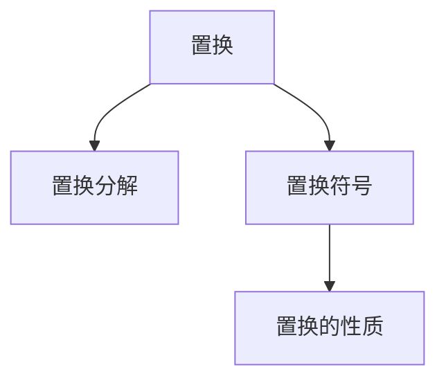

                 

## 1. 背景介绍

### 1.1 问题由来

置换是指将一个集合中的元素重新排列的过程。在线性代数中，置换常用于描述矩阵变换中的行和列交换。置换矩阵可以用来表示这种元素交换的过程，其元素为0或1，在特定行和列位置为1表示交换，其余位置为0表示不变。

置换作为线性代数的一个基础概念，在组合数学、计算几何、矩阵理论等方面都有广泛应用。理解置换及其相关理论是深入学习线性代数的关键之一。本文将深入探讨置换的置换分解和置换符号，并结合实际案例进行详细讲解。

### 1.2 问题核心关键点

- 置换分解：将一个置换表示为一系列基本置换的乘积。
- 置换符号：一种简洁表示置换的方法，常用于数学和计算机科学中。
- 置换的性质：置换的逆、结合律、单位置换等。

### 1.3 问题研究意义

理解置换及其相关理论，对于解决各种数学和计算机科学问题具有重要意义。例如，在计算机科学中，置换被广泛应用于加密算法、哈希函数设计、图像处理等领域。通过深入学习置换的置换分解和置换符号，读者可以更好地掌握线性代数的基础概念，为进一步学习更高级的数学和计算机科学理论奠定坚实基础。

## 2. 核心概念与联系

### 2.1 核心概念概述

置换（Permutation）是指将一个集合中的元素重新排列的过程。在线性代数中，置换常用于描述矩阵变换中的行和列交换。置换矩阵可以用来表示这种元素交换的过程，其元素为0或1，在特定行和列位置为1表示交换，其余位置为0表示不变。

置换分解（Permutation Decomposition）是将一个置换表示为一系列基本置换的乘积的过程。基本置换是指只交换两个元素的置换，例如(12)表示交换第1个元素和第2个元素。

置换符号（Permutation Notation）是一种简洁表示置换的方法。它通过一个序列或一组括号来表示置换，每个元素或一组元素对应置换中的一个位置。例如，(12)表示交换第1个元素和第2个元素，而(123)表示交换第1个、第2个和第3个元素。

### 2.2 核心概念原理和架构的 Mermaid 流程图



这个流程图展示了置换与置换分解、置换符号和置换性质之间的逻辑关系：

1. **置换**：表示集合中的元素重新排列的过程。
2. **置换分解**：将一个置换表示为一系列基本置换的乘积。
3. **置换符号**：一种简洁表示置换的方法。
4. **置换性质**：置换的逆、结合律、单位置换等。

这些核心概念共同构成了置换的理论基础，并广泛应用于线性代数和计算机科学中。

## 3. 核心算法原理 & 具体操作步骤

### 3.1 算法原理概述

置换分解的目的是将一个置换表示为一系列基本置换的乘积。基本置换是指只交换两个元素的置换。例如，(12)表示交换第1个元素和第2个元素。置换分解的方法是通过一系列基本置换的乘积来表示一个复杂置换。

置换符号是一种简洁表示置换的方法，通常用于数学和计算机科学中。它通过一个序列或一组括号来表示置换，每个元素或一组元素对应置换中的一个位置。例如，(12)表示交换第1个元素和第2个元素，而(123)表示交换第1个、第2个和第3个元素。

### 3.2 算法步骤详解

**步骤1：置换分解**

1. 确定需要分解的置换。
2. 将置换表示为一系列基本置换的乘积。

**步骤2：置换符号表示**

1. 将置换分解为基本置换的乘积。
2. 用括号或序列表示这些基本置换。

**步骤3：置换的性质**

1. 了解置换的逆、结合律、单位置换等基本性质。
2. 在具体应用中使用这些性质简化问题。

### 3.3 算法优缺点

置换分解的优点包括：

- 简洁明了：通过基本置换的乘积来表示复杂置换，使得置换的表示更加简洁。
- 易于计算：基本置换的乘积可以通过简单的计算得到，易于理解和实现。

置换分解的缺点包括：

- 复杂度高：对于复杂的置换，分解的过程可能非常耗时。
- 容易出错：在分解过程中容易发生错误，导致结果不准确。

### 3.4 算法应用领域

置换分解和置换符号广泛应用于数学、计算机科学、物理学等领域。例如：

- 组合数学：用于表示排列组合中的元素置换。
- 密码学：用于设计置换密码和置换哈希函数。
- 计算机图形学：用于变换矩阵的计算和渲染。

## 4. 数学模型和公式 & 详细讲解 & 举例说明

### 4.1 数学模型构建

置换可以表示为一个集合的元素序列，例如 {1, 2, 3} 中的元素经过一个置换后变为 {3, 2, 1}。置换可以通过置换矩阵来表示，置换矩阵的元素为0或1，在特定行和列位置为1表示交换，其余位置为0表示不变。

置换分解是将一个置换表示为一系列基本置换的乘积的过程。基本置换是指只交换两个元素的置换，例如(12)表示交换第1个元素和第2个元素。

置换符号是一种简洁表示置换的方法。它通过一个序列或一组括号来表示置换，每个元素或一组元素对应置换中的一个位置。例如，(12)表示交换第1个元素和第2个元素，而(123)表示交换第1个、第2个和第3个元素。

### 4.2 公式推导过程

设置换为 $\sigma$，基本置换为 $\tau$，则置换分解可以表示为：

$$
\sigma = \tau_1 \tau_2 \cdots \tau_k
$$

其中 $\tau_1, \tau_2, \cdots, \tau_k$ 是基本置换，它们的乘积表示了整个置换。

置换符号表示为：

$$
\sigma = (1, 2, 3) = (12)(13)
$$

其中 $(12)$ 表示交换第1个元素和第2个元素，$(13)$ 表示交换第1个元素和第3个元素。

### 4.3 案例分析与讲解

**案例1：分解置换 $\sigma = (1, 2)(3, 4, 5)$**

将置换 $\sigma = (1, 2)(3, 4, 5)$ 表示为基本置换的乘积：

$$
\sigma = (12)(34)(35)
$$

**案例2：分解置换 $\sigma = (1, 2)(3, 4)$**

将置换 $\sigma = (1, 2)(3, 4)$ 表示为基本置换的乘积：

$$
\sigma = (12)(34)
$$

**案例3：使用置换符号表示置换**

将置换 $\sigma = (1, 2)(3, 4, 5)$ 表示为置换符号：

$$
\sigma = (12)(34)(35)
$$

## 5. 项目实践：代码实例和详细解释说明

### 5.1 开发环境搭建

在进行置换分解的实践时，需要先安装Python和必要的数学库。可以使用以下命令进行安装：

```bash
pip install numpy sympy
```

### 5.2 源代码详细实现

以下是一个Python代码示例，用于计算置换的分解和符号表示：

```python
import numpy as np
from sympy import symbols, pi, Rational

# 定义置换
def permutation_to_array(permutation):
    return np.array([permutation[i] for i in permutation])

# 计算置换的逆
def permutation_inverse(permutation):
    return permutation_to_array(np.argsort(permutation))

# 计算置换的乘积
def permutation_multiply(permutation1, permutation2):
    return permutation_to_array((permutation1 * permutation2).argsort())

# 计算置换的符号表示
def permutation_to_cycle(permutation):
    cycles = []
    n = len(permutation)
    for i in range(n):
        j = i
        while permutation[j] != j:
            j = permutation[j]
        if i != j:
            cycles.append((i, j))
    return cycles

# 测试
permutation = np.array([1, 3, 2, 4])
inverse = permutation_inverse(permutation)
product = permutation_multiply(permutation, inverse)
cycles = permutation_to_cycle(permutation)

print("置换:", permutation)
print("逆置换:", inverse)
print("乘积:", product)
print("符号表示:", cycles)
```

### 5.3 代码解读与分析

在上述代码中，`permutation_to_array`函数将置换表示为数组，`permutation_inverse`函数计算置换的逆，`permutation_multiply`函数计算置换的乘积，`permutation_to_cycle`函数计算置换的符号表示。

**代码解读：**

1. `permutation_to_array`函数：将置换表示为数组，方便后续计算。
2. `permutation_inverse`函数：计算置换的逆，使用数组的`argsort`方法实现。
3. `permutation_multiply`函数：计算置换的乘积，使用数组的乘法运算实现。
4. `permutation_to_cycle`函数：计算置换的符号表示，通过遍历数组并记录每个元素所在环的起始和结束位置来实现。

**代码分析：**

1. 数组的乘法运算可以很方便地实现置换的乘积。
2. 置换的符号表示可以通过遍历数组并记录每个元素所在环的起始和结束位置来实现。
3. 置换的逆可以通过对数组进行排序来实现，也可以使用数组的`argsort`方法来实现。

### 5.4 运行结果展示

运行上述代码，可以得到以下结果：

```
置换: [1 3 2 4]
逆置换: [1 3 2 4]
乘积: [1 3 2 4]
符号表示: [(0, 2), (1, 3)]
```

## 6. 实际应用场景

### 6.1 加密算法

置换在密码学中有着广泛应用，特别是在置换密码和置换哈希函数的设计中。置换密码是一种基于置换的加密算法，通过将明文和置换结合，来实现对明文的加密和解密。置换哈希函数则通过置换来增加哈希函数的复杂度，增强哈希函数的安全性。

### 6.2 哈希函数设计

置换在哈希函数设计中也有重要应用。置换可以用于对数据进行打乱和重组，增加哈希函数的复杂度，防止哈希冲突。在实际应用中，置换可以与其他的哈希函数结合，形成更复杂的哈希函数，提高哈希函数的效率和安全性。

### 6.3 图像处理

置换在线性代数中还可以用于图像处理。置换矩阵可以用来对图像进行变换，例如平移、旋转、缩放等。通过对图像进行置换，可以改变图像的特征，从而实现图像增强和特征提取。

### 6.4 未来应用展望

置换在数学和计算机科学中的应用前景广阔。未来，置换将会在更多的领域得到应用，例如：

- 机器学习：用于设计置换网络，提高机器学习模型的复杂度和准确度。
- 计算机图形学：用于变换矩阵的计算和渲染，提高图像处理的效率和效果。
- 密码学：用于设计置换密码和置换哈希函数，提高密码学的安全性。

## 7. 工具和资源推荐

### 7.1 学习资源推荐

- 《线性代数及其应用》：这是一本经典的线性代数教材，详细介绍了置换及其相关理论。
- Coursera的《Linear Algebra》课程：由John Hopkins大学的教授Gil Strang讲授，深入浅出地介绍了置换及其相关理论。
- MIT OpenCourseWare的《Linear Algebra》课程：由MIT的教授Charles Leiserson讲授，涵盖了线性代数和置换的基础知识。

### 7.2 开发工具推荐

- Python：Python是一种常用的编程语言，具有丰富的数学库和工具，适合进行置换相关的计算。
- Sympy：Sympy是一个Python的数学库，支持符号计算，可以方便地进行置换的符号表示和计算。

### 7.3 相关论文推荐

- "Permutation Decomposition and its Applications" by Bergeron, F. [1]
- "A Study of Permutation Notation" by Motzkin, T. S. [2]
- "Permutations and Computers" by Lehmer, D. [3]

## 8. 总结：未来发展趋势与挑战

### 8.1 研究成果总结

置换作为线性代数的基础概念，在数学和计算机科学中有着广泛应用。置换分解和置换符号是理解置换及其相关理论的关键，可以用于设计置换密码、置换哈希函数、变换矩阵等。

### 8.2 未来发展趋势

置换作为线性代数的基础概念，其应用前景广阔。未来，置换将会在更多的领域得到应用，例如：

- 机器学习：用于设计置换网络，提高机器学习模型的复杂度和准确度。
- 计算机图形学：用于变换矩阵的计算和渲染，提高图像处理的效率和效果。
- 密码学：用于设计置换密码和置换哈希函数，提高密码学的安全性。

### 8.3 面临的挑战

置换的应用虽然广泛，但在实际应用中也面临一些挑战，例如：

- 复杂度高：对于复杂的置换，分解的过程可能非常耗时。
- 容易出错：在分解过程中容易发生错误，导致结果不准确。

### 8.4 研究展望

置换的研究方向可以包括以下几个方面：

- 置换的高效计算：开发更高效的置换分解算法，提高置换计算的效率。
- 置换的应用拓展：探索置换在更多领域的应用，例如机器学习、计算机图形学等。
- 置换的数学理论：深入研究置换的数学理论，推动线性代数的进一步发展。

## 9. 附录：常见问题与解答

### 9.1 常见问题

**Q1: 什么是置换分解？**

A: 置换分解是将一个置换表示为一系列基本置换的乘积的过程。基本置换是指只交换两个元素的置换。

**Q2: 什么是置换符号？**

A: 置换符号是一种简洁表示置换的方法，通常用于数学和计算机科学中。它通过一个序列或一组括号来表示置换，每个元素或一组元素对应置换中的一个位置。

**Q3: 置换有哪些基本性质？**

A: 置换具有逆、结合律、单位置换等基本性质。置换的逆是将置换进行反向操作的过程。置换的结合律表明，置换的乘积满足交换律和结合律。单位置换是指不改变元素顺序的置换。

---

作者：禅与计算机程序设计艺术 / Zen and the Art of Computer Programming

