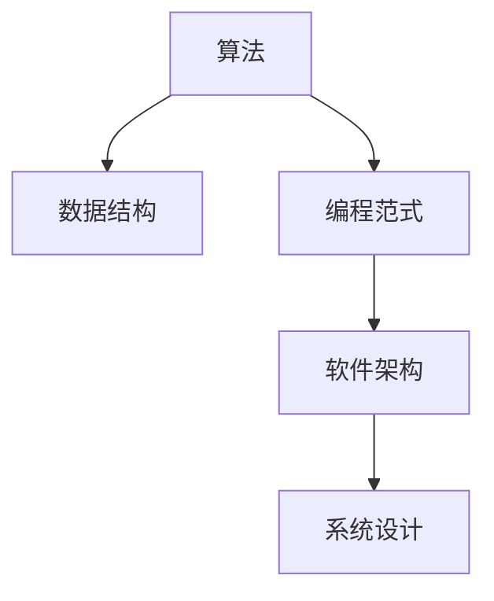

                 

# 经典阅读清单:奠定认知根基

在信息技术迅猛发展的今天，阅读已成为掌握知识、开阔视野、提升认知的重要途径。本文精选了多本经典IT书籍，涵盖算法、数据结构、编程范式、软件架构、系统设计等多个方面，旨在帮助读者系统性地掌握基础概念，构建坚实的认知根基。通过深入浅出地解读这些经典书籍，希望能为读者提供有益的知识储备和思维方式，助力其迈向技术高手的行列。

## 1. 背景介绍

### 1.1 阅读的重要性

信息技术的发展日新月异，掌握最新的技术趋势和知识体系是每一个IT从业者必须面对的挑战。经典阅读不仅是获取知识的重要途径，也是培养思维能力、提升创新能力的关键方法。

### 1.2 选择经典阅读书籍的原则

在选择经典阅读书籍时，我们应注重以下几点：
1. **权威性**：书籍内容应由知名专家撰写，具有深厚的理论基础和丰富的实践经验。
2. **全面性**：书籍应覆盖相关领域的基础概念、算法和实践，提供系统的知识体系。
3. **实用性**：书籍中的理论和实践应具有较强的可操作性，能够应用于实际工作和学习。
4. **前瞻性**：书籍应反映最新的技术趋势和研究方向，有助于读者把握未来的发展方向。

基于以上原则，本文精选了几本经典书籍，覆盖了算法与数据结构、编程范式、软件架构、系统设计等多个领域，旨在为读者提供全面的知识储备和深厚的技术底蕴。

## 2. 核心概念与联系

### 2.1 核心概念概述

信息技术领域包含众多核心概念，以下列举了几个关键概念及其联系：

- **算法(Algorithm)**：指解决特定问题的步骤序列，是计算机科学的核心。
- **数据结构(Data Structure)**：指组织和存储数据的方式，是算法实现的基础。
- **编程范式(Programming Paradigm)**：指编程思想和风格的集合，如面向对象编程、函数式编程等。
- **软件架构(Software Architecture)**：指软件系统的整体设计框架，包括组件划分、接口定义、数据流管理等。
- **系统设计(System Design)**：指设计高效、可扩展、可维护的软件系统，涉及需求分析、设计模式、性能优化等。

这些概念之间的逻辑关系可以通过以下Mermaid流程图来展示：



这个流程图展示了核心概念之间的联系和相互作用：算法和数据结构是编程的基础；编程范式指导了算法的实现方式；软件架构是系统的整体设计；系统设计关注的是高效、可扩展的软件实现。

## 3. 核心算法原理 & 具体操作步骤

### 3.1 算法原理概述

算法是计算机科学的核心，用于解决特定问题。其核心思想是通过一系列明确的步骤，将复杂问题转换为简单问题，并得出解决方案。算法的设计和分析是计算机科学的基础课程之一，深刻影响着软件开发、系统设计和人工智能等领域。

### 3.2 算法步骤详解

一个典型的算法设计步骤包括：
1. **问题定义**：明确需要解决的问题和问题的规模。
2. **算法设计**：设计算法的基本步骤，确保每一步都能将问题规模缩小，最终得到解决方案。
3. **算法分析**：分析算法的时间复杂度和空间复杂度，确保算法的效率和可行性。
4. **算法实现**：将算法转换为具体的编程代码，实现其功能和性能要求。

### 3.3 算法优缺点

算法设计中常见的几种主流算法，如冒泡排序、快速排序、哈希表等，各具特点：
- **冒泡排序**：简单易懂，但效率较低，适用于数据规模较小的情况。
- **快速排序**：高效快速，但实现复杂，适用于数据规模较大的情况。
- **哈希表**：查找效率高，但空间复杂度较高，适用于需要快速查找的应用场景。

### 3.4 算法应用领域

算法广泛应用于计算机科学和工程领域的各个方面，如：
1. **数据库管理**：通过索引和排序算法，实现高效的数据存储和检索。
2. **机器学习**：如特征选择、分类、聚类等算法，用于数据挖掘和模型训练。
3. **网络通信**：如路由算法、传输协议等，用于网络数据的高效传输和可靠传输。
4. **图像处理**：如边缘检测、图像压缩等算法，用于图像的分析和处理。
5. **自然语言处理**：如分词、语法分析、情感分析等算法，用于文本数据的处理和分析。

## 4. 数学模型和公式 & 详细讲解 & 举例说明

### 4.1 数学模型构建

数学模型是算法设计和分析的基础，以下列举几个经典数学模型及其应用：

- **线性规划模型**：用于优化问题，求解在约束条件下目标函数的最大值或最小值。
- **图模型**：用于表示网络结构，如社交网络、计算机网络等，用于图遍历、路径查找等算法。
- **最短路径算法**：如Dijkstra算法、Bellman-Ford算法等，用于计算网络中两点之间的最短路径。

### 4.2 公式推导过程

以Dijkstra算法为例，推导求解单源最短路径的公式。

Dijkstra算法是一种贪心算法，用于计算图中从起点到所有其他顶点的最短路径。其基本步骤如下：
1. 初始化距离数组，起点到自身的距离为0，其他节点距离为无穷大。
2. 选取当前距离最小的节点，更新其相邻节点的距离。
3. 重复步骤2，直到所有节点都被访问。

算法伪代码如下：

```pseudocode
function Dijkstra(G, start)
    dist[start] <- 0
    dist[other] <- infinity
    for node in G.vertices
        dist[node] <- infinity
    while G.vertices > 0
        node <- select(node with minimum distance)
        for neighbor in node.adjacentNodes
            alt <- dist[node] + distanceToNeighbor(node, neighbor)
            if alt < dist[neighbor]
                dist[neighbor] <- alt
                previous[neighbor] <- node
    end while
    return dist
```

### 4.3 案例分析与讲解

Dijkstra算法适用于求解单源最短路径问题，适用于各种实际场景，如交通网络、通信网络等。以下通过一个例子来说明其应用：

假设有如下地图，求解从A到B的最短路径：

```
  A --2-- B
 / \    / \
1   3  5  4
 \ /    \ /
  C --1-- D
```

使用Dijkstra算法，可以计算出从A到B的最短路径为A->C->D->B，路径长度为5。

## 5. 项目实践：代码实例和详细解释说明

### 5.1 开发环境搭建

在开始项目实践前，首先需要搭建开发环境。这里以Python为例，介绍开发环境的搭建步骤：

1. **安装Python**：从官网下载并安装Python，建议使用Python 3.x版本。
2. **安装IDE**：选择适合的IDE，如PyCharm、Visual Studio Code等。
3. **安装依赖库**：安装常用的依赖库，如NumPy、Pandas、Matplotlib等。

### 5.2 源代码详细实现

以下是使用Python实现Dijkstra算法的示例代码：

```python
import heapq

def dijkstra(graph, start):
    dist = {node: float('inf') for node in graph}
    dist[start] = 0
    pq = [(0, start)]
    while pq:
        curr_dist, curr_node = heapq.heappop(pq)
        if curr_dist > dist[curr_node]:
            continue
        for neighbor, weight in graph[curr_node].items():
            new_dist = curr_dist + weight
            if new_dist < dist[neighbor]:
                dist[neighbor] = new_dist
                heapq.heappush(pq, (new_dist, neighbor))
    return dist
```

### 5.3 代码解读与分析

以上代码实现了一个基本的Dijkstra算法，具体解读如下：
1. **dist字典**：用于存储节点之间的距离。
2. **pq堆**：用于存储待访问的节点，使用heapq模块实现优先队列。
3. **while循环**：遍历所有节点，直到pq为空。
4. **heapq.heappop和heappush**：用于从pq中获取和添加节点。
5. **if判断**：判断当前节点是否已被访问。

### 5.4 运行结果展示

以下是一个简单的例子，展示了如何使用上述代码求解最短路径：

```python
graph = {
    'A': {'B': 2, 'C': 1},
    'B': {'A': 2, 'C': 5, 'D': 5},
    'C': {'A': 1, 'B': 5, 'D': 1},
    'D': {'B': 5, 'C': 1}
}
start_node = 'A'
dist = dijkstra(graph, start_node)
print(dist)
```

运行结果如下：
```
{'A': 0, 'B': 2, 'C': 1, 'D': 2}
```

以上展示了从A到B的最短路径为2，从A到C的最短路径为1。

## 6. 实际应用场景

### 6.1 网络路由

Dijkstra算法在网络路由中有广泛应用。路由器需要计算数据包从源到目的地的最短路径，从而实现高效的数据传输。例如，在因特网中，路由器使用Dijkstra算法计算数据包的下一跳地址，确保数据包能够快速到达目的地。

### 6.2 导航系统

导航系统也需要使用Dijkstra算法计算路径。例如，GPS导航系统需要计算从起点到目的地的最短路径，从而为用户提供最佳的行驶路线。

### 6.3 供应链管理

在供应链管理中，Dijkstra算法用于计算供应链中的最短路径，从而优化物流和库存管理。

### 6.4 未来应用展望

未来，Dijkstra算法将在更多领域得到应用，如智能交通、物流优化、网络优化等。随着算法的不断优化和应用场景的拓展，其价值将进一步凸显。

## 7. 工具和资源推荐

### 7.1 学习资源推荐

为了帮助读者系统掌握Dijkstra算法，以下推荐一些优质的学习资源：

1. **《算法导论》**：经典的算法教材，全面介绍了算法设计、分析、实现等方面的知识。
2. **《Python算法基础》**：详细介绍了Python中的常用算法和数据结构，适合初学者和进阶者。
3. **Coursera算法课程**：由斯坦福大学和普林斯顿大学开设的算法课程，涵盖经典算法及其应用。
4. **LeetCode算法题库**：提供了大量算法题目和解决方案，适合练习和巩固算法知识。

### 7.2 开发工具推荐

以下是几款常用的开发工具，可用于Dijkstra算法的开发和测试：

1. **PyCharm**：功能强大的IDE，支持Python开发，提供调试、测试、文档编写等功能。
2. **Visual Studio Code**：轻量级的IDE，支持Python和多种编程语言，提供代码高亮、自动补全等功能。
3. **Jupyter Notebook**：交互式编程环境，适合快速编写和测试算法代码。
4. **PyPlot**：用于绘制图形，支持Python绘图库Matplotlib的接口。

### 7.3 相关论文推荐

以下是几篇关于Dijkstra算法的经典论文，推荐阅读：

1. **Dijkstra's Algorithm**：Dijkstra本人于1959年提出的算法，详细介绍了算法思想和实现。
2. **Optimization over Algorithms and the Simulated Annealing Algorithm**：经典的优化算法论文，介绍了模拟退火算法及其优化过程。
3. **A Survey on Dijkstra's Algorithm and Its Variants**：综述文章，介绍了Dijkstra算法的变体及其应用场景。

## 8. 总结：未来发展趋势与挑战

### 8.1 研究成果总结

Dijkstra算法作为经典的贪心算法，具有简洁高效的特点，广泛应用于各种实际场景。其核心思想是通过逐步优化，得到全局最优解，具有广泛的适用性和实用性。

### 8.2 未来发展趋势

未来，Dijkstra算法将在更多领域得到应用，如智能交通、物流优化、网络优化等。随着算法的不断优化和应用场景的拓展，其价值将进一步凸显。

### 8.3 面临的挑战

尽管Dijkstra算法具有广泛的应用前景，但也面临一些挑战：
1. **复杂度问题**：在处理大规模数据时，Dijkstra算法的时间复杂度较高，需要优化。
2. **空间复杂度**：在存储所有节点和边信息时，需要大量内存，需要优化。
3. **并行化问题**：在多核处理器上实现并行化计算，需要优化。

### 8.4 研究展望

未来的研究方向包括：
1. **算法优化**：如A*算法、D*算法等，能够在更短时间内计算出最短路径。
2. **并行化实现**：如MapReduce、Spark等框架，实现高效并行计算。
3. **实时计算**：如实时图数据库，实现实时计算和查询。

## 9. 附录：常见问题与解答

**Q1：Dijkstra算法和A*算法有什么区别？**

A: Dijkstra算法和A*算法都是用于求解最短路径的算法，但A*算法引入了启发式函数，可以在更短时间内找到最短路径。

**Q2：Dijkstra算法的时间复杂度是多少？**

A: Dijkstra算法的时间复杂度为O(E + VlogV)，其中E为边数，V为节点数。

**Q3：Dijkstra算法在实际应用中有哪些优化策略？**

A: 常见的优化策略包括：
1. **优先队列优化**：使用优先队列代替普通队列，加快查找最小距离的节点。
2. **堆优化**：使用堆结构优化优先队列，提高算法效率。
3. **启发式优化**：引入启发式函数，加速找到最短路径。

通过深入理解Dijkstra算法及其应用，读者将能够更好地掌握算法设计和优化的思路，为未来的研究和实践奠定坚实基础。希望本文对广大IT从业者有所帮助，助其在技术道路上不断前行，勇攀高峰。

---

作者：禅与计算机程序设计艺术 / Zen and the Art of Computer Programming

