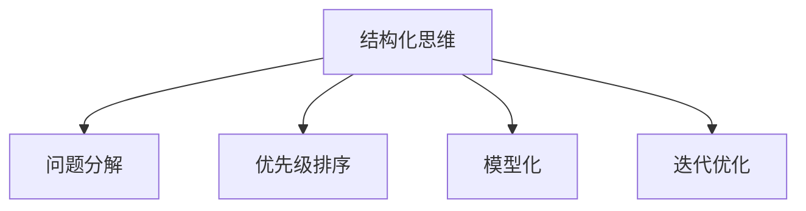

                 

# 结构化思维的力量：从思维到行动

在人工智能、软件开发、项目管理乃至日常生活中，思维方式的合理运用往往能够极大地提升效率和质量。本文将围绕“结构化思维的力量”，深入探讨其原理、应用与实践，为读者提供一条从思维到行动的有效路径。

## 1. 背景介绍

### 1.1 问题由来

在日常生活中，我们常常会面对各种复杂的问题，这些问题涉及到决策、分析、创新等多个层面。如何在纷繁复杂的任务中保持清晰、有效的思考，已成为高效完成任务的关键。

以软件开发为例，程序开发者常常面临需求变更、技术选型、团队协作等多重挑战。在信息量爆炸、技术不断进步的今天，如何构建合理的思维框架，应对变化，提升开发效率，成为软件工程中的一大难题。

### 1.2 问题核心关键点

1. **思维的局限性**：当信息过载时，线性思维模式容易陷入混乱，而结构化思维能够帮助我们理清思路，提高决策的准确性和效率。
2. **模型与方法**：结构化思维是一种系统化的思维方式，可以通过建模、分类、优先级排序等方法，将复杂问题分解为可管理、可执行的子任务。
3. **实践与改进**：将结构化思维方法应用于日常工作和生活，能够有效提升问题解决能力和团队协作效率。

## 2. 核心概念与联系

### 2.1 核心概念概述

为了更好地理解结构化思维的力量，本节将介绍几个核心概念：

- **结构化思维（Structured Thinking）**：指一种系统、有条理的思维方式，通过构建清晰的模型和框架，处理复杂问题。
- **问题分解（Problem Decomposition）**：将复杂问题拆分成更小、更易管理的子问题。
- **优先级排序（Prioritization）**：根据问题的紧急性和重要性，进行任务排序和资源分配。
- **模型化（Modeling）**：将现实问题抽象为模型，以便分析和预测。
- **迭代优化（Iterative Optimization）**：通过多次迭代，逐步改进模型和决策。

这些核心概念之间的逻辑关系可以通过以下Mermaid流程图来展示：



这个流程图展示了几大核心概念之间的内在联系：

1. **结构化思维**：提供一种框架，指导问题分解、优先级排序、模型化和迭代优化。
2. **问题分解**：将复杂问题拆分成多个子问题，便于逐一解决。
3. **优先级排序**：决定哪些子问题需要优先处理。
4. **模型化**：构建模型来模拟和分析问题。
5. **迭代优化**：通过多次迭代，不断改进决策和方案。

这些概念共同构成了结构化思维的核心框架，使其能够在处理各种复杂任务时发挥重要作用。

## 3. 核心算法原理 & 具体操作步骤

### 3.1 算法原理概述

结构化思维的核心在于将复杂问题转化为更小、更易管理的部分，通过系统化的处理方式，逐步解决问题。

在实际应用中，常用的结构化思维方法包括问题分解、优先级排序、模型化和迭代优化。

- **问题分解**：将问题拆分为多个子问题，以便逐一解决。
- **优先级排序**：根据问题的紧急性和重要性，决定哪些子问题需要优先处理。
- **模型化**：通过构建模型来模拟和分析问题，以便更清晰地理解问题本质。
- **迭代优化**：通过多次迭代，不断改进决策和方案。

### 3.2 算法步骤详解

以软件开发中的需求管理为例，展示结构化思维的应用步骤：

**Step 1: 问题分解**
- 将需求拆分为功能需求、非功能需求、用户故事、使用场景等。

**Step 2: 优先级排序**
- 根据需求的紧急性和重要性，决定哪些需求需要优先实现。

**Step 3: 模型化**
- 使用UML类图、业务流程图等工具，将需求转化为可执行的模型。

**Step 4: 迭代优化**
- 通过多次迭代，验证模型是否符合用户需求，调整和优化需求文档。

### 3.3 算法优缺点

结构化思维的优势在于其系统性和条理性，能够帮助团队快速定位问题，高效解决问题。但同时，结构化思维也存在一定的局限性：

**优点**：
1. 提升决策的准确性：通过系统的分析方式，避免因信息过载导致的错误决策。
2. 提高问题解决效率：将复杂问题拆分为小部分，逐一解决，提升整体效率。
3. 促进团队协作：结构化思维提供了一套标准化的流程，便于团队成员理解协作。

**缺点**：
1. 灵活性不足：结构化思维较为刚性，可能在某些复杂情况下难以适应。
2. 过度依赖模型：构建模型需要一定的时间和成本，可能影响项目进度。
3. 缺乏创造性：过于依赖系统化流程，可能限制创造性思维的空间。

### 3.4 算法应用领域

结构化思维不仅在软件开发中有广泛应用，在项目管理、数据分析、市场研究等多个领域中都有其用武之地：

- **项目管理**：项目计划、风险评估、资源分配等。
- **数据分析**：数据收集、模型构建、结果解读等。
- **市场研究**：市场细分、趋势预测、竞争对手分析等。
- **日常工作**：任务安排、时间管理、会议组织等。

## 4. 数学模型和公式 & 详细讲解 & 举例说明

### 4.1 数学模型构建

在实际应用中，结构化思维也可以通过数学模型来描述和计算。以项目管理为例，我们可以使用以下模型：

- **任务完成时间（TC）**：表示完成任务所需的时间，通常为正态分布。
- **任务重要性（WI）**：表示任务对项目目标的贡献，通常为线性排序。
- **任务依赖关系（DR）**：表示任务间的依赖关系，通常为树形结构。

### 4.2 公式推导过程

以任务完成时间（TC）为例，假设任务A和任务B需要同时开始，任务C和任务D需要依赖任务A和任务B，模型推导过程如下：

**任务A**：
$$
TC_A = T_1 + T_2 + \epsilon_A
$$
其中，$T_1$和$T_2$为任务的固定时间，$\epsilon_A$为随机时间误差。

**任务B**：
$$
TC_B = T_3 + T_4 + \epsilon_B
$$
其中，$T_3$和$T_4$为任务的固定时间，$\epsilon_B$为随机时间误差。

**任务C**：
$$
TC_C = T_5 + \epsilon_C
$$
其中，$T_5$为任务的固定时间，$\epsilon_C$为随机时间误差。

**任务D**：
$$
TC_D = T_6 + \epsilon_D
$$
其中，$T_6$为任务的固定时间，$\epsilon_D$为随机时间误差。

根据依赖关系，可以计算出任务C和任务D的完成时间：

$$
TC_C = T_5 + \max(TC_A, TC_B) + \epsilon_C
$$
$$
TC_D = T_6 + \max(TC_A, TC_B) + \epsilon_D
$$

通过上述模型，可以对项目任务进行合理的安排和调度。

### 4.3 案例分析与讲解

以软件开发中的需求管理为例，展示如何通过结构化思维解决问题。

**问题**：某项目有10个功能需求，每个需求都有不同的优先级和依赖关系。项目团队需要在有限的时间内完成所有需求。

**步骤**：
1. 将10个需求分解为若干个子需求，并列出每个需求的优先级和依赖关系。
2. 根据优先级排序，确定哪些需求需要优先实现。
3. 构建需求模型，分析需求间的依赖关系。
4. 通过迭代优化，调整需求顺序，确保在有限时间内完成所有需求。

## 5. 项目实践：代码实例和详细解释说明

### 5.1 开发环境搭建

在实践过程中，我们可以使用Python和UML类图工具进行结构化思维的建模和分析。以下是Python和UML工具的安装和配置步骤：

1. 安装Python：从官网下载并安装Python。
2. 安装UML类图工具：例如，可以使用PlantUML、SysML等工具。

### 5.2 源代码详细实现

以下是一个简单的Python程序，用于计算任务完成时间：

```python
import numpy as np

def task_time(completion_time, fixed_time, random_error):
    return fixed_time + np.random.normal(completion_time, random_error)

# 定义任务A和任务B的完成时间
TC_A = 5 + np.random.normal(0, 1)
TC_B = 7 + np.random.normal(0, 1)

# 定义任务C和任务D的完成时间
TC_C = 10 + np.random.normal(0, 1)
TC_D = 12 + np.random.normal(0, 1)

# 计算任务C和任务D的完成时间
TC_C = task_time(TC_C, max(TC_A, TC_B), 1)
TC_D = task_time(TC_D, max(TC_A, TC_B), 1)

print("任务C的完成时间：", TC_C)
print("任务D的完成时间：", TC_D)
```

### 5.3 代码解读与分析

在这个简单的Python程序中，我们使用了numpy库来模拟任务完成时间和随机误差。通过计算任务C和任务D的完成时间，展示了如何通过结构化思维模型进行问题的分析和解决。

## 6. 实际应用场景

### 6.1 项目管理

在项目管理中，结构化思维能够帮助团队合理规划任务和时间，提高项目进度和质量。以敏捷开发为例，敏捷开发强调迭代、增量和反馈，结构化思维提供了系统的项目管理框架。

敏捷开发中，团队通过多次迭代，逐步完成项目需求。每次迭代结束后，团队评估成果，调整计划，进行下一次迭代。

### 6.2 数据分析

在数据分析中，结构化思维可以帮助分析师构建清晰的模型，理解数据本质，提取有用信息。例如，在进行市场研究时，分析师可以使用分类模型、回归模型等，对数据进行系统化的分析。

### 6.3 日常工作

在日常生活工作中，结构化思维能够帮助人们更好地安排时间，提高工作效率。例如，可以使用番茄工作法，将工作时间划分为25分钟的工作段和5分钟的休息段，逐步完成各项任务。

### 6.4 未来应用展望

随着技术的发展和应用场景的拓展，结构化思维的应用将更加广泛。未来，结构化思维将在更多领域中发挥重要作用：

- **人工智能**：结构化思维帮助算法构建模型，提升机器学习和深度学习的效果。
- **教育**：结构化思维帮助学生系统化学习，提升学习效果。
- **健康管理**：结构化思维帮助人们合理规划健康饮食和锻炼，提升生活质量。

## 7. 工具和资源推荐

### 7.1 学习资源推荐

为了帮助读者系统掌握结构化思维，以下是几本推荐书籍：

1. 《结构化思维》（Richard Paul）：介绍结构化思维的基本原理和应用方法。
2. 《系统思考》（Peter Senge）：介绍系统思考的基本概念和工具。
3. 《敏捷思维》（Ron Jeffries）：介绍敏捷开发中的结构化思维。
4. 《数据科学手册》（Peter Harrington）：介绍数据科学中的结构化思维和建模方法。

### 7.2 开发工具推荐

结构化思维的应用离不开工具的支持。以下是几款常用的开发工具：

1. UML类图工具：如PlantUML、SysML，用于建模和分析。
2. Python编程语言：用于分析和计算。
3. Excel：用于数据处理和分析。
4. Jira：用于项目管理。

### 7.3 相关论文推荐

结构化思维的原理和应用方法，已经在众多论文中得到了深入研究。以下是几篇奠基性的相关论文，推荐阅读：

1. 《结构化思维和问题解决》（J.P. Guilford）：介绍结构化思维的基本原理和方法。
2. 《系统思维和组织学习》（Peter Senge）：介绍系统思维的基本概念和工具。
3. 《敏捷思维和软件开发》（Ron Jeffries）：介绍敏捷开发中的结构化思维。
4. 《数据科学中的结构化思维》（Peter Harrington）：介绍数据科学中的结构化思维和建模方法。

## 8. 总结：未来发展趋势与挑战

### 8.1 总结

本文对结构化思维的原理、应用和实践进行了全面系统的介绍。首先阐述了结构化思维在项目管理、数据分析和日常工作中的重要性和应用场景。其次，从原理到实践，详细讲解了结构化思维的数学模型和算法步骤，给出了项目实践的代码实例。同时，本文还广泛探讨了结构化思维在更多领域中的应用前景，展示了其巨大的潜力。

通过本文的系统梳理，可以看到，结构化思维作为一种系统化的思维方式，不仅在技术开发中有着重要应用，在项目管理、数据分析、日常工作等多个方面也有着广泛的应用前景。相信随着结构化思维方法的发展和普及，必将大大提升人们的工作效率和问题解决能力。

### 8.2 未来发展趋势

展望未来，结构化思维的发展将呈现以下几个趋势：

1. **工具化**：结构化思维将与更多工具集成，提升应用效率。
2. **智能化**：结构化思维将与人工智能技术结合，提升问题解决的智能水平。
3. **普及化**：结构化思维将成为一种基本思维方式，广泛应用于各个领域。
4. **多模态化**：结构化思维将与其他思维方式结合，形成更全面的思维方式。

### 8.3 面临的挑战

尽管结构化思维已经取得了一定的成果，但在实践中仍然面临一些挑战：

1. **适应性问题**：结构化思维在处理某些复杂问题时，可能需要根据实际情况进行调整。
2. **灵活性问题**：结构化思维过于刚性，可能在某些情况下无法满足实际需求。
3. **工具依赖**：结构化思维的应用需要借助工具，工具的普及和易用性是一个重要问题。
4. **知识更新**：结构化思维需要不断更新知识和工具，以适应新的技术和应用场景。

### 8.4 研究展望

未来的研究需要进一步探索以下方向：

1. **结构化思维的自动化**：开发智能化的工具，辅助结构化思维的应用。
2. **多模态结构化思维**：将结构化思维与其他思维方式结合，形成更全面的思维方式。
3. **知识图谱的融合**：将结构化思维与知识图谱结合，提升问题解决的智能水平。

这些研究方向的探索，将进一步提升结构化思维的应用效果和普及度，推动结构化思维方法在更多领域中发挥作用。

## 9. 附录：常见问题与解答

**Q1：结构化思维与非结构化思维有什么区别？**

A: 结构化思维是一种系统化的思维方式，强调逻辑、顺序和步骤；非结构化思维则更注重创造性、自由和灵活性。结构化思维在处理问题时，能够提供一种有条理、有系统的方法，但可能会限制创造性思维；而非结构化思维则更注重创新和灵感，但可能在处理复杂问题时缺乏系统性和条理性。

**Q2：如何培养结构化思维？**

A: 可以通过系统化的学习、训练和实践来培养结构化思维。例如，学习相关书籍、参加培训课程、进行实际应用等。此外，多接触不同类型的项目和任务，也能帮助提高结构化思维的能力。

**Q3：结构化思维在项目管理中有哪些具体应用？**

A: 在项目管理中，结构化思维可以应用于需求管理、任务安排、风险评估等方面。例如，可以使用项目计划工具，将项目任务分解为多个子任务，进行优先级排序和迭代优化。

**Q4：结构化思维在数据分析中有哪些具体应用？**

A: 在数据分析中，结构化思维可以应用于数据预处理、模型构建和结果解读等方面。例如，可以使用分类模型、回归模型等，对数据进行系统化的分析和预测。

**Q5：结构化思维在日常生活工作中有哪些具体应用？**

A: 在日常生活工作中，结构化思维可以应用于时间管理、任务安排、会议组织等方面。例如，可以使用番茄工作法，将工作时间划分为25分钟的工作段和5分钟的休息段，逐步完成各项任务。

---

作者：禅与计算机程序设计艺术 / Zen and the Art of Computer Programming

