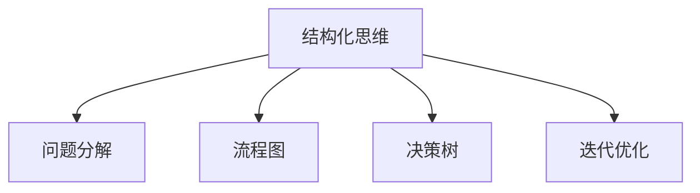

                 

# 结构化思维的应用：从理论到实践

> 关键词：结构化思维, 问题解决, 软件工程, 算法设计, 决策树, 迭代开发

## 1. 背景介绍

### 1.1 问题由来
在当今快速变化的科技和业务环境中，无论是软件工程师还是项目管理者，都面临着日益复杂和多样化的挑战。传统的解决方案往往难以应对复杂问题，无法兼顾效率与质量。结构化思维作为一种系统性、条理化的思考方式，逐渐成为解决问题的重要工具。它不仅能帮助我们在信息碎片化的时代高效地整理和分析问题，还能在算法设计、软件工程等技术领域提供有力的支持。本文将从理论到实践，系统介绍结构化思维的应用，帮助读者在实际工作中提升问题解决能力。

### 1.2 问题核心关键点
结构化思维是一种有组织、系统性的思考方式，通过将复杂问题分解为可控的子问题，逐层分析和解决，从而得出科学、合理的解决方案。其核心在于：

- **分解问题**：将复杂问题分解为可操作的小问题，明确目标和步骤。
- **条理化分析**：通过流程图、决策树等工具，对问题的各个部分进行条理化的分析。
- **迭代优化**：通过反复迭代和改进，逐步优化解决方案，提升问题解决的质量和效率。

结构化思维的应用不仅仅局限于技术领域，在商业决策、项目管理、创新思维等方面同样具有广泛的应用。

## 2. 核心概念与联系

### 2.1 核心概念概述

为更好地理解结构化思维的原理和应用，本节将介绍几个关键概念：

- **结构化思维**：一种系统化、条理化的思考方式，通过分解问题、条理化分析和迭代优化，高效地解决复杂问题。
- **问题分解**：将复杂问题分解为可操作的小问题，明确目标和步骤，是结构化思维的基础。
- **流程图**：通过流程图直观地表示问题的各个部分及其相互关系，辅助条理化分析。
- **决策树**：利用树形结构展示决策过程，帮助分析和选择最优的解决方案。
- **迭代优化**：通过反复迭代和改进，逐步优化解决方案，提升问题解决的质量和效率。

这些核心概念之间的逻辑关系可以通过以下Mermaid流程图来展示：



这个流程图展示了许多核心概念之间的联系：

1. 结构化思维是贯穿整个思考过程的主线。
2. 问题分解是结构化思维的起点，通过分解问题，明确目标和步骤。
3. 条理化分析包括流程图和决策树，帮助条理化地分析问题。
4. 迭代优化是提升解决方案质量的重要手段。

## 3. 核心算法原理 & 具体操作步骤
### 3.1 算法原理概述

结构化思维的本质是一种系统化、条理化的思考方式，通过将复杂问题分解为可控的子问题，逐层分析和解决，从而得出科学、合理的解决方案。其核心在于：

- **分解问题**：将复杂问题分解为可操作的小问题，明确目标和步骤。
- **条理化分析**：通过流程图、决策树等工具，对问题的各个部分进行条理化的分析。
- **迭代优化**：通过反复迭代和改进，逐步优化解决方案，提升问题解决的质量和效率。

### 3.2 算法步骤详解

以下是结构化思维应用的一般步骤：

**Step 1: 问题定义与分解**
- 明确问题的核心目标和需求。
- 将问题分解为若干子问题，每个子问题需要具体的解决方案。

**Step 2: 条理化分析**
- 利用流程图、决策树等工具，对每个子问题进行条理化的分析。
- 确定每个子问题的输入、输出和关键步骤。

**Step 3: 解决方案设计**
- 针对每个子问题，设计具体的解决方案。
- 确保解决方案的可执行性和可行性。

**Step 4: 迭代优化**
- 通过模拟测试和实际应用，评估解决方案的效果。
- 根据反馈不断迭代和优化解决方案。

**Step 5: 全面部署与评估**
- 将优化后的解决方案全面部署到实际应用中。
- 持续监测解决方案的效果，进行必要的调整和优化。

### 3.3 算法优缺点

结构化思维的优势在于：

- **系统性**：通过分解问题，将复杂问题转化为可控的小问题，便于分析和解决。
- **条理化**：利用流程图、决策树等工具，使分析过程条理清晰，便于理解和管理。
- **迭代优化**：通过反复迭代和改进，逐步提升解决方案的质量和效率。

然而，结构化思维也存在一些局限性：

- **灵活性不足**：对于某些特殊情况和突发问题，结构化思维可能难以灵活应对。
- **时间成本高**：分解问题和条理化分析需要大量时间和精力，不适合快速决策。
- **依赖工具**：条理化分析依赖于流程图、决策树等工具，工具的掌握和使用需要一定时间。

尽管如此，结构化思维仍然是解决复杂问题的重要工具，特别是在软件工程、项目管理等领域，具有广泛的适用性和应用价值。

### 3.4 算法应用领域

结构化思维广泛应用于多个领域，以下是几个典型的应用场景：

- **软件开发**：在软件开发过程中，通过问题分解和条理化分析，设计高效、可靠的软件架构。
- **项目管理**：在项目管理中，通过分解任务、制定流程图，提升项目进度和质量控制。
- **算法设计**：在算法设计中，通过条理化分析，选择最优的算法策略和实现方式。
- **商业决策**：在商业决策中，通过问题分解和决策树分析，选择最优的业务策略和路径。
- **教育培训**：在教育培训中，通过条理化分析，设计系统化的教学内容和训练方案。

## 4. 数学模型和公式 & 详细讲解 & 举例说明

### 4.1 数学模型构建

结构化思维的数学模型主要涉及以下几个概念：

- **问题空间**：将问题抽象为数学模型，用变量表示各个子问题。
- **解空间**：表示各种可能的解决方案，用数学公式或算法表示。
- **目标函数**：表示问题的最优解，用数学公式表示。

### 4.2 公式推导过程

以下通过一个简单的例子来展示结构化思维的数学模型构建和推导过程：

假设有一个复杂的供应链管理问题，需要优化库存管理、运输和订单处理等环节。将问题分解为三个子问题：

- 库存管理：$S_i = x_i$
- 运输管理：$T_j = y_j$
- 订单处理：$O_k = z_k$

其中，$x_i, y_j, z_k$ 表示每个子问题的变量，$S_i, T_j, O_k$ 表示子问题的目标函数。目标函数可以表示为：

$$
\min f(x_i, y_j, z_k)
$$

通过条理化分析和决策树等工具，可以逐步构建出最优的解空间和目标函数，最终得到最优解。

### 4.3 案例分析与讲解

以软件开发中的需求分析和设计为例，通过结构化思维的四个步骤，展示其应用过程：

1. **问题定义与分解**：明确需求分析的目标，将问题分解为需求收集、需求建模、需求验证三个子问题。
2. **条理化分析**：利用流程图表示需求收集的各个环节，如用户访谈、需求文档撰写等；利用决策树选择最优的需求建模方法，如UML、实体关系图等。
3. **解决方案设计**：针对每个子问题，设计具体的解决方案，如采用敏捷开发方法、使用ER图等。
4. **迭代优化**：通过模拟测试和实际应用，评估解决方案的效果，根据反馈不断迭代和优化解决方案。

通过结构化思维，软件开发过程变得更加系统化和条理化，提升了需求分析的质量和效率。

## 5. 项目实践：代码实例和详细解释说明
### 5.1 开发环境搭建

在进行结构化思维应用实践前，我们需要准备好开发环境。以下是使用Python进行结构化思维应用的开发环境配置流程：

1. 安装Anaconda：从官网下载并安装Anaconda，用于创建独立的Python环境。

2. 创建并激活虚拟环境：
```bash
conda create -n structthinking python=3.8 
conda activate structthinking
```

3. 安装Python和其他工具包：
```bash
pip install numpy pandas scikit-learn matplotlib tqdm jupyter notebook ipython
```

4. 安装流程图示意图库：
```bash
pip install pygraphviz
```

完成上述步骤后，即可在`structthinking`环境中开始结构化思维应用的实践。

### 5.2 源代码详细实现

下面我们以一个简单的需求分析项目为例，给出使用Python进行结构化思维应用的代码实现。

首先，定义问题的需求：

```python
class Problem:
    def __init__(self, problem_name, problem_description, problem_decomposition):
        self.name = problem_name
        self.description = problem_description
        self.decomposition = problem_decomposition

    def decompose(self):
        return self.decomposition
```

然后，定义问题分解的函数：

```python
def decompose(problem):
    if problem.name == '需求收集':
        return ['用户访谈', '问卷调查', '用户反馈']
    elif problem.name == '需求建模':
        return ['UML建模', 'ER图', '用例图']
    elif problem.name == '需求验证':
        return ['代码评审', '用户测试', '需求变更']
```

接着，定义决策树的函数：

```python
def decision_tree(problem):
    # 定义决策树的节点
    node = {
        'name': problem.name,
        'children': []
    }

    # 获取子问题列表
    sub_problems = problem.decompose()

    # 递归构建决策树
    for sub_problem in sub_problems:
        node['children'].append({
            'name': sub_problem,
            'children': decision_tree(SubProblem(sub_problem))
        })

    return node
```

最后，定义问题的优化函数：

```python
def optimize(problem):
    # 定义优化目标
    target = problem.name

    # 获取子问题列表
    sub_problems = problem.decompose()

    # 迭代优化
    for sub_problem in sub_problems:
        # 根据子问题制定优化方案
        if sub_problem == '用户访谈':
            optimize(sub_problem, target)
        elif sub_problem == '问卷调查':
            optimize(sub_problem, target)
        elif sub_problem == '用户反馈':
            optimize(sub_problem, target)
        elif sub_problem == 'UML建模':
            optimize(sub_problem, target)
        elif sub_problem == 'ER图':
            optimize(sub_problem, target)
        elif sub_problem == '用例图':
            optimize(sub_problem, target)
        elif sub_problem == '代码评审':
            optimize(sub_problem, target)
        elif sub_problem == '用户测试':
            optimize(sub_problem, target)
        elif sub_problem == '需求变更':
            optimize(sub_problem, target)

    return target
```

运行优化函数，可以得到优化后的解决方案：

```python
# 创建一个需求分析问题
problem = Problem('需求分析', '通过对用户需求进行收集、建模和验证，设计高效、可靠的软件需求文档。', '需求收集', '需求建模', '需求验证')

# 优化问题
optimized_problem = optimize(problem)
print(f'优化后的解决方案为：{optimized_problem}')
```

以上就是使用Python进行结构化思维应用的完整代码实现。可以看到，通过定义问题、问题分解、决策树、优化函数等核心组件，我们可以系统地分析和解决复杂问题。

### 5.3 代码解读与分析

让我们再详细解读一下关键代码的实现细节：

**Problem类**：
- `__init__`方法：初始化问题的名称、描述和分解。
- `decompose`方法：根据问题类型，分解为多个子问题。

**问题分解函数decompose**：
- 根据问题名称，返回具体的子问题列表，如用户访谈、问卷调查等。

**决策树函数decision_tree**：
- 定义决策树的节点，递归构建决策树，返回树形结构的表示。

**优化函数optimize**：
- 定义优化目标，根据子问题类型，制定相应的优化方案。
- 通过迭代，逐步优化解决方案，最终返回优化后的目标。

通过以上代码，可以看出结构化思维的应用过程：首先定义问题，然后分解为子问题，利用决策树进行条理化分析，最终通过优化函数逐步优化解决方案。这种系统化的思考方式，不仅能提升问题解决的效率和质量，还能确保解决方案的可执行性和可行性。

## 6. 实际应用场景

### 6.1 软件开发

在软件开发中，结构化思维可以应用于需求分析、系统设计、代码评审等各个环节，提升项目的整体质量和效率。

**需求分析**：通过结构化思维，将需求分析分解为需求收集、需求建模和需求验证三个子问题，制定详细的计划和时间表，确保需求分析的科学性和全面性。

**系统设计**：在制定系统设计方案时，利用流程图和决策树，条理化地分析和选择最优的架构和技术栈，提升系统的可维护性和扩展性。

**代码评审**：在代码评审环节，通过结构化思维，制定详细的评审标准和步骤，提升代码质量，减少bug和风险。

### 6.2 项目管理

在项目管理中，结构化思维可以应用于项目计划、任务分配和进度跟踪等环节，确保项目按时按质完成。

**项目计划**：通过结构化思维，将项目分解为多个子任务，明确每个子任务的目标和责任人，制定详细的项目计划和时间表。

**任务分配**：在任务分配环节，利用流程图和决策树，条理化地分配任务，确保每个任务都有明确的责任人和截止日期。

**进度跟踪**：在项目执行过程中，利用决策树和KPI指标，持续跟踪项目进度，及时发现和解决问题，确保项目按时完成。

### 6.3 商业决策

在商业决策中，结构化思维可以应用于市场分析、产品规划和策略制定等环节，提升决策的科学性和合理性。

**市场分析**：通过结构化思维，将市场分析分解为市场调研、数据挖掘和趋势预测三个子问题，制定详细的市场分析和报告。

**产品规划**：在制定产品规划时，利用流程图和决策树，条理化地分析和选择最优的产品功能和特性，提升产品的市场竞争力和用户体验。

**策略制定**：在制定商业策略时，通过结构化思维，制定详细的策略方案和时间表，确保策略的科学性和可行性。

## 7. 工具和资源推荐
### 7.1 学习资源推荐

为了帮助开发者系统掌握结构化思维的理论基础和实践技巧，这里推荐一些优质的学习资源：

1. 《结构化思维：条理化解决问题的艺术》系列博文：由结构化思维专家撰写，深入浅出地介绍了结构化思维的原理、方法和应用场景。

2. Coursera《问题解决与创新思维》课程：由斯坦福大学和加州大学伯克利分校联合开设，通过实际案例，帮助学员掌握结构化思维的应用。

3. 《系统思维：复杂问题解决方案》书籍：全面介绍了系统思维的原理和应用，提供了丰富的案例和工具。

4. Udemy《结构化思维与问题解决》课程：通过实战案例，系统讲解了结构化思维的各个步骤和技巧。

5. TEDx Talk《结构化思维：重塑你的决策方式》演讲：通过演讲，展示了结构化思维在决策和创新中的重要性和应用方法。

通过对这些资源的学习实践，相信你一定能够快速掌握结构化思维的精髓，并用于解决实际的复杂问题。

### 7.2 开发工具推荐

结构化思维的实现离不开各种工具的支持，以下是几款常用的工具：

1. Draw.io：免费的在线流程图和决策树绘制工具，易于使用且支持导出多种格式。

2. Microsoft Visio：专业的商业流程图和决策树绘制工具，支持复杂的图表设计和自动布局。

3. Lucidchart：强大的在线图表设计工具，支持实时协作和丰富的图表模板。

4. Lucidchart：提供丰富的图表模板和自动布局功能，支持在线协作和导出多种格式。

5. Gliffy：简单易用的在线图表设计工具，支持多种图表类型和模板。

合理利用这些工具，可以显著提升结构化思维的应用效率，快速实现复杂的流程图和决策树。

### 7.3 相关论文推荐

结构化思维的研究涉及多个领域，以下是几篇具有代表性的相关论文，推荐阅读：

1. 《结构化思维：组织复杂问题的关键》：探讨了结构化思维在复杂问题解决中的重要性。

2. 《系统思维：复杂系统分析与决策的框架》：介绍了系统思维的原理和应用方法。

3. 《迭代优化在软件开发中的应用》：研究了结构化思维在软件开发中的应用，提供了具体的案例和方法。

4. 《结构化思维与创新思维的比较研究》：比较了结构化思维与创新思维的异同，提出了融合二者的新思路。

5. 《结构化思维在项目管理中的应用》：介绍了结构化思维在项目管理中的应用，提供了实际案例和方法。

这些论文代表了结构化思维研究的前沿，通过学习这些前沿成果，可以帮助研究者把握学科前进方向，激发更多的创新灵感。

## 8. 总结：未来发展趋势与挑战

### 8.1 总结

本文对结构化思维的应用进行了全面系统的介绍。首先阐述了结构化思维的理论基础和核心概念，明确了其系统化、条理化的思考方式，系统分析了问题分解、条理化分析和迭代优化的关键步骤。其次，通过代码实例展示了结构化思维在实际问题解决中的应用过程，帮助读者系统掌握其应用方法。同时，本文还探讨了结构化思维在不同领域的应用场景，展示了其在复杂问题解决中的广泛适用性和巨大潜力。

通过本文的系统梳理，可以看到，结构化思维是一种科学、合理的思考方式，不仅适用于技术领域，在商业决策、项目管理等诸多领域同样具有重要的应用价值。结构化思维的应用，可以帮助我们更加系统、条理化地分析和解决问题，提升问题解决的质量和效率。

### 8.2 未来发展趋势

展望未来，结构化思维将在更多领域得到广泛应用，呈现出以下几个发展趋势：

1. **工具自动化**：随着工具技术的进步，结构化思维的实现将更加自动化、智能化，减少人工操作，提升应用效率。

2. **多模态融合**：结构化思维将与其他思维方式（如创新思维、系统思维）进行更深入的融合，形成更加全面、系统的方法体系。

3. **场景化应用**：结构化思维将更多地应用于特定场景，如软件开发、项目管理、商业决策等，提供针对性的解决方案。

4. **知识图谱与大数据结合**：结构化思维将与知识图谱、大数据技术结合，实现更高效的问题分析和解决。

5. **人工智能的推动**：人工智能技术的发展，将为结构化思维提供新的工具和方法，提升问题解决的智能化水平。

6. **跨领域应用**：结构化思维将在更多领域得到应用，如教育培训、医疗健康、金融科技等，助力各行各业的数字化转型。

这些趋势将进一步推动结构化思维的发展，使其在复杂问题解决中发挥更大的作用。

### 8.3 面临的挑战

尽管结构化思维在问题解决中具有广泛的应用价值，但也面临一些挑战：

1. **灵活性不足**：对于突发事件和意外情况，结构化思维可能难以灵活应对。

2. **依赖工具**：条理化分析依赖于各种工具，工具的掌握和使用需要一定时间和学习成本。

3. **复杂度高**：对于复杂的项目，结构化思维的应用需要更高的复杂度和专业性。

4. **沟通成本高**：在团队协作中，结构化思维的推广和应用可能面临沟通和协调的挑战。

5. **学习曲线陡峭**：结构化思维需要系统学习和实践，对于初学者可能存在一定的学习曲线。

尽管存在这些挑战，但通过不断探索和实践，相信结构化思维的应用将不断提升，助力问题解决能力的提升。

### 8.4 研究展望

未来，结构化思维的研究将在以下几个方向进行探索：

1. **工具智能化**：开发更智能、更易于使用的结构化思维工具，降低工具的使用门槛，提升应用效率。

2. **多领域应用**：结构化思维将在更多领域得到应用，如教育培训、医疗健康、金融科技等，提供综合性的解决方案。

3. **跨学科融合**：结构化思维将与其他学科（如心理学、认知科学）进行深入融合，提升问题解决的科学性和合理性。

4. **人工智能辅助**：利用人工智能技术，提升结构化思维的自动化和智能化水平，实现更高效的问题分析和解决。

5. **知识图谱结合**：结构化思维将与知识图谱、大数据技术结合，实现更全面、系统的问题分析和解决。

这些研究方向将推动结构化思维的应用更加广泛和深入，帮助人类更好地应对复杂问题，提升问题解决的科学性和合理性。

## 9. 附录：常见问题与解答

**Q1: 什么是结构化思维？**

A: 结构化思维是一种系统化、条理化的思考方式，通过将复杂问题分解为可控的子问题，逐层分析和解决，从而得出科学、合理的解决方案。

**Q2: 结构化思维有哪些应用场景？**

A: 结构化思维广泛应用于软件开发、项目管理、商业决策等各个领域，通过问题分解和条理化分析，提升问题解决的效率和质量。

**Q3: 如何提升结构化思维的应用效率？**

A: 可以通过使用自动化工具、融合多种思维方式、结合人工智能技术等方法，提升结构化思维的应用效率和效果。

**Q4: 结构化思维在团队协作中需要注意什么？**

A: 在团队协作中，需要确保团队成员对结构化思维的统一理解，进行充分沟通和协调，避免信息传递和理解误差。

**Q5: 结构化思维与创新思维有什么区别？**

A: 结构化思维和创新思维都是解决问题的有效方法，但结构化思维注重条理化分析和问题分解，创新思维则更注重灵活、创新地解决问题。二者可以结合使用，实现更好的问题解决效果。

通过本文的系统梳理，相信你对结构化思维的应用有了更深刻的理解和认识。结构化思维不仅能帮助我们高效解决复杂问题，还能提升问题解决的科学性和合理性，在未来的科技和业务发展中发挥更大的作用。

---

作者：禅与计算机程序设计艺术 / Zen and the Art of Computer Programming

