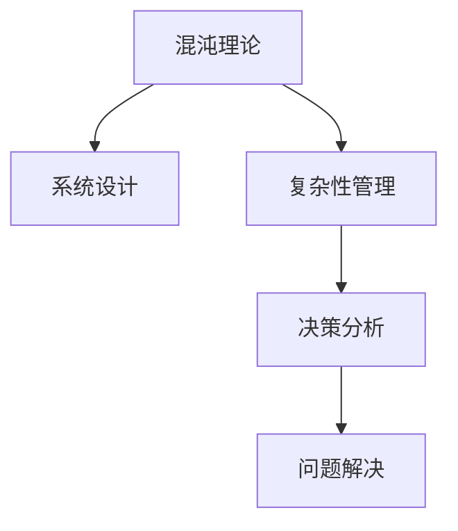

                 

# 结构化思维：从混沌到秩序

> 关键词：结构化思维,混沌理论,系统设计,复杂性管理,决策分析,问题解决

## 1. 背景介绍

在现代社会，信息爆炸和技术迭代使人们面对的问题日益复杂。如何在这混沌的万象中厘清思路，找到解决问题的方法？结构化思维作为一种系统化的思维方式，能够帮助我们在复杂情境中整理和分析信息，找到有效的解决路径。本文将深入探讨结构化思维的原理与实践，揭示其如何在复杂系统中寻求秩序与优化。

### 1.1 问题的由来

随着信息化社会的深入，日常工作和生活中的决策难度与日俱增。无论是企业战略规划、产品设计还是个人生活管理，都需要我们面对大量且相互交织的信息，进行复杂的决策。然而，传统的直觉和经验往往在面对大规模复杂问题时显得力不从心。

结构化思维正是应此需求而生。通过运用系统化、逻辑化的方式来审视问题，整理信息，进行决策，结构化思维帮助我们在混沌中寻找秩序，从而提升决策的科学性和准确性。

### 1.2 问题核心关键点

结构化思维的核心在于它能够将复杂问题拆分为可管理的模块，并运用科学方法对其进行分析和解决。关键点包括：
- **问题定义**：明确问题的边界和目标。
- **信息整理**：收集和整理相关数据和信息。
- **因果分析**：识别问题的根本原因和影响因素。
- **方案制定**：提出并评估多种可能的解决方案。
- **决策实施**：实施最优方案，并持续监测和调整。

结构化思维的关键在于将混沌复杂的问题转化为有序可控的模块，通过分析与处理，最终找到解决问题的有效路径。

## 2. 核心概念与联系

### 2.1 核心概念概述

为更好地理解结构化思维，我们首先梳理几个核心概念：

- **混沌理论**：研究复杂系统行为及其演化规律的科学，揭示了复杂系统的不确定性和非线性特征。
- **系统设计**：通过分解、整合和优化系统组件，构建稳定、高效的系统模型。
- **复杂性管理**：识别、理解和管理复杂系统中动态变化的行为和关系。
- **决策分析**：使用数据、模型和算法辅助决策，提升决策的质量和效率。
- **问题解决**：系统性、结构化地处理和解决实际问题，提升问题解决的有效性。

这些概念之间的关系可以通过以下Mermaid流程图来展示：



这个流程图展示了混沌理论与系统设计之间的逻辑联系，复杂性管理和决策分析作为桥梁，最终达到问题解决的目标。

## 3. 核心算法原理 & 具体操作步骤
### 3.1 算法原理概述

结构化思维的算法原理，主要基于以下逻辑框架：

- **问题定义**：定义问题的边界和目标，即明确"是什么"和"为什么"。
- **信息整理**：收集和整理相关数据和信息，即明确"有什么"。
- **因果分析**：识别问题的根本原因和影响因素，即明确"为什么会"。
- **方案制定**：提出并评估多种可能的解决方案，即明确"怎么做"。
- **决策实施**：实施最优方案，并持续监测和调整，即明确"如何执行"。

通过这五个步骤的递进分析，结构化思维能够将复杂的决策过程系统化、逻辑化，从而提升决策的有效性。

### 3.2 算法步骤详解

具体来说，结构化思维的算法步骤如下：

**Step 1: 问题定义**

- 明确问题的主要目标和范围。
- 确定问题的关键影响因素和评估标准。

**Step 2: 信息整理**

- 收集和整理相关数据和信息。
- 分析数据和信息的可靠性和相关性。

**Step 3: 因果分析**

- 识别问题的根本原因和影响因素。
- 分析这些因素之间的相互作用关系。

**Step 4: 方案制定**

- 提出多种可能的解决方案。
- 对解决方案进行评估和排序。

**Step 5: 决策实施**

- 选择最优方案并实施。
- 持续监测和调整方案执行过程。

通过这五个步骤，结构化思维能够系统地处理和解决复杂问题。

### 3.3 算法优缺点

结构化思维的主要优点包括：
- **系统化**：通过分解问题为可管理的模块，提升决策的系统性和可控性。
- **科学化**：基于数据和逻辑分析，提升决策的科学性和准确性。
- **高效化**：通过优化决策流程，提高决策的速度和效率。

同时，结构化思维也存在一些局限性：
- **僵化**：过分依赖步骤和流程，可能导致灵活性不足。
- **复杂**：在处理极度复杂的系统时，可能需要大量的信息和计算资源。
- **主观性**：在问题定义和方案评估中，主观判断和直觉的成分仍然不可忽视。

尽管存在这些局限性，但总体而言，结构化思维为复杂问题的处理提供了一种行之有效的方法论。

### 3.4 算法应用领域

结构化思维广泛应用于多个领域，包括但不限于：

- **项目管理**：通过系统化的方法管理项目进度、资源和风险。
- **产品设计**：分析用户需求，设计功能和技术方案，进行迭代优化。
- **金融决策**：基于数据和模型分析市场变化，制定投资策略。
- **战略规划**：通过系统分析环境因素和内部条件，制定长远发展计划。
- **医疗诊断**：识别和分析疾病症状，制定个性化治疗方案。
- **安全管理**：分析系统漏洞和风险因素，制定预防和应对措施。

在每个领域中，结构化思维都能通过系统化的方法，提升决策的科学性和效率。

## 4. 数学模型和公式 & 详细讲解  
### 4.1 数学模型构建

结构化思维的数学模型构建，主要基于以下公式：

$$
\text{目标} = \text{问题定义} + \text{信息整理} + \text{因果分析} + \text{方案制定} + \text{决策实施}
$$

**目标**：明确解决问题的最终目的和评估标准。
**问题定义**：通过"是什么"和"为什么"来描述问题的本质。
**信息整理**：通过"有什么"来收集和分析相关数据。
**因果分析**：通过"为什么会"来识别问题的根本原因和影响因素。
**方案制定**：通过"怎么做"来提出和评估多种解决方案。
**决策实施**：通过"如何执行"来选择和调整最优方案。

### 4.2 公式推导过程

以金融投资决策为例，我们将上述五个步骤转化为数学公式进行推导：

1. **目标**：设投资收益率为$R$，评估标准为年化收益率。
2. **问题定义**：问题为如何最大化投资收益。
3. **信息整理**：收集市场数据$D$、行业分析报告$A$等。
4. **因果分析**：识别影响收益的关键因素，如市场波动、行业趋势等。
5. **方案制定**：提出多样化投资组合方案，如股票、债券、期货等。
6. **决策实施**：选择最优投资组合并持续监测市场变化，进行动态调整。

通过数学模型，我们可以将复杂决策过程转化为可操作的步骤，从而提升决策的科学性和可控性。

### 4.3 案例分析与讲解

下面以一家公司的产品开发流程为例，详细讲解结构化思维的应用：

**背景**：一家公司准备开发一款新的智能家居设备，需要进行全面的市场调研和产品设计。

**步骤**：
1. **问题定义**：目标为开发一款具有市场竞争力的智能家居设备。
2. **信息整理**：收集市场数据、用户调研报告、技术现状等。
3. **因果分析**：识别市场需求、技术瓶颈、成本控制等因素。
4. **方案制定**：提出多样化产品设计方案，如设备功能、外观设计等。
5. **决策实施**：选择最优设计方案并实施，持续监测市场反馈进行优化。

通过结构化思维，该公司能够系统地处理复杂问题，提升决策的科学性和效率。

## 5. 项目实践：代码实例和详细解释说明
### 5.1 开发环境搭建

结构化思维的实践需要一定的计算资源和工具支持。以下是使用Python进行结构化思维的实践环境配置流程：

1. 安装Anaconda：从官网下载并安装Anaconda，用于创建独立的Python环境。

2. 创建并激活虚拟环境：
```bash
conda create -n structthinking python=3.8 
conda activate structthinking
```

3. 安装相关库：
```bash
pip install pandas numpy matplotlib scikit-learn statsmodels
```

完成上述步骤后，即可在`structthinking`环境中开始结构化思维的实践。

### 5.2 源代码详细实现

下面以金融投资决策为例，使用Python实现结构化思维的步骤：

```python
import pandas as pd
import numpy as np
from sklearn.linear_model import LinearRegression
from sklearn.metrics import mean_squared_error

# 步骤1：问题定义
target = 'Yearly Return Rate'
evaluation_criteria = 'Annualized Return Rate'

# 步骤2：信息整理
market_data = pd.read_csv('market_data.csv')
industry_report = pd.read_csv('industry_report.csv')

# 步骤3：因果分析
features = market_data[['Market Volume', 'Industry Trend', 'Economic Growth']]
causal_factors = industry_report['Key Factors']

# 步骤4：方案制定
portfolio = pd.DataFrame({
    'Asset Type': ['Stock', 'Bond', 'Commodity'],
    'Allocation': [30, 40, 30],
    'Expected Return': [10, 5, 2],
    'Volatility': [15, 8, 10]
})

# 步骤5：决策实施
def optimize_portfolio(data, target, features, causal_factors, portfolio):
    # 构建线性回归模型
    model = LinearRegression()
    model.fit(features, target)
    
    # 预测最优资产配置
    predicted_portfolio = model.predict(portfolio)
    
    # 评估预测结果
    mse = mean_squared_error(target, predicted_portfolio)
    return mse, predicted_portfolio

mse, optimal_portfolio = optimize_portfolio(market_data, target, features, causal_factors, portfolio)
print(f'年度收益率预测误差为 {mse:.2f}')
print(f'最优资产配置为：{optimal_portfolio}')
```

### 5.3 代码解读与分析

让我们再详细解读一下关键代码的实现细节：

**目标和评估标准**：
- `target`：定义投资收益率作为目标。
- `evaluation_criteria`：定义年化收益率作为评估标准。

**数据整理**：
- `market_data`和`industry_report`：分别从市场数据和行业报告中提取相关特征和因素。

**因果分析**：
- `features`：从市场数据中提取关键特征，如市场波动率、行业趋势等。
- `causal_factors`：从行业报告中提取关键因素，如政策变化、技术创新等。

**方案制定**：
- `portfolio`：定义多种可能的资产配置方案，包括资产类型、配置比例、预期收益率和波动率。

**决策实施**：
- `optimize_portfolio`函数：使用线性回归模型预测最优资产配置，并评估预测误差。

**运行结果展示**：
- 输出年度收益率预测误差和最优资产配置结果。

可以看到，通过上述代码，我们实现了结构化思维在金融投资决策中的应用。通过系统化的步骤和方法，我们能够更好地处理复杂问题，提升决策的科学性和效率。

## 6. 实际应用场景
### 6.1 项目管理

结构化思维在项目管理中广泛应用于任务分解、资源规划、进度跟踪等方面。通过系统化的项目管理流程，可以提升项目的执行效率和成功率。

### 6.2 产品设计

在产品设计中，结构化思维能够帮助识别用户需求，分析技术可行性，制定详细的产品方案。通过系统化的方法，可以提升产品的创新性和市场竞争力。

### 6.3 金融决策

金融决策中，结构化思维能够帮助识别市场趋势，评估风险因素，制定投资策略。通过科学化的分析方法，可以提升投资决策的准确性和效益。

### 6.4 安全管理

在安全管理中，结构化思维能够识别系统漏洞，分析风险因素，制定预防和应对措施。通过系统化的安全管理流程，可以提升系统的稳定性和安全性。

### 6.5 医疗诊断

在医疗诊断中，结构化思维能够帮助识别疾病症状，分析病因，制定个性化治疗方案。通过系统化的诊断流程，可以提升诊断的准确性和治疗效果。

## 7. 工具和资源推荐
### 7.1 学习资源推荐

为了帮助开发者系统掌握结构化思维的理论基础和实践技巧，这里推荐一些优质的学习资源：

1. **《结构化思维：如何系统解决复杂问题》**：系统讲解结构化思维的基本原理和操作步骤，提供实际案例分析。

2. **Coursera《系统思考与复杂性管理》课程**：系统讲解系统思维的基本概念和应用方法，提供实际案例分析。

3. **Udemy《结构化思维训练营》**：提供系统化的结构化思维训练课程，帮助用户提升问题解决能力。

4. **StructThinking官网**：提供系统思维的工具、教程和资源，帮助用户系统掌握结构化思维。

通过对这些资源的学习实践，相信你一定能够快速掌握结构化思维的精髓，并用于解决实际的复杂问题。

### 7.2 开发工具推荐

高效的开发离不开优秀的工具支持。以下是几款用于结构化思维开发的常用工具：

1. **Anaconda**：用于创建和管理Python环境的工具，方便快速搭建开发环境。

2. **Jupyter Notebook**：提供交互式编程环境，支持代码、文本和图表的混合展示，方便分析和解释数据。

3. **Python**：强大的编程语言，支持丰富的科学计算和数据分析库。

4. **Pandas**：数据处理和分析库，支持数据的导入、清洗、分析和可视化。

5. **NumPy**：数值计算库，支持高效的矩阵运算和数值计算。

6. **Scikit-learn**：机器学习库，支持多种机器学习算法的实现和评估。

7. **Matplotlib**：数据可视化库，支持多种图表的绘制和展示。

合理利用这些工具，可以显著提升结构化思维的开发效率，加快创新迭代的步伐。

### 7.3 相关论文推荐

结构化思维的研究源于学界的持续研究。以下是几篇奠基性的相关论文，推荐阅读：

1. **《系统思考：一种管理复杂性的方法》**：系统讲解系统思考的基本原理和应用方法。

2. **《结构化问题解决：一种科学的方法论》**：系统讲解结构化思维的基本原理和操作步骤。

3. **《复杂系统的结构化思维：一种新范式》**：探讨复杂系统中的结构化思维应用。

这些论文代表了大规模语料的预训练模型的发展脉络。通过学习这些前沿成果，可以帮助研究者把握学科前进方向，激发更多的创新灵感。

## 8. 总结：未来发展趋势与挑战

### 8.1 总结

本文对结构化思维的原理与实践进行了全面系统的介绍。首先阐述了结构化思维的背景和意义，明确了其在处理复杂问题中的独特价值。其次，从原理到实践，详细讲解了结构化思维的数学模型和操作步骤，给出了结构化思维任务开发的完整代码实例。同时，本文还广泛探讨了结构化思维在多个行业领域的应用前景，展示了其巨大的潜力。此外，本文精选了结构化思维的技术资源，力求为读者提供全方位的技术指引。

通过本文的系统梳理，可以看到，结构化思维在处理复杂问题时发挥了重要作用，为决策提供了一种系统化、科学化的方式。未来，伴随结构化思维的不断演进和优化，必将在更多领域中发挥更加广泛的应用，为复杂系统提供更加高效、精准的问题解决方案。

### 8.2 未来发展趋势

展望未来，结构化思维将呈现以下几个发展趋势：

1. **模型复杂度提升**：随着技术的发展，结构化思维将能处理更复杂的系统问题。通过更高级的模型和算法，结构化思维将能够更好地理解和处理复杂系统。

2. **数据自动化处理**：结构化思维将结合自动化数据处理技术，进一步提升数据处理的效率和准确性。通过数据挖掘、机器学习等技术，结构化思维将能更快速地从大量数据中提取有价值的信息。

3. **跨学科融合**：结构化思维将与其他学科领域进行更深入的融合，如人工智能、心理学、经济学等。通过跨学科的整合，结构化思维将能更全面地处理复杂问题，提升决策的科学性和可靠性。

4. **实时化应用**：结构化思维将能够实时处理动态变化的信息，提供即时的决策支持。通过实时数据处理和动态优化，结构化思维将能更有效地应对突发事件和变化。

5. **人机协同**：结构化思维将结合人工智能技术，提升人机协同的效率和效果。通过智能算法和自然语言处理技术，结构化思维将能更好地理解用户需求，提供个性化的解决方案。

以上趋势凸显了结构化思维的广阔前景。这些方向的探索发展，必将进一步提升结构化思维的灵活性和科学性，为复杂系统提供更加精准、高效的问题解决方案。

### 8.3 面临的挑战

尽管结构化思维已经取得了瞩目成就，但在迈向更加智能化、普适化应用的过程中，它仍面临着诸多挑战：

1. **数据质量问题**：结构化思维对数据的质量和完整性有较高要求。在处理大规模复杂数据时，如何确保数据的质量和一致性，仍然是一大难题。

2. **复杂性管理**：结构化思维在处理极度复杂的系统时，可能需要更多的专家知识和经验。如何在系统设计和优化中融入更多领域专家的知识，将是重要的研究方向。

3. **计算资源限制**：结构化思维在处理复杂问题时，需要大量的计算资源。如何在有限的计算资源下，高效处理和优化复杂系统，仍然是一个挑战。

4. **方法论适用性**：结构化思维在一些特定领域，如医学、法律等，可能面临适用性不足的问题。如何在特定领域中应用结构化思维，仍需进行大量的研究和实践。

5. **人机交互**：在结构化思维中，如何实现更加高效、自然的人机交互，提升用户体验，仍然是一大难题。

6. **伦理和安全**：结构化思维在处理敏感信息时，需要考虑伦理和安全问题。如何在保障数据隐私和安全的前提下，提供有效的决策支持，将是重要的研究方向。

尽管存在这些挑战，但通过学界和产业界的共同努力，相信结构化思维必将在未来不断优化和演进，为复杂系统提供更加可靠、高效的问题解决方案。

### 8.4 研究展望

面对结构化思维面临的挑战，未来的研究需要在以下几个方面寻求新的突破：

1. **自动化数据处理**：开发更高效、智能的数据处理技术，提升数据质量和处理速度。

2. **跨学科融合**：结合人工智能、心理学、经济学等学科，提升结构化思维的科学性和可靠性。

3. **实时化处理**：开发实时数据处理和动态优化技术，提升结构化思维的实时性。

4. **人机协同**：结合自然语言处理和智能算法，提升结构化思维的人机交互效果。

5. **伦理和安全**：制定数据隐私和安全的法律法规，确保结构化思维的伦理和安全。

这些研究方向的探索，必将引领结构化思维技术迈向更高的台阶，为复杂系统提供更加精准、高效的问题解决方案。

## 9. 附录：常见问题与解答

**Q1：结构化思维是否适用于所有领域？**

A: 结构化思维在大多数领域都能取得不错的效果，但对于一些特定领域，如医学、法律等，需要结合领域专家知识进行优化。此外，对于一些需要高度个性化和即时性决策的场景，结构化思维的适用性也需进一步验证。

**Q2：如何选择合适的结构化思维步骤？**

A: 结构化思维的步骤选择应根据具体问题的复杂度和需求进行灵活调整。一般来说，问题定义和信息整理是基础步骤，因果分析和方案制定是核心步骤，决策实施是关键步骤。对于某些复杂问题，可能需要更多步骤或特殊步骤进行优化。

**Q3：结构化思维能否结合其他技术手段？**

A: 结构化思维可以与其他技术手段结合，如数据挖掘、机器学习、人工智能等，提升问题解决的科学性和高效性。结合多种技术手段，结构化思维将能更全面、系统地处理复杂问题。

**Q4：结构化思维在实施过程中需要注意哪些问题？**

A: 结构化思维在实施过程中需要注意数据质量、计算资源、人机交互等多个方面。数据质量是基础，计算资源是保障，人机交互是效果。只有在这些环节进行全面优化，才能充分发挥结构化思维的优势。

**Q5：结构化思维的未来趋势和应用前景如何？**

A: 结构化思维的未来趋势和应用前景广阔。随着技术的不断演进和优化，结构化思维将能够处理更加复杂的系统问题，结合多种技术手段，提升决策的科学性和高效性。结构化思维在金融、医疗、安全等关键领域的应用前景广阔，将为复杂系统提供更加精准、高效的问题解决方案。

---

作者：禅与计算机程序设计艺术 / Zen and the Art of Computer Programming

