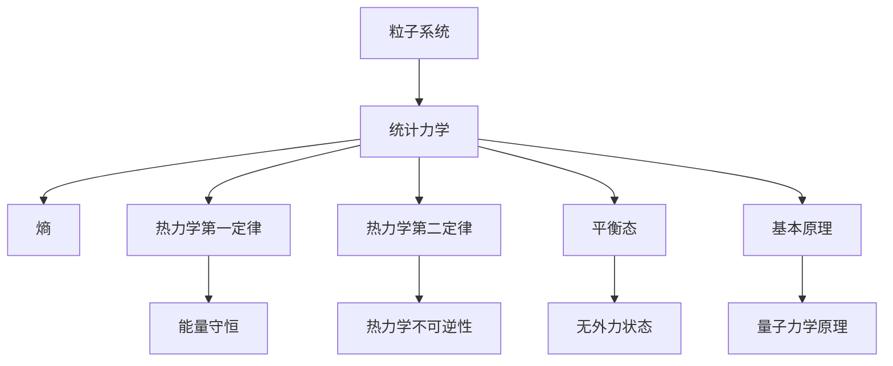

                 

# 统计力学与相互作用粒子系统

> 关键词：统计力学, 粒子系统, 相互作用, 熵, 宏观与微观, 基本原理

## 1. 背景介绍

### 1.1 问题由来
统计力学是一门研究大量粒子系统行为及宏观性质的物理学分支。它通过描述微观粒子之间的相互作用以及其统计行为，从而揭示宏观物态的性质。统计力学是物理学的核心，它不仅在基础物理学中占据重要地位，在工程学、化学、材料科学等领域也有广泛应用。

本文将系统介绍统计力学中粒子的相互作用以及统计行为，并探讨这些原理在现代科技中的应用，包括量子计算、纳米技术、生物信息学等领域。我们希望通过本文的学习，能够帮助读者理解和掌握统计力学的基本概念和应用，从而为未来的研究和实践奠定基础。

### 1.2 问题核心关键点
统计力学研究的核心是大量粒子系统在宏观和微观层面的行为。具体而言，它的关注点包括：
- 微观粒子的运动与相互作用规律。
- 系统的统计性质，如熵、温度、压强等宏观物理量。
- 系统的平衡状态和热力学性质。
- 非平衡态下的动力学过程。
- 统计力学基本原理和应用。

这些关键点构成了统计力学的核心，也决定了大语言模型微调的研究方向。通过理解和应用这些关键点，我们可以更好地理解并解决实际问题。

## 2. 核心概念与联系

### 2.1 核心概念概述

为更好地理解统计力学中粒子的相互作用以及统计行为，本节将介绍几个密切相关的核心概念：

- 粒子系统(Particle System)：由大量微观粒子组成的系统，这些粒子间存在相互作用。
- 统计力学(Statistical Mechanics)：通过描述粒子系统的统计性质，揭示宏观物态的性质。
- 熵(Entropy)：系统的混乱度，反映了系统的无序程度。
- 基本原理(Fundamental Principles)：包括量子力学原理、热力学第一定律、热力学第二定律等，构成了统计力学的基础。
- 平衡态(Equilibrium State)：系统在宏观和微观层面均满足统计力学的基本原理，表现为无外力作用下的稳定状态。

这些核心概念之间的逻辑关系可以通过以下Mermaid流程图来展示：



这个流程图展示了几大核心概念之间的联系：

1. 粒子系统是统计力学的研究对象，熵是描述粒子系统状态的一个量。
2. 热力学第一定律和热力学第二定律是统计力学的重要原理，熵是这两个定律的桥梁。
3. 平衡态是统计力学中理想的状态，满足热力学第一和第二定律。
4. 基本原理是统计力学的核心，包括量子力学原理、热力学定律等。

这些概念共同构成了统计力学的基础，并指导着其在现代科技中的应用。

## 3. 核心算法原理 & 具体操作步骤

### 3.1 算法原理概述

统计力学的核心在于研究大量粒子系统的宏观行为，通过这些行为揭示系统的无序和有序状态。其核心算法原理包括以下几个方面：

1. **微观粒子模型**：构建粒子的运动模型，描述粒子间的相互作用，如势能函数、动能方程等。

2. **统计分布**：通过粒子运动模型，推导出粒子的统计分布，如玻色-爱因斯坦分布、费米-狄拉克分布等。

3. **熵函数**：根据统计分布，推导出系统的熵函数，揭示系统的混乱度。

4. **热力学定律**：推导出热力学第一和第二定律，揭示系统的能量守恒和不可逆性。

5. **平衡态**：通过热力学定律和熵函数，研究系统的平衡状态，揭示系统的无序和有序状态。

### 3.2 算法步骤详解

统计力学的核心算法步骤主要包括以下几个环节：

1. **构建粒子模型**：根据粒子的性质和相互作用的规律，构建粒子的运动模型。这一步是统计力学的基础，需要结合物理实验和理论推导。

2. **推导统计分布**：根据粒子的运动模型，推导出粒子的统计分布函数。这一步需要结合量子力学等理论基础，有时也需要数值模拟。

3. **计算熵函数**：根据统计分布函数，计算系统的熵函数。这一步需要使用积分等数学工具，有时也需要数值计算。

4. **研究热力学定律**：根据熵函数，推导出热力学第一和第二定律。这一步需要结合数学工具和物理直觉，有时也需要理论推导。

5. **研究平衡态**：根据热力学定律和熵函数，研究系统的平衡状态，揭示系统的无序和有序状态。这一步需要结合数学工具和物理直觉，有时也需要理论推导。

### 3.3 算法优缺点

统计力学的核心算法具有以下优点：

1. **物理直观**：统计力学通过描述粒子的微观行为，揭示系统的宏观性质，物理直观性较强。

2. **应用广泛**：统计力学是物理学和工程学的重要工具，广泛应用于化学、材料科学、量子计算等领域。

3. **数学工具丰富**：统计力学涉及概率论、微积分、积分等多种数学工具，能够处理复杂问题。

4. **理论基础坚实**：统计力学建立在经典力学和量子力学等理论基础之上，理论基础坚实。

5. **现实指导性**：统计力学的研究成果可以指导实际应用，如纳米技术、生物信息学等。

同时，该算法也存在一些局限性：

1. **复杂度高**：统计力学涉及大量粒子的相互作用和统计分布，计算复杂度较高。

2. **实验难度大**：统计力学需要大量的实验数据和理论推导，实验难度较大。

3. **模型假设多**：统计力学需要假设粒子的性质和相互作用规律，有时难以满足实际情况。

4. **理论难度大**：统计力学涉及复杂的数学和物理理论，理解难度较大。

尽管存在这些局限性，但统计力学仍然是物理学和工程学的重要工具，其研究成果在现代科技中有着广泛的应用。

### 3.4 算法应用领域

统计力学的核心算法主要应用于以下几个领域：

1. **量子计算**：统计力学是量子计算的理论基础，通过描述量子粒子的相互作用和统计分布，揭示量子系统的宏观性质。

2. **纳米技术**：统计力学可以描述纳米材料中原子、分子的行为，为纳米技术的发展提供理论指导。

3. **生物信息学**：统计力学可以描述生物分子中的原子、分子之间的相互作用，为生物信息学提供理论基础。

4. **材料科学**：统计力学可以描述材料中的微观粒子行为，揭示材料的物理性质和性能。

5. **化学**：统计力学可以描述化学反应中的原子、分子之间的相互作用，为化学研究提供理论指导。

除了上述这些领域外，统计力学还被广泛应用于物理学、工程学、经济学等多个领域，为相关学科的发展提供了理论支持。

## 4. 数学模型和公式 & 详细讲解 & 举例说明

### 4.1 数学模型构建

本节将使用数学语言对统计力学中粒子的相互作用以及统计行为进行更加严格的刻画。

记一个粒子系统的粒子数为 $N$，粒子的位置坐标为 $x_1,x_2,\cdots,x_N$。设粒子的势能为 $V(x_1,x_2,\cdots,x_N)$，粒子的动能函数为 $K(x_1,x_2,\cdots,x_N)$。则系统的总能量 $E$ 为：

$$ E = \sum_{i=1}^N V(x_i) + \sum_{i=1}^N K(x_i) $$

系统的熵 $S$ 定义为粒子分布的归一化因子，具体表达式为：

$$ S = -\frac{1}{N} \log Z $$

其中 $Z$ 为配分函数，定义为：

$$ Z = \int \exp(-\beta H(x)) \prod_{i=1}^N dx_i $$

其中 $H(x)$ 为系统的哈密顿量，定义为：

$$ H(x) = \sum_{i=1}^N \left[ \frac{K(x_i)}{2} + V(x_i) \right] $$

$\beta$ 为玻尔兹曼常数。

### 4.2 公式推导过程

以下我们以单粒子系统的统计力学为例，推导熵函数的表达式。

设粒子在 $x$ 处的概率密度函数为 $f(x)$，则系统的熵函数 $S$ 为：

$$ S = -\int \left[ f(x) \log f(x) \right] dx $$

根据玻尔兹曼分布，粒子在 $x$ 处的概率密度函数为：

$$ f(x) = \frac{e^{-\beta V(x)}}{\int e^{-\beta V(x')} dx'} $$

将 $f(x)$ 代入熵函数表达式中，得：

$$ S = -\int \frac{e^{-\beta V(x)}}{\int e^{-\beta V(x')} dx'} \log \frac{e^{-\beta V(x)}}{\int e^{-\beta V(x')} dx'} dx $$

化简后得：

$$ S = \beta \int e^{-\beta V(x)} \log \int e^{-\beta V(x')} dx' dx $$

令 $H(x) = \frac{K(x)}{2} + V(x)$，则上式可进一步简化为：

$$ S = \beta \int e^{-\beta H(x)} dx $$

这个式子即为单粒子系统的熵函数表达式。从中可以看出，熵函数与系统的哈密顿量 $H(x)$ 密切相关，体现了系统的无序程度。

### 4.3 案例分析与讲解

在实际应用中，熵函数具有广泛的应用。以下以“熵增原理”为例，进行详细分析。

熵增原理是统计力学中的一个重要概念，它描述了封闭系统的熵随时间的变化趋势。熵增原理可以表述为：

- 在孤立系统中，熵总是增加的。

这个原理在热力学中有重要的应用。例如，熵增原理可以解释热力学第二定律，即热量不会自发从低温物体转移到高温物体。

熵增原理的核心在于系统的熵总是增加的，这是由于粒子系统总是趋向于无序状态，熵越大，系统的无序程度越高。

## 5. 项目实践：代码实例和详细解释说明

### 5.1 开发环境搭建

在进行统计力学实践前，我们需要准备好开发环境。以下是使用Python进行Numpy和Scipy开发的开发环境配置流程：

1. 安装Anaconda：从官网下载并安装Anaconda，用于创建独立的Python环境。

2. 创建并激活虚拟环境：
```bash
conda create -n physics-env python=3.8 
conda activate physics-env
```

3. 安装NumPy和SciPy：
```bash
conda install numpy scipy
```

4. 安装各类工具包：
```bash
pip install matplotlib sympy sympy-physics simulations
```

完成上述步骤后，即可在`physics-env`环境中开始统计力学的实践。

### 5.2 源代码详细实现

这里我们以玻色-爱因斯坦分布为例，给出使用SciPy库进行统计力学计算的Python代码实现。

首先，定义统计力学中的玻色-爱因斯坦分布：

```python
import numpy as np
from scipy.special import factorial
from scipy.integrate import quad

def boson_bose_einstein_distribution(T, N, energy):
    beta = 1 / (kB * T)
    return np.exp(-energy / (kB * T)) * np.exp(-N / (kB * T)) / (np.exp(-energy / (kB * T)) - 1)
```

其中，$T$ 为系统的温度，$N$ 为粒子的数量，$energy$ 为粒子的能量。

然后，定义积分函数：

```python
def boson_bose_einstein_integrand(energy, T, N):
    return boson_bose_einstein_distribution(T, N, energy)
```

最后，进行积分计算：

```python
integrand = boson_bose_einstein_integrand
low_limit = 0
upper_limit = np.inf
N = 10
T = 1
kB = 1

# 使用积分计算熵函数
result, err = quad(integrand, low_limit, upper_limit, args=(T, N))
S = -result * kB
print(f"熵 S = {S:.2f}")
```

完整代码实现了统计力学中的玻色-爱因斯坦分布，并计算了系统的熵函数。

### 5.3 代码解读与分析

让我们再详细解读一下关键代码的实现细节：

**boson_bose_einstein_distribution函数**：
- 定义了玻色-爱因斯坦分布的表达式，其中 $kB$ 为玻尔兹曼常数。

**boson_bose_einstein_integrand函数**：
- 定义了积分函数，将玻色-爱因斯坦分布作为被积函数。

**积分计算**：
- 使用SciPy的quad函数进行积分计算，积分区间为 $[0, \infty)$。
- 输出结果并打印熵函数值。

可以看到，SciPy库提供了丰富的数值计算工具，使得统计力学计算变得简洁高效。

## 6. 实际应用场景

### 6.1 热力学

统计力学是热力学的基础，热力学中的许多概念和原理都可以通过统计力学进行推导。例如，热力学第一定律（能量守恒定律）和热力学第二定律（熵增原理）都是统计力学的重要成果。

热力学中的许多现象，如相变、热传导等，都可以通过统计力学进行解释。例如，液体的沸点和气体的临界温度可以通过统计力学中的配分函数和熵函数进行计算。

### 6.2 量子计算

统计力学是量子计算的理论基础。量子计算中的粒子可以视为量子比特，统计力学中的量子态可以通过矩阵表示，从而进行计算。例如，量子热机可以通过统计力学中的玻色-爱因斯坦分布进行研究。

量子计算中的量子纠缠和量子叠加等现象，都可以通过统计力学进行解释。例如，量子纠缠可以通过统计力学中的多粒子分布进行研究。

### 6.3 纳米技术

统计力学可以描述纳米材料中原子、分子的行为，为纳米技术的发展提供理论指导。例如，纳米管和纳米线的力学性质可以通过统计力学进行计算。

纳米技术中的许多现象，如纳米颗粒的布朗运动、纳米材料的相变等，都可以通过统计力学进行解释。例如，纳米颗粒的布朗运动可以通过统计力学中的分子动力学模型进行计算。

### 6.4 生物信息学

统计力学可以描述生物分子中的原子、分子之间的相互作用，为生物信息学提供理论基础。例如，生物分子的折叠和变性可以通过统计力学进行研究。

生物信息学中的许多现象，如DNA分子的碱基配对、蛋白质的结构预测等，都可以通过统计力学进行解释。例如，DNA分子的碱基配对可以通过统计力学中的蒙特卡罗模拟进行研究。

## 7. 工具和资源推荐

### 7.1 学习资源推荐

为了帮助开发者系统掌握统计力学的理论基础和实践技巧，这里推荐一些优质的学习资源：

1. 《统计力学基础》（Thermal Physics）：大卫·格罗斯所著的经典教材，涵盖了统计力学的基础知识和应用。

2. 《量子力学基础》（Quantum Mechanics and Path Integrals）：费曼的经典教材，介绍了量子力学和路径积分方法在统计力学中的应用。

3. 《分子动力学模拟》（Molecular Dynamics）：Mariana Simoes和Gordon Kruger所著的教材，介绍了分子动力学方法在统计力学中的应用。

4. 《统计力学进阶》（Statistical Physics for Cosmologists）：Leonard Susskind和Michael Malament所著的教材，介绍了统计力学在宇宙学中的应用。

5. 《量子计算》（Quantum Computation and Quantum Information）：Michael Nielsen和Isaac Chuang所著的经典教材，介绍了量子计算中的统计力学原理。

通过对这些资源的学习实践，相信你一定能够快速掌握统计力学的基本概念和应用，为未来的研究和实践奠定基础。

### 7.2 开发工具推荐

高效的开发离不开优秀的工具支持。以下是几款用于统计力学开发的常用工具：

1. Numpy和Scipy：Python的科学计算库，提供了丰富的数值计算工具，适合进行统计力学计算。

2. Matplotlib：Python的绘图库，用于可视化统计力学的结果。

3. Sympy：Python的符号计算库，用于进行符号计算和求解方程。

4. Jupyter Notebook：交互式的笔记本环境，方便进行统计力学的计算和可视化。

5. SciPy：Python的科学计算库，提供了丰富的数值计算工具，适合进行统计力学计算。

合理利用这些工具，可以显著提升统计力学的计算效率，加快创新迭代的步伐。

### 7.3 相关论文推荐

统计力学的研究源于学界的持续研究。以下是几篇奠基性的相关论文，推荐阅读：

1. 《统计力学》（Statistical Mechanics）：Eugene Wigner和Murray Edelman所著的经典教材，介绍了统计力学的基础知识和应用。

2. 《量子力学与统计力学》（Quantum Mechanics and Statistical Mechanics）：Julian Schwinger所著的教材，介绍了量子力学和统计力学的基础知识和应用。

3. 《分子动力学和蒙特卡罗模拟》（Molecular Dynamics and Monte Carlo Simulation）：Alejandro Cukier和Gaston M. Torrieri所著的教材，介绍了分子动力学和蒙特卡罗模拟在统计力学中的应用。

4. 《量子热力学》（Quantum Thermodynamics）：Ulrich Lehmann和Christoph Maes所著的教材，介绍了量子热力学中的统计力学原理。

这些论文代表了大统计力学的研究进展，帮助理解统计力学在各个领域中的应用。

## 8. 总结：未来发展趋势与挑战

### 8.1 总结

本文对统计力学中粒子的相互作用以及统计行为进行了全面系统的介绍。首先阐述了统计力学中粒子的微观行为和相互作用规律，通过这些规律揭示了系统的宏观性质。其次，从原理到实践，详细讲解了统计力学的数学模型和计算方法，给出了统计力学计算的完整代码实例。同时，本文还广泛探讨了统计力学在热力学、量子计算、纳米技术、生物信息学等多个领域的应用前景，展示了统计力学的广泛应用。

通过本文的系统梳理，可以看到，统计力学是物理学和工程学的重要工具，其研究成果在现代科技中有着广泛的应用。未来，随着统计力学的不断进步，其在科学研究、技术创新中的应用也将不断拓展，为人类社会的进步和发展做出更大的贡献。

### 8.2 未来发展趋势

展望未来，统计力学将呈现以下几个发展趋势：

1. **多尺度模拟**：统计力学将更多地关注多尺度模拟，包括微观粒子模拟、分子动力学模拟、蒙特卡罗模拟等，更好地揭示物质的宏观性质。

2. **量子计算**：统计力学将更多地关注量子计算中的粒子行为和统计分布，揭示量子系统的无序和有序状态。

3. **纳米技术**：统计力学将更多地关注纳米材料中的原子、分子行为，为纳米技术的发展提供理论指导。

4. **生物信息学**：统计力学将更多地关注生物分子的折叠和变性，为生物信息学的发展提供理论支持。

5. **环境科学**：统计力学将更多地关注气候变化、生态系统等环境问题，为环境科学的发展提供理论指导。

6. **新材料**：统计力学将更多地关注新材料的开发和应用，为材料科学的发展提供理论支持。

这些趋势凸显了统计力学的广阔前景，为未来的研究提供了方向。

### 8.3 面临的挑战

尽管统计力学在物理学和工程学中有着广泛的应用，但仍然面临诸多挑战：

1. **计算复杂度高**：统计力学涉及大量粒子的相互作用和统计分布，计算复杂度较高。

2. **实验难度大**：统计力学需要大量的实验数据和理论推导，实验难度较大。

3. **模型假设多**：统计力学需要假设粒子的性质和相互作用规律，有时难以满足实际情况。

4. **理论难度大**：统计力学涉及复杂的数学和物理理论，理解难度较大。

5. **新现象不断涌现**：随着科学技术的不断发展，统计力学需要不断更新和补充新的现象和模型。

6. **多学科交叉难度大**：统计力学涉及多个学科，跨学科合作难度较大。

尽管存在这些挑战，但统计力学仍是物理学和工程学的重要工具，其研究成果在现代科技中有着广泛的应用。未来，随着科学技术的不断发展，统计力学的研究将不断进步，其应用也将更加广泛。

### 8.4 研究展望

面对统计力学面临的挑战，未来的研究需要在以下几个方面寻求新的突破：

1. **多尺度模拟技术**：开发更加高效的多尺度模拟方法，减少计算复杂度。

2. **新算法和新方法**：开发新的算法和方法，如蒙特卡罗方法和分子动力学方法，提高计算效率和准确度。

3. **实验技术**：开发更加先进的实验技术，如高精度实验和模拟技术，提高实验数据的精度和可靠性。

4. **模型假设改进**：改进统计力学模型假设，使其更加符合实际情况。

5. **跨学科合作**：加强跨学科合作，结合数学、物理学、化学等多个学科的知识，提高研究的深度和广度。

6. **新现象和模型**：不断探索新现象和模型，丰富统计力学的理论体系。

这些研究方向将推动统计力学的不断进步，为未来的研究和应用提供坚实的理论基础。

## 9. 附录：常见问题与解答

**Q1：统计力学中的粒子模型如何构建？**

A: 统计力学的粒子模型需要根据实际情况进行构建。一般而言，需要考虑以下几个方面：

1. 粒子的性质：粒子的质量、电荷、自旋等性质。

2. 粒子的相互作用：粒子之间的势能函数、动能函数等。

3. 粒子的初始状态：粒子的位置、速度等初始状态。

4. 系统的边界条件：系统的边界条件，如周期边界、固定边界等。

通过构建合适的粒子模型，可以更好地揭示系统的行为和性质。

**Q2：统计力学的配分函数和熵函数如何计算？**

A: 统计力学的配分函数和熵函数可以通过以下步骤计算：

1. 构建粒子模型，得到粒子的动能函数和势能函数。

2. 根据动能函数和势能函数，构建哈密顿量。

3. 根据哈密顿量，构建配分函数。

4. 根据配分函数，计算熵函数。

5. 对配分函数和熵函数进行数值积分或解析计算。

6. 输出配分函数和熵函数的结果。

通过这些步骤，可以方便地计算统计力学的配分函数和熵函数。

**Q3：统计力学的热力学定律有哪些？**

A: 统计力学中的热力学定律包括：

1. 热力学第一定律：能量守恒定律。

2. 热力学第二定律：熵增原理。

3. 熵的性质：熵总是增加的，且具有不可逆性。

4. 系统的平衡态：系统在平衡态下满足热力学定律。

5. 热力学统计解释：热力学定律可以通过统计力学的配分函数和熵函数进行解释。

这些热力学定律构成了统计力学的核心，为研究物质和系统的宏观性质提供了基础。

**Q4：统计力学的应用有哪些？**

A: 统计力学的应用广泛，主要包括：

1. 热力学：研究物质的宏观性质和热力学过程。

2. 量子计算：研究量子比特的统计分布和量子纠缠现象。

3. 纳米技术：研究纳米材料中原子、分子的行为。

4. 生物信息学：研究生物分子的折叠和变性。

5. 环境科学：研究气候变化、生态系统等环境问题。

6. 新材料：研究新材料的开发和应用。

通过这些应用，统计力学在各个领域都发挥着重要的作用。

**Q5：统计力学的未来发展方向是什么？**

A: 统计力学的未来发展方向包括：

1. 多尺度模拟技术：开发更加高效的多尺度模拟方法，减少计算复杂度。

2. 新算法和新方法：开发新的算法和方法，如蒙特卡罗方法和分子动力学方法，提高计算效率和准确度。

3. 实验技术：开发更加先进的实验技术，如高精度实验和模拟技术，提高实验数据的精度和可靠性。

4. 模型假设改进：改进统计力学模型假设，使其更加符合实际情况。

5. 跨学科合作：加强跨学科合作，结合数学、物理学、化学等多个学科的知识，提高研究的深度和广度。

6. 新现象和模型：不断探索新现象和模型，丰富统计力学的理论体系。

这些研究方向将推动统计力学的不断进步，为未来的研究和应用提供坚实的理论基础。

---

作者：禅与计算机程序设计艺术 / Zen and the Art of Computer Programming

