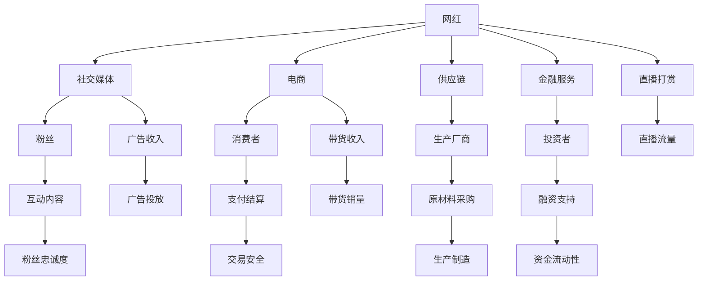

                 

## 1. 背景介绍

随着电商平台的兴起和社交媒体的普及，网红经济迅速发展，成为新的经济形态。网红通过在各大社交媒体平台分享生活、展示才艺，与粉丝互动，积累大量关注和粉丝，进而通过广告、带货、直播打赏等形式变现。然而，尽管网红经济看似风光，但很多网红却面临“难赚钱”的尴尬局面，究其原因，关键在于缺乏供应链和金融布局。本文将从供应链和金融两个维度，深入探讨网红经济中的痛点，并提出相应的解决方案，帮助网红经济实现健康可持续的发展。

## 2. 核心概念与联系

### 2.1 核心概念概述

- **网红经济**：指通过网红在社交媒体平台上与粉丝互动，建立品牌信任，并通过广告、带货、直播打赏等方式进行变现的经济模式。
- **供应链管理**：指从原材料采购、生产制造、物流配送，到终端零售的全流程管理，确保生产与市场需求的衔接和协同。
- **金融布局**：指在供应链中引入金融服务，如融资、保险、支付等，以解决供应链中的资金问题，提高供应链效率和稳定性。
- **区块链技术**：指一种去中心化的分布式账本技术，具有不可篡改、可追溯等特性，适用于供应链和金融场景的智能合约、溯源等需求。
- **智能合约**：指通过区块链技术自动执行的合约条款，当合约中设定的条件满足时，智能合约会自动执行相应操作。

### 2.2 核心概念原理和架构的 Mermaid 流程图



此图展示了网红经济的基本架构，包括网红与粉丝、社交媒体、电商、供应链、金融服务的互动关系。供应链和金融服务通过智能合约等技术，连接各环节，确保网红经济的高效运转。

## 3. 核心算法原理 & 具体操作步骤

### 3.1 算法原理概述

网红经济中的供应链和金融布局，涉及多个环节和复杂流程，需要综合运用供应链管理和金融服务的算法和策略。以下将分别介绍供应链管理和金融布局的核心算法原理。

### 3.2 算法步骤详解

#### 3.2.1 供应链管理

1. **需求预测算法**：
   - 基于历史销售数据和市场趋势，使用时间序列分析、回归分析等方法，预测未来的市场需求。
   - 算法示例：ARIMA模型、LSTM网络等。

2. **库存管理算法**：
   - 根据需求预测结果，动态调整库存量，确保库存水平在合理范围内。
   - 算法示例：基于需求的库存管理模型、动态定价算法等。

3. **生产调度算法**：
   - 根据生产能力和市场需求，合理分配生产资源，优化生产计划。
   - 算法示例：遗传算法、粒子群优化等。

4. **物流配送算法**：
   - 设计高效的配送路径和运输方案，减少物流成本，提高配送效率。
   - 算法示例：蚁群算法、遗传算法等。

#### 3.2.2 金融布局

1. **供应链金融算法**：
   - 引入金融服务，如供应链融资、保险、担保等，解决供应链中的资金问题。
   - 算法示例：信用评分模型、风险评估模型等。

2. **供应链支付算法**：
   - 实现供应链中各环节的支付结算，提高支付效率和安全性。
   - 算法示例：区块链支付、智能合约等。

3. **供应链保险算法**：
   - 设计保险方案，保障供应链中各环节的风险，降低风险成本。
   - 算法示例：贝叶斯网络、决策树等。

### 3.3 算法优缺点

#### 3.3.1 供应链管理

- **优点**：
  - 通过算法优化供应链流程，降低成本，提高效率。
  - 实现需求预测和库存管理，减少库存积压和缺货风险。
  - 优化生产调度和物流配送，提升供应链的灵活性和响应速度。

- **缺点**：
  - 算法复杂度较高，需要大量数据和计算资源。
  - 算法设计需要考虑多个因素，如市场需求、生产能力、物流成本等。
  - 算法效果依赖于数据质量，需要确保数据准确性和完整性。

#### 3.3.2 金融布局

- **优点**：
  - 引入金融服务，缓解供应链中的资金问题，提高供应链的稳定性。
  - 实现供应链中的高效支付和保险，降低风险成本。

- **缺点**：
  - 金融服务引入增加了供应链的复杂度，需要协调多个利益方。
  - 金融算法需要考虑信用风险、市场波动等因素，设计复杂。
  - 金融服务可能增加供应链成本，需要合理控制和优化。

### 3.4 算法应用领域

供应链管理和金融布局的算法，广泛应用于电商、制造业、物流、零售等行业，提高供应链效率和稳定性，降低风险成本。网红经济作为新兴的经济模式，也需借鉴这些算法，优化供应链和金融布局，提升整体竞争力。

## 4. 数学模型和公式 & 详细讲解

### 4.1 数学模型构建

供应链管理中的算法，通常基于优化模型和统计模型构建。以需求预测算法为例，假设历史销售数据为 $D_t = (d_{t-1}, d_{t-2}, ..., d_{t-m})$，其中 $d_t$ 为第 $t$ 天的销售量，$m$ 为历史数据长度，$\alpha$ 为平滑因子。需求预测的线性模型为：

$$
d_{t+1} = \alpha d_t + (1-\alpha) \frac{\sum_{i=1}^{m} d_{t-i}d_{t+1-i}}{\sum_{i=1}^{m} d_{t-i}^2}
$$

### 4.2 公式推导过程

根据上述线性模型，需求预测过程如下：
1. 计算历史数据加权平均：$\bar{d}_t = \frac{\sum_{i=1}^{m} d_{t-i}d_{t+1-i}}{\sum_{i=1}^{m} d_{t-i}^2}$
2. 计算第 $t+1$ 天需求：$d_{t+1} = \alpha d_t + (1-\alpha) \bar{d}_t$

### 4.3 案例分析与讲解

以电商平台的服装销售为例，假设某电商平台的日销售数据如下：

| 日期   | 销售量 |
| ------ | ------ |
| 2021-01-01 | 100 |
| 2021-01-02 | 80  |
| 2021-01-03 | 120 |
| 2021-01-04 | 90  |
| 2021-01-05 | 110 |

假设平滑因子 $\alpha = 0.8$，则需求预测算法如下：

1. 计算历史数据加权平均：
   - $\bar{d}_1 = \frac{100 \times 80 + 80 \times 120 + 120 \times 90 + 90 \times 110}{100^2 + 80^2 + 120^2 + 90^2} = 94.2857$
   - $\bar{d}_2 = \frac{80 \times 120 + 120 \times 90 + 90 \times 110 + 110 \times 100}{80^2 + 120^2 + 90^2 + 110^2} = 100.0000$
2. 计算第 $t+1$ 天需求：
   - $d_2 = 0.8 \times 100 + 0.2 \times 100 = 100$
   - $d_3 = 0.8 \times 120 + 0.2 \times 100 = 104$

通过需求预测算法，可以准确预测未来的销售量，优化库存和生产计划。

## 5. 项目实践：代码实例和详细解释说明

### 5.1 开发环境搭建

1. 安装Python：
   ```bash
   sudo apt-get install python3 python3-pip python3-dev
   ```

2. 安装Pandas：
   ```bash
   pip install pandas
   ```

3. 安装Scikit-learn：
   ```bash
   pip install scikit-learn
   ```

4. 安装Matplotlib：
   ```bash
   pip install matplotlib
   ```

### 5.2 源代码详细实现

#### 5.2.1 需求预测模型

```python
import pandas as pd
from sklearn.linear_model import LinearRegression

def demand_forecasting(data, alpha):
    # 计算历史数据加权平均
    bar_data = (data.shift(1) * data.shift(-1)).sum() / data.pow(2).sum()
    # 计算第 t+1 天需求
    forecast = alpha * data[:-1] + (1 - alpha) * bar_data

    return forecast

# 读取数据
data = pd.read_csv('sales_data.csv')

# 计算平滑因子
alpha = 0.8

# 预测未来10天需求
forecast = demand_forecasting(data, alpha)
```

#### 5.2.2 库存管理模型

```python
def inventory_management(forecast, initial_inventory, order_cost, holding_cost):
    inventory = initial_inventory
    order = 0

    for i in range(len(forecast)):
        if inventory < forecast[i]:
            # 补货
            inventory += order
            order += order_cost
        elif inventory > forecast[i]:
            # 降库存
            inventory -= holding_cost

    return inventory

# 初始库存
initial_inventory = 500
order_cost = 100
holding_cost = 10

# 预测需求
forecast = demand_forecasting(data, alpha)

# 计算库存
inventory = inventory_management(forecast, initial_inventory, order_cost, holding_cost)
```

### 5.3 代码解读与分析

通过上述代码，实现了基于历史销售数据的需求预测和库存管理。需求预测模型基于线性回归算法，通过平滑因子 $\alpha$ 调整数据加权平均，实现未来需求的预测。库存管理模型根据预测结果和成本参数，动态调整库存水平，确保库存量在合理范围内。

## 6. 实际应用场景

### 6.1 电商供应链管理

电商平台的服装销售，供应链复杂，涉及生产、物流、销售等多个环节。通过需求预测和库存管理算法，电商平台可以优化供应链流程，提高销售效率，减少库存积压和缺货风险。

### 6.2 零售行业

零售行业的供应链管理同样面临需求预测和库存管理的问题。通过引入算法优化供应链流程，零售企业可以降低成本，提高运营效率，提升客户满意度。

## 7. 工具和资源推荐

### 7.1 学习资源推荐

1. 《供应链管理：理论与实践》：详细介绍了供应链管理的基本理论和实际应用，涵盖需求预测、库存管理、生产调度等内容。

2. 《金融工程：理论与实践》：介绍了金融工程的基本概念和方法，包括风险评估、金融产品设计、资产定价等。

3. 《区块链技术：原理与实践》：详细介绍了区块链技术的基本原理和应用场景，涵盖智能合约、溯源等技术。

### 7.2 开发工具推荐

1. Python：常用的编程语言，适合数据处理和算法开发。

2. Pandas：用于数据处理和分析的Python库，支持数据读取、清洗、分析等功能。

3. Scikit-learn：用于机器学习和数据挖掘的Python库，支持多种算法和模型。

4. Matplotlib：用于数据可视化的Python库，支持绘制图表和数据可视化。

### 7.3 相关论文推荐

1. "A Survey on Supply Chain Risk Management"（供应链风险管理综述）
   - 介绍了供应链风险管理的基本理论和实践方法。

2. "Blockchain Technology in Supply Chain Management: A Review"（区块链技术在供应链管理中的应用综述）
   - 详细介绍了区块链技术在供应链中的应用，包括溯源、智能合约等技术。

3. "Optimization Models for Supply Chain Management"（供应链管理优化模型）
   - 介绍了供应链管理中的优化模型和算法，涵盖需求预测、库存管理等内容。

## 8. 总结：未来发展趋势与挑战

### 8.1 研究成果总结

网红经济作为新兴的经济模式，面临供应链和金融布局的挑战。通过优化供应链和引入金融服务，网红经济可以提升整体竞争力，实现可持续发展。

### 8.2 未来发展趋势

1. **智能供应链**：引入人工智能和机器学习技术，优化供应链流程，提高效率和稳定性。
2. **区块链金融**：通过区块链技术，实现供应链中的高效支付和保险，降低风险成本。
3. **大数据分析**：利用大数据技术，分析供应链和金融数据，优化决策过程。

### 8.3 面临的挑战

1. **数据质量问题**：供应链和金融数据质量参差不齐，影响算法效果。
2. **系统复杂度**：供应链和金融布局涉及多个环节和复杂流程，系统设计复杂。
3. **风险管理**：供应链金融和支付涉及高风险，需要设计有效的风险管理机制。

### 8.4 研究展望

1. **智能合约和区块链结合**：利用区块链技术和智能合约，优化供应链和金融流程。
2. **多维数据分析**：引入多种数据来源，提高数据分析的准确性和全面性。
3. **风险管理算法**：设计更加有效的风险管理算法，降低供应链和金融风险。

## 9. 附录：常见问题与解答

**Q1：供应链管理中的需求预测算法有哪些？**

A: 供应链管理中的需求预测算法主要包括时间序列分析、回归分析、机器学习等方法。常用的算法有ARIMA模型、LSTM网络等。

**Q2：如何进行供应链金融布局？**

A: 供应链金融布局主要通过引入金融服务，如供应链融资、保险、支付等，解决供应链中的资金问题。可以使用信用评分模型、风险评估模型等算法进行风险管理。

**Q3：如何优化供应链的库存管理？**

A: 供应链的库存管理可以通过需求预测和动态调整库存量实现。可以通过需求预测算法，如ARIMA模型、LSTM网络等，预测未来需求，并根据库存水平和成本参数进行动态调整。

**Q4：供应链管理中的生产调度算法有哪些？**

A: 供应链管理中的生产调度算法包括遗传算法、粒子群优化等。这些算法可以根据生产能力和市场需求，合理分配生产资源，优化生产计划。

通过深入探讨供应链和金融布局的算法和策略，本文为网红经济提供了优化供应链和引入金融服务的解决方案。未来，随着供应链和金融技术的发展，网红经济将迎来更加高效、稳定的发展，实现健康可持续的发展。

