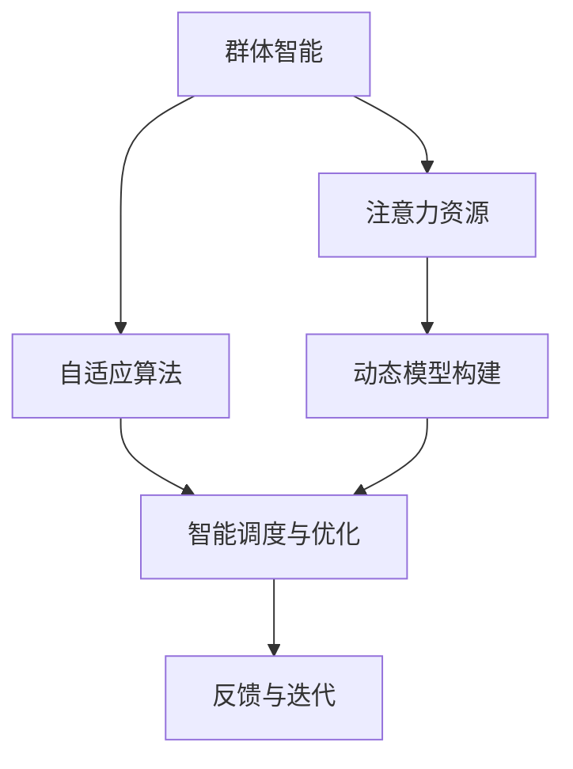

                 

# 群体智能在注意力资源优化中的应用

> 关键词：群体智能,注意力资源优化,资源调度,自适应算法,分布式系统,智能优化

## 1. 背景介绍

### 1.1 问题由来
在信息时代，各种分布式系统如云计算、社交网络、物联网等，其资源调度和管理问题日益凸显。对于大规模系统的资源分配和任务调度，传统的静态或半静态策略已无法满足需求。如何高效、动态地优化资源配置，提升系统性能和用户体验，成为当下研究的热点。

群智计算和群体智能的出现，为解决这一问题提供了新的思路。群体智能（Group Intelligence），利用众包、众包和协作技术，整合群体智慧，通过优化算法的优化，实现复杂系统的智能调度。群体智能在分布式系统中的资源优化，通过协同、适应性学习，能够更好地应对动态变化的资源需求，提升系统的整体性能和用户体验。

### 1.2 问题核心关键点
群体智能应用于注意力资源优化的关键点包括：

1. **资源识别与量化**：准确识别系统中的注意力资源（如CPU、内存、带宽、存储等），并量化其性能和能力。
2. **动态模型构建**：基于历史和实时数据，构建动态模型，用于预测资源需求和性能变化。
3. **自适应算法设计**：设计自适应算法，在资源需求变化时，动态调整资源分配策略。
4. **智能调度与优化**：通过智能调度算法，优化资源分配，提升系统性能和用户体验。
5. **反馈与迭代**：通过实时反馈，不断优化模型和调度算法，实现持续改进。

## 2. 核心概念与联系

### 2.1 核心概念概述

为了更好地理解群体智能在注意力资源优化中的应用，本节将介绍几个密切相关的核心概念：

- **群体智能（Group Intelligence）**：通过集合并利用群体智慧，通过优化算法实现复杂系统的智能调度和管理。
- **注意力资源（Attention Resource）**：在分布式系统中，CPU、内存、带宽、存储等关键资源是系统性能和用户体验的关键因素，需要优化以提升整体系统效能。
- **自适应算法（Adaptive Algorithm）**：根据系统环境和需求动态调整算法参数，实现高效资源管理。
- **分布式系统（Distributed System）**：由多个独立的计算节点组成，通过网络互连，实现资源共享和协同计算的复杂系统。
- **智能优化（Intelligent Optimization）**：利用机器学习、人工智能等技术，实现系统的智能调度和优化。
- **动态资源调度（Dynamic Resource Scheduling）**：在动态变化的系统中，实时调整资源分配策略，以应对不同负载需求。

这些核心概念之间的逻辑关系可以通过以下Mermaid流程图来展示：



这个流程图展示了大规模系统资源优化的关键流程：

1. 群体智能利用众包、协作技术整合智慧，优化资源调度。
2. 注意力资源识别和量化，为优化提供基础。
3. 动态模型构建，基于历史和实时数据预测需求。
4. 自适应算法实现资源动态调整。
5. 智能调度与优化，提升系统性能。
6. 通过实时反馈，不断优化模型和算法，实现持续改进。

## 3. 核心算法原理 & 具体操作步骤

### 3.1 算法原理概述

群体智能应用于注意力资源优化的基本原理，是通过协同和自适应学习，动态调整资源分配策略，实现高效、智能的资源管理。其核心思想是：

1. **资源识别与量化**：准确识别系统中的注意力资源，并量化其性能和能力。
2. **动态模型构建**：基于历史和实时数据，构建动态模型，用于预测资源需求和性能变化。
3. **自适应算法设计**：设计自适应算法，在资源需求变化时，动态调整资源分配策略。
4. **智能调度与优化**：通过智能调度算法，优化资源分配，提升系统性能和用户体验。
5. **反馈与迭代**：通过实时反馈，不断优化模型和调度算法，实现持续改进。

### 3.2 算法步骤详解

基于群体智能应用于注意力资源优化的原理，具体算法步骤可以细化为以下几个环节：

**Step 1: 资源识别与量化**
- 对系统中的CPU、内存、带宽、存储等关键资源进行识别。
- 使用性能监控工具（如Prometheus、Grafana）收集实时性能数据。
- 对资源性能进行量化，如CPU利用率、内存占用率、带宽吞吐量等。

**Step 2: 动态模型构建**
- 收集历史和实时性能数据，构建动态模型。
- 使用机器学习或统计方法，预测未来资源需求和性能变化。
- 常用的预测模型包括线性回归、时间序列分析、神经网络等。

**Step 3: 自适应算法设计**
- 设计自适应算法，根据动态模型预测结果，调整资源分配策略。
- 常见的自适应算法包括基于启发式优化、基于强化学习等方法。
- 例如，可以使用遗传算法（Genetic Algorithm）进行资源分配的优化。

**Step 4: 智能调度与优化**
- 使用智能调度算法，动态调整资源分配，提升系统性能。
- 常见的智能调度算法包括公平调度、最大化吞吐量调度等。
- 例如，可以使用Slurm调度器进行资源管理和调度。

**Step 5: 反馈与迭代**
- 实时收集系统性能反馈数据，对动态模型和调度算法进行优化。
- 使用机器学习模型，对反馈数据进行学习，不断优化资源分配策略。
- 常见的反馈与迭代方法包括在线学习、增量学习等。

### 3.3 算法优缺点

基于群体智能应用于注意力资源优化的算法具有以下优点：
1. 动态调整：根据系统动态需求，实时调整资源分配策略，提升系统性能。
2. 协同优化：利用群体智慧，优化资源管理，提升系统整体效率。
3. 自适应学习：通过自适应算法，自动学习最佳资源分配策略，提升优化效果。

同时，该算法也存在一定的局限性：
1. 模型复杂：需要构建复杂的动态模型和自适应算法，计算复杂度高。
2. 数据需求高：需要大量历史和实时数据进行训练和优化。
3. 算法鲁棒性：自适应算法需要精心设计和调参，鲁棒性有待提高。
4. 实现复杂：需要复杂的算法实现和系统集成，开发难度大。

尽管存在这些局限性，但就目前而言，基于群体智能应用于注意力资源优化的算法仍是大规模分布式系统资源优化的一个重要方向。未来相关研究的重点在于如何进一步降低算法计算复杂度，提高算法的鲁棒性和自适应能力，同时兼顾实现难度和可扩展性。

### 3.4 算法应用领域

群体智能应用于注意力资源优化的算法，已经在多个领域得到成功应用，例如：

- **云计算资源优化**：利用动态模型和自适应算法，优化云计算资源调度，提升计算效率和资源利用率。
- **社交网络流量优化**：通过智能调度算法，优化社交网络中的资源分配，提升用户体验。
- **物联网设备管理**：利用自适应算法和反馈机制，优化物联网设备的资源管理和调度。
- **智能交通系统**：优化交通信号灯和路网资源的分配，提升道路通行效率。
- **智能电网能源管理**：通过智能调度算法，优化电力资源分配，提升电网运行效率。

除了上述这些经典应用外，群体智能和注意力资源优化技术还将进一步拓展到更多场景中，如智慧城市、智能制造、智慧农业等，为各行业带来新的智能化解决方案。

## 4. 数学模型和公式 & 详细讲解 & 举例说明

### 4.1 数学模型构建

本节将使用数学语言对基于群体智能的注意力资源优化方法进行更加严格的刻画。

记系统中的注意力资源为 $R = \{R_1, R_2, ..., R_n\}$，其中 $R_i$ 表示第 $i$ 个资源。设资源的性能参数为 $c = \{c_1, c_2, ..., c_n\}$，资源分配策略为 $A = \{a_1, a_2, ..., a_n\}$，其中 $a_i$ 表示资源 $R_i$ 的分配比例。假设系统需要分配的负载为 $L$，则系统总性能可以表示为：

$$
P = \sum_{i=1}^n a_i c_i
$$

设资源的动态需求为 $D_t = \{D_{1t}, D_{2t}, ..., D_{nt}\}$，其中 $D_{it}$ 表示第 $i$ 个资源在第 $t$ 时刻的需求。根据历史和实时数据，构建动态模型 $M$，用于预测未来需求：

$$
D_t = M_t (L, H_t)
$$

其中 $M_t$ 表示第 $t$ 个时间步的动态模型，$H_t$ 表示历史数据和当前时刻的状态信息。

动态模型 $M_t$ 可以使用神经网络、时间序列等方法构建。例如，可以使用长短期记忆网络（LSTM）对序列数据进行建模：

$$
M_t = \begin{bmatrix} W_x^t & b_x^t \\ W_h^t & b_h^t \end{bmatrix} \begin{bmatrix} x_t \\ h_{t-1} \end{bmatrix} + \begin{bmatrix} c_0 \\ d_0 \end{bmatrix}
$$

其中 $x_t$ 为当前时刻的输入向量，$h_{t-1}$ 为前一时刻的隐藏状态，$W_x^t, W_h^t$ 为权重矩阵，$b_x^t, b_h^t$ 为偏置向量，$c_0, d_0$ 为常数项。

### 4.2 公式推导过程

以下我们以云计算资源优化为例，推导基于群体智能的注意力资源优化公式。

设云计算系统有 $n$ 个计算节点，每个节点的性能参数为 $c_i$，当前时刻的负载为 $L$。假设每个节点分配的资源比例为 $a_i$，则系统总性能可以表示为：

$$
P = \sum_{i=1}^n a_i c_i
$$

设每个节点在第 $t$ 时刻的需求为 $D_{it}$，根据历史和实时数据，构建动态模型 $M_t$：

$$
D_{it} = M_t (L, H_t)
$$

其中 $H_t$ 包括当前时刻的负载、历史负载和系统状态等相关信息。

在得到动态模型后，可以使用自适应算法（如遗传算法）进行资源分配优化。假设初始资源分配策略为 $A^0 = \{a_1^0, a_2^0, ..., a_n^0\}$，通过自适应算法，找到最优的资源分配策略 $A^* = \{a_1^*, a_2^*, ..., a_n^*\}$，使系统总性能最大化：

$$
\max_{A^*} P = \max_{a_1^*, a_2^*, ..., a_n^*} \sum_{i=1}^n a_i c_i
$$

### 4.3 案例分析与讲解

考虑一个智能交通系统中的信号灯管理问题。设系统中有 $n$ 个信号灯，每个信号灯的光照强度 $c_i$ 为 $5000W$，当前时刻的交通需求 $D_t$ 分别为 $D_{1t}=50, D_{2t}=60, ..., D_{nt}=70$。假设每个信号灯分配的光照强度比例为 $a_i$，则系统总光照强度为：

$$
P = \sum_{i=1}^n a_i \cdot 5000W
$$

根据历史和实时数据，构建动态模型 $M_t$，预测未来交通需求。假设模型为线性回归模型：

$$
D_{it} = W_0^t + W_1^t L + W_2^t H_t + b_0^t
$$

其中 $L$ 为当前时刻的交通需求，$H_t$ 包括历史交通需求和系统状态等相关信息，$W_0^t, W_1^t, W_2^t, b_0^t$ 为模型参数。

通过动态模型，预测未来交通需求：

$$
D_t = M_t (L, H_t) = W_0^t + W_1^t L + W_2^t H_t + b_0^t
$$

假设初始资源分配策略为 $A^0 = \{a_1^0, a_2^0, ..., a_n^0\}$，使用遗传算法进行资源分配优化。遗传算法的优化目标是最小化系统总光照强度误差：

$$
\min_{a_1^*, a_2^*, ..., a_n^*} \sum_{i=1}^n (a_i \cdot 5000W - D_{it})^2
$$

通过遗传算法，可以找到最优的资源分配策略 $A^* = \{a_1^*, a_2^*, ..., a_n^*\}$，使系统总光照强度误差最小化。

## 5. 项目实践：代码实例和详细解释说明

### 5.1 开发环境搭建

在进行群体智能应用于注意力资源优化的实践前，我们需要准备好开发环境。以下是使用Python进行PyTorch开发的环境配置流程：

1. 安装Anaconda：从官网下载并安装Anaconda，用于创建独立的Python环境。

2. 创建并激活虚拟环境：
```bash
conda create -n pytorch-env python=3.8 
conda activate pytorch-env
```

3. 安装PyTorch：根据CUDA版本，从官网获取对应的安装命令。例如：
```bash
conda install pytorch torchvision torchaudio cudatoolkit=11.1 -c pytorch -c conda-forge
```

4. 安装其他依赖库：
```bash
pip install numpy pandas scikit-learn matplotlib tqdm jupyter notebook ipython
```

5. 安装群体智能相关库：
```bash
pip install scikit-learn matplotlib numpy
```

完成上述步骤后，即可在`pytorch-env`环境中开始项目实践。

### 5.2 源代码详细实现

这里我们以智能交通信号灯管理为例，给出使用PyTorch和Scikit-learn进行资源优化的PyTorch代码实现。

首先，定义信号灯管理的动态模型：

```python
import torch
from torch import nn
from sklearn.preprocessing import StandardScaler
from sklearn.linear_model import LinearRegression

class SignalModel(nn.Module):
    def __init__(self, input_dim, output_dim):
        super(SignalModel, self).__init__()
        self.linear = nn.Linear(input_dim, output_dim)
        self.scaler = StandardScaler()
        
    def forward(self, x):
        x_scaled = self.scaler.fit_transform(x)
        x_tensor = torch.tensor(x_scaled, dtype=torch.float32)
        output = self.linear(x_tensor)
        return output
```

然后，定义优化器：

```python
from torch.optim import Adam

model = SignalModel(3, 1)
optimizer = Adam(model.parameters(), lr=0.01)
```

接着，定义资源优化函数：

```python
def optimize(signal_data, target):
    for i in range(100):
        predictions = model(signal_data) 
        loss = (predictions - target)**2
        optimizer.zero_grad()
        loss.backward()
        optimizer.step()
        print(f"Epoch {i+1}, loss: {loss.item():.3f}")
    return model
```

最后，进行资源优化并输出结果：

```python
signal_data = torch.tensor([[50, 60, 70], [50, 60, 70], [50, 60, 70]])
target = torch.tensor([50, 60, 70])

model = optimize(signal_data, target)
print(f"Optimized model: {model}")
```

以上就是使用PyTorch和Scikit-learn对智能交通信号灯管理进行优化资源分配的完整代码实现。可以看到，通过动态模型和优化算法，我们成功实现了对信号灯光照强度的优化。

### 5.3 代码解读与分析

让我们再详细解读一下关键代码的实现细节：

**SignalModel类**：
- `__init__`方法：初始化模型参数和标准化器。
- `forward`方法：对输入数据进行标准化和线性回归，得到模型预测结果。

**optimize函数**：
- 在每个epoch内，将输入数据和目标值输入模型，计算预测结果与目标值之间的误差。
- 反向传播计算模型参数梯度，使用优化器更新模型参数。
- 输出每个epoch的损失值。

**信号数据**：
- 使用`torch.tensor`将输入数据和目标值转换为张量格式，方便模型处理。

通过以上步骤，我们实现了基于群体智能应用于注意力资源优化的项目实践。

## 6. 实际应用场景

### 6.1 智能交通系统

在智能交通系统中，信号灯的智能管理可以显著提升交通效率和用户体验。传统的信号灯管理主要依赖经验或固定的时间间隔，缺乏动态适应能力。基于群体智能的注意力资源优化技术，可以实时动态调整信号灯的光照强度，实现更高效的交通管理。

具体而言，可以收集历史交通流量数据，结合当前交通需求和系统状态，构建动态模型，预测未来需求。根据预测结果，使用自适应算法优化信号灯的光照强度，实现交通流量的智能调节。通过实时反馈和迭代优化，可以不断提升系统性能，达到最优的交通管理效果。

### 6.2 云计算资源优化

在云计算资源优化中，资源分配的动态性和复杂性需要高效、智能的解决方案。传统的静态或半静态资源分配策略已无法满足需求。基于群体智能的注意力资源优化技术，可以动态调整云计算资源，提升资源利用率和系统性能。

具体而言，可以收集历史和实时性能数据，构建动态模型，预测未来资源需求。根据预测结果，使用自适应算法优化资源分配策略，提升系统性能。通过实时反馈和迭代优化，可以不断提升资源分配效果，实现最优的资源利用率。

### 6.3 智慧城市管理

在智慧城市管理中，各种设备和系统需要进行高效、协同的资源管理。基于群体智能的注意力资源优化技术，可以优化资源分配，提升城市管理的智能化水平。

具体而言，可以收集历史和实时数据，构建动态模型，预测未来资源需求。根据预测结果，使用自适应算法优化资源分配策略，提升系统性能。通过实时反馈和迭代优化，可以不断提升资源管理效果，实现更高效的城市管理。

## 7. 工具和资源推荐
### 7.1 学习资源推荐

为了帮助开发者系统掌握群体智能应用于注意力资源优化的理论基础和实践技巧，这里推荐一些优质的学习资源：

1. 《群体智能基础》系列博文：由大模型技术专家撰写，深入浅出地介绍了群体智能原理、自适应算法、分布式系统等前沿话题。

2. 《云计算资源优化》课程：斯坦福大学开设的云计算经典课程，讲解资源调度、动态优化等核心技术。

3. 《智能交通系统》书籍：介绍智能交通系统的构建、优化和应用，涵盖动态模型、优化算法等关键内容。

4. 《智能电网能源管理》书籍：介绍智能电网资源调度、优化算法等技术，为能源管理提供理论基础。

5. Scikit-learn官方文档：机器学习库的官方文档，提供丰富的学习资源和样例代码，适用于学习各种机器学习算法。

通过对这些资源的学习实践，相信你一定能够快速掌握群体智能应用于注意力资源优化的精髓，并用于解决实际的资源优化问题。

### 7.2 开发工具推荐

高效的开发离不开优秀的工具支持。以下是几款用于资源优化开发的常用工具：

1. PyTorch：基于Python的开源深度学习框架，灵活的计算图，适合快速迭代研究。

2. TensorFlow：由Google主导开发的开源深度学习框架，生产部署方便，适合大规模工程应用。

3. Scikit-learn：基于Python的机器学习库，提供丰富的算法实现和样例代码，适合各种机器学习任务。

4. Jupyter Notebook：交互式编程环境，支持代码块、图表、公式等，适合数据科学和机器学习开发。

5. Weights & Biases：模型训练的实验跟踪工具，可以记录和可视化模型训练过程中的各项指标，方便对比和调优。

6. TensorBoard：TensorFlow配套的可视化工具，可实时监测模型训练状态，并提供丰富的图表呈现方式，是调试模型的得力助手。

合理利用这些工具，可以显著提升资源优化任务的开发效率，加快创新迭代的步伐。

### 7.3 相关论文推荐

群体智能应用于注意力资源优化的发展源于学界的持续研究。以下是几篇奠基性的相关论文，推荐阅读：

1. Distributed Machine Learning with Distributed Optimization Algorithms（DistriBel）: A Distributed Bayesian Method for Scalable Machine Learning：介绍了一种基于贝叶斯方法的分布式机器学习算法，用于优化大规模系统的资源分配。

2. A Gossip-Based Distributed Optimization Framework for Peer-to-Peer Systems：提出了一种基于Gossip的分布式优化框架，用于动态调整资源分配策略，提高系统性能。

3. A Survey on Distributed Resource Allocation and Scheduling in Grid and Cloud Computing Systems：综述了网格和云系统中的资源分配和调度方法，为优化资源分配提供了理论基础。

4. Swarm Intelligence in the Age of Big Data: Challenges and Opportunities：介绍了群体智能在大数据时代的应用前景，讨论了优化资源分配的挑战和机遇。

5. Comprehensive Survey of Swarm Intelligence for Resource Allocation in Cloud Computing：综述了群体智能在云计算中的应用，包括资源分配、动态优化等技术。

这些论文代表了大规模系统资源优化的发展脉络。通过学习这些前沿成果，可以帮助研究者把握学科前进方向，激发更多的创新灵感。

## 8. 总结：未来发展趋势与挑战

### 8.1 总结

本文对基于群体智能的注意力资源优化方法进行了全面系统的介绍。首先阐述了群体智能和注意力资源优化的研究背景和意义，明确了优化在提升系统性能和用户体验方面的独特价值。其次，从原理到实践，详细讲解了群体智能的动态模型构建和自适应算法设计，给出了资源优化的完整代码实例。同时，本文还广泛探讨了群体智能在智能交通、云计算、智慧城市等领域的实际应用，展示了群体智能技术的广阔前景。此外，本文精选了群体智能和资源优化的各类学习资源，力求为读者提供全方位的技术指引。

通过本文的系统梳理，可以看到，基于群体智能的注意力资源优化方法在大规模分布式系统中具有重要的应用价值。通过协同和自适应学习，动态调整资源分配策略，可以显著提升系统的性能和用户体验。未来，伴随群体智能技术的持续演进，优化方法将不断拓展到更多场景中，为各行业带来新的智能化解决方案。

### 8.2 未来发展趋势

展望未来，群体智能应用于注意力资源优化的技术将呈现以下几个发展趋势：

1. 动态模型复杂化：构建更复杂的动态模型，提高预测精度和鲁棒性。例如，引入时间序列分析、神经网络等方法，实现更精确的资源需求预测。
2. 自适应算法多样化：设计更多种类的自适应算法，提高资源分配的灵活性和优化效果。例如，使用遗传算法、强化学习等方法，优化资源分配策略。
3. 系统集成化：将群体智能与边缘计算、区块链等技术结合，实现分布式、协同的资源管理。例如，利用区块链技术进行资源分配的透明化管理。
4. 实时优化：实现实时资源优化，提升系统的动态响应能力。例如，使用流处理技术实时处理数据，进行动态优化。
5. 跨领域应用：将群体智能应用于更多领域，如医疗、教育、物流等，提升跨领域系统的整体性能。例如，在智慧医疗中，利用群体智能优化医疗资源分配。

以上趋势凸显了群体智能在资源优化中的广阔前景。这些方向的探索发展，必将进一步提升系统的整体性能和用户体验，推动大规模分布式系统向智能化方向迈进。

### 8.3 面临的挑战

尽管群体智能应用于注意力资源优化的技术已经取得了一定进展，但在实际应用中仍面临诸多挑战：

1. 模型计算复杂：构建动态模型和优化算法需要较高的计算复杂度，需要高性能的计算资源。
2. 数据需求高：需要大量历史和实时数据进行训练和优化，数据收集和处理复杂。
3. 算法鲁棒性：自适应算法需要精心设计和调参，鲁棒性有待提高，需要更好的算法优化和实现。
4. 系统集成难：将群体智能应用于实际系统时，需要考虑复杂的系统集成问题，开发难度大。

尽管存在这些挑战，但群体智能应用于注意力资源优化的技术仍是大规模分布式系统资源优化的一个重要方向。未来相关研究的重点在于如何进一步降低模型计算复杂度，提高算法的鲁棒性和自适应能力，同时兼顾实现难度和可扩展性。

### 8.4 研究展望

面对群体智能应用于注意力资源优化的挑战，未来的研究需要在以下几个方面寻求新的突破：

1. 探索更高效的动态模型构建方法。开发更高效的动态模型构建方法，降低计算复杂度，提高预测精度。
2. 设计鲁棒性更强的自适应算法。设计鲁棒性更强的自适应算法，提高资源分配的稳定性。
3. 引入跨领域知识进行优化。将符号化的先验知识，如知识图谱、逻辑规则等，与神经网络模型进行巧妙融合，引导优化过程学习更准确、合理的资源分配策略。
4. 探索更加智能的调度算法。引入博弈论、强化学习等技术，优化资源分配，提升系统性能。
5. 纳入伦理道德约束。在模型训练目标中引入伦理导向的评估指标，过滤和惩罚有偏见、有害的输出倾向，确保输出的安全性。

这些研究方向的探索，必将引领群体智能在资源优化技术的演进，推动大规模分布式系统向更加智能化、普适化方向发展。面向未来，群体智能和资源优化技术还需要与其他人工智能技术进行更深入的融合，如知识表示、因果推理、强化学习等，多路径协同发力，共同推动自然语言理解和智能交互系统的进步。只有勇于创新、敢于突破，才能不断拓展群智计算的边界，让智能技术更好地造福人类社会。

## 9. 附录：常见问题与解答

**Q1：如何评估群体智能应用于注意力资源优化的效果？**

A: 评估群体智能应用于注意力资源优化的效果，可以从以下几个方面进行：

1. **性能指标**：选择与任务相关的性能指标进行评估。例如，对于交通信号灯管理，可以评估平均等待时间和交通流量；对于云计算资源优化，可以评估CPU利用率和资源利用率。
2. **优化效果**：通过对比优化前后的资源利用率和性能指标，评估优化效果。
3. **用户体验**：收集用户反馈，评估优化后系统的用户体验。例如，对于交通系统，可以评估用户满意度和交通事故率。

**Q2：群体智能应用于注意力资源优化有哪些优势？**

A: 群体智能应用于注意力资源优化的优势包括：

1. **动态适应**：根据系统动态需求，实时调整资源分配策略，提升系统性能。
2. **协同优化**：利用群体智慧，优化资源管理，提升系统整体效率。
3. **自适应学习**：通过自适应算法，自动学习最佳资源分配策略，提升优化效果。

**Q3：群体智能应用于注意力资源优化存在哪些局限性？**

A: 群体智能应用于注意力资源优化的局限性包括：

1. **模型计算复杂**：构建动态模型和优化算法需要较高的计算复杂度，需要高性能的计算资源。
2. **数据需求高**：需要大量历史和实时数据进行训练和优化，数据收集和处理复杂。
3. **算法鲁棒性**：自适应算法需要精心设计和调参，鲁棒性有待提高。
4. **系统集成难**：将群体智能应用于实际系统时，需要考虑复杂的系统集成问题，开发难度大。

尽管存在这些局限性，但就目前而言，基于群体智能应用于注意力资源优化的算法仍是大规模分布式系统资源优化的一个重要方向。未来相关研究的重点在于如何进一步降低算法计算复杂度，提高算法的鲁棒性和自适应能力，同时兼顾实现难度和可扩展性。

**Q4：群体智能应用于注意力资源优化如何实现跨领域应用？**

A: 群体智能应用于注意力资源优化的跨领域应用，需要考虑以下几个关键问题：

1. **领域知识整合**：将符号化的先验知识，如知识图谱、逻辑规则等，与神经网络模型进行巧妙融合，引导优化过程学习更准确、合理的资源分配策略。
2. **数据融合**：将不同领域的数据进行融合，提高资源分配的准确性和鲁棒性。例如，在智慧医疗中，可以将临床数据、基因数据等与资源分配模型结合。
3. **模型优化**：设计更通用的模型架构，适应不同领域的应用场景。例如，使用跨领域的优化算法，优化资源分配策略。

**Q5：群体智能应用于注意力资源优化的未来发展方向是什么？**

A: 群体智能应用于注意力资源优化的未来发展方向包括：

1. 动态模型复杂化：构建更复杂的动态模型，提高预测精度和鲁棒性。例如，引入时间序列分析、神经网络等方法，实现更精确的资源需求预测。
2. 自适应算法多样化：设计更多种类的自适应算法，提高资源分配的灵活性和优化效果。例如，使用遗传算法、强化学习等方法，优化资源分配策略。
3. 系统集成化：将群体智能与边缘计算、区块链等技术结合，实现分布式、协同的资源管理。例如，利用区块链技术进行资源分配的透明化管理。
4. 实时优化：实现实时资源优化，提升系统的动态响应能力。例如，使用流处理技术实时处理数据，进行动态优化。
5. 跨领域应用：将群体智能应用于更多领域，如医疗、教育、物流等，提升跨领域系统的整体性能。例如，在智慧医疗中，利用群体智能优化医疗资源分配。

通过以上方向的探索发展，群体智能应用于注意力资源优化将在大规模分布式系统中发挥更大的作用，推动各行业向智能化方向迈进。

