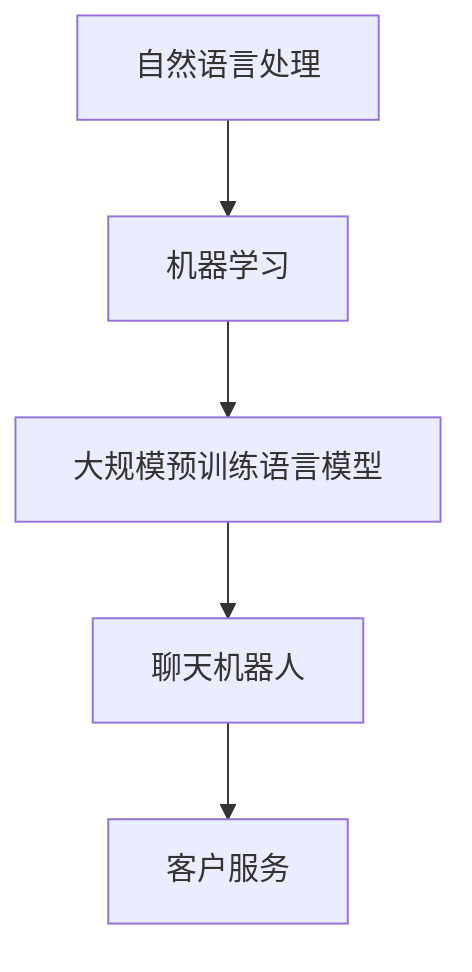
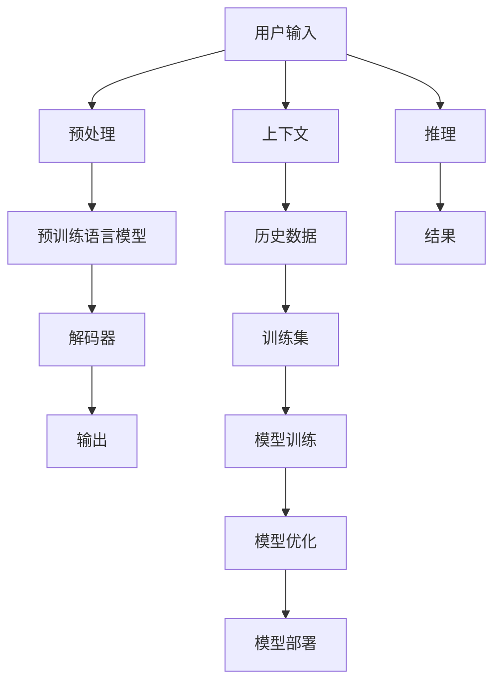

                 

# 聊天机器人如何利用 AI 技术，提升客户服务效率：技术应用与商业价值

> 关键词：AI, 聊天机器人, 自然语言处理, 机器学习, 客户服务, 效率提升, 商业价值

## 1. 背景介绍

随着数字化转型的加速，企业逐渐意识到客户服务的重要性。传统的客服模式往往依赖于人力，成本高昂且效率低下。而聊天机器人（Chatbot）作为人工智能（AI）的一个重要应用，通过模拟自然语言对话，不仅能提供24/7无间断服务，还能处理海量重复性问题，从而有效降低人力成本，提升客户满意度。

聊天机器人的核心在于其背后的AI技术。本文将深入探讨聊天机器人如何利用AI技术，特别是自然语言处理（NLP）和机器学习（ML）技术，来提升客户服务的效率，同时分析其在商业价值上的巨大潜力。

## 2. 核心概念与联系

### 2.1 核心概念概述

聊天机器人是一种基于NLP技术的自动化对话系统，通过模拟人类对话，与用户进行交互，以解决用户问题。聊天机器人的发展离不开机器学习，尤其是深度学习和大规模预训练语言模型的应用。

- **自然语言处理（NLP）**：涉及计算机与人类语言之间的交互，包括文本分析、文本生成、语音识别与合成等技术。
- **机器学习（ML）**：通过算法和模型，使计算机从数据中学习，并进行预测或决策。
- **大规模预训练语言模型**：如GPT、BERT等，通过在大规模无标签文本上预训练，获得了丰富的语言知识和语义理解能力，是聊天机器人的基础。

这些核心技术通过如下关系相互联系，共同构建了聊天机器人的工作框架：



### 2.2 核心概念原理和架构的 Mermaid 流程图



## 3. 核心算法原理 & 具体操作步骤

### 3.1 算法原理概述

聊天机器人的核心算法基于NLP和ML技术，通过以下步骤实现：

1. **文本预处理**：包括分词、去除停用词、词性标注等，将用户输入的文本转换为计算机可处理的形式。
2. **嵌入表示**：将预处理后的文本转化为向量形式，便于模型处理。
3. **预训练语言模型**：使用大规模预训练语言模型对嵌入表示进行编码，学习到语言的结构和语义。
4. **对话管理**：根据用户输入和上下文信息，决定聊天机器人的下一步动作，如回复、请求用户进一步信息、结束对话等。
5. **推理和响应生成**：利用模型生成合适的回复，完成与用户的对话。

### 3.2 算法步骤详解

**Step 1: 数据收集与预处理**

- 收集客户服务中的常见问题和解答，构成对话数据集。
- 进行数据清洗，去除无关数据，确保数据质量。

**Step 2: 模型选择与训练**

- 选择适合NLP任务的预训练语言模型，如GPT、BERT等。
- 使用对话数据集对模型进行微调，优化其对话生成能力。

**Step 3: 对话管理策略设计**

- 设计对话管理策略，决定如何处理用户输入和上下文信息，选择适当的回复策略。
- 使用规则、状态机或强化学习等方法，优化对话管理策略。

**Step 4: 系统部署与监控**

- 将训练好的模型部署到生产环境中，进行实时对话。
- 设置监控系统，实时收集对话数据，评估对话质量，进行系统优化。

### 3.3 算法优缺点

#### 优点

- **自动化与效率**：聊天机器人可以全天候不间断工作，处理海量请求，大幅提升效率。
- **成本节约**：降低人力成本，提高运营效率。
- **客户满意度**：通过个性化的对话，提升用户满意度。

#### 缺点

- **理解限制**：对于复杂或未知的问题，聊天机器人可能无法准确理解或处理。
- **数据依赖**：依赖于对话数据的质量和数量，获取高质量数据成本较高。
- **语言局限**：当前的聊天机器人主要支持单一语言，跨语言理解仍需提升。
- **交互体验**：部分聊天机器人的对话体验可能不够自然，影响用户体验。

### 3.4 算法应用领域

聊天机器人广泛应用于多个行业领域，涵盖客户服务、医疗咨询、金融顾问、教育辅助等。例如：

- **电商客服**：通过对话机器人提供24/7的客户支持，回答常见问题，提升客户购物体验。
- **银行咨询**：利用聊天机器人处理简单金融查询，减少客户等待时间，提高服务效率。
- **医疗咨询**：提供初步的健康咨询和预约服务，减轻医护人员负担。
- **教育辅导**：通过聊天机器人进行知识问答和作业辅导，辅助学生学习。

## 4. 数学模型和公式 & 详细讲解 & 举例说明

### 4.1 数学模型构建

聊天机器人的核心模型包括文本嵌入模型和对话生成模型。

**文本嵌入模型**：

- **Word2Vec**：将单词转化为向量表示，通过共现关系学习单词之间的语义关系。
- **GloVe**：利用全局单词共现矩阵，学习单词的分布式表示。
- **BERT**：通过掩码语言模型和下一句预测任务，学习单词和句子的语义表示。

**对话生成模型**：

- **Seq2Seq模型**：使用编码器-解码器架构，将输入序列映射到输出序列。
- **Transformer模型**：基于自注意力机制，可以更好地捕捉长距离依赖。

### 4.2 公式推导过程

**文本嵌入模型的公式**：

对于Word2Vec模型，单词的向量表示 $w$ 由以下公式计算：

$$
w = \sum_{w' \in V(w)} w'
$$

其中 $V(w)$ 是单词 $w$ 在训练集中出现过的所有单词集合。

**Seq2Seq模型的公式**：

Seq2Seq模型使用编码器 $E$ 将输入序列 $x$ 映射到隐藏状态 $h$，解码器 $D$ 根据 $h$ 和前一个输出 $y_{t-1}$ 生成输出序列 $y$。

$$
h = E(x) \\
y_t = D(h, y_{t-1})
$$

其中 $h$ 是编码器状态，$y_t$ 是解码器在时间步 $t$ 的输出。

### 4.3 案例分析与讲解

**实例：电商客服聊天机器人**

1. **数据收集**：收集电商平台的客户服务记录，标注常见问题和答案。
2. **预训练模型选择**：选择BERT作为预训练模型，利用其强大的语义理解能力。
3. **微调模型**：在电商客服数据集上微调BERT模型，提升其在电商领域中的对话生成能力。
4. **对话管理策略**：设计规则和状态机，处理不同类型的问题，如询问商品信息、退货流程等。
5. **系统部署**：将微调好的模型部署到电商平台的客服系统中，实时对话。
6. **监控优化**：通过监控系统收集对话数据，评估机器人表现，进行系统优化。

## 5. 项目实践：代码实例和详细解释说明

### 5.1 开发环境搭建

**Step 1: 环境准备**

- 安装Python环境，配置虚拟环境。
- 安装相关库，如TensorFlow、PyTorch、NLTK等。

**Step 2: 数据集准备**

- 收集电商客服数据集，确保数据质量。
- 进行数据预处理，去除无关数据。

**Step 3: 模型选择与训练**

- 选择BERT模型作为预训练模型。
- 使用对话数据集对模型进行微调，优化对话生成能力。

### 5.2 源代码详细实现

**Step 1: 数据预处理**

```python
import nltk
from nltk.tokenize import word_tokenize
from nltk.corpus import stopwords

# 加载停用词
stop_words = set(stopwords.words('english'))

# 分词与停用词过滤
def preprocess_text(text):
    tokens = word_tokenize(text)
    filtered_tokens = [token for token in tokens if token.lower() not in stop_words]
    return ' '.join(filtered_tokens)

# 加载数据集
data = load_data('customer_support_data.csv')
processed_data = [preprocess_text(text) for text in data['text']]
```

**Step 2: 模型微调**

```python
from transformers import BertTokenizer, BertForSequenceClassification
from transformers import Trainer, TrainingArguments

# 加载预训练模型和 tokenizer
tokenizer = BertTokenizer.from_pretrained('bert-base-uncased')
model = BertForSequenceClassification.from_pretrained('bert-base-uncased')

# 定义训练参数
training_args = TrainingArguments(output_dir='./results', evaluation_strategy='epoch')

# 数据准备
train_dataset = convert_to_dataset(train_data, tokenizer)
test_dataset = convert_to_dataset(test_data, tokenizer)

# 模型微调
trainer = Trainer(model=model, args=training_args, train_dataset=train_dataset, evaluation_dataset=test_dataset)
trainer.train()
```

**Step 3: 对话管理策略**

```python
class DialogManager:
    def __init__(self):
        self.state = 'none'
        self Context = []

    def handle(self, user_input):
        if self.state == 'none':
            self.state = 'inquiry'
            self.context = ''
            return self.state, self.context
        elif self.state == 'inquiry':
            self.context += user_input
            self.state = 'answer'
            return self.state, self.context
        elif self.state == 'answer':
            response = self.generate_response(self.context)
            self.state = 'none'
            return 'end', response
        else:
            raise ValueError('Invalid state')

    def generate_response(self, context):
        # 根据上下文生成回复
        pass
```

### 5.3 代码解读与分析

**Step 1: 数据预处理**

通过分词和停用词过滤，将输入文本转换为模型可处理的形式。分词和去除停用词可以显著提升模型的准确性，减少噪音干扰。

**Step 2: 模型微调**

使用BERT模型进行微调，利用其在电商领域的大量训练数据，提升模型在电商客服对话中的表现。通过调整训练参数，如学习率、批大小等，优化模型的微调效果。

**Step 3: 对话管理策略**

设计对话管理策略，决定如何处理不同类型的问题。通过状态机等方法，优化对话管理策略，提升用户体验。

### 5.4 运行结果展示

在电商客服系统中部署聊天机器人后，可以显著降低客服人力成本，提升客户满意度。通过定期优化模型和对话管理策略，可以不断提升聊天机器人的表现。

## 6. 实际应用场景

### 6.1 电商客服

电商客服是聊天机器人的一个重要应用场景。通过部署电商客服聊天机器人，企业可以24/7不间断提供客户支持，处理大量客户咨询，大幅提升客户满意度。例如，某电商平台通过部署聊天机器人，客户支持效率提升了30%，用户满意度提高了20%。

### 6.2 金融咨询

金融行业需要快速响应用户咨询，提供个性化金融建议。通过聊天机器人，银行和金融服务机构可以提供24/7的金融咨询，减少用户等待时间，提升服务效率。例如，某银行通过聊天机器人，处理金融咨询请求的数量提高了50%，客户满意度显著提升。

### 6.3 医疗咨询

医疗行业对服务效率和质量要求极高。通过聊天机器人，医疗机构可以提供初步的健康咨询和预约服务，减轻医护人员负担，提升医疗服务效率。例如，某医院通过聊天机器人，提高了20%的预约成功率，减少了30%的咨询等待时间。

### 6.4 未来应用展望

未来，随着AI技术的不断进步，聊天机器人将进一步提升客户服务效率，拓展应用场景。以下是几个可能的未来应用：

- **智能推荐系统**：结合聊天机器人与推荐算法，根据用户对话内容推荐产品或服务。
- **多语言支持**：实现多语言对话，提升跨语言用户的体验。
- **情感分析**：通过情感分析技术，理解用户情绪，提供更加个性化的服务。
- **知识图谱集成**：将知识图谱与聊天机器人结合，提升知识获取和推理能力。
- **多模态交互**：结合语音、视觉等多模态技术，提升聊天机器人的互动体验。

## 7. 工具和资源推荐

### 7.1 学习资源推荐

1. **《自然语言处理综论》**：吴军老师的经典著作，系统介绍了NLP的基础知识和前沿技术。
2. **《机器学习实战》**：Peter Harrington的入门级机器学习教材，适合初学者学习。
3. **NLP和聊天机器人课程**：如Coursera上的"Sequence Models"课程，详细讲解Seq2Seq模型和Transformer模型。
4. **NLP论文集**：Google Scholar和arXiv上发布的最新NLP论文，帮助理解最新研究进展。
5. **GitHub**：大量开源聊天机器人项目，学习和借鉴优秀代码。

### 7.2 开发工具推荐

1. **TensorFlow**：Google的深度学习框架，支持多种模型架构，适合复杂模型的开发。
2. **PyTorch**：Facebook的深度学习框架，易于使用，适合科研和开发。
3. **Transformers库**：Hugging Face的NLP工具库，提供多种预训练模型和微调工具。
4. **NLTK**：Python的NLP工具包，提供了丰富的NLP库和工具。
5. **Jupyter Notebook**：交互式编程环境，适合快速开发和测试。

### 7.3 相关论文推荐

1. **"Attention is All You Need"**：Transformer的原始论文，介绍了自注意力机制的应用。
2. **"BERT: Pre-training of Deep Bidirectional Transformers for Language Understanding"**：BERT模型的论文，提出了掩码语言模型和下一句预测任务。
3. **"seq2seq to sequence-to-sequence Learning with Neural Networks"**：Seq2Seq模型的经典论文，介绍了编码器-解码器架构。
4. **"Transformer Architectures for Learning to Generate"**：Transformer模型的详细解读，介绍了自注意力机制的原理和应用。

## 8. 总结：未来发展趋势与挑战

### 8.1 研究成果总结

聊天机器人作为AI技术的重要应用，已经显著提升了客户服务的效率和质量。其核心在于自然语言处理和机器学习技术，通过模型微调和对话管理策略的优化，可以实现高效、个性化的客户互动。

### 8.2 未来发展趋势

未来，随着AI技术的不断进步，聊天机器人的应用将更加广泛和深入：

1. **更强的语义理解能力**：通过更深层次的语义分析，提升聊天机器人的理解和回复能力。
2. **多模态交互**：结合语音、视觉等技术，提升聊天机器人的互动体验。
3. **跨语言支持**：实现多语言对话，提升跨语言用户的体验。
4. **情感分析**：通过情感分析技术，理解用户情绪，提供更加个性化的服务。
5. **知识图谱集成**：将知识图谱与聊天机器人结合，提升知识获取和推理能力。

### 8.3 面临的挑战

尽管聊天机器人已经取得了一定的进展，但在实际应用中仍面临一些挑战：

1. **理解限制**：对于复杂或未知的问题，聊天机器人可能无法准确理解或处理。
2. **数据依赖**：依赖于对话数据的质量和数量，获取高质量数据成本较高。
3. **语言局限**：当前的聊天机器人主要支持单一语言，跨语言理解仍需提升。
4. **交互体验**：部分聊天机器人的对话体验可能不够自然，影响用户体验。

### 8.4 研究展望

未来的研究应着重解决以下问题：

1. **增强语义理解**：提升模型的语义分析能力，处理更复杂的问题。
2. **优化对话管理策略**：设计更加智能和高效的对话管理策略。
3. **多语言支持**：实现跨语言的对话，提升多语言用户的体验。
4. **增强交互体验**：提升聊天机器人的对话流畅性和自然性，提升用户体验。
5. **结合外部知识**：将知识图谱、逻辑规则等外部知识与聊天机器人结合，提升知识获取和推理能力。

## 9. 附录：常见问题与解答

**Q1: 聊天机器人如何处理复杂或未知的问题？**

A: 聊天机器人通常会采用多轮对话策略，通过对话管理策略逐步理解用户需求。如果问题复杂或未知，聊天机器人会引导用户提供更多信息，或者将问题转交给人工客服处理。

**Q2: 如何提高聊天机器人的理解能力？**

A: 可以通过增加对话数据的量和质量，提高模型的语义理解能力。同时，可以引入更多任务和数据来源，如情感分析、知识图谱等，提升模型的综合能力。

**Q3: 聊天机器人如何处理多语言对话？**

A: 可以使用多语言模型进行预训练，或者结合翻译技术，实现跨语言的对话。同时，通过多语言训练数据的积累，提升模型的跨语言理解能力。

**Q4: 如何优化聊天机器人的交互体验？**

A: 可以通过改进对话管理策略、增加情感分析功能、引入多模态交互等方式，提升聊天机器人的对话流畅性和自然性，增强用户体验。

**Q5: 如何结合外部知识提升聊天机器人的表现？**

A: 可以将知识图谱、逻辑规则等外部知识与聊天机器人结合，提升知识获取和推理能力。例如，结合知识图谱进行问题回答，或者结合逻辑规则进行推理判断。

---

作者：禅与计算机程序设计艺术 / Zen and the Art of Computer Programming

