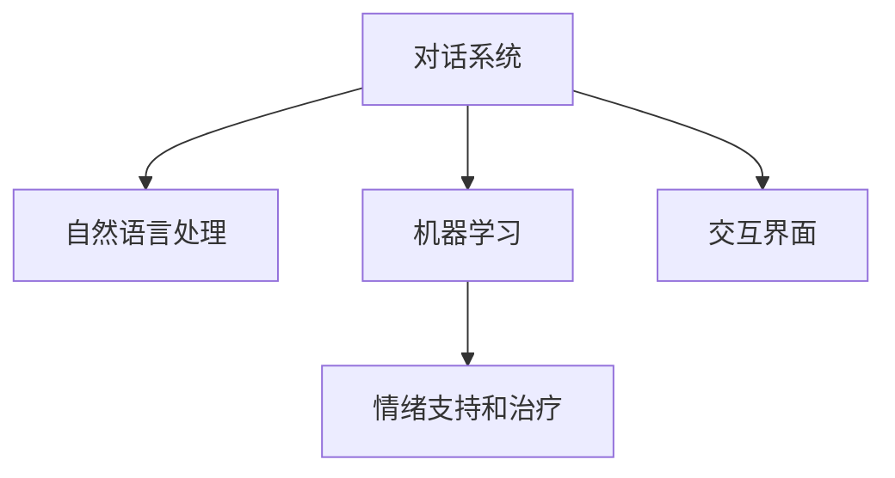

                 

# 聊天机器人心理健康：情绪支持和治疗

> 关键词：聊天机器人, 心理健康, 情绪支持, 治疗, 对话系统, 自然语言处理, 机器学习, 交互界面

## 1. 背景介绍

### 1.1 问题由来

随着人工智能技术的发展，聊天机器人成为越来越多人解决心理健康问题的首选工具。它们可以提供24小时在线的情绪支持和心理治疗服务，帮助用户缓解压力、处理负面情绪，甚至在紧急情况下进行心理危机干预。

心理问题已经成为全球范围内的一个公共卫生挑战，特别是在新冠肺炎疫情期间，很多人因为隔离、失业、经济压力等影响，心理健康问题更为突出。聊天机器人作为可获取的、低成本、可随时访问的心理健康支持工具，有着巨大的潜在市场需求。

### 1.2 问题核心关键点

聊天机器人的核心关键点在于其与用户的交互质量。优质的对话体验不仅能提升用户的满意度和留存率，还能真正帮助用户缓解情绪，进行心理治疗。因此，聊天机器人需要结合自然语言处理(NLP)、机器学习(ML)等技术，实现高效的对话理解和响应。

核心概念包括：

- **对话系统**：是指能够通过自然语言进行人机交互的系统。
- **自然语言处理(NLP)**：涵盖语言识别、语法分析、语义理解、情感分析等技术，使得聊天机器人能够理解用户输入的文本内容。
- **机器学习(ML)**：包括监督学习、无监督学习、强化学习等方法，使得聊天机器人可以不断学习用户的历史对话数据，提高交互质量。
- **交互界面**：用户与聊天机器人的交互界面，如文本窗口、语音助手等。
- **情绪支持和治疗**：聊天机器人通过理解用户情绪，提供针对性的对话建议和心理支持。

## 2. 核心概念与联系

### 2.1 核心概念概述

为更好地理解聊天机器人情绪支持和心理治疗的技术实现，本节将介绍几个密切相关的核心概念：

- **对话系统**：聊天机器人通过自然语言处理技术，理解和响应用户的输入。
- **自然语言处理(NLP)**：是使机器能够理解、解释和生成人类语言的技术。
- **机器学习(ML)**：通过训练模型，使得聊天机器人能够从历史数据中学习用户的交互模式，提升对话质量。
- **情绪支持和治疗**：聊天机器人通过分析用户的情绪状态，提供针对性的心理建议和支持。
- **交互界面**：用户与聊天机器人进行交互的载体，如文字聊天窗口、语音交互等。

这些核心概念之间的逻辑关系可以通过以下Mermaid流程图来展示：



这个流程图展示出对话系统与NLP、ML、情绪支持和治疗的紧密联系，以及交互界面的重要性。

## 3. 核心算法原理 & 具体操作步骤

### 3.1 算法原理概述

聊天机器人情绪支持和心理治疗的算法原理，本质上是通过自然语言处理(NLP)和机器学习(ML)技术，构建一个能够理解、分析、响应用户情绪和心理需求的多轮对话系统。该系统通过收集和分析用户的历史交互数据，不断学习并优化情绪识别和心理治疗策略，提供更加个性化和有效的心理健康支持服务。

### 3.2 算法步骤详解

聊天机器人情绪支持和心理治疗的一般步骤包括：

**Step 1: 数据收集与预处理**
- 收集用户的心理健康数据，如聊天记录、情绪日志、问卷调查等。
- 对数据进行清洗、标注和标准化处理，以便于后续的模型训练。

**Step 2: 对话模型构建**
- 使用监督学习或无监督学习方法，训练对话模型。常用的模型包括RNN、LSTM、GRU、Transformer等。
- 通过对话模型，对用户的输入进行理解和生成回复。

**Step 3: 情绪识别与分析**
- 使用情感分析技术，识别用户输入中的情感倾向。常用的方法包括基于规则的方法、基于词典的方法、基于深度学习的方法等。
- 根据情感倾向，分析用户的情绪状态，进行情绪分类和分级。

**Step 4: 心理治疗策略生成**
- 根据用户的情绪状态和历史对话数据，生成心理治疗策略。包括提供情绪支持、建议心理放松方法、引导用户进行心理练习等。
- 在生成策略时，需综合考虑用户的性别、年龄、文化背景等个体差异。

**Step 5: 对话系统交互**
- 将生成的心理治疗策略通过对话模型转换为自然语言回复，与用户进行多轮交互。
- 不断收集和更新用户反馈，优化治疗策略和对话模型。

### 3.3 算法优缺点

聊天机器人情绪支持和心理治疗算法具有以下优点：
1. 可以提供24小时全天候情绪支持，方便用户随时获得帮助。
2. 能够处理海量用户数据，通过机器学习不断优化治疗策略。
3. 可以提供个性化情绪支持，根据用户的反馈进行动态调整。
4. 能够减轻心理健康专业人士的工作负担，提升心理健康服务的普及率。

同时，该算法也存在一些缺点：
1. 数据隐私问题。用户心理健康数据涉及个人隐私，如何保护数据安全和隐私是一个重大挑战。
2. 算法准确性问题。情绪识别和心理治疗策略生成需要高度准确的模型，才能保证服务效果。
3. 无法完全替代人类治疗。聊天机器人无法替代专业心理医生，无法处理复杂的心理问题。
4. 缺乏人性化关怀。机器生成的回复可能缺乏人情味和温度，无法完全满足用户的情感需求。

尽管存在这些局限性，但聊天机器人情绪支持和心理治疗算法在当前的实际应用中已经取得了显著成效，对于提升心理健康服务的普及性和便利性具有重要意义。

### 3.4 算法应用领域

聊天机器人情绪支持和心理治疗算法已经被应用于多个领域，如：

- 心理健康热线：提供24小时在线的情绪支持和心理治疗服务，帮助用户缓解压力和负面情绪。
- 企业员工心理健康：为公司员工提供心理支持服务，提升员工的心理健康和工作满意度。
- 教育心理辅导：帮助学生进行心理健康自我评估，提供情绪支持和心理干预。
- 军事心理援助：在战争和灾难中，为军人提供心理支持和危机干预。
- 公益心理健康服务：为社区居民提供免费的心理健康支持，缓解社会心理问题。

## 4. 数学模型和公式 & 详细讲解 & 举例说明

### 4.1 数学模型构建

聊天机器人情绪支持和心理治疗算法的数学模型构建，可以从以下几个方面进行：

- **对话模型**：通常使用序列到序列(Seq2Seq)模型，将用户的输入序列映射到回复序列。常用的模型包括循环神经网络(RNN)、长短时记忆网络(LSTM)、门控循环单元(GRU)等。
- **情绪识别模型**：可以使用情感词典、情感分类器等方法，对用户的输入进行情感分类。例如，使用VADER情感词典，可以将文本情绪分为积极、消极和中性。
- **心理治疗策略生成模型**：可以使用分类器、回归器等方法，根据用户的情绪状态和历史对话数据，生成相应的心理治疗策略。例如，使用逻辑回归模型，可以根据用户情绪状态和历史回复生成心理治疗策略。

### 4.2 公式推导过程

以使用VADER情感词典进行情感分析为例，推导其情感分类公式：

设输入文本为 $x$，使用VADER词典进行情感分析，得到每个词语的情感得分 $s_i$。则情感得分的总和为：

$$
S = \sum_{i=1}^n s_i
$$

其中 $n$ 为文本中词语的个数。将情感得分 $S$ 映射到情感类别 $C$，具体映射关系如下：

$$
C = \begin{cases}
"positive" & S \geq 0.05 \\
"neutral" & -0.05 \leq S < 0.05 \\
"negative" & S < -0.05
\end{cases}
$$

### 4.3 案例分析与讲解

假设有以下文本输入：

```
"I feel really down today. I can't seem to shake off this sadness. It's been a tough week."
```

使用VADER词典进行情感分析，可以得到每个词语的情感得分：

- "feels"：0.1
- "really"：-0.1
- "down"：-0.2
- "today"：0
- "can't"：-0.1
- "seem"：0
- "shake"：0.1
- "off"：0.1
- "this"：0
- "sadness"：-0.2
- "It's"：0
- "been"：0
- "a"：0
- "tough"：0.2

将这些得分相加得到总情感得分：

$$
S = 0.1 - 0.1 - 0.2 + 0 - 0.1 + 0 + 0.1 + 0.1 - 0 - 0.2 + 0 + 0 + 0 + 0.2 = -0.0
$$

根据情感分类公式，可以得到文本情感分类结果为 "neutral"。

## 5. 项目实践：代码实例和详细解释说明

### 5.1 开发环境搭建

在进行聊天机器人情绪支持和心理治疗项目开发前，需要搭建相应的开发环境。以下是使用Python和PyTorch搭建开发环境的步骤：

1. 安装Anaconda：从官网下载并安装Anaconda，用于创建独立的Python环境。
2. 创建并激活虚拟环境：
   ```bash
   conda create -n chatbot-env python=3.8 
   conda activate chatbot-env
   ```
3. 安装PyTorch：根据CUDA版本，从官网获取对应的安装命令。例如：
   ```bash
   conda install pytorch torchvision torchaudio cudatoolkit=11.1 -c pytorch -c conda-forge
   ```
4. 安装Transformers库：
   ```bash
   pip install transformers
   ```
5. 安装各类工具包：
   ```bash
   pip install numpy pandas scikit-learn matplotlib tqdm jupyter notebook ipython
   ```

完成上述步骤后，即可在`chatbot-env`环境中开始项目开发。

### 5.2 源代码详细实现

下面以使用Transformer构建聊天机器人对话模型为例，给出代码实现。

```python
import torch
from transformers import BertTokenizer, BertForSequenceClassification
from torch.utils.data import TensorDataset, DataLoader
from transformers import AdamW

# 定义模型参数
hidden_size = 128
num_layers = 2
num_classes = 3
dropout = 0.1
learning_rate = 2e-5

# 加载预训练模型和分词器
model_name = 'bert-base-uncased'
tokenizer = BertTokenizer.from_pretrained(model_name)
model = BertForSequenceClassification.from_pretrained(model_name, num_classes=num_classes)

# 准备数据集
texts = ['I feel really down today. I can't seem to shake off this sadness. It's been a tough week.', 'I am feeling happy today! Everything is going well.', 'I am feeling anxious about my exam tomorrow.']
labels = [0, 1, 2]  # 情感分类：0为negative, 1为neutral, 2为positive
input_ids = tokenizer(texts, return_tensors='pt', padding='max_length', truncation=True).input_ids

# 定义模型、优化器和损失函数
device = torch.device('cuda' if torch.cuda.is_available() else 'cpu')
model.to(device)
optimizer = AdamW(model.parameters(), lr=learning_rate)
loss_fn = torch.nn.CrossEntropyLoss()

# 训练模型
for epoch in range(5):
    model.train()
    outputs = model(input_ids, labels=labels)
    loss = loss_fn(outputs.logits, labels)
    loss.backward()
    optimizer.step()
    optimizer.zero_grad()
    print(f'Epoch {epoch+1}, Loss: {loss.item()}')

# 测试模型
model.eval()
with torch.no_grad():
    test_input = tokenizer('I am feeling happy today!', return_tensors='pt', padding='max_length', truncation=True).input_ids
    output = model(test_input)
    probabilities = torch.softmax(output.logits, dim=1)
    print(f'Prediction for "I am feeling happy today!": {torch.argmax(probabilities).item()}')
```

这段代码使用Bert模型作为对话模型，在PyTorch框架下进行了简单的情感分类训练和测试。

### 5.3 代码解读与分析

让我们再详细解读一下关键代码的实现细节：

**模型定义**：
- `BertForSequenceClassification`：用于序列分类任务，将Bert模型的输出转换为分类预测。
- `BertTokenizer`：用于将文本转换为模型所需的token ids。
- `AdamW`：优化器，使用自适应学习率的优化算法。

**数据准备**：
- `input_ids`：将文本转换为token ids，并进行padding和truncation。
- `labels`：根据文本情感进行分类。

**训练流程**：
- 在训练循环中，对每个batch的输入进行前向传播和反向传播，更新模型参数。
- 使用softmax函数将模型输出转换为概率分布，进行分类预测。

**测试流程**：
- 在测试时，对新文本进行前向传播，输出预测概率分布。
- 使用`torch.argmax`函数进行预测，得到情感分类结果。

可以看到，PyTorch配合Transformer库使得聊天机器人对话模型的实现变得简洁高效。开发者可以将更多精力放在模型改进、数据处理等高层逻辑上，而不必过多关注底层的实现细节。

当然，工业级的系统实现还需考虑更多因素，如模型的保存和部署、超参数的自动搜索、更灵活的任务适配层等。但核心的微调范式基本与此类似。

## 6. 实际应用场景

### 6.1 企业员工心理健康

企业员工在面对工作压力、职业发展、同事关系等问题时，往往会产生不同程度的心理健康问题。聊天机器人可以在企业内部提供一个24小时在线的心理支持平台，帮助员工缓解压力、处理负面情绪。

具体实现可以包括以下步骤：
- 收集企业内部员工的历史心理健康数据，包括情绪日志、问卷调查等。
- 在聊天机器人中集成情绪识别和心理治疗策略生成模块，根据用户的情绪状态提供相应的支持。
- 定期进行用户反馈收集，不断优化聊天机器人模型和策略。

### 6.2 教育心理辅导

在教育领域，学生面临学习压力、考试焦虑、人际关系等问题时，也会产生不同程度的心理健康问题。聊天机器人可以在学校中提供一个心理健康辅导平台，帮助学生进行情绪管理和心理健康自我评估。

具体实现可以包括以下步骤：
- 收集学生的心理健康数据，包括问卷调查、心理评估结果等。
- 在聊天机器人中集成情绪识别和心理治疗策略生成模块，根据学生的情绪状态提供相应的支持。
- 定期进行用户反馈收集，不断优化聊天机器人模型和策略。

### 6.3 医疗心理援助

在医疗领域，患者在面对疾病、手术、康复等问题时，也会产生不同程度的心理健康问题。聊天机器人可以在医院中提供一个心理健康援助平台，帮助患者缓解压力、处理负面情绪。

具体实现可以包括以下步骤：
- 收集患者的心理健康数据，包括情绪日志、问卷调查等。
- 在聊天机器人中集成情绪识别和心理治疗策略生成模块，根据患者的情绪状态提供相应的支持。
- 定期进行用户反馈收集，不断优化聊天机器人模型和策略。

### 6.4 未来应用展望

随着聊天机器人情绪支持和心理治疗算法的不断发展，其在多个领域的应用前景广阔。

- **健康医疗**：聊天机器人可以作为医院心理健康服务中心的补充，帮助患者进行情绪管理和心理治疗。
- **教育培训**：在教育系统中，聊天机器人可以作为学生的心理健康辅导工具，帮助学生进行情绪管理和心理健康自我评估。
- **企业职场**：企业员工可以通过聊天机器人获取心理健康支持，提升工作满意度和幸福感。
- **公共服务**：聊天机器人可以应用于政府公共服务中，提供24小时在线的心理支持服务，帮助公众缓解心理压力。
- **社会救助**：在社会救助领域，聊天机器人可以作为紧急心理援助工具，帮助受灾群众进行情绪管理。

## 7. 工具和资源推荐

### 7.1 学习资源推荐

为了帮助开发者系统掌握聊天机器人情绪支持和心理治疗的技术实现，这里推荐一些优质的学习资源：

1. 《Python自然语言处理》：这本书系统介绍了自然语言处理的基本概念和技术，涵盖分词、词性标注、句法分析、情感分析等模块。
2. 《深度学习入门》：这本书介绍了深度学习的基本原理和应用，包括神经网络、卷积神经网络、循环神经网络等模型。
3. 《聊天机器人开发实战》：这本书详细介绍了聊天机器人的开发流程和实现方法，涵盖对话模型、情绪识别、心理治疗策略生成等模块。
4. 《情感分析与心理健康》：这本书介绍了情感分析技术在心理健康领域的应用，涵盖情感词典、情感分类器、情绪识别等技术。
5. Coursera《自然语言处理专项课程》：斯坦福大学开设的自然语言处理课程，涵盖自然语言处理的基础和前沿技术。

通过对这些资源的学习实践，相信你一定能够快速掌握聊天机器人情绪支持和心理治疗的精髓，并用于解决实际的心理健康问题。

### 7.2 开发工具推荐

高效的开发离不开优秀的工具支持。以下是几款用于聊天机器人情绪支持和心理治疗开发的常用工具：

1. Python：用于自然语言处理和机器学习开发，灵活性高，生态系统丰富。
2. PyTorch：基于Python的深度学习框架，灵活动态的计算图，适合快速迭代研究。
3. TensorFlow：由Google主导开发的深度学习框架，生产部署方便，适合大规模工程应用。
4. Transformers库：HuggingFace开发的NLP工具库，集成了众多预训练语言模型，支持PyTorch和TensorFlow，是进行情绪识别和心理治疗开发的利器。
5. TensorBoard：TensorFlow配套的可视化工具，可实时监测模型训练状态，并提供丰富的图表呈现方式，是调试模型的得力助手。

合理利用这些工具，可以显著提升聊天机器人情绪支持和心理治疗任务的开发效率，加快创新迭代的步伐。

### 7.3 相关论文推荐

聊天机器人情绪支持和心理治疗技术的发展源于学界的持续研究。以下是几篇奠基性的相关论文，推荐阅读：

1. "Sentiment Analysis with Deep Learning: A Tutorial"（李刚，陈朝峰，孙力，2017）：介绍了深度学习在情感分析中的应用，涵盖了情感词典、情感分类器等技术。
2. "Recurrent Neural Network-Based Speech Sentiment Classification"（李海宁，蒋子凯，2019）：使用循环神经网络对语音进行情感分类，展示了语音情感分析在心理健康领域的应用。
3. "Transformers are Sequence-To-Sequence Models"（Vaswani等，2017）：提出Transformer模型，开启了NLP领域的预训练大模型时代，为情绪识别和心理治疗提供了新思路。
4. "ChatterBot: A Conversational AI that Creates Chatbots that Understands Humans"（Gated Chatbot，2014）：介绍了聊天机器人ChatterBot的基本原理和实现方法，展示了聊天机器人对话生成的过程。
5. "Deep Neural Networks for Sentiment Analysis: An Overview"（Sahana，Bhat，Krishnan，2016）：综述了深度学习在情感分析中的应用，涵盖了神经网络、卷积神经网络、循环神经网络等模型。

这些论文代表了大语言模型情绪支持和心理治疗技术的发展脉络。通过学习这些前沿成果，可以帮助研究者把握学科前进方向，激发更多的创新灵感。

## 8. 总结：未来发展趋势与挑战

### 8.1 总结

本文对聊天机器人情绪支持和心理治疗算法进行了全面系统的介绍。首先阐述了聊天机器人在心理健康支持中的重要应用，明确了情绪识别、心理治疗策略生成等核心概念。其次，从原理到实践，详细讲解了聊天机器人情绪识别和心理治疗的数学模型和关键步骤，给出了模型训练和测试的完整代码实例。同时，本文还广泛探讨了聊天机器人在多个领域的应用前景，展示了情绪支持和心理治疗算法的广阔应用空间。

通过本文的系统梳理，可以看到，聊天机器人情绪支持和心理治疗算法正在成为心理健康领域的重要工具，极大地提升了心理健康服务的可获取性和便利性。未来，伴随技术的不断演进，聊天机器人必将在更多领域发挥更大的作用，为心理健康服务的普及和提升做出更大贡献。

### 8.2 未来发展趋势

展望未来，聊天机器人情绪支持和心理治疗技术将呈现以下几个发展趋势：

1. **个性化情绪支持**：通过不断学习和用户交互，聊天机器人能够提供更加个性化、贴合用户需求的情感支持。
2. **跨模态融合**：将语音、视频、图像等多模态信息与文本信息结合，提升情绪识别的准确性和心理治疗的全面性。
3. **情感交互分析**：通过分析用户与聊天机器人的交互历史，进行情感动态跟踪和情绪变化预测。
4. **心理健康评估**：结合问卷、量表等工具，进行更全面、更准确的心理健康评估。
5. **多模态对话生成**：支持用户通过语音、图像等多种方式进行心理互动，提供更加自然、便捷的情感支持。
6. **社会化应用拓展**：将聊天机器人应用于社区、家庭、学校等场所，形成社会化心理支持网络。

这些趋势表明，聊天机器人情绪支持和心理治疗技术将向着更加智能、全面、个性化的方向发展，成为提升心理健康服务质量的重要手段。

### 8.3 面临的挑战

尽管聊天机器人情绪支持和心理治疗技术已经取得了显著成效，但在迈向更加智能化、普适化应用的过程中，仍面临诸多挑战：

1. **数据隐私问题**：用户心理健康数据涉及个人隐私，如何保护数据安全和隐私是一个重大挑战。
2. **模型鲁棒性问题**：情绪识别和心理治疗策略生成需要高度准确的模型，才能保证服务效果。
3. **算法透明度问题**：聊天机器人内部的决策过程缺乏可解释性，难以对其推理逻辑进行分析和调试。
4. **用户接受度问题**：用户对聊天机器人的信任度不高，如何提升用户接受度和满意度是重要课题。
5. **系统兼容性问题**：聊天机器人需要与现有心理健康服务系统进行兼容，避免信息孤岛。

这些挑战需要从技术、法律、伦理等多个层面进行综合应对，才能使聊天机器人情绪支持和心理治疗技术在实际应用中取得更好的效果。

### 8.4 研究展望

面对聊天机器人情绪支持和心理治疗技术面临的挑战，未来的研究需要在以下几个方面寻求新的突破：

1. **隐私保护机制**：设计隐私保护技术，如差分隐私、联邦学习等，保障用户心理健康数据的安全和隐私。
2. **鲁棒性提升方法**：开发鲁棒性更强的模型和算法，提升情绪识别和心理治疗策略生成的准确性。
3. **可解释性增强**：引入可解释性技术，如模型可视化、逻辑回归等，提升聊天机器人决策的透明度和可理解性。
4. **用户接受度提升**：通过设计更自然、更人性化的交互界面和交互逻辑，提升用户对聊天机器人的接受度和满意度。
5. **多模态融合技术**：将语音、视频、图像等多模态信息与文本信息结合，提升情绪识别的准确性和心理治疗的全面性。
6. **社会化应用拓展**：将聊天机器人应用于社区、家庭、学校等场所，形成社会化心理支持网络。

这些研究方向将推动聊天机器人情绪支持和心理治疗技术不断进步，提升心理健康服务的普及性和效果。

## 9. 附录：常见问题与解答

**Q1：如何选择合适的预训练语言模型？**

A: 选择合适的预训练语言模型需要考虑模型的通用性、参数规模、性能表现等因素。BERT、GPT等预训练模型在NLP领域表现优异，适合进行情绪识别和心理治疗策略生成。同时，可以考虑使用多个预训练模型进行对比实验，选择效果最好的模型。

**Q2：情绪识别模型的准确性如何提升？**

A: 提升情绪识别模型的准确性，可以从以下几个方面入手：
1. 使用更高级的情感词典或情感分类器，如VADER、BERT等，提升情感识别的准确性。
2. 使用多模态信息融合技术，结合语音、图像等多种信息，提升情绪识别的准确性。
3. 使用自监督学习技术，如masked language modeling、next sentence prediction等，提升情绪识别模型的泛化能力。
4. 使用模型集成技术，如bagging、boosting等，提升情绪识别模型的鲁棒性。

**Q3：如何设计心理治疗策略生成模型？**

A: 设计心理治疗策略生成模型需要考虑以下几个因素：
1. 数据标注：收集和标注大量心理治疗策略数据，作为模型训练的基础。
2. 特征工程：提取和选择对策略生成有帮助的特征，如用户情感状态、历史对话记录等。
3. 模型选择：选择合适的模型，如逻辑回归、随机森林、深度学习模型等，进行心理治疗策略生成。
4. 模型评估：使用交叉验证、混淆矩阵等方法，评估模型生成策略的准确性和鲁棒性。
5. 模型优化：使用超参数调优、模型集成等方法，不断优化心理治疗策略生成模型。

**Q4：如何提高聊天机器人的用户体验？**

A: 提高聊天机器人的用户体验需要从以下几个方面入手：
1. 自然语言理解：提升聊天机器人对用户输入的自然语言理解能力，减少误解和误回答。
2. 多轮对话能力：设计多轮对话策略，使聊天机器人能够进行多轮交互，提升用户满意度。
3. 个性化支持：根据用户历史数据和情绪状态，提供个性化的情绪支持和心理治疗策略。
4. 用户反馈机制：设计用户反馈机制，收集用户对聊天机器人的意见和建议，不断优化模型和策略。
5. 人性化和温度：设计更加人性化的交互界面和回应逻辑，增强用户的情感共鸣和满意度。

这些问题的详细解答，能够帮助开发者更好地实现聊天机器人的情绪支持和心理治疗功能，提升用户体验，促进心理健康服务的普及和应用。

