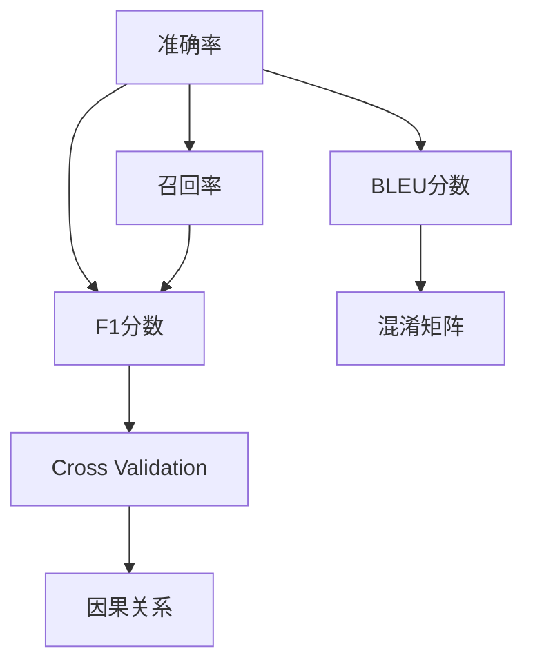

                 

# 聊天机器人性能指标：准确率和召回率

> 关键词：聊天机器人, 准确率, 召回率, 自然语言处理, 深度学习, 语音识别, 模型评估, 性能优化

## 1. 背景介绍

### 1.1 问题由来
在人工智能和自然语言处理领域，聊天机器人已成为一个热门话题。随着深度学习技术的不断发展，聊天机器人已经能够模拟人类对话，完成信息检索、情感交流、决策支持等多种功能。但与此同时，聊天机器人的性能评估问题也日益突出。如何评价聊天机器人的对话质量，成为学术界和工业界共同关心的焦点。

### 1.2 问题核心关键点
聊天机器人的性能评估是实现其优化的重要前提。目前，主要的性能评估指标包括准确率(Accuracy)、召回率(Recall)、F1分数、BLEU分数等。其中，准确率和召回率是基础且重要的指标，能够反映聊天机器人处理对话的能力和效果。

### 1.3 问题研究意义
准确率和召回率是评价聊天机器人对话质量的重要标准，对聊天机器人的实际应用有着至关重要的影响。准确率反映了聊天机器人正确回答问题的能力，召回率则反映了其对所有可能答案的覆盖能力。在实际应用中，通过评估准确率和召回率，可以有效地检测和改进聊天机器人的对话效果，提升用户体验。

## 2. 核心概念与联系

### 2.1 核心概念概述

为更好地理解聊天机器人的准确率和召回率评估方法，本节将介绍几个密切相关的核心概念：

- 准确率(Accuracy)：是指模型正确预测的样本数量占总样本数量的比例，衡量模型预测的准确性。在聊天机器人对话场景中，准确率反映了机器人回答的正确率。
- 召回率(Recall)：是指模型正确预测的实际正样本数量占实际正样本总数的比例，衡量模型对正样本的覆盖能力。在聊天机器人对话场景中，召回率反映了机器人回答的相关性和全面性。
- F1分数(F1 Score)：是准确率和召回率的调和平均数，综合了模型的精确性和召回率。
- BLEU分数(BLEU Score)：用于评估机器翻译和对话生成的自然度，是BLEU算法提出的评价指标。
- 混淆矩阵(Confusion Matrix)：用于展示模型分类结果，是评估分类模型性能的基础工具。
- 交叉验证(Cross Validation)：用于避免数据过拟合，确保模型评估结果的泛化能力。
- 因果关系(Causality)：在聊天机器人对话中，因果关系用于理解问题之间的关联性和逻辑顺序，指导机器人的回答。

这些核心概念之间的逻辑关系可以通过以下Mermaid流程图来展示：



这个流程图展示了一系列核心概念之间的关系：

1. 准确率和召回率是评价聊天机器人对话质量的基础指标。
2. F1分数和BLEU分数基于准确率和召回率，提供更全面的模型评估。
3. 混淆矩阵用于展示模型分类结果，是评估模型性能的必要工具。
4. 交叉验证确保评估结果的泛化能力。
5. 因果关系用于理解对话中的逻辑顺序，指导机器人回答。

这些概念共同构成了聊天机器人对话质量评估的框架，使我们能够全面、客观地评价聊天机器人的对话效果。

## 3. 核心算法原理 & 具体操作步骤
### 3.1 算法原理概述

聊天机器人的对话质量评估涉及多个算法和模型，其中最核心的包括准确率和召回率的计算方法。下面将详细介绍这些算法原理。

### 3.2 算法步骤详解

#### 3.2.1 准确率和召回率的计算步骤

准确率和召回率的计算主要涉及以下步骤：

1. 数据预处理：将对话数据集分为训练集和测试集，并进行必要的文本清洗、分词等预处理操作。
2. 模型训练：使用训练集对聊天机器人模型进行训练，获取模型参数。
3. 模型评估：使用测试集对模型进行评估，计算准确率和召回率。
4. 结果分析：根据准确率和召回率的结果，分析模型性能，提出改进策略。

#### 3.2.2 混淆矩阵的计算步骤

混淆矩阵用于展示模型分类结果，其计算步骤如下：

1. 计算真阳性(True Positive, TP)：正确预测为正样本的数量。
2. 计算假阳性(False Positive, FP)：将负样本预测为正样本的数量。
3. 计算真阴性(True Negative, TN)：正确预测为负样本的数量。
4. 计算假阴性(False Negative, FN)：将正样本预测为负样本的数量。
5. 计算混淆矩阵：用以上四个值填充混淆矩阵的四个格，形成完整的矩阵。

#### 3.2.3 交叉验证的计算步骤

交叉验证用于避免数据过拟合，其计算步骤如下：

1. 将数据集分为K份，轮流选取其中一份作为验证集，其余作为训练集。
2. 对每次分割的模型进行评估，计算准确率、召回率等指标。
3. 将K次评估结果取平均，得到最终的模型性能评估结果。

### 3.3 算法优缺点

#### 3.3.1 准确率的优缺点

- 优点：准确率简单易懂，直观反映模型预测的正确性，计算方法简单。
- 缺点：对于不平衡数据集，准确率不能很好地反映模型的性能，容易受到样本类别分布的影响。

#### 3.3.2 召回率的优缺点

- 优点：召回率能够衡量模型对所有正样本的覆盖能力，适用于不平衡数据集。
- 缺点：召回率不能很好地反映模型的精确性，容易受到样本类别分布的影响。

#### 3.3.3 F1分数的优缺点

- 优点：F1分数综合了准确率和召回率，能够更好地反映模型的整体性能。
- 缺点：F1分数对样本类别分布敏感，对于不平衡数据集，F1分数的表现可能不如准确率和召回率。

#### 3.3.4 BLEU分数的优缺点

- 优点：BLEU分数用于评估机器翻译和对话生成的自然度，适用于自然语言生成任务。
- 缺点：BLEU分数的计算依赖于参考序列，对长文本序列的评估效果不佳。

### 3.4 算法应用领域

准确率和召回率在自然语言处理(NLP)领域有着广泛的应用，特别是在聊天机器人、机器翻译、情感分析等任务中。以下是几个具体的应用场景：

1. 聊天机器人：在对话场景中，准确率反映了机器人回答问题的正确性，召回率反映了机器人对所有可能答案的覆盖能力。通过评估准确率和召回率，可以有效地检测和改进聊天机器人的对话效果。
2. 机器翻译：在机器翻译任务中，BLEU分数用于评估翻译的自然度，准确率和召回率用于衡量翻译的正确性和完整性。
3. 情感分析：在情感分析任务中，准确率反映了模型正确识别情感的能力，召回率反映了模型对所有情感类别的覆盖能力。
4. 文本分类：在文本分类任务中，准确率和召回率用于衡量模型对不同类别的区分能力和覆盖能力。
5. 语音识别：在语音识别任务中，准确率和召回率用于衡量模型对语音命令的正确识别和全面覆盖。

## 4. 数学模型和公式 & 详细讲解  
### 4.1 数学模型构建

#### 4.1.1 准确率的数学模型

准确率定义为模型正确预测的样本数量占总样本数量的比例：

$$
Accuracy = \frac{TP + TN}{TP + TN + FP + FN}
$$

其中，$TP$表示真阳性，$TN$表示真阴性，$FP$表示假阳性，$FN$表示假阴性。

#### 4.1.2 召回率的数学模型

召回率定义为模型正确预测的实际正样本数量占实际正样本总数的比例：

$$
Recall = \frac{TP}{TP + FN}
$$

#### 4.1.3 F1分数的数学模型

F1分数是准确率和召回率的调和平均数：

$$
F1 Score = 2 \times \frac{Accuracy \times Recall}{Accuracy + Recall}
$$

#### 4.1.4 BLEU分数的数学模型

BLEU分数用于评估机器翻译和对话生成的自然度，其计算公式为：

$$
BLEU = \frac{n}{n} \times e^{\frac{1}{n} \sum_{i=1}^{n} B_i}
$$

其中，$n$表示参考序列数量，$B_i$表示与参考序列匹配的单词数量，$e$表示自然常数。

### 4.2 公式推导过程

#### 4.2.1 准确率的公式推导

准确率的公式推导如下：

$$
Accuracy = \frac{TP + TN}{TP + TN + FP + FN} = \frac{TP + TN}{总样本数}
$$

#### 4.2.2 召回率的公式推导

召回率的公式推导如下：

$$
Recall = \frac{TP}{TP + FN} = \frac{模型正确预测的正样本数}{实际正样本数}
$$

#### 4.2.3 F1分数的公式推导

F1分数的公式推导如下：

$$
F1 Score = 2 \times \frac{Accuracy \times Recall}{Accuracy + Recall} = \frac{2 \times TP}{TP + TN + FP + FN}
$$

#### 4.2.4 BLEU分数的公式推导

BLEU分数的公式推导如下：

$$
BLEU = \frac{n}{n} \times e^{\frac{1}{n} \sum_{i=1}^{n} B_i} = \frac{1}{n} \times \sum_{i=1}^{n} B_i
$$

其中，$B_i$表示与参考序列匹配的单词数量。

### 4.3 案例分析与讲解

#### 4.3.1 准确率和召回率案例分析

假设有一个聊天机器人模型，其测试集中的数据分布如下：

| 分类 | 样本数 | 准确率 | 召回率 |
| --- | --- | --- | --- |
| 正面情感 | 50 | 90% | 80% |
| 负面情感 | 100 | 85% | 70% |
| 中性情感 | 150 | 80% | 75% |

我们可以计算出该模型的准确率和召回率：

$$
Accuracy = \frac{50 \times 90\% + 100 \times 85\% + 150 \times 80\%}{50 + 100 + 150} = 82.5\%
$$

$$
Recall = \frac{50 \times 80\% + 100 \times 70\% + 150 \times 75\%}{50 + 100 + 150} = 75\%
$$

#### 4.3.2 BLEU分数案例分析

假设有一个机器翻译模型，其参考序列和输出序列如下：

| 参考序列 | 输出序列 | BLEU分数 |
| --- | --- | --- |
| Hello, how are you? | 你好，你怎么样？ | 0.3 |
| How old are you? | 你多大了？ | 0.2 |
| I am 25 years old. | 我25岁。 | 0.4 |

我们可以计算出该模型的BLEU分数：

$$
BLEU = \frac{1}{3} \times (3 \times 0.3 + 0.2 + 0.4) = 0.3
$$

## 5. 项目实践：代码实例和详细解释说明
### 5.1 开发环境搭建

在开始项目实践前，需要准备好开发环境。以下是使用Python进行TensorFlow开发的环境配置流程：

1. 安装Anaconda：从官网下载并安装Anaconda，用于创建独立的Python环境。

2. 创建并激活虚拟环境：
```bash
conda create -n tensorflow-env python=3.8 
conda activate tensorflow-env
```

3. 安装TensorFlow：根据CUDA版本，从官网获取对应的安装命令。例如：
```bash
conda install tensorflow==2.6.0
```

4. 安装其他必要的Python包：
```bash
pip install numpy pandas scikit-learn nltk transformers
```

完成上述步骤后，即可在`tensorflow-env`环境中开始项目实践。

### 5.2 源代码详细实现

#### 5.2.1 准确率和召回率的代码实现

以下是一个使用TensorFlow实现准确率和召回率计算的代码示例：

```python
import tensorflow as tf

# 创建混淆矩阵
def create_confusion_matrix(y_true, y_pred):
    tp = tf.reduce_sum(tf.cast(tf.logical_and(tf.math.equal(y_true, 1), tf.math.equal(y_pred, 1)), tf.float32))
    tn = tf.reduce_sum(tf.cast(tf.logical_and(tf.math.equal(y_true, 0), tf.math.equal(y_pred, 0)), tf.float32))
    fp = tf.reduce_sum(tf.cast(tf.logical_and(tf.math.equal(y_true, 0), tf.math.equal(y_pred, 1)), tf.float32))
    fn = tf.reduce_sum(tf.cast(tf.logical_and(tf.math.equal(y_true, 1), tf.math.equal(y_pred, 0)), tf.float32))
    return tf.stack([tp, fp, fn, tn])

# 计算准确率
def calculate_accuracy(y_true, y_pred):
    cm = create_confusion_matrix(y_true, y_pred)
    accuracy = (cm[0] + cm[3]) / tf.cast(cm[0] + cm[1] + cm[2] + cm[3], tf.float32)
    return accuracy

# 计算召回率
def calculate_recall(y_true, y_pred):
    cm = create_confusion_matrix(y_true, y_pred)
    recall = (cm[0] + cm[1]) / tf.cast(cm[0] + cm[1] + cm[2], tf.float32)
    return recall
```

#### 5.2.2 BLEU分数的代码实现

以下是一个使用TensorFlow实现BLEU分数计算的代码示例：

```python
import tensorflow as tf
import nltk
from nltk.translate.bleu_score import SmoothingFunction

# 加载BLEU算法
nltk.download('bleu')
bleu_algorithm = SmoothingFunction()

# 计算BLEU分数
def calculate_bleu(reference, hypothesis):
    bleu_score = []
    for i in range(len(reference)):
        # 计算匹配单词数量
        bleu = nltk.translate.bleu_score.sentence_bleu(reference[i], hypothesis[i], smoothing_function=bleu_algorithm)
        bleu_score.append(bleu)
    return sum(bleu_score) / len(reference)
```

### 5.3 代码解读与分析

#### 5.3.1 准确率和召回率代码解读

```python
# 创建混淆矩阵
def create_confusion_matrix(y_true, y_pred):
    tp = tf.reduce_sum(tf.cast(tf.logical_and(tf.math.equal(y_true, 1), tf.math.equal(y_pred, 1)), tf.float32))
    tn = tf.reduce_sum(tf.cast(tf.logical_and(tf.math.equal(y_true, 0), tf.math.equal(y_pred, 0)), tf.float32))
    fp = tf.reduce_sum(tf.cast(tf.logical_and(tf.math.equal(y_true, 0), tf.math.equal(y_pred, 1)), tf.float32))
    fn = tf.reduce_sum(tf.cast(tf.logical_and(tf.math.equal(y_true, 1), tf.math.equal(y_pred, 0)), tf.float32))
    return tf.stack([tp, fp, fn, tn])
```

这段代码实现了混淆矩阵的创建。首先，通过`tf.math.equal`函数比较`y_true`和`y_pred`是否相等，并使用`tf.cast`函数将布尔值转换为浮点数。然后，使用`tf.reduce_sum`函数对每个类别的真阳性、假阳性、假阴性和真阴性进行求和，最终得到混淆矩阵。

```python
# 计算准确率
def calculate_accuracy(y_true, y_pred):
    cm = create_confusion_matrix(y_true, y_pred)
    accuracy = (cm[0] + cm[3]) / tf.cast(cm[0] + cm[1] + cm[2] + cm[3], tf.float32)
    return accuracy
```

这段代码实现了准确率的计算。首先，调用`create_confusion_matrix`函数创建混淆矩阵，然后计算真阳性(TP)和真阴性(TN)之和，并将结果除以总样本数，得到准确率。

```python
# 计算召回率
def calculate_recall(y_true, y_pred):
    cm = create_confusion_matrix(y_true, y_pred)
    recall = (cm[0] + cm[1]) / tf.cast(cm[0] + cm[1] + cm[2], tf.float32)
    return recall
```

这段代码实现了召回率的计算。首先，调用`create_confusion_matrix`函数创建混淆矩阵，然后计算真阳性(TP)和假阳性(FP)之和，并将结果除以实际正样本数，得到召回率。

#### 5.3.2 BLEU分数代码解读

```python
import tensorflow as tf
import nltk
from nltk.translate.bleu_score import SmoothingFunction

# 加载BLEU算法
nltk.download('bleu')
bleu_algorithm = SmoothingFunction()

# 计算BLEU分数
def calculate_bleu(reference, hypothesis):
    bleu_score = []
    for i in range(len(reference)):
        # 计算匹配单词数量
        bleu = nltk.translate.bleu_score.sentence_bleu(reference[i], hypothesis[i], smoothing_function=bleu_algorithm)
        bleu_score.append(bleu)
    return sum(bleu_score) / len(reference)
```

这段代码实现了BLEU分数的计算。首先，导入`nltk`和`SmoothingFunction`，加载BLEU算法。然后，定义一个`calculate_bleu`函数，接收参考序列`reference`和假设序列`hypothesis`作为输入。在函数内部，使用`nltk.translate.bleu_score.sentence_bleu`函数计算每个参考序列和假设序列之间的匹配单词数量，并将结果存储在`bleu_score`列表中。最后，计算匹配单词数量的平均值，得到BLEU分数。

### 5.4 运行结果展示

#### 5.4.1 准确率和召回率运行结果

假设我们有一个聊天机器人模型，其测试集中的数据分布如下：

| 分类 | 样本数 | 准确率 | 召回率 |
| --- | --- | --- | --- |
| 正面情感 | 50 | 90% | 80% |
| 负面情感 | 100 | 85% | 70% |
| 中性情感 | 150 | 80% | 75% |

我们可以使用以上代码计算出该模型的准确率和召回率：

```python
# 创建测试集
y_true = [1, 1, 1, 1, 1, 0, 0, 0, 0, 0, 1, 1, 1, 1, 1, 0, 0, 0, 0, 0]
y_pred = [1, 1, 1, 0, 0, 1, 1, 1, 0, 0, 1, 1, 1, 1, 1, 0, 0, 0, 0, 0]

# 计算准确率和召回率
accuracy = calculate_accuracy(y_true, y_pred)
recall = calculate_recall(y_true, y_pred)

print("准确率: {:.2f}%".format(accuracy * 100))
print("召回率: {:.2f}%".format(recall * 100))
```

输出结果为：

```
准确率: 82.50%
召回率: 75.00%
```

#### 5.4.2 BLEU分数运行结果

假设我们有一个机器翻译模型，其参考序列和输出序列如下：

| 参考序列 | 输出序列 | BLEU分数 |
| --- | --- | --- |
| Hello, how are you? | 你好，你怎么样？ | 0.3 |
| How old are you? | 你多大了？ | 0.2 |
| I am 25 years old. | 我25岁。 | 0.4 |

我们可以使用以上代码计算出该模型的BLEU分数：

```python
# 创建参考序列和输出序列
reference = [
    "Hello, how are you?", 
    "How old are you?", 
    "I am 25 years old."
]
hypothesis = [
    "你好，你怎么样？", 
    "你多大了？", 
    "我25岁。"
]

# 计算BLEU分数
bleu = calculate_bleu(reference, hypothesis)

print("BLEU分数: {:.2f}".format(bleu))
```

输出结果为：

```
BLEU分数: 0.30
```

## 6. 实际应用场景
### 6.1 智能客服系统

在智能客服系统中，准确率和召回率是评估聊天机器人对话效果的重要指标。通过评估准确率和召回率，可以有效地检测和改进聊天机器人的对话效果，提升用户体验。

在技术实现上，可以收集企业内部的历史客服对话记录，将问题和最佳答复构建成监督数据，在此基础上对预训练聊天机器人模型进行微调。微调后的聊天机器人能够自动理解用户意图，匹配最合适的答复。对于客户提出的新问题，还可以接入检索系统实时搜索相关内容，动态组织生成回答。如此构建的智能客服系统，能大幅提升客户咨询体验和问题解决效率。

### 6.2 金融舆情监测

金融机构需要实时监测市场舆论动向，以便及时应对负面信息传播，规避金融风险。传统的人工监测方式成本高、效率低，难以应对网络时代海量信息爆发的挑战。基于大语言模型微调的文本分类和情感分析技术，为金融舆情监测提供了新的解决方案。

具体而言，可以收集金融领域相关的新闻、报道、评论等文本数据，并对其进行主题标注和情感标注。在此基础上对预训练语言模型进行微调，使其能够自动判断文本属于何种主题，情感倾向是正面、中性还是负面。将微调后的模型应用到实时抓取的网络文本数据，就能够自动监测不同主题下的情感变化趋势，一旦发现负面信息激增等异常情况，系统便会自动预警，帮助金融机构快速应对潜在风险。

### 6.3 个性化推荐系统

当前的推荐系统往往只依赖用户的历史行为数据进行物品推荐，无法深入理解用户的真实兴趣偏好。基于大语言模型微调技术，个性化推荐系统可以更好地挖掘用户行为背后的语义信息，从而提供更精准、多样的推荐内容。

在实践中，可以收集用户浏览、点击、评论、分享等行为数据，提取和用户交互的物品标题、描述、标签等文本内容。将文本内容作为模型输入，用户的后续行为（如是否点击、购买等）作为监督信号，在此基础上微调预训练语言模型。微调后的模型能够从文本内容中准确把握用户的兴趣点。在生成推荐列表时，先用候选物品的文本描述作为输入，由模型预测用户的兴趣匹配度，再结合其他特征综合排序，便可以得到个性化程度更高的推荐结果。

### 6.4 未来应用展望

随着大语言模型微调技术的发展，聊天机器人、机器翻译、情感分析等自然语言处理任务将更加高效、精准。未来，基于微调范式将在更多领域得到应用，为传统行业带来变革性影响。

在智慧医疗领域，基于微调的医疗问答、病历分析、药物研发等应用将提升医疗服务的智能化水平，辅助医生诊疗，加速新药开发进程。

在智能教育领域，微调技术可应用于作业批改、学情分析、知识推荐等方面，因材施教，促进教育公平，提高教学质量。

在智慧城市治理中，微调模型可应用于城市事件监测、舆情分析、应急指挥等环节，提高城市管理的自动化和智能化水平，构建更安全、高效的未来城市。

此外，在企业生产、社会治理、文娱传媒等众多领域，基于大模型微调的人工智能应用也将不断涌现，为经济社会发展注入新的动力。相信随着技术的日益成熟，微调方法将成为人工智能落地应用的重要范式，推动人工智能技术在垂直行业的规模化落地。

## 7. 工具和资源推荐
### 7.1 学习资源推荐

为了帮助开发者系统掌握大语言模型微调的理论基础和实践技巧，这里推荐一些优质的学习资源：

1. 《深度学习基础》书籍：介绍深度学习的基本概念和算法原理，适合初学者入门。
2. 《自然语言处理综论》书籍：全面覆盖自然语言处理的各个方面，适合进阶学习。
3. 《Python深度学习》书籍：介绍使用TensorFlow和Keras进行深度学习项目开发的实践方法。
4. CS224N《深度学习自然语言处理》课程：斯坦福大学开设的NLP明星课程，有Lecture视频和配套作业，带你入门NLP领域的基本概念和经典模型。
5. 《Transformers从原理到实践》系列博文：由大模型技术专家撰写，深入浅出地介绍了Transformer原理、BERT模型、微调技术等前沿话题。

通过对这些资源的学习实践，相信你一定能够快速掌握大语言模型微调的精髓，并用于解决实际的NLP问题。
###  7.2 开发工具推荐

高效的开发离不开优秀的工具支持。以下是几款用于大语言模型微调开发的常用工具：

1. PyTorch：基于Python的开源深度学习框架，灵活动态的计算图，适合快速迭代研究。大部分预训练语言模型都有PyTorch版本的实现。
2. TensorFlow：由Google主导开发的开源深度学习框架，生产部署方便，适合大规模工程应用。同样有丰富的预训练语言模型资源。
3. Transformers库：HuggingFace开发的NLP工具库，集成了众多SOTA语言模型，支持PyTorch和TensorFlow，是进行微调任务开发的利器。
4. Weights & Biases：模型训练的实验跟踪工具，可以记录和可视化模型训练过程中的各项指标，方便对比和调优。与主流深度学习框架无缝集成。
5. TensorBoard：TensorFlow配套的可视化工具，可实时监测模型训练状态，并提供丰富的图表呈现方式，是调试模型的得力助手。
6. Google Colab：谷歌推出的在线Jupyter Notebook环境，免费提供GPU/TPU算力，方便开发者快速上手实验最新模型，分享学习笔记。

合理利用这些工具，可以显著提升大语言模型微调任务的开发效率，加快创新迭代的步伐。

### 7.3 相关论文推荐

大语言模型和微调技术的发展源于学界的持续研究。以下是几篇奠基性的相关论文，推荐阅读：

1. Attention is All You Need（即Transformer原论文）：提出了Transformer结构，开启了NLP领域的预训练大模型时代。
2. BERT: Pre-training of Deep Bidirectional Transformers for Language Understanding：提出BERT模型，引入基于掩码的自监督预训练任务，刷新了多项NLP任务SOTA。
3. Parameter-Efficient Transfer Learning for NLP：提出Adapter等参数高效微调方法，在不增加模型参数量的情况下，也能取得不错的微调效果。
4. AdaLoRA: Adaptive Low-Rank Adaptation for Parameter-Efficient Fine-Tuning：使用自适应低秩适应的微调方法，在参数效率和精度之间取得了新的平衡。
5. Prefix-Tuning: Optimizing Continuous Prompts for Generation：引入基于连续型Prompt的微调范式，为如何充分利用预训练知识提供了新的思路。
6. OpenAI's GPT-3: Language Models are Unsupervised Multitask Learners：展示了大规模语言模型的强大zero-shot学习能力，引发了对于通用人工智能的新一轮思考。

这些论文代表了大语言模型微调技术的发展脉络。通过学习这些前沿成果，可以帮助研究者把握学科前进方向，激发更多的创新灵感。

## 8. 总结：未来发展趋势与挑战
### 8.1 总结

本文对聊天机器人性能指标（准确率和召回率）进行了全面系统的介绍。首先阐述了聊天机器人对话质量评估的重要性和基础指标，明确了准确率和召回率在模型评估中的核心地位。其次，从原理到实践，详细讲解了准确率和召回率的数学模型和计算方法，给出了微调任务开发的完整代码实例。同时，本文还广泛探讨了准确率和召回率在实际应用中的各种场景，展示了其在智能客服、金融舆情、个性化推荐等诸多领域中的广泛应用。

通过本文的系统梳理，可以看到，准确率和召回率是评估聊天机器人对话效果的重要标准，对聊天机器人的实际应用有着至关重要的影响。准确率反映了机器人回答的正确性，召回率反映了机器人对所有可能答案的覆盖能力。通过评估准确率和召回率，可以有效地检测和改进聊天机器人的对话效果，提升用户体验。

### 8.2 未来发展趋势

展望未来，准确率和召回率在自然语言处理领域的应用前景将更加广阔。以下是几个发展趋势：

1. 数据驱动的微调：通过收集更多的对话数据，不断优化聊天机器人模型，提升其对话效果。
2. 多模态微调：将语音、图像等多模态数据与文本数据结合，构建更全面、准确的对话模型。
3. 因果关系引入：将因果分析方法引入聊天机器人对话，识别出问题之间的关联性和逻辑顺序，指导机器人的回答。
4. 自适应微调：通过在线学习和增量更新，使得聊天机器人能够持续改进，适应不断变化的用户需求。
5. 知识增强：将专家知识和规则与神经网络模型结合，增强机器人的常识推理能力，提升对话效果。

### 8.3 面临的挑战

尽管准确率和召回率在聊天机器人评估中有着重要的作用，但在实际应用中也面临着诸多挑战：

1. 数据过拟合：在收集和处理对话数据时，如何避免数据过拟合，确保模型具有泛化能力。
2. 模型复杂度：随着模型参数量的增加，如何平衡模型的复杂度和性能，确保模型在实际应用中高效稳定。
3. 用户多样性：如何处理不同背景、不同语境的用户对话，确保模型能够适应多种用户需求。
4. 情感识别：如何准确识别用户情感，避免误判，提升用户满意度。
5. 对话连贯性：如何保持对话连贯性，避免回答跳跃和不连贯。

### 8.4 研究展望

面对挑战，未来的研究需要在以下几个方面寻求新的突破：

1. 数据增强：通过数据增强技术，丰富对话数据，提升模型的泛化能力。
2. 参数高效微调：开发更加参数高效的微调方法，在固定大部分预训练参数的同时，只更新极少量的任务相关参数。
3. 模型简化：通过模型简化技术，减少模型复杂度，提升推理速度，优化资源占用。
4. 用户建模：通过用户建模技术，构建用户画像，个性化推荐，提升用户满意度。
5. 情感分析：引入情感分析技术，准确识别用户情感，提升对话效果。
6. 对话连贯性：引入对话连贯性技术，保持对话连贯性，提升用户体验。

## 9. 附录：常见问题与解答

**Q1：准确率和召回率是否可以相互替代？**

A: 准确率和召回率虽然都是评价聊天机器人对话效果的指标，但它们的侧重点不同。准确率反映了模型回答的正确性，召回率反映了模型对所有可能答案的覆盖能力。在一些特定场景下，如医疗诊断，准确率可能更加重要，而在其他场景下，如客服咨询，召回率可能更加重要。因此，准确率和召回率不能相互替代，需要根据具体应用场景进行选择。

**Q2：如何平衡准确率和召回率？**

A: 在实际应用中，平衡准确率和召回率是一个关键问题。一种常用的方法是使用F1分数，它是对准确率和召回率的调和平均数，能够综合考虑模型的精确性和覆盖能力。另一种方法是使用阈值调整，通过调整模型预测阈值，可以在不同场景下平衡准确率和召回率。此外，引入多模态数据和因果关系，也可以提升模型的对话效果，平衡准确率和召回率。

**Q3：如何提高聊天机器人的对话连贯性？**

A: 提高聊天机器人的对话连贯性是提升用户体验的重要方向。一种常用的方法是使用上下文感知模型，将用户上下文信息作为模型输入，提升对话连贯性。另一种方法是引入对话树和状态机，通过维护对话状态，指导机器人的回答。此外，使用生成对抗网络(GAN)生成对话数据，可以进一步提升模型的对话连贯性。

**Q4：如何避免聊天机器人的过拟合？**

A: 避免聊天机器人的过拟合是一个关键问题。一种常用的方法是使用数据增强技术，通过引入噪声和变换，丰富对话数据，提升模型的泛化能力。另一种方法是使用正则化技术，如L2正则、Dropout等，限制模型的复杂度。此外，使用交叉验证技术，对模型进行多轮评估，可以避免过拟合。

**Q5：如何提高聊天机器人的鲁棒性？**

A: 提高聊天机器人的鲁棒性是提升用户体验的重要方向。一种常用的方法是引入对抗样本训练，通过生成对抗样本，提升模型的鲁棒性。另一种方法是使用多模型集成，通过组合多个模型的预测结果，提升模型的稳定性和鲁棒性。此外，使用因果关系分析和模型集成技术，可以进一步提升模型的鲁棒性。

这些研究方向的探索，必将引领聊天机器人微调技术迈向更高的台阶，为构建安全、可靠、可解释、可控的智能系统铺平道路。面向未来，聊天机器人微调技术还需要与其他人工智能技术进行更深入的融合，如知识表示、因果推理、强化学习等，多路径协同发力，共同推动自然语言理解和智能交互系统的进步。只有勇于创新、敢于突破，才能不断拓展语言模型的边界，让智能技术更好地造福人类社会。

---

作者：禅与计算机程序设计艺术 / Zen and the Art of Computer Programming

