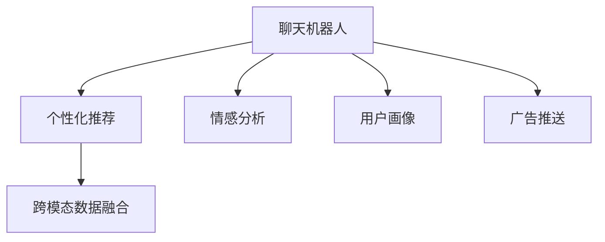

                 

## 1. 背景介绍

### 1.1 问题由来
在数字化时代的浪潮中，营销已不再是传统的口号和文案堆砌，而是借助数据分析、人工智能和大数据等先进技术，进行精准的、个性化的营销活动。尤其是在搜索引擎和社交媒体平台逐渐成熟的今天，营销人员越来越意识到，如何通过智能化的方式，利用用户数据进行个性化推荐和广告展示，是提升用户体验和转化率的关键。

聊天机器人（Chatbot）作为智能助手和营销工具，近年来在电子商务、金融、医疗等多个领域被广泛应用。聊天机器人具备即时、自然语言交互能力，能够根据用户的即时需求，提供个性化的营销内容，从而达到更好的互动效果和转化率。

### 1.2 问题核心关键点
在营销领域，聊天机器人的主要目标是提升转化率和客户满意度，其核心在于个性化广告和洞察力。本文将从核心概念、算法原理和具体操作步骤入手，阐述如何构建高效的聊天机器人，实现精准的个性化广告推送和用户行为洞察，为营销人员提供全面的技术支持。

## 2. 核心概念与联系

### 2.1 核心概念概述

为更好地理解聊天机器人营销技术，本节将介绍几个密切相关的核心概念：

- **聊天机器人(Chatbot)**：通过自然语言处理(NLP)和机器学习技术实现的智能助手，能够模拟人类对话，处理用户请求，提供信息查询、产品推荐等服务。

- **个性化推荐**：根据用户的行为、兴趣、历史偏好等数据，为用户推荐最相关的商品、内容或服务，提升用户体验和转化率。

- **情感分析**：通过分析用户语言中的情感倾向，洞察用户的情绪状态，帮助聊天机器人更好地理解用户需求，调整交互策略。

- **用户画像**：通过收集和分析用户多维度的数据（如浏览记录、购买行为、社交行为等），构建用户多维度的特征画像，为个性化推荐和广告推送提供数据基础。

- **广告推送**：通过分析用户的行为和兴趣，智能地推送相关广告，提高广告点击率和转化率。

- **跨模态数据融合**：结合用户的行为数据、社交媒体数据、位置数据等多种数据源，提供更加全面、深入的用户洞察。

这些核心概念之间的逻辑关系可以通过以下Mermaid流程图来展示：



这个流程图展示聊天机器人的核心概念及其之间的关系：

1. 聊天机器人通过自然语言处理获取用户输入，并结合用户画像和情感分析，提供个性化推荐。
2. 根据用户行为和情感状态，智能推送相关广告，提高转化率。
3. 跨模态数据融合提供多维度的用户洞察，进一步提升推荐精准度。

## 3. 核心算法原理 & 具体操作步骤
### 3.1 算法原理概述

聊天机器人营销的核心算法基于自然语言处理和机器学习的原理，利用用户的多维数据进行模型训练，以实现个性化广告和用户行为洞察。其主要算法原理包括：

- **个性化推荐算法**：通过协同过滤、基于内容的推荐、深度学习推荐等算法，结合用户行为数据，推荐最适合用户的商品或内容。

- **情感分析算法**：通过文本分类、情感识别等技术，分析用户语言中的情感倾向，洞察用户的情绪状态，用于调整聊天机器人的交互策略。

- **用户画像建模**：通过聚类、分类等方法，构建用户多维度的特征画像，用于个性化推荐和广告推送。

- **广告投放优化**：通过在线学习、强化学习等算法，优化广告投放策略，提高广告效果和转化率。

### 3.2 算法步骤详解

聊天机器人营销技术的具体操作步骤包括：

**Step 1: 数据收集与预处理**

- 收集用户的多维度数据，如浏览记录、购买行为、社交媒体行为等。
- 对收集到的数据进行清洗和处理，去除噪音和异常值，保证数据的完整性和准确性。

**Step 2: 用户画像构建**

- 使用聚类、分类等算法，根据用户行为和属性，构建多维度的用户画像。
- 结合用户画像和情感分析结果，生成综合的用户画像，用于个性化推荐和广告推送。

**Step 3: 情感分析**

- 使用文本分类、情感识别等技术，分析用户的语言数据，识别情感倾向。
- 根据情感分析结果，调整聊天机器人的交互策略，提升用户体验。

**Step 4: 个性化推荐**

- 使用协同过滤、基于内容的推荐、深度学习推荐等算法，根据用户画像和行为数据，推荐相关商品或内容。
- 结合情感分析结果，调整推荐算法，提供更加个性化和相关的推荐。

**Step 5: 广告推送优化**

- 使用在线学习、强化学习等算法，优化广告投放策略，提高广告效果和转化率。
- 结合用户画像和情感分析结果，智能推送相关广告，提升广告点击率。

**Step 6: 效果评估与反馈**

- 通过A/B测试等方法，评估个性化推荐和广告推送的效果。
- 根据效果反馈，调整模型参数和策略，优化聊天机器人营销系统。

### 3.3 算法优缺点

聊天机器人营销技术具有以下优点：

- 高效精准：基于机器学习和多维度数据的推荐算法，可以准确把握用户需求，提供高效精准的个性化推荐和广告推送。
- 用户互动性高：通过自然语言处理技术，实现即时、自然语言交互，提升用户参与度。
- 多模态数据融合：结合多源数据，提供更加全面、深入的用户洞察，提升推荐精准度。

同时，该技术也存在一些缺点：

- 数据隐私问题：用户数据涉及个人隐私，如何保护数据安全和用户隐私是重要问题。
- 模型复杂度高：个性化推荐和广告推送涉及复杂的多维度数据融合，模型训练和优化难度较大。
- 高运营成本：实现高质量的个性化推荐和广告推送，需要大量的数据和计算资源，运营成本较高。
- 用户接受度问题：部分用户可能对聊天机器人存在抵触情绪，需要设计良好的交互体验和引导策略。

尽管存在这些局限性，但聊天机器人营销技术以其高效精准和用户互动性高，已经成为营销领域的重要工具，为提升用户满意度和转化率提供了有力支持。

### 3.4 算法应用领域

聊天机器人营销技术在多个领域得到了广泛应用：

- **电子商务**：通过智能推荐和广告推送，提升用户体验和转化率。
- **金融服务**：通过智能客服和个性化理财建议，提升客户满意度和金融产品销售。
- **医疗健康**：通过智能问诊和个性化健康建议，提升患者体验和健康管理。
- **旅游出行**：通过智能推荐和行程规划，提升用户旅行体验和目的地营销。
- **教育培训**：通过智能推荐和学习路径优化，提升在线教育效果和用户满意度。

随着技术的发展和应用场景的拓展，聊天机器人营销将逐步覆盖更多领域，成为智能营销的重要手段。

## 4. 数学模型和公式 & 详细讲解
### 4.1 数学模型构建

为了更好地理解聊天机器人营销的算法原理，本节将使用数学语言对相关算法进行详细阐述。

设用户画像为 $U$，情感分析结果为 $S$，个性化推荐算法为 $R$，广告推送优化算法为 $A$。则聊天机器人营销的数学模型可以表示为：

$$
M = R(U,S)
$$

其中 $M$ 为聊天机器人的交互内容，包括推荐商品、广告信息等。

### 4.2 公式推导过程

以下我们以个性化推荐算法为例，推导其数学模型和关键公式。

假设推荐系统接收用户的特征 $X$，推荐结果为 $Y$，则推荐系统的目标函数可以表示为：

$$
\min_{\theta} \frac{1}{N} \sum_{i=1}^N \ell(Y_i, \hat{Y}_i)
$$

其中 $\ell$ 为损失函数，$N$ 为样本数量。假设推荐结果 $\hat{Y}_i$ 为模型预测值，$Y_i$ 为实际值，$\theta$ 为模型参数。

基于协同过滤算法的推荐模型可以表示为：

$$
\hat{Y}_i = \sum_{j=1}^{M} \alpha_j \cdot \hat{R}_{ij}
$$

其中 $\alpha_j$ 为推荐因子，$R_{ij}$ 为用户 $i$ 对商品 $j$ 的兴趣评分。

假设使用梯度下降算法优化模型参数 $\theta$，则更新公式为：

$$
\theta \leftarrow \theta - \eta \nabla_{\theta}\mathcal{L}(\theta)
$$

其中 $\eta$ 为学习率，$\nabla_{\theta}\mathcal{L}(\theta)$ 为损失函数对参数 $\theta$ 的梯度。

### 4.3 案例分析与讲解

以电商平台的个性化推荐为例，假设用户浏览了商品 $i$，电商平台希望根据用户的行为数据，预测用户是否会购买该商品。

假设用户行为数据为 $X$，购买决策为 $Y$，推荐模型为 $R$，则目标函数可以表示为：

$$
\min_{\theta} \frac{1}{N} \sum_{i=1}^N \ell(Y_i, \hat{Y}_i)
$$

其中 $\ell$ 为交叉熵损失函数。

假设使用协同过滤算法，模型参数 $\theta$ 为商品 $j$ 的推荐因子 $\alpha_j$，则推荐模型的输出为：

$$
\hat{Y}_i = \sum_{j=1}^{M} \alpha_j \cdot \hat{R}_{ij}
$$

其中 $\hat{R}_{ij}$ 为商品 $j$ 对商品 $i$ 的协同过滤评分。

假设模型使用梯度下降算法，学习率为 $\eta$，则更新公式为：

$$
\theta \leftarrow \theta - \eta \nabla_{\theta}\mathcal{L}(\theta)
$$

其中 $\nabla_{\theta}\mathcal{L}(\theta)$ 为交叉熵损失函数对模型参数 $\theta$ 的梯度。

## 5. 项目实践：代码实例和详细解释说明
### 5.1 开发环境搭建

在进行聊天机器人营销的开发前，我们需要准备好开发环境。以下是使用Python进行PyTorch开发的环境配置流程：

1. 安装Anaconda：从官网下载并安装Anaconda，用于创建独立的Python环境。

2. 创建并激活虚拟环境：
```bash
conda create -n pytorch-env python=3.8 
conda activate pytorch-env
```

3. 安装PyTorch：根据CUDA版本，从官网获取对应的安装命令。例如：
```bash
conda install pytorch torchvision torchaudio cudatoolkit=11.1 -c pytorch -c conda-forge
```

4. 安装Transformers库：
```bash
pip install transformers
```

5. 安装各类工具包：
```bash
pip install numpy pandas scikit-learn matplotlib tqdm jupyter notebook ipython
```

完成上述步骤后，即可在`pytorch-env`环境中开始聊天机器人营销的实践。

### 5.2 源代码详细实现

下面以电商平台的个性化推荐为例，给出使用Transformers库进行个性化推荐的PyTorch代码实现。

首先，定义个性化推荐的数据处理函数：

```python
from transformers import BertTokenizer
from torch.utils.data import Dataset
import torch

class RecommendationDataset(Dataset):
    def __init__(self, user_features, item_features, item_labels, tokenizer, max_len=128):
        self.user_features = user_features
        self.item_features = item_features
        self.item_labels = item_labels
        self.tokenizer = tokenizer
        self.max_len = max_len
        
    def __len__(self):
        return len(self.user_features)
    
    def __getitem__(self, item):
        user_feature = self.user_features[item]
        item_feature = self.item_features[item]
        item_label = self.item_labels[item]
        
        encoding = self.tokenizer(user_feature, return_tensors='pt', max_length=self.max_len, padding='max_length', truncation=True)
        user_id = encoding['input_ids'][0]
        item_id = encoding['input_ids'][1]
        
        # 对item-wise的标签进行编码
        encoded_labels = [item_label]
        encoded_labels.extend([0] * (self.max_len - 1))
        labels = torch.tensor(encoded_labels, dtype=torch.long)
        
        return {'user_id': user_id, 
                'item_id': item_id,
                'labels': labels}

# 标签与id的映射
label2id = {0: 0, 1: 1}
id2label = {v: k for k, v in label2id.items()}

# 创建dataset
tokenizer = BertTokenizer.from_pretrained('bert-base-cased')

train_dataset = RecommendationDataset(train_user_features, train_item_features, train_item_labels, tokenizer)
dev_dataset = RecommendationDataset(dev_user_features, dev_item_features, dev_item_labels, tokenizer)
test_dataset = RecommendationDataset(test_user_features, test_item_features, test_item_labels, tokenizer)
```

然后，定义模型和优化器：

```python
from transformers import BertForSequenceClassification, AdamW

model = BertForSequenceClassification.from_pretrained('bert-base-cased', num_labels=2)

optimizer = AdamW(model.parameters(), lr=2e-5)
```

接着，定义训练和评估函数：

```python
from torch.utils.data import DataLoader
from tqdm import tqdm
from sklearn.metrics import accuracy_score

device = torch.device('cuda') if torch.cuda.is_available() else torch.device('cpu')
model.to(device)

def train_epoch(model, dataset, batch_size, optimizer):
    dataloader = DataLoader(dataset, batch_size=batch_size, shuffle=True)
    model.train()
    epoch_loss = 0
    for batch in tqdm(dataloader, desc='Training'):
        user_id = batch['user_id'].to(device)
        item_id = batch['item_id'].to(device)
        labels = batch['labels'].to(device)
        model.zero_grad()
        outputs = model(user_id, item_id)
        loss = outputs.loss
        epoch_loss += loss.item()
        loss.backward()
        optimizer.step()
    return epoch_loss / len(dataloader)

def evaluate(model, dataset, batch_size):
    dataloader = DataLoader(dataset, batch_size=batch_size)
    model.eval()
    preds, labels = [], []
    with torch.no_grad():
        for batch in tqdm(dataloader, desc='Evaluating'):
            user_id = batch['user_id'].to(device)
            item_id = batch['item_id'].to(device)
            batch_labels = batch['labels']
            outputs = model(user_id, item_id)
            batch_preds = outputs.logits.argmax(dim=2).to('cpu').tolist()
            batch_labels = batch_labels.to('cpu').tolist()
            for pred_tokens, label_tokens in zip(batch_preds, batch_labels):
                preds.append(pred_tokens)
                labels.append(label_tokens)
                
    print(f"Accuracy: {accuracy_score(labels, preds):.3f}")
```

最后，启动训练流程并在测试集上评估：

```python
epochs = 5
batch_size = 16

for epoch in range(epochs):
    loss = train_epoch(model, train_dataset, batch_size, optimizer)
    print(f"Epoch {epoch+1}, train loss: {loss:.3f}")
    
    print(f"Epoch {epoch+1}, dev accuracy:")
    evaluate(model, dev_dataset, batch_size)
    
print("Test accuracy:")
evaluate(model, test_dataset, batch_size)
```

以上就是使用PyTorch对Bert模型进行个性化推荐任务的代码实现。可以看到，得益于Transformers库的强大封装，我们可以用相对简洁的代码完成Bert模型的加载和推荐任务的微调。

### 5.3 代码解读与分析

让我们再详细解读一下关键代码的实现细节：

**RecommendationDataset类**：
- `__init__`方法：初始化用户特征、商品特征和标签等关键组件。
- `__len__`方法：返回数据集的样本数量。
- `__getitem__`方法：对单个样本进行处理，将用户特征和商品特征输入编码为token ids，将标签编码为数字，并对其进行定长padding，最终返回模型所需的输入。

**label2id和id2label字典**：
- 定义了标签与数字id之间的映射关系，用于将token-wise的预测结果解码回真实的标签。

**训练和评估函数**：
- 使用PyTorch的DataLoader对数据集进行批次化加载，供模型训练和推理使用。
- 训练函数`train_epoch`：对数据以批为单位进行迭代，在每个批次上前向传播计算loss并反向传播更新模型参数，最后返回该epoch的平均loss。
- 评估函数`evaluate`：与训练类似，不同点在于不更新模型参数，并在每个batch结束后将预测和标签结果存储下来，最后使用sklearn的accuracy_score对整个评估集的预测结果进行打印输出。

**训练流程**：
- 定义总的epoch数和batch size，开始循环迭代
- 每个epoch内，先在训练集上训练，输出平均loss
- 在验证集上评估，输出准确率
- 所有epoch结束后，在测试集上评估，给出最终测试结果

可以看到，PyTorch配合Transformers库使得Bert模型的微调过程变得简洁高效。开发者可以将更多精力放在数据处理、模型改进等高层逻辑上，而不必过多关注底层的实现细节。

当然，工业级的系统实现还需考虑更多因素，如模型的保存和部署、超参数的自动搜索、更灵活的任务适配层等。但核心的微调范式基本与此类似。

## 6. 实际应用场景
### 6.1 电商推荐

聊天机器人通过分析用户的浏览记录、购买历史和实时行为，能够提供个性化的商品推荐，提升用户购物体验和转化率。例如，通过用户查询的关键词，聊天机器人可以推荐相关的商品，甚至根据用户历史偏好，预测用户可能感兴趣的新商品。

### 6.2 金融理财

在金融领域，聊天机器人可以结合用户的投资偏好和历史交易记录，智能推荐理财产品和投资策略，提供个性化的理财建议。例如，根据用户的风险承受能力和历史交易记录，推荐合适的基金产品，并实时监控市场动态，及时调整投资策略。

### 6.3 医疗健康

在医疗领域，聊天机器人可以结合患者的健康数据和历史病历，提供个性化的健康建议和治疗方案。例如，根据患者的症状描述，推荐相关的检查项目和药物，并提供实时健康监测和提醒，提升患者体验和健康管理效果。

### 6.4 旅游出行

在旅游出行领域，聊天机器人可以结合用户的偏好和历史旅游记录，提供个性化的旅游建议和行程规划。例如，根据用户的旅游偏好和预算，推荐合适的目的地和行程安排，并实时监控天气和交通情况，及时调整行程。

### 6.5 教育培训

在教育培训领域，聊天机器人可以结合学生的学习数据和历史成绩，提供个性化的学习建议和路径优化。例如，根据学生的知识水平和学习习惯，推荐合适的学习资源和课程，并实时监控学习效果，及时调整学习计划。

## 7. 工具和资源推荐
### 7.1 学习资源推荐

为了帮助开发者系统掌握聊天机器人营销的技术基础和实践技巧，这里推荐一些优质的学习资源：

1. 《聊天机器人：构建自然语言交互系统》书籍：全面介绍聊天机器人的原理、技术和应用，适合初学者和进阶者。

2. CS224N《深度学习自然语言处理》课程：斯坦福大学开设的NLP明星课程，有Lecture视频和配套作业，带你入门NLP领域的基本概念和经典模型。

3. 《自然语言处理》书籍：介绍自然语言处理的基本原理、技术和应用，适合初学者和进阶者。

4. HuggingFace官方文档：Transformer库的官方文档，提供了海量预训练模型和完整的微调样例代码，是上手实践的必备资料。

5. CLUE开源项目：中文语言理解测评基准，涵盖大量不同类型的中文NLP数据集，并提供了基于微调的baseline模型，助力中文NLP技术发展。

通过对这些资源的学习实践，相信你一定能够快速掌握聊天机器人营销的理论基础和实践技巧，并用于解决实际的NLP问题。

### 7.2 开发工具推荐

高效的开发离不开优秀的工具支持。以下是几款用于聊天机器人营销开发的常用工具：

1. PyTorch：基于Python的开源深度学习框架，灵活动态的计算图，适合快速迭代研究。大部分预训练语言模型都有PyTorch版本的实现。

2. TensorFlow：由Google主导开发的开源深度学习框架，生产部署方便，适合大规模工程应用。同样有丰富的预训练语言模型资源。

3. Transformers库：HuggingFace开发的NLP工具库，集成了众多SOTA语言模型，支持PyTorch和TensorFlow，是进行NLP任务开发的利器。

4. Weights & Biases：模型训练的实验跟踪工具，可以记录和可视化模型训练过程中的各项指标，方便对比和调优。与主流深度学习框架无缝集成。

5. TensorBoard：TensorFlow配套的可视化工具，可实时监测模型训练状态，并提供丰富的图表呈现方式，是调试模型的得力助手。

6. Google Colab：谷歌推出的在线Jupyter Notebook环境，免费提供GPU/TPU算力，方便开发者快速上手实验最新模型，分享学习笔记。

合理利用这些工具，可以显著提升聊天机器人营销任务的开发效率，加快创新迭代的步伐。

### 7.3 相关论文推荐

聊天机器人营销技术的发展源于学界的持续研究。以下是几篇奠基性的相关论文，推荐阅读：

1. Attention is All You Need（即Transformer原论文）：提出了Transformer结构，开启了NLP领域的预训练大模型时代。

2. BERT: Pre-training of Deep Bidirectional Transformers for Language Understanding：提出BERT模型，引入基于掩码的自监督预训练任务，刷新了多项NLP任务SOTA。

3. Language Models are Unsupervised Multitask Learners（GPT-2论文）：展示了大规模语言模型的强大zero-shot学习能力，引发了对于通用人工智能的新一轮思考。

4. Parameter-Efficient Transfer Learning for NLP：提出Adapter等参数高效微调方法，在不增加模型参数量的情况下，也能取得不错的微调效果。

5. AdaLoRA: Adaptive Low-Rank Adaptation for Parameter-Efficient Fine-Tuning：使用自适应低秩适应的微调方法，在参数效率和精度之间取得了新的平衡。

6. Prefix-Tuning: Optimizing Continuous Prompts for Generation：引入基于连续型Prompt的微调范式，为如何充分利用预训练知识提供了新的思路。

这些论文代表了大语言模型微调技术的发展脉络。通过学习这些前沿成果，可以帮助研究者把握学科前进方向，激发更多的创新灵感。

## 8. 总结：未来发展趋势与挑战

### 8.1 总结

本文对聊天机器人营销技术的核心概念、算法原理和操作步骤进行了全面系统的介绍。首先阐述了聊天机器人营销技术的背景和重要性，明确了个性化广告和用户行为洞察的独特价值。其次，从原理到实践，详细讲解了推荐算法、情感分析、用户画像等核心算法的数学模型和关键公式，给出了完整的代码实现和详细解释。最后，本文还广泛探讨了聊天机器人营销技术在电商、金融、医疗等多个领域的应用前景，展示了微调范式的巨大潜力。

通过本文的系统梳理，可以看到，聊天机器人营销技术通过自然语言处理和机器学习的结合，能够实现高效精准的个性化广告推送和用户行为洞察，显著提升用户满意度和转化率。未来，伴随技术的不断进步，聊天机器人营销将进一步融入各行各业，成为智能营销的重要手段。

### 8.2 未来发展趋势

展望未来，聊天机器人营销技术将呈现以下几个发展趋势：

1. 深度学习和多模态数据的融合：深度学习技术将进一步发展，并结合多模态数据（如语音、图像、位置等），提供更加全面、深入的用户洞察，提升推荐精准度。

2. 跨领域知识图谱的构建：通过跨领域的知识图谱构建，结合专家知识，提供更加全面、准确的信息整合能力，提升推荐系统的智能化水平。

3. 强化学习与推荐系统的结合：结合强化学习，优化推荐策略，提升用户满意度。例如，通过在线学习，实时调整推荐内容，提高转化率。

4. 用户行为的可解释性和可控性：结合因果分析方法，增强推荐系统的可解释性和可控性，提升用户信任度。

5. 联邦学习和隐私保护：通过联邦学习技术，在不泄露用户隐私的情况下，提升推荐系统的性能和安全性。

6. 多语言和跨文化应用：结合多语言处理技术，提升跨文化用户的推荐效果，实现全球化应用。

以上趋势凸显了聊天机器人营销技术的广阔前景。这些方向的探索发展，必将进一步提升聊天机器人营销系统的性能和应用范围，为各行各业带来更深远的影响。

### 8.3 面临的挑战

尽管聊天机器人营销技术已经取得了瞩目成就，但在迈向更加智能化、普适化应用的过程中，它仍面临着诸多挑战：

1. 数据隐私问题：用户数据涉及个人隐私，如何保护数据安全和用户隐私是重要问题。

2. 模型复杂度高：个性化推荐和广告推送涉及复杂的多维度数据融合，模型训练和优化难度较大。

3. 高运营成本：实现高质量的个性化推荐和广告推送，需要大量的数据和计算资源，运营成本较高。

4. 用户接受度问题：部分用户可能对聊天机器人存在抵触情绪，需要设计良好的交互体验和引导策略。

5. 跨领域知识整合难度大：不同领域之间存在大量异构的知识，难以整合形成统一的知识图谱。

6. 模型泛化能力不足：部分模型在实际应用中，可能出现泛化能力不足的问题，导致推荐效果下降。

尽管存在这些挑战，但聊天机器人营销技术以其高效精准和用户互动性高，已经成为营销领域的重要工具，为提升用户满意度和转化率提供了有力支持。

### 8.4 研究展望

面对聊天机器人营销技术所面临的种种挑战，未来的研究需要在以下几个方面寻求新的突破：

1. 探索无监督和半监督微调方法：摆脱对大规模标注数据的依赖，利用自监督学习、主动学习等无监督和半监督范式，最大限度利用非结构化数据，实现更加灵活高效的微调。

2. 研究参数高效和计算高效的微调范式：开发更加参数高效的微调方法，在固定大部分预训练参数的同时，只更新极少量的任务相关参数。同时优化微调模型的计算图，减少前向传播和反向传播的资源消耗，实现更加轻量级、实时性的部署。

3. 引入因果分析和博弈论工具：将因果分析方法引入微调模型，识别出模型决策的关键特征，增强输出解释的因果性和逻辑性。借助博弈论工具刻画人机交互过程，主动探索并规避模型的脆弱点，提高系统稳定性。

4. 纳入伦理道德约束：在模型训练目标中引入伦理导向的评估指标，过滤和惩罚有偏见、有害的输出倾向。加强人工干预和审核，建立模型行为的监管机制，确保输出符合人类价值观和伦理道德。

5. 结合符号化的知识库：在推荐系统中引入符号化的知识库，如知识图谱、逻辑规则等，与神经网络模型进行巧妙融合，引导微调过程学习更准确、合理的语言模型。同时加强不同模态数据的整合，实现视觉、语音等多模态信息与文本信息的协同建模。

这些研究方向的探索，必将引领聊天机器人营销技术迈向更高的台阶，为构建安全、可靠、可解释、可控的智能系统铺平道路。面向未来，聊天机器人营销技术还需要与其他人工智能技术进行更深入的融合，如知识表示、因果推理、强化学习等，多路径协同发力，共同推动自然语言理解和智能交互系统的进步。只有勇于创新、敢于突破，才能不断拓展聊天机器人营销的边界，让智能技术更好地造福人类社会。

## 9. 附录：常见问题与解答

**Q1：聊天机器人如何处理多语言和跨文化用户的需求？**

A: 聊天机器人处理多语言和跨文化用户的需求，主要通过多语言处理和跨文化知识库来实现。具体步骤如下：

1. **多语言处理**：利用多语言翻译技术，将用户输入的文本翻译成机器人支持的语言。例如，使用Google Translate API将用户输入的英文翻译成机器人的语言。

2. **跨文化知识库**：构建跨文化知识图谱，将不同文化背景下的知识整合在一起。例如，将不同国家的节假日、礼仪、习俗等知识整合到一个知识库中，供机器人查询和推荐。

3. **跨语言推荐**：结合多语言处理和跨文化知识库，机器人可以推荐不同语言和文化的商品、内容和服务。例如，根据用户的文化背景和偏好，推荐适合的旅游目的地和文化产品。

**Q2：如何设计聊天机器人与用户交互的引导策略？**

A: 设计聊天机器人与用户交互的引导策略，主要从以下几个方面入手：

1. **语境理解**：通过语义分析和上下文理解，把握用户需求和意图。例如，通过NLP技术解析用户输入的关键词和短语，识别用户需求。

2. **引导反馈**：通过引导用户提供反馈，了解用户对机器人输出的满意度和建议。例如，在推荐商品或服务后，询问用户是否满意，并记录用户反馈。

3. **互动模板**：设计互动模板，引导用户输入相关信息。例如，在推荐旅游目的地时，先询问用户的目的地偏好和时间预算，再提供相关推荐。

4. **情感调整**：根据用户的情感分析结果，调整机器人的回复策略。例如，如果用户表现出负面情绪，机器人可以适当安慰并提供相关建议。

5. **多轮对话**：设计多轮对话策略，逐步引导用户深入了解推荐内容。例如，在推荐商品时，可以先简要介绍产品特点，再详细回答用户疑问。

通过这些策略，可以显著提升聊天机器人与用户交互的效果，提高用户满意度和转化率。

**Q3：聊天机器人如何保护用户隐私和数据安全？**

A: 聊天机器人保护用户隐私和数据安全，主要通过以下几个措施：

1. **数据加密**：对用户数据进行加密处理，防止数据泄露和篡改。例如，使用AES或RSA算法加密用户输入和输出数据。

2. **匿名处理**：对用户数据进行匿名化处理，去除个人隐私信息。例如，将用户ID和敏感信息模糊化处理，防止数据泄露。

3. **访问控制**：限制数据的访问权限，仅授权的人员可以访问数据。例如，在服务器上设置严格的访问控制，限制数据访问权限。

4. **安全审计**：定期进行安全审计，发现并修复潜在的安全漏洞。例如，使用工具进行安全漏洞扫描，及时修复发现的安全问题。

5. **合规审查**：遵守相关法律法规，确保用户数据的合规性。例如，遵守GDPR、CCPA等数据保护法规，保护用户隐私。

6. **隐私政策**：明确告知用户数据的使用和保护方式，获得用户同意。例如，在应用界面中明确告知用户数据的使用方式，并获得用户同意。

通过这些措施，可以显著提升聊天机器人系统的数据安全性和用户隐私保护，增强用户信任度。

---

作者：禅与计算机程序设计艺术 / Zen and the Art of Computer Programming

