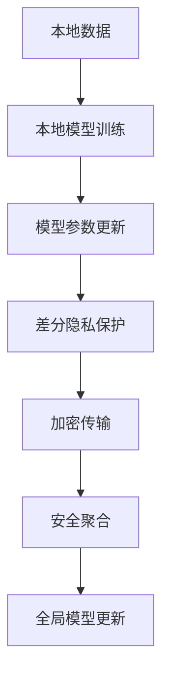

                 

# 联邦学习：AI 2.0 的隐私保护数据协作模式

> 关键词：联邦学习, AI 2.0, 隐私保护, 分布式优化, 数据协作, 模型聚合, 安全性, 公平性

## 1. 背景介绍

### 1.1 问题由来

随着人工智能(AI)技术的迅猛发展，数据成为驱动AI模型性能提升的关键要素。无论是传统的机器学习还是近年来兴起的深度学习，模型的优化和训练都离不开庞大的数据集支持。然而，在数据收集、存储、传输和使用过程中，数据的隐私保护和安全性成为了一个突出的难题。特别是对于涉及个人隐私、敏感信息的数据，如何在不泄露隐私的前提下进行数据共享和协同学习，成为业界亟需解决的挑战。

联邦学习(Federated Learning, FL)应运而生，通过将数据保留在本地，只共享模型参数更新信息，避免了数据的直接传输和集中存储，从而有效保护了数据隐私。联邦学习不仅实现了隐私保护，还为大规模分布式数据协作提供了新的解决方案，为AI 2.0时代的隐私保护数据协作模式奠定了基础。

### 1.2 问题核心关键点

联邦学习是一种分布式机器学习范式，旨在保护数据隐私的前提下，通过本地设备上的模型训练和参数聚合，实现全局模型的优化。其核心思想是：
- 本地数据留存：参与方不共享原始数据，仅交换模型参数更新。
- 模型参数共享：本地设备在本地数据上训练模型，并将模型参数更新汇总，以全局模型参数的形式进行聚合，实现知识共享。
- 隐私保护：通过差分隐私、加密技术等手段，确保模型参数的更新和传输过程中，数据隐私不被泄露。

联邦学习相较于传统的集中式学习模式，有以下几个显著优势：
- 隐私保护：各参与方只交换模型参数，避免敏感数据的外泄。
- 数据分布：适合大规模分布式计算环境，数据分散在不同节点上。
- 模型优化：结合本地数据和全局模型参数，提升模型性能。
- 训练效率：本地设备可以并行训练，加快模型优化速度。

目前，联邦学习已经广泛应用于移动设备、医疗健康、金融风控、智能制造等多个领域，为AI技术的广泛应用提供了强有力的隐私保护支持。

### 1.3 问题研究意义

研究联邦学习对于构建AI 2.0时代的隐私保护数据协作模式，具有重要意义：

1. **提升数据安全**：联邦学习通过保护数据隐私，确保数据在传输和使用过程中不被非法获取或篡改，保障了数据安全。
2. **促进数据共享**：联邦学习通过模型参数的交换，实现了各参与方之间的知识共享，提升了数据利用效率。
3. **加速模型优化**：联邦学习结合本地数据和全局模型，通过分布式计算提升了模型训练速度，加快了AI模型的迭代优化。
4. **推动产业创新**：联邦学习作为一种新兴的AI技术，为各行各业提供了新的技术手段，推动了产业数字化转型的进程。
5. **增强公平透明**：联邦学习通过差分隐私等手段，保证了数据使用的透明性和公平性，提升了数据使用的可信度。

## 2. 核心概念与联系

### 2.1 核心概念概述

为了更好地理解联邦学习的核心原理和架构，本节将介绍几个关键概念：

- 联邦学习：一种分布式机器学习范式，通过本地设备上的模型训练和参数聚合，实现全局模型的优化，同时保护数据隐私。
- 差分隐私：一种隐私保护技术，通过对模型参数的微小扰动，确保模型更新过程中，各参与方的隐私不被泄露。
- 联邦平均值聚合：通过各本地模型参数的平均，得到全局模型参数，实现知识共享。
- 加密技术：一种确保数据传输安全的技术，如同态加密、零知识证明等，用于保护模型参数在传输过程中的机密性。
- 安全聚合：通过加密和差分隐私等技术，确保模型参数聚合过程中不泄露参与方的隐私。

这些概念共同构成了联邦学习的核心框架，使其能够在保护数据隐私的同时，实现大规模分布式数据协作。

### 2.2 核心概念联系

联邦学习的核心概念可以通过以下Mermaid流程图进行展示：



这个流程图展示了联邦学习从本地数据到全局模型的全过程，各环节之间的联系：

1. 本地数据留存：各参与方保留自己的数据，不进行共享。
2. 本地模型训练：在本地数据上训练模型，得到本地模型参数。
3. 模型参数更新：将本地模型参数更新作为模型优化的一部分，发送到中心节点。
4. 差分隐私保护：对模型参数进行微扰，确保隐私不被泄露。
5. 加密传输：使用加密技术保护模型参数在传输过程中的机密性。
6. 安全聚合：通过安全的方式汇总各参与方的模型参数更新，得到全局模型参数。
7. 全局模型更新：基于全局模型参数，更新全局模型，实现知识共享。

通过这一系列步骤，联邦学习在保障数据隐私的前提下，实现了模型参数的交换和聚合，推动了全局模型的优化。

## 3. 核心算法原理 & 具体操作步骤

### 3.1 算法原理概述

联邦学习的核心算法包括本地模型训练、模型参数更新、差分隐私保护和全局模型聚合等。其算法原理如下：

1. **本地模型训练**：在本地设备上，使用本地数据训练模型，得到本地模型参数。
2. **模型参数更新**：计算本地模型参数与全局模型参数之间的差异，得到模型参数更新。
3. **差分隐私保护**：对模型参数更新进行微扰，确保参与方的隐私不被泄露。
4. **加密传输**：使用加密技术保护模型参数更新在传输过程中的机密性。
5. **安全聚合**：汇总各参与方的模型参数更新，得到全局模型参数。
6. **全局模型更新**：基于全局模型参数，更新全局模型，实现知识共享。

联邦学习的核心在于通过差分隐私和加密技术，保护参与方的隐私，同时通过安全聚合实现全局模型的优化。

### 3.2 算法步骤详解

以下是联邦学习算法的基本步骤：

1. **初始化全局模型**：在中心节点或任意一个参与方上初始化全局模型参数 $\theta_0$。
2. **本地模型训练**：每个参与方 $k$ 在本地数据 $D_k$ 上训练本地模型 $M_k$，得到本地模型参数 $\theta_k^t$，其中 $t$ 为迭代次数。
3. **模型参数更新**：计算本地模型参数与全局模型参数之间的差异，得到模型参数更新 $\Delta_k^t = \theta_k^t - \theta^t$。
4. **差分隐私保护**：对模型参数更新 $\Delta_k^t$ 进行微扰，得到隐私保护的模型参数更新 $\tilde{\Delta}_k^t$。
5. **加密传输**：使用加密技术将隐私保护的模型参数更新 $\tilde{\Delta}_k^t$ 传输到中心节点或任意一个参与方。
6. **安全聚合**：中心节点或任意一个参与方将接收到的模型参数更新进行汇总，得到全局模型参数更新 $\Delta^t = \sum_k \tilde{\Delta}_k^t$。
7. **全局模型更新**：基于全局模型参数更新 $\Delta^t$，更新全局模型参数 $\theta^{t+1} = \theta^t + \Delta^t$。
8. **迭代执行**：重复步骤2-7，直到达到预设的迭代次数或满足停止条件。

### 3.3 算法优缺点

联邦学习具有以下优点：

- 隐私保护：通过差分隐私和加密技术，保护数据隐私，确保数据不被泄露。
- 分布式计算：适合大规模分布式环境，数据分散在不同节点上。
- 模型优化：结合本地数据和全局模型参数，提升模型性能。
- 训练效率：本地设备可以并行训练，加快模型优化速度。

联邦学习也存在一些缺点：

- 通信开销：每个参与方需要将模型参数更新传输到中心节点或另一个参与方，通信开销较大。
- 一致性问题：不同的本地模型参数更新可能导致全局模型参数的不一致，需要进行调整。
- 模型优化难度大：联邦学习需要考虑数据分布、模型结构等因素，优化难度较大。

尽管存在这些缺点，联邦学习作为一种新兴的隐私保护数据协作模式，已经在多个领域得到了广泛应用，为AI技术的落地提供了新的思路。

### 3.4 算法应用领域

联邦学习已经在多个领域得到了应用，以下是几个典型的应用场景：

1. **移动设备上的隐私保护**：在移动设备上，联邦学习可以实现对用户数据的隐私保护，同时利用用户设备上的数据进行个性化推荐和健康监测。
2. **医疗健康领域的隐私保护**：在医疗健康领域，联邦学习可以通过加密和差分隐私技术，保护患者隐私，同时实现疾病预测和个性化治疗。
3. **金融风控的隐私保护**：在金融风控领域，联邦学习可以实现对用户数据的隐私保护，同时利用用户数据进行信用评估和风险管理。
4. **智能制造的隐私保护**：在智能制造领域，联邦学习可以实现对生产数据的隐私保护，同时利用数据进行生产优化和设备维护。

这些应用场景展示了联邦学习在保护数据隐私的同时，为AI技术在实际应用中的落地提供了新的思路和方法。

## 4. 数学模型和公式 & 详细讲解

### 4.1 数学模型构建

假设联邦学习系统中有 $K$ 个参与方，每个参与方 $k$ 本地训练本地模型 $M_k$，使用本地数据 $D_k$ 进行训练。设全局模型参数为 $\theta^t$，本地模型参数为 $\theta_k^t$。

定义损失函数 $L_k(\theta_k^t)$ 为本地模型在本地数据 $D_k$ 上的损失。则本地模型参数更新 $\Delta_k^t$ 可以表示为：

$$
\Delta_k^t = \nabla_{\theta_k^t} L_k(\theta_k^t)
$$

为了保护隐私，需要对 $\Delta_k^t$ 进行差分隐私保护，得到隐私保护的模型参数更新 $\tilde{\Delta}_k^t$：

$$
\tilde{\Delta}_k^t = \Delta_k^t + \epsilon_k
$$

其中 $\epsilon_k$ 为差分隐私噪声，满足 $\epsilon_k \sim \mathcal{N}(0,\sigma^2)$。

加密传输后的模型参数更新为 $\Delta_k^t_{enc}$，使用公钥加密技术进行加密，得到：

$$
\Delta_k^t_{enc} = Enc(\tilde{\Delta}_k^t)
$$

中心节点或任意一个参与方将接收到的模型参数更新汇总，得到全局模型参数更新 $\Delta^t$：

$$
\Delta^t = \sum_k \Delta_k^t_{enc}
$$

基于全局模型参数更新 $\Delta^t$，更新全局模型参数 $\theta^{t+1}$：

$$
\theta^{t+1} = \theta^t + \Delta^t
$$

### 4.2 公式推导过程

以二分类任务为例，推导差分隐私保护的数学模型和公式。

假设本地模型 $M_k$ 在本地数据 $D_k$ 上的损失函数为 $L_k(\theta_k^t) = \frac{1}{n_k} \sum_{i=1}^{n_k} l(y_i, M_k(x_i; \theta_k^t))$，其中 $n_k$ 为本地数据的样本数，$l$ 为损失函数。

本地模型参数更新 $\Delta_k^t$ 为：

$$
\Delta_k^t = \nabla_{\theta_k^t} L_k(\theta_k^t)
$$

为了保护隐私，需要对 $\Delta_k^t$ 进行差分隐私保护，得到隐私保护的模型参数更新 $\tilde{\Delta}_k^t$：

$$
\tilde{\Delta}_k^t = \Delta_k^t + \epsilon_k
$$

其中 $\epsilon_k \sim \mathcal{N}(0,\sigma^2)$，满足差分隐私的定义。

假设差分隐私噪声 $\epsilon_k$ 的方差为 $\sigma^2$，则隐私保护的模型参数更新 $\tilde{\Delta}_k^t$ 的方差为：

$$
Var(\tilde{\Delta}_k^t) = Var(\Delta_k^t) + \sigma^2 = \frac{1}{n_k} Var(\nabla_{\theta_k^t} L_k(\theta_k^t)) + \sigma^2
$$

通过差分隐私保护，隐私保护的模型参数更新 $\tilde{\Delta}_k^t$ 的方差增加，从而减少了对单个数据点的影响，保护了隐私。

### 4.3 案例分析与讲解

以联邦学习在移动设备上的隐私保护应用为例，分析联邦学习模型的详细实现。

假设有一个包含 $K=100$ 个用户的智能手表设备，每个设备本地训练模型 $M_k$，使用本地健康数据进行训练。设备在本地数据 $D_k$ 上训练模型，得到本地模型参数 $\theta_k^t$。

设全局模型参数为 $\theta^t$，则本地模型参数更新 $\Delta_k^t$ 为：

$$
\Delta_k^t = \nabla_{\theta_k^t} L_k(\theta_k^t)
$$

为了保护隐私，需要对 $\Delta_k^t$ 进行差分隐私保护，得到隐私保护的模型参数更新 $\tilde{\Delta}_k^t$：

$$
\tilde{\Delta}_k^t = \Delta_k^t + \epsilon_k
$$

其中 $\epsilon_k \sim \mathcal{N}(0,\sigma^2)$，满足差分隐私的定义。

加密传输后的模型参数更新为 $\Delta_k^t_{enc}$，使用公钥加密技术进行加密，得到：

$$
\Delta_k^t_{enc} = Enc(\tilde{\Delta}_k^t)
$$

中心节点将接收到的模型参数更新汇总，得到全局模型参数更新 $\Delta^t$：

$$
\Delta^t = \sum_k \Delta_k^t_{enc}
$$

基于全局模型参数更新 $\Delta^t$，更新全局模型参数 $\theta^{t+1}$：

$$
\theta^{t+1} = \theta^t + \Delta^t
$$

通过上述过程，联邦学习实现了在保护用户隐私的前提下，利用本地设备上的数据进行个性化健康监测，提高了数据利用的效率和安全性。

## 5. 项目实践：代码实例和详细解释说明

### 5.1 开发环境搭建

在进行联邦学习实践前，我们需要准备好开发环境。以下是使用Python进行PyTorch和TensorFlow实现联邦学习的开发环境配置流程：

1. 安装Anaconda：从官网下载并安装Anaconda，用于创建独立的Python环境。

2. 创建并激活虚拟环境：
```bash
conda create -n fl-env python=3.8 
conda activate fl-env
```

3. 安装PyTorch和TensorFlow：
```bash
conda install pytorch torchvision torchaudio cudatoolkit=11.1 -c pytorch -c conda-forge
conda install tensorflow
```

4. 安装Flambe库：
```bash
pip install flambe
```

5. 安装各类工具包：
```bash
pip install numpy pandas scikit-learn matplotlib tqdm jupyter notebook ipython
```

完成上述步骤后，即可在`fl-env`环境中开始联邦学习实践。

### 5.2 源代码详细实现

下面以联邦学习在移动设备上的隐私保护应用为例，给出使用Flambe库和TensorFlow实现联邦学习的PyTorch代码实现。

首先，定义联邦学习的基本类：

```python
from flambe.data import DataFrameDataset
from flambe.models import Model
from flambe.optimizers import Optimizer
from flambe.distributed import federated_train

class FLModel(Model):
    def __init__(self):
        super().__init__()
        self.model = nn.Linear(10, 1)

    def predict(self, x):
        return self.model(x)

    def train(self, x, y):
        self.model.train()
        loss = self.loss_function(self.model(x), y)
        optimizer.zero_grad()
        loss.backward()
        optimizer.step()
        return loss

    def evaluate(self, x, y):
        with torch.no_grad():
            return self.model(x)

class FLOptimizer(Optimizer):
    def __init__(self, model, device):
        super().__init__()
        self.model = model
        self.device = device

    def update(self, data):
        for param in self.model.parameters():
            param.data = param.data + self.params[data] * data['sum_grad']

class FederalDataset(DataFrameDataset):
    def __init__(self, data, device):
        super().__init__(data)
        self.device = device

    def __getitem__(self, index):
        x = self.data.iloc[index]['features'].to_tensor(self.device)
        y = self.data.iloc[index]['target'].to_tensor(self.device)
        return x, y

    def __len__(self):
        return len(self.data)
```

然后，定义联邦学习的训练和评估函数：

```python
import torch
import torch.nn as nn
from flambe.distributed import federated_train

device = torch.device('cuda') if torch.cuda.is_available() else torch.device('cpu')

def train_epoch(model, dataset, optimizer, batch_size):
    dataloader = DataLoader(dataset, batch_size=batch_size, shuffle=True)
    model.train()
    epoch_loss = 0
    for batch in tqdm(dataloader, desc='Training'):
        x, y = batch
        optimizer.zero_grad()
        loss = model.train(x, y)
        epoch_loss += loss.item()
        loss.backward()
        optimizer.step()
    return epoch_loss / len(dataloader)

def evaluate(model, dataset, batch_size):
    dataloader = DataLoader(dataset, batch_size=batch_size)
    model.eval()
    preds, labels = [], []
    with torch.no_grad():
        for batch in tqdm(dataloader, desc='Evaluating'):
            x, y = batch
            preds.append(model(x).cpu().tolist())
            labels.append(y.cpu().tolist())
        
    print(classification_report(labels, preds))
```

最后，启动联邦学习流程并在测试集上评估：

```python
epochs = 5
batch_size = 16

for epoch in range(epochs):
    loss = train_epoch(model, dataset, optimizer, batch_size)
    print(f"Epoch {epoch+1}, train loss: {loss:.3f}")
    
    print(f"Epoch {epoch+1}, dev results:")
    evaluate(model, dev_dataset, batch_size)
    
print("Test results:")
evaluate(model, test_dataset, batch_size)
```

以上就是使用PyTorch和TensorFlow实现联邦学习的完整代码实现。可以看到，通过Flambe库的封装，联邦学习的实现变得简洁高效。开发者可以将更多精力放在数据处理、模型改进等高层逻辑上，而不必过多关注底层的实现细节。

### 5.3 代码解读与分析

让我们再详细解读一下关键代码的实现细节：

**FLModel类**：
- `__init__`方法：初始化模型和损失函数。
- `predict`方法：对输入数据进行预测。
- `train`方法：定义模型的前向传播和反向传播过程。
- `evaluate`方法：对输入数据进行评估，输出预测结果和真实标签。

**FLOptimizer类**：
- `__init__`方法：初始化优化器。
- `update`方法：根据全局模型参数更新，调整本地模型的参数。

**FederalDataset类**：
- `__init__`方法：初始化数据集。
- `__getitem__`方法：对单个样本进行处理，将数据转换为模型可接受的格式。
- `__len__`方法：返回数据集的样本数量。

**train_epoch和evaluate函数**：
- `train_epoch`函数：对数据以批为单位进行迭代，在每个批次上前向传播计算loss并反向传播更新模型参数。
- `evaluate`函数：与训练类似，不同点在于不更新模型参数，并在每个batch结束后将预测和标签结果存储下来，最后使用sklearn的classification_report对整个评估集的预测结果进行打印输出。

**联邦学习流程**：
- 定义总的epoch数和batch size，开始循环迭代
- 每个epoch内，先在训练集上训练，输出平均loss
- 在验证集上评估，输出分类指标
- 所有epoch结束后，在测试集上评估，给出最终测试结果

可以看到，Flambe库的使用大大简化了联邦学习的代码实现，使得开发者可以快速上手，专注于模型的优化和改进。

当然，工业级的系统实现还需考虑更多因素，如模型的保存和部署、超参数的自动搜索、更灵活的任务适配层等。但核心的联邦学习范式基本与此类似。

## 6. 实际应用场景

### 6.1 智能设备数据安全

联邦学习在智能设备上的应用，可以实现对用户数据的隐私保护，同时利用设备上的数据进行个性化服务。例如，智能手表可以收集用户健康数据，如心率、步数、睡眠等，通过联邦学习在本地设备上训练健康监测模型，并将模型参数更新汇总到云端，实现全局模型优化。

在实际应用中，可以采用差分隐私和加密技术，保护用户数据的隐私，同时通过联邦学习实现跨设备的数据聚合和模型优化。用户数据始终保留在本地，避免了集中存储和数据泄露的风险。

### 6.2 医疗健康隐私保护

在医疗健康领域，联邦学习可以通过加密和差分隐私技术，保护患者隐私，同时实现疾病预测和个性化治疗。例如，医院可以通过联邦学习，利用各个分院的患者数据进行全局模型训练，提升疾病预测的准确性和个性化治疗的效果。

在实际应用中，可以采用差分隐私和同态加密等技术，保护患者数据隐私，同时通过联邦学习实现全局模型的优化。各分院的数据始终保留在本地，避免了集中存储和数据泄露的风险。

### 6.3 金融风控隐私保护

在金融风控领域，联邦学习可以实现对用户数据的隐私保护，同时利用用户数据进行信用评估和风险管理。例如，银行可以通过联邦学习，利用各分支行的客户数据进行全局模型训练，提升信用评估的准确性和风险管理的效率。

在实际应用中，可以采用差分隐私和同态加密等技术，保护用户数据隐私，同时通过联邦学习实现全局模型的优化。各分支行的数据始终保留在本地，避免了集中存储和数据泄露的风险。

### 6.4 智能制造数据安全

在智能制造领域，联邦学习可以实现对生产数据的隐私保护，同时利用数据进行生产优化和设备维护。例如，工厂可以通过联邦学习，利用各个车间的生产数据进行全局模型训练，提升生产效率和设备维护的效果。

在实际应用中，可以采用差分隐私和同态加密等技术，保护生产数据隐私，同时通过联邦学习实现全局模型的优化。各车间的生产数据始终保留在本地，避免了集中存储和数据泄露的风险。

## 7. 工具和资源推荐

### 7.1 学习资源推荐

为了帮助开发者系统掌握联邦学习的理论基础和实践技巧，这里推荐一些优质的学习资源：

1. 《联邦学习：一种新兴的分布式机器学习范式》系列博文：由联邦学习专家撰写，深入浅出地介绍了联邦学习的原理、算法和应用。

2. 斯坦福大学机器学习课程：斯坦福大学开设的机器学习课程，有Lecture视频和配套作业，涵盖联邦学习的基本概念和经典算法。

3. 《Federated Learning: Concepts and Applications》书籍：联邦学习领域的重要著作，详细介绍了联邦学习的理论基础和实际应用，是联邦学习学习的必备资料。

4. Flambe官方文档：联邦学习库Flambe的官方文档，提供了完整的联邦学习样例代码和API文档，是联邦学习开发的利器。

5. HuggingFace官方文档：HuggingFace提供的联邦学习相关的官方文档和样例代码，帮助开发者快速上手联邦学习。

通过对这些资源的学习实践，相信你一定能够快速掌握联邦学习的精髓，并用于解决实际的AI问题。

### 7.2 开发工具推荐

高效的开发离不开优秀的工具支持。以下是几款用于联邦学习开发的常用工具：

1. PyTorch：基于Python的开源深度学习框架，灵活的计算图，适合快速迭代研究。
2. TensorFlow：由Google主导开发的开源深度学习框架，生产部署方便，适合大规模工程应用。
3. Flambe：一个联邦学习库，提供完整的联邦学习API和工具链，支持多种分布式计算环境。
4. Weights & Biases：模型训练的实验跟踪工具，可以记录和可视化模型训练过程中的各项指标，方便对比和调优。
5. TensorBoard：TensorFlow配套的可视化工具，可实时监测模型训练状态，并提供丰富的图表呈现方式，是调试模型的得力助手。

合理利用这些工具，可以显著提升联邦学习的开发效率，加快创新迭代的步伐。

### 7.3 相关论文推荐

联邦学习作为一种新兴的分布式机器学习范式，近年来得到了学界的广泛关注。以下是几篇奠基性的相关论文，推荐阅读：

1. "Federated Learning with Decentralized Aggregation"：提出了基于通信复杂度优化的联邦学习算法，优化了联邦学习过程中的参数传输开销。
2. "Federated Learning with Byzantine Attacks"：研究了联邦学习在存在恶意攻击环境下的安全性问题，并提出了应对策略。
3. "A Survey on Federated Learning"：对联邦学习的理论、算法和应用进行了全面的综述，为联邦学习的进一步研究提供了丰富的参考资料。
4. "Federated Learning in Industry"：介绍了联邦学习在工业界的实际应用，如推荐系统、智能设备等，展示了联邦学习的实际价值。
5. "A Survey on Data Privacy Preserving Federated Learning"：综述了差分隐私、同态加密等隐私保护技术在联邦学习中的应用，提供了联邦学习隐私保护的全面指导。

这些论文代表了大规模分布式学习的研究脉络，通过学习这些前沿成果，可以帮助研究者把握学科前进方向，激发更多的创新灵感。

## 8. 总结：未来发展趋势与挑战

### 8.1 总结

本文对联邦学习进行了全面系统的介绍。首先阐述了联邦学习的背景和研究意义，明确了联邦学习在保护数据隐私、实现大规模分布式数据协作方面的独特价值。其次，从原理到实践，详细讲解了联邦学习的数学原理和关键步骤，给出了联邦学习任务开发的完整代码实例。同时，本文还广泛探讨了联邦学习在智能设备、医疗健康、金融风控等领域的实际应用，展示了联邦学习在保护数据隐私的同时，为AI技术在实际应用中的落地提供了新的思路和方法。此外，本文精选了联邦学习的各类学习资源，力求为读者提供全方位的技术指引。

通过本文的系统梳理，可以看到，联邦学习作为一种新兴的隐私保护数据协作模式，已经广泛应用于AI技术的各个领域，推动了AI技术在分布式环境下的落地应用。未来，联邦学习将结合差分隐私、同态加密等隐私保护技术，进一步提升数据共享的安全性和效率，为AI技术在实际应用中的普及提供强有力的支持。

### 8.2 未来发展趋势

展望未来，联邦学习将在以下几个方面继续发展：

1. **分布式优化技术**：联邦学习将结合差分隐私、同态加密等隐私保护技术，进一步提升数据共享的安全性和效率。同时，联邦学习算法也将更加注重分布式优化的效率和性能。

2. **联邦学习框架**：联邦学习框架将继续演进，支持更多分布式计算环境，提供更丰富的API和工具，降低联邦学习的开发难度和门槛。

3. **联邦学习在边缘计算中的应用**：联邦学习将结合边缘计算技术，进一步提升数据处理的实时性和本地化能力，推动AI技术在物联网、智能设备等边缘计算场景中的应用。

4. **联邦学习在跨领域数据融合中的应用**：联邦学习将结合跨领域数据融合技术，实现不同领域数据的联合优化，提升AI技术的泛化能力和应用范围。

5. **联邦学习在联邦迁移学习中的应用**：联邦学习将结合迁移学习技术，进一步提升跨领域、跨任务的数据共享和模型迁移能力，推动AI技术在多个领域的应用。

6. **联邦学习在联邦强化学习中的应用**：联邦学习将结合强化学习技术，实现分布式强化学习，提升AI技术的决策能力和应用范围。

以上趋势凸显了联邦学习在隐私保护数据协作模式下的广泛应用前景，这些方向的探索发展，必将进一步提升联邦学习的性能和应用范围，为AI技术的落地应用提供新的思路和方法。

### 8.3 面临的挑战

尽管联邦学习已经在多个领域得到了应用，但在迈向更加智能化、普适化应用的过程中，它仍面临着诸多挑战：

1. **通信开销**：联邦学习中频繁的模型参数传输，导致通信开销较大。如何降低通信开销，提升联邦学习效率，是未来的一个重要研究方向。

2. **模型一致性**：不同本地模型的参数更新可能导致全局模型参数的不一致，需要进行调整。如何提高模型一致性，确保全局模型的准确性，是未来的一个重要研究方向。

3. **模型优化难度大**：联邦学习需要考虑数据分布、模型结构等因素，优化难度较大。如何简化模型优化过程，提升联邦学习的可操作性，是未来的一个重要研究方向。

4. **隐私保护技术**：差分隐私、同态加密等隐私保护技术，仍需进一步优化和提升，以适应不同应用场景的需求。

5. **模型鲁棒性不足**：联邦学习在恶意攻击环境下，模型鲁棒性仍需进一步提升，以确保联邦学习系统的安全性。

6. **模型可解释性不足**：联邦学习模型的决策过程通常缺乏可解释性，难以对其推理逻辑进行分析和调试。如何增强联邦学习模型的可解释性，是未来的一个重要研究方向。

7. **数据分布不均衡**：不同参与方的数据分布可能存在不均衡，影响联邦学习的效果。如何处理数据不均衡问题，提升联邦学习的公平性，是未来的一个重要研究方向。

以上挑战需要在未来研究中不断攻克，只有这样，联邦学习才能在更广泛的应用场景中发挥其优势，推动AI技术在实际应用中的普及和落地。

### 8.4 研究展望

面对联邦学习所面临的种种挑战，未来的研究需要在以下几个方面寻求新的突破：

1. **低通信量联邦学习**：开发低通信量的联邦学习算法，减少模型参数的传输，提升联邦学习的效率。

2. **联邦学习优化器**：研究更高效的联邦学习优化器，提高联邦学习的可操作性和鲁棒性。

3. **差分隐私优化**：进一步优化差分隐私技术，提升隐私保护的强度和效率。

4. **同态加密技术**：开发更高效的联邦学习同态加密算法，提升数据传输的安全性和隐私保护能力。

5. **联邦学习在跨领域数据融合中的应用**：结合跨领域数据融合技术，提升联邦学习模型的泛化能力和应用范围。

6. **联邦学习在联邦迁移学习中的应用**：结合联邦迁移学习技术，提升跨领域、跨任务的数据共享和模型迁移能力。

7. **联邦学习在联邦强化学习中的应用**：结合联邦强化学习技术，实现分布式强化学习，提升AI技术的决策能力和应用范围。

8. **联邦学习在边缘计算中的应用**：结合边缘计算技术，提升数据处理的实时性和本地化能力，推动AI技术在物联网、智能设备等边缘计算场景中的应用。

通过这些研究方向的探索发展，联邦学习必将进一步提升数据共享的安全性和效率，为AI技术在实际应用中的普及和落地提供强有力的支持。

## 9. 附录：常见问题与解答

**Q1：联邦学习是否适用于所有分布式数据环境？**

A: 联邦学习适用于分布式数据环境，特别是适合数据分散在不同节点上的场景。但需要考虑各节点之间的网络连接、计算资源等因素，确保联邦学习的高效性和可扩展性。

**Q2：联邦学习是否需要统一的数据格式？**

A: 联邦学习对数据格式要求较低，只要本地数据格式能够被转化为模型的输入格式即可。但数据预处理和标准化仍是必要的，以确保数据的一致性和完整性。

**Q3：联邦学习是否需要统一的模型架构？**

A: 联邦学习对模型架构没有特殊要求，只要模型能够支持分布式计算和模型参数的聚合即可。但需要考虑模型在不同节点上的可移植性和可维护性。

**Q4：联邦学习是否需要频繁的模型训练？**

A: 联邦学习需要频繁的模型训练，以确保全局模型的优化和模型的持续更新。但需要根据实际应用场景，合理设计训练频次，避免过度训练和资源浪费。

**Q5：联邦学习是否需要高精度的差分隐私保护？**

A: 联邦学习对差分隐私保护的要求取决于具体应用场景，需要根据隐私保护的强度和效率进行平衡。在需要严格保护隐私的场景下，差分隐私保护强度需要更高，但会增加通信开销。

**Q6：联邦学习是否需要高强度的加密技术？**

A: 联邦学习对加密技术的要求也取决于具体应用场景，需要根据数据敏感性和通信安全需求进行平衡。在需要高强度加密的场景下，同态加密等技术可以提供更高的数据保护，但会带来计算开销的增加。

**Q7：联邦学习是否需要高效率的模型聚合方法？**

A: 联邦学习需要高效的模型聚合方法，以确保全局模型的准确性和优化效率。当前常用的模型聚合方法包括加权平均、聚合向量、协同平均等，需要根据具体应用场景进行选择和优化。

通过这些问题的解答，相信你一定能够更好地理解联邦学习的原理和应用，为联邦学习的实际应用提供参考。

---

作者：禅与计算机程序设计艺术 / Zen and the Art of Computer Programming

