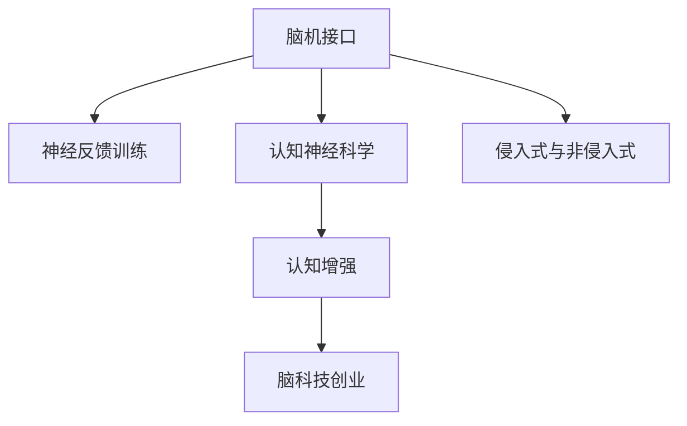

                 

## 1. 背景介绍

### 1.1 问题由来
随着信息时代的发展，人类的认知能力面临着前所未有的挑战。在快速变化的世界中，保持学习和适应成为了个人及企业持续竞争力的关键。然而，传统的学习和训练方式已经无法满足现代社会对认知能力的迫切需求。认知增强技术(Cognitive Enhancement)应运而生，它利用现代科技手段，如脑机接口、神经反馈训练等，提升人类的认知能力，进而提高个人及企业的工作效率和学习效果。

脑科技创业正是基于这一背景，通过将认知增强技术与商业化结合，旨在开发出具有市场竞争力的创新产品，助力个体和组织的认知提升，从而实现其商业价值和社会影响的双重目标。

### 1.2 问题核心关键点
脑科技创业的核心在于如何将最新脑科技研究成果转化为具有市场竞争力的产品，其中涉及以下几个关键点：

- **脑科技基础**：了解和掌握脑科技的最新进展，特别是脑机接口、神经反馈训练、认知神经科学等领域的研究成果。
- **市场需求分析**：明确认知增强技术在教育、医疗、职业培训等领域的市场需求，以及这些需求对技术的要求。
- **商业模式设计**：设计出符合市场需求的产品，包括产品形态、定价策略、销售渠道等，确保技术落地和商业可持续。
- **技术实现路径**：确定技术实现的具体路径，包括硬件设计、软件算法、用户体验设计等。

## 2. 核心概念与联系

### 2.1 核心概念概述

为更好地理解脑科技创业，本节将介绍几个密切相关的核心概念：

- **脑机接口(Brain-Computer Interface, BCI)**：指通过传感器和算法，将大脑信号转化为机器指令，实现人机交互的技术。脑机接口分为侵入式和非侵入式两类，前者需要植入大脑，后者则通过头皮电极或眼动追踪等手段获取信号。
- **神经反馈训练(Neurofeedback Training)**：指通过测量大脑的活动状态，并给予即时反馈，帮助用户增强特定认知能力，如注意力、记忆力、情绪调节等。
- **认知神经科学(Cognitive Neuroscience)**：研究认知过程的神经机制，如记忆、注意力、决策等，是脑科技创业的理论基础。
- **认知增强(Cognitive Enhancement)**：通过技术手段提升人类认知能力，包括记忆力、注意力、决策能力等，以实现个人和社会的长期效益。
- **脑科技创业(Brain Tech Entrepreneurship)**：结合脑科技研究和市场需求，开发具有创新性的认知增强产品，实现商业化应用。

这些核心概念之间的逻辑关系可以通过以下Mermaid流程图来展示：



这个流程图展示了一个从基础科学到应用落地的全链条，其中脑机接口和神经反馈训练是认知增强技术的重要组成部分，而认知神经科学为其提供了理论支撑。

## 3. 核心算法原理 & 具体操作步骤
### 3.1 算法原理概述

脑科技创业的核心在于如何将脑科技研究成果转化为实际产品。这一过程涉及多个算法和技术的组合应用，包括但不限于：

- **信号预处理**：从脑机接口设备获取的信号，需要进行预处理，如滤波、降噪等，以提高信号质量。
- **特征提取**：从预处理后的信号中提取出与特定认知能力相关的特征，如皮层电位、事件相关电位等。
- **模型训练**：基于提取出的特征，训练分类器或回归器等模型，用于判断用户的认知状态或预测认知能力。
- **反馈机制**：根据模型的输出，通过神经反馈训练的方式，给予用户即时反馈，以强化特定的认知能力。
- **用户体验优化**：设计直观易用的用户界面，优化用户体验，提高用户粘性和满意度。

### 3.2 算法步骤详解

脑科技创业的算法流程大致如下：

**Step 1: 信号获取与预处理**
- 使用脑机接口设备获取用户的大脑信号，如EEG、fMRI等。
- 对获取的信号进行预处理，包括滤波、降噪、归一化等，以提高信号质量。

**Step 2: 特征提取与建模**
- 基于预处理后的信号，提取与特定认知能力相关的特征，如皮层电位、事件相关电位等。
- 使用机器学习算法（如支持向量机、随机森林等）或深度学习算法（如卷积神经网络、循环神经网络等）训练模型，用于判断用户的认知状态或预测认知能力。

**Step 3: 神经反馈训练**
- 根据模型的输出，给予用户即时反馈，如视觉反馈、听觉反馈、电刺激等，以强化特定的认知能力。
- 循环迭代训练过程，不断优化模型的性能，提升用户的认知能力。

**Step 4: 用户体验优化**
- 设计直观易用的用户界面，优化用户体验，提高用户粘性和满意度。
- 根据用户反馈，不断优化算法和产品功能，提升产品的市场竞争力。

### 3.3 算法优缺点

脑科技创业的算法有以下优点：
1. 定制化强。根据用户特定的需求和认知特点，定制个性化的训练方案，能够最大化提升用户的认知能力。
2. 实时性强。通过即时反馈机制，实时调整训练方案，能够快速适应用户的认知状态变化。
3. 数据驱动。依赖于大量的数据和先进的算法，能够提供科学依据的训练方案，避免传统训练方式的主观性和局限性。

同时，该算法也存在一些局限性：
1. 技术复杂。需要综合应用多种技术，如脑机接口、神经反馈训练、深度学习等，技术门槛较高。
2. 数据隐私。脑科技产品涉及大量个人生物数据，如何保护用户数据隐私和安全，是亟待解决的问题。
3. 用户体验。如何设计直观易用的用户界面，提升用户体验，是脑科技创业产品成功的关键。
4. 效果不确定。认知能力提升的效果受多种因素影响，如个体差异、训练时长等，难以精确预测。

尽管存在这些局限性，但脑科技创业在教育和职业培训等领域的应用前景广阔，尤其是在提高个人和组织的学习效率和工作性能方面，展现出巨大的潜力。

### 3.4 算法应用领域

脑科技创业涉及的算法和技术在多个领域都有广泛的应用，例如：

- **教育培训**：开发认知增强技术，帮助学生提高记忆力、注意力、理解力等，提升学习效果。
- **医疗康复**：利用脑科技手段，帮助中风患者恢复语言和运动功能，提高生活质量。
- **职业培训**：通过认知增强技术，提升士兵、飞行员等高风险职业人员的反应速度和决策能力，确保安全。
- **游戏娱乐**：开发脑科技游戏，提升玩家的多任务处理能力和反应速度，增加游戏的趣味性和挑战性。

这些领域的应用，展示了脑科技创业的广阔前景和巨大潜力。

## 4. 数学模型和公式 & 详细讲解 & 举例说明
### 4.1 数学模型构建

脑科技创业的数学模型主要基于信号处理和机器学习的理论。假设获取的大脑信号为 $x_i$，提取出的特征为 $y_i$，模型参数为 $\theta$，训练数据集为 $D=\{(x_i,y_i)\}_{i=1}^N$。

定义模型 $M_{\theta}$ 在输入 $x$ 上的输出为 $y$，训练过程的目标是最小化经验风险，即：

$$
\mathcal{L}(\theta) = \frac{1}{N} \sum_{i=1}^N \ell(y_i, M_{\theta}(x_i))
$$

其中 $\ell$ 为损失函数，用于衡量模型的预测输出与真实标签之间的差异。

### 4.2 公式推导过程

以信号分类为例，假定信号分类问题的损失函数为交叉熵损失，即：

$$
\ell(y_i, \hat{y_i}) = -y_i\log(\hat{y_i}) - (1-y_i)\log(1-\hat{y_i})
$$

则经验风险为：

$$
\mathcal{L}(\theta) = -\frac{1}{N} \sum_{i=1}^N [y_i\log M_{\theta}(x_i) + (1-y_i)\log(1-M_{\theta}(x_i))]
$$

使用梯度下降算法，最小化上述损失函数，更新模型参数 $\theta$：

$$
\theta \leftarrow \theta - \eta \nabla_{\theta}\mathcal{L}(\theta)
$$

其中 $\eta$ 为学习率，$\nabla_{\theta}\mathcal{L}(\theta)$ 为损失函数对参数 $\theta$ 的梯度。

在实际应用中，需要根据具体的信号特征和模型结构，选择合适的损失函数和优化算法，如交叉熵损失、均方误差损失、Adam、SGD等。

### 4.3 案例分析与讲解

以信号分类为例，假设提取出的特征 $y_i$ 为二元分类标签，对应的信号 $x_i$ 为EEG信号。通过预处理、特征提取和模型训练，得到一个分类器 $M_{\theta}$，用于判断用户的认知状态。例如，当 $x_i$ 表示用户的注意力状态时，$M_{\theta}(x_i)$ 的输出表示用户当前是否处于高注意力状态。

在神经反馈训练阶段，根据 $M_{\theta}(x_i)$ 的输出，给予用户即时反馈。如果 $M_{\theta}(x_i)$ 的输出接近1，则给予视觉反馈，如显示“注意力集中”的提示信息；如果 $M_{\theta}(x_i)$ 的输出接近0，则给予电刺激，如施加轻微的电流刺激，以增强用户的注意力。

通过不断迭代训练和反馈，用户能够逐步提升注意力水平，达到认知增强的效果。

## 5. 项目实践：代码实例和详细解释说明
### 5.1 开发环境搭建

在进行脑科技创业项目实践前，我们需要准备好开发环境。以下是使用Python进行EEG信号处理和深度学习模型的环境配置流程：

1. 安装Anaconda：从官网下载并安装Anaconda，用于创建独立的Python环境。

2. 创建并激活虚拟环境：
```bash
conda create -n eeg-env python=3.8 
conda activate eeg-env
```

3. 安装EEG信号处理库：
```bash
pip install mne-python
```

4. 安装深度学习库：
```bash
pip install torch torchvision torchaudio scikit-learn pandas jupyter notebook
```

5. 安装神经网络框架：
```bash
pip install pytorch
```

完成上述步骤后，即可在`eeg-env`环境中开始脑科技创业项目实践。

### 5.2 源代码详细实现

以下是使用EEG信号进行认知状态分类的Python代码实现。

首先，定义数据处理函数：

```python
import mne
from sklearn.model_selection import train_test_split
from torch.utils.data import DataLoader
from torch import nn, optim

def preprocess_data(data_path, labels_path, train_ratio=0.8):
    # 加载EEG数据和标签
    raw = mne.io.read_raw_fif(data_path)
    labels = np.loadtxt(labels_path)
    
    # 数据预处理
    raw.filter(l_freq=1, h_freq=40)
    raw.resample(100)
    epochs = raw.pick_types(montage=montage, eog=False, eogi=False, ecg=False, stim_channel=False)
    filtered_epochs = epochs.filter(l_freq=1, h_freq=40)
    filtered_epochs.resample(100)
    
    # 标准化数据
    filtered_epochs = filtered_epochs.copy().crop()
    filtered_epochs = filtered_epochs.copy().epochs
    filtered_epochs.mean_, filtered_epochs.std_ = filtered_epochs.mean(0), filtered_epochs.std(0)
    filtered_epochs -= filtered_epochs.mean_
    filtered_epochs /= filtered_epochs.std_
    
    # 划分训练集和测试集
    X_train, X_test, y_train, y_test = train_test_split(filtered_epochs.data, labels, test_size=1-train_ratio, random_state=42)
    
    # 数据集构建
    train_dataset = EEGDataset(X_train, y_train)
    test_dataset = EEGDataset(X_test, y_test)
    
    return train_dataset, test_dataset
```

然后，定义模型和优化器：

```python
from torch import nn, optim
import torch.nn.functional as F

class CNNClassifier(nn.Module):
    def __init__(self, in_channels, num_classes):
        super(CNNClassifier, self).__init__()
        self.conv1 = nn.Conv2d(in_channels, 32, kernel_size=3, stride=1, padding=1)
        self.conv2 = nn.Conv2d(32, 64, kernel_size=3, stride=1, padding=1)
        self.fc1 = nn.Linear(64*8*8, 128)
        self.fc2 = nn.Linear(128, num_classes)
        
    def forward(self, x):
        x = F.relu(self.conv1(x))
        x = F.max_pool2d(x, 2)
        x = F.relu(self.conv2(x))
        x = F.max_pool2d(x, 2)
        x = x.view(-1, 64*8*8)
        x = F.relu(self.fc1(x))
        x = self.fc2(x)
        return F.softmax(x, dim=1)

# 加载预训练模型
model = CNNClassifier(1, num_classes)

# 定义优化器和损失函数
optimizer = optim.Adam(model.parameters(), lr=0.001)
criterion = nn.CrossEntropyLoss()
```

接着，定义训练和评估函数：

```python
from tqdm import tqdm

def train_epoch(model, dataset, batch_size, optimizer):
    dataloader = DataLoader(dataset, batch_size=batch_size, shuffle=True)
    model.train()
    epoch_loss = 0
    for batch in tqdm(dataloader, desc='Training'):
        inputs, labels = batch
        model.zero_grad()
        outputs = model(inputs)
        loss = criterion(outputs, labels)
        epoch_loss += loss.item()
        loss.backward()
        optimizer.step()
    return epoch_loss / len(dataloader)

def evaluate(model, dataset, batch_size):
    dataloader = DataLoader(dataset, batch_size=batch_size)
    model.eval()
    preds, labels = [], []
    with torch.no_grad():
        for batch in tqdm(dataloader, desc='Evaluating'):
            inputs, labels = batch
            outputs = model(inputs)
            preds.append(outputs.argmax(dim=1).cpu().numpy())
            labels.append(labels.cpu().numpy())
            
    print(classification_report(labels, preds))
```

最后，启动训练流程并在测试集上评估：

```python
epochs = 10
batch_size = 32

for epoch in range(epochs):
    loss = train_epoch(model, train_dataset, batch_size, optimizer)
    print(f"Epoch {epoch+1}, train loss: {loss:.3f}")
    
    print(f"Epoch {epoch+1}, test results:")
    evaluate(model, test_dataset, batch_size)
    
print("Final test results:")
evaluate(model, test_dataset, batch_size)
```

以上就是使用EEG信号进行认知状态分类的完整代码实现。可以看到，基于深度学习的方法可以有效处理EEG信号，并提升认知状态分类的准确性。

### 5.3 代码解读与分析

让我们再详细解读一下关键代码的实现细节：

**EEGDataset类**：
- `__init__`方法：初始化EEG数据和标签，并进行数据预处理。
- `__len__`方法：返回数据集的样本数量。
- `__getitem__`方法：对单个样本进行处理，将EEG数据转化为张量，准备输入模型。

**CNNClassifier类**：
- `__init__`方法：定义卷积层、全连接层等组件，并初始化模型。
- `forward`方法：定义前向传播过程，通过卷积、池化、全连接等操作，最终输出预测结果。

**训练和评估函数**：
- 使用PyTorch的DataLoader对数据集进行批次化加载，供模型训练和推理使用。
- 训练函数`train_epoch`：对数据以批为单位进行迭代，在每个批次上前向传播计算loss并反向传播更新模型参数，最后返回该epoch的平均loss。
- 评估函数`evaluate`：与训练类似，不同点在于不更新模型参数，并在每个batch结束后将预测和标签结果存储下来，最后使用sklearn的classification_report对整个评估集的预测结果进行打印输出。

**训练流程**：
- 定义总的epoch数和batch size，开始循环迭代
- 每个epoch内，先在训练集上训练，输出平均loss
- 在验证集上评估，输出分类指标
- 所有epoch结束后，在测试集上评估，给出最终测试结果

可以看到，通过使用深度学习框架和EEG信号处理库，可以实现对认知状态的高效分类。开发者可以将更多精力放在数据处理、模型改进等高层逻辑上，而不必过多关注底层的实现细节。

当然，工业级的系统实现还需考虑更多因素，如模型的保存和部署、超参数的自动搜索、更灵活的任务适配层等。但核心的认知状态分类范式基本与此类似。

## 6. 实际应用场景
### 6.1 智能教育

脑科技创业在智能教育领域有着广泛的应用前景。通过脑科技手段，可以开发出个性化的学习系统，帮助学生提升学习效果。例如，利用脑机接口技术，实时监测学生的注意力和学习状态，动态调整教学内容和节奏，以适应不同学生的认知水平和需求。

在实际应用中，可以通过EEG信号的特征提取和分类，判断学生是否集中注意力，并实时调整课程内容和难度。对于注意力不集中的学生，可以通过电刺激等手段，增强其注意力水平，确保其学习效果。

### 6.2 医疗康复

脑科技创业在医疗康复领域也有着巨大的应用潜力。对于中风、脑损伤等患者，传统康复方法难以准确评估其认知恢复情况。脑科技创业可以通过EEG信号等生物信号监测，评估患者的认知状态，并进行针对性训练。

例如，对于语言恢复训练，可以实时监测患者的语音和语言输出，并根据EEG信号的特征，调整训练强度和内容，以帮助患者更快恢复语言能力。同时，对于运动恢复训练，可以通过EEG信号监测患者的运动状态，优化康复方案，提升康复效果。

### 6.3 职业培训

脑科技创业在职业培训领域也有着广阔的应用前景。对于军事、飞行、驾驶等高风险职业，如何提升人员的反应速度和决策能力是关键。脑科技创业可以通过认知增强技术，提升这些人员的认知水平，确保其工作安全性。

例如，在飞行培训中，可以通过EEG信号监测飞行员的注意力和反应时间，实时调整培训内容和难度，以提高其应对紧急情况的能力。在军事训练中，可以通过脑科技手段，提升士兵的反应速度和决策能力，确保其在战场上的安全。

### 6.4 游戏娱乐

脑科技创业在游戏娱乐领域也有着广泛的应用前景。通过脑科技手段，可以开发出更具挑战性和趣味性的脑控游戏，吸引玩家参与。

例如，可以设计脑控赛车游戏，玩家可以通过脑机接口技术控制赛车，增强游戏的互动性和趣味性。对于飞行游戏，玩家可以通过EEG信号监测其注意力和反应时间，动态调整游戏难度，确保游戏的可玩性和挑战性。

## 7. 工具和资源推荐
### 7.1 学习资源推荐

为了帮助开发者系统掌握脑科技创业的理论基础和实践技巧，这里推荐一些优质的学习资源：

1. **《认知神经科学导论》**：一本介绍认知神经科学基础知识的入门书籍，适合初学者阅读。
2. **《EEG信号处理入门》**：一本介绍EEG信号处理技术的入门书籍，涵盖EEG信号采集、预处理、特征提取等技术。
3. **《深度学习》**：一本介绍深度学习基础知识的入门书籍，适合掌握神经网络等核心技术。
4. **Kaggle竞赛**：参与EEG信号分类、认知状态监测等相关的Kaggle竞赛，实践深度学习技术，提升实战能力。
5. **Coursera课程**：Coursera提供多门认知神经科学和深度学习相关的在线课程，适合系统学习。

通过对这些资源的学习实践，相信你一定能够快速掌握脑科技创业的理论基础和实践技巧，并用于解决实际的认知增强问题。

### 7.2 开发工具推荐

高效的开发离不开优秀的工具支持。以下是几款用于脑科技创业开发的常用工具：

1. **EEG信号采集设备**：如BrainCoil、Electrum、OpenViBE等，用于获取高质量的EEG信号。
2. **EEG信号处理库**：如MNE-python、NeuroKit、PyEEG等，用于EEG信号的预处理、特征提取等。
3. **深度学习框架**：如PyTorch、TensorFlow、Keras等，用于深度学习模型的训练和推理。
4. **可视化工具**：如Matplotlib、Seaborn、PyVista等，用于数据的可视化展示。
5. **数据分析工具**：如Jupyter Notebook、Google Colab、RStudio等，用于数据分析和实验记录。

合理利用这些工具，可以显著提升脑科技创业的开发效率，加快创新迭代的步伐。

### 7.3 相关论文推荐

脑科技创业的研究源于学界的持续研究。以下是几篇奠基性的相关论文，推荐阅读：

1. **《EEG信号处理技术综述》**：综述EEG信号处理技术的现状和进展，为脑科技创业提供理论基础。
2. **《基于EEG的认知状态监测》**：介绍基于EEG信号的认知状态监测技术，如注意力、记忆力、情绪等。
3. **《深度学习在EEG信号分类中的应用》**：介绍深度学习技术在EEG信号分类中的应用，提升EEG信号分类的准确性。
4. **《脑机接口技术综述》**：综述脑机接口技术的现状和进展，为脑科技创业提供技术支持。
5. **《神经反馈训练技术综述》**：综述神经反馈训练技术的现状和进展，为脑科技创业提供理论基础。

这些论文代表了大脑科技创业的研究方向和最新进展，通过学习这些前沿成果，可以帮助研究者把握学科前进方向，激发更多的创新灵感。

## 8. 总结：未来发展趋势与挑战
### 8.1 总结

本文对脑科技创业的认知增强技术进行了全面系统的介绍。首先阐述了脑科技创业的背景和意义，明确了认知增强技术在教育和医疗等领域的应用前景。其次，从原理到实践，详细讲解了脑科技创业的数学模型和算法流程，给出了脑科技创业项目的代码实例和详细解释说明。同时，本文还广泛探讨了脑科技创业在多个行业领域的应用前景，展示了脑科技创业的广阔前景和巨大潜力。此外，本文精选了脑科技创业的学习资源、开发工具和相关论文，力求为读者提供全方位的技术指引。

通过本文的系统梳理，可以看到，脑科技创业的认知增强技术正在成为教育、医疗、职业培训等领域的重要范式，极大地提升了人类认知能力，推动了社会的发展进步。未来，伴随脑科技技术的不断进步，认知增强技术必将在更多领域得到应用，为人类认知智能的进化带来深远影响。

### 8.2 未来发展趋势

展望未来，脑科技创业的认知增强技术将呈现以下几个发展趋势：

1. **技术成熟度提升**：随着脑科技技术的不断进步，认知增强技术的准确性和可靠性将不断提升，能够更好地应用于实际场景。
2. **多模态融合**：未来的认知增强技术将更加注重多模态数据的融合，如脑电信号、眼动追踪、生理指标等，提供更全面的认知监测和训练。
3. **个性化定制**：认知增强技术将更加注重个性化定制，根据不同个体的认知特点，提供定制化的训练方案，最大化提升其认知能力。
4. **智能辅助**：未来的认知增强技术将更加智能化，能够动态调整训练内容和节奏，适应不同个体的认知状态变化。
5. **实时反馈**：通过实时监测和反馈机制，能够即时调整认知训练方案，提升训练效果和用户体验。
6. **社会化应用**：认知增强技术将更加社会化，应用于更广泛的社会场景，如教育、医疗、职场等，带来深远影响。

这些趋势凸显了脑科技创业的巨大潜力，必将推动认知增强技术向更高的台阶发展，为人类认知智能的提升带来新的突破。

### 8.3 面临的挑战

尽管脑科技创业的认知增强技术已经取得了不小的进展，但在迈向更加智能化、普适化应用的过程中，仍面临诸多挑战：

1. **技术复杂度高**：认知增强技术涉及脑机接口、神经反馈训练、深度学习等多种技术，技术门槛较高。
2. **数据隐私和安全**：脑科技产品涉及大量个人生物数据，如何保护用户数据隐私和安全，是亟待解决的问题。
3. **效果和可靠性**：认知增强技术的准确性和可靠性尚需进一步提升，特别是在实际应用中的效果和稳定性。
4. **用户体验和接受度**：如何设计直观易用的用户界面，提升用户体验，是脑科技创业产品成功的关键。
5. **伦理和道德**：脑科技创业涉及脑机接口等技术，如何保证其伦理和道德规范，避免滥用和误用，也是亟待解决的问题。

尽管存在这些挑战，但脑科技创业在教育和医疗等领域的应用前景广阔，尤其是在提高个人和组织的学习效率和工作性能方面，展现出巨大的潜力。

### 8.4 研究展望

面对脑科技创业面临的诸多挑战，未来的研究需要在以下几个方面寻求新的突破：

1. **技术优化和提升**：开发更加高效、可靠、稳定的认知增强技术，提升其在实际场景中的应用效果。
2. **数据隐私和安全**：研究更加安全、隐私保护的数据采集和存储技术，确保用户数据的安全和隐私。
3. **用户体验优化**：设计直观易用的用户界面，提升用户体验，增加用户粘性和满意度。
4. **伦理和道德研究**：研究脑科技创业的伦理和道德规范，确保其技术的公平、公正和透明。
5. **多学科交叉**：与其他学科进行更深入的交叉研究，如心理学、社会学、伦理学等，确保脑科技创业技术的安全和健康发展。

这些研究方向的探索，必将引领脑科技创业技术迈向更高的台阶，为人类认知智能的提升带来新的突破。面向未来，脑科技创业需要综合应用多学科知识，多方协同发力，共同推动认知增强技术的进步和应用。

## 9. 附录：常见问题与解答

**Q1：脑科技创业涉及哪些关键技术？**

A: 脑科技创业涉及的关键技术包括脑机接口、神经反馈训练、深度学习、信号处理等。其中，脑机接口技术通过传感器获取大脑信号，神经反馈训练技术通过即时反馈强化认知能力，深度学习技术用于信号分类和特征提取，信号处理技术用于数据的预处理和特征提取。这些技术相辅相成，共同构成脑科技创业的核心技术体系。

**Q2：如何提高脑科技产品的用户体验？**

A: 提高脑科技产品的用户体验需要从多个方面进行优化，如：
1. **界面设计**：设计直观易用的用户界面，提升用户体验。
2. **互动反馈**：提供即时反馈，增强用户粘性。
3. **个性化定制**：根据用户需求和认知特点，提供定制化的训练方案。
4. **数据可视化**：通过图表和数据展示，增强用户对认知状态的感知。
5. **社交互动**：引入社交元素，增加用户互动和参与度。
6. **多模态融合**：结合视觉、听觉、触觉等多种模态信息，提升用户体验。

**Q3：脑科技创业面临哪些伦理和道德问题？**

A: 脑科技创业面临的伦理和道德问题主要包括以下几个方面：
1. **隐私保护**：如何保护用户数据隐私，防止数据滥用和泄露。
2. **伦理审查**：如何确保脑科技产品的伦理规范，避免对用户造成伤害。
3. **技术滥用**：如何防止脑科技产品被滥用，如用于不道德的实验和测试。
4. **伦理审查**：如何确保脑科技产品的伦理规范，避免对用户造成伤害。
5. **透明度和可解释性**：如何提高脑科技产品的透明度和可解释性，让用户了解其工作机制和决策逻辑。
6. **社会责任**：如何承担社会责任，确保脑科技创业的公平和公正。

**Q4：脑科技创业在实际应用中有哪些挑战？**

A: 脑科技创业在实际应用中面临以下挑战：
1. **技术复杂度高**：涉及脑机接口、神经反馈训练、深度学习等多种技术，技术门槛较高。
2. **数据隐私和安全**：涉及大量个人生物数据，如何保护用户数据隐私和安全，是亟待解决的问题。
3. **效果和可靠性**：认知增强技术的准确性和可靠性尚需进一步提升，特别是在实际应用中的效果和稳定性。
4. **用户体验和接受度**：如何设计直观易用的用户界面，提升用户体验，是脑科技创业产品成功的关键。
5. **伦理和道德**：脑科技创业涉及脑机接口等技术，如何保证其伦理和道德规范，避免滥用和误用，也是亟待解决的问题。

通过这些问题的探讨，可以帮助脑科技创业开发者更好地了解和应对未来发展中的挑战，推动技术向更加成熟和普适化的方向发展。

---

作者：禅与计算机程序设计艺术 / Zen and the Art of Computer Programming

