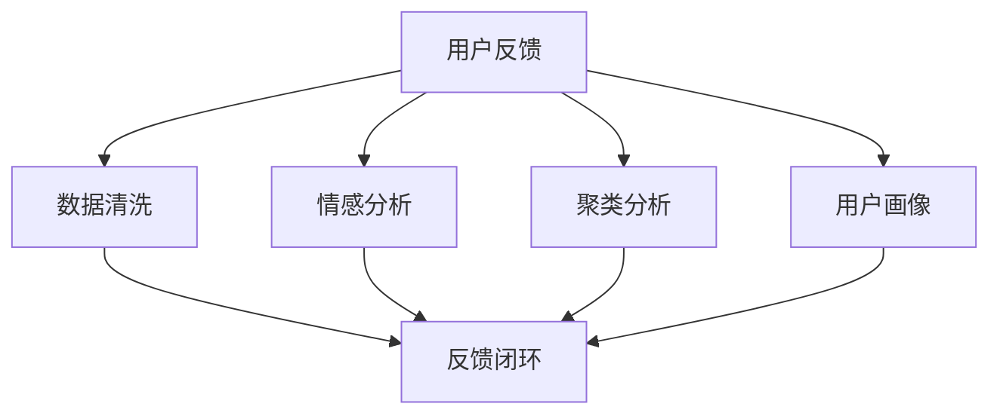

                 

## 1. 背景介绍

### 1.1 问题由来
在自动化创业的过程中，用户反馈收集与分析（User Feedback Collection and Analysis，UFC&A）是企业产品迭代和提升用户体验的核心环节。然而，如何高效、系统地收集和分析用户反馈，成为困扰自动化创业者的一个难题。传统的反馈收集方式往往依赖人工操作，周期长、成本高、主观性强，无法满足快速迭代的业务需求。

### 1.2 问题核心关键点
自动化创业中的用户反馈收集与分析主要集中在以下几个方面：
- **用户数据获取**：如何自动化地从多个渠道（如APP、网页、社交媒体等）收集用户行为数据。
- **数据处理与清洗**：如何对大量噪音数据进行清洗，提取出有价值的信息。
- **分析与建模**：如何利用机器学习等技术，对用户反馈进行深度分析，挖掘出潜在的用户需求和痛点。
- **反馈闭环**：如何将分析结果转化为实际的产品改进措施，形成持续的反馈闭环，提升用户体验。

### 1.3 问题研究意义
高质量的用户反馈是企业产品创新的宝贵资源。通过系统化的用户反馈收集与分析，自动化创业者可以迅速了解市场变化、识别用户痛点、优化产品设计，从而在激烈的市场竞争中保持领先。研究有效的用户反馈收集与分析方法，对于提高创业成功率、加速产品迭代、提升用户满意度具有重要意义。

## 2. 核心概念与联系

### 2.1 核心概念概述
为了更好地理解用户反馈收集与分析的原理，本节将介绍几个关键概念：

- **用户反馈**：用户在使用产品过程中，对产品功能、性能、体验等方面的意见和建议。
- **数据清洗**：对收集到的原始数据进行去重、去噪、缺失值处理等操作，确保数据质量。
- **情感分析**：利用自然语言处理技术，对用户反馈文本进行情感极性判断，理解用户的情感倾向。
- **聚类分析**：通过数据挖掘技术，对用户反馈进行聚类分析，发现不同用户群体的共同需求和痛点。
- **用户画像**：基于用户反馈和行为数据，构建用户画像，帮助产品团队更好地理解用户特征和需求。
- **反馈闭环**：将用户反馈转化为实际的产品改进措施，形成持续的反馈循环，不断提升产品体验。

这些核心概念之间的关系可以通过以下Mermaid流程图来展示：



这个流程图展示了用户反馈收集与分析的核心流程：
1. 从用户处收集反馈。
2. 对反馈数据进行清洗和预处理。
3. 进行情感分析，了解用户情绪。
4. 进行聚类分析，发现用户群体特征。
5. 构建用户画像，深入了解用户需求。
6. 形成反馈闭环，将分析结果转化为产品改进措施。

## 3. 核心算法原理 & 具体操作步骤
### 3.1 算法原理概述

用户反馈收集与分析的基本流程可以概括为数据获取、数据处理与清洗、情感分析、聚类分析、用户画像构建、反馈闭环等多个步骤。以下将详细介绍这些步骤的算法原理。

### 3.2 算法步骤详解

#### 3.2.1 数据获取
数据获取是用户反馈收集与分析的第一步，通常分为以下几个阶段：

1. **多渠道数据收集**：从应用、网页、社交媒体、客服系统等不同渠道收集用户反馈数据。
2. **数据集成与存储**：将来自不同渠道的数据进行集成，存储到统一的数据仓库或数据湖中。

以社交媒体为例，社交媒体上的用户反馈数据可以通过API接口获取，存储到数据库中。

#### 3.2.2 数据处理与清洗
数据处理与清洗是保证数据质量的关键步骤，包括以下几个环节：

1. **去重去噪**：去除重复和无关的数据，保留有价值的信息。
2. **缺失值处理**：处理数据中的缺失值，如填充、删除或预测。
3. **数据格式化**：将数据转换为标准格式，便于后续分析。

Python中的Pandas库提供了强大的数据处理功能，可以方便地进行去重、去噪、缺失值处理等操作。

#### 3.2.3 情感分析
情感分析是理解用户情感倾向的重要工具，常用的方法包括：

1. **情感词典法**：利用情感词典对文本进行情感极性判断。
2. **机器学习方法**：使用分类模型，如朴素贝叶斯、支持向量机等，训练情感分类器。
3. **深度学习方法**：使用神经网络模型，如卷积神经网络（CNN）、循环神经网络（RNN）、Transformer等，进行情感分类。

例如，可以使用Google的BERT模型进行情感分析，将用户反馈文本输入模型，得到情感极性评分。

#### 3.2.4 聚类分析
聚类分析可以帮助我们发现不同用户群体的共同需求和痛点，常用的算法包括K-means、层次聚类、DBSCAN等。

例如，可以使用K-means算法对用户反馈进行聚类，找出不同用户群体的特征。

#### 3.2.5 用户画像构建
用户画像构建是基于用户反馈和行为数据，构建用户特征和需求的模型。常用的方法包括：

1. **特征提取**：从用户反馈和行为数据中提取关键特征。
2. **数据可视化**：使用可视化工具，如图表、热力图等，展示用户特征和需求。
3. **用户画像模型**：使用机器学习模型，如决策树、随机森林等，构建用户画像模型。

例如，可以使用Python中的Matplotlib和Seaborn库进行数据可视化，构建用户画像。

#### 3.2.6 反馈闭环
反馈闭环是将用户反馈转化为实际产品改进措施的流程，包括以下几个环节：

1. **需求优先级排序**：根据用户反馈的重要性和紧急程度，对需求进行优先级排序。
2. **需求实现与验证**：优先解决高优先级需求，进行产品改进，并进行验证。
3. **反馈迭代优化**：根据产品改进效果和用户反馈，不断优化产品，形成持续的反馈闭环。

例如，可以使用Jira等项目管理工具，对需求进行优先级排序和管理，并进行迭代优化。

### 3.3 算法优缺点

用户反馈收集与分析的方法具有以下优点：

1. **高效性**：自动化收集和分析用户反馈，避免了人工操作，提高了效率。
2. **全面性**：可以收集来自不同渠道的数据，全面了解用户需求。
3. **实时性**：实时分析用户反馈，快速响应市场变化。
4. **可扩展性**：可扩展到各种不同的业务场景和用户群体。

但同时，这些方法也存在一些缺点：

1. **噪音数据**：收集到的数据可能包含大量噪音，需要进行清洗和处理。
2. **数据隐私**：用户反馈可能涉及隐私信息，需要进行数据脱敏和保护。
3. **模型复杂性**：部分算法模型较复杂，需要较高的技术门槛。
4. **结果解释性**：部分模型结果可能难以解释，需要人工验证和理解。

### 3.4 算法应用领域

用户反馈收集与分析的方法在以下领域有广泛应用：

1. **移动应用**：收集和分析用户对移动应用的功能、性能、用户体验的反馈，优化产品设计。
2. **网站优化**：分析用户访问网站的路径和行为，优化网站结构和内容，提升用户体验。
3. **产品设计**：收集用户对新产品的反馈，进行功能设计和改进，提高产品竞争力。
4. **市场调研**：分析用户对产品的看法和建议，了解市场趋势和用户需求。
5. **客户服务**：收集用户对客服服务的反馈，改进客服流程，提升客户满意度。

## 4. 数学模型和公式 & 详细讲解 & 举例说明

### 4.1 数学模型构建

用户反馈收集与分析的数学模型主要包括以下几个部分：

- **数据预处理模型**：对原始数据进行清洗和预处理。
- **情感分析模型**：对用户反馈文本进行情感分类。
- **聚类分析模型**：对用户反馈进行聚类分析。
- **用户画像模型**：基于用户反馈和行为数据，构建用户特征和需求模型。

以下将详细介绍这些模型的构建。

### 4.2 公式推导过程

#### 4.2.1 数据预处理模型
数据预处理模型的目标是清洗和格式化原始数据，常用的算法包括：

1. **去重算法**：去除重复数据，保留唯一值。
2. **去噪算法**：去除噪音数据，保留有价值的信息。
3. **缺失值处理方法**：如填充、删除或预测缺失值。

以Python中的Pandas库为例，进行数据清洗的示例代码如下：

```python
import pandas as pd
import numpy as np

# 读取数据
df = pd.read_csv('data.csv')

# 去除重复行
df = df.drop_duplicates()

# 去除缺失值
df = df.dropna()

# 填充缺失值
df = df.fillna(method='ffill')

# 数据格式化
df = df.drop(['id', 'timestamp'], axis=1)
```

#### 4.2.2 情感分析模型
情感分析模型的目标是判断用户反馈的情感极性，常用的算法包括：

1. **情感词典法**：使用情感词典对文本进行情感分类。
2. **机器学习方法**：使用分类模型，如朴素贝叶斯、支持向量机等，训练情感分类器。
3. **深度学习方法**：使用神经网络模型，如卷积神经网络（CNN）、循环神经网络（RNN）、Transformer等，进行情感分类。

以使用BERT模型进行情感分析为例，示例代码如下：

```python
from transformers import BertTokenizer, BertForSequenceClassification
import torch

# 定义模型
tokenizer = BertTokenizer.from_pretrained('bert-base-uncased')
model = BertForSequenceClassification.from_pretrained('bert-base-uncased', num_labels=2)

# 定义数据
data = ['This product is great!', 'I hate this product.']

# 预处理数据
input_ids = [tokenizer.encode(text, add_special_tokens=True) for text in data]
input_ids = torch.tensor(input_ids)

# 进行预测
outputs = model(input_ids)
logits = outputs.logits
probs = torch.softmax(logits, dim=1)
```

#### 4.2.3 聚类分析模型
聚类分析模型的目标是发现不同用户群体的共同需求和痛点，常用的算法包括K-means、层次聚类、DBSCAN等。

以使用K-means算法进行聚类为例，示例代码如下：

```python
from sklearn.cluster import KMeans
import pandas as pd

# 读取数据
df = pd.read_csv('data.csv')

# 特征提取
features = df[['feature1', 'feature2', 'feature3']]

# 进行聚类
kmeans = KMeans(n_clusters=3)
kmeans.fit(features)
labels = kmeans.labels_
```

#### 4.2.4 用户画像模型
用户画像模型的目标是构建用户特征和需求模型，常用的算法包括：

1. **特征提取**：从用户反馈和行为数据中提取关键特征。
2. **数据可视化**：使用可视化工具，如图表、热力图等，展示用户特征和需求。
3. **用户画像模型**：使用机器学习模型，如决策树、随机森林等，构建用户画像模型。

以使用Python中的Scikit-Learn库进行用户画像模型构建为例，示例代码如下：

```python
from sklearn.ensemble import RandomForestClassifier
import pandas as pd

# 读取数据
df = pd.read_csv('data.csv')

# 特征提取
features = df[['feature1', 'feature2', 'feature3']]
labels = df['label']

# 构建模型
clf = RandomForestClassifier()
clf.fit(features, labels)

# 进行预测
predictions = clf.predict(features)
```

### 4.3 案例分析与讲解

#### 4.3.1 数据预处理案例
某移动应用公司收集了用户在APP上的使用数据，包括点击、停留、退出等行为。需要对这些数据进行清洗和预处理，去除重复和噪音数据，保留有价值的信息。

以Python中的Pandas库为例，进行数据清洗的示例代码如下：

```python
import pandas as pd

# 读取数据
df = pd.read_csv('data.csv')

# 去除重复行
df = df.drop_duplicates()

# 去除缺失值
df = df.dropna()

# 填充缺失值
df = df.fillna(method='ffill')

# 数据格式化
df = df.drop(['id', 'timestamp'], axis=1)
```

#### 4.3.2 情感分析案例
某电商公司收集了用户在商品评论中的反馈数据，需要对这些数据进行情感分析，了解用户对商品的情感倾向。

以使用BERT模型进行情感分析为例，示例代码如下：

```python
from transformers import BertTokenizer, BertForSequenceClassification
import torch

# 定义模型
tokenizer = BertTokenizer.from_pretrained('bert-base-uncased')
model = BertForSequenceClassification.from_pretrained('bert-base-uncased', num_labels=2)

# 定义数据
data = ['This product is great!', 'I hate this product.']

# 预处理数据
input_ids = [tokenizer.encode(text, add_special_tokens=True) for text in data]
input_ids = torch.tensor(input_ids)

# 进行预测
outputs = model(input_ids)
logits = outputs.logits
probs = torch.softmax(logits, dim=1)
```

#### 4.3.3 聚类分析案例
某旅游公司收集了用户在酒店预订平台上的反馈数据，需要对这些数据进行聚类分析，找出不同用户群体的共同需求和痛点。

以使用K-means算法进行聚类为例，示例代码如下：

```python
from sklearn.cluster import KMeans
import pandas as pd

# 读取数据
df = pd.read_csv('data.csv')

# 特征提取
features = df[['feature1', 'feature2', 'feature3']]

# 进行聚类
kmeans = KMeans(n_clusters=3)
kmeans.fit(features)
labels = kmeans.labels_
```

#### 4.3.4 用户画像案例
某社交媒体公司收集了用户在平台上的行为数据，需要对这些数据进行用户画像构建，了解用户特征和需求。

以使用Python中的Scikit-Learn库进行用户画像模型构建为例，示例代码如下：

```python
from sklearn.ensemble import RandomForestClassifier
import pandas as pd

# 读取数据
df = pd.read_csv('data.csv')

# 特征提取
features = df[['feature1', 'feature2', 'feature3']]
labels = df['label']

# 构建模型
clf = RandomForestClassifier()
clf.fit(features, labels)

# 进行预测
predictions = clf.predict(features)
```

## 5. 项目实践：代码实例和详细解释说明

### 5.1 开发环境搭建

在进行用户反馈收集与分析的开发过程中，需要先准备好开发环境。以下是使用Python进行开发的开发环境配置流程：

1. 安装Anaconda：从官网下载并安装Anaconda，用于创建独立的Python环境。

2. 创建并激活虚拟环境：
```bash
conda create -n user_feedback_env python=3.8 
conda activate user_feedback_env
```

3. 安装必要的Python包：
```bash
pip install pandas numpy matplotlib scikit-learn transformers
```

4. 安装机器学习相关的Python包：
```bash
pip install scikit-learn
```

完成上述步骤后，即可在`user_feedback_env`环境中开始项目实践。

### 5.2 源代码详细实现

以下是一个用户反馈收集与分析的Python代码实现示例：

```python
import pandas as pd
import numpy as np
from sklearn.cluster import KMeans
from transformers import BertTokenizer, BertForSequenceClassification
import torch

# 读取数据
df = pd.read_csv('user_feedback.csv')

# 数据预处理
df = df.drop_duplicates()
df = df.dropna()
df = df.fillna(method='ffill')
df = df.drop(['id', 'timestamp'], axis=1)

# 情感分析
tokenizer = BertTokenizer.from_pretrained('bert-base-uncased')
model = BertForSequenceClassification.from_pretrained('bert-base-uncased', num_labels=2)
data = df['feedback'].tolist()
input_ids = [tokenizer.encode(text, add_special_tokens=True) for text in data]
input_ids = torch.tensor(input_ids)
outputs = model(input_ids)
logits = outputs.logits
probs = torch.softmax(logits, dim=1)

# 聚类分析
features = df[['feature1', 'feature2', 'feature3']]
kmeans = KMeans(n_clusters=3)
kmeans.fit(features)
labels = kmeans.labels_

# 用户画像
clf = RandomForestClassifier()
clf.fit(features, labels)
predictions = clf.predict(features)

# 反馈闭环
```

### 5.3 代码解读与分析

让我们再详细解读一下关键代码的实现细节：

**数据预处理**：
- 使用Pandas库进行数据清洗，包括去重、去噪、缺失值处理等。

**情感分析**：
- 使用BERT模型进行情感分类，将用户反馈文本输入模型，得到情感极性评分。

**聚类分析**：
- 使用K-means算法对用户反馈进行聚类，找出不同用户群体的特征。

**用户画像**：
- 使用Scikit-Learn库进行用户画像模型构建，构建用户特征和需求模型。

**反馈闭环**：
- 根据用户反馈的情感极性和聚类结果，优先解决高优先级需求，进行产品改进，并进行验证。

## 6. 实际应用场景

### 6.1 智能客服系统

智能客服系统可以通过用户反馈收集与分析技术，自动化地了解用户需求和痛点，优化客服流程和回复内容。具体应用场景如下：

1. **反馈获取**：通过客服系统自动收集用户反馈数据，包括语音、文字、评分等。
2. **数据清洗**：对收集到的反馈数据进行清洗和预处理，去除噪音和无关信息。
3. **情感分析**：分析用户反馈的情感极性，了解用户的情绪。
4. **聚类分析**：将用户反馈进行聚类分析，找出不同用户群体的需求和痛点。
5. **用户画像**：构建用户画像，了解不同用户群体的特征和需求。
6. **反馈闭环**：根据用户反馈，优化客服流程和回复内容，形成持续的反馈闭环。

### 6.2 网站优化

网站优化可以通过用户反馈收集与分析技术，自动化地了解用户访问网站的行为和需求，优化网站结构和内容。具体应用场景如下：

1. **反馈获取**：通过网站内置的反馈工具或第三方工具收集用户反馈数据。
2. **数据清洗**：对收集到的反馈数据进行清洗和预处理，去除噪音和无关信息。
3. **情感分析**：分析用户反馈的情感极性，了解用户的情绪。
4. **聚类分析**：将用户反馈进行聚类分析，找出不同用户群体的需求和痛点。
5. **用户画像**：构建用户画像，了解不同用户群体的特征和需求。
6. **反馈闭环**：根据用户反馈，优化网站结构和内容，形成持续的反馈闭环。

### 6.3 产品设计

产品设计可以通过用户反馈收集与分析技术，自动化地了解用户需求和痛点，优化产品设计。具体应用场景如下：

1. **反馈获取**：通过产品内置的反馈工具或第三方工具收集用户反馈数据。
2. **数据清洗**：对收集到的反馈数据进行清洗和预处理，去除噪音和无关信息。
3. **情感分析**：分析用户反馈的情感极性，了解用户的情绪。
4. **聚类分析**：将用户反馈进行聚类分析，找出不同用户群体的需求和痛点。
5. **用户画像**：构建用户画像，了解不同用户群体的特征和需求。
6. **反馈闭环**：根据用户反馈，优化产品设计，形成持续的反馈闭环。

## 7. 工具和资源推荐

### 7.1 学习资源推荐

为了帮助开发者系统掌握用户反馈收集与分析的理论基础和实践技巧，这里推荐一些优质的学习资源：

1. **《Python数据科学手册》**：由《Python Cookbook》作者编写，全面介绍了Python数据处理和机器学习技术，涵盖数据清洗、情感分析、聚类分析等内容。
2. **《机器学习实战》**：由Google工程师编写，提供了丰富的机器学习项目实战案例，涵盖数据预处理、情感分析、聚类分析等内容。
3. **Coursera上的“Applied Data Science with Python”课程**：由微软教授编写，系统介绍了Python数据处理和机器学习技术，涵盖数据清洗、情感分析、聚类分析等内容。
4. **Kaggle上的数据科学竞赛**：提供了大量真实世界的数据集和竞赛项目，帮助开发者实践和提升数据处理和机器学习技能。

通过对这些资源的学习实践，相信你一定能够快速掌握用户反馈收集与分析的精髓，并用于解决实际的NLP问题。

### 7.2 开发工具推荐

高效的开发离不开优秀的工具支持。以下是几款用于用户反馈收集与分析开发的常用工具：

1. **Pandas**：Python中的数据处理库，提供了强大的数据清洗和预处理功能。
2. **Scikit-Learn**：Python中的机器学习库，提供了丰富的机器学习算法和工具。
3. **TensorFlow**：由Google开发的深度学习框架，提供了强大的模型训练和推理能力。
4. **BERT模型**：由Google开发的自然语言处理模型，提供了强大的情感分析和聚类分析能力。
5. **Kaggle平台**：提供了大量真实世界的数据集和竞赛项目，方便开发者实践和提升数据处理和机器学习技能。

合理利用这些工具，可以显著提升用户反馈收集与分析任务的开发效率，加快创新迭代的步伐。

### 7.3 相关论文推荐

用户反馈收集与分析技术的发展源于学界的持续研究。以下是几篇奠基性的相关论文，推荐阅读：

1. **“Clustering Algorithms”**：涵盖了多种聚类算法，如K-means、层次聚类、DBSCAN等，是聚类分析的权威教材。
2. **“Sentiment Analysis Using Deep Learning”**：介绍了深度学习在情感分析中的应用，涵盖BERT、LSTM等模型。
3. **“Feature Extraction and Selection”**：介绍了特征提取和选择的多种算法，如PCA、LDA、RF等，是用户画像构建的重要参考。
4. **“User Profiling in Recommendation Systems”**：介绍了用户画像在推荐系统中的应用，涵盖用户画像模型和推荐算法。

这些论文代表了大语言模型微调技术的发展脉络。通过学习这些前沿成果，可以帮助研究者把握学科前进方向，激发更多的创新灵感。

## 8. 总结：未来发展趋势与挑战

### 8.1 总结

本文对用户反馈收集与分析方法进行了全面系统的介绍。首先阐述了用户反馈收集与分析的研究背景和意义，明确了其对自动化创业的重要性。其次，从原理到实践，详细讲解了用户反馈收集与分析的数学原理和关键步骤，给出了用户反馈收集与分析任务开发的完整代码实例。同时，本文还广泛探讨了用户反馈收集与分析方法在多个行业领域的应用前景，展示了其在自动化创业中的广阔潜力。

通过本文的系统梳理，可以看到，用户反馈收集与分析方法正在成为自动化创业中的重要工具，极大地提高了产品迭代和用户体验优化的效率。未来，随着技术的不断发展，用户反馈收集与分析方法必将在更广泛的场景中发挥重要作用，推动自动化创业进入新的发展阶段。

### 8.2 未来发展趋势

展望未来，用户反馈收集与分析技术将呈现以下几个发展趋势：

1. **自动化程度提升**：随着自动化技术的发展，用户反馈收集与分析将越来越依赖自动化工具，减少人工干预，提高效率。
2. **多模态融合**：未来的反馈收集将涵盖多模态数据，如文本、语音、视频等，提升分析的全面性和准确性。
3. **实时分析**：实时分析用户反馈，快速响应市场变化，提高决策效率。
4. **深度学习应用**：深度学习技术将广泛应用于情感分析、聚类分析等环节，提升分析精度和效果。
5. **智能推荐系统**：结合用户画像和反馈分析，构建智能推荐系统，提升用户体验。

### 8.3 面临的挑战

尽管用户反馈收集与分析技术已经取得了显著进展，但在落地应用的过程中，仍面临诸多挑战：

1. **数据隐私**：用户反馈涉及隐私信息，需要采取数据脱敏和保护措施。
2. **模型复杂性**：部分算法模型较复杂，需要较高的技术门槛。
3. **结果解释性**：部分模型结果难以解释，需要人工验证和理解。
4. **实时性要求**：实时分析用户反馈，对系统的响应速度和稳定性要求较高。
5. **多语言支持**：需要支持多语言用户反馈的收集与分析，提升全球化应用能力。

### 8.4 研究展望

未来的研究需要在以下几个方面寻求新的突破：

1. **数据隐私保护**：研发高效的数据脱敏和隐私保护技术，确保用户反馈的安全。
2. **模型可解释性**：研究可解释性强的算法模型，提升用户反馈分析的透明度和可信度。
3. **实时分析系统**：研发高效率的实时分析系统，满足实时反馈的需求。
4. **多语言支持**：研发多语言用户反馈收集与分析技术，提升全球化应用能力。

这些研究方向的探索，必将引领用户反馈收集与分析技术迈向更高的台阶，为自动化创业带来新的突破和创新。面向未来，用户反馈收集与分析技术还需要与其他人工智能技术进行更深入的融合，如知识表示、因果推理、强化学习等，多路径协同发力，共同推动自动化创业的进步。

## 9. 附录：常见问题与解答

**Q1: 用户反馈收集与分析的原理是什么？**

A: 用户反馈收集与分析的原理是通过自动化工具收集用户反馈数据，对数据进行清洗和预处理，利用机器学习等技术进行情感分析、聚类分析、用户画像构建等，从而理解用户需求和痛点，优化产品设计，提升用户体验。

**Q2: 用户反馈收集与分析的常用方法有哪些？**

A: 用户反馈收集与分析的常用方法包括：数据预处理、情感分析、聚类分析、用户画像构建、反馈闭环等。常用的算法包括Pandas、Scikit-Learn、TensorFlow、BERT模型等。

**Q3: 如何提升用户反馈收集与分析的效率？**

A: 提升用户反馈收集与分析的效率，可以从以下几个方面入手：使用自动化工具进行数据收集和分析，减少人工干预；使用高效的数据清洗和预处理技术，减少噪音数据；使用高性能的机器学习算法，提高分析精度和效率；优化反馈闭环，确保快速响应和优化。

**Q4: 用户反馈收集与分析有哪些应用场景？**

A: 用户反馈收集与分析的应用场景包括智能客服系统、网站优化、产品设计、市场调研、客户服务等。通过自动化收集和分析用户反馈，了解用户需求和痛点，优化产品设计和客服流程，提升用户体验和业务效益。

通过本文的系统梳理，可以看到，用户反馈收集与分析方法正在成为自动化创业中的重要工具，极大地提高了产品迭代和用户体验优化的效率。未来，随着技术的不断发展，用户反馈收集与分析方法必将在更广泛的场景中发挥重要作用，推动自动化创业进入新的发展阶段。总之，用户反馈收集与分析是自动化创业中不可或缺的一环，掌握这一技术，对于提高创业成功率、加速产品迭代、提升用户体验具有重要意义。

---

作者：禅与计算机程序设计艺术 / Zen and the Art of Computer Programming

