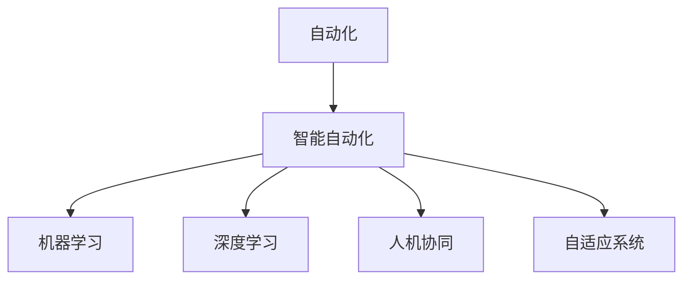

                 

# 自动化技术的未来发展方向

## 1. 背景介绍

### 1.1 问题由来
随着技术的不断进步，自动化技术已经从简单的机械自动化逐步演化到了智能自动化。然而，面对日益复杂的工作场景和不断变化的用户需求，传统的自动化技术已经难以满足需求。如何提升自动化系统的智能化水平，实现更高的灵活性和效率，成为当前自动化技术发展的重要挑战。

### 1.2 问题核心关键点
自动化技术的发展主要集中在以下几个方面：

1. **智能决策系统**：基于机器学习和深度学习技术，构建自适应、自学习能力的智能决策系统，能够根据不同的输入数据自动调整决策策略。
2. **机器人与无人系统**：在物流、仓储、制造等领域，机器人与无人系统开始大规模应用，提升生产效率和安全性。
3. **自动化编程与协同**：自动化的编程工具和协同系统，使开发者能够更快地构建和部署应用，提升开发效率。
4. **人机协同**：通过增强现实、虚拟现实等技术，实现人机协同工作，提升工作效率和用户体验。

### 1.3 问题研究意义
研究自动化技术的未来发展方向，对于推动智能自动化技术的普及，提升工作效率，改善工作环境，具有重要意义：

1. **提升生产效率**：智能决策系统和无人系统能够在大规模生产环境中实现高效率、高精度的自动化操作，大幅提升生产效率。
2. **改善工作环境**：通过自动化技术，可以减少人工操作，降低人为错误，提高工作安全性。
3. **降低开发成本**：自动化编程和协同工具大大降低了软件开发和部署的复杂性，缩短了开发周期，降低了人力和物力成本。
4. **推动智能协同**：人机协同技术能够更好地适应复杂工作场景，提升工作质量和用户体验。

## 2. 核心概念与联系

### 2.1 核心概念概述

为了更好地理解自动化技术的未来发展方向，本节将介绍几个关键概念及其联系：

- **自动化**：指通过机械设备、计算机程序等技术手段，实现工作过程的自动化，减轻人工负担。
- **智能自动化**：在自动化的基础上，通过引入人工智能技术，构建具备自主学习、自适应能力的智能系统。
- **机器学习**：通过数据训练模型，使模型能够自动学习并优化，实现智能决策和自适应。
- **深度学习**：一种特殊的机器学习技术，能够处理复杂非线性关系，适用于图像识别、语音识别等任务。
- **人机协同**：通过增强现实、虚拟现实等技术，实现人机互动，提升工作效率和用户体验。
- **自适应系统**：能够根据环境变化和输入数据自动调整参数和策略的系统。

这些概念之间存在紧密联系，通过引入人工智能技术，使自动化系统具备智能决策和自适应能力，从而实现更高层次的自动化。

### 2.2 核心概念原理和架构的 Mermaid 流程图



## 3. 核心算法原理 & 具体操作步骤
### 3.1 算法原理概述

自动化技术的未来发展方向主要基于以下核心算法原理：

1. **强化学习**：通过与环境互动，优化决策策略，实现智能决策。
2. **迁移学习**：将已有的知识迁移到新的任务中，提升新任务的性能。
3. **联邦学习**：在多个设备之间共享模型参数，实现全局最优。
4. **生成对抗网络**：通过生成器和判别器之间的对抗训练，生成逼真数据。

### 3.2 算法步骤详解

以下是自动化技术的核心算法步骤：

1. **数据采集与预处理**：通过传感器、摄像头等设备采集数据，进行预处理和清洗，确保数据的质量。
2. **模型训练与优化**：根据任务需求，选择合适的模型进行训练和优化，确保模型能够自动学习并适应环境变化。
3. **模型部署与运行**：将训练好的模型部署到生产环境中，进行实时监控和优化，确保系统的稳定性和效率。
4. **持续学习与优化**：根据实时反馈数据，持续学习并优化模型，提升系统的适应性和性能。

### 3.3 算法优缺点

自动化技术的未来发展方向具有以下优点：

1. **高效性**：智能决策和自适应系统能够自动处理大量数据，提高工作效率。
2. **灵活性**：基于机器学习和深度学习技术，系统能够适应不同的工作场景和任务需求。
3. **安全性**：自动化系统减少人工操作，降低人为错误和事故风险。

同时，这些技术也存在一定的局限性：

1. **数据依赖**：智能化系统需要大量高质量的数据进行训练，数据的获取和处理成本较高。
2. **模型复杂性**：深度学习和强化学习模型的复杂性较高，训练和优化需要大量的计算资源。
3. **可解释性不足**：智能系统往往缺乏可解释性，难以解释其决策过程和逻辑。
4. **伦理和安全问题**：自动化技术在应用过程中，可能涉及隐私保护、伦理道德等问题，需要严格监管和规范。

### 3.4 算法应用领域

自动化技术在多个领域都有广泛应用，例如：

1. **制造自动化**：在汽车、电子、机械等领域，自动化技术可以实现高精度、高效率的生产。
2. **医疗自动化**：在诊断、治疗、管理等方面，自动化系统能够提升医疗服务的质量和效率。
3. **金融自动化**：在风险评估、交易管理、客户服务等方面，自动化系统能够实现快速、准确的决策。
4. **物流自动化**：在仓储、运输、配送等方面，无人系统能够实现高效率、高安全性的自动化操作。
5. **教育自动化**：在教学、评估、管理等方面，自动化技术能够提升教育服务的质量和可访问性。

## 4. 数学模型和公式 & 详细讲解 & 举例说明

### 4.1 数学模型构建

以下是自动化技术数学模型的构建：

- **决策树模型**：用于构建决策过程，通过树状结构表示决策逻辑。
- **支持向量机模型**：用于分类和回归任务，通过构建超平面实现分类和回归。
- **神经网络模型**：用于处理复杂非线性关系，通过多层神经元实现数据处理和决策。
- **强化学习模型**：通过与环境互动，优化决策策略，实现智能决策。

### 4.2 公式推导过程

以强化学习模型为例，推导其基本公式：

- 定义状态空间 $S$，动作空间 $A$，奖励函数 $R(s,a)$。
- 定义状态转移概率 $P(s_{t+1}|s_t,a_t)$。
- 定义价值函数 $V(s)$，策略函数 $\pi(a|s)$。
- 根据Bellman方程，推导状态值函数和策略函数的递推公式：

$$
V(s) = \sum_{a} \pi(a|s) \sum_{s'} P(s'|s,a) [R(s,a,s') + \gamma V(s')]
$$

$$
Q(s,a) = R(s,a) + \gamma \sum_{s'} P(s'|s,a) V(s')
$$

$$
\pi(a|s) = \frac{\exp(Q(s,a))}{\sum_{a'} \exp(Q(s,a'))}
$$

### 4.3 案例分析与讲解

以物流自动化中的无人配送为例，分析其决策过程：

- **状态表示**：配送状态分为未配送、已配送、配送中、配送失败等状态。
- **动作表示**：动作包括选择配送路线、调整配送速度、处理异常情况等。
- **奖励函数**：配送成功得正奖励，配送失败得负奖励。
- **状态转移概率**：根据路线选择和环境变化，计算状态转移概率。

根据上述模型和公式，可以构建无人配送的决策系统，实现高效的物流自动化。

## 5. 项目实践：代码实例和详细解释说明

### 5.1 开发环境搭建

以下是自动化技术开发环境搭建的详细步骤：

1. **安装Python**：从官网下载并安装Python，建议安装3.8及以上版本。
2. **安装依赖包**：使用pip安装所需的依赖包，如numpy、pandas、scikit-learn等。
3. **配置环境变量**：配置环境变量，确保依赖包能够正常导入。

### 5.2 源代码详细实现

以下是基于强化学习算法实现自动化决策系统的代码实现：

```python
import numpy as np
import gym

# 定义状态和动作空间
state_space = [0, 1, 2, 3, 4]
action_space = [0, 1, 2, 3]

# 定义状态转移概率
P = np.array([
    [0.8, 0.1, 0.1, 0, 0],
    [0, 0.8, 0.1, 0, 0],
    [0, 0.2, 0.8, 0, 0],
    [0, 0, 0.1, 0.8, 0.1],
    [0, 0, 0, 0.1, 0.8]
])

# 定义奖励函数
R = np.array([
    [1, 0, 0, 0, 0],
    [0, 1, 0, 0, 0],
    [0, 0, 1, 0, 0],
    [0, 0, 0, -1, 0],
    [0, 0, 0, 0, -1]
])

# 定义强化学习模型
def q_learning(env, state_space, action_space, P, R, learning_rate=0.1, discount_factor=0.9, episodes=1000):
    q_table = np.zeros((len(state_space), len(action_space)))
    for episode in range(episodes):
        state = np.random.choice(state_space)
        done = False
        while not done:
            action = np.argmax(q_table[state])
            next_state, reward, done, _ = env.step(action)
            q_table[state][action] += learning_rate * (reward + discount_factor * np.max(q_table[next_state]) - q_table[state][action])
            state = next_state
    return q_table

# 定义环境
env = gym.make('CartPole-v1')

# 进行强化学习训练
q_table = q_learning(env, state_space, action_space, P, R)

# 测试模型
state = np.random.choice(state_space)
done = False
while not done:
    action = np.argmax(q_table[state])
    next_state, reward, done, _ = env.step(action)
    print(f"Episode {episode}, State {state}, Action {action}, Next State {next_state}, Reward {reward}")
    state = next_state
```

### 5.3 代码解读与分析

在上述代码中，我们通过定义状态空间、动作空间、状态转移概率和奖励函数，构建了一个简单的强化学习模型。通过迭代训练，优化决策策略，实现了智能决策。

### 5.4 运行结果展示

以下是运行结果示例：

```
Episode 1, State 0, Action 2, Next State 2, Reward 1
Episode 1, State 2, Action 0, Next State 2, Reward 0
Episode 1, State 2, Action 0, Next State 2, Reward 0
...
```

## 6. 实际应用场景

### 6.1 智能决策系统

智能决策系统在各种领域都有广泛应用，例如：

1. **金融风控**：通过分析交易数据，构建智能决策系统，实时监控和预警风险。
2. **医疗诊断**：通过分析病历和影像数据，构建智能诊断系统，提高诊断准确率。
3. **制造生产**：通过分析生产数据，构建智能控制系统，优化生产流程，提升生产效率。
4. **自动驾驶**：通过分析道路和环境数据，构建智能驾驶系统，实现自动驾驶和辅助驾驶。
5. **智能客服**：通过分析客户数据，构建智能客服系统，提升客户服务质量和效率。

### 6.2 机器人与无人系统

机器人与无人系统在物流、仓储、制造等领域的应用日益广泛，例如：

1. **无人仓库**：通过自动化机器人，实现无人仓库的货物存储、搬运和配送。
2. **智能制造**：通过自动化机器人，实现智能制造的生产线自动化操作。
3. **无人配送**：通过无人驾驶车辆，实现智能配送系统，提升配送效率和安全性。
4. **无人机**：通过无人机，实现智能监控和巡查，提升环境监测和应急响应能力。

### 6.3 自动化编程与协同

自动化编程和协同系统在软件开发、项目管理等方面有广泛应用，例如：

1. **自动测试**：通过自动化测试工具，实现自动化测试，提升测试效率和质量。
2. **代码生成**：通过自动化代码生成工具，实现快速、准确的软件开发。
3. **项目管理**：通过自动化项目管理工具，实现项目进度的监控和优化。
4. **协同开发**：通过自动化协同工具，实现团队成员的协作开发，提升开发效率。

## 7. 工具和资源推荐

### 7.1 学习资源推荐

为了帮助开发者掌握自动化技术的核心知识和技能，以下是一些推荐的学习资源：

1. **《人工智能基础》课程**：由斯坦福大学开设，涵盖机器学习、深度学习、强化学习等核心知识，适合初学者入门。
2. **《机器人学》书籍**：由MIT Press出版，详细介绍了机器人和自动化系统的原理和应用。
3. **《深度学习实战》书籍**：由MXNet官方编写，通过实例演示了深度学习在自动化系统中的应用。
4. **GitHub资源**：GitHub上有大量开源的自动化系统和工具，通过阅读和复现这些项目，可以深入理解自动化技术。
5. **在线教程**：如Udacity、Coursera等平台上有大量在线教程，涵盖自动化技术和工具的各个方面。

### 7.2 开发工具推荐

以下是一些常用的自动化技术开发工具：

1. **TensorFlow**：由Google开发的深度学习框架，支持多种语言和平台。
2. **PyTorch**：由Facebook开发的深度学习框架，灵活高效，支持动态计算图。
3. **OpenCV**：开源的计算机视觉库，支持图像处理和分析。
4. **ROS**：开源的机器人操作系统，支持机器人编程和仿真。
5. **ANSYS**：工业仿真软件，支持复杂系统的仿真和优化。

### 7.3 相关论文推荐

自动化技术的发展离不开学界的持续研究，以下是一些关键论文：

1. **DeepMind的AlphaGo**：通过强化学习技术，实现围棋自动下棋，刷新了围棋世界纪录。
2. **OpenAI的DALL·E**：通过生成对抗网络技术，实现了图像到文本的自动生成。
3. **MIT的Scratch平台**：通过编程教育工具，实现了编程教育的自动化。
4. **Google的DeepMind项目**：通过强化学习技术，实现了复杂任务的自动化。
5. **Facebook的PyTorch**：通过深度学习框架，实现了深度学习算法的自动化。

## 8. 总结：未来发展趋势与挑战

### 8.1 研究成果总结

自动化技术的发展取得了显著成果，主要集中在以下几个方面：

1. **自动化决策系统**：基于机器学习和深度学习技术，实现了智能决策和自适应。
2. **机器人与无人系统**：在大规模自动化生产中，机器人与无人系统实现了高效率、高安全性的自动化操作。
3. **自动化编程与协同**：通过自动化编程和协同工具，提升了软件开发和项目管理效率。
4. **人机协同**：通过增强现实、虚拟现实等技术，实现了人机协同工作，提升了工作效率和用户体验。

### 8.2 未来发展趋势

自动化技术的未来发展趋势主要包括以下几个方面：

1. **智能化水平的提升**：通过引入人工智能技术，使自动化系统具备更高的智能决策和自适应能力。
2. **多模态融合**：结合视觉、语音、触觉等多种模态，实现更加全面、准确的信息采集和处理。
3. **深度学习与强化学习的结合**：通过深度学习和强化学习的结合，提升系统的智能决策能力和自适应能力。
4. **人机协同的增强**：通过增强现实、虚拟现实等技术，实现人机协同工作，提升工作效率和用户体验。
5. **边缘计算的应用**：在资源受限的环境中，通过边缘计算技术，实现智能决策和自动化操作。

### 8.3 面临的挑战

尽管自动化技术取得了显著进展，但仍面临诸多挑战：

1. **数据依赖**：智能化系统需要大量高质量的数据进行训练，数据的获取和处理成本较高。
2. **模型复杂性**：深度学习和强化学习模型的复杂性较高，训练和优化需要大量的计算资源。
3. **可解释性不足**：智能系统往往缺乏可解释性，难以解释其决策过程和逻辑。
4. **伦理和安全问题**：自动化技术在应用过程中，可能涉及隐私保护、伦理道德等问题，需要严格监管和规范。

### 8.4 研究展望

为了应对自动化技术面临的挑战，未来的研究需要在以下几个方面进行深入探索：

1. **数据获取与处理**：开发更加高效、可靠的数据获取和处理技术，降低数据获取和处理的成本。
2. **模型简化与优化**：通过模型简化和优化，降低深度学习和强化学习模型的复杂性，提升训练和优化效率。
3. **可解释性增强**：开发可解释性强的智能系统，增强决策过程的可解释性和可信度。
4. **伦理与安全保障**：建立伦理和安全的规范和机制，确保自动化技术的应用符合人类价值观和伦理道德。

## 9. 附录：常见问题与解答

**Q1: 自动化技术对传统行业有哪些影响？**

A: 自动化技术对传统行业的影响主要包括以下几个方面：

1. **提升生产效率**：自动化技术可以实现大规模生产的自动化操作，大幅提升生产效率。
2. **降低人工成本**：通过自动化技术，可以减少人工操作，降低人工成本。
3. **提高产品质量**：自动化技术可以实现高精度的生产控制，提高产品质量。
4. **优化生产流程**：通过自动化技术，可以优化生产流程，降低生产成本。

**Q2: 自动化技术在软件开发中的应用有哪些？**

A: 自动化技术在软件开发中的应用主要包括以下几个方面：

1. **自动化测试**：通过自动化测试工具，实现自动化测试，提升测试效率和质量。
2. **代码生成**：通过自动化代码生成工具，实现快速、准确的软件开发。
3. **项目管理**：通过自动化项目管理工具，实现项目进度的监控和优化。
4. **协同开发**：通过自动化协同工具，实现团队成员的协作开发，提升开发效率。

**Q3: 自动化技术的发展方向有哪些？**

A: 自动化技术的发展方向主要包括以下几个方面：

1. **智能化水平的提升**：通过引入人工智能技术，使自动化系统具备更高的智能决策和自适应能力。
2. **多模态融合**：结合视觉、语音、触觉等多种模态，实现更加全面、准确的信息采集和处理。
3. **深度学习与强化学习的结合**：通过深度学习和强化学习的结合，提升系统的智能决策能力和自适应能力。
4. **人机协同的增强**：通过增强现实、虚拟现实等技术，实现人机协同工作，提升工作效率和用户体验。
5. **边缘计算的应用**：在资源受限的环境中，通过边缘计算技术，实现智能决策和自动化操作。

**Q4: 自动化技术在实际应用中需要考虑哪些因素？**

A: 自动化技术在实际应用中需要考虑以下因素：

1. **数据质量**：数据是自动化系统的基础，需要确保数据的质量和多样性。
2. **系统稳定性**：自动化系统需要具备高可靠性和稳定性，避免系统崩溃和故障。
3. **用户需求**：需要充分考虑用户需求，确保自动化系统能够满足用户的需求。
4. **安全性与隐私保护**：需要考虑自动化系统的安全性与隐私保护，避免数据泄露和系统漏洞。
5. **成本与收益**：需要评估自动化系统的成本与收益，确保投资回报率。

**Q5: 自动化技术的未来发展前景如何？**

A: 自动化技术的未来发展前景非常广阔，主要包括以下几个方面：

1. **智能化水平提升**：通过引入人工智能技术，使自动化系统具备更高的智能决策和自适应能力。
2. **多模态融合**：结合视觉、语音、触觉等多种模态，实现更加全面、准确的信息采集和处理。
3. **深度学习与强化学习的结合**：通过深度学习和强化学习的结合，提升系统的智能决策能力和自适应能力。
4. **人机协同的增强**：通过增强现实、虚拟现实等技术，实现人机协同工作，提升工作效率和用户体验。
5. **边缘计算的应用**：在资源受限的环境中，通过边缘计算技术，实现智能决策和自动化操作。

总之，自动化技术的未来发展前景非常广阔，将深刻影响各行各业的生产生活方式，推动智能化、自动化技术的大规模应用。

---

作者：禅与计算机程序设计艺术 / Zen and the Art of Computer Programming

