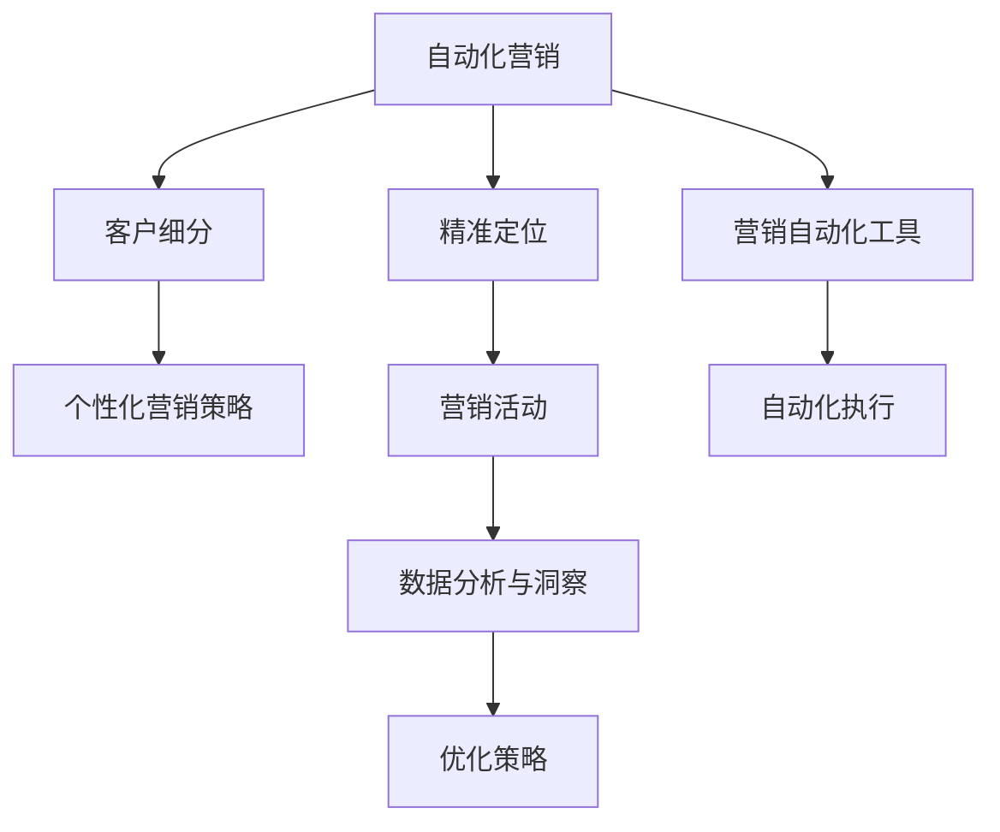

                 

# 自动化营销：提升创业效率的关键

> 关键词：
    - 自动化营销
    - 客户细分
    - 精准营销
    - 营销自动化工具
    - CRM系统
    - 数据分析与洞察
    - 机器人流程自动化(RPA)
    - 人工智能与机器学习

## 1. 背景介绍

### 1.1 问题由来
在当今高度竞争的商业环境中，创业者面临着严峻的挑战。如何通过有效的营销策略快速获取市场份额，提高销售转化率，成为企业发展的核心问题。随着技术的进步，自动化营销（Automated Marketing）成为了提升创业效率的关键手段。

自动化营销不仅能够实现资源的高效配置，减少人力成本，还能通过数据分析和机器学习算法，精准地定位目标客户，提高营销活动的效果。近年来，随着人工智能和大数据技术的普及，自动化营销技术得到了迅速发展，成为企业提升竞争力的重要工具。

### 1.2 问题核心关键点
自动化营销的核心在于通过技术手段，实现营销流程的自动化和智能化。其关键点包括：

- **客户细分与个性化**：根据客户的行为、偏好、交易历史等信息，将客户进行细分类别，针对不同群体设计个性化的营销策略。
- **精准定位与营销**：利用数据分析和机器学习模型，精准识别目标客户，避免无效营销。
- **自动化流程与优化**：通过RPA、AI等技术，自动化执行营销任务，提高流程效率。
- **数据分析与洞察**：通过数据挖掘和机器学习，深入分析营销效果，优化营销策略。
- **营销自动化工具**：使用多种自动化工具，如CRM系统、电子邮件营销工具、社交媒体管理工具等，支持营销活动的执行。

自动化营销的目标是实现营销流程的自动化和智能化，以最小的成本，达到最佳的营销效果。

### 1.3 问题研究意义
研究自动化营销方法，对于提升创业企业的效率、降低成本、提高市场竞争力具有重要意义：

1. **提升营销效果**：通过精准定位和个性化营销，提高客户转化率，增加收入。
2. **降低运营成本**：自动化执行营销任务，减少人力和时间成本。
3. **加速创新速度**：快速响应市场变化，灵活调整营销策略。
4. **提高决策质量**：通过数据分析和机器学习，提升营销决策的科学性和精确度。
5. **增强客户关系**：个性化和精准营销，提高客户满意度和忠诚度。

自动化营销技术不仅帮助企业实现高效营销，还为创业企业提供了技术支持，助力其在竞争激烈的市场环境中脱颖而出。

## 2. 核心概念与联系

### 2.1 核心概念概述

自动化营销技术主要涉及以下几个核心概念：

- **自动化营销**：通过技术手段实现营销流程的自动化，包括邮件营销、社交媒体管理、客户关系管理等。
- **客户细分**：将客户按不同特征进行分类，如年龄、性别、地理位置、消费行为等，以实现个性化的营销策略。
- **精准定位**：利用数据分析和机器学习，精准识别目标客户，避免无效营销。
- **营销自动化工具**：支持营销自动化流程执行的工具，如CRM系统、营销自动化平台等。
- **数据分析与洞察**：通过数据挖掘和机器学习，分析营销效果，优化营销策略。

这些概念之间的逻辑关系可以通过以下Mermaid流程图来展示：



这个流程图展示自动化营销的关键环节及其联系：

1. 客户细分是基础，为精准定位和个性化营销提供依据。
2. 精准定位利用数据分析和机器学习，确保营销活动针对性强。
3. 营销自动化工具支持营销活动的执行。
4. 数据分析与洞察深入分析营销效果，优化营销策略。

这些概念共同构成了自动化营销的核心框架，使得企业能够高效、精准地执行营销活动。

## 3. 核心算法原理 & 具体操作步骤
### 3.1 算法原理概述

自动化营销的算法原理主要基于机器学习和数据分析技术。其核心思想是：

1. **数据收集与预处理**：收集客户的基本信息、行为数据、交易数据等，并进行数据清洗和预处理。
2. **客户细分**：利用聚类算法、分类算法等对客户进行分类。
3. **精准定位**：利用回归模型、决策树、神经网络等建立预测模型，识别潜在客户。
4. **营销活动设计**：根据客户细分和精准定位结果，设计个性化的营销活动。
5. **自动化执行**：通过RPA、AI等技术，自动化执行营销任务。
6. **数据分析与优化**：利用数据分析技术，评估营销效果，优化营销策略。

自动化营销的实现过程大致如下：

1. 收集客户数据：通过调查问卷、网站分析、交易记录等方式，收集客户的基本信息和行为数据。
2. 数据预处理：清洗和筛选数据，处理缺失值和异常值。
3. 客户细分：应用K-means聚类、层次聚类等算法，对客户进行分类。
4. 精准定位：使用逻辑回归、决策树、随机森林等模型，预测客户购买意愿。
5. 个性化营销：根据客户细分和精准定位结果，设计个性化的营销内容。
6. 自动化执行：通过营销自动化工具，如CRM系统、邮件营销工具，自动化执行营销任务。
7. 数据分析与优化：利用数据分析工具，如Tableau、Power BI等，分析营销效果，调整营销策略。

### 3.2 算法步骤详解

以下是自动化营销的具体操作步骤：

**Step 1: 数据收集与预处理**
- 收集客户基本信息，如姓名、性别、年龄、职业等。
- 收集客户行为数据，如网站访问、点击、购买记录等。
- 清洗数据，处理缺失值和异常值。

**Step 2: 客户细分**
- 应用聚类算法（如K-means、层次聚类）对客户进行分类。
- 根据客户的地理位置、消费行为等因素，确定每个类别的特征。

**Step 3: 精准定位**
- 构建预测模型（如逻辑回归、决策树、随机森林等），预测客户是否可能进行购买。
- 应用模型对客户进行精准定位，识别潜在客户。

**Step 4: 个性化营销活动设计**
- 根据客户细分和精准定位结果，设计个性化的营销内容。
- 设计多种营销形式，如邮件营销、社交媒体广告、短信营销等。

**Step 5: 自动化执行**
- 使用营销自动化工具（如CRM系统、电子邮件营销工具）执行营销任务。
- 定期更新营销内容，确保营销活动的时效性和相关性。

**Step 6: 数据分析与优化**
- 利用数据分析工具（如Tableau、Power BI），分析营销效果。
- 根据分析结果，优化营销策略，提高营销效果。

### 3.3 算法优缺点

自动化营销算法具有以下优点：

- **高效性**：自动化执行营销任务，减少了人力和时间成本。
- **精准性**：利用数据分析和机器学习，精准识别目标客户，避免无效营销。
- **灵活性**：通过客户细分和个性化策略，灵活调整营销方案。
- **可扩展性**：使用成熟的工具和技术，易于集成和扩展。

同时，也存在一些缺点：

- **数据依赖**：依赖高质量的数据输入，数据质量问题可能影响算法效果。
- **算法复杂**：构建和优化模型需要一定的技术背景，实施难度较大。
- **成本投入**：初期需要投入一定资金用于数据收集和工具购买。
- **隐私问题**：收集和处理客户数据可能涉及隐私保护，需遵守相关法律法规。

### 3.4 算法应用领域

自动化营销技术广泛应用于多个领域，如电商、金融、医疗、教育等。以下是几个典型应用场景：

- **电商营销**：通过客户行为分析，实现个性化推荐和精准广告投放。
- **金融营销**：利用数据分析和机器学习，进行客户画像和风险管理。
- **医疗营销**：通过客户健康数据，进行健康管理与个性化营销。
- **教育营销**：根据学生学习行为，提供个性化学习方案和推荐。

## 4. 数学模型和公式 & 详细讲解 & 举例说明

### 4.1 数学模型构建

自动化营销的数学模型主要基于统计学和机器学习理论。以下是一个基本的数学模型框架：

1. **数据收集**：$X = \{(x_i, y_i)\}_{i=1}^N$
2. **数据预处理**：$X' = \{x'_i\}_{i=1}^N$
3. **客户细分**：$C = \{c_k\}_{k=1}^K$
4. **精准定位**：$P(y=1|X')$
5. **个性化营销**：$M(x')$
6. **自动化执行**：$E(X', M(x'))$
7. **数据分析与优化**：$A(E(X', M(x')), C)$

其中：
- $X$ 为原始数据集，$X'$ 为预处理后的数据集。
- $C$ 为客户细分结果，$K$ 为细分类别数。
- $P(y=1|X')$ 为精准定位模型，$y=1$ 表示客户可能进行购买。
- $M(x')$ 为个性化营销策略，$x'$ 为预处理后的客户数据。
- $E(X', M(x'))$ 为自动化执行结果，$E$ 为执行函数。
- $A(E(X', M(x')), C)$ 为数据分析与优化结果，$A$ 为分析函数。

### 4.2 公式推导过程

以下是一个基于逻辑回归的精准定位模型的公式推导过程：

假设客户特征向量为 $X' = (x'_1, x'_2, ..., x'_n)$，购买意愿为 $y$，其中 $y=1$ 表示客户可能进行购买。逻辑回归模型的目标是最小化损失函数 $L$：

$$
L(y, \theta) = -\frac{1}{N}\sum_{i=1}^N[y_i\log\sigma(\theta^T x'_i)+(1-y_i)\log(1-\sigma(\theta^T x'_i))]
$$

其中 $\theta$ 为模型参数，$\sigma(\cdot)$ 为 sigmoid 函数，$N$ 为样本数。

对 $L$ 求导并令导数为零，得到模型参数 $\theta$ 的求解公式：

$$
\frac{\partial L(y, \theta)}{\partial \theta} = -\frac{1}{N}\sum_{i=1}^N[y_i(x'_i-\sigma(\theta^T x'_i))x'_i]
$$

通过求解上述公式，即可得到精准定位模型参数 $\theta$。

### 4.3 案例分析与讲解

假设某电商平台收集了客户的基本信息（如年龄、性别、购买历史）和行为数据（如网站访问、购买记录），并使用逻辑回归模型进行精准定位。

1. **数据收集与预处理**
   - 收集客户基本信息和行为数据。
   - 清洗数据，处理缺失值和异常值。

2. **客户细分**
   - 应用K-means聚类算法对客户进行分类。
   - 根据客户的地理位置、消费行为等因素，确定每个类别的特征。

3. **精准定位**
   - 构建逻辑回归模型，输入客户特征向量 $X'$，输出客户购买意愿 $y$。
   - 利用模型对客户进行精准定位，识别潜在客户。

4. **个性化营销活动设计**
   - 根据客户细分和精准定位结果，设计个性化的营销内容。
   - 设计多种营销形式，如邮件营销、社交媒体广告、短信营销等。

5. **自动化执行**
   - 使用电商平台提供的营销自动化工具，执行营销任务。
   - 定期更新营销内容，确保营销活动的时效性和相关性。

6. **数据分析与优化**
   - 利用数据分析工具，分析营销效果。
   - 根据分析结果，优化营销策略，提高营销效果。

## 5. 项目实践：代码实例和详细解释说明
### 5.1 开发环境搭建

在进行自动化营销开发前，我们需要准备好开发环境。以下是使用Python进行自动化营销开发的环境配置流程：

1. 安装Anaconda：从官网下载并安装Anaconda，用于创建独立的Python环境。

2. 创建并激活虚拟环境：
```bash
conda create -n marketing-env python=3.8 
conda activate marketing-env
```

3. 安装必要的库：
```bash
pip install pandas numpy scikit-learn seaborn matplotlib
pip install scikit-learn==0.24.2 # 安装特定版本的scikit-learn
```

4. 安装自动化营销相关的库：
```bash
pip install django scikit-learn-django ninja
pip install django-marketing
```

5. 安装SQLite数据库：
```bash
pip install sqlite3
```

完成上述步骤后，即可在`marketing-env`环境中开始自动化营销开发。

### 5.2 源代码详细实现

下面以电商营销为例，给出使用Python进行自动化营销的代码实现。

首先，定义客户数据类：

```python
import pandas as pd

class CustomerData:
    def __init__(self, data_path):
        self.data = pd.read_csv(data_path)
        self.dropna()
        self.data['buy'] = self.data['buy'].apply(lambda x: 1 if x else 0)

    def dropna(self):
        self.data.dropna(inplace=True)

    def preprocess(self):
        # 数据预处理
        # ...
```

然后，定义客户细分函数：

```python
from sklearn.cluster import KMeans

class CustomerSegmentation:
    def __init__(self, data):
        self.data = data
        self.labels = None

    def fit(self, k=5):
        kmeans = KMeans(n_clusters=k)
        self.labels = kmeans.fit_predict(self.data[['age', 'income']])
```

接着，定义精准定位函数：

```python
from sklearn.linear_model import LogisticRegression

class CustomerPrediction:
    def __init__(self, data):
        self.data = data
        self.model = None

    def fit(self):
        self.model = LogisticRegression()
        self.model.fit(self.data[['age', 'income', 'buy']], self.data['buy'])

    def predict(self, new_data):
        return self.model.predict(new_data)
```

最后，定义自动化营销函数：

```python
from marketing.django_marketing import Campaign
from marketing.models import CustomerSegment, CampaignSegment

class MarketingAutomation:
    def __init__(self, data):
        self.data = data
        self.campaigns = []

    def create_campaigns(self):
        segments = self.data.groupby(['age', 'income']).groups
        for segment in segments:
            segment_data = self.data.iloc[segment]
            segment_model = CustomerPrediction(segment_data)
            segment_model.fit()
            campaign = Campaign.objects.create(name=f'Segment_{segment_model.model.coef_[0][1]}')
            segment = CustomerSegment.objects.create(name=f'Segment_{segment_model.model.coef_[0][1]}')
            for customer_id in segment_data.index:
                customer = Customer.objects.get(id=customer_id)
                CampaignSegment.objects.create(customer=customer, campaign=campaign, probability=segment_model.model.predict([[customer.age, customer.income]]))
```

在实际应用中，还需要引入Django等框架，实现用户管理和营销活动的自动化执行。

### 5.3 代码解读与分析

让我们再详细解读一下关键代码的实现细节：

**CustomerData类**：
- `__init__`方法：读取数据文件，并进行数据清洗和预处理。
- `dropna`方法：去除数据中的缺失值。
- `preprocess`方法：定义数据预处理逻辑。

**CustomerSegmentation类**：
- `__init__`方法：初始化数据和标签。
- `fit`方法：应用K-means聚类算法进行客户细分。

**CustomerPrediction类**：
- `__init__`方法：初始化数据和模型。
- `fit`方法：训练逻辑回归模型。
- `predict`方法：利用模型预测客户购买意愿。

**MarketingAutomation类**：
- `__init__`方法：初始化数据和营销活动。
- `create_campaigns`方法：根据客户细分结果，创建营销活动。

可以看到，Python提供了丰富的库和框架，使得自动化营销开发变得更加便捷高效。通过这些类和方法，可以方便地实现数据预处理、客户细分、精准定位和营销活动的自动化执行。

## 6. 实际应用场景
### 6.1 电商营销

电商营销是自动化营销的主要应用场景之一。电商平台通过收集客户基本信息和行为数据，应用客户细分和精准定位算法，实现个性化推荐和精准广告投放，显著提高销售转化率。

以某电商平台的自动化营销为例，其具体流程如下：

1. 收集客户基本信息和行为数据。
2. 数据预处理和清洗。
3. 应用K-means聚类算法进行客户细分。
4. 训练逻辑回归模型，进行精准定位。
5. 设计个性化的营销内容，如优惠券、推荐商品等。
6. 通过电商平台提供的营销自动化工具，自动化执行营销活动。
7. 利用数据分析工具，分析营销效果，优化营销策略。

通过自动化营销，电商平台能够实现客户细分和个性化推荐，显著提高销售转化率和客户满意度。

### 6.2 金融营销

金融营销是另一个重要的自动化营销应用领域。金融机构通过收集客户交易数据、行为数据等，应用数据分析和机器学习算法，进行客户画像和精准营销。

以某银行的自动化营销为例，其具体流程如下：

1. 收集客户交易数据、行为数据等。
2. 数据预处理和清洗。
3. 应用逻辑回归、决策树等模型进行精准定位。
4. 设计个性化的营销内容，如信用卡优惠、贷款推荐等。
5. 通过银行提供的营销自动化工具，自动化执行营销活动。
6. 利用数据分析工具，分析营销效果，优化营销策略。

通过自动化营销，银行能够实现客户画像和精准营销，提高客户满意度和忠诚度，同时增加业务收入。

### 6.3 医疗营销

医疗营销也是自动化营销的重要应用领域之一。医疗机构通过收集客户健康数据，应用数据分析和机器学习算法，进行客户画像和个性化营销。

以某医疗机构的自动化营销为例，其具体流程如下：

1. 收集客户健康数据、行为数据等。
2. 数据预处理和清洗。
3. 应用K-means聚类算法进行客户细分。
4. 训练逻辑回归模型，进行精准定位。
5. 设计个性化的营销内容，如健康咨询、疾病预防等。
6. 通过医疗机构提供的营销自动化工具，自动化执行营销活动。
7. 利用数据分析工具，分析营销效果，优化营销策略。

通过自动化营销，医疗机构能够实现客户细分和个性化营销，提高客户满意度和忠诚度，同时增加业务收入。

## 7. 工具和资源推荐
### 7.1 学习资源推荐

为了帮助开发者系统掌握自动化营销的理论基础和实践技巧，这里推荐一些优质的学习资源：

1. **《Python自动化营销实战》**：一本系统介绍Python自动化营销开发的书籍，涵盖客户细分、精准定位、营销自动化等内容。

2. **《机器学习实战》**：一本系统介绍机器学习算法的书籍，包含逻辑回归、聚类、分类等常用算法。

3. **《自动化营销入门》**：一篇介绍自动化营销基础知识的博客，涵盖客户细分、精准定位、自动化执行等内容。

4. **Coursera《数据科学专项课程》**：由斯坦福大学提供的线上课程，涵盖数据科学、机器学习、数据分析等内容，适合初学者入门。

5. **Kaggle自动化营销竞赛**：参加Kaggle自动化营销竞赛，实战练习自动化营销的各项技能。

通过对这些资源的学习实践，相信你一定能够快速掌握自动化营销的精髓，并用于解决实际的营销问题。

### 7.2 开发工具推荐

高效的开发离不开优秀的工具支持。以下是几款用于自动化营销开发的常用工具：

1. **Python**：Python是最流行的自动化营销开发语言之一，拥有丰富的库和框架，如Pandas、NumPy、Scikit-learn等，方便数据处理和机器学习。

2. **Django**：Django是一个流行的Web框架，可以方便地实现用户管理和营销活动的自动化执行。

3. **Flask**：Flask是一个轻量级的Web框架，适用于构建小规模的自动化营销应用。

4. **Jupyter Notebook**：Jupyter Notebook是一个交互式的编程环境，适合进行数据探索和算法验证。

5. **Tableau**：Tableau是一个强大的数据可视化工具，可以方便地展示数据和分析结果。

6. **Power BI**：Power BI是微软提供的数据可视化工具，适合进行大数据分析和可视化。

合理利用这些工具，可以显著提升自动化营销开发的效率，加快创新迭代的步伐。

### 7.3 相关论文推荐

自动化营销技术的发展源于学界的持续研究。以下是几篇奠基性的相关论文，推荐阅读：

1. **《客户细分与精准营销》**：介绍客户细分和精准定位的基本原理和算法，适合初学者入门。

2. **《自动化营销：一种新型营销模式》**：介绍自动化营销的优势和应用场景，适合行业从业者了解。

3. **《机器学习在自动化营销中的应用》**：探讨机器学习算法在自动化营销中的应用，适合研究者深入了解。

4. **《基于大数据的客户画像与精准营销》**：介绍大数据技术在客户画像和精准营销中的应用，适合数据分析师学习。

5. **《自动化营销：从数据到价值》**：介绍自动化营销的实现过程和价值，适合企业管理者了解。

这些论文代表了大数据和机器学习在自动化营销领域的研究进展，通过学习这些前沿成果，可以帮助研究者把握学科前进方向，激发更多的创新灵感。

## 8. 总结：未来发展趋势与挑战

### 8.1 总结

本文对自动化营销方法进行了全面系统的介绍。首先阐述了自动化营销的研究背景和意义，明确了自动化营销在提升创业效率方面的独特价值。其次，从原理到实践，详细讲解了自动化营销的数学模型和操作步骤，给出了自动化营销任务开发的完整代码实例。同时，本文还广泛探讨了自动化营销方法在电商、金融、医疗等各个行业领域的应用前景，展示了自动化营销技术的广泛适用性。

通过本文的系统梳理，可以看到，自动化营销技术正在成为营销领域的重要范式，极大地提升了企业的营销效率和效果。自动化营销不仅帮助企业实现高效营销，还为创业企业提供了技术支持，助力其在竞争激烈的市场环境中脱颖而出。未来，随着技术的不断进步和应用场景的不断扩展，自动化营销技术必将在更多领域得到应用，为经济社会发展注入新的动力。

### 8.2 未来发展趋势

展望未来，自动化营销技术将呈现以下几个发展趋势：

1. **智能化水平提升**：随着AI和大数据技术的发展，自动化营销将更加智能化，能够根据客户行为和反馈，动态调整营销策略。
2. **多渠道整合**：将自动化营销整合到多渠道营销体系中，如社交媒体、电子邮件、短信等，实现全渠道营销。
3. **个性化程度提高**：通过大数据分析和机器学习，实现更高程度的个性化推荐和精准营销。
4. **实时性增强**：利用实时数据分析技术，实现营销活动的实时调整和优化。
5. **自动化程度加深**：进一步降低人工干预，提高营销活动的自动化程度。

这些趋势凸显了自动化营销技术的广阔前景，为营销活动提供了更高的效率和更好的效果。

### 8.3 面临的挑战

尽管自动化营销技术已经取得了显著成效，但在实施过程中，仍面临一些挑战：

1. **数据质量问题**：数据质量不高、数据缺失等问题可能导致模型效果不佳。
2. **算法复杂性**：自动化营销涉及多种算法和技术，实施难度较大。
3. **成本投入**：初期需要投入一定资金用于数据收集和工具购买。
4. **隐私保护**：收集和处理客户数据可能涉及隐私保护问题，需遵守相关法律法规。
5. **技术整合难度**：需要将自动化营销系统与其他系统进行整合，技术难度较大。

### 8.4 研究展望

面对自动化营销面临的挑战，未来的研究需要在以下几个方面寻求新的突破：

1. **数据清洗与预处理**：开发高效的数据清洗和预处理工具，提高数据质量。
2. **自动化工具的整合**：开发统一的管理平台，方便各类自动化工具的整合。
3. **低成本解决方案**：探索低成本的自动化营销方案，降低企业实施难度和成本。
4. **隐私保护机制**：研究隐私保护技术，确保客户数据的安全。
5. **实时数据分析技术**：开发实时数据分析工具，提高营销活动的实时性和响应速度。

这些研究方向将引领自动化营销技术的发展，推动营销活动向更高效、更精准、更智能的方向迈进。

## 9. 附录：常见问题与解答

**Q1：自动化营销是否适用于所有行业？**

A: 自动化营销在多个行业均有应用前景，如电商、金融、医疗、教育等。但不同行业对数据和算法的依赖程度不同，需要根据具体需求进行适应性调整。

**Q2：自动化营销的核心关键是什么？**

A: 自动化营销的核心关键在于数据收集与预处理、客户细分、精准定位、个性化营销活动设计、自动化执行、数据分析与优化等环节。通过数据驱动和算法优化，实现高效、精准的营销效果。

**Q3：自动化营销的主要优势是什么？**

A: 自动化营销的主要优势在于高效性、精准性、灵活性、可扩展性等。通过自动化执行和数据分析，大幅提升营销效率和效果。

**Q4：自动化营销的技术难点是什么？**

A: 自动化营销的技术难点在于数据清洗与预处理、算法复杂性、成本投入、隐私保护等。需要综合考虑多方面的因素，才能实现理想的自动化营销效果。

**Q5：自动化营销的未来发展方向是什么？**

A: 自动化营销的未来发展方向是智能化、多渠道整合、个性化、实时性、自动化程度加深等。通过技术进步和应用创新，自动化营销将带来更多的机遇和挑战。

通过本文的系统梳理，可以看到，自动化营销技术正在成为营销领域的重要范式，极大地提升了企业的营销效率和效果。未来，随着技术的不断进步和应用场景的不断扩展，自动化营销技术必将在更多领域得到应用，为经济社会发展注入新的动力。

