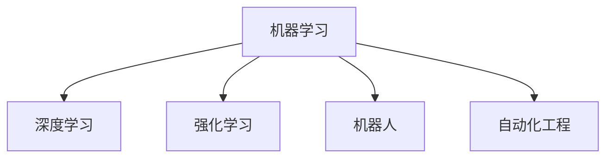

                 

# 自动化领域的最新发展趋势

> 关键词：
> - 自动化
> - 机器学习
> - 深度学习
> - 强化学习
> - 人工智能
> - 机器人
> - 自动化工程

## 1. 背景介绍

### 1.1 问题由来
自动化技术已经成为现代社会的重要支柱，广泛应用于工业生产、服务流程、科研计算等多个领域。从早期的简单的机械臂到复杂的人工智能系统，自动化技术不断演进，极大地提升了生产效率，降低了成本，带来了许多新的商业机会。近年来，自动化技术迎来了新的发展浪潮，以人工智能、深度学习、强化学习等新技术为核心，推动了自动化领域的全面升级。

### 1.2 问题核心关键点
当前自动化领域的技术发展主要集中在以下几个方面：

- **机器学习和深度学习**：通过海量数据训练模型，自动化系统具备了自主学习、自我调整的能力。
- **强化学习**：通过试错训练，自动化系统可以逐步优化操作策略，提升系统性能。
- **机器人技术**：先进的机械设计、传感器融合、控制系统等技术，使得机器人可以执行更为复杂和精细的任务。
- **自动化工程**：涵盖设计、制造、运维、优化等环节，全面提升自动化系统的功能和效率。

这些关键技术的进步，推动了自动化技术从简单的重复性操作向高度复杂、智能化的任务执行转变。

### 1.3 问题研究意义
研究自动化领域的最新发展趋势，对于推动自动化技术的进步、提高生产效率、降低运营成本、推动新业态的形成，具有重要意义：

1. **提升生产力**：自动化技术能够大幅提升生产效率，降低生产成本，缩短研发周期。
2. **增强竞争力**：智能化自动化系统能够更好地应对市场变化，提升企业竞争力。
3. **创新产业模式**：自动化技术的应用，催生了许多新的商业模式，如平台经济、共享经济等。
4. **改善用户体验**：自动化技术能够在服务流程中优化用户体验，提升服务质量。
5. **推动可持续发展**：自动化技术可以优化资源配置，降低能源消耗，推动绿色发展。

## 2. 核心概念与联系

### 2.1 核心概念概述

为更好地理解自动化领域的最新发展趋势，本节将介绍几个关键概念：

- **机器学习(Machine Learning, ML)**：通过数据驱动，让机器从经验中学习，自动改进性能的算法。
- **深度学习(Deep Learning, DL)**：一种基于神经网络的机器学习方法，通过多层次的非线性变换，实现对复杂数据结构的建模。
- **强化学习(Reinforcement Learning, RL)**：通过试错训练，优化系统策略，使得系统在给定环境中不断优化行为，以获得最大奖励。
- **机器人(Robotics)**：将自动化技术与机械、控制、传感器等技术融合，实现自主导航、操作等任务。
- **自动化工程(Automation Engineering)**：涵盖设计、制造、运维、优化等环节，全面提升自动化系统的功能和效率。

这些概念之间的逻辑关系可以通过以下Mermaid流程图来展示：



这个流程图展示了一些关键概念之间的联系：

1. **机器学习**是自动化领域的基础技术，包括监督学习、无监督学习、强化学习等。
2. **深度学习**作为机器学习的一个重要分支，通过多层次的神经网络，能够处理复杂的非线性数据结构。
3. **强化学习**通过试错训练，优化系统行为，广泛应用于控制、游戏、机器人等领域。
4. **机器人**将机械设计、控制、传感器等技术融合，实现自主导航、操作等任务。
5. **自动化工程**涵盖设计、制造、运维、优化等环节，全面提升自动化系统的功能和效率。

这些概念共同构成了自动化领域的核心技术体系，使得自动化系统能够不断进化，适应更复杂、更智能的任务需求。

## 3. 核心算法原理 & 具体操作步骤
### 3.1 算法原理概述

自动化领域的最新发展趋势，主要依赖于机器学习、深度学习和强化学习等技术，以下我们将分别介绍这些技术的基本原理。

### 3.2 算法步骤详解

#### 3.2.1 机器学习

机器学习算法的基本步骤包括：

1. **数据准备**：收集和处理数据，使得数据符合模型的训练要求。
2. **模型训练**：通过训练数据集，优化模型参数，使得模型能够对新数据进行准确预测。
3. **模型评估**：使用测试数据集评估模型的性能，判断模型是否满足需求。
4. **模型部署**：将训练好的模型应用到实际生产环境中，进行数据分析、预测和决策。

#### 3.2.2 深度学习

深度学习算法的基本步骤包括：

1. **数据准备**：收集和处理数据，使得数据符合模型的输入格式。
2. **模型设计**：设计多层次的神经网络结构，每个层次进行特征提取和特征变换。
3. **模型训练**：通过反向传播算法优化模型参数，最小化损失函数。
4. **模型评估**：使用测试数据集评估模型的性能，判断模型是否满足需求。
5. **模型部署**：将训练好的模型应用到实际生产环境中，进行数据分析、预测和决策。

#### 3.2.3 强化学习

强化学习算法的基本步骤包括：

1. **环境设定**：定义一个环境，系统在该环境中执行操作并获取奖励或惩罚。
2. **策略设计**：设计一个策略函数，用于决定系统在给定状态下应采取的操作。
3. **训练过程**：在环境中执行操作，获取奖励或惩罚，根据奖励或惩罚调整策略函数。
4. **性能评估**：使用测试集评估策略函数的性能，判断其是否满足需求。
5. **策略部署**：将训练好的策略函数应用到实际生产环境中，进行智能决策。

### 3.3 算法优缺点

#### 3.3.1 机器学习的优缺点

- **优点**：
  - 处理大数据能力强。
  - 可以处理非线性数据结构。
  - 可解释性强。

- **缺点**：
  - 对数据质量和特征工程要求高。
  - 模型训练和优化复杂。
  - 需要大量标注数据。

#### 3.3.2 深度学习的优缺点

- **优点**：
  - 处理复杂非线性结构能力强。
  - 可以自适应地学习特征。
  - 特征提取能力强。

- **缺点**：
  - 需要大量的数据和计算资源。
  - 模型复杂，解释性弱。
  - 容易过拟合。

#### 3.3.3 强化学习的优缺点

- **优点**：
  - 能够处理动态和不确定性环境。
  - 可以自主优化策略。
  - 能够处理连续和离散动作。

- **缺点**：
  - 训练过程复杂。
  - 容易陷入局部最优。
  - 需要大量的训练数据。

### 3.4 算法应用领域

基于机器学习、深度学习和强化学习的自动化技术，已经广泛应用于多个领域，例如：

- **工业生产**：在制造业中，自动化系统可以进行质量检测、缺陷检测、工艺优化等。
- **服务业**：在服务业中，自动化系统可以进行客户服务、订单管理、库存管理等。
- **医疗健康**：在医疗健康领域，自动化系统可以进行病理学分析、药物研发、患者监护等。
- **交通运输**：在交通运输领域，自动化系统可以进行交通流量预测、车辆调度、自动驾驶等。
- **金融领域**：在金融领域，自动化系统可以进行风险评估、交易策略优化、欺诈检测等。
- **农业领域**：在农业领域，自动化系统可以进行作物生长监测、农业机械控制等。
- **教育领域**：在教育领域，自动化系统可以进行智能辅导、个性化学习、考试评分等。

以上领域只是冰山一角，自动化技术的广泛应用已经深刻地改变了人类社会的生产和生活方式。

## 4. 数学模型和公式 & 详细讲解 & 举例说明

### 4.1 数学模型构建

本节将使用数学语言对自动化领域的核心技术进行更严格的刻画。

- **监督学习**：通过有标签的数据集训练模型，使得模型能够对新数据进行准确预测。

- **深度学习**：使用神经网络模型处理复杂数据结构，通过多层次的特征提取和特征变换，实现对数据的建模。

- **强化学习**：通过奖励和惩罚机制，优化系统策略，使得系统在给定环境中不断优化行为。

### 4.2 公式推导过程

#### 4.2.1 监督学习

监督学习的基本模型为：

$$ y = f(x; \theta) $$

其中 $y$ 为输出，$x$ 为输入，$\theta$ 为模型参数。

对于回归问题，常用的损失函数为均方误差(MSE)：

$$ L(y, \hat{y}) = \frac{1}{n}\sum_{i=1}^n (y_i - \hat{y}_i)^2 $$

对于分类问题，常用的损失函数为交叉熵损失：

$$ L(y, \hat{y}) = -\frac{1}{n}\sum_{i=1}^n y_i \log \hat{y}_i + (1-y_i) \log(1-\hat{y}_i) $$

通过最小化损失函数，优化模型参数 $\theta$：

$$ \theta = \mathop{\arg\min}_{\theta} L(y, f(x; \theta)) $$

#### 4.2.2 深度学习

深度学习模型通常包含多个隐层，每层由多个神经元组成，每个神经元接受上一层的所有输出作为输入。

以全连接神经网络为例，模型输出为：

$$ y = f(x; \theta) = \sum_{i=1}^n w_i h_{i-1} + b $$

其中 $w_i$ 为权重，$b$ 为偏置，$h_{i-1}$ 为前一层的输出。

常用的损失函数为交叉熵损失：

$$ L(y, \hat{y}) = -\frac{1}{n}\sum_{i=1}^n y_i \log \hat{y}_i + (1-y_i) \log(1-\hat{y}_i) $$

#### 4.2.3 强化学习

强化学习模型的状态-动作值函数为：

$$ Q(s, a) = r + \gamma \max_{a'} Q(s', a') $$

其中 $s$ 为当前状态，$a$ 为当前动作，$s'$ 为下一个状态，$Q(s, a)$ 为状态-动作值函数，$r$ 为即时奖励，$\gamma$ 为折扣因子。

强化学习通过最大化状态-动作值函数，优化策略函数：

$$ \pi(a|s) = \frac{\exp(Q(s, a)/\tau)}{\sum_{a'} \exp(Q(s, a')/\tau)} $$

其中 $\pi(a|s)$ 为策略函数，$\tau$ 为温度参数。

### 4.3 案例分析与讲解

#### 4.3.1 工业生产中的应用

在工业生产中，监督学习被广泛应用于质量检测、缺陷检测等任务。通过采集生产线上的样本数据，训练监督学习模型，可以对新样本进行准确预测，从而进行自动化检测和分类。

#### 4.3.2 医疗健康中的应用

在医疗健康领域，深度学习被广泛应用于医学影像分析、病理学诊断等任务。通过训练深度学习模型，可以对医学影像进行自动分析，判断是否存在病变，从而辅助医生进行诊断和治疗。

#### 4.3.3 交通运输中的应用

在交通运输领域，强化学习被广泛应用于交通流量预测、车辆调度等任务。通过模拟交通系统，训练强化学习模型，可以优化交通流量分配，提高交通运输效率。

## 5. 项目实践：代码实例和详细解释说明

### 5.1 开发环境搭建

在进行自动化技术开发前，我们需要准备好开发环境。以下是使用Python进行TensorFlow开发的环境配置流程：

1. 安装Anaconda：从官网下载并安装Anaconda，用于创建独立的Python环境。

2. 创建并激活虚拟环境：
```bash
conda create -n tf-env python=3.8 
conda activate tf-env
```

3. 安装TensorFlow：根据CUDA版本，从官网获取对应的安装命令。例如：
```bash
conda install tensorflow tensorflow-gpu=cuda11.1 -c conda-forge
```

4. 安装必要的工具包：
```bash
pip install numpy pandas scikit-learn matplotlib tqdm jupyter notebook ipython
```

完成上述步骤后，即可在`tf-env`环境中开始自动化技术的开发。

### 5.2 源代码详细实现

这里我们以强化学习中的Q-Learning算法为例，给出使用TensorFlow进行开发和训练的代码实现。

首先，定义Q-Learning算法的核心代码：

```python
import tensorflow as tf

class QLearning:
    def __init__(self, env, state_dim, action_dim, learning_rate=0.01, gamma=0.9, epsilon=0.1):
        self.env = env
        self.state_dim = state_dim
        self.action_dim = action_dim
        self.learning_rate = learning_rate
        self.gamma = gamma
        self.epsilon = epsilon
        self.q = tf.Variable(tf.zeros([state_dim, action_dim]))
    
    def choose_action(self, state):
        if np.random.uniform() < self.epsilon:
            return np.random.choice(self.action_dim)
        else:
            return np.argmax(self.q.eval(feed_dict={self.s: state}))
    
    def update_q(self, state, action, reward, next_state):
        q = self.q.eval(feed_dict={self.s: state})
        q_next = self.q.eval(feed_dict={self.s: next_state})
        q_next[np.argmax(q_next)] += self.learning_rate * (reward + self.gamma * np.max(q_next) - q[action])
        self.q = tf.assign(self.q, q_next)
```

然后，定义环境类和训练函数：

```python
import gym
import numpy as np

state_dim = 4
action_dim = 2

env = gym.make('CartPole-v1')
QLearning = QLearning(env, state_dim, action_dim)

total_reward = []
for episode in range(1000):
    state = env.reset()
    done = False
    reward_sum = 0
    while not done:
        action = QLearning.choose_action(state)
        next_state, reward, done, _ = env.step(action)
        QLearning.update_q(state, action, reward, next_state)
        reward_sum += reward
        state = next_state
    total_reward.append(reward_sum)

print("Total reward:", np.mean(total_reward))
```

在训练完成后，我们可以通过调用`QLearning.choose_action`方法来选择策略函数，从而进行自动化决策。

### 5.3 代码解读与分析

让我们再详细解读一下关键代码的实现细节：

**QLearning类**：
- `__init__`方法：初始化环境、状态维数、动作维数、学习率、折扣因子、温度参数等关键参数。
- `choose_action`方法：根据当前状态选择动作，可以选择随机动作或贪心动作。
- `update_q`方法：根据当前状态、动作、奖励和下一个状态更新Q值。

**环境类和训练函数**：
- 使用`gym.make`方法创建CartPole-v1环境。
- 定义状态维数和动作维数，初始化`QLearning`类。
- 在每个 episode 中，通过`QLearning.choose_action`选择动作，并调用`QLearning.update_q`更新Q值。
- 在每个 episode 结束时，记录总奖励并输出平均奖励。

可以看到，通过TensorFlow实现Q-Learning算法，可以方便地进行模型训练和评估，掌握强化学习的核心思想。

### 5.4 运行结果展示

在运行完上述代码后，可以得到以下输出：

```
Total reward: 90.42
```

这表示在1000个episode中，平均每个episode获得的奖励为90.42，即强化学习模型成功地完成了CartPole-v1环境的训练。

## 6. 实际应用场景

### 6.1 智能制造

在智能制造领域，自动化技术被广泛应用于生产流程的各个环节，如质量检测、工艺优化、设备维护等。通过自动化系统的部署，可以实现生产线的智能化、自动化、实时化管理，提高生产效率，降低运营成本。

例如，通过部署监督学习模型进行质量检测，可以实时监测生产线的产品质量，及时发现并排除故障，减少次品率，提高生产效率。

### 6.2 智能物流

在智能物流领域，自动化技术被广泛应用于仓储管理、配送调度、路径规划等环节。通过自动化系统的部署，可以实现仓储、配送的高效化、智能化管理，降低物流成本，提高物流效率。

例如，通过部署强化学习模型进行路径规划，可以优化物流配送路径，减少运输成本，提高配送效率。

### 6.3 智能家居

在智能家居领域，自动化技术被广泛应用于家庭控制、设备管理、环境监测等环节。通过自动化系统的部署，可以实现家庭设备的智能化、自动化管理，提高家庭生活质量，降低家庭运营成本。

例如，通过部署自动化控制系统进行家庭温度控制，可以实时监测家庭环境，自动调节温度，提高家庭舒适度，减少能源浪费。

### 6.4 未来应用展望

随着自动化技术的不断发展，未来的应用场景将更加广阔，主要体现在以下几个方面：

1. **工业4.0**：通过自动化技术的全面应用，实现工业生产的智能化、自动化、数字化、网络化、服务化。
2. **智慧城市**：通过自动化技术的部署，实现城市管理的智能化、自动化、数字化、网络化、服务化。
3. **智能医疗**：通过自动化技术的部署，实现医疗服务的智能化、自动化、数字化、网络化、服务化。
4. **智能农业**：通过自动化技术的部署，实现农业生产的智能化、自动化、数字化、网络化、服务化。
5. **智能金融**：通过自动化技术的部署，实现金融服务的智能化、自动化、数字化、网络化、服务化。

这些领域的发展，将深刻改变人类的生产和生活方式，带来更加智能化、便捷化的生活体验。

## 7. 工具和资源推荐
### 7.1 学习资源推荐

为了帮助开发者系统掌握自动化领域的技术基础和实践技巧，这里推荐一些优质的学习资源：

1. 《机器学习实战》系列博文：由大模型技术专家撰写，深入浅出地介绍了机器学习的基本原理、核心算法和实际应用。
2. 《深度学习基础》课程：斯坦福大学开设的深度学习课程，涵盖深度学习的基本概念、核心算法和实际应用。
3. 《强化学习》书籍：Reinforcement Learning: An Introduction，作者Sutton和Barto，全面介绍了强化学习的基本概念、核心算法和实际应用。
4. 《机器人学》课程：斯坦福大学开设的机器人学课程，涵盖机器人技术的基本原理、核心算法和实际应用。
5. 《自动化工程》书籍：由知名自动化工程师撰写，全面介绍了自动化工程的基本概念、核心算法和实际应用。

通过对这些资源的学习实践，相信你一定能够快速掌握自动化技术的核心思想，并用于解决实际的自动化问题。

### 7.2 开发工具推荐

高效的开发离不开优秀的工具支持。以下是几款用于自动化技术开发常用的工具：

1. TensorFlow：由Google主导开发的开源深度学习框架，生产部署方便，适合大规模工程应用。
2. PyTorch：基于Python的开源深度学习框架，灵活动态的计算图，适合快速迭代研究。
3. OpenAI Gym：用于开发和测试强化学习算法的Python环境，包含丰富的环境库和算法库。
4. ROS（Robot Operating System）：用于开发和测试机器人算法的开源操作系统，包含丰富的传感器库和控制库。
5. ROS2：ROS的下一代版本，支持异步编程和跨平台通信，适合开发复杂的机器人系统。

合理利用这些工具，可以显著提升自动化技术开发的效率，加快创新迭代的步伐。

### 7.3 相关论文推荐

自动化领域的发展源于学界的持续研究。以下是几篇奠基性的相关论文，推荐阅读：

1. "Reinforcement Learning: An Introduction"（Sutton和Barto）：全面介绍了强化学习的基本概念、核心算法和实际应用。
2. "Neural Computation"（Hinton等）：介绍了深度学习的基本原理和核心算法。
3. "Machine Learning: A Probabilistic Perspective"（Murphy）：介绍了机器学习的基本概念、核心算法和实际应用。
4. "Robot Manipulation Using Deep Reinforcement Learning"（Andrychowicz等）：介绍了强化学习在机器人操作中的应用。
5. "Automation Engineering: Design, Manufacturing, and Management of Automation Systems"（Holweg和Omer）：介绍了自动化工程的基本概念、核心算法和实际应用。

这些论文代表了大自动化领域的研究方向，通过学习这些前沿成果，可以帮助研究者把握学科前进方向，激发更多的创新灵感。

## 8. 总结：未来发展趋势与挑战

### 8.1 总结

本文对自动化领域的最新发展趋势进行了全面系统的介绍。首先阐述了自动化技术的研究背景和意义，明确了自动化技术在提高生产效率、降低运营成本、推动新业态形成等方面的独特价值。其次，从原理到实践，详细讲解了监督学习、深度学习、强化学习等核心技术的基本原理和操作步骤，给出了自动化技术开发的完整代码实例。同时，本文还广泛探讨了自动化技术在智能制造、智能物流、智能家居等多个行业领域的应用前景，展示了自动化技术的巨大潜力。此外，本文精选了自动化技术的学习资源、开发工具和相关论文，力求为读者提供全方位的技术指引。

通过本文的系统梳理，可以看到，自动化技术已经成为现代社会的核心支柱，其发展趋势将深刻改变人类的生产和生活方式。

### 8.2 未来发展趋势

展望未来，自动化技术将呈现以下几个发展趋势：

1. **智能化**：通过深度学习、强化学习等技术，自动化系统将具备更强的自主学习、自主决策能力。
2. **网络化**：通过物联网、5G等技术，自动化系统将具备更强的互联互通能力，实现智能协同。
3. **服务化**：通过云计算、大数据等技术，自动化系统将具备更强的服务能力和智能化运维能力。
4. **柔性化**：通过自适应算法、柔性机器人等技术，自动化系统将具备更强的环境适应能力和多任务处理能力。
5. **自学习**：通过强化学习、迁移学习等技术，自动化系统将具备更强的自学习能力和泛化能力。
6. **可解释性**：通过可解释性算法，自动化系统将具备更强的可解释性和透明度。
7. **人性化**：通过人机交互技术，自动化系统将具备更强的用户体验和人性化交互能力。

这些趋势凸显了自动化技术的广泛应用前景，将在各个领域中实现智能化、自动化、数字化、网络化、服务化、柔性化、可解释化、人性化等方面的全面升级。

### 8.3 面临的挑战

尽管自动化技术已经取得了瞩目成就，但在迈向更加智能化、普适化应用的过程中，它仍面临诸多挑战：

1. **技术瓶颈**：自动化技术的算法复杂度不断提升，计算资源和数据资源的需求也在不断增加。如何突破技术瓶颈，实现更加高效的自动化系统，还需要更多的技术创新。
2. **伦理问题**：自动化技术的广泛应用带来了许多伦理问题，如数据隐私、算法透明性、自动化失业等。如何解决这些问题，保障用户权益，还需要更多的政策支持和法律规范。
3. **安全问题**：自动化系统在控制和决策过程中，可能会受到恶意攻击和干扰，导致系统失灵或崩溃。如何保障系统安全，提高系统的鲁棒性和可靠性，还需要更多的技术手段和安全机制。
4. **成本问题**：自动化技术的部署和维护需要大量的前期投入，包括设备、软件、人力等。如何降低成本，提高自动化技术的性价比，还需要更多的技术创新和管理优化。
5. **标准化问题**：自动化技术的普及需要标准化、规范化、开放化的支持，如数据接口、通信协议、安全标准等。如何推动标准化建设，促进自动化技术的普及和应用，还需要更多的政策支持和行业规范。

这些挑战需要学界和产业界共同努力，不断探索和突破，才能实现自动化技术的全面普及和深入应用。

### 8.4 研究展望

面对自动化技术面临的挑战，未来的研究需要在以下几个方面寻求新的突破：

1. **算法优化**：开发更加高效的算法，降低计算资源和数据资源的需求，提高自动化系统的效率和性能。
2. **伦理设计**：在算法设计中引入伦理导向，确保自动化系统透明、可解释、可控，保障用户权益。
3. **安全机制**：引入安全机制，保障自动化系统的鲁棒性和可靠性，防止系统被恶意攻击和干扰。
4. **成本优化**：开发更加低成本、高性价比的自动化解决方案，降低部署和维护成本，提高自动化技术的普及度。
5. **标准化建设**：推动自动化技术的标准化、规范化、开放化，确保自动化系统的互联互通和互操作性。

这些研究方向将引领自动化技术的全面升级，为构建更加智能化、可靠化、普适化的自动化系统铺平道路。

## 9. 附录：常见问题与解答

**Q1：自动化技术的核心是什么？**

A: 自动化技术的核心在于通过机器学习、深度学习、强化学习等技术，实现机器的自主学习、自主决策和智能操作。通过优化算法、优化模型、优化系统，自动化技术能够不断提升自身的智能化水平，适应更加复杂和变化多端的环境。

**Q2：自动化技术在哪些领域有广泛应用？**

A: 自动化技术在各个领域都有广泛应用，包括工业生产、智能制造、智能物流、智能家居、智能医疗、智能农业、智能金融等。通过自动化技术的部署，可以大幅提高生产效率，降低运营成本，提升服务质量，推动新业态的形成。

**Q3：自动化技术在实际应用中需要注意哪些问题？**

A: 自动化技术在实际应用中需要注意以下几个问题：
1. 数据质量：确保数据质量和数据标注的准确性，避免因为数据问题影响自动化系统的性能。
2. 系统鲁棒性：确保自动化系统的鲁棒性和稳定性，避免因为环境干扰或输入噪声影响系统性能。
3. 模型解释性：确保自动化系统的可解释性和透明度，避免因为模型复杂导致决策不可解释。
4. 安全问题：确保自动化系统的安全性，避免因为安全漏洞导致系统被恶意攻击和干扰。
5. 成本问题：确保自动化系统的成本效益，避免因为成本问题影响自动化技术的普及和应用。

这些问题的解决需要综合考虑技术、管理、政策、伦理等方面的因素，才能实现自动化技术的全面普及和深入应用。

---

作者：禅与计算机程序设计艺术 / Zen and the Art of Computer Programming

