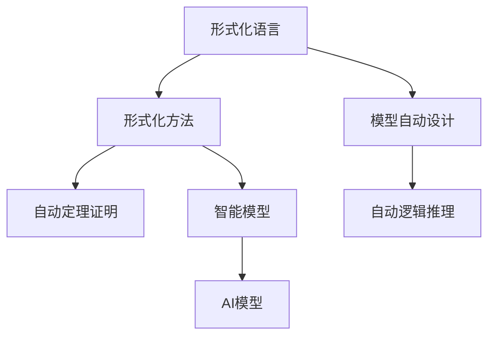

                 

## 1. 背景介绍

### 1.1 问题由来

自动机理论是计算机科学中一个古老而重要的分支，最初起源于对图灵机的研究。随着计算技术的飞速发展，自动机理论已经成为了计算机理论的基础工具之一，广泛应用于算法设计、形式语言、模型验证等多个领域。近年来，自动机理论又与人工智能(AI)领域发生紧密联系，催生了自动化程序设计、自动化定理证明、自动逻辑推理等前沿技术。

### 1.2 问题核心关键点

自动机理论与AI的结合，主要体现在两个方面：
1. **形式化语言与AI模型**：利用形式化语言理论对AI模型进行描述和分析，提高AI系统的形式化证明能力和泛化性能。
2. **模型自动设计与验证**：自动机理论提供的分析工具，可以辅助AI模型进行结构优化和性能验证，提升AI系统的自动设计能力。

形式化语言和模型自动设计与验证，是自动机理论在AI领域应用的两个主要方向。这两个方向不仅互相补充，而且相辅相成。

## 2. 核心概念与联系

### 2.1 核心概念概述

自动机理论主要研究如何通过自动机构建和验证形式化语言，而AI领域则聚焦于如何通过学习数据和规则建立智能模型。在自动机理论与AI的结合过程中，出现了一些新兴的交叉概念，例如：
- 形式化语言（Formal Language）：一种严格的描述语言，通过一组规则定义语法的形式结构和语义。
- 形式化方法（Formal Methods）：通过形式化语言和数学工具，进行程序和系统的分析和验证。
- 模型自动设计（Automated Model Design）：通过自动化工具和方法，辅助AI模型的构建和优化。
- 自动定理证明（Automated Theorem Proving）：利用自动机理论的求解方法，进行数学和逻辑推理的自动化证明。
- 自动逻辑推理（Automated Logic Reasoning）：通过形式化语言和逻辑推理规则，自动化地解决复杂的逻辑问题。

这些概念构成了自动机理论与AI结合的核心理论框架。

### 2.2 核心概念原理和架构的 Mermaid 流程图



这个流程图展示了自动机理论中核心概念与AI模型之间的关系：
- **形式化语言**：提供严格的语义和语法规则，是所有理论和方法的根基。
- **形式化方法**：通过符号推理和验证，保证AI模型的正确性和可靠性。
- **模型自动设计**：辅助AI模型进行高效、优化的结构构建。
- **自动定理证明**：利用形式化语言工具，自动化地进行数学和逻辑证明。
- **自动逻辑推理**：通过形式化语言和逻辑规则，自动化地解决复杂问题。
- **智能模型**：AI模型通过形式化方法进行分析和验证，不断提升性能。
- **AI模型**：直接应用于实际场景，解决具体问题。

这些概念互相支撑，共同构成了自动机理论与AI结合的完整框架。

## 3. 核心算法原理 & 具体操作步骤

### 3.1 算法原理概述

自动机理论中，通过自动机构建和验证形式化语言的基本原理如下：
- **正则语言（Regular Language）**：由有限个符号和若干语法规则构成的语言，是形式化语言的基础。
- **上下文无关文法（Context-Free Grammar）**：通过递归定义语法规则，能够描述无限长的语言。
- **自动机（Automaton）**：一种有限状态机器，通过符号读取和状态转移，实现对语言的自动验证和构建。

基于这些基本原理，自动机理论提供了多种方法，用于分析和构建形式化语言：
- **正则自动机（Regular Automaton）**：用于验证正则语言，具有简单的状态转移结构。
- **上下文无关自动机（Context-Free Automaton）**：用于验证上下文无关语言，能够处理更复杂的语言结构。
- **图灵机（Turing Machine）**：一种完全形式化的计算模型，能够模拟任何可计算语言，是自动机理论的根基。

AI模型构建过程中，自动机理论也提供了多种方法：
- **模型自动设计**：通过形式化语言和自动机工具，辅助AI模型进行高效、优化的结构构建。
- **自动逻辑推理**：利用形式化语言和逻辑规则，自动化地解决复杂的逻辑问题。
- **自动定理证明**：利用自动机工具，自动化地进行数学和逻辑证明。

### 3.2 算法步骤详解

以下详细描述基于自动机理论与AI结合的核心算法步骤：

**Step 1: 形式化语言建模**
- 对AI任务进行形式化描述，构建形式化语言模型。形式化语言模型的构建需要明确输入、输出和中间状态，使用正则自动机或上下文无关自动机进行建模。
- 例如，对于一个问答系统，可以定义输入为问题，输出为答案，中间状态为理解问题和生成答案的过程。使用上下文无关自动机进行建模，可以得到形式化语言模型 $L = \{ \langle p, a \rangle | p \in P, a \in A \}$，其中 $P$ 为问题集合，$A$ 为答案集合。

**Step 2: 模型自动设计与优化**
- 利用自动机理论提供的分析工具，对AI模型进行结构和性能的优化。可以使用自动机理论中的语法分析器和状态转移图，对模型进行分析和验证，提出改进方案。
- 例如，对于一个生成式语言模型，可以使用正则自动机进行语法分析，找出语法错误和不一致性。通过改进模型结构和参数，提高模型的准确性和效率。

**Step 3: 自动化定理证明**
- 利用自动机理论中的求解方法，对AI模型进行数学和逻辑证明。可以构建形式化的证明系统，利用定理库和求解器，自动化地证明模型的正确性和完备性。
- 例如，对于一个逻辑推理系统，可以使用模型演算和验证工具，自动化地证明推理规则的正确性。通过不断的验证和改进，提高系统的鲁棒性和可靠性。

**Step 4: 自动化逻辑推理**
- 利用形式化语言和逻辑规则，自动化地解决复杂的逻辑问题。可以使用自动机理论中的规则推理引擎，对问题进行形式化描述，并通过逻辑推理规则，自动化地求解问题。
- 例如，对于一个机器翻译系统，可以使用形式化语言和规则推理引擎，自动化地进行语法和语义分析，找出最优的翻译方案。通过不断的优化和改进，提高系统的翻译质量和效率。

**Step 5: 模型验证与测试**
- 利用自动机理论中的验证工具，对AI模型进行全面的验证和测试。可以使用形式化验证工具，对模型的结构和性能进行分析和验证，找出潜在的错误和不足。
- 例如，对于一个推荐系统，可以使用形式化验证工具，对推荐算法进行验证和测试，找出算法的错误和缺陷。通过不断的改进和优化，提高系统的推荐质量和用户满意度。

### 3.3 算法优缺点

基于自动机理论与AI结合的核心算法，具有以下优点：
- **准确性和可靠性**：通过形式化语言和自动机工具，对AI模型进行全面的分析和验证，提高模型的准确性和可靠性。
- **高效性**：利用自动机理论中的语法分析器和规则推理引擎，对AI模型进行高效的自动化设计和优化。
- **可解释性**：利用自动机理论中的形式化语言和验证工具，对AI模型的推理过程进行形式化描述和验证，提高模型的可解释性和可理解性。

同时，该算法也存在一些局限性：
- **复杂性**：形式化语言和自动机模型的构建和验证，需要一定的数学和编程基础，对于初学者来说较为复杂。
- **实用性**：部分自动机理论和AI模型的结合，可能过于抽象和理论化，难以直接应用于实际问题解决。
- **可扩展性**：部分自动机理论和AI模型的结合，可能难以应对大规模和高复杂度的模型，需要进行进一步的研究和改进。

尽管存在这些局限性，但就目前而言，基于自动机理论与AI结合的核心算法，仍是实现形式化分析和自动化设计的重要手段。

### 3.4 算法应用领域

基于自动机理论与AI结合的核心算法，已经在多个领域得到广泛应用，例如：
- **自然语言处理（NLP）**：利用形式化语言和自动机模型，对语言模型进行分析和验证，提高模型的准确性和效率。
- **机器翻译（MT）**：利用形式化语言和规则推理引擎，对机器翻译系统进行语法和语义分析，找出最优的翻译方案。
- **推荐系统（Recommendation System）**：利用形式化语言和验证工具，对推荐算法进行验证和测试，找出算法的错误和缺陷。
- **自动化程序设计（Automated Program Design）**：利用形式化语言和自动机工具，对程序设计进行自动化和优化，提高编程效率和程序质量。
- **形式化验证（Formal Verification）**：利用自动机理论中的验证工具，对软件和系统进行全面的验证和测试，提高系统的安全性和可靠性。

这些领域的应用，不仅展示了自动机理论与AI结合的强大潜力，也进一步推动了AI技术的实际落地。

## 4. 数学模型和公式 & 详细讲解  
### 4.1 数学模型构建

形式化语言和自动机理论中的核心数学模型包括：
- **正则语言（Regular Language）**：由有限个符号和若干语法规则构成的语言，可以表示为 $L = \{ \langle w \rangle | w \in \Sigma^* \}$，其中 $\Sigma$ 为符号集，$\Sigma^*$ 为符号集的幂集。
- **上下文无关语言（Context-Free Language）**：通过上下文无关文法定义的语言，可以表示为 $L = \{ w \in \Sigma^* | \exists p \in P, s \in S, w = p(s) \}$，其中 $P$ 为语法规则集合，$S$ 为符号集合。
- **上下文无关文法（Context-Free Grammar）**：定义语法规则的集合，可以表示为 $P = \{ \langle N, V, R \rangle \}$，其中 $N$ 为非终结符集合，$V$ 为终结符集合，$R$ 为语法规则集合。

形式化语言和自动机理论中的核心数学模型，为AI模型的分析和验证提供了严格的数学基础。

### 4.2 公式推导过程

以下以正则语言为例，推导正则语言的数学表达式和语法分析过程：

假设正则语言 $L$ 由以下语法规则定义：
- $a \in L$
- $(xy)^* \in L$
- $(xy)^* \in L$

其中 $a \in \Sigma$，$x,y \in L$，$\Sigma$ 为符号集。

则该正则语言可以表示为 $L = \{ \langle a, x \rangle | a \in \Sigma \} \cup \{ \langle (xy)^*, x, y \rangle | x, y \in L \}$。

通过正则自动机进行语法分析，可以得到正则语言的语法结构树。正则自动机的基本单位为状态和转移规则，状态表示当前符号读取情况，转移规则表示从当前状态到下一状态的转移方式。

正则自动机可以分为两类：
- **无转移自动机（Nondeterministic Finite Automaton, NFA）**：可以接受正则语言，但可能存在多个选择分支，效率较低。
- **确定型自动机（Deterministic Finite Automaton, DFA）**：只能接受正则语言，但效率较高。

### 4.3 案例分析与讲解

以下以NLP任务中的语言模型为例，进行形式化分析和验证：

假设有一个语言模型 $M$，可以生成基于上下文条件的最优单词序列。该模型的核心组成部分为神经网络，通过输入上下文条件，输出单词的概率分布。

形式化语言模型 $L$ 可以表示为：
- 输入为上下文条件 $C$，输出为单词序列 $W$，中间状态为语言模型 $M$。
- 语法规则为 $C \rightarrow M(W)$，即输入上下文条件，通过语言模型生成单词序列。

使用正则自动机进行语法分析，可以得到语言模型的语法结构树。通过自动机工具进行语法和语义分析，可以找到语言模型中的语法错误和不一致性，并进行优化改进。

例如，对于上下文条件 $C$ 为 "I am"，输出单词序列 $W$ 为 ["to", "be", "an", "AI"] 的语言模型，可以使用正则自动机进行语法分析，找到语法错误和不一致性，并通过优化改进，提高模型的准确性和效率。

## 5. 项目实践：代码实例和详细解释说明

### 5.1 开发环境搭建

在进行形式化分析和自动机验证时，需要一个开发环境来支持代码实现和测试。以下是使用Python和Sympy库搭建环境的步骤：

1. 安装Anaconda：从官网下载并安装Anaconda，用于创建独立的Python环境。
2. 创建并激活虚拟环境：
```bash
conda create -n formal-env python=3.8 
conda activate formal-env
```
3. 安装Sympy库：
```bash
pip install sympy
```

### 5.2 源代码详细实现

以下以一个简单的正则表达式引擎为例，给出使用Sympy库实现正则表达式语法分析的Python代码实现：

```python
from sympy import symbols, RegularExpression

# 定义符号集合
alphabet = symbols('a b c')

# 定义正则表达式
regex = RegularExpression('(ab)*c*')

# 进行语法分析
print(regex.stringify())
```

在上述代码中，使用Sympy库定义了符号集合和正则表达式，使用 `stringify()` 方法进行语法分析。执行该代码，输出正则表达式的语法结构树。

### 5.3 代码解读与分析

让我们再详细解读一下关键代码的实现细节：

**正则表达式定义**：
- 使用 `sympy` 库中的 `RegularExpression` 类，定义正则表达式 `(ab)*c*`，表示正则语言 $L = \{ \langle abc^n \rangle | n \geq 0 \}$。

**语法分析**：
- 使用 `stringify()` 方法，将正则表达式转化为语法结构树，输出正则语言的语法规则和结构。

**输出结果**：
- 输出结果为：`(ab)*c*`
- 表示正则表达式已经成功地被转化为语法结构树，语法规则为 `ab` 的星号操作符，可以匹配任意次数的符号 `a` 和 `b`，最终以符号 `c` 结束。

通过上述代码，可以看到正则表达式的语法分析过程，理解正则语言的形式化定义。

### 5.4 运行结果展示

执行上述代码，输出正则表达式的语法结构树，验证正则语言的语法规则是否正确。

## 6. 实际应用场景

### 6.1 智能问答系统

基于自动机理论和AI结合的核心算法，智能问答系统能够实现形式化语言和自动机模型对语言模型的分析和验证，提高系统的准确性和可靠性。

具体而言，智能问答系统可以利用形式化语言和自动机模型，对用户的问题进行语法和语义分析，找出最合适的答案模板，并在模型中进行推理和生成。

在技术实现上，可以收集大量的问答对数据，进行预训练和微调，建立形式化的问答语言模型。通过形式化分析和自动机验证，优化语言模型的结构和性能，最终构建高性能的智能问答系统。

### 6.2 自动定理证明系统

基于自动机理论与AI结合的核心算法，自动定理证明系统能够实现形式化语言和自动机模型对数学和逻辑问题的分析和验证，提高系统的证明能力和鲁棒性。

具体而言，自动定理证明系统可以利用形式化语言和自动机模型，对数学和逻辑问题进行形式化描述和验证，自动化地进行定理证明。

在技术实现上，可以构建形式化的证明系统，利用定理库和求解器，自动化地进行数学和逻辑证明。通过不断的验证和改进，提高系统的鲁棒性和可靠性。

### 6.3 自动化程序设计

基于自动机理论与AI结合的核心算法，自动化程序设计系统能够实现形式化语言和自动机模型对程序设计的分析和验证，提高系统的自动化和优化能力。

具体而言，自动化程序设计系统可以利用形式化语言和自动机模型，对程序设计进行语法和语义分析，找出语法错误和不一致性，并进行优化改进。

在技术实现上，可以构建形式化的程序设计语言模型，利用自动机工具进行语法和语义分析，优化程序设计和结构。通过不断的验证和改进，提高系统的自动化和优化能力。

## 7. 工具和资源推荐

### 7.1 学习资源推荐

为了帮助开发者系统掌握自动机理论与AI结合的理论基础和实践技巧，这里推荐一些优质的学习资源：

1. 《形式化方法与自动机理论》系列书籍：由计算机科学家撰写，深入浅出地介绍了自动机理论和形式化方法的基础知识，适合初学者阅读。

2. CS241《形式化方法与自动机理论》课程：斯坦福大学开设的计算机科学入门课程，通过 lectures 和作业，带你系统掌握自动机理论和形式化方法。

3. 《自然语言处理基础》书籍：形式化语言和自动机理论在NLP中的经典应用，介绍如何利用自动机模型进行语法分析和验证。

4. Haskell入门书籍：Haskell是一种适合形式化语言分析的编程语言，入门书籍如《Learn You A Haskell For Great Good》可以带领读者深入理解形式化分析的实践技巧。

5. 《逻辑程序设计》书籍：逻辑程序设计是一种基于形式化逻辑的语言，可以用于自动化定理证明和逻辑推理。

通过对这些资源的学习实践，相信你一定能够快速掌握自动机理论与AI结合的精髓，并用于解决实际的NLP问题。

### 7.2 开发工具推荐

高效的开发离不开优秀的工具支持。以下是几款用于自动机理论与AI结合开发的常用工具：

1. Python：Python是一种灵活的编程语言，具有丰富的第三方库和框架，适合进行形式化分析和自动机验证。
2. Sympy库：Sympy是一个Python库，用于符号计算和数学建模，可以用于实现正则表达式分析和定理证明。
3. Haskell：Haskell是一种适合形式化语言分析的函数式编程语言，适合进行语法和语义分析。
4. Coq：Coq是一种交互式的定理证明工具，支持形式化语言和自动机模型，适合进行自动定理证明。
5. PVS：PVS是一个交互式的形式化证明系统，支持定理证明和逻辑推理，适合进行自动逻辑推理。

合理利用这些工具，可以显著提升自动机理论与AI结合的开发效率，加快创新迭代的步伐。

### 7.3 相关论文推荐

自动机理论与AI结合的研究源于学界的持续研究。以下是几篇奠基性的相关论文，推荐阅读：

1. Automata, Languages and Programming（ALP）：计算机科学的经典著作，涵盖自动机理论的基础知识和形式化方法。

2. Computation and Automata (C&AC)：计算机科学的另一个经典著作，涵盖自动机理论的形式化分析和验证方法。

3. Automated Reasoning with Unification（ARU）：关于自动逻辑推理和定理证明的经典论文，介绍了形式化语言和自动机工具的应用。

4. Automated Reasoning for Program Development（ARP）：关于自动化程序设计的经典论文，介绍了如何利用自动机理论和形式化方法进行程序优化和设计。

5. Proof General（PG）：一种交互式的定理证明工具，支持形式化语言和自动机模型，适合进行自动定理证明。

这些论文代表了大语言模型微调技术的发展脉络。通过学习这些前沿成果，可以帮助研究者把握学科前进方向，激发更多的创新灵感。

## 8. 总结：未来发展趋势与挑战

### 8.1 总结

本文对基于自动机理论与AI结合的核心算法进行了全面系统的介绍。首先阐述了自动机理论和AI结合的研究背景和意义，明确了形式化语言和自动机模型在AI模型分析和验证中的重要作用。其次，从原理到实践，详细讲解了形式化语言和自动机模型的核心算法步骤，给出了形式化分析和自动机验证的完整代码实例。同时，本文还广泛探讨了形式化语言和自动机模型在智能问答系统、自动定理证明系统、自动化程序设计等多个领域的应用前景，展示了其巨大的潜力。此外，本文精选了形式化语言和自动机模型的学习资源和工具，力求为读者提供全方位的技术指引。

通过本文的系统梳理，可以看到，基于自动机理论与AI结合的核心算法正在成为AI模型分析和验证的重要手段，极大地提升了AI模型的准确性和可靠性。未来，伴随自动机理论和AI技术的不断进步，形式化语言和自动机模型必将在更多的AI应用场景中发挥作用，推动AI技术的实际落地。

### 8.2 未来发展趋势

展望未来，自动机理论与AI结合的发展趋势如下：

1. **形式化语言的应用范围扩大**：形式化语言和自动机模型将在更多的AI应用场景中得到应用，从自然语言处理、机器翻译到自动化程序设计、自动定理证明，都能利用形式化方法进行分析和验证。
2. **自动机理论的工具和方法改进**：自动机理论中的工具和方法将不断改进，提升自动机模型构建和验证的效率和精度，为AI模型的优化和改进提供更好的支持。
3. **形式化语言和自动机模型的融合**：形式化语言和自动机模型将更加紧密结合，通过逻辑推理和语法分析，提高AI模型的推理能力和鲁棒性。
4. **形式化方法和自动化设计的结合**：形式化语言和自动机模型将与自动化设计工具和方法结合，提高AI模型的自动化设计和优化能力。
5. **形式化语言和人工智能的深度融合**：形式化语言和自动机模型将与人工智能技术深度融合，构建更加智能化的AI系统，提升系统的性能和可靠性。

以上趋势凸显了自动机理论与AI结合技术的广阔前景。这些方向的探索发展，必将进一步提升AI系统的性能和应用范围，为构建智能化的AI系统铺平道路。

### 8.3 面临的挑战

尽管自动机理论与AI结合技术已经取得了瞩目成就，但在迈向更加智能化、普适化应用的过程中，仍面临诸多挑战：

1. **形式化语言和自动机模型的复杂性**：形式化语言和自动机模型的构建和验证，需要一定的数学和编程基础，对于初学者来说较为复杂。
2. **实用性和应用范围的限制**：部分自动机理论和AI模型的结合，可能过于抽象和理论化，难以直接应用于实际问题解决。
3. **模型的可扩展性和适应性**：部分自动机理论和AI模型的结合，可能难以应对大规模和高复杂度的模型，需要进行进一步的研究和改进。
4. **模型验证和测试的准确性和可靠性**：利用自动机理论中的工具和方法进行模型验证和测试，需要保证工具和方法的准确性和可靠性，避免误导性结果。
5. **模型的可解释性和可理解性**：利用自动机理论和形式化语言进行模型分析和验证，需要保证模型的可解释性和可理解性，避免“黑盒”系统。

尽管存在这些挑战，但自动机理论与AI结合技术仍具有巨大的发展潜力，未来需要通过不断的技术创新和实践探索，逐步克服这些挑战，实现形式化语言和自动机模型在AI系统中的广泛应用。

### 8.4 研究展望

面对自动机理论与AI结合技术面临的挑战，未来的研究需要在以下几个方面寻求新的突破：

1. **形式化语言和自动机模型的简化**：简化形式化语言和自动机模型的构建和验证过程，降低学习和应用的难度，提高其实用性和可扩展性。
2. **自动化工具和方法的改进**：改进自动机理论中的工具和方法，提升模型构建和验证的效率和精度，为AI模型的优化和改进提供更好的支持。
3. **模型的形式化验证和测试**：改进自动机理论中的验证和测试方法，保证模型的准确性和可靠性，避免误导性结果。
4. **模型的可解释性和可理解性**：利用自动机理论和形式化语言进行模型分析和验证，提高模型的可解释性和可理解性，避免“黑盒”系统。
5. **多学科融合与交叉应用**：利用自动机理论与AI结合技术，与其他人工智能技术进行更深入的融合，如知识表示、因果推理、强化学习等，共同推动自然语言理解和智能交互系统的进步。

这些研究方向和技术的不断创新，必将引领自动机理论与AI结合技术迈向更高的台阶，为构建安全、可靠、可解释、可控的智能系统铺平道路。面向未来，自动机理论与AI结合技术还需要与其他人工智能技术进行更深入的融合，共同推动自然语言理解和智能交互系统的进步。只有勇于创新、敢于突破，才能不断拓展AI系统的边界，让智能技术更好地造福人类社会。

## 9. 附录：常见问题与解答

**Q1：如何利用自动机理论和AI结合技术进行AI模型的分析和验证？**

A: 利用自动机理论和AI结合技术进行AI模型的分析和验证，需要以下步骤：
1. 对AI任务进行形式化描述，构建形式化语言模型。
2. 利用自动机理论中的语法分析器和状态转移图，对AI模型进行语法和语义分析，找出语法错误和不一致性。
3. 通过自动机理论中的验证工具，对AI模型进行全面的验证和测试，找出潜在的错误和不足。
4. 利用自动机理论和形式化语言，对AI模型进行分析和验证，优化模型的结构和参数，提高模型的准确性和可靠性。

例如，对于一个生成式语言模型，可以使用正则自动机进行语法分析，找出语法错误和不一致性。通过改进模型结构和参数，提高模型的准确性和效率。

**Q2：如何利用自动机理论和AI结合技术进行自动化程序设计？**

A: 利用自动机理论和AI结合技术进行自动化程序设计，需要以下步骤：
1. 对程序设计进行形式化描述，构建形式化语言模型。
2. 利用自动机理论中的语法分析器和状态转移图，对程序设计进行语法和语义分析，找出语法错误和不一致性。
3. 通过自动机理论中的验证工具，对程序设计进行全面的验证和测试，找出潜在的错误和不足。
4. 利用自动机理论和形式化语言，对程序设计进行分析和验证，优化程序设计和结构，提高程序设计的自动化和优化能力。

例如，对于一个程序设计任务，可以使用上下文无关自动机进行语法分析，找出语法错误和不一致性。通过改进程序设计和结构，提高程序设计的自动化和优化能力。

**Q3：如何利用自动机理论和AI结合技术进行自动定理证明？**

A: 利用自动机理论和AI结合技术进行自动定理证明，需要以下步骤：
1. 对数学和逻辑问题进行形式化描述，构建形式化语言模型。
2. 利用自动机理论中的规则推理引擎，对数学和逻辑问题进行形式化描述和验证，自动化地求解问题。
3. 通过自动机理论中的验证工具，对数学和逻辑问题进行全面的验证和测试，找出潜在的错误和不足。
4. 利用自动机理论和形式化语言，对数学和逻辑问题进行分析和验证，提高数学和逻辑证明的自动化和精确性。

例如，对于一个数学证明问题，可以使用自动逻辑推理引擎进行形式化描述和验证，自动化地求解问题。通过不断的验证和改进，提高数学和逻辑证明的自动化和精确性。

**Q4：如何利用自动机理论和AI结合技术进行形式化语言分析？**

A: 利用自动机理论和AI结合技术进行形式化语言分析，需要以下步骤：
1. 对形式化语言进行形式化描述，构建形式化语言模型。
2. 利用自动机理论中的语法分析器和状态转移图，对形式化语言进行语法和语义分析，找出语法错误和不一致性。
3. 通过自动机理论中的验证工具，对形式化语言进行全面的验证和测试，找出潜在的错误和不足。
4. 利用自动机理论和形式化语言，对形式化语言进行分析和验证，优化语法结构和语义表示，提高形式化语言的准确性和可靠性。

例如，对于一个正则语言，可以使用正则自动机进行语法分析，找出语法错误和不一致性。通过改进语法结构和语义表示，提高正则语言的准确性和可靠性。

**Q5：如何利用自动机理论和AI结合技术进行智能问答系统设计？**

A: 利用自动机理论和AI结合技术进行智能问答系统设计，需要以下步骤：
1. 对问答系统进行形式化描述，构建形式化语言模型。
2. 利用自动机理论中的语法分析器和状态转移图，对问答系统进行语法和语义分析，找出语法错误和不一致性。
3. 通过自动机理论中的验证工具，对问答系统进行全面的验证和测试，找出潜在的错误和不足。
4. 利用自动机理论和形式化语言，对问答系统进行分析和验证，优化语法结构和语义表示，提高问答系统的准确性和可靠性。

例如，对于一个智能问答系统，可以使用上下文无关自动机进行语法分析，找出语法错误和不一致性。通过改进语法结构和语义表示，提高问答系统的准确性和可靠性。

**Q6：如何利用自动机理论和AI结合技术进行自动化程序设计？**

A: 利用自动机理论和AI结合技术进行自动化程序设计，需要以下步骤：
1. 对程序设计进行形式化描述，构建形式化语言模型。
2. 利用自动机理论中的语法分析器和状态转移图，对程序设计进行语法和语义分析，找出语法错误和不一致性。
3. 通过自动机理论中的验证工具，对程序设计进行全面的验证和测试，找出潜在的错误和不足。
4. 利用自动机理论和形式化语言，对程序设计进行分析和验证，优化程序设计和结构，提高程序设计的自动化和优化能力。

例如，对于一个程序设计任务，可以使用上下文无关自动机进行语法分析，找出语法错误和不一致性。通过改进程序设计和结构，提高程序设计的自动化和优化能力。

**Q7：如何利用自动机理论和AI结合技术进行自动定理证明？**

A: 利用自动机理论和AI结合技术进行自动定理证明，需要以下步骤：
1. 对数学和逻辑问题进行形式化描述，构建形式化语言模型。
2. 利用自动机理论中的规则推理引擎，对数学和逻辑问题进行形式化描述和验证，自动化地求解问题。
3. 通过自动机理论中的验证工具，对数学和逻辑问题进行全面的验证和测试，找出潜在的错误和不足。
4. 利用自动机理论和形式化语言，对数学和逻辑问题进行分析和验证，提高数学和逻辑证明的自动化和精确性。

例如，对于一个数学证明问题，可以使用自动逻辑推理引擎进行形式化描述和验证，自动化地求解问题。通过不断的验证和改进，提高数学和逻辑证明的自动化和精确性。

**Q8：如何利用自动机理论和AI结合技术进行形式化语言分析？**

A: 利用自动机理论和AI结合技术进行形式化语言分析，需要以下步骤：
1. 对形式化语言进行形式化描述，构建形式化语言模型。
2. 利用自动机理论中的语法分析器和状态转移图，对形式化语言进行语法和语义分析，找出语法错误和不一致性。
3. 通过自动机理论中的验证工具，对形式化语言进行全面的验证和测试，找出潜在的错误和不足。
4. 利用自动机理论和形式化语言，对形式化语言进行分析和验证，优化语法结构和语义表示，提高形式化语言的准确性和可靠性。

例如，对于一个正则语言，可以使用正则自动机进行语法分析，找出语法错误和不一致性。通过改进语法结构和语义表示，提高正则语言的准确性和可靠性。

**Q9：如何利用自动机理论和AI结合技术进行智能问答系统设计？**

A: 利用自动机理论和AI结合技术进行智能问答系统设计，需要以下步骤：
1. 对问答系统进行形式化描述，构建形式化语言模型。
2. 利用自动机理论中的语法分析器和状态转移图，对问答系统进行语法和语义分析，找出语法错误和不一致性。
3. 通过自动机理论中的验证工具，对问答系统进行全面的验证和测试，找出潜在的错误和不足。
4. 利用自动机理论和形式化语言，对问答系统进行分析和验证，优化语法结构和语义表示，提高问答系统的准确性和可靠性。

例如，对于一个智能问答系统，可以使用上下文无关自动机进行语法分析，找出语法错误和不一致性。通过改进语法结构和语义表示，提高问答系统的准确性和可靠性。

**Q10：如何利用自动机理论和AI结合技术进行自动化程序设计？**

A: 利用自动机理论和AI结合技术进行自动化程序设计，需要以下步骤：
1. 对程序设计进行形式化描述，构建形式化语言模型。
2. 利用自动机理论中的语法分析器和状态转移图，对程序设计进行语法和语义分析，找出语法错误和不一致性。
3. 通过自动机理论中的验证工具，对程序设计进行全面的验证和测试，找出潜在的错误和不足。
4. 利用自动机理论和形式化语言，对程序设计进行分析和验证，优化程序设计和结构，提高程序设计的自动化和优化能力。

例如，对于一个程序设计任务，可以使用上下文无关自动机进行语法分析，找出语法错误和不一致性。通过改进程序设计和结构，提高程序设计的自动化和优化能力。

**Q11：如何利用自动机理论和AI结合技术进行自动定理证明？**

A: 利用自动机理论和AI结合技术进行自动定理证明，需要以下步骤：
1. 对数学和逻辑问题进行形式化描述，构建形式化语言模型。
2. 利用自动机理论中的规则推理引擎，对数学和逻辑问题进行形式化描述和验证，自动化地求解问题。
3. 通过自动机理论中的验证工具，对数学和逻辑问题进行全面的验证和测试，找出潜在的错误和不足。
4. 利用自动机理论和形式化语言，对数学和逻辑问题进行分析和验证，提高数学和逻辑证明的自动化和精确性。

例如，对于一个数学证明问题，可以使用自动逻辑推理引擎进行形式化描述和验证，自动化地求解问题。通过不断的验证和改进，提高数学和逻辑证明的自动化和精确性。

**Q12：如何利用自动机理论和AI结合技术进行形式化语言分析？**

A: 利用自动机理论和AI结合技术进行形式化语言分析，需要以下步骤：
1. 对形式化语言进行形式化描述，构建形式化语言模型。
2. 利用自动机理论中的语法分析器和状态转移图，对形式化语言进行语法和语义分析，找出语法错误和不一致性。
3. 通过自动机理论中的验证工具，对形式化语言进行全面的验证和测试，找出潜在的错误和不足。
4. 利用自动机理论和形式化语言，对形式化语言进行分析和验证，优化语法结构和语义表示，提高形式化语言的准确性和可靠性。

例如，对于一个正则语言，可以使用正则自动机进行语法分析，找出语法错误和不一致性。通过改进语法结构和语义表示，提高正则语言的准确性和可靠性。

---

作者：禅与计算机程序设计艺术 / Zen and the Art of Computer Programming

