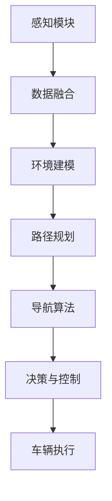

                 

## 1. 背景介绍

自动驾驶技术已成为现代交通领域的核心竞争力之一。通过传感器、摄像头、雷达等设备，自动驾驶系统能够实时感知车辆周围环境，通过路径规划和导航算法，安全、高效地控制车辆行驶。本文将重点探讨自动驾驶中路径规划与导航算法的优化，以期为行业带来更具创新性和实用性的解决方案。

## 2. 核心概念与联系

### 2.1 核心概念概述

为了深入理解自动驾驶中的路径规划与导航算法，需要明确几个核心概念：

- **路径规划(Path Planning)**：在给定起点、终点和障碍物的条件下，计算出从起点到终点的最优路径。
- **导航算法(Navigation Algorithm)**：根据路径规划结果，引导车辆沿着预设路径行驶。
- **传感器融合(Sensor Fusion)**：将来自不同传感器的数据进行融合，以提高定位和环境感知的准确性。
- **环境建模(Environment Modeling)**：建立车辆周围环境的动态模型，辅助路径规划和导航决策。
- **决策与控制(Decision and Control)**：根据环境和任务需求，做出路径规划、加速度、转向等决策，并通过车辆控制系统执行。

这些核心概念之间通过特定的流程和逻辑进行连接，形成了一套完整的自动驾驶系统。

### 2.2 核心概念原理和架构的 Mermaid 流程图



该图展示了感知、数据融合、环境建模、路径规划、导航算法、决策与控制和车辆执行之间的关系。其中，感知模块通过传感器获取周围环境信息，数据融合模块将不同传感器的数据融合为一个综合信息，环境建模模块在此基础上构建动态环境模型，路径规划模块根据起点、终点和环境模型计算最优路径，导航算法模块根据路径规划结果进行导航决策，决策与控制模块根据导航决策输出车辆控制指令，最后由车辆执行模块执行具体动作。

## 3. 核心算法原理 & 具体操作步骤

### 3.1 算法原理概述

自动驾驶中的路径规划与导航算法，通常包括以下几个步骤：

1. **数据感知与处理**：通过传感器获取车辆周围环境信息，并进行数据预处理。
2. **环境建模**：将感知数据构建为环境模型，便于进行路径规划和导航决策。
3. **路径规划**：在环境模型基础上，计算出从起点到终点的最优路径。
4. **导航与决策**：根据路径规划结果进行导航决策，并通过车辆控制系统执行。

路径规划与导航算法可以大致分为基于图论的算法和基于行为规划的算法两大类。前者主要通过搜索算法求解路径，后者则通过定义行为和决策规则进行路径规划。

### 3.2 算法步骤详解

**步骤1：数据感知与处理**

自动驾驶系统依赖于多个传感器获取环境数据。常用的传感器包括激光雷达(LiDAR)、摄像头、雷达(Radar)、GPS等。数据感知过程通常包括以下几个步骤：

1. **数据采集**：通过传感器采集车辆周围环境数据。
2. **数据预处理**：对采集到的数据进行滤波、校正和归一化等预处理操作，去除噪声和异常值。
3. **特征提取**：将预处理后的数据转化为可用于模型处理的特征。

**步骤2：环境建模**

环境建模是将感知数据转换为车辆能够理解的形式，通常通过以下方法实现：

1. **地图构建**：使用高精度地图和定位系统构建车辆周围的环境地图。
2. **障碍物检测**：通过图像处理和深度学习算法，检测并分类环境中的障碍物。
3. **动态更新**：根据实时传感器数据，动态更新环境地图和障碍物信息。

**步骤3：路径规划**

路径规划算法通常包括图搜索算法和行为规划算法两种：

1. **图搜索算法**：如A*、D*、RRT等，通过构建图模型和搜索算法计算最优路径。
2. **行为规划算法**：如POMDP、Q-learning等，通过定义行为和决策规则进行路径规划。

**步骤4：导航与决策**

导航与决策算法将路径规划结果转化为车辆的具体动作，通常包括以下几个步骤：

1. **路径生成**：根据路径规划结果生成连续的轨迹。
2. **轨迹跟踪**：通过车辆控制系统跟踪路径轨迹，避免偏离。
3. **动态调整**：根据实时环境变化，动态调整路径和速度。

### 3.3 算法优缺点

**优点**：

- 高度集成化：自动驾驶系统通过多传感器融合和环境建模，能够实现更精准的环境感知和路径规划。
- 实时性：基于图搜索和行为规划的算法，能够实时计算路径和调整行为，适应动态环境。
- 安全性：通过多层次的安全冗余和智能决策，自动驾驶系统能够在复杂环境中保证安全。

**缺点**：

- 高计算成本：大规模的传感器数据和高精度地图需要大量计算资源。
- 路径规划复杂：环境复杂和动态变化会增加路径规划的难度。
- 决策难度高：自动驾驶系统的决策需要在不确定性环境中做出，具有较高复杂度。

### 3.4 算法应用领域

自动驾驶中的路径规划与导航算法在多个领域具有广泛的应用，包括：

- **汽车制造**：在传统汽车和自动驾驶汽车中应用，提升驾驶体验和安全性。
- **物流运输**：在配送车辆中应用，提高配送效率和准确性。
- **公共交通**：在公交车、地铁等公共交通工具中应用，提高运输效率和舒适性。
- **无人驾驶**：在无人驾驶无人机、无人驾驶船等应用中，实现自动化驾驶和运输。

## 4. 数学模型和公式 & 详细讲解

### 4.1 数学模型构建

自动驾驶中的路径规划与导航算法，通常基于以下几个数学模型：

- **几何模型**：用于描述车辆和环境的几何关系，如车辆的位置、速度和姿态。
- **动力学模型**：用于描述车辆的运动特性，如加速度、角加速度等。
- **路径模型**：用于描述车辆行驶的路径，如轨迹、方向等。
- **环境模型**：用于描述车辆周围环境的特点，如障碍物位置、障碍物类型等。

### 4.2 公式推导过程

以A*算法为例，路径规划的数学模型和公式如下：

- **状态表示**：车辆位置的状态可以用$(x, y, \theta)$表示，其中$x$和$y$为车辆坐标，$\theta$为车辆角度。
- **代价函数**：代价函数$C$包括车辆的速度代价、转向代价和障碍物代价，表示车辆从起点到终点的总代价：$C = v + w + h$。
- **启发式函数**：启发式函数$H$估计从当前状态到终点的最短距离：$H = h(x, y, \theta, x_t, y_t, \theta_t)$。
- **A*算法**：在A*算法中，通过搜索代价最小的路径来规划车辆行驶轨迹，具体步骤如下：
  1. 初始化起点状态$(x_s, y_s, \theta_s)$和终点状态$(x_t, y_t, \theta_t)$。
  2. 将起点状态加入开放列表$o$。
  3. 从开放列表中取出代价最小的状态，加入关闭列表$c$。
  4. 遍历当前状态的所有可能邻居，计算到终点的代价估计，并更新邻居状态。
  5. 如果当前状态为终点状态，则计算路径并结束算法。
  6. 如果当前状态不是终点状态且不在关闭列表中，则将其加入开放列表。
  7. 重复步骤3-6，直到找到终点状态或开放列表为空。

### 4.3 案例分析与讲解

以A*算法在自动驾驶路径规划中的应用为例，具体讲解其原理和操作：

**案例背景**：

某自动驾驶汽车需要在复杂的城市道路上从一个路口到另一个路口，路径上存在障碍物和多车道交叉。

**步骤1：数据感知与处理**

1. **数据采集**：通过激光雷达、摄像头和GPS获取车辆周围环境和位置信息。
2. **数据预处理**：对采集到的数据进行滤波、校正和归一化等预处理操作，去除噪声和异常值。
3. **特征提取**：将预处理后的数据转化为车辆坐标和障碍物位置等特征。

**步骤2：环境建模**

1. **地图构建**：使用高精度地图和定位系统构建车辆周围的环境地图。
2. **障碍物检测**：通过图像处理和深度学习算法，检测并分类环境中的障碍物。
3. **动态更新**：根据实时传感器数据，动态更新环境地图和障碍物信息。

**步骤3：路径规划**

1. **路径生成**：使用A*算法根据起点、终点和环境地图计算最优路径。
2. **路径优化**：根据实时传感器数据和环境变化，对路径进行动态调整和优化。

**步骤4：导航与决策**

1. **路径跟踪**：通过车辆控制系统跟踪路径轨迹，避免偏离。
2. **动态调整**：根据实时环境变化，动态调整路径和速度。

通过以上步骤，自动驾驶系统能够实时感知环境、计算最优路径、进行导航决策，并控制车辆行驶，确保安全、高效地到达目的地。

## 5. 项目实践：代码实例和详细解释说明

### 5.1 开发环境搭建

为进行自动驾驶路径规划与导航算法的开发，需要搭建一个合适的开发环境，具体步骤如下：

1. **安装操作系统和工具链**：选择适合的Linux发行版，如Ubuntu或CentOS，安装必要的工具链和库。
2. **安装传感器硬件**：购买并安装激光雷达、摄像头、GPS等传感器。
3. **搭建仿真平台**：使用CARLA或V-REP等仿真软件，搭建自动驾驶仿真环境。
4. **开发环境配置**：安装Python、ROS等开发环境，并配置传感器数据采集和处理工具。

### 5.2 源代码详细实现

以使用A*算法进行路径规划为例，具体实现步骤如下：

1. **定义状态表示**：使用Numpy库定义车辆位置和状态向量。
2. **定义代价函数**：计算车辆速度、转向和障碍物代价。
3. **定义启发式函数**：计算车辆到终点的最短距离。
4. **定义A*算法**：实现A*算法的搜索过程和路径生成。
5. **实现导航决策**：根据路径规划结果生成车辆动作。

具体代码如下：

```python
import numpy as np
from heapq import heappop, heappush

# 定义车辆状态和代价函数
class VehicleState:
    def __init__(self, x, y, theta, v, w, h):
        self.x = x
        self.y = y
        self.theta = theta
        self.v = v
        self.w = w
        self.h = h

    def __lt__(self, other):
        return self.cost < other.cost

class CostFunction:
    def __init__(self, v, w, h):
        self.v = v
        self.w = w
        self.h = h

    def __call__(self, state, goal):
        return self.v * state.v + self.w * state.w + self.h(state.x, state.y, state.theta, goal.x, goal.y, goal.theta)

# 定义A*算法
def a_star(start, goal, cost_func, heuristic_func):
    open_list = [start]
    closed_list = set()
    while open_list:
        current = heappop(open_list)
        if current == goal:
            return construct_path(start, goal, open_list, closed_list)
        closed_list.add(current)
        for neighbor in get_neighbors(current):
            if neighbor in closed_list:
                continue
            cost = cost_func(current, goal) + heuristic_func(neighbor, goal)
            if neighbor not in open_list:
                heappush(open_list, neighbor)
            else:
                if cost < neighbor.cost:
                    neighbor.cost = cost
                    neighbor.parent = current
                    neighbor.g = cost_func(current, goal)
    return None

# 定义路径生成函数
def construct_path(start, goal, open_list, closed_list):
    path = []
    current = goal
    while current.parent is not None:
        path.append(current)
        current = current.parent
    path.append(start)
    path.reverse()
    return path

# 定义邻居函数
def get_neighbors(state):
    # 根据状态定义邻居
    pass

# 定义启发式函数
def heuristic(state, goal):
    # 根据状态定义启发式函数
    pass
```

### 5.3 代码解读与分析

**代码1：定义状态表示**

使用Numpy库定义车辆状态类`VehicleState`，包含车辆的位置、速度、转向代价和障碍物代价等状态信息。

**代码2：定义代价函数**

定义`CostFunction`类，用于计算车辆状态的总代价，其中包含速度代价、转向代价和障碍物代价。

**代码3：定义A*算法**

实现A*算法的搜索过程，包括打开列表和关闭列表的维护、启发式函数的应用和路径生成等。

**代码4：定义路径生成函数**

使用路径生成函数`construct_path`将路径按照起始点和终点顺序连接起来。

**代码5：定义邻居函数**

根据当前状态定义邻居函数，邻居函数通常根据车辆的位置、速度和转向能力来生成。

**代码6：定义启发式函数**

定义启发式函数`heuristic`，通常采用曼哈顿距离或欧几里得距离来计算车辆到终点的最短距离。

### 5.4 运行结果展示

在仿真平台中运行代码，即可生成自动驾驶汽车在复杂环境中的路径规划轨迹。通过实时传感器数据和环境变化，动态调整路径和速度，确保安全、高效地到达目的地。

## 6. 实际应用场景

### 6.1 自动驾驶车辆路径规划

在自动驾驶车辆中，路径规划与导航算法被广泛应用，帮助车辆在复杂道路环境中安全行驶。

**应用场景**：某自动驾驶汽车需要在城市道路上行驶，通过激光雷达和摄像头感知周围环境，使用A*算法规划最优路径，并在导航决策模块中生成车辆动作，最终控制车辆行驶。

**效果展示**：车辆能够顺利通过多车道交叉和障碍物，到达目的地。

### 6.2 无人驾驶配送车路径规划

在无人驾驶配送车中，路径规划与导航算法用于规划最优配送路线，提高配送效率和准确性。

**应用场景**：某无人驾驶配送车需要在城市道路上进行配送，通过GPS和高精度地图获取位置信息，使用行为规划算法生成最优配送路径，并在导航决策模块中生成车辆动作，最终控制车辆行驶。

**效果展示**：配送车能够快速、准确地到达配送点，提高配送效率。

### 6.3 智能交通系统路径规划

在智能交通系统中，路径规划与导航算法用于优化交通流量，提高道路通行效率。

**应用场景**：某智能交通系统需要在城市道路中优化交通流量，通过传感器获取车辆位置和速度信息，使用图搜索算法计算最优路径，并在导航决策模块中生成车辆动作，最终控制车辆行驶。

**效果展示**：交通流量得到优化，车辆行驶更加顺畅。

### 6.4 未来应用展望

未来，自动驾驶中的路径规划与导航算法将在更多场景中得到应用，如自动驾驶无人机、自动驾驶船等。随着技术的不断进步，这些算法将变得更加智能和高效，为智能交通和物流运输等领域带来更多创新和突破。

## 7. 工具和资源推荐

### 7.1 学习资源推荐

为了帮助开发者深入理解自动驾驶中的路径规划与导航算法，推荐以下学习资源：

1. 《自动驾驶系统设计与实现》书籍：详细介绍了自动驾驶系统的各个模块，包括感知、路径规划、导航等，适合入门学习。
2. Udacity《自动驾驶工程师纳米学位》课程：涵盖自动驾驶系统的各个环节，包括传感器数据处理、路径规划、导航等，适合进阶学习。
3. ROS官方文档：详细介绍了ROS（Robot Operating System）的各个模块和应用，包括自动驾驶系统的搭建和调试，适合实践学习。

### 7.2 开发工具推荐

为自动驾驶路径规划与导航算法的开发提供支持的常用工具包括：

1. ROS：开源的机器人操作系统，支持多传感器融合和路径规划。
2. CARLA：自动驾驶仿真平台，支持传感器数据采集和环境建模。
3. Gazebo：机器人仿真工具，支持多传感器融合和环境建模。
4. Python：自动驾驶系统开发的主流编程语言，支持多种传感器数据处理和算法实现。
5. Numpy：科学计算库，支持多维数组和矩阵运算，适合自动驾驶系统的数值计算。

### 7.3 相关论文推荐

自动驾驶中的路径规划与导航算法是自动驾驶领域的热门研究方向，以下是几篇经典论文，推荐阅读：

1. A* Search Algorithm for Real-Time Path Planning（A*搜索算法在实时路径规划中的应用）
2. Behavior-Based Navigation of Autonomous Vehicles（基于行为导航的自动驾驶车辆）
3. FastSLAM: Towards Real-Time SLAM（快速SLAM算法）
4. Dynamic Path Planning for Autonomous Vehicles（自动驾驶车辆的动态路径规划）
5. DeepDrive: Automated Driving via Deep Learning（基于深度学习的自动驾驶系统）

## 8. 总结：未来发展趋势与挑战

### 8.1 研究成果总结

本文详细介绍了自动驾驶中的路径规划与导航算法，包括数据感知与处理、环境建模、路径规划和导航与决策等步骤，并使用A*算法进行路径规划的实现。通过案例分析和代码实践，展示了路径规划与导航算法在自动驾驶中的应用效果。

### 8.2 未来发展趋势

未来，自动驾驶中的路径规划与导航算法将呈现以下发展趋势：

1. **高精度地图的应用**：高精度地图和定位系统将成为自动驾驶系统的重要组成部分，进一步提高路径规划的准确性和实时性。
2. **多传感器融合**：传感器数据融合技术将进一步提高车辆感知和环境建模的准确性，优化路径规划和导航决策。
3. **实时路径优化**：实时路径优化算法将进一步提升车辆在动态环境中的路径规划能力，增强车辆的安全性和稳定性。
4. **模型预测**：通过机器学习和预测模型，对车辆周围环境和动态变化进行预测，进一步优化路径规划和导航决策。

### 8.3 面临的挑战

自动驾驶中的路径规划与导航算法在发展过程中面临以下挑战：

1. **数据质量**：传感器数据的质量和实时性对路径规划和导航决策有重要影响，需要提高数据采集和处理的精度。
2. **环境复杂性**：复杂环境中的路径规划和导航决策具有较高难度，需要进一步优化算法和增强模型预测能力。
3. **计算资源**：路径规划和导航决策需要大量的计算资源，需要进一步提高算法的效率和实时性。
4. **系统鲁棒性**：自动驾驶系统需要在各种极端情况下保证稳定性和安全性，需要进一步增强系统的鲁棒性。

### 8.4 研究展望

未来，路径规划与导航算法的研究将继续深入，以下是几个可能的研究方向：

1. **深度学习在路径规划中的应用**：探索深度学习算法在路径规划和导航决策中的应用，提高算法的精度和实时性。
2. **多模态信息融合**：探索视觉、激光雷达和雷达等多模态信息在路径规划和导航决策中的融合，提高系统的感知能力和决策能力。
3. **强化学习在路径规划中的应用**：探索强化学习算法在路径规划和导航决策中的应用，提高系统的智能性和适应性。
4. **路径规划的安全性和可靠性**：探索路径规划的安全性和可靠性算法，确保系统在各种极端情况下的稳定性和安全性。

## 9. 附录：常见问题与解答

### 9.1 自动驾驶中的路径规划与导航算法是否适用于所有自动驾驶应用场景？

**回答**：路径规划与导航算法在自动驾驶中具有广泛的应用，但具体应用场景需要根据实际需求进行选择。例如，在高精度地图支持良好的城市道路环境中，A*算法可以很好地应用于路径规划；而在缺乏高精度地图的农村环境中，行为规划算法可能更加适用。

### 9.2 自动驾驶系统中的路径规划与导航算法有哪些计算成本？

**回答**：自动驾驶系统中的路径规划与导航算法需要处理大量的传感器数据和环境信息，计算成本较高。主要计算成本包括以下几个方面：
1. 传感器数据处理：传感器数据采集和预处理需要大量的计算资源。
2. 环境建模：高精度地图和障碍物检测需要大量的计算资源。
3. 路径规划：图搜索和行为规划算法需要大量的计算资源。
4. 导航决策：实时路径优化和动态调整需要大量的计算资源。

### 9.3 自动驾驶中的路径规划与导航算法如何应对复杂环境？

**回答**：自动驾驶中的路径规划与导航算法应对复杂环境主要通过以下几个方面：
1. 传感器数据融合：将来自不同传感器的数据进行融合，提高感知和环境建模的准确性。
2. 多模态信息融合：将视觉、激光雷达和雷达等多模态信息进行融合，提高系统的感知能力和决策能力。
3. 路径规划优化：使用动态规划、强化学习等优化算法，进一步提升路径规划的精度和实时性。
4. 实时环境预测：通过机器学习等算法对环境进行预测，动态调整路径和速度。

### 9.4 自动驾驶中的路径规划与导航算法如何进行模型压缩和优化？

**回答**：自动驾驶中的路径规划与导航算法可以通过以下几个方面进行模型压缩和优化：
1. 模型剪枝：去除不必要的层和参数，减小模型尺寸，提高推理速度。
2. 量化加速：将浮点模型转为定点模型，压缩存储空间，提高计算效率。
3. 模型并行：使用多GPU或多TPU进行并行计算，提高计算效率。
4. 稀疏化存储：对模型参数进行稀疏化存储，减小存储空间。

### 9.5 自动驾驶中的路径规划与导航算法如何保证系统安全？

**回答**：自动驾驶中的路径规划与导航算法可以通过以下几个方面保证系统安全：
1. 安全冗余设计：设计多层次的安全冗余，确保系统在各种极端情况下能够正常运行。
2. 实时监测与告警：实时监测系统运行状态，设置异常告警阈值，确保系统在异常情况下的安全。
3. 算法鲁棒性：使用鲁棒性算法进行路径规划和导航决策，增强系统的鲁棒性。
4. 人为干预与监督：设计人工干预和监督机制，确保系统在关键时刻能够人工控制。

---

作者：禅与计算机程序设计艺术 / Zen and the Art of Computer Programming

