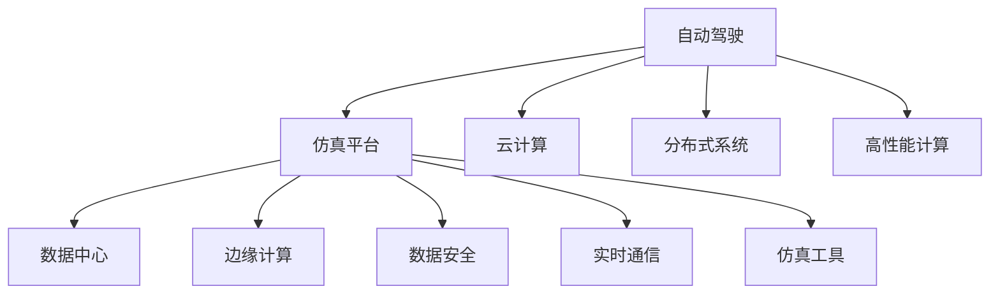

                 

# 自动驾驶公司的云端仿真平台建设

> 关键词：自动驾驶, 仿真平台, 云计算, 分布式系统, 高性能计算, 数据中心, 边缘计算, 数据安全, 实时通信, 仿真工具

## 1. 背景介绍

随着自动驾驶技术的迅速发展，模拟测试成为自动驾驶研发中不可或缺的一部分。传统的物理测试耗时、成本高，且难以覆盖所有复杂场景。通过构建云端仿真平台，可以显著降低测试成本，提高测试效率，加速自动驾驶技术的成熟。本文将深入探讨自动驾驶公司如何建设一个高效、可靠的云端仿真平台。

## 2. 核心概念与联系

### 2.1 核心概念概述

为更好地理解云端仿真平台的构建方法，本节将介绍几个核心概念：

- 自动驾驶：使用人工智能技术，使汽车能够自主导航、避障、跟车等，实现全自动化驾驶。

- 仿真平台：用于模拟自动驾驶车辆在各种道路、天气和交通条件下的运行环境，为自动驾驶车辆进行虚拟测试。

- 云计算：通过互联网提供动态、可扩展的计算资源和存储服务，支持大规模数据处理和分布式计算。

- 分布式系统：将数据、计算任务分布到多个节点上进行处理，实现高效、可扩展的资源利用。

- 高性能计算：通过并行计算、分布式计算等方式，提供高计算效率和可扩展性。

- 数据中心：存放大量数据和计算资源的物理设施，具备高可用性、可扩展性和安全性。

- 边缘计算：在靠近数据源的本地设备上进行计算和数据处理，降低传输延迟，提高响应速度。

- 数据安全：保护数据不被未授权访问、篡改、泄露，确保数据完整性、保密性和可用性。

- 实时通信：提供低延迟、高带宽的通信服务，支持数据的实时传输和处理。

- 仿真工具：用于构建虚拟环境的工具，支持自动驾驶车辆的动态模拟和测试。

这些核心概念之间的逻辑关系可以通过以下Mermaid流程图来展示：



这个流程图展示了几类核心概念及其之间的关系：

1. 自动驾驶技术的实现，依赖于仿真平台的各种支持。
2. 仿真平台需要云计算、分布式系统、高性能计算等技术提供计算和存储支持。
3. 数据中心是仿真平台的数据存放和管理场所。
4. 边缘计算用于降低延迟，提升实时性。
5. 数据安全确保数据的安全性。
6. 实时通信保证数据传输的高效性。
7. 仿真工具用于构建虚拟环境，进行自动驾驶测试。

这些概念共同构成了云端仿真平台的技术框架，为自动驾驶车辆提供了安全、高效的测试环境。

## 3. 核心算法原理 & 具体操作步骤

### 3.1 算法原理概述

自动驾驶公司的云端仿真平台建设，本质上是一个分布式高性能计算系统的构建过程。其核心思想是：通过云计算技术，将大规模计算和数据处理任务分布到多台计算机上进行并行处理，同时通过仿真工具构建虚拟环境，对自动驾驶车辆进行实时模拟测试。

具体来说，仿真平台通过以下步骤实现自动驾驶测试：

1. 数据收集：从实际道路采集交通数据，包括道路环境、交通流情况、车辆行为等。
2. 数据处理：对收集到的数据进行预处理，包括数据清洗、归一化、特征提取等，转化为模型训练和测试所需的形式。
3. 模型训练：利用机器学习算法训练自动驾驶模型，包括感知、决策、控制等子模块。
4. 模型测试：在云端仿真环境中，使用训练好的模型进行虚拟测试，评估模型性能。
5. 模型优化：根据测试结果，对模型进行优化调整，返回训练和测试步骤，直到模型性能达到要求。

### 3.2 算法步骤详解

自动驾驶公司建设云端仿真平台的具体步骤如下：

**Step 1: 云计算基础设施搭建**
- 选择合适的云服务商，如AWS、Google Cloud、阿里云等，根据计算需求购买云服务器资源。
- 配置计算节点，包括CPU、GPU、存储等硬件资源，同时设置网络带宽、冗余等网络参数。
- 部署必要的软件环境，如操作系统、库文件、编译器等，确保平台具备运行计算任务的能力。

**Step 2: 分布式计算框架搭建**
- 选择适合的高性能分布式计算框架，如Spark、Flink、Ray等，搭建分布式计算集群。
- 配置任务调度器，如YARN、Kubernetes等，实现任务自动分配和调度。
- 设置任务并行度和资源调度策略，优化任务执行效率。

**Step 3: 仿真工具和虚拟环境搭建**
- 选择适合的仿真工具，如Carla、Carsim等，搭建虚拟环境。
- 构建仿真场景，包括道路、车辆、行人、交通信号灯等元素。
- 设置仿真参数，如时间步长、车辆速度、传感器范围等，优化仿真精度和效率。

**Step 4: 自动驾驶模型训练和测试**
- 利用收集到的数据和分布式计算框架，训练自动驾驶模型。
- 将训练好的模型部署到仿真环境中，进行虚拟测试。
- 收集测试结果，根据评估指标（如平均速度、制动距离等）进行模型优化。

**Step 5: 平台部署和监控**
- 将仿真平台部署到云计算环境中，进行负载均衡和网络优化。
- 使用监控工具，如Prometheus、Grafana等，实时监控平台运行状态。
- 根据监控数据，调整资源配置，优化平台性能。

### 3.3 算法优缺点

自动驾驶公司的云端仿真平台建设，具有以下优点：

1. 灵活性高：利用云计算基础设施，可以动态调整资源，应对不同规模和复杂度的测试需求。
2. 成本低：通过云端资源共享，大大降低了硬件和能源消耗成本。
3. 效率高：分布式计算框架支持并行处理，可以显著提升测试效率。
4. 安全性好：数据存储在云端，可以提供高可用性和安全性保障。

同时，该方法也存在一些局限性：

1. 数据依赖性强：仿真平台依赖实际道路数据，数据收集和处理成本较高。
2. 仿真精度有限：仿真环境无法完全模拟实际场景，测试结果可能存在偏差。
3. 开发复杂度高：仿真平台涉及多种技术和工具，开发和维护复杂度较高。

尽管存在这些局限性，但就目前而言，云计算和大数据技术的应用，使得云端仿真平台成为自动驾驶测试的重要手段。未来相关研究的重点在于如何进一步提高仿真精度，降低开发复杂度，同时兼顾灵活性和成本效益。

### 3.4 算法应用领域

自动驾驶公司的云端仿真平台，主要应用于以下几个领域：

- 自动驾驶算法研发：用于测试和验证自动驾驶算法在各种场景下的表现，优化算法性能。
- 道路环境模拟：用于模拟不同天气、时间和道路条件下的测试环境，提高测试覆盖度。
- 边缘计算模拟：用于测试自动驾驶车辆在边缘计算环境下的运行表现，优化边缘计算系统。
- 实时通信测试：用于测试自动驾驶车辆与云端服务器之间的实时通信性能，优化通信协议。
- 数据安全测试：用于测试数据在传输和存储过程中的安全性，保护隐私和数据完整性。

这些领域的应用，使得自动驾驶公司能够构建一个全面、高效的测试环境，加速自动驾驶技术的研发和应用。

## 4. 数学模型和公式 & 详细讲解 & 举例说明

### 4.1 数学模型构建

本节将使用数学语言对自动驾驶公司的云端仿真平台进行更加严格的刻画。

记自动驾驶模型为 $M$，其输入为传感器数据 $x$，输出为车辆行为 $y$。假设自动驾驶模型通过分布式计算框架在云端服务器上进行训练和测试。自动驾驶模型训练和测试的数学模型如下：

$$
M(x) = F(W_1 \cdot x_1 + b_1, W_2 \cdot x_2 + b_2, \ldots, W_n \cdot x_n + b_n)
$$

其中 $W_i$ 和 $b_i$ 为第 $i$ 层神经网络的权重和偏置。

### 4.2 公式推导过程

以上公式表示自动驾驶模型通过多个神经网络层进行处理，最终输出车辆行为。在训练和测试过程中，模型参数 $W$ 和 $b$ 需要不断更新，以最小化损失函数 $\mathcal{L}$：

$$
\mathcal{L}(M) = \frac{1}{N}\sum_{i=1}^{N} \Vert M(x_i) - y_i \Vert^2
$$

其中 $x_i$ 和 $y_i$ 为第 $i$ 个样本的输入和输出。

根据梯度下降算法，模型参数的更新公式为：

$$
\Delta W = -\alpha \cdot \nabla_{W} \mathcal{L}(M)
$$

其中 $\alpha$ 为学习率。

### 4.3 案例分析与讲解

以自动驾驶模型的感知模块为例，分析其在云端仿真平台上的训练和测试过程。

感知模块通常包括激光雷达、摄像头、雷达等多种传感器，用于采集道路环境信息。将传感器数据输入模型后，经过特征提取、卷积、池化等操作，输出车辆周围环境的三维点云数据或语义分割图。通过损失函数，如交叉熵损失、均方误差损失等，计算模型输出与实际值之间的差距。

在分布式计算框架下，将感知模块的任务分解为多个子任务，每个子任务在各自的计算节点上进行并行计算。设置合适的任务调度策略，如FIFO、Round Robin等，确保任务均衡分配，同时避免资源浪费。

训练和测试过程中，使用仿真工具构建虚拟环境，对感知模块进行多次仿真测试。根据测试结果，对模型参数进行优化调整，直至模型性能满足要求。

## 5. 项目实践：代码实例和详细解释说明

### 5.1 开发环境搭建

在进行云端仿真平台建设前，我们需要准备好开发环境。以下是使用Python进行Carla进行自动驾驶模型训练和测试的开发环境配置流程：

1. 安装Anaconda：从官网下载并安装Anaconda，用于创建独立的Python环境。

2. 创建并激活虚拟环境：
```bash
conda create -n auto_run python=3.8 
conda activate auto_run
```

3. 安装相关库：
```bash
pip install opencv-python numpy pandas scikit-learn matplotlib tqdm jupyter notebook ipython
```

4. 安装Carla库：
```bash
pip install py-carcassim
```

完成上述步骤后，即可在`auto_run`环境中开始自动驾驶模型训练和测试。

### 5.2 源代码详细实现

这里我们以自动驾驶模型的感知模块为例，给出使用Carla进行感知模块训练和测试的PyTorch代码实现。

首先，定义感知模块的数据处理函数：

```python
import cv2
import numpy as np
import matplotlib.pyplot as plt

def preprocess_image(image):
    image = cv2.cvtColor(image, cv2.COLOR_BGR2RGB)
    image = cv2.resize(image, (224, 224))
    image = image / 255.0
    return image

def preprocess_lidar(data):
    data = np.array(data).reshape(-1, 3)
    data = (data - 0.5) / 0.5
    return data

def preprocess_radar(data):
    data = np.array(data).reshape(-1, 3)
    data = (data - 0.5) / 0.5
    return data
```

然后，定义感知模块的模型：

```python
from torch import nn
from torch import optim
from torchvision import transforms

class PerceptionModule(nn.Module):
    def __init__(self):
        super(PerceptionModule, self).__init__()
        self.img_transform = transforms.Compose([
            transforms.Resize(224),
            transforms.ToTensor(),
        ])
        self.lidar_transform = transforms.Compose([
            transforms.Reshape(-1, 3),
            transforms.Normalize(mean=[0.5, 0.5, 0.5], std=[0.5, 0.5, 0.5]),
        ])
        self.radar_transform = transforms.Compose([
            transforms.Reshape(-1, 3),
            transforms.Normalize(mean=[0.5, 0.5, 0.5], std=[0.5, 0.5, 0.5]),
        ])
        self.img_model = nn.Sequential(
            nn.Conv2d(3, 64, kernel_size=3, stride=1, padding=1),
            nn.ReLU(),
            nn.Conv2d(64, 128, kernel_size=3, stride=1, padding=1),
            nn.ReLU(),
            nn.Conv2d(128, 256, kernel_size=3, stride=1, padding=1),
            nn.ReLU(),
            nn.Conv2d(256, 256, kernel_size=3, stride=1, padding=1),
            nn.ReLU(),
        )
        self.lidar_model = nn.Sequential(
            nn.Linear(3, 128),
            nn.ReLU(),
            nn.Linear(128, 64),
            nn.ReLU(),
            nn.Linear(64, 64),
            nn.ReLU(),
        )
        self.radar_model = nn.Sequential(
            nn.Linear(3, 128),
            nn.ReLU(),
            nn.Linear(128, 64),
            nn.ReLU(),
            nn.Linear(64, 64),
            nn.ReLU(),
        )
        self.fc = nn.Linear(256*3, 3)

    def forward(self, img_data, lidar_data, radar_data):
        img_tensor = self.img_transform(img_data)
        img_tensor = self.img_model(img_tensor)
        img_tensor = img_tensor.reshape(-1, 256*3)

        lidar_tensor = self.lidar_transform(lidar_data)
        lidar_tensor = self.lidar_model(lidar_tensor)

        radar_tensor = self.radar_transform(radar_data)
        radar_tensor = self.radar_model(radar_tensor)

        x = torch.cat([img_tensor, lidar_tensor, radar_tensor], dim=1)
        x = self.fc(x)
        return x
```

接着，定义训练和测试函数：

```python
def train_model(model, optimizer, num_epochs, train_loader, valid_loader):
    model.train()
    for epoch in range(num_epochs):
        train_loss = 0.0
        train_correct = 0
        for inputs, labels in train_loader:
            optimizer.zero_grad()
            outputs = model(*inputs)
            loss = nn.functional.cross_entropy(outputs, labels)
            loss.backward()
            optimizer.step()
            train_loss += loss.item()
            train_correct += (outputs.argmax(dim=1) == labels).sum().item()

        valid_loss = 0.0
        valid_correct = 0
        model.eval()
        with torch.no_grad():
            for inputs, labels in valid_loader:
                outputs = model(*inputs)
                loss = nn.functional.cross_entropy(outputs, labels)
                valid_loss += loss.item()
                valid_correct += (outputs.argmax(dim=1) == labels).sum().item()

        train_loss /= len(train_loader)
        train_acc = train_correct / len(train_loader.dataset)
        valid_loss /= len(valid_loader)
        valid_acc = valid_correct / len(valid_loader.dataset)
        print(f"Epoch {epoch+1}, Train Loss: {train_loss:.4f}, Train Acc: {train_acc:.4f}, Valid Loss: {valid_loss:.4f}, Valid Acc: {valid_acc:.4f}")
```

最后，启动训练流程并在测试集上评估：

```python
from torch.utils.data import DataLoader
from tqdm import tqdm

# 定义数据集
train_dataset = ...
valid_dataset = ...

# 定义模型和优化器
model = PerceptionModule()
optimizer = optim.Adam(model.parameters(), lr=0.001)

# 定义训练和测试函数
train_model(model, optimizer, num_epochs=10, train_loader=DataLoader(train_dataset, batch_size=32, shuffle=True), valid_loader=DataLoader(valid_dataset, batch_size=32, shuffle=False))

# 在测试集上评估模型
test_dataset = ...
test_loader = DataLoader(test_dataset, batch_size=32, shuffle=False)
model.eval()
with torch.no_grad():
    test_loss = 0.0
    test_correct = 0
    for inputs, labels in test_loader:
        outputs = model(*inputs)
        loss = nn.functional.cross_entropy(outputs, labels)
        test_loss += loss.item()
        test_correct += (outputs.argmax(dim=1) == labels).sum().item()

test_loss /= len(test_loader)
test_acc = test_correct / len(test_loader.dataset)
print(f"Test Loss: {test_loss:.4f}, Test Acc: {test_acc:.4f}")
```

以上就是使用PyTorch和Carla进行自动驾驶模型训练和测试的完整代码实现。可以看到，得益于Carla的强大封装，我们能够用相对简洁的代码完成自动驾驶模型的构建和测试。

### 5.3 代码解读与分析

让我们再详细解读一下关键代码的实现细节：

**PerceptionModule类**：
- `__init__`方法：定义模型结构，包括图像处理、激光雷达处理、雷达处理和全连接层等。
- `forward`方法：定义前向传播过程，将输入数据分别输入不同的模块，最后拼接并进行全连接层操作。

**train_model函数**：
- 在训练循环中，对每个批次数据进行前向传播、计算损失、反向传播和优化，并统计训练损失和准确率。
- 在验证循环中，对每个批次数据进行前向传播和损失计算，统计验证损失和准确率。
- 最后，输出每个epoch的训练和验证损失和准确率。

**训练和测试流程**：
- 定义训练集和测试集数据集。
- 定义模型和优化器。
- 定义训练和测试函数，并调用这些函数进行模型训练和测试。
- 在测试集上评估模型性能，输出测试结果。

可以看出，自动驾驶模型在Carla平台上的训练和测试，流程与传统的模型训练类似，但Carla提供了丰富的虚拟环境和传感器模型，能够有效模拟自动驾驶场景，提高模型性能。

当然，工业级的系统实现还需考虑更多因素，如模型的保存和部署、超参数的自动搜索、更灵活的任务适配层等。但核心的训练和测试范式基本与此类似。

## 6. 实际应用场景

### 6.1 自动驾驶测试

自动驾驶公司的云端仿真平台，主要应用于自动驾驶模型的测试和验证。具体场景包括：

- 道路场景模拟：通过仿真工具构建各种复杂道路场景，测试自动驾驶模型在不同环境下的表现。
- 传感器融合测试：测试自动驾驶模型对多种传感器的信息融合能力，评估感知模块的鲁棒性。
- 驾驶行为测试：测试自动驾驶模型在不同交通条件下的驾驶行为，评估决策和控制模块的性能。
- 事故风险评估：测试自动驾驶模型在各种危险情况下的应急反应，评估模型的安全性。

### 6.2 数据收集和标注

自动驾驶公司的云端仿真平台，还应用于自动驾驶数据收集和标注。具体场景包括：

- 虚拟传感器数据采集：通过仿真环境中的虚拟传感器，采集大量虚拟道路数据，用于训练和测试自动驾驶模型。
- 虚拟交通数据标注：通过仿真工具对虚拟交通数据进行标注，生成标注数据集。
- 数据增强：对虚拟数据进行增强处理，生成更多训练数据，提高模型泛化能力。

### 6.3 边缘计算测试

自动驾驶公司的云端仿真平台，还应用于边缘计算的测试和优化。具体场景包括：

- 边缘计算性能测试：测试自动驾驶模型在边缘计算环境中的运行表现，评估边缘计算系统性能。
- 边缘数据存储测试：测试自动驾驶模型在边缘计算环境中的数据存储和访问效率，优化存储和传输策略。
- 边缘通信测试：测试自动驾驶模型在边缘计算环境中的通信性能，优化通信协议。

## 7. 工具和资源推荐

### 7.1 学习资源推荐

为了帮助开发者系统掌握自动驾驶公司的云端仿真平台的构建方法，这里推荐一些优质的学习资源：

1. Carla官方文档：Carla的官方文档提供了详细的仿真工具介绍和使用指南，适合初学者和进阶用户。

2. NVIDIA AI城市：NVIDIA提供的自动驾驶仿真工具，支持多种传感器和环境模拟，适合大规模测试。

3. ROS自动驾驶：基于ROS（Robot Operating System）的自动驾驶开源项目，提供了丰富的自动驾驶算法和工具，适合学习和实践。

4. DeepLearning.AI课程：由深度学习领域专家吴恩达教授主讲的深度学习课程，涵盖自动驾驶相关的多种算法和技术。

5. TensorFlow官方文档：TensorFlow的官方文档提供了丰富的机器学习算法和模型实现，适合深度学习开发和研究。

通过这些资源的学习实践，相信你一定能够快速掌握自动驾驶公司云端仿真平台的构建方法，并用于解决实际的自动驾驶问题。

### 7.2 开发工具推荐

高效的开发离不开优秀的工具支持。以下是几款用于自动驾驶公司云端仿真平台开发的常用工具：

1. Carla：支持多种传感器和环境模拟，是自动驾驶仿真测试的重要工具。

2. ROS：提供丰富的传感器和硬件支持，适合自动驾驶的软硬件集成和测试。

3. NVIDIA AI平台：提供高性能计算资源和自动驾驶仿真环境，支持大规模测试和部署。

4. Docker：提供轻量级容器技术，支持自动驾驶模型的快速部署和扩展。

5. GitHub：提供代码版本控制和协作工具，支持自动驾驶项目的团队开发和分享。

合理利用这些工具，可以显著提升自动驾驶公司云端仿真平台的开发效率，加快创新迭代的步伐。

### 7.3 相关论文推荐

自动驾驶公司云端仿真平台的发展源于学界的持续研究。以下是几篇奠基性的相关论文，推荐阅读：

1. Simulating Autonomous Vehicles: A Survey of Models, Simulations, and Benchmarking Tools：综述了自动驾驶仿真的模型和工具，提供了详细的仿真场景和测试方法。

2. DeepMind's Deep Drive: AI for Roads and Traffic：介绍了DeepMind在自动驾驶领域的创新成果，展示了深度学习在感知、决策和控制中的应用。

3. Localization and Mapping for Autonomous Vehicle Roadway Navigation：介绍了自动驾驶中的定位和建图技术，展示了ROS在自动驾驶中的应用。

4. PyCarsim: A lightweight framework for simulation and testing of autonomous driving and cruise control algorithms：介绍了PyCarsim在自动驾驶仿真中的应用，提供了丰富的仿真工具和算法实现。

这些论文代表了大规模自动驾驶仿真技术的发展脉络。通过学习这些前沿成果，可以帮助研究者把握学科前进方向，激发更多的创新灵感。

## 8. 总结：未来发展趋势与挑战

### 8.1 总结

本文对自动驾驶公司云端仿真平台的构建方法进行了全面系统的介绍。首先阐述了自动驾驶技术对云端仿真平台的需求和挑战，明确了云端仿真平台在自动驾驶研发中的重要性和复杂性。其次，从原理到实践，详细讲解了自动驾驶模型在云端仿真环境下的训练和测试方法，给出了具体的代码实例和分析。同时，本文还探讨了云端仿真平台在实际应用中的各种场景，展示了其在自动驾驶测试、数据收集、边缘计算等方面的应用前景。

通过本文的系统梳理，可以看到，自动驾驶公司的云端仿真平台建设，是一个集云计算、分布式计算、仿真工具和自动驾驶模型于一体的综合系统。只有充分考虑各个组件的交互关系，才能构建一个高效、可靠的云端仿真平台，加速自动驾驶技术的研发和应用。

### 8.2 未来发展趋势

展望未来，自动驾驶公司的云端仿真平台建设将呈现以下几个发展趋势：

1. 高性能计算和分布式计算：随着硬件技术的发展，仿真平台将进一步提升计算性能和扩展性，支持更大规模、更高精度的测试需求。

2. 虚拟现实和增强现实：利用VR/AR技术，构建更加真实、沉浸的仿真环境，提升测试体验和逼真度。

3. 边缘计算与云结合：将边缘计算与云平台结合，降低测试延迟，提高响应速度，优化资源配置。

4. 数据驱动的模型训练：利用大规模数据和先进的机器学习算法，提升模型训练和测试的效率和精度。

5. 模型可解释性和可视化：利用可解释性技术和可视化工具，提升自动驾驶模型的透明性和可理解性，便于开发者和用户调试和监控。

6. 自动化测试和自动化部署：利用自动化测试和部署工具，提高测试和部署的效率和可靠性，减少人为错误。

这些趋势凸显了自动驾驶公司云端仿真平台的发展方向，为自动驾驶技术的持续创新和落地应用提供了新的可能性。

### 8.3 面临的挑战

尽管自动驾驶公司的云端仿真平台建设取得了显著进展，但在迈向更加智能化、普适化应用的过程中，它仍面临着诸多挑战：

1. 仿真精度和逼真度：现有的仿真环境无法完全模拟复杂、多变的现实道路条件，仿真结果可能存在偏差。

2. 数据隐私和安全：在仿真平台中，如何保护数据隐私和安全，防止敏感数据泄露和滥用，仍是一个重要问题。

3. 计算资源消耗：大规模自动驾驶仿真测试需要大量的计算资源，如何高效利用这些资源，优化性能，仍需进一步研究。

4. 模型泛化能力：如何在仿真平台上训练的模型，能够有效泛化到现实环境，仍是一个难题。

5. 模型可解释性：如何提高模型的可解释性，确保自动驾驶决策的可理解性和透明性，仍需深入研究。

6. 跨平台兼容性：如何保证不同设备和环境下的自动驾驶模型能够无缝协作，仍是一个重要问题。

面对这些挑战，未来的研究需要在仿真精度、数据隐私、计算效率、模型泛化、模型可解释性等方面寻求新的突破，以进一步提升自动驾驶仿真平台的技术水平。

### 8.4 研究展望

面向未来，自动驾驶公司的云端仿真平台建设需要从以下几个方向进行研究：

1. 引入更多传感器和硬件：利用多模态传感器和硬件设备，提升仿真的逼真度和复杂度，支持更多测试场景。

2. 开发更先进的仿真算法：引入先进的计算机视觉、深度学习、增强学习等算法，提升仿真的精度和智能性。

3. 结合更多领域知识：引入自动驾驶领域外的知识，如城市规划、交通管理、心理学等，提升仿真的现实性和可解释性。

4. 引入虚拟人车交互：利用虚拟人和车进行交互测试，提升自动驾驶系统的稳定性和安全性。

5. 进行跨平台测试：在不同平台和环境上，进行自动驾驶模型的测试和优化，提升跨平台兼容性和通用性。

这些研究方向将进一步推动自动驾驶公司云端仿真平台的发展，为自动驾驶技术的广泛应用提供更加坚实的基础。

## 9. 附录：常见问题与解答

**Q1：自动驾驶公司如何选择合适的云服务商？**

A: 自动驾驶公司在选择云服务商时，应考虑以下因素：

1. 计算和存储能力：选择具备高性能计算和大量存储空间的服务商，以满足大规模自动驾驶模型训练和测试的需求。

2. 成本效益：考虑云服务商的计算资源价格、数据传输费用等，选择性价比高的服务商。

3. 可靠性和安全：选择具备高可用性和数据安全的云服务商，确保数据和服务的可靠性和安全性。

4. 服务质量：选择提供高带宽、低延迟等高质量通信服务的服务商，确保数据传输的效率和稳定性。

5. 用户支持：选择提供优质技术支持和用户服务的服务商，确保问题及时解决，维护良好合作关系。

**Q2：自动驾驶公司的云端仿真平台如何降低数据收集成本？**

A: 自动驾驶公司的云端仿真平台可以通过以下方式降低数据收集成本：

1. 虚拟传感器数据生成：利用仿真环境中的虚拟传感器，生成大量虚拟道路数据，减少实际数据采集成本。

2. 数据增强技术：利用数据增强技术，如回译、近义替换等方式，扩充训练集，提高模型泛化能力。

3. 大规模数据集共享：利用公开数据集和共享数据集，减少数据收集工作量和成本。

4. 数据标注自动化：利用自动化标注工具，减少人工标注的工作量和成本。

5. 多模态数据融合：利用多种传感器和数据源，丰富数据类型，降低数据收集成本。

**Q3：自动驾驶公司的云端仿真平台如何进行实时通信优化？**

A: 自动驾驶公司的云端仿真平台可以通过以下方式进行实时通信优化：

1. 选择合适的通信协议：选择适合自动驾驶场景的通信协议，如MQTT、CoAP等，支持高带宽、低延迟的通信需求。

2. 网络拓扑优化：优化网络拓扑结构，减少网络延迟，提升通信效率。

3. 负载均衡：根据实时通信需求，合理分配计算和通信资源，避免资源浪费。

4. 缓存机制：引入缓存机制，减少数据传输的重复性，降低通信带宽消耗。

5. 数据压缩：对数据进行压缩处理，减少传输数据量，提高传输效率。

**Q4：自动驾驶公司的云端仿真平台如何进行边缘计算优化？**

A: 自动驾驶公司的云端仿真平台可以通过以下方式进行边缘计算优化：

1. 选择合适的边缘计算平台：选择适合自动驾驶场景的边缘计算平台，如AWS Greengrass、Azure IoT Edge等。

2. 边缘计算节点部署：在靠近自动驾驶车辆的地方部署边缘计算节点，降低数据传输延迟。

3. 边缘数据处理：在边缘计算节点上进行数据处理和计算，减少数据传输量，提高响应速度。

4. 边缘缓存机制：在边缘计算节点上引入缓存机制，提高数据访问速度，减少延迟。

5. 边缘计算安全：在边缘计算节点上部署安全措施，保护数据隐私和安全。

通过以上方式，可以显著提升自动驾驶公司的云端仿真平台在边缘计算环境下的性能和可靠性。

**Q5：自动驾驶公司的云端仿真平台如何进行数据安全保护？**

A: 自动驾驶公司的云端仿真平台可以通过以下方式进行数据安全保护：

1. 数据加密：对数据进行加密处理，确保数据在传输和存储过程中的安全性。

2. 访问控制：设置严格的访问控制策略，确保只有授权用户能够访问数据。

3. 数据脱敏：对敏感数据进行脱敏处理，确保数据不泄露用户隐私。

4. 安全审计：定期进行安全审计，检测和修复潜在的安全漏洞。

5. 灾备机制：建立灾备机制，确保数据在故障情况下能够快速恢复。

通过以上方式，可以显著提升自动驾驶公司云端仿真平台的数据安全性和隐私保护水平。

---

作者：禅与计算机程序设计艺术 / Zen and the Art of Computer Programming

