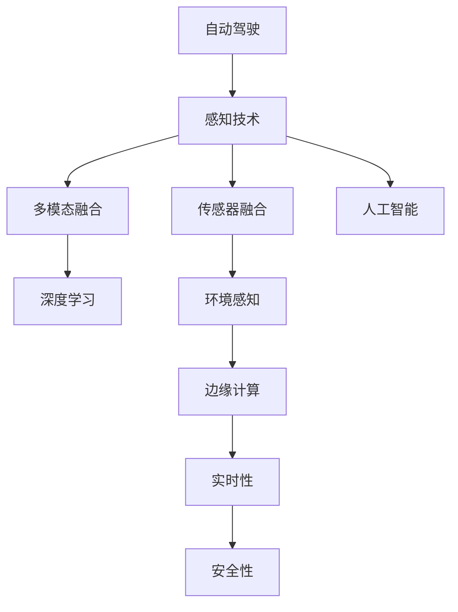

                 

# 自动驾驶感知技术未来的发展方向与突破口展望

> 关键词：自动驾驶, 感知技术, 多模态融合, 深度学习, 传感器融合, 环境感知, 边缘计算, 实时性, 安全性, 人工智能

## 1. 背景介绍

### 1.1 问题由来
随着自动驾驶技术的发展，感知系统已成为自动驾驶汽车的核心组件之一。感知系统负责收集车辆周围的环境信息，并将这些信息转换为车辆能够理解和响应的数据。从传统的摄像头和雷达，到激光雷达和声波传感器，以及多种传感器的融合，感知技术在不断的演进中。

### 1.2 问题核心关键点
目前，自动驾驶感知系统主要依赖于多种传感器数据，如摄像头、雷达、激光雷达等，通过深度学习和数据融合技术，实现对周围环境的准确感知。然而，随着技术的发展，新的传感器和数据源不断涌现，如无人机、卫星、甚至人体传感器，感知技术的边界正在被不断拓宽。

### 1.3 问题研究意义
研究自动驾驶感知技术未来的发展方向和突破口，对于提升自动驾驶汽车的感知能力，保障道路安全，加速自动驾驶技术的商业化应用，具有重要意义。

## 2. 核心概念与联系

### 2.1 核心概念概述

为更好地理解自动驾驶感知技术的发展方向，本节将介绍几个密切相关的核心概念：

- 自动驾驶(Autonomous Driving)：使用人工智能和传感器技术，使车辆具备无人驾驶能力。
- 感知技术(Sensor Perception)：自动驾驶的核心技术之一，通过多种传感器获取环境信息。
- 多模态融合(Multimodal Fusion)：融合多种传感器数据，提升感知精度和鲁棒性。
- 深度学习(Deep Learning)：感知技术的重要基础，通过神经网络提取环境特征。
- 传感器融合(Sensor Fusion)：将多种传感器数据进行融合，获得更加准确的感知结果。
- 环境感知(Environment Perception)：通过感知技术获取道路、交通、行人、障碍物等环境要素信息。
- 边缘计算(Edge Computing)：在车辆本地进行数据处理和分析，提高实时性和可靠性。
- 实时性(Real-time Performance)：感知系统必须能够实时处理和响应环境信息。
- 安全性(Safety)：感知系统必须保证数据准确性和系统可靠性，以保障行车安全。
- 人工智能(Artificial Intelligence)：感知技术的核心驱动，通过机器学习提升系统性能。

这些核心概念之间的逻辑关系可以通过以下Mermaid流程图来展示：



这个流程图展示自动驾驶感知技术的核心概念及其之间的关系：

1. 自动驾驶通过感知技术获取环境信息。
2. 感知技术采用多模态融合和深度学习技术提升数据质量。
3. 传感器融合进一步优化数据精度和完整性。
4. 环境感知实现对道路、交通、行人、障碍物的精准感知。
5. 边缘计算确保数据处理的实时性和可靠性。
6. 实时性和安全性是感知系统的关键指标。
7. 人工智能是感知技术的重要驱动力。

## 3. 核心算法原理 & 具体操作步骤
### 3.1 算法原理概述

自动驾驶感知技术的核心算法主要集中在深度学习、多模态融合和传感器融合等方面。其中，深度学习是感知技术的基础，通过神经网络实现对环境信息的特征提取和分类。多模态融合和传感器融合技术则通过融合多种传感器数据，提升感知精度和鲁棒性。

### 3.2 算法步骤详解

#### 3.2.1 深度学习算法

深度学习算法主要用于环境特征的提取和分类。典型的算法包括卷积神经网络(CNN)、循环神经网络(RNN)和变分自编码器(VAE)等。其中，CNN适用于图像数据的处理，RNN适用于序列数据的处理，VAE则用于数据的降维和生成。

以CNN为例，其基本步骤包括：

1. 数据预处理：将传感器数据转化为神经网络所需的输入形式。
2. 特征提取：通过卷积和池化操作提取图像特征。
3. 分类器训练：使用标注数据训练分类器，实现环境元素的识别。

#### 3.2.2 多模态融合算法

多模态融合算法主要应用于不同传感器数据的融合，以提高感知系统的准确性和鲁棒性。常用的算法包括加权平均法、深度学习融合和注意力机制等。

以深度学习融合为例，其基本步骤包括：

1. 数据对齐：将不同传感器数据的时空对齐。
2. 特征提取：使用深度神经网络提取不同传感器数据的特征。
3. 融合：通过加权平均、元素相加等方法，将不同传感器特征融合起来。

#### 3.2.3 传感器融合算法

传感器融合算法通过综合多种传感器的信息，提高环境感知系统的准确性和鲁棒性。常用的算法包括卡尔曼滤波、粒子滤波和信息融合等。

以卡尔曼滤波为例，其基本步骤包括：

1. 数据预测：根据传感器历史数据和运动模型预测新数据。
2. 数据更新：将新数据与预测数据结合，更新状态估计。
3. 状态估计：根据更新后的数据，估计环境状态。

### 3.3 算法优缺点

自动驾驶感知技术的深度学习和多模态融合算法，具有以下优点：

1. 准确性高：通过深度学习可以高效提取环境特征，多模态融合进一步提升了数据的准确性和鲁棒性。
2. 鲁棒性强：融合多种传感器数据，可以减轻单一传感器故障对感知系统的影响。
3. 实时性好：边缘计算提高了数据处理的实时性，确保系统能够实时响应环境变化。

但这些算法也存在一定的局限性：

1. 数据量大：多模态融合和深度学习需要大量标注数据，数据采集和标注成本较高。
2. 计算复杂：深度学习和传感器融合算法计算复杂度高，硬件要求高。
3. 鲁棒性有待提升：在复杂多变的环境下，传感器融合和深度学习算法仍存在一定的误判。
4. 模型泛化能力有限：深度学习模型在不同环境下的泛化能力仍有待提升。

### 3.4 算法应用领域

自动驾驶感知技术已经在多个领域得到广泛应用，如城市驾驶、高速公路行驶、自动泊车等。这些技术在实际应用中，通过多模态融合和深度学习技术，实现了对道路、交通、行人、障碍物的精准感知。

未来，自动驾驶感知技术还将在更多领域得到应用，如高速行驶、智能交通、车联网等。随着技术的不断进步，感知系统将能够更加全面、准确地感知周围环境，实现更加安全和可靠的自动驾驶。

## 4. 数学模型和公式 & 详细讲解 & 举例说明

### 4.1 数学模型构建

自动驾驶感知技术的数学模型主要围绕深度学习、多模态融合和传感器融合等技术展开。这里以深度学习算法和卡尔曼滤波算法为例，进行详细讲解。

#### 4.1.1 深度学习模型

以CNN为例，其基本数学模型可以表示为：

$$
\text{CNN} = \{h_1 \rightarrow f, h_2 \rightarrow f, ..., h_n \rightarrow f\}
$$

其中，$f$表示卷积和池化操作，$h_i$表示卷积层和池化层。输入数据$x$经过卷积和池化操作后，输出为特征图$y$：

$$
y = f(x; h_1, h_2, ..., h_n)
$$

#### 4.1.2 卡尔曼滤波模型

卡尔曼滤波是一种经典的传感器融合算法，其数学模型可以表示为：

$$
\begin{cases}
\bar{x}_{k|k-1} = A_k \bar{x}_{k-1|k-1} + B_k u_k \\
\bar{P}_{k|k-1} = A_k P_{k-1|k-1} A_k^T + Q_k \\
y_k = C_k \bar{x}_{k|k-1} + v_k \\
\bar{x}_{k|k} = \bar{x}_{k|k-1} + K_k (y_k - C_k \bar{x}_{k|k-1}) \\
P_{k|k} = (I - K_k C_k) P_{k|k-1}
\end{cases}
$$

其中，$\bar{x}_{k|k}$表示状态估计，$P_{k|k}$表示状态协方差，$A_k$表示运动模型，$B_k$表示输入模型，$C_k$表示观测模型，$u_k$表示输入变量，$v_k$表示观测噪声，$K_k$表示卡尔曼增益。

### 4.2 公式推导过程

以卡尔曼滤波为例，推导其数学模型：

1. 状态预测：
   $$
   \bar{x}_{k|k-1} = A_k \bar{x}_{k-1|k-1} + B_k u_k
   $$

2. 协方差预测：
   $$
   \bar{P}_{k|k-1} = A_k P_{k-1|k-1} A_k^T + Q_k
   $$

3. 状态更新：
   $$
   \bar{x}_{k|k} = \bar{x}_{k|k-1} + K_k (y_k - C_k \bar{x}_{k|k-1})
   $$

4. 协方差更新：
   $$
   P_{k|k} = (I - K_k C_k) P_{k|k-1}
   $$

其中，$I$表示单位矩阵。

### 4.3 案例分析与讲解

以自动驾驶中的行人检测为例，探讨深度学习、多模态融合和卡尔曼滤波的实际应用。

1. 数据预处理：将摄像头数据和雷达数据进行时空对齐，转化为神经网络所需的输入形式。
2. 特征提取：使用卷积神经网络提取摄像头和雷达数据的特征。
3. 分类器训练：使用标注数据训练分类器，实现行人检测。
4. 卡尔曼滤波：将行人检测结果与运动模型结合，进行状态估计，实现对行人位置的实时更新。

## 5. 项目实践：代码实例和详细解释说明
### 5.1 开发环境搭建

在进行感知系统开发前，我们需要准备好开发环境。以下是使用Python进行TensorFlow开发的环境配置流程：

1. 安装Anaconda：从官网下载并安装Anaconda，用于创建独立的Python环境。

2. 创建并激活虚拟环境：
```bash
conda create -n perception-env python=3.8 
conda activate perception-env
```

3. 安装TensorFlow：根据CUDA版本，从官网获取对应的安装命令。例如：
```bash
conda install tensorflow==2.6 
```

4. 安装OpenCV、NumPy、Pillow等工具包：
```bash
pip install opencv-python numpy pillow
```

5. 安装TensorBoard：
```bash
pip install tensorboard
```

完成上述步骤后，即可在`perception-env`环境中开始感知系统开发。

### 5.2 源代码详细实现

下面我们以行人检测为例，给出使用TensorFlow进行深度学习感知系统开发的PyTorch代码实现。

首先，定义模型和优化器：

```python
import tensorflow as tf
from tensorflow.keras.layers import Conv2D, MaxPooling2D, Dense
from tensorflow.keras.models import Model

model = tf.keras.Sequential([
    Conv2D(32, (3, 3), activation='relu', input_shape=(224, 224, 3)),
    MaxPooling2D((2, 2)),
    Conv2D(64, (3, 3), activation='relu'),
    MaxPooling2D((2, 2)),
    Flatten(),
    Dense(128, activation='relu'),
    Dense(2, activation='softmax')
])

optimizer = tf.keras.optimizers.Adam(learning_rate=0.001)
```

然后，定义损失函数和评估指标：

```python
loss_fn = tf.keras.losses.SparseCategoricalCrossentropy(from_logits=True)
metrics = [tf.keras.metrics.SparseCategoricalAccuracy('accuracy')]
```

接着，定义训练和评估函数：

```python
@tf.function
def train_step(input, target):
    with tf.GradientTape() as tape:
        logits = model(input)
        loss = loss_fn(target, logits)
    gradients = tape.gradient(loss, model.trainable_variables)
    optimizer.apply_gradients(zip(gradients, model.trainable_variables))
    return loss

@tf.function
def eval_step(input, target):
    logits = model(input)
    predictions = tf.argmax(logits, axis=1)
    loss = loss_fn(target, logits)
    accuracy = tf.reduce_mean(tf.cast(tf.equal(predictions, target), tf.float32))
    return loss, accuracy
```

最后，启动训练流程并在测试集上评估：

```python
train_dataset = tf.data.Dataset.from_tensor_slices((train_images, train_labels))
train_dataset = train_dataset.shuffle(buffer_size=1024).batch(32)

dev_dataset = tf.data.Dataset.from_tensor_slices((dev_images, dev_labels))
dev_dataset = dev_dataset.batch(32)

test_dataset = tf.data.Dataset.from_tensor_slices((test_images, test_labels))
test_dataset = test_dataset.batch(32)

epochs = 10
batch_size = 32

for epoch in range(epochs):
    total_loss = 0
    total_correct = 0
    for i, (input, target) in enumerate(train_dataset):
        loss = train_step(input, target)
        total_loss += loss
        total_correct += tf.reduce_sum(tf.cast(tf.equal(tf.argmax(logits, axis=1), target), tf.float32))
    
    train_loss = total_loss / len(train_dataset)
    train_acc = total_correct / len(train_dataset)
    
    dev_loss, dev_acc = eval_step(dev_images, dev_labels)
    
    print(f"Epoch {epoch+1}, train loss: {train_loss:.4f}, train acc: {train_acc:.4f}, dev loss: {dev_loss:.4f}, dev acc: {dev_acc:.4f}")
```

以上就是使用TensorFlow进行行人检测深度学习的完整代码实现。可以看到，通过TensorFlow的API，我们能够简洁高效地实现模型构建、训练和评估，避免了复杂的底层操作。

### 5.3 代码解读与分析

让我们再详细解读一下关键代码的实现细节：

**Model定义**：
- `Sequential`：定义了模型的层级结构，通过堆叠多个层来实现复杂模型。
- `Conv2D`和`MaxPooling2D`：用于卷积和池化操作，提取图像特征。
- `Flatten`：将卷积层输出的二维特征图展开为向量。
- `Dense`：定义全连接层，实现特征向量的分类。

**优化器定义**：
- `Adam`：选择Adam优化器，控制学习率。

**损失函数定义**：
- `SparseCategoricalCrossentropy`：定义交叉熵损失函数，用于多分类任务。

**训练和评估函数**：
- `train_step`：定义训练步骤，计算损失并反向传播更新模型参数。
- `eval_step`：定义评估步骤，计算模型在测试集上的损失和准确率。

**训练流程**：
- 定义训练数据集和测试数据集，进行批次化处理。
- 在每个epoch内，循环训练模型，计算损失和准确率。
- 在每个epoch结束后，在验证集上评估模型性能。

可以看到，TensorFlow的API提供了丰富的函数和工具，可以极大简化模型开发和调试过程。开发者可以将更多精力放在模型设计和优化上，而不必过多关注底层实现细节。

## 6. 实际应用场景
### 6.1 智能交通系统

基于深度学习和多模态融合技术的感知系统，可以广泛应用于智能交通系统的建设中。智能交通系统通过实时感知道路交通状态，优化信号灯控制，提升交通流量，减少交通拥堵。

在技术实现上，可以将摄像头、雷达、激光雷达等传感器数据进行融合，实时感知道路上的交通元素，包括车辆、行人、道路标志、交通信号灯等。将感知结果输入到决策系统，实现交通信号灯的动态控制和交通流的优化调整。

### 6.2 高速公路自动驾驶

在高速公路自动驾驶中，感知系统通过深度学习和多模态融合技术，能够实现对道路、车辆、行人等元素的精准感知。通过实时获取传感器数据，感知系统能够准确预测交通事件，并采取相应的避障措施，保障行车安全。

具体实现时，可以使用多种传感器数据进行融合，如摄像头、雷达、激光雷达等。通过深度学习算法提取环境特征，使用卡尔曼滤波算法进行状态估计，实现对交通元素的高精度感知。

### 6.3 自动泊车系统

自动泊车系统通过感知系统获取车辆周围的环境信息，通过深度学习和多模态融合技术，实现对停车位的精准识别和停车路径的规划。

在实际应用中，可以将摄像头、雷达、激光雷达等传感器数据进行融合，实现对停车位、停车线、车辆位置的精准感知。通过深度学习算法提取特征，使用卡尔曼滤波算法进行状态估计，生成最优的停车路径和泊车指令。

### 6.4 未来应用展望

随着深度学习、多模态融合和传感器融合技术的不断进步，基于感知系统的自动驾驶应用将更加广泛和深入。

在智慧城市中，感知系统将实现对城市交通、公共安全、环境保护等多维度的实时监控和分析。通过感知系统的数据反馈，城市管理者可以及时调整城市管理策略，提升城市运行效率和安全性。

在智能家居中，感知系统可以实现对家庭成员行为的精准感知，提供个性化服务。通过深度学习算法，感知系统能够理解家庭成员的行为习惯和需求，自动调节环境温度、照明、音乐等，提升家居生活体验。

## 7. 工具和资源推荐
### 7.1 学习资源推荐

为了帮助开发者系统掌握感知技术的理论基础和实践技巧，这里推荐一些优质的学习资源：

1. CS231n《卷积神经网络》课程：斯坦福大学开设的计算机视觉课程，涵盖深度学习基础和经典模型。

2. Udacity《深度学习实战》课程：涵盖深度学习模型的开发、优化和部署。

3. DeepLearning.AI《深度学习专项课程》：涵盖深度学习基础、模型优化和实际应用。

4. NVIDIA《自动驾驶技术》课程：涵盖深度学习在自动驾驶中的实际应用。

5. TensorFlow官方文档：TensorFlow的官方文档，提供了丰富的模型和工具示例。

6. OpenCV官方文档：OpenCV的官方文档，提供了计算机视觉和图像处理的API和示例。

通过对这些资源的学习实践，相信你一定能够快速掌握感知技术的精髓，并用于解决实际的自动驾驶问题。

### 7.2 开发工具推荐

高效的开发离不开优秀的工具支持。以下是几款用于感知系统开发的常用工具：

1. TensorFlow：由Google主导开发的开源深度学习框架，支持多GPU并行计算，适合大规模工程应用。

2. PyTorch：基于Python的深度学习框架，灵活性高，适合研究型应用。

3. OpenCV：计算机视觉库，提供丰富的图像处理和分析功能。

4. TensorBoard：TensorFlow配套的可视化工具，可实时监测模型训练状态，提供丰富的图表呈现方式。

5. NVIDIA Drive：NVIDIA开发的自动驾驶工具集，提供环境感知、决策推理等功能。

6. ROS（Robot Operating System）：机器人操作系统，提供多传感器数据融合和实时控制功能。

合理利用这些工具，可以显著提升感知系统的开发效率，加快创新迭代的步伐。

### 7.3 相关论文推荐

感知技术的快速发展源于学界的持续研究。以下是几篇奠基性的相关论文，推荐阅读：

1. R-CNN: Rich Feature Hierarchies for Accurate Object Detection and Semantic Segmentation（R-CNN）：提出了基于区域提议的物体检测方法，奠定了物体检测的基础。

2. Faster R-CNN: Towards Real-Time Object Detection with Region Proposal Networks：改进R-CNN方法，实现实时物体检测。

3. Mask R-CNN: Feature Pyramid Networks for Object Detection：提出Mask R-CNN模型，实现物体的检测和分割。

4. U-Net: Convolutional Networks for Biomedical Image Segmentation：提出U-Net模型，实现图像分割。

5. YOLOv3: An Evolutionary Review of the You Only Look Once (YOLO) Framework：提出YOLO系列模型，实现实时目标检测。

6. FCOS: Fully Convolutional One-Stage Object Detection：提出FCOS模型，实现实时目标检测。

这些论文代表感知技术的核心发展脉络。通过学习这些前沿成果，可以帮助研究者把握学科前进方向，激发更多的创新灵感。

## 8. 总结：未来发展趋势与挑战

### 8.1 总结

本文对自动驾驶感知技术的未来发展方向和突破口进行了全面系统的介绍。首先阐述了感知技术在自动驾驶中的核心地位和重要性，明确了深度学习、多模态融合和传感器融合技术在感知系统中的关键作用。其次，从原理到实践，详细讲解了感知技术的核心算法和操作步骤，给出了深度学习、多模态融合和传感器融合的代码实例和详细解释。同时，本文还广泛探讨了感知技术在智能交通、高速公路自动驾驶、自动泊车等实际应用场景中的应用前景，展示了感知技术的广阔前景。

通过本文的系统梳理，可以看到，深度学习和多模态融合技术在自动驾驶感知系统中起到了至关重要的作用，极大地提升了系统的感知能力和鲁棒性。未来，感知技术的进一步发展和优化，将极大地提升自动驾驶系统的安全性、可靠性和智能性。

### 8.2 未来发展趋势

展望未来，感知技术的发展趋势主要集中在以下几个方面：

1. 深度学习模型更加高效：未来感知技术将更加关注深度学习模型的结构优化，通过模型压缩、剪枝等技术，提高模型的计算效率和推理速度。

2. 多模态融合更加精细：未来感知技术将进一步探索多种传感器数据的融合方法，通过注意力机制、深度学习融合等技术，提升数据融合的准确性和鲁棒性。

3. 传感器融合算法更加复杂：未来感知技术将更加注重传感器融合算法的复杂性，通过卡尔曼滤波、粒子滤波等技术，实现对动态环境和多变条件的高精度感知。

4. 实时性和安全性更加严格：未来感知技术将更加关注系统的实时性和安全性，通过边缘计算、硬件加速等技术，实现对感知任务的实时响应和可靠执行。

5. 模型泛化能力更强：未来感知技术将更加注重模型的泛化能力，通过迁移学习、自监督学习等技术，提高模型在不同场景下的适应性和表现。

以上趋势凸显了感知技术的广泛应用前景和不断进步的潜力。这些方向的探索发展，必将进一步提升自动驾驶系统的感知能力，为构建更加安全、可靠的自动驾驶系统铺平道路。

### 8.3 面临的挑战

尽管感知技术在自动驾驶中取得了显著进展，但在迈向更加智能化、普适化应用的过程中，仍面临诸多挑战：

1. 数据获取成本高：高质量的传感器数据获取成本较高，需要在实际道路环境中进行大量的数据采集和标注，周期较长。

2. 计算资源需求高：深度学习模型的计算资源需求较大，需要在高性能计算设备上运行，硬件成本较高。

3. 鲁棒性有待提升：在复杂多变的环境下，感知系统仍存在一定的误判，需要进一步提高系统的鲁棒性和适应性。

4. 模型泛化能力有限：感知模型在不同场景下的泛化能力仍有待提升，需要进一步优化模型结构和训练方法。

5. 数据隐私和安全问题：传感器数据的收集和处理需要严格的数据隐私和安全保护措施，防止数据泄露和滥用。

6. 感知系统的复杂性：感知系统的构建和优化需要多学科知识和技术的结合，包括计算机视觉、深度学习、传感器技术等，技术复杂度高。

正视感知技术面临的这些挑战，积极应对并寻求突破，将是大规模应用的关键。相信随着学界和产业界的共同努力，这些挑战终将一一被克服，感知技术必将在自动驾驶领域发挥更大的作用。

### 8.4 研究展望

未来，感知技术的研究将围绕以下几个方向展开：

1. 探索新型传感器：开发新型传感器，如深度相机、高分辨率雷达等，提升感知系统的多样性和覆盖范围。

2. 发展新型深度学习算法：研究新型深度学习算法，如神经网络剪枝、模型压缩等，提升感知系统的计算效率和推理速度。

3. 优化多模态融合算法：进一步优化多模态融合算法，如注意力机制、深度学习融合等，提升数据融合的准确性和鲁棒性。

4. 引入先验知识：将符号化的先验知识，如知识图谱、逻辑规则等，与神经网络模型进行融合，提升系统的可靠性和智能性。

5. 发展边缘计算技术：研究和应用边缘计算技术，提升感知系统的实时性和可靠性，降低数据传输和存储成本。

6. 发展智能决策算法：研究智能决策算法，如因果推断、强化学习等，提升感知系统的决策能力和智能化水平。

这些研究方向的探索，必将引领感知技术的进一步发展和优化，为构建安全、可靠、智能的自动驾驶系统提供新的动力。

## 9. 附录：常见问题与解答

**Q1：深度学习算法在自动驾驶中的应用有哪些？**

A: 深度学习算法在自动驾驶中的应用非常广泛，主要包括以下几个方面：

1. 目标检测：通过深度学习算法，实现对道路、车辆、行人等元素的精准检测。常用的算法包括R-CNN、YOLO等。

2. 分割：通过深度学习算法，实现对道路、车辆、行人等元素的分割。常用的算法包括U-Net、FCOS等。

3. 行为预测：通过深度学习算法，实现对行人、车辆等元素行为的预测。常用的算法包括LSTM、GRU等。

4. 道路线和交通标志识别：通过深度学习算法，实现对道路线和交通标志的精准识别。常用的算法包括CNN、RCNN等。

5. 场景理解：通过深度学习算法，实现对道路场景的理解和分析。常用的算法包括RNN、CNN等。

这些算法在自动驾驶中起到了关键作用，通过深度学习技术，感知系统能够实现对复杂多变环境的精准感知，从而保障行车安全。

**Q2：多模态融合技术在自动驾驶中的应用有哪些？**

A: 多模态融合技术在自动驾驶中的应用主要包括以下几个方面：

1. 数据对齐：通过多模态融合技术，将摄像头、雷达、激光雷达等传感器数据进行对齐，实现统一的时空表示。

2. 特征融合：通过多模态融合技术，将不同传感器数据提取的特征进行融合，提升感知系统的准确性和鲁棒性。

3. 目标跟踪：通过多模态融合技术，实现对目标的跟踪和预测，提升系统的实时性和稳定性。

4. 环境感知：通过多模态融合技术，实现对环境的多维度感知，提升系统的感知能力和决策能力。

5. 安全控制：通过多模态融合技术，实现对车辆行为和环境的综合控制，提升系统的安全性。

这些应用展示了多模态融合技术在自动驾驶中的重要作用，通过多模态融合技术，感知系统能够实现对复杂多变环境的精准感知和实时响应，从而保障行车安全。

**Q3：自动驾驶感知系统在实际应用中需要注意哪些问题？**

A: 自动驾驶感知系统在实际应用中需要注意以下几个问题：

1. 数据获取和标注：高质量的传感器数据获取和标注成本较高，需要在实际道路环境中进行大量的数据采集和标注，周期较长。

2. 计算资源需求：深度学习模型的计算资源需求较大，需要在高性能计算设备上运行，硬件成本较高。

3. 鲁棒性提升：在复杂多变的环境下，感知系统仍存在一定的误判，需要进一步提高系统的鲁棒性和适应性。

4. 模型泛化能力：感知模型在不同场景下的泛化能力仍有待提升，需要进一步优化模型结构和训练方法。

5. 数据隐私和安全：传感器数据的收集和处理需要严格的数据隐私和安全保护措施，防止数据泄露和滥用。

6. 技术复杂性：感知系统的构建和优化需要多学科知识和技术的结合，包括计算机视觉、深度学习、传感器技术等，技术复杂度高。

正视这些问题，积极应对并寻求突破，将是大规模应用的关键。相信随着学界和产业界的共同努力，这些问题终将一一被克服，感知技术必将在自动驾驶领域发挥更大的作用。

---

作者：禅与计算机程序设计艺术 / Zen and the Art of Computer Programming

