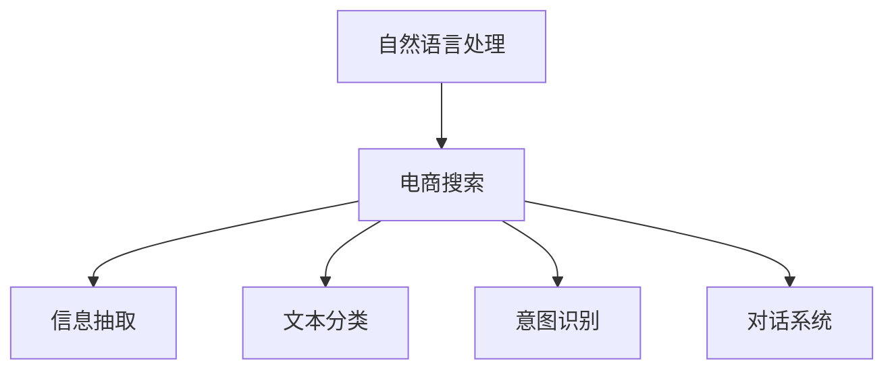

                 

# 自然语言处理在电商搜索中的应用：技术发展与未来趋势

## 1. 背景介绍

在数字化转型的大趋势下，电商搜索已成为消费者获取产品信息的主要渠道。自然语言处理（NLP）技术的应用，使电商搜索从简单的关键词匹配向更高级的语义理解和自然交互演进，极大地提升了用户搜索体验和商家的营销效率。

本文将系统介绍自然语言处理在电商搜索中的关键技术，包括信息抽取、文本分类、意图识别、对话系统等，并展望未来电商搜索的发展方向。

## 2. 核心概念与联系

### 2.1 核心概念概述

为更好地理解自然语言处理在电商搜索中的应用，本节将介绍几个关键概念：

- **自然语言处理（NLP）**：旨在使计算机能够理解、处理和生成人类语言的技术，涵盖词法分析、句法分析、语义分析、语用分析等多个层面。

- **电商搜索**：用户在电商平台上进行的商品搜索行为，包括搜索查询、结果展示、排序算法等环节。

- **信息抽取（Information Extraction, IE）**：从文本中提取出结构化信息的过程，如抽取产品名称、价格、描述等。

- **文本分类（Text Classification）**：将文本分为不同类别的任务，如商品分类、评论情感分析等。

- **意图识别（Intent Recognition）**：理解用户搜索意图的过程，如查询目的是购买、了解信息、比价等。

- **对话系统（Chatbot）**：能够与用户进行自然语言交流的系统，如智能客服、智能助手等。

这些概念之间通过如下的Mermaid流程图联系起来：



这个流程图展示了自然语言处理在电商搜索中的主要应用场景：

1. 自然语言处理作为技术基础，对电商搜索的多个环节进行支撑。
2. 信息抽取帮助电商系统从文本中提取有用的信息，如商品详情。
3. 文本分类用于分析用户评论和商品描述，提供产品评价和商品推荐。
4. 意图识别用于理解用户搜索意图，优化搜索结果排序。
5. 对话系统为电商平台提供自动化客服支持，提升用户体验。

## 3. 核心算法原理 & 具体操作步骤
### 3.1 算法原理概述

基于自然语言处理的电商搜索系统，主要涉及以下几个关键环节：

- **信息抽取（IE）**：从电商商品标题、描述等文本中提取结构化信息，如商品名称、价格、描述、类别等。
- **文本分类**：对电商商品评论进行情感分析，以及商品分类等任务。
- **意图识别**：理解用户搜索意图，提升搜索结果的相关性和排序效果。
- **对话系统**：提供自动化客户服务，增强用户体验和商家的服务效率。

这些环节的实现依赖于一系列NLP算法和技术，包括词向量表示、深度学习、序列标注、意图识别等。

### 3.2 算法步骤详解

以信息抽取为例，详细讲解其算法步骤：

1. **数据准备**：收集电商商品标题、描述等文本数据，并将其标注为相应的结构化信息。
2. **词向量表示**：使用词向量模型（如Word2Vec、GloVe等）对单词进行数值化表示。
3. **序列标注**：通过序列标注模型（如CRF、BiLSTM-CRF等）对文本进行标注，如实体边界标注、类别标注等。
4. **特征工程**：设计特征，包括单词、位置、上下文信息等，用于增强模型的表达能力。
5. **模型训练**：使用标注数据训练模型，优化模型参数，使其能够准确抽取结构化信息。
6. **预测与评估**：对未标注数据进行预测，并通过准确率、召回率等指标评估模型性能。

### 3.3 算法优缺点

信息抽取等自然语言处理算法在电商搜索中的应用，具有以下优点：

- **提升信息获取效率**：自动化抽取商品信息，避免了人工标注的繁琐工作。
- **降低数据处理成本**：通过NLP算法处理文本数据，大幅降低数据标注和清洗成本。
- **提高数据质量**：自然语言处理算法通常能够更好地处理复杂文本结构，提高信息抽取的准确性。

同时，这些算法也存在以下缺点：

- **依赖高质量数据**：模型的训练效果很大程度上取决于数据的质量和标注的准确性。
- **高计算成本**：特别是深度学习模型，需要较大的计算资源进行训练。
- **模型复杂性**：特别是序列标注模型，往往需要较深的神经网络结构，训练和推理过程较复杂。

### 3.4 算法应用领域

自然语言处理在电商搜索中的应用广泛，涵盖了以下领域：

- **商品信息抽取**：从商品标题、描述中抽取关键信息，如价格、名称、分类等。
- **评论情感分析**：对用户评论进行情感分析，判断产品评价。
- **意图识别**：理解用户搜索意图，如查找产品、比价、购买建议等。
- **对话系统**：提供智能客服支持，解答用户查询，提供产品推荐。

这些应用领域覆盖了电商搜索的多个环节，提升了用户体验和商家效率，同时也为进一步的商业分析和决策提供了数据支持。

## 4. 数学模型和公式 & 详细讲解 & 举例说明
### 4.1 数学模型构建

假设电商商品评论文本为 $X$，商品分类为 $Y$，模型的输入为 $x=(x_1,x_2,...,x_n)$，输出为 $y=(y_1,y_2,...,y_m)$，其中 $x_i$ 表示单词或单词序列，$y_j$ 表示分类标签。

### 4.2 公式推导过程

我们以文本分类为例，介绍基于神经网络的文本分类模型的构建和训练过程。

1. **词向量表示**：使用词向量模型将单词转化为向量表示 $x = [v_1,v_2,...,v_n]$，其中 $v_i$ 表示第 $i$ 个单词的词向量。
2. **卷积神经网络（CNN）**：使用一维卷积神经网络对文本进行特征提取，提取出的特征表示为 $f=[f_1,f_2,...,f_m]$，其中 $f_i$ 表示第 $i$ 个特征。
3. **池化操作**：对提取出的特征进行池化操作，得到最终特征向量 $h=[h_1,h_2,...,h_k]$，其中 $k$ 为特征向量的维度。
4. **全连接层**：将池化后的特征向量输入全连接层，得到分类结果 $y=\sigma(W'h+b)$，其中 $\sigma$ 为激活函数，$W'$ 为全连接层权重，$b$ 为偏置项。

### 4.3 案例分析与讲解

以商品评论情感分析为例，假设有一个电商商品评论数据集 $D=\{(x_i,y_i)\}_{i=1}^N$，其中 $x_i$ 为评论文本，$y_i$ 为情感标签（如正、负、中性）。使用基于卷积神经网络的文本分类模型，对其进行训练和预测。

1. **数据预处理**：将评论文本转换为词向量序列，并填充到固定长度。
2. **模型构建**：使用卷积神经网络对文本进行特征提取，并使用池化层进行降维。
3. **全连接层**：将池化后的特征向量输入全连接层，使用 sigmoid 激活函数输出概率，将概率转化为分类标签。
4. **模型训练**：使用交叉熵损失函数对模型进行训练，优化模型参数。
5. **模型评估**：在测试集上评估模型性能，计算准确率、召回率等指标。

## 5. 项目实践：代码实例和详细解释说明
### 5.1 开发环境搭建

进行电商搜索相关的NLP应用开发，需要搭建以下开发环境：

1. **Python环境**：安装Anaconda或Miniconda，创建Python虚拟环境。
2. **深度学习框架**：安装TensorFlow、PyTorch等深度学习框架，以及对应的NLP库。
3. **工具库**：安装NLTK、spaCy、Gensim等自然语言处理工具库。
4. **数据集准备**：收集电商商品评论、商品描述等数据，并进行预处理和标注。
5. **计算资源**：确保有足够的GPU或TPU资源进行模型训练和推理。

### 5.2 源代码详细实现

以下是一个基于PyTorch的电商商品评论情感分析模型的实现代码示例：

```python
import torch
import torch.nn as nn
import torch.optim as optim

class SentimentClassifier(nn.Module):
    def __init__(self, vocab_size, emb_dim, hidden_dim, output_dim):
        super(SentimentClassifier, self).__init__()
        self.embedding = nn.Embedding(vocab_size, emb_dim)
        self.conv1 = nn.Conv1d(emb_dim, hidden_dim, 3, padding=1)
        self.pooling = nn.MaxPool1d(hidden_dim)
        self.fc1 = nn.Linear(hidden_dim, hidden_dim)
        self.fc2 = nn.Linear(hidden_dim, output_dim)
        self.dropout = nn.Dropout(0.5)

    def forward(self, x):
        x = self.embedding(x)
        x = x.permute(1, 2, 0)
        x = self.conv1(x)
        x = nn.functional.relu(x)
        x = self.pooling(x)
        x = self.dropout(x)
        x = x.view(x.size(0), -1)
        x = self.fc1(x)
        x = nn.functional.relu(x)
        x = self.dropout(x)
        x = self.fc2(x)
        return x

# 定义训练函数
def train_epoch(model, data_loader, optimizer):
    model.train()
    total_loss = 0
    for x, y in data_loader:
        optimizer.zero_grad()
        output = model(x)
        loss = nn.functional.cross_entropy(output, y)
        loss.backward()
        optimizer.step()
        total_loss += loss.item()
    return total_loss / len(data_loader)

# 定义测试函数
def evaluate(model, data_loader):
    model.eval()
    total_preds = []
    total_labels = []
    with torch.no_grad():
        for x, y in data_loader:
            output = model(x)
            preds = torch.argmax(output, dim=1).tolist()
            total_preds.extend(preds)
            total_labels.extend(y.tolist())
    return classification_report(total_labels, total_preds)

# 加载数据集
train_dataset = load_train_dataset()
test_dataset = load_test_dataset()

# 定义模型和优化器
model = SentimentClassifier(vocab_size=20000, emb_dim=100, hidden_dim=100, output_dim=3)
optimizer = optim.Adam(model.parameters(), lr=0.001)

# 训练模型
epochs = 10
for epoch in range(epochs):
    loss = train_epoch(model, train_loader)
    print(f"Epoch {epoch+1}, train loss: {loss:.3f}")
    
    print(f"Epoch {epoch+1}, test results:")
    evaluate(model, test_loader)

# 保存模型
torch.save(model.state_dict(), 'sentiment_model.pt')
```

### 5.3 代码解读与分析

这段代码实现了基于卷积神经网络的电商商品评论情感分析模型。其主要步骤如下：

1. **模型定义**：定义了一个包含嵌入层、卷积层、池化层、全连接层和Dropout层的SentimentClassifier模型。
2. **训练函数**：实现了训练函数train_epoch，对模型进行前向传播、反向传播和参数更新。
3. **测试函数**：实现了测试函数evaluate，对模型进行预测并计算分类指标。
4. **数据集加载**：加载电商商品评论数据集，将其分为训练集和测试集。
5. **模型训练**：使用Adam优化器对模型进行训练，并计算训练集和测试集的损失。
6. **模型保存**：训练完成后，保存模型参数。

此代码仅为一个简单的示例，实际的电商搜索系统开发中，需要根据具体需求进行更加复杂的模型设计和优化。

## 6. 实际应用场景
### 6.1 电商搜索中的信息抽取

信息抽取在电商搜索中的应用主要体现在商品详情的自动化提取上。例如，通过NLP技术从商品标题、描述中抽取价格、品牌、类别等信息，可以极大地提高搜索效率和准确性。

以价格抽取为例，假设有一个电商商品数据集，其中每个商品包含多个属性，如价格、品牌、类别等。使用信息抽取模型，对商品描述进行分析和标注，自动提取出价格信息，并将其结构化存储。这样，用户在进行商品搜索时，可以更快速地找到所需商品，并获取其价格、评价等详细信息。

### 6.2 电商搜索中的文本分类

文本分类在电商搜索中的应用主要体现在商品分类和用户评论分析上。例如，使用文本分类模型对用户评论进行情感分析，判断产品评价的情感倾向，从而优化商品排序和推荐。

以商品分类为例，假设有一个电商商品数据集，其中每个商品包含标题和描述文本。使用文本分类模型，对商品描述进行分类，将其划分为不同的商品类别，如电子产品、服装、家居等。这样，用户在进行商品搜索时，可以更快速地找到所需商品类别，并获取该类别的热门商品推荐。

### 6.3 电商搜索中的意图识别

意图识别在电商搜索中的应用主要体现在搜索结果排序和个性化推荐上。例如，使用意图识别模型理解用户搜索意图，从而优化搜索结果排序和推荐系统。

以搜索意图识别为例，假设用户输入的搜索查询为“苹果 iPhone 12 价格”。使用意图识别模型，自动分析用户查询意图，识别出用户是在寻找iPhone 12的价格信息。这样，电商平台可以更快速地展示相关商品，并推荐其他相关商品，如配件、配件等。

### 6.4 电商搜索中的对话系统

对话系统在电商搜索中的应用主要体现在智能客服和智能推荐上。例如，使用对话系统提供智能客服支持，解答用户查询，并根据用户偏好提供个性化商品推荐。

以智能客服为例，假设用户询问“我想买一双运动鞋，有什么推荐吗？”使用对话系统，自动分析用户意图，并推荐相关商品。这样，用户可以更快速地获取所需商品信息，提升购物体验。

## 7. 工具和资源推荐
### 7.1 学习资源推荐

为了帮助开发者系统掌握自然语言处理在电商搜索中的应用，这里推荐一些优质的学习资源：

1. **NLP在线课程**：如Coursera的《Natural Language Processing with Python》课程，提供系统化的NLP理论和实践学习。
2. **NLP书籍**：如《Speech and Language Processing》，该书全面介绍了NLP的基础知识和前沿技术。
3. **NLP工具库**：如NLTK、spaCy、Gensim等，提供了丰富的自然语言处理工具和模型。
4. **深度学习框架**：如TensorFlow、PyTorch等，提供了强大的深度学习计算图和优化算法。
5. **论文和研究报告**：如ACL、EMNLP等顶级会议的论文集，提供了最新的NLP研究成果和前沿技术。

通过对这些资源的学习实践，相信你一定能够快速掌握自然语言处理在电商搜索中的应用，并用于解决实际的NLP问题。

### 7.2 开发工具推荐

高效的开发离不开优秀的工具支持。以下是几款用于电商搜索开发常用的工具：

1. **Python环境**：如Anaconda、Miniconda等，提供虚拟环境和包管理功能。
2. **深度学习框架**：如TensorFlow、PyTorch等，提供高效的深度学习计算图和优化算法。
3. **NLP工具库**：如NLTK、spaCy、Gensim等，提供丰富的自然语言处理工具和模型。
4. **数据管理工具**：如Pandas、Dask等，提供高效的数据处理和分析功能。
5. **可视化工具**：如Matplotlib、Seaborn等，提供丰富的数据可视化功能。

合理利用这些工具，可以显著提升电商搜索的开发效率，加快创新迭代的步伐。

### 7.3 相关论文推荐

自然语言处理在电商搜索中的应用，近年来得到了广泛的研究。以下是几篇奠基性的相关论文，推荐阅读：

1. **Attention is All You Need**：提出了Transformer结构，开启了NLP领域的预训练大模型时代。
2. **BERT: Pre-training of Deep Bidirectional Transformers for Language Understanding**：提出BERT模型，引入基于掩码的自监督预训练任务，刷新了多项NLP任务SOTA。
3. **Semantic Accuracy: From Exemplar-Based to Character-Level Learning for Question Answering**：提出了基于字符级别的精确度模型，提升了问答系统的性能。
4. **Deep Neural Networks for Natural Language Processing**：介绍了深度神经网络在NLP中的应用，如文本分类、情感分析等。
5. **Universal Sentence Encoder**：提出了一种通用的句子嵌入模型，提升了NLP任务的性能。

这些论文代表了大语言处理在电商搜索领域的发展脉络。通过学习这些前沿成果，可以帮助研究者把握学科前进方向，激发更多的创新灵感。

## 8. 总结：未来发展趋势与挑战
### 8.1 总结

本文对自然语言处理在电商搜索中的应用进行了全面系统的介绍。首先介绍了自然语言处理在电商搜索中的关键技术，包括信息抽取、文本分类、意图识别、对话系统等，并展望了未来电商搜索的发展方向。

通过本文的系统梳理，可以看到，自然语言处理技术在电商搜索中的应用前景广阔，不仅能提升用户体验和商家效率，还能为商业分析和决策提供数据支持。未来，随着NLP技术的不断进步，电商搜索的智能化水平将进一步提升，成为更加智能化的零售渠道。

### 8.2 未来发展趋势

展望未来，自然语言处理在电商搜索中的应用将呈现以下几个发展趋势：

1. **个性化推荐**：利用NLP技术，更好地理解用户需求和行为，提供个性化的商品推荐。
2. **智能客服**：通过NLP和对话系统技术，提供更加智能、自然化的客服支持，提升用户体验。
3. **多模态信息融合**：结合图像、视频、语音等多模态数据，提升电商搜索的全面性和准确性。
4. **实时数据处理**：实时采集和分析用户数据，提供更加及时、精准的搜索结果。
5. **跨领域应用**：将NLP技术应用于更多领域，如旅游、教育、医疗等，推动跨领域电商搜索的普及。

这些趋势凸显了自然语言处理技术在电商搜索中的潜力和价值，为构建智能电商搜索系统提供了新的思路和方法。

### 8.3 面临的挑战

尽管自然语言处理在电商搜索中的应用已经取得了不少进展，但在迈向更加智能化、普适化应用的过程中，仍面临诸多挑战：

1. **数据质量问题**：电商搜索数据质量参差不齐，如何提升数据标注和清洗的效率和准确性，仍然是一个挑战。
2. **模型鲁棒性不足**：自然语言处理模型往往对噪声和异常数据敏感，如何在复杂环境中保持模型的稳定性和鲁棒性，仍需进一步研究。
3. **资源消耗大**：深度学习模型计算资源消耗大，如何在保证性能的同时，优化计算效率，降低资源消耗，仍然是一个难题。
4. **模型可解释性不足**：NLP模型往往被视为"黑盒"系统，难以解释其内部工作机制和决策逻辑，如何增强模型的可解释性，仍需深入研究。
5. **隐私和安全问题**：电商搜索涉及大量用户隐私数据，如何在保护隐私的同时，提供高效、安全的解决方案，仍需进一步探索。

这些挑战需要在技术、工程、伦理等多个维度进行综合优化，才能实现自然语言处理在电商搜索中的深度应用。

### 8.4 研究展望

面对自然语言处理在电商搜索中面临的挑战，未来的研究需要在以下几个方面寻求新的突破：

1. **无监督和半监督学习**：探索无监督和半监督学习范式，降低对标注数据的依赖，提升模型的泛化能力。
2. **知识增强**：引入外部知识库和规则库，增强模型的推理能力和泛化能力。
3. **多模态融合**：结合图像、视频、语音等多模态数据，提升电商搜索的全面性和准确性。
4. **实时处理**：开发实时数据处理和分析技术，提供更加及时、精准的搜索结果。
5. **隐私保护**：采用隐私保护技术，如差分隐私、联邦学习等，保护用户隐私数据安全。

这些研究方向和技术的探索，必将推动自然语言处理在电商搜索中的应用向更加智能化、安全化、个性化方向发展，为构建智能电商搜索系统铺平道路。

## 9. 附录：常见问题与解答

**Q1：自然语言处理在电商搜索中的主要应用场景有哪些？**

A: 自然语言处理在电商搜索中的主要应用场景包括信息抽取、文本分类、意图识别、对话系统等。

**Q2：如何使用深度学习模型进行电商搜索中的意图识别？**

A: 使用深度学习模型进行电商搜索中的意图识别，通常需要以下步骤：
1. 数据准备：收集电商搜索数据，进行预处理和标注。
2. 模型构建：设计基于深度学习的意图识别模型，如卷积神经网络、递归神经网络等。
3. 模型训练：使用标注数据训练模型，优化模型参数。
4. 模型评估：在测试集上评估模型性能，计算准确率、召回率等指标。
5. 应用部署：将训练好的模型部署到电商搜索系统中，进行意图识别和搜索结果排序。

**Q3：自然语言处理在电商搜索中面临的主要挑战有哪些？**

A: 自然语言处理在电商搜索中面临的主要挑战包括数据质量问题、模型鲁棒性不足、资源消耗大、模型可解释性不足和隐私安全问题。

**Q4：如何提升电商搜索中自然语言处理模型的可解释性？**

A: 提升电商搜索中自然语言处理模型的可解释性，可以采取以下措施：
1. 采用可解释性强的模型结构，如决策树、线性模型等。
2. 引入规则库和知识库，增强模型的推理能力和可解释性。
3. 使用可解释性工具，如LIME、SHAP等，分析模型决策过程。
4. 设计可解释的特征提取方法，如基于规则的特征提取、领域特定特征提取等。

这些措施可以帮助电商搜索中的自然语言处理模型更好地解释其内部工作机制和决策逻辑，提升系统的透明度和可信度。

**Q5：未来自然语言处理在电商搜索中的应用趋势是什么？**

A: 未来自然语言处理在电商搜索中的应用趋势包括个性化推荐、智能客服、多模态信息融合、实时数据处理和跨领域应用。

---

作者：禅与计算机程序设计艺术 / Zen and the Art of Computer Programming

