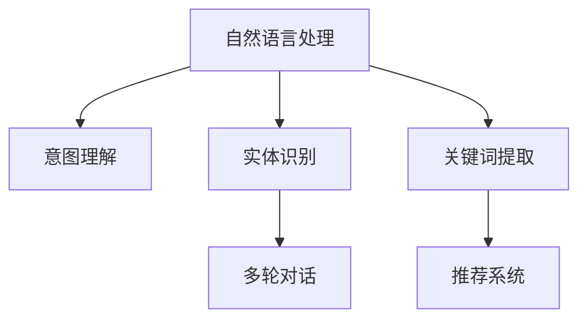

                 

## 1. 背景介绍

### 1.1 问题由来

随着电商平台的迅速发展，搜索功能成为用户体验的核心部分之一。用户通过搜索来寻找自己需要的产品，而电商平台则通过搜索功能来提高商品的曝光率和销量。因此，如何构建一个快速、精准、易用的搜索系统，是每个电商平台都必须面对的挑战。

传统搜索系统的构建基于关键词匹配技术，通过查询用户的输入关键词，在数据库中匹配出包含该关键词的商品。这种方法虽然简单易行，但在处理复杂的查询意图和长尾关键词时，效果并不理想。为了提升搜索体验，电商搜索系统引入了自然语言处理（NLP）技术，使得搜索系统能够更好地理解用户的查询意图，并给出更精准的结果。

### 1.2 问题核心关键点

自然语言处理技术在电商搜索中的应用，主要集中在以下几个方面：

1. **意图理解**：理解用户输入的自然语言查询，识别出用户的意图，如购买、询问、比较等。
2. **实体识别**：识别出查询中提及的具体实体，如品牌、商品名称、价格等。
3. **关键词提取**：从用户查询中提取出核心关键词，用于匹配数据库中的商品。
4. **多轮对话**：支持多轮对话搜索，帮助用户逐步明确自己的需求。
5. **推荐系统**：根据用户的查询历史和搜索行为，推荐相关的商品或信息。

这些技术的应用，使得搜索系统能够更好地满足用户需求，提升用户体验，同时也能为电商平台带来更高的转化率和销售额。

## 2. 核心概念与联系

### 2.1 核心概念概述

为了更好地理解自然语言处理在电商搜索中的应用，本节将介绍几个密切相关的核心概念：

1. **自然语言处理（NLP）**：研究如何让计算机理解、分析、生成人类语言的技术。在电商搜索中，NLP技术主要用于意图理解、实体识别、关键词提取等。

2. **意图理解（Intent Recognition）**：理解用户输入的自然语言查询，识别出用户的意图。是电商搜索系统成功的关键。

3. **实体识别（Entity Recognition）**：识别出查询中提及的具体实体，如商品名称、品牌、型号等。

4. **关键词提取（Keyword Extraction）**：从用户查询中提取出核心关键词，用于匹配数据库中的商品。

5. **多轮对话（Multi-turn Dialogue）**：支持多轮对话搜索，帮助用户逐步明确自己的需求。

6. **推荐系统（Recommendation System）**：根据用户的查询历史和搜索行为，推荐相关的商品或信息。

这些核心概念之间的逻辑关系可以通过以下Mermaid流程图来展示：



这个流程图展示了大语言模型的核心概念及其之间的关系：

1. 自然语言处理技术通过意图理解、实体识别、关键词提取等技术，帮助搜索系统理解用户的查询意图。
2. 多轮对话系统通过与用户的多次交互，逐步明确用户需求。
3. 推荐系统则根据用户的查询历史和行为，提供相关的商品或信息推荐。

这些概念共同构成了电商搜索系统的高效运行基础。通过理解这些核心概念，我们可以更好地把握自然语言处理在电商搜索中的应用逻辑。

## 3. 核心算法原理 & 具体操作步骤
### 3.1 算法原理概述

自然语言处理在电商搜索中的应用，主要依赖于以下几个算法和技术：

1. **意图理解算法**：使用分类算法，如SVM、神经网络等，对用户查询进行意图分类，识别出用户的意图。
2. **实体识别算法**：使用命名实体识别（NER）技术，识别出查询中的具体实体，如品牌、商品名称等。
3. **关键词提取算法**：使用TF-IDF、word2vec等技术，从用户查询中提取核心关键词。
4. **多轮对话技术**：使用对话管理模型，如规则型、统计型、神经网络型等，支持多轮对话搜索。
5. **推荐系统算法**：使用协同过滤、基于内容的推荐、深度学习等技术，根据用户行为推荐相关商品。

这些算法和技术通过算法组合和系统架构，共同构建起一个高效、精准的电商搜索系统。

### 3.2 算法步骤详解

自然语言处理在电商搜索中的应用主要包括以下几个关键步骤：

**Step 1: 数据预处理**
- 收集用户的搜索记录、商品描述等文本数据，进行清洗和标准化处理。
- 将文本数据转换为模型所需的格式，如词向量、TF-IDF等。

**Step 2: 意图理解**
- 使用意图分类算法，对用户查询进行分类，识别出用户的意图。
- 对于复杂的查询，进行意图识别和多轮对话处理，逐步明确用户需求。

**Step 3: 实体识别**
- 使用命名实体识别算法，识别出查询中提及的具体实体，如商品名称、品牌等。
- 根据实体信息，进一步过滤和筛选搜索结果。

**Step 4: 关键词提取**
- 使用TF-IDF、word2vec等技术，从用户查询中提取核心关键词。
- 根据关键词进行精确匹配，提升搜索结果的相关性。

**Step 5: 推荐系统**
- 使用协同过滤、基于内容的推荐、深度学习等技术，根据用户行为推荐相关商品。
- 结合用户历史搜索记录和当前查询，动态调整推荐结果。

**Step 6: 搜索结果排序**
- 根据搜索结果的相关性、用户反馈等指标，对搜索结果进行排序。
- 使用点击率、转化率等指标，不断优化排序算法。

### 3.3 算法优缺点

自然语言处理在电商搜索中的应用具有以下优点：

1. **提升搜索精度**：通过意图理解、实体识别、关键词提取等技术，显著提升搜索结果的精准度和相关性。
2. **增强用户体验**：多轮对话技术和推荐系统，提升了用户的搜索体验，帮助用户更快速地找到所需商品。
3. **提高销售转化率**：通过推荐系统，根据用户需求提供个性化推荐，提高转化率。

同时，这些算法也存在一定的局限性：

1. **依赖标注数据**：意图理解、实体识别等算法依赖大量标注数据，获取和标注数据的成本较高。
2. **模型复杂度高**：大规模模型的训练和部署，需要较高的计算资源和存储资源。
3. **泛化能力不足**：模型往往在特定领域表现较好，跨领域泛化能力有限。
4. **实时性要求高**：需要高效的算法和架构，确保搜索系统的实时性和响应速度。

尽管存在这些局限性，但就目前而言，自然语言处理在电商搜索中的应用已经成为了电商平台的标配，展示了其强大的实用价值。

### 3.4 算法应用领域

自然语言处理在电商搜索中的应用主要集中在以下几个领域：

1. **商品搜索**：提升商品搜索的精度和相关性，帮助用户快速找到所需商品。
2. **问答系统**：支持用户对商品属性、功能、评价等的查询，提升用户购物体验。
3. **个性化推荐**：根据用户的搜索历史和行为，提供个性化推荐，提升转化率。
4. **客服系统**：支持用户对商品的咨询、售后服务等，提升客户满意度。
5. **广告投放**：根据用户搜索行为，精准投放广告，提升广告效果。

## 4. 数学模型和公式 & 详细讲解 & 举例说明
### 4.1 数学模型构建

自然语言处理在电商搜索中的应用，主要依赖于以下几个数学模型：

1. **意图分类模型**：使用分类算法，如SVM、神经网络等，对用户查询进行分类，识别出用户的意图。

2. **实体识别模型**：使用命名实体识别（NER）技术，识别出查询中提及的具体实体。

3. **关键词提取模型**：使用TF-IDF、word2vec等技术，从用户查询中提取核心关键词。

4. **推荐系统模型**：使用协同过滤、基于内容的推荐、深度学习等技术，根据用户行为推荐相关商品。

### 4.2 公式推导过程

以下我们以意图分类模型为例，推导其核心公式。

假设用户查询为 $q$，有 $n$ 种可能的意图类型。使用神经网络对 $q$ 进行分类，得到一个长度为 $n$ 的概率向量 $p$，表示 $q$ 属于每种意图类型的概率。分类目标函数为：

$$
\min_{\theta} \sum_{i=1}^n L(y_i, p_i)
$$

其中 $y_i$ 为 $q$ 实际属于第 $i$ 种意图类型的标签，$p_i$ 为神经网络输出该类别的概率，$L$ 为损失函数，如交叉熵损失函数。

### 4.3 案例分析与讲解

**案例1: 意图理解算法**

考虑一个电商平台的搜索系统，用户输入查询 $q$，系统通过意图分类算法将其分类为购买、询问、比较等意图类型。假设系统有三种意图类型，使用SVM分类算法，分类公式为：

$$
p = \text{SVM}(q)
$$

其中 $p$ 为分类后的概率向量，$q$ 为输入查询。

**案例2: 实体识别算法**

假设用户查询 $q$ 中提及了品牌名称“Apple”，系统通过命名实体识别算法识别出该实体。使用BiLSTM-CRF模型进行实体识别，模型输出为实体标签序列 $y$，公式为：

$$
y = \text{BiLSTM-CRF}(q)
$$

其中 $y$ 为实体标签序列，$q$ 为输入查询。

**案例3: 关键词提取算法**

假设用户查询 $q$ 中提及了“iPhone 12”，系统通过TF-IDF算法提取核心关键词。关键词提取公式为：

$$
k = \text{TF-IDF}(q)
$$

其中 $k$ 为关键词向量，$q$ 为输入查询。

**案例4: 推荐系统算法**

假设用户查询 $q$ 为“我想买一部新手机”，系统通过协同过滤算法推荐相关商品。推荐公式为：

$$
r = \text{CF}(q)
$$

其中 $r$ 为推荐商品列表，$q$ 为输入查询。

## 5. 项目实践：代码实例和详细解释说明
### 5.1 开发环境搭建

在进行自然语言处理在电商搜索中的应用实践前，我们需要准备好开发环境。以下是使用Python进行PyTorch开发的环境配置流程：

1. 安装Anaconda：从官网下载并安装Anaconda，用于创建独立的Python环境。

2. 创建并激活虚拟环境：
```bash
conda create -n pytorch-env python=3.8 
conda activate pytorch-env
```

3. 安装PyTorch：根据CUDA版本，从官网获取对应的安装命令。例如：
```bash
conda install pytorch torchvision torchaudio cudatoolkit=11.1 -c pytorch -c conda-forge
```

4. 安装Python自然语言处理库：
```bash
pip install nltk spacy transformers
```

5. 安装TensorBoard：
```bash
pip install tensorboard
```

完成上述步骤后，即可在`pytorch-env`环境中开始自然语言处理在电商搜索中的应用实践。

### 5.2 源代码详细实现

这里我们以意图理解算法为例，使用SVM对用户查询进行意图分类。

```python
import numpy as np
from sklearn.svm import SVC
from sklearn.model_selection import train_test_split
from sklearn.metrics import accuracy_score

# 准备数据
data = [
    ("我想买手机", "购买"),
    ("我想问问这手机怎么样", "询问"),
    ("我想比较一下几款手机", "比较")
]
X = [q for q, _ in data]
y = [i for _, i in data]

# 划分训练集和测试集
X_train, X_test, y_train, y_test = train_test_split(X, y, test_size=0.2)

# 训练模型
model = SVC()
model.fit(X_train, y_train)

# 预测和评估
y_pred = model.predict(X_test)
acc = accuracy_score(y_test, y_pred)
print(f"Accuracy: {acc:.2f}")
```

### 5.3 代码解读与分析

这里我们详细解读一下关键代码的实现细节：

**准备数据**

- 定义查询文本和意图标签，存储在列表中。
- 将查询文本和意图标签分离，存储在`X`和`y`变量中。

**划分训练集和测试集**

- 使用`train_test_split`函数将数据集划分为训练集和测试集，比例为8:2。
- 分别将训练集和测试集的查询文本和意图标签存储在`X_train`、`X_test`、`y_train`和`y_test`变量中。

**训练模型**

- 定义SVM分类器，使用`fit`方法对训练集进行训练。

**预测和评估**

- 使用训练好的模型对测试集进行预测，存储在`y_pred`变量中。
- 计算模型在测试集上的准确率，并打印输出。

可以看到，使用SVM对用户查询进行意图分类的代码实现非常简单。通过SVM模型的训练和预测，可以快速识别出用户查询的意图。

## 6. 实际应用场景

### 6.1 智能客服系统

自然语言处理在电商搜索中的应用不仅局限于搜索功能，还可以通过智能客服系统进一步提升用户体验。传统客服往往需要配备大量人力，高峰期响应缓慢，且一致性和专业性难以保证。使用自然语言处理技术，电商平台的智能客服系统可以7x24小时不间断服务，快速响应客户咨询，用自然流畅的语言解答各类常见问题。

在技术实现上，可以收集企业内部的历史客服对话记录，将问题和最佳答复构建成监督数据，在此基础上对自然语言处理模型进行微调。微调后的模型能够自动理解用户意图，匹配最合适的答案模板进行回复。对于客户提出的新问题，还可以接入检索系统实时搜索相关内容，动态组织生成回答。如此构建的智能客服系统，能大幅提升客户咨询体验和问题解决效率。

### 6.2 金融舆情监测

金融机构需要实时监测市场舆论动向，以便及时应对负面信息传播，规避金融风险。传统的人工监测方式成本高、效率低，难以应对网络时代海量信息爆发的挑战。使用自然语言处理技术，金融舆情监测系统可以自动分析社交媒体、新闻报道等文本数据，识别出金融市场的舆情变化趋势，一旦发现负面信息激增等异常情况，系统便会自动预警，帮助金融机构快速应对潜在风险。

### 6.3 个性化推荐系统

当前的推荐系统往往只依赖用户的历史行为数据进行物品推荐，无法深入理解用户的真实兴趣偏好。使用自然语言处理技术，推荐系统可以更好地挖掘用户行为背后的语义信息，从而提供更精准、多样的推荐内容。

在实践中，可以收集用户浏览、点击、评论、分享等行为数据，提取和用户交互的物品标题、描述、标签等文本内容。将文本内容作为模型输入，用户的后续行为（如是否点击、购买等）作为监督信号，在此基础上训练自然语言处理模型。模型能够从文本内容中准确把握用户的兴趣点。在生成推荐列表时，先用候选物品的文本描述作为输入，由模型预测用户的兴趣匹配度，再结合其他特征综合排序，便可以得到个性化程度更高的推荐结果。

## 7. 工具和资源推荐

### 7.1 学习资源推荐

为了帮助开发者系统掌握自然语言处理在电商搜索中的应用，这里推荐一些优质的学习资源：

1. 《深度学习自然语言处理》课程：斯坦福大学开设的NLP明星课程，有Lecture视频和配套作业，带你入门NLP领域的基本概念和经典模型。

2. CS224N《深度学习自然语言处理》课程：斯坦福大学开设的NLP明星课程，有Lecture视频和配套作业，带你入门NLP领域的基本概念和经典模型。

3. 《Natural Language Processing with Transformers》书籍：Transformers库的作者所著，全面介绍了如何使用Transformers库进行NLP任务开发，包括自然语言处理在电商搜索中的应用。

4. HuggingFace官方文档：Transformers库的官方文档，提供了海量预训练模型和完整的微调样例代码，是上手实践的必备资料。

5. NLP论文速递：公众号定期推送NLP领域最新的研究成果和趋势分析，帮助你跟上学术界的研究进展。

通过对这些资源的学习实践，相信你一定能够快速掌握自然语言处理在电商搜索中的应用精髓，并用于解决实际的NLP问题。

### 7.2 开发工具推荐

高效的开发离不开优秀的工具支持。以下是几款用于自然语言处理在电商搜索中的应用开发的常用工具：

1. PyTorch：基于Python的开源深度学习框架，灵活动态的计算图，适合快速迭代研究。大部分自然语言处理模型都有PyTorch版本的实现。

2. TensorFlow：由Google主导开发的开源深度学习框架，生产部署方便，适合大规模工程应用。同样有丰富的自然语言处理模型资源。

3. Transformers库：HuggingFace开发的NLP工具库，集成了众多SOTA自然语言处理模型，支持PyTorch和TensorFlow，是进行自然语言处理在电商搜索中的应用开发的利器。

4. Weights & Biases：模型训练的实验跟踪工具，可以记录和可视化模型训练过程中的各项指标，方便对比和调优。与主流深度学习框架无缝集成。

5. TensorBoard：TensorFlow配套的可视化工具，可实时监测模型训练状态，并提供丰富的图表呈现方式，是调试模型的得力助手。

6. Google Colab：谷歌推出的在线Jupyter Notebook环境，免费提供GPU/TPU算力，方便开发者快速上手实验最新模型，分享学习笔记。

合理利用这些工具，可以显著提升自然语言处理在电商搜索中的应用任务的开发效率，加快创新迭代的步伐。

### 7.3 相关论文推荐

自然语言处理在电商搜索中的应用源于学界的持续研究。以下是几篇奠基性的相关论文，推荐阅读：

1. Attention is All You Need：提出了Transformer结构，开启了自然语言处理在电商搜索中的预训练大模型时代。

2. BERT: Pre-training of Deep Bidirectional Transformers for Language Understanding：提出BERT模型，引入基于掩码的自监督预训练任务，刷新了多项自然语言处理在电商搜索任务SOTA。

3. Language Models are Unsupervised Multitask Learners：展示了大规模语言模型的强大zero-shot学习能力，引发了对于自然语言处理在电商搜索中的通用人工智能的新一轮思考。

4. Parameter-Efficient Transfer Learning for NLP：提出Adapter等参数高效微调方法，在不增加模型参数量的情况下，也能取得不错的自然语言处理在电商搜索中的微调效果。

5. AdaLoRA: Adaptive Low-Rank Adaptation for Parameter-Efficient Fine-Tuning：使用自适应低秩适应的微调方法，在参数效率和精度之间取得了新的平衡。

这些论文代表了大语言模型微调技术的发展脉络。通过学习这些前沿成果，可以帮助研究者把握学科前进方向，激发更多的创新灵感。

## 8. 总结：未来发展趋势与挑战

### 8.1 总结

本文对自然语言处理在电商搜索中的应用进行了全面系统的介绍。首先阐述了自然语言处理在电商搜索中的研究背景和意义，明确了自然语言处理技术在提升搜索精度、增强用户体验、提高销售转化率等方面的独特价值。其次，从原理到实践，详细讲解了自然语言处理在电商搜索中的意图理解、实体识别、关键词提取、多轮对话、推荐系统等核心算法，给出了自然语言处理在电商搜索中的应用完整代码实例。同时，本文还广泛探讨了自然语言处理在电商搜索中的实际应用场景，展示了自然语言处理技术在电商搜索中的广泛应用前景。此外，本文精选了自然语言处理在电商搜索中的应用的各种学习资源，力求为读者提供全方位的技术指引。

通过本文的系统梳理，可以看到，自然语言处理在电商搜索中的应用已经成为了电商平台的标配，展示了其强大的实用价值。未来，伴随自然语言处理技术的持续演进，自然语言处理在电商搜索中的应用必将更加广泛，为电商搜索系统带来更高效的性能和更好的用户体验。

### 8.2 未来发展趋势

展望未来，自然语言处理在电商搜索中的应用将呈现以下几个发展趋势：

1. **模型规模持续增大**：随着算力成本的下降和数据规模的扩张，自然语言处理模型参数量还将持续增长。超大规模语言模型蕴含的丰富语言知识，有望支撑更加复杂多变的电商搜索需求。

2. **自然语言生成技术发展**：自然语言生成技术将进一步发展，使得电商搜索系统能够更加智能地生成商品描述、推荐文案等，提升用户体验。

3. **跨领域知识融合**：自然语言处理在电商搜索中的应用将更多地融合跨领域知识，如领域特定知识、知识图谱等，增强模型的泛化能力和适应性。

4. **深度学习与传统方法的结合**：深度学习与传统方法的结合，如规则型意图分类、基于词典的实体识别等，将在自然语言处理在电商搜索中的应用中得到更多应用。

5. **多模态数据融合**：自然语言处理在电商搜索中的应用将更多地融合多模态数据，如视觉、听觉等，提升系统的全面性和多样性。

6. **实时性要求提高**：自然语言处理在电商搜索中的应用将更多地关注实时性，需要高效的算法和架构，确保搜索系统的实时性和响应速度。

7. **用户个性化需求提升**：自然语言处理在电商搜索中的应用将更多地关注用户个性化需求，如多轮对话、个性化推荐等，提升用户的购物体验。

8. **隐私保护和安全保障**：自然语言处理在电商搜索中的应用将更多地关注用户隐私保护和安全保障，需要加强数据匿名化和安全防护。

以上趋势凸显了自然语言处理在电商搜索中的应用前景。这些方向的探索发展，必将进一步提升电商搜索系统的性能和应用范围，为电商搜索系统带来更高效的性能和更好的用户体验。

### 8.3 面临的挑战

尽管自然语言处理在电商搜索中的应用已经取得了瞩目成就，但在迈向更加智能化、普适化应用的过程中，它仍面临着诸多挑战：

1. **标注成本瓶颈**：意图理解、实体识别等算法依赖大量标注数据，获取和标注数据的成本较高。如何进一步降低自然语言处理在电商搜索中的应用对标注样本的依赖，将是一大难题。

2. **模型鲁棒性不足**：当前自然语言处理在电商搜索中的应用模型面对域外数据时，泛化性能往往大打折扣。对于测试样本的微小扰动，自然语言处理在电商搜索中的应用模型也容易发生波动。如何提高自然语言处理在电商搜索中的应用模型的鲁棒性，避免灾难性遗忘，还需要更多理论和实践的积累。

3. **推理效率有待提高**：大规模自然语言处理在电商搜索中的应用模型虽然精度高，但在实际部署时往往面临推理速度慢、内存占用大等效率问题。如何在保证性能的同时，简化模型结构，提升推理速度，优化资源占用，将是重要的优化方向。

4. **可解释性亟需加强**：当前自然语言处理在电商搜索中的应用模型更像是"黑盒"系统，难以解释其内部工作机制和决策逻辑。对于医疗、金融等高风险应用，算法的可解释性和可审计性尤为重要。如何赋予自然语言处理在电商搜索中的应用模型更强的可解释性，将是亟待攻克的难题。

5. **安全性有待保障**：自然语言处理在电商搜索中的应用模型难免会学习到有偏见、有害的信息，通过应用传递到下游任务，产生误导性、歧视性的输出，给实际应用带来安全隐患。如何从数据和算法层面消除模型偏见，避免恶意用途，确保输出的安全性，也将是重要的研究课题。

6. **知识整合能力不足**：现有的自然语言处理在电商搜索中的应用模型往往局限于任务内数据，难以灵活吸收和运用更广泛的先验知识。如何让自然语言处理在电商搜索中的应用模型更好地与外部知识库、规则库等专家知识结合，形成更加全面、准确的信息整合能力，还有很大的想象空间。

正视自然语言处理在电商搜索中的应用面临的这些挑战，积极应对并寻求突破，将是大语言模型微调走向成熟的必由之路。相信随着学界和产业界的共同努力，这些挑战终将一一被克服，自然语言处理在电商搜索中的应用必将在构建人机协同的智能时代中扮演越来越重要的角色。

### 8.4 未来突破

面对自然语言处理在电商搜索中的应用所面临的种种挑战，未来的研究需要在以下几个方面寻求新的突破：

1. **探索无监督和半监督自然语言处理算法**：摆脱对大规模标注数据的依赖，利用自监督学习、主动学习等无监督和半监督范式，最大限度利用非结构化数据，实现更加灵活高效的自然语言处理在电商搜索中的应用。

2. **研究参数高效和计算高效的自然语言处理算法**：开发更加参数高效的自然语言处理算法，在固定大部分预训练参数的同时，只更新极少量的任务相关参数。同时优化自然语言处理在电商搜索中的应用算法的计算图，减少前向传播和反向传播的资源消耗，实现更加轻量级、实时性的部署。

3. **引入因果推断和对比学习思想**：通过引入因果推断和对比学习思想，增强自然语言处理在电商搜索中的应用模型的建立稳定因果关系的能力，学习更加普适、鲁棒的语言表征，从而提升模型泛化性和抗干扰能力。

4. **融合更多先验知识**：将符号化的先验知识，如知识图谱、逻辑规则等，与自然语言处理在电商搜索中的应用模型进行巧妙融合，引导自然语言处理在电商搜索中的应用过程学习更准确、合理的语言模型。同时加强不同模态数据的整合，实现视觉、听觉等多模态信息与文本信息的协同建模。

5. **结合因果分析和博弈论工具**：将因果分析方法引入自然语言处理在电商搜索中的应用模型，识别出模型决策的关键特征，增强输出解释的因果性和逻辑性。借助博弈论工具刻画人机交互过程，主动探索并规避模型的脆弱点，提高系统稳定性。

6. **纳入伦理道德约束**：在自然语言处理在电商搜索中的应用模型的训练目标中引入伦理导向的评估指标，过滤和惩罚有偏见、有害的输出倾向。同时加强人工干预和审核，建立模型行为的监管机制，确保输出符合人类价值观和伦理道德。

这些研究方向的探索，必将引领自然语言处理在电商搜索中的应用技术迈向更高的台阶，为构建安全、可靠、可解释、可控的智能系统铺平道路。面向未来，自然语言处理在电商搜索中的应用技术还需要与其他人工智能技术进行更深入的融合，如知识表示、因果推理、强化学习等，多路径协同发力，共同推动自然语言处理在电商搜索系统的进步。只有勇于创新、敢于突破，才能不断拓展自然语言处理在电商搜索中的应用边界，让智能技术更好地造福人类社会。

## 9. 附录：常见问题与解答

**Q1: 自然语言处理在电商搜索中的应用是否适用于所有电商平台？**

A: 自然语言处理在电商搜索中的应用在绝大多数电商平台都适用，特别是在那些具备大规模用户基础和丰富商品库的平台。但对于一些小规模、低频次的电商平台，由于数据量较小，自然语言处理在电商搜索中的应用效果可能会受到影响。此外，对于那些主要依赖语音搜索、图像搜索的电商平台，自然语言处理在电商搜索中的应用也需进一步优化。

**Q2: 如何提高自然语言处理在电商搜索中的应用模型的泛化能力？**

A: 提高自然语言处理在电商搜索中的应用模型的泛化能力，可以从以下几个方面入手：

1. **增加数据多样性**：收集更多不同来源、不同风格的电商搜索数据，提升模型的鲁棒性。

2. **引入多领域知识**：将自然语言处理在电商搜索中的应用模型与其他领域（如金融、医疗等）的知识进行融合，提升模型的泛化能力。

3. **采用迁移学习**：利用自然语言处理在电商搜索中的应用模型的知识，进行跨领域迁移学习，提升模型的泛化能力。

4. **优化模型架构**：采用更加复杂的模型架构，如Transformer、BERT等，提升模型的泛化能力。

5. **使用对抗训练**：引入对抗样本，提高自然语言处理在电商搜索中的应用模型的鲁棒性，从而提升其泛化能力。

**Q3: 自然语言处理在电商搜索中的应用是否需要高昂的标注成本？**

A: 自然语言处理在电商搜索中的应用，通常需要标注大量的电商搜索数据，获取和标注数据的成本较高。但对于一些高价值的电商搜索任务，如金融、医疗等，标注数据的成本可能成为制约因素。因此，可以采用半监督学习、主动学习等方法，减少标注数据的依赖。此外，也可以使用无监督学习、自监督学习等方法，尽可能利用非结构化数据进行训练。

**Q4: 自然语言处理在电商搜索中的应用是否会泄露用户隐私？**

A: 自然语言处理在电商搜索中的应用，在处理用户查询时，需要获取用户的个人信息和行为数据。因此，保障用户隐私和数据安全成为重要问题。为此，可以采用数据匿名化、数据加密等技术，保护用户隐私。同时，在自然语言处理在电商搜索中的应用模型的训练过程中，需要严格遵守隐私保护法律法规，确保数据使用的合法性。

**Q5: 如何评估自然语言处理在电商搜索中的应用模型的性能？**

A: 评估自然语言处理在电商搜索中的应用模型的性能，可以从以下几个方面入手：

1. **精度和召回率**：使用精确度、召回率等指标，评估模型在分类、实体识别等任务上的性能。

2. **ROC曲线和AUC值**：使用ROC曲线和AUC值，评估模型在二分类任务上的性能。

3. **点击率、转化率**：使用点击率、转化率等指标，评估推荐系统的效果。

4. **用户满意度**：通过用户反馈、满意度调查等方式，评估自然语言处理在电商搜索中的应用模型的用户体验。

5. **实时性**：通过监控系统的响应时间、吞吐量等指标，评估自然语言处理在电商搜索中的应用模型的实时性。

通过对这些指标的综合评估，可以全面了解自然语言处理在电商搜索中的应用模型的性能和效果。

---

作者：禅与计算机程序设计艺术 / Zen and the Art of Computer Programming

