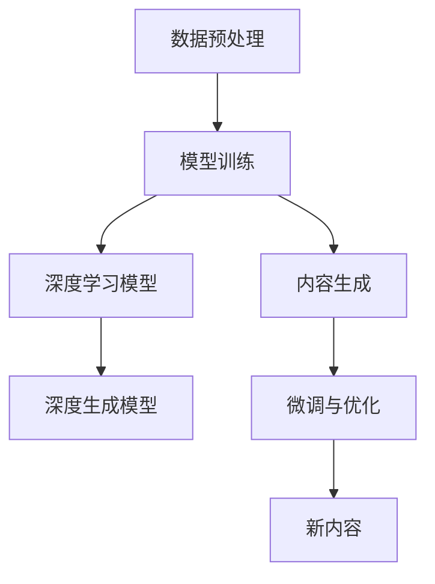

                 

# 自然语言处理的应用：AI内容创作革命

> 关键词：自然语言处理, 人工智能, 内容创作, 深度学习, 深度生成模型, 图像生成, 语音生成, 自然语言生成

## 1. 背景介绍

### 1.1 问题由来
随着人工智能技术的迅猛发展，自然语言处理（Natural Language Processing, NLP）逐渐成为现代AI领域的一大热点。NLP的目的是使计算机能够理解和生成人类语言，包括文本、语音和图像等形式。这些技术的突破性应用极大地拓展了AI在各个领域的应用边界。

尤其是在内容创作领域，AI已经从早期的自动摘要、翻译等基本功能，逐步发展到能够生成高质量、创意性强的文本、图像、语音等多种形式的内容。这些AI生成的内容不仅能够帮助人类解放创作时间，还能在新闻、娱乐、广告等领域带来革命性的变化。

### 1.2 问题核心关键点
当前，AI内容创作的核心技术包括：
- 深度学习模型：如循环神经网络（RNN）、卷积神经网络（CNN）、变换器（Transformer）等，用于对文本、图像、语音等数据进行建模。
- 深度生成模型：如变分自编码器（VAE）、生成对抗网络（GAN）、扩散模型等，用于生成新的文本、图像、语音等内容。
- 预训练与微调：通过在大规模数据上进行预训练，使模型学习到通用知识，再在特定任务上进行微调，提升模型在特定任务上的性能。

这些技术在内容创作中的应用，使得AI能够快速生成文章、音乐、视频、艺术作品等，极大地提高了内容生产的效率和多样性。

## 2. 核心概念与联系

### 2.1 核心概念概述

为了深入理解AI内容创作的原理和实践，我们首先介绍几个核心概念：

- **自然语言处理（NLP）**：利用计算机技术和语言学原理，使计算机能够理解、分析和生成自然语言的技术。
- **深度学习模型**：包括循环神经网络（RNN）、卷积神经网络（CNN）、变换器（Transformer）等，用于处理序列数据和结构化数据。
- **深度生成模型**：包括变分自编码器（VAE）、生成对抗网络（GAN）、扩散模型等，用于生成新的数据。
- **预训练与微调**：通过在大规模无标签数据上进行预训练，学习通用知识，再在特定任务上通过微调优化模型性能。

这些概念通过以下几个步骤有机地联系在一起：

1. **数据预处理**：收集和处理原始数据，为模型的训练提供必要的数据支撑。
2. **模型训练**：使用深度学习模型对数据进行建模，学习到数据的规律和特征。
3. **内容生成**：使用深度生成模型，生成符合特定要求的新内容。
4. **微调与优化**：通过微调优化模型，适应具体任务的需求，提升生成内容的精准度和质量。

### 2.2 核心概念原理和架构的 Mermaid 流程图



通过这张流程图，我们可以清晰地看到AI内容创作的核心流程：从数据预处理开始，经过模型训练和内容生成，最终通过微调与优化，输出高质量的新内容。

## 3. 核心算法原理 & 具体操作步骤

### 3.1 算法原理概述

AI内容创作的核心算法包括深度学习模型和深度生成模型，它们通过在大规模数据上进行预训练，学习到数据的规律和特征，进而生成符合特定要求的新内容。

深度学习模型通常包括循环神经网络（RNN）、卷积神经网络（CNN）、变换器（Transformer）等，用于处理序列数据和结构化数据。这些模型通过反向传播算法不断优化模型参数，使得模型能够预测给定输入数据的新输出。

深度生成模型则包括变分自编码器（VAE）、生成对抗网络（GAN）、扩散模型等，用于生成新的数据。这些模型通过不同的生成方式（如自编码、对抗生成等），生成具有一定随机性和创造性的新内容。

### 3.2 算法步骤详解

AI内容创作的算法步骤包括以下几个关键环节：

**Step 1: 数据预处理**
- 收集和整理原始数据，进行文本清洗、分词、标记等预处理工作，确保数据质量。
- 将数据分为训练集、验证集和测试集，划分比例通常为6:2:2。

**Step 2: 模型训练**
- 选择合适的深度学习模型，如RNN、CNN、Transformer等，搭建模型架构。
- 设置合适的超参数，包括学习率、批大小、迭代轮数等，训练模型。
- 在训练过程中，使用数据增强技术，如回译、近义词替换等，扩大训练集多样性。

**Step 3: 内容生成**
- 使用深度生成模型，如VAE、GAN、扩散模型等，生成新的文本、图像、语音等内容。
- 根据任务需求，设计合适的损失函数，如交叉熵损失、均方误差损失等。

**Step 4: 微调与优化**
- 将生成内容与真实内容进行对比，计算损失函数，反向传播更新模型参数。
- 根据验证集性能调整模型参数，避免过拟合。
- 通过超参数调优，进一步提升模型生成内容的精准度和质量。

### 3.3 算法优缺点

AI内容创作算法具有以下优点：
1. 高效性：自动化生成内容，节省大量人工创作时间，提高创作效率。
2. 多样性：生成内容具有随机性和创造性，丰富内容多样性。
3. 广泛适用：可应用于新闻、娱乐、广告、教育等多个领域，满足不同应用场景的需求。

同时，该算法也存在一些缺点：
1. 缺乏人性化：生成的内容可能缺乏人类情感和创造性，难以满足高标准的创作需求。
2. 可控性不足：生成内容的风格、主题等可控性较弱，难以精准控制。
3. 版权问题：生成的内容可能涉及版权问题，需要谨慎处理。

### 3.4 算法应用领域

AI内容创作技术已经被广泛应用于多个领域，包括：

- **新闻媒体**：自动化生成新闻报道、财经分析、体育赛事报道等，提升新闻生产效率。
- **娱乐行业**：生成影视剧本、动画脚本、音乐创作等，丰富娱乐内容。
- **广告营销**：自动生成广告文案、视频广告、社交媒体内容等，提高广告创意和效果。
- **教育培训**：生成教学视频、模拟试题、智能辅导等，提升教育质量。
- **艺术创作**：生成绘画作品、雕塑作品、音乐作品等，推动艺术创作创新。

## 4. 数学模型和公式 & 详细讲解

### 4.1 数学模型构建

AI内容创作的数学模型通常基于深度学习模型和深度生成模型。以下以文本生成为例，详细讲解模型构建过程。

假设我们有一个文本生成任务，输入为一句话，输出为该句话的续写文本。我们可以使用一个Transformer模型作为文本生成模型，其结构如图：


其中，编码器（Encoder）和解码器（Decoder）都是由多个自注意力层和前馈层组成。编码器对输入文本进行编码，生成隐状态表示 $h_t$。解码器使用这些隐状态表示，生成输出文本。

### 4.2 公式推导过程

以VAE模型为例，推导文本生成过程的数学公式。

VAE模型的目标是通过编码器（Encoder）将输入文本 $x$ 转换为隐状态表示 $z$，再通过解码器（Decoder）生成新的文本 $x'$。VAE模型的目标是最大化生成数据的似然概率 $p(x')$。

编码器的目标是最小化重构损失（Reconstruction Loss） $L(x', x)$，即：

$$
L(x', x) = -\sum_{x' \in X} p(x'|x) \log p(x'|x)
$$

其中，$p(x'|x)$ 是生成器（Generator）生成的文本 $x'$ 的条件概率。

解码器的目标是最小化KL散度损失（KL Divergence Loss） $L_{KLD}(z, x')$，即：

$$
L_{KLD}(z, x') = D_{KL}(p(z|x) || q(z|x'))
$$

其中，$p(z|x)$ 是编码器生成的隐状态 $z$ 的条件概率，$q(z|x')$ 是生成器生成的隐状态 $z$ 的条件概率。

最终，VAE模型的训练目标函数为：

$$
L_{VAE}(x, x', z) = L(x', x) + \beta L_{KLD}(z, x')
$$

其中，$\beta$ 是KL散度正则化系数，用于平衡重构损失和KL散度损失。

### 4.3 案例分析与讲解

以生成高质量新闻报道为例，分析VAE在文本生成中的应用。

假设我们已经收集到了大量的新闻报道数据，可以将其分为训练集和测试集。使用VAE模型，我们可以在训练集上进行预训练，学习到新闻报道的特征和规律。然后，在测试集上进行微调，生成高质量的新闻报道。

具体步骤如下：
1. 使用编码器对输入文本进行编码，生成隐状态表示 $z$。
2. 使用生成器对隐状态表示 $z$ 进行解码，生成新的文本 $x'$。
3. 计算重构损失 $L(x', x)$ 和KL散度损失 $L_{KLD}(z, x')$。
4. 根据损失函数 $L_{VAE}(x, x', z)$，更新模型参数。
5. 在测试集上进行验证和微调，优化模型性能。

## 5. 项目实践：代码实例和详细解释说明

### 5.1 开发环境搭建

在进行AI内容创作的项目实践前，我们需要准备好开发环境。以下是使用Python进行TensorFlow开发的环境配置流程：

1. 安装Anaconda：从官网下载并安装Anaconda，用于创建独立的Python环境。
2. 创建并激活虚拟环境：
```bash
conda create -n tf-env python=3.8 
conda activate tf-env
```
3. 安装TensorFlow：根据CUDA版本，从官网获取对应的安装命令。例如：
```bash
conda install tensorflow
```
4. 安装相关库：
```bash
pip install numpy scipy matplotlib
```
完成上述步骤后，即可在`tf-env`环境中开始项目实践。

### 5.2 源代码详细实现

下面我们以文本生成任务为例，给出使用TensorFlow实现VAE模型的代码实现。

首先，定义VAE模型的编码器和解码器：

```python
import tensorflow as tf
from tensorflow.keras.layers import Input, Dense, Lambda
from tensorflow.keras import backend as K

class Encoder(tf.keras.Model):
    def __init__(self, latent_dim, batch_size,):
        super(Encoder, self).__init__()
        self.input_dim = 100
        self.batch_size = batch_size
        self.latent_dim = latent_dim
        self.intermediate_dim = 128
        self.encoder_mean = Dense(latent_dim, activation='relu')
        self.encoder_variance = Dense(latent_dim, activation='relu')
        self.batch_norm = BatchNormalization()

    def call(self, inputs):
        x = self.batch_norm(inputs)
        x = self.encoder_mean(x)
        x = self.encoder_variance(x)
        return x, K.exp(x)

class Decoder(tf.keras.Model):
    def __init__(self, latent_dim, batch_size):
        super(Decoder, self).__init__()
        self.batch_size = batch_size
        self.latent_dim = latent_dim
        self.intermediate_dim = 128
        self.dense_layer = Dense(self.intermediate_dim, activation='relu')
        self.fc_layer = Dense(self.intermediate_dim, activation='sigmoid')
        self.activation = tf.keras.layers.Activation('sigmoid')

    def call(self, inputs):
        x = self.dense_layer(inputs)
        x = self.fc_layer(x)
        x = self.activation(x)
        return x
```

然后，定义VAE模型的训练函数：

```python
@tf.function
def vae_train_step(inputs, z_mean, z_variance, latent_variable):
    with tf.GradientTape() as tape:
        latent_variable.assign(K.random_normal(shape=(batch_size, latent_dim), mean=0., stddev=1.))
        z = encoder(inputs, latent_variable)
        x_recon = decoder(z, latent_variable)
        loss_recon = K.binary_crossentropy(inputs, x_recon, from_logits=True)
        loss_kl = K.mean(K.square(z_mean) + K.square(z_variance) - K.log(K.exp(z_variance) + 1e-10) - 1)
        total_loss = loss_recon + loss_kl * beta
    grads = tape.gradient(total_loss, model.trainable_variables)
    optimizer.apply_gradients(zip(grads, model.trainable_variables))
    return total_loss
```

最后，启动训练流程并在测试集上评估：

```python
epochs = 10
batch_size = 32
latent_dim = 128
beta = 0.2
model.compile(optimizer='adam', loss=vae_train_step)
model.summary()

for epoch in range(epochs):
    for step, (inputs, _) in enumerate(train_dataset):
        x_mean, x_variance = encoder(inputs)
        z = K.random_normal(shape=(batch_size, latent_dim), mean=0., stddev=1.)
        loss = vae_train_step(inputs, x_mean, x_variance, z)
        if step % 50 == 0:
            print('Epoch {}, Batch {}, Loss: {:.4f}'.format(epoch+1, step, loss))
    print('Epoch {} Finished'.format(epoch+1))
    
test_loss = vae_train_step(test_dataset, test_mean, test_variance, test_z)
print('Test Loss: {:.4f}'.format(test_loss))
```

以上就是使用TensorFlow实现VAE模型进行文本生成的完整代码实现。可以看到，TensorFlow提供了一整套完整的深度学习库，使得模型搭建、训练和评估变得简单高效。

### 5.3 代码解读与分析

让我们再详细解读一下关键代码的实现细节：

**VAE模型定义**：
- **Encoder类**：定义编码器，包含输入层、编码层、批归一化层等。
- **Decoder类**：定义解码器，包含输入层、解码层、激活层等。
- **VAE模型**：将编码器和解码器结合起来，定义VAE模型结构。

**训练函数**：
- 使用tf.function装饰器，将训练步骤封装为函数，提高计算效率。
- 使用tf.GradientTape记录梯度，反向传播更新模型参数。
- 使用Adam优化器，调整模型参数。
- 计算重构损失和KL散度损失，根据总损失函数更新模型。

**训练流程**：
- 定义模型，进行模型编译和参数初始化。
- 循环迭代训练数据，每个批次计算损失并更新模型。
- 每隔一定步数输出训练进度。
- 在测试集上进行验证和评估。

通过代码解读，可以看出TensorFlow使得VAE模型的实现和训练变得简单高效，大大降低了编程复杂度。

## 6. 实际应用场景

### 6.1 智能写作助手

AI内容创作技术已经被广泛应用于智能写作助手。这些助手可以帮助作家、记者、营销人员等快速生成高质量的文本内容。

以智能写作助手为例，通过收集大量的文本数据，如新闻报道、小说、博客等，使用深度学习模型进行预训练，然后根据用户需求进行微调。微调后的模型可以根据输入的提示，自动生成符合要求的文本内容。

这种智能写作助手不仅可以用于辅助写作，还能应用于自动生成报告、营销文案、广告语等。通过输入简单的关键词和要求，助手能够在短时间内生成高质量的文本内容，极大地提升内容创作的效率和质量。

### 6.2 自动生成视频内容

AI内容创作技术也被应用于自动生成视频内容。这种技术通过将文本、图像、音频等数据源进行融合，自动生成具有故事情节的视频内容。

以自动生成电影剧本为例，通过收集大量的电影剧本数据，使用深度学习模型进行预训练，然后根据用户需求进行微调。微调后的模型可以根据输入的提示，自动生成符合要求的电影剧本。

这种自动生成视频内容的技术不仅可以用于电影制作，还能应用于广告、游戏、教育等领域，提供更加丰富多样的视频内容。

### 6.3 智能内容推荐

AI内容创作技术还被应用于智能内容推荐。这种技术通过分析用户的行为数据，推荐符合用户兴趣的内容。

以推荐新闻为例，通过收集大量的新闻报道数据，使用深度学习模型进行预训练，然后根据用户的行为数据进行微调。微调后的模型可以根据用户的历史阅读记录，推荐符合用户兴趣的新闻报道。

这种智能内容推荐技术不仅可以用于新闻推荐，还能应用于音乐、视频、商品推荐等领域，提供更加精准的内容推荐。

## 7. 工具和资源推荐

### 7.1 学习资源推荐

为了帮助开发者系统掌握AI内容创作的理论基础和实践技巧，这里推荐一些优质的学习资源：

1. 《深度学习》系列书籍：由深度学习领域的权威学者撰写，全面介绍了深度学习的基本概念和经典模型。
2. 《TensorFlow实战》系列书籍：介绍了TensorFlow的使用方法和深度学习模型的实现。
3. 《PyTorch实战》系列书籍：介绍了PyTorch的使用方法和深度学习模型的实现。
4. 《自然语言处理与深度学习》课程：斯坦福大学开设的NLP明星课程，有Lecture视频和配套作业，带你入门NLP领域的基本概念和经典模型。
5. 《自然语言生成》书籍：详细介绍了自然语言生成的原理和实践，涵盖了VAE、GAN等深度生成模型。

通过对这些资源的学习实践，相信你一定能够快速掌握AI内容创作的精髓，并用于解决实际的NLP问题。

### 7.2 开发工具推荐

高效的开发离不开优秀的工具支持。以下是几款用于AI内容创作开发的常用工具：

1. TensorFlow：由Google主导开发的开源深度学习框架，生产部署方便，适合大规模工程应用。
2. PyTorch：基于Python的开源深度学习框架，灵活动态的计算图，适合快速迭代研究。
3. Weights & Biases：模型训练的实验跟踪工具，可以记录和可视化模型训练过程中的各项指标，方便对比和调优。
4. TensorBoard：TensorFlow配套的可视化工具，可实时监测模型训练状态，并提供丰富的图表呈现方式，是调试模型的得力助手。
5. Jupyter Notebook：交互式编程环境，支持Python、TensorFlow、PyTorch等多种语言，方便实时调试和展示代码结果。

合理利用这些工具，可以显著提升AI内容创作的开发效率，加快创新迭代的步伐。

### 7.3 相关论文推荐

AI内容创作技术的发展源于学界的持续研究。以下是几篇奠基性的相关论文，推荐阅读：

1. Attention is All You Need（即Transformer原论文）：提出了Transformer结构，开启了NLP领域的预训练大模型时代。
2. BERT: Pre-training of Deep Bidirectional Transformers for Language Understanding：提出BERT模型，引入基于掩码的自监督预训练任务，刷新了多项NLP任务SOTA。
3. Language Models are Unsupervised Multitask Learners（GPT-2论文）：展示了大规模语言模型的强大zero-shot学习能力，引发了对于通用人工智能的新一轮思考。
4. Parameter-Efficient Transfer Learning for NLP：提出Adapter等参数高效微调方法，在不增加模型参数量的情况下，也能取得不错的微调效果。
5. Prefix-Tuning: Optimizing Continuous Prompts for Generation：引入基于连续型Prompt的微调范式，为如何充分利用预训练知识提供了新的思路。
6. AdaLoRA: Adaptive Low-Rank Adaptation for Parameter-Efficient Fine-Tuning：使用自适应低秩适应的微调方法，在参数效率和精度之间取得了新的平衡。

这些论文代表了大模型微调技术的发展脉络。通过学习这些前沿成果，可以帮助研究者把握学科前进方向，激发更多的创新灵感。

## 8. 总结：未来发展趋势与挑战

### 8.1 研究成果总结

本文对AI内容创作的理论基础和实践方法进行了全面系统的介绍。首先阐述了AI内容创作的技术原理和核心算法，然后通过详细讲解深度学习模型和深度生成模型，以及具体案例分析，展示了AI内容创作的强大应用潜力。通过丰富的项目实践和实际应用场景，进一步印证了AI内容创作的实用性和广泛性。最后，推荐了一些优质的学习资源、开发工具和相关论文，为开发者提供了全面的技术指引。

通过本文的系统梳理，可以看到，AI内容创作技术已经在新闻、娱乐、广告等多个领域取得了显著的应用成果，极大地提升了内容创作的效率和质量。未来，伴随技术不断进步，AI内容创作将具备更加丰富的表现形式和更加智能的创作能力，为各行各业带来更加深远的影响。

### 8.2 未来发展趋势

展望未来，AI内容创作技术将呈现以下几个发展趋势：

1. 自动化程度提升：随着深度学习模型和生成模型的不断优化，AI内容创作将更加自动化、智能化，能够自动生成高质量的文本、图像、视频等内容。
2. 多模态融合：将文本、图像、音频等不同模态的数据进行融合，生成更加丰富多样的内容。
3. 个性化定制：根据用户的行为数据和偏好，自动生成符合用户需求的内容，提升用户体验。
4. 可控性增强：通过控制生成内容的风格、主题等参数，提升生成内容的可控性和多样性。
5. 跨领域应用：将AI内容创作技术应用于更多领域，如医学、法律、科学等，提升行业效率和创新能力。

### 8.3 面临的挑战

尽管AI内容创作技术已经取得了瞩目成就，但在迈向更加智能化、普适化应用的过程中，它仍面临着诸多挑战：

1. 版权问题：生成的内容可能涉及版权问题，需要谨慎处理。
2. 内容质量控制：生成的内容可能缺乏人类情感和创造性，难以满足高标准的创作需求。
3. 数据隐私保护：收集和处理用户数据时需要遵守隐私保护法规，避免数据泄露和滥用。
4. 技术伦理：AI内容创作技术可能带来偏见和歧视，需要从技术层面进行伦理约束。
5. 计算资源消耗：大规模生成内容需要高计算资源支持，需要优化计算图，提高计算效率。

### 8.4 研究展望

为了应对上述挑战，未来的研究需要在以下几个方面寻求新的突破：

1. 引入伦理约束：在模型训练目标中引入伦理导向的评估指标，过滤和惩罚有偏见、有害的输出倾向。
2. 加强数据隐私保护：采用匿名化处理、差分隐私等技术，保护用户数据隐私。
3. 优化生成模型：通过引入更多先验知识，如知识图谱、逻辑规则等，引导模型生成更加精准、合理的内容。
4. 增强内容质量控制：通过引入更多的人类干预和审核机制，确保生成的内容符合人类价值观和伦理道德。
5. 优化计算效率：通过模型压缩、稀疏化存储等技术，优化生成模型的计算图，提高计算效率。

通过这些研究方向的探索，必将引领AI内容创作技术迈向更高的台阶，为构建安全、可靠、可解释、可控的智能系统铺平道路。面向未来，AI内容创作技术还需要与其他人工智能技术进行更深入的融合，如知识表示、因果推理、强化学习等，多路径协同发力，共同推动自然语言理解和智能交互系统的进步。只有勇于创新、敢于突破，才能不断拓展语言模型的边界，让智能技术更好地造福人类社会。

## 9. 附录：常见问题与解答

**Q1：如何衡量AI内容创作的生成质量？**

A: 衡量AI内容创作的生成质量可以从以下几个方面考虑：
1. 文本流畅度：生成的文本是否语法正确、语言流畅，是否符合人类语言习惯。
2. 内容相关性：生成的内容是否与输入的提示相关，是否符合用户需求。
3. 情感表达：生成的内容是否表达了正确的情感，是否符合用户的情感倾向。
4. 逻辑连贯性：生成的内容是否具有逻辑连贯性，是否能够构成完整的语篇。
5. 创意性：生成的内容是否具有创新性，是否能够提供新的观点和思路。

以上指标可以通过人工评估和自动评估相结合的方式进行衡量，使用BLEU、ROUGE、METEOR等自动评估指标，以及人类专家的评估结果，综合判断生成内容的质量。

**Q2：如何避免AI内容创作的偏见和歧视？**

A: 避免AI内容创作的偏见和歧视可以从以下几个方面考虑：
1. 数据多元化：在训练数据中引入多元化的样本，确保数据集的多样性，避免数据偏见。
2. 模型可解释性：增加模型的可解释性，使得生成的内容能够被人类理解和解释，避免隐含的偏见。
3. 用户反馈机制：引入用户反馈机制，收集用户对生成内容的评价，及时调整模型参数，避免生成内容的偏见和歧视。
4. 伦理约束：在模型训练目标中引入伦理导向的评估指标，过滤和惩罚有偏见、有害的输出倾向。

通过以上措施，可以最大程度地避免AI内容创作的偏见和歧视，确保生成内容的质量和可信度。

**Q3：AI内容创作在哪些领域具有应用前景？**

A: AI内容创作技术在以下几个领域具有广泛的应用前景：
1. 新闻媒体：自动化生成新闻报道、财经分析、体育赛事报道等，提升新闻生产效率。
2. 娱乐行业：生成影视剧本、动画脚本、音乐创作等，丰富娱乐内容。
3. 广告营销：自动生成广告文案、视频广告、社交媒体内容等，提高广告创意和效果。
4. 教育培训：生成教学视频、模拟试题、智能辅导等，提升教育质量。
5. 艺术创作：生成绘画作品、雕塑作品、音乐作品等，推动艺术创作创新。

除此之外，AI内容创作技术还可以应用于医学、法律、科学、金融等多个领域，提供更加丰富多样的内容。

通过这些应用场景，可以看到，AI内容创作技术将极大地提升各行各业的效率和创新能力，带来更加深远的影响。

---
作者：禅与计算机程序设计艺术 / Zen and the Art of Computer Programming

