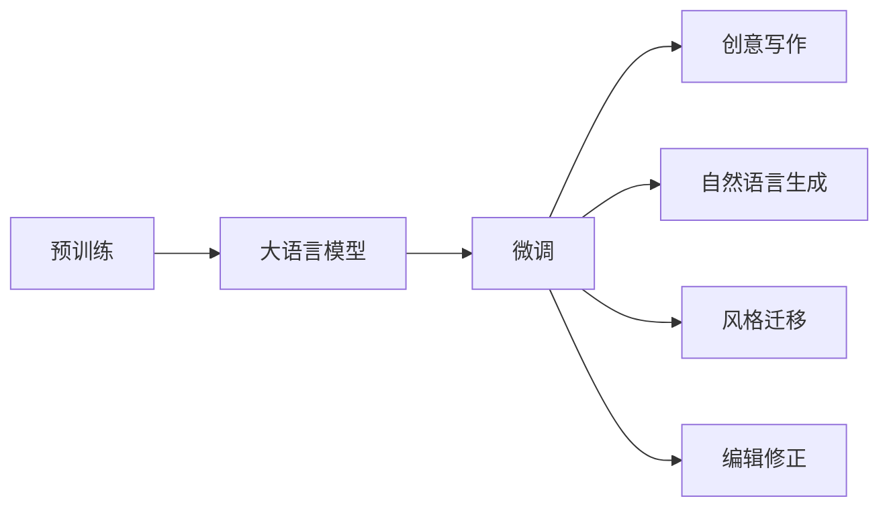

                 

# 自然语言处理的进步：AI内容创作的变革

> 关键词：自然语言处理,自然语言生成,内容创作,深度学习,Transformer,大语言模型,创意写作,文字生成

## 1. 背景介绍

### 1.1 问题由来

随着信息技术的快速发展，自然语言处理(NLP)领域正经历着深刻的变革。从早期的规则系统、统计模型，到如今的深度学习驱动的大模型，NLP技术已经从信息提取、问答、翻译等单一功能，拓展到了更为复杂的自然语言生成领域。AI内容创作，即通过机器学习技术自动生成高质量、具有创造力的文本，成为了NLP研究的前沿方向之一。

这一变革在很大程度上得益于大语言模型（Large Language Model, LLM）的崛起。大语言模型，如GPT系列、BERT等，通过在大规模无标签文本上预训练，学习到了复杂的语言结构和语义信息，具备了理解和生成自然语言的能力。随着模型参数量的不断增大和计算能力的提升，这些模型在内容创作方面的表现日益突出，为AI内容生成领域带来了革命性的突破。

### 1.2 问题核心关键点

AI内容创作的本质在于利用自然语言处理技术，自动生成符合人类语言习惯、富有创意和逻辑的文本内容。这一过程涉及到以下几个关键问题：

- **语义理解**：模型需要准确理解输入文本的含义，包括主旨、逻辑结构、情感色彩等。
- **语言生成**：模型需要根据理解结果，创造性地生成符合语法规则和语义连贯的新文本。
- **风格多样性**：模型需要生成具有不同风格、文体、修辞手法等特征的文本，满足不同创作需求。
- **内容创新性**：模型需要在理解基础上，产生新颖、有创意的文本内容，而非简单重复已有信息。
- **实用性**：生成的文本需要具备实用价值，能够满足具体的应用场景，如新闻报道、故事创作、诗歌生成等。

大语言模型在处理这些问题时，凭借其庞大的参数量和丰富的语言知识库，展现了强大的生成能力。但同时也面临着数据质量、计算资源、模型可解释性等挑战。因此，如何优化大语言模型，使其在内容创作方面更高效、更精准、更可控，成为了当前研究的热点问题。

### 1.3 问题研究意义

AI内容创作的进步，对于推动内容产业的智能化转型、丰富互联网内容生态、提升用户体验等具有重要意义：

- **降低内容创作成本**：自动化内容生成可以大幅降低人力创作成本，尤其对于新闻、广告、客服等大量重复性工作的场景，效果尤为显著。
- **提高创作效率**：模型可以快速生成大量文本，为内容创作者提供素材支持，加速创作流程。
- **拓宽创作渠道**：AI内容创作使得任何有互联网连接的人，都能轻松创作和发布内容，拓宽了创作的渠道和范围。
- **增强用户体验**：在搜索引擎、推荐系统、智能助手等领域，AI内容生成技术可以提升用户体验，提供更个性化的信息和服务。
- **开拓新应用场景**：AI内容创作的应用不断拓展，如教育、医疗、娱乐等行业，为这些领域带来新的创新点。

## 2. 核心概念与联系

### 2.1 核心概念概述

AI内容创作的整个过程，可以分解为以下几个核心概念：

- **大语言模型(Large Language Model, LLM)**：以自回归模型（如GPT）或自编码模型（如BERT）为代表的大规模预训练语言模型，通过在大规模无标签文本上预训练，学习复杂的语言结构和语义信息。
- **预训练(Pre-training)**：指在大规模无标签文本上，通过自监督学习任务训练通用语言模型的过程。常见的预训练任务包括掩码语言模型、下一句预测等。
- **微调(Fine-tuning)**：指在预训练模型的基础上，使用下游任务的少量标注数据，通过有监督学习优化模型在特定任务上的性能。
- **创意写作(Creative Writing)**：指生成具有创造力和新颖性的文本内容，如故事、诗歌、新闻报道等。
- **自然语言生成(Natural Language Generation, NLG)**：指自动生成自然语言文本，如文本摘要、对话生成、内容推荐等。
- **风格迁移(Style Transfer)**：指将一种文本风格转换为另一种风格，如将口语转换为正式语、将英文转换为中文等。
- **编辑修正(Editing and Correction)**：指对已有文本进行修改和优化，如语法校验、风格一致性检查、情感色彩调整等。

这些核心概念之间通过自然语言处理技术紧密联系，共同构建了AI内容创作的完整框架。

### 2.2 核心概念原理和架构的 Mermaid 流程图



这个流程图展示了从预训练到大语言模型微调，再到具体内容创作任务的完整流程。

## 3. 核心算法原理 & 具体操作步骤

### 3.1 算法原理概述

AI内容创作的算法原理，可以归结为以下几点：

1. **语义理解与表示**：将输入文本转化为模型可处理的形式，如词嵌入、字符嵌入等。通过大规模预训练，模型能够学习到丰富的语义表示，为后续的生成任务打下基础。

2. **生成模型与优化**：利用条件生成模型（如Transformer、GPT等），根据语义表示生成新的文本内容。通过最大化生成概率或最小化损失函数，优化模型生成质量。

3. **数据增强与多样化**：通过数据增强、正则化、对抗训练等方法，提升模型生成的多样性和鲁棒性，避免过拟合和模式塌陷。

4. **风格控制与迁移**：通过引入风格标签、迁移学习等技术，使模型能够生成指定风格或转换风格的文本内容。

5. **编辑与校正**：通过后处理技术，对生成的文本进行语法校验、风格一致性检查等，保证内容的准确性和一致性。

### 3.2 算法步骤详解

以下以自然语言生成（NLG）任务为例，详细讲解基于Transformer的NLG模型的构建和微调步骤：

1. **数据准备**：收集NLG任务的相关数据集，包括文本和对应的生成目标。对数据进行预处理，如分词、去噪等。

2. **模型选择**：选择合适的预训练模型，如GPT-2、GPT-3等。对模型进行微调，使其适应特定的NLG任务。

3. **任务适配层设计**：根据NLG任务的输出格式，设计适当的输出层和损失函数。常见的输出层包括全连接层、Softmax层等，损失函数包括交叉熵、重构误差等。

4. **微调超参数设置**：选择合适的优化器（如AdamW）及其参数，如学习率、批大小等。设置正则化技术，如权重衰减、Dropout等。

5. **微调过程执行**：将训练集数据分批次输入模型，计算损失函数并反向传播。根据优化算法更新模型参数。周期性在验证集上评估模型性能，并根据性能调整超参数。

6. **测试与部署**：在测试集上评估微调后的模型性能。使用微调后的模型对新文本进行生成，集成到实际应用系统中。

### 3.3 算法优缺点

基于Transformer的NLG模型的优点包括：

1. **高效性**：模型参数量大，但计算效率高，适用于大规模文本生成任务。

2. **灵活性**：通过任务适配层的灵活设计，可以适应多种NLG任务。

3. **鲁棒性**：通过正则化和对抗训练，模型具有较好的泛化能力，能够适应不同的数据分布和噪声。

4. **可解释性**：部分模型采用注意力机制，能够揭示生成的逻辑和过程，提高可解释性。

然而，模型也存在一些缺点：

1. **资源消耗大**：模型参数量大，计算资源需求高，限制了其在资源受限环境中的应用。

2. **过拟合风险**：在大规模数据集上进行微调时，模型可能出现过拟合现象，生成内容多样化不足。

3. **风格一致性**：模型生成的文本风格可能与预训练时的风格不一致，需要进行额外的风格调整。

4. **可解释性有限**：部分模型生成过程复杂，难以解释生成的逻辑和依据。

### 3.4 算法应用领域

基于Transformer的NLG模型已经在多个领域得到广泛应用，如：

- **新闻报道**：自动生成新闻标题、导语、正文等，提升新闻生产的效率和质量。
- **内容创作**：生成博客、小说、文章等内容，帮助内容创作者提供素材和灵感。
- **对话生成**：实现智能客服、虚拟助手等对话系统，提升用户体验和效率。
- **故事生成**：自动生成故事、电影剧本等，丰富娱乐内容。
- **翻译**：自动生成翻译文本，提升翻译效率和质量。

## 4. 数学模型和公式 & 详细讲解 & 举例说明

### 4.1 数学模型构建

以NLG任务为例，构建基于Transformer的生成模型。假设输入文本序列为 $x=(x_1, x_2, ..., x_n)$，目标生成序列为 $y=(y_1, y_2, ..., y_m)$。生成模型的数学模型为：

$$
p(y|x;\theta) = \prod_{i=1}^m p(y_i|y_{<i}, x;\theta)
$$

其中，$p(y_i|y_{<i}, x;\theta)$ 表示在已知前 $i-1$ 个生成结果和输入文本的情况下，第 $i$ 个生成结果的条件概率。$\theta$ 为模型参数。

### 4.2 公式推导过程

以下推导基于Transformer的生成模型。假设模型输出层的参数为 $W^\text{out} \in \mathbb{R}^{d_\text{out} \times d_\text{model}}$，其中 $d_\text{out}$ 为输出层维度，$d_\text{model}$ 为Transformer模型隐藏层维度。

对于每个时间步 $t$，模型前向传播的输出 $h_t$ 计算如下：

$$
h_t = \text{MultiHeadAttention}(Q_t, K_t, V_t) + \text{LayerNorm}(h_{t-1})
$$

其中，$Q_t = h_{t-1}W^\text{q}^\text{out}$，$K_t = h_{t-1}W^\text{k}^\text{out}$，$V_t = h_{t-1}W^\text{v}^\text{out}$。$\text{MultiHeadAttention}$ 表示多头注意力机制，$\text{LayerNorm}$ 表示层归一化。

输出层的生成概率 $p(y_t|y_{<t}, x)$ 计算如下：

$$
p(y_t|y_{<t}, x) = \text{softmax}(h_tW^\text{out})
$$

整个序列的生成概率为：

$$
p(y|x;\theta) = \prod_{t=1}^m p(y_t|y_{<t}, x;\theta)
$$

为了优化模型，通常使用交叉熵损失函数：

$$
L = -\sum_{i=1}^m \log p(y_i|y_{<i}, x;\theta)
$$

### 4.3 案例分析与讲解

以生成一个简单的英文短句为例，推导过程如下：

假设输入文本为 "The cat"，生成目标为 "The cat is playing with a ball"。模型参数为 $W^\text{out} \in \mathbb{R}^{10 \times 512}$。

1. 输入 "The" 和 "cat"，通过Transformer模型计算输出 $h_1$ 和 $h_2$。

2. 将 $h_1$ 和 $h_2$ 输入输出层，计算 $p(y_1|y_{<1}, x)$。

3. 使用生成概率分布 $p(y_1|y_{<1}, x)$ 和当前生成结果 $y_1$，计算交叉熵损失。

4. 将生成结果 $y_1$ 和损失值 $L$ 反向传播，更新模型参数。

5. 重复上述过程，直到生成完整的目标序列。

## 5. 项目实践：代码实例和详细解释说明

### 5.1 开发环境搭建

进行NLG任务开发，需要准备以下开发环境：

1. **Python**：安装Python 3.6或更高版本。
2. **PyTorch**：使用PyTorch 1.0或更高版本。
3. **transformers库**：安装transformers库，提供预训练模型的封装和微调工具。
4. **GPU**：推荐使用NVIDIA的GPU，以加速模型训练和推理。
5. **Jupyter Notebook**：用于编写和运行代码。

### 5.2 源代码详细实现

以下是一个简单的NLG任务开发示例，使用PyTorch和transformers库实现基于Transformer的文本生成。

```python
import torch
from transformers import TransformerModel, BertTokenizer, AdamW

# 加载预训练模型
model = TransformerModel.from_pretrained('bert-base-uncased')

# 加载分词器
tokenizer = BertTokenizer.from_pretrained('bert-base-uncased')

# 设置微调超参数
lr = 2e-5
epochs = 10

# 准备训练集和测试集
train_dataset = ...
test_dataset = ...

# 定义模型优化器和损失函数
optimizer = AdamW(model.parameters(), lr=lr)
loss_fn = nn.CrossEntropyLoss()

# 训练模型
for epoch in range(epochs):
    for batch in train_dataset:
        # 分词和编码
        input_ids = tokenizer(batch[0], return_tensors='pt').input_ids
        attention_mask = tokenizer(batch[0], return_tensors='pt').attention_mask

        # 前向传播
        outputs = model(input_ids, attention_mask=attention_mask)
        logits = outputs.logits

        # 计算损失
        loss = loss_fn(logits.view(-1, logits.size(-1)), batch[1])

        # 反向传播和优化
        optimizer.zero_grad()
        loss.backward()
        optimizer.step()

# 评估模型
for batch in test_dataset:
    input_ids = tokenizer(batch[0], return_tensors='pt').input_ids
    attention_mask = tokenizer(batch[0], return_tensors='pt').attention_mask

    # 前向传播
    outputs = model(input_ids, attention_mask=attention_mask)
    logits = outputs.logits

    # 计算预测结果
    predictions = logits.argmax(dim=2)

    # 输出结果
    print(predictions)
```

### 5.3 代码解读与分析

上述代码实现了基于Transformer的NLG任务的微调过程，具体解释如下：

1. **预训练模型和分词器加载**：使用transformers库加载预训练模型和分词器，便于模型微调和文本预处理。

2. **超参数设置**：设置学习率和训练轮数，控制模型微调的过程。

3. **数据准备**：从数据集中准备训练集和测试集，确保数据的质量和多样性。

4. **模型优化器和损失函数定义**：使用AdamW优化器，并设置交叉熵损失函数，便于模型的训练和评估。

5. **训练模型**：在每个epoch内，对训练集数据进行前向传播和反向传播，更新模型参数。

6. **模型评估**：在测试集上对模型进行评估，输出预测结果。

### 5.4 运行结果展示

运行上述代码，可以得到模型在训练集和测试集上的交叉熵损失值，以及模型生成的预测文本。

## 6. 实际应用场景

### 6.1 智能客服

智能客服系统利用自然语言生成技术，自动生成回复，提升客服效率和用户体验。通过收集历史客服对话数据，训练模型学习客户意图和常见问题，自动生成符合客户需求的回答。

### 6.2 内容创作

内容创作平台可以利用NLG技术，自动生成文章、博客、新闻报道等内容，减轻内容创作者的工作负担。例如，新闻网站可以使用NLG技术生成新闻标题和导语，提升新闻生产的效率。

### 6.3 教育

教育平台可以使用NLG技术生成个性化教学内容，包括作业、阅读材料等。通过分析学生的学习行为和兴趣，自动生成适合的练习和推荐，提升学习效果。

### 6.4 娱乐

娱乐内容平台可以利用NLG技术生成电影剧本、故事、广告文案等，丰富内容库。通过自动生成高质量的内容，满足用户的娱乐需求，提升平台的吸引力。

## 7. 工具和资源推荐

### 7.1 学习资源推荐

为了深入了解NLG技术，推荐以下学习资源：

1. **《深度学习与自然语言处理》课程**：斯坦福大学开设的深度学习基础课程，涵盖自然语言处理的基本概念和前沿技术。
2. **Transformers官方文档**：提供完整的NLG模型和微调方法的详细说明。
3. **《自然语言处理综论》**：NLP领域的经典教材，系统介绍了自然语言处理的基本概念和技术。
4. **Google AI Blog**：谷歌AI团队定期发布的NLP技术文章，涵盖最新研究成果和应用案例。
5. **ACL Anthology**：自然语言处理领域的顶级会议论文库，提供丰富的NLP研究成果。

### 7.2 开发工具推荐

为了加速NLG任务的开发，推荐以下开发工具：

1. **Jupyter Notebook**：用于编写和运行代码，支持交互式开发。
2. **PyTorch**：深度学习框架，提供了丰富的NLP模型和优化工具。
3. **transformers库**：提供了大量预训练模型和微调工具，简化开发过程。
4. **TensorBoard**：用于可视化模型训练过程和评估结果，方便调试和优化。
5. **Weights & Biases**：用于记录和分析模型训练数据，提供实时监控和可视化功能。

### 7.3 相关论文推荐

为了了解NLG技术的最新进展，推荐以下相关论文：

1. **《Attention is All You Need》**：Transformer模型原论文，引入了自注意力机制，提升了模型生成质量。
2. **《GPT-3》**：OpenAI发布的生成能力最强的语言模型，展示了AI内容创作的最新进展。
3. **《Improving Language Understanding by Generative Pre-training》**：BERT模型原论文，展示了预训练-微调方法在NLP任务上的优越性能。
4. **《NLP as a Foundation for General AI》**：OpenAI的NLP研究报告，探讨了NLP技术对未来AI的影响。
5. **《Creative Text Generation with Transformers》**：Transformer在创意写作任务上的应用研究，展示了模型的创造力。

## 8. 总结：未来发展趋势与挑战

### 8.1 总结

本文系统介绍了自然语言处理的进步及其在AI内容创作中的应用。通过分析基于Transformer的NLG模型，阐述了其构建和微调过程，并列举了其在智能客服、内容创作、教育、娱乐等领域的应用实例。通过对学习资源、开发工具和相关论文的推荐，为读者提供了全面的技术指引。

### 8.2 未来发展趋势

未来，基于Transformer的NLG技术将呈现以下发展趋势：

1. **模型规模和能力提升**：随着计算资源的增加和模型训练方法的改进，未来的大语言模型将具备更强的生成能力和更广泛的适用性。
2. **多样化生成**：模型将能够生成更多风格和体裁的文本内容，满足不同的创作需求。
3. **跨领域应用**：NLG技术将更多地应用于跨领域的内容创作，如医学、法律、金融等，提升专业领域的创作效率和质量。
4. **集成知识图谱**：结合知识图谱技术，模型将能够生成更加精准、有依据的内容，提升内容创作的质量和可信度。
5. **情感生成**：模型将能够生成具有情感色彩的文本内容，满足情感表达的需求。
6. **多模态生成**：结合图像、音频等多模态信息，模型将能够生成更加丰富的内容形式。

### 8.3 面临的挑战

尽管NLG技术在应用中已经取得显著进展，但未来仍面临以下挑战：

1. **数据质量问题**：高质量标注数据对模型的训练至关重要，获取大量标注数据成本高昂，且数据质量难以保证。
2. **生成内容多样性**：模型生成的内容可能缺乏多样性，需要进行风格控制和多样化训练。
3. **计算资源限制**：大语言模型的参数量和计算复杂度较高，需要高效的硬件支持和优化算法。
4. **内容一致性和可控性**：模型生成的内容需要满足一定的质量标准和一致性要求，避免产生有害或误导性内容。
5. **模型鲁棒性**：模型需要在不同的数据分布和噪声环境中保持稳定的生成能力。
6. **可解释性和可控性**：模型的生成过程和逻辑需要更强的可解释性，便于用户理解和控制。

### 8.4 研究展望

为了应对以上挑战，未来的研究需要在以下几个方向进行突破：

1. **无监督和半监督学习**：探索无标注数据上的NLG方法，提高模型在数据稀缺环境中的生成能力。
2. **多模态融合**：结合图像、音频等多模态信息，提升内容创作的丰富性和多样性。
3. **风格控制和迁移**：研究模型风格控制和迁移技术，使模型能够生成指定风格或转换风格的文本内容。
4. **内容一致性**：设计内容一致性评估指标，确保模型生成的内容符合一定的质量标准。
5. **可解释性和可控性**：引入可解释性方法，提高模型的可解释性和可控性。

## 9. 附录：常见问题与解答

**Q1: 自然语言生成中的语言模型和生成模型有什么区别？**

A: 语言模型主要用于自然语言理解任务，如语言建模、机器翻译等，旨在预测给定文本序列的概率分布。而自然语言生成模型则用于生成自然语言文本，如文本生成、对话生成等，其目标是在给定输入文本的情况下，最大化生成的文本概率。语言模型和生成模型虽然都基于概率模型，但任务目标和计算方式有所不同。

**Q2: 自然语言生成中的Transformer模型和RNN模型有什么区别？**

A: 相比传统的RNN模型，Transformer模型引入了自注意力机制，能够更有效地处理长文本序列，避免梯度消失和梯度爆炸问题。Transformer模型在生成速度和生成质量上具有显著优势，适用于大规模自然语言生成任务。

**Q3: 自然语言生成中的微调和迁移学习有什么区别？**

A: 微调（Fine-tuning）是在预训练模型的基础上，使用下游任务的少量标注数据进行有监督学习，优化模型在特定任务上的性能。迁移学习（Transfer Learning）则是指将在大规模数据上预训练的模型应用于新的任务或数据集，通过迁移已学知识，提升模型的泛化能力。微调侧重于任务的特定化，而迁移学习则强调知识迁移，两者在目标和方式上有所不同。

**Q4: 自然语言生成中常见的评价指标有哪些？**

A: 自然语言生成中常见的评价指标包括BLEU、ROUGE、METEOR、CIDEr等。这些指标分别从不同的角度评估生成的文本质量，如词语匹配、句子结构、语义连贯等。选择合适的评价指标，有助于评估和优化自然语言生成模型的性能。

**Q5: 自然语言生成中如何处理生成的文本多样性不足问题？**

A: 生成文本多样性不足可以通过以下方法解决：
1. 数据增强：通过回译、改写等技术扩充训练数据集。
2. 正则化：使用L2正则、Dropout等方法减少模型过拟合。
3. 对抗训练：引入对抗样本，提高模型鲁棒性。
4. 多模型集成：训练多个模型，取平均或加权平均输出，增加生成多样性。

本文通过系统的介绍自然语言处理的进步及其在AI内容创作中的应用，展示了基于Transformer的NLG模型的构建和微调过程。通过实际应用场景和相关资源推荐，为读者提供了全面的技术指引和未来展望。希望读者能从中获得有益的启发，进一步推动自然语言生成技术的创新和发展。

---

作者：禅与计算机程序设计艺术 / Zen and the Art of Computer Programming

