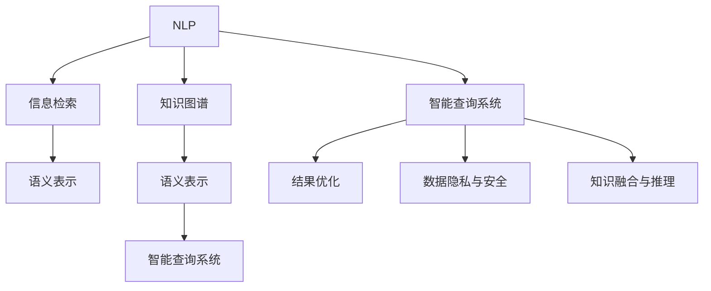
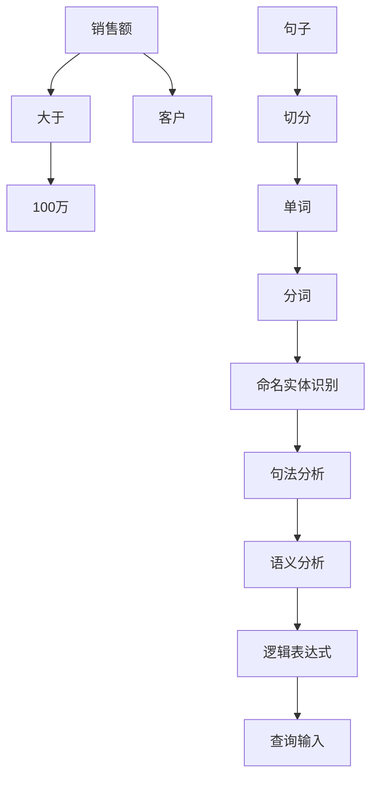
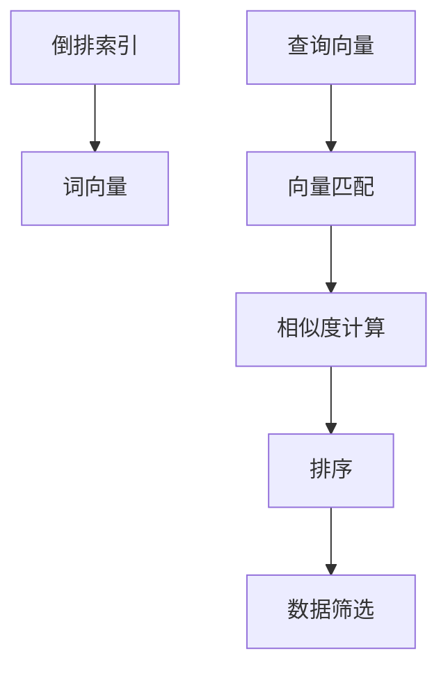
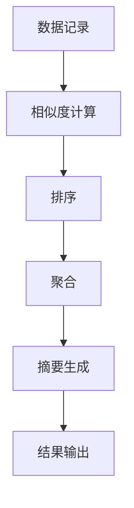

                 

# 自然语言查询在数据分析中的应用

> 关键词：自然语言处理(NLP), 数据分析, 语义理解, 信息检索, 知识图谱, 智能查询系统

## 1. 背景介绍

### 1.1 问题由来
在现代社会中，数据已经成为推动经济发展和社会进步的重要资源。据国际数据公司(IDC)报告，全球数据量以每年40%的速率增长，预计到2025年，全球数据总量将达到175ZB。如此巨大的数据量，单靠人工处理已经变得不可能，需要通过自动化的数据分析工具来挖掘数据价值。

自然语言查询（Natural Language Query, NLQ）作为数据分析的重要手段，可以通过文本输入方式，直接对数据集进行筛选、计算和可视化操作。例如，通过输入“销售额大于100万的客户”，数据系统能够直接生成对应的客户列表。这种自然语言查询方式，相较于传统的SQL查询，更加直观、便捷，能够极大地提升数据分析的效率和准确性。

近年来，随着人工智能和大数据技术的迅猛发展，基于深度学习的大规模语言模型（如BERT、GPT等）已经在自然语言处理领域取得了显著进展。这些模型在语义理解、语言生成、情感分析等方面表现出色，为自然语言查询的应用提供了强大的技术支撑。在数据分析场景中，利用这些模型进行自然语言查询，能够实现对大量结构化和非结构化数据的自动化处理，提升数据分析的智能化水平。

### 1.2 问题核心关键点
在数据分析应用中，自然语言查询面临的主要挑战包括：

1. 自然语言理解和语义表示。如何将自然语言输入转化为计算机能够理解的语义表示，是自然语言查询的第一步。

2. 高效的信息检索。在大规模数据集中快速定位和检索到符合查询条件的数据记录。

3. 结果优化和展示。对检索结果进行排序、聚类、摘要等处理，提升结果的相关性和可用性。

4. 数据隐私和安全性。确保查询操作和结果的隐私性和安全性，避免数据泄露。

5. 知识融合与推理。在查询过程中整合领域知识，提高查询结果的准确性和鲁棒性。

## 2. 核心概念与联系

### 2.1 核心概念概述

为更好地理解自然语言查询在数据分析中的应用，本节将介绍几个密切相关的核心概念：

- **自然语言处理（NLP）**：涉及自然语言理解和生成，是实现自然语言查询的技术基础。
- **信息检索（IR）**：利用文本匹配技术，从大规模文本集合中快速定位目标信息。
- **知识图谱（KG）**：构建实体和关系的图形结构，辅助进行语义理解和推理。
- **语义表示（Semantic Representation）**：将自然语言转化为结构化的语义表示，用于计算机理解和处理。
- **智能查询系统（Smart Query System）**：结合NLP、IR和KG技术，实现自然语言查询的自动化处理。

这些核心概念之间的逻辑关系可以通过以下Mermaid流程图来展示：

这个流程图展示了大规模数据分析中自然语言查询的核心概念及其之间的关系：

1. 自然语言处理(NLP)为查询提供自然语言输入，通过语义表示转化为计算机理解的形式。
2. 信息检索(IR)在文本集合中快速定位目标信息，返回初步检索结果。
3. 知识图谱(KG)提供领域知识，用于增强查询的语义理解与推理。
4. 语义表示(Semantic Representation)将自然语言输入转化为结构化语义表示，用于进一步处理。
5. 智能查询系统(Smart Query System)结合NLP、IR和KG技术，完成自然语言查询的全流程。

## 3. 核心算法原理 & 具体操作步骤
### 3.1 算法原理概述

自然语言查询的核心算法可以分为三个步骤：自然语言理解、信息检索和结果优化。

**Step 1: 自然语言理解**
自然语言理解是自然语言查询的基础。这一步骤将自然语言查询转化为结构化的语义表示，以便计算机能够理解和处理。常见的自然语言理解技术包括：

- **分词（Tokenization）**：将自然语言输入切分成单词或词组，例如“销售额大于100万”会被切分成“销售额”、“大于”、“100万”三个部分。
- **命名实体识别（Named Entity Recognition, NER）**：识别输入中的专有名词或实体，例如“销售额”和“100万”可以被识别为数值实体。
- **句法分析（Syntactic Parsing）**：分析句子结构，确定语法成分之间的关系，例如“销售额”和“大于”是逻辑关系。
- **语义分析（Semantic Analysis）**：对输入进行语义理解，例如“销售额大于100万”可以转化为“销售额 > 100万”的逻辑表达式。

**Step 2: 信息检索**
信息检索是指在大规模数据集中查找符合查询条件的数据记录。这一步骤通常使用倒排索引技术，快速定位目标信息。具体步骤如下：

- **构建倒排索引（Inverted Index）**：将数据集中的每个词或词组在文档中的出现位置记录下来，形成一个倒排索引。
- **词向量化（Word Embedding）**：将查询输入转化为向量形式，例如“销售额大于100万”可以转化为一个高维向量。
- **向量匹配（Vector Matching）**：将查询向量与倒排索引中的词向量进行匹配，计算相似度，找到最相关的文档。
- **数据过滤（Data Filtering）**：根据查询条件进一步筛选数据，例如“销售额 > 100万”的数据记录。

**Step 3: 结果优化**
结果优化是指对初步检索结果进行排序、聚合、摘要等处理，提升查询结果的相关性和可用性。具体步骤如下：

- **相似度计算（Similarity Calculation）**：计算检索结果与查询之间的相似度，例如基于TF-IDF、余弦相似度等算法。
- **排序（Sorting）**：根据相似度对检索结果进行排序，例如使用最大熵模型、基尼指数等排序算法。
- **聚合（Aggregation）**：对相似的数据记录进行聚合，例如统计销售额、客户数等指标。
- **摘要生成（Summarization）**：对检索结果进行摘要生成，例如使用LSTM、Transformer等模型生成摘要。

### 3.2 算法步骤详解

以“销售额大于100万的客户”为例，详细讲解自然语言查询的实现步骤：

1. **自然语言理解**

    1. 将“销售额大于100万的客户”切分成“销售额”、“大于”、“100万”和“客户”四个部分。
    2. 对“销售额”和“100万”进行命名实体识别，识别为数值实体。
    3. 对句子结构进行句法分析，确定“销售额”和“大于”之间的逻辑关系。
    4. 对句子进行语义分析，将“销售额大于100万的客户”转化为逻辑表达式“销售额 > 100万”。
    5. 生成查询输入“销售额 > 100万”。

2. **信息检索**

    1. 构建倒排索引，记录“销售额”和“100万”在文档中的出现位置。
    2. 将查询向量“销售额 > 100万”进行词向量表示，例如使用Word2Vec、GloVe等词嵌入模型。
    3. 将查询向量与倒排索引中的词向量进行匹配，计算相似度。
    4. 根据相似度对文档进行排序，找出最相关的文档。
    5. 根据查询条件“销售额 > 100万”，筛选出符合条件的客户记录。

3. **结果优化**

    1. 计算检索结果与查询之间的相似度，例如基于TF-IDF、余弦相似度等算法。
    2. 根据相似度对检索结果进行排序，例如使用最大熵模型、基尼指数等排序算法。
    3. 对相似的数据记录进行聚合，例如统计销售额、客户数等指标。
    4. 对检索结果进行摘要生成，例如使用LSTM、Transformer等模型生成摘要。
    5. 生成最终的查询结果输出。

### 3.3 算法优缺点

自然语言查询在数据分析中具有以下优点：

1. **直观便捷**：自然语言查询通过文本输入方式，使得数据分析变得更加直观和便捷。
2. **易学易用**：对于不熟悉编程的用户，自然语言查询也易于学习和使用。
3. **跨领域适用**：自然语言查询可以应用于多种领域，如金融、医疗、电商等，具有较强的通用性。
4. **智能化水平高**：结合大规模语言模型和大数据技术，自然语言查询可以实现更智能、更高效的查询。

同时，自然语言查询也存在以下缺点：

1. **处理效率低**：自然语言查询在大规模数据集上的处理效率较低，需要较长的计算时间。
2. **结果准确性差**：自然语言查询依赖于语言理解模型的准确性，错误理解可能导致结果不准确。
3. **用户需求模糊**：自然语言查询无法准确理解用户意图，可能导致查询结果不符合用户预期。
4. **数据隐私风险**：自然语言查询可能涉及敏感数据，存在数据隐私和安全性问题。
5. **依赖先验知识**：自然语言查询效果受领域知识和规则库的影响，需要大量领域知识作为支撑。

## 4. 数学模型和公式 & 详细讲解
### 4.1 数学模型构建

在自然语言查询中，主要的数学模型包括自然语言理解模型、信息检索模型和结果优化模型。下面以查询“销售额大于100万的客户”为例，详细构建数学模型：

**自然语言理解模型**：

1. **分词（Tokenization）**：将查询句子切分成单词或词组，例如：

   $$
   \text{输入} \rightarrow \{\text{销售额}, \text{大于}, \text{100万}, \text{客户}\}
   $$

2. **命名实体识别（NER）**：识别输入中的专有名词或实体，例如：

   $$
   \text{销售额} \rightarrow \text{数值实体}
   $$
   $$
   \text{客户} \rightarrow \text{实体}
   $$

3. **句法分析（Syntactic Parsing）**：分析句子结构，确定语法成分之间的关系，例如：

   $$
   \text{销售额} \rightarrow \text{主语}
   $$
   $$
   \text{大于} \rightarrow \text{谓语}
   $$
   $$
   \text{100万} \rightarrow \text{宾语}
   $$

4. **语义分析（Semantic Analysis）**：对句子进行语义理解，例如：

   $$
   \text{销售额大于100万} \rightarrow \text{销售额} > \text{100万}
   $$

**信息检索模型**：

1. **倒排索引（Inverted Index）**：将数据集中的每个词或词组在文档中的出现位置记录下来，形成一个倒排索引。例如：

   $$
   \text{倒排索引} = \{\text{销售额} \rightarrow [1, 2, 3], \text{100万} \rightarrow [2, 3], \text{客户} \rightarrow [1, 2, 3]\}
   $$

2. **词向量化（Word Embedding）**：将查询输入转化为向量形式，例如使用Word2Vec模型：

   $$
   \text{查询向量} = \text{Word2Vec}(\text{销售额}, \text{大于}, \text{100万})
   $$

3. **向量匹配（Vector Matching）**：将查询向量与倒排索引中的词向量进行匹配，计算相似度，例如基于余弦相似度：

   $$
   \text{相似度} = \cos(\theta) = \frac{\text{查询向量} \cdot \text{文档向量}}{\|\text{查询向量}\| \cdot \|\text{文档向量}\|}
   $$

4. **数据过滤（Data Filtering）**：根据查询条件进一步筛选数据，例如：

   $$
   \text{数据记录} \rightarrow \text{销售额} > \text{100万}
   $$

**结果优化模型**：

1. **相似度计算（Similarity Calculation）**：计算检索结果与查询之间的相似度，例如基于TF-IDF：

   $$
   \text{相似度} = \text{TF} \cdot \text{IDF} = \frac{\text{查询词频}}{\text{文档总词频}} \cdot \log \frac{\text{文档总数}}{\text{查询词出现次数} + 1}
   $$

2. **排序（Sorting）**：根据相似度对检索结果进行排序，例如使用最大熵模型：

   $$
   \text{排序结果} = \text{最大熵模型}(\text{相似度})
   $$

3. **聚合（Aggregation）**：对相似的数据记录进行聚合，例如统计销售额、客户数等指标：

   $$
   \text{销售额} = \sum_{i=1}^{n} \text{数据记录}_i
   $$

4. **摘要生成（Summarization）**：对检索结果进行摘要生成，例如使用LSTM模型：

   $$
   \text{摘要} = \text{LSTM}(\text{检索结果})
   $$

### 4.2 公式推导过程

以查询“销售额大于100万的客户”为例，详细推导自然语言查询的核心公式。

1. **自然语言理解模型**

   - **分词（Tokenization）**：将查询句子切分成单词或词组。

     $$
     \text{输入} \rightarrow \{\text{销售额}, \text{大于}, \text{100万}, \text{客户}\}
     $$

   - **命名实体识别（NER）**：识别输入中的专有名词或实体。

     $$
     \text{销售额} \rightarrow \text{数值实体}
     $$
     $$
     \text{客户} \rightarrow \text{实体}
     $$

   - **句法分析（Syntactic Parsing）**：分析句子结构，确定语法成分之间的关系。

     $$
     \text{销售额} \rightarrow \text{主语}
     \text{大于} \rightarrow \text{谓语}
     \text{100万} \rightarrow \text{宾语}
     \text{客户} \rightarrow \text{主语}
     \text{的} \rightarrow \text{谓语}
     \text{数据记录} \rightarrow \text{宾语}
     \text{列表} \rightarrow \text{宾语}
     \text{中} \rightarrow \text{宾语补足语}
     \text{的} \rightarrow \text{定语}
     \text{客户} \rightarrow \text{主语}
     \text{销售额} \rightarrow \text{谓语}
     \text{大于} \rightarrow \text{宾语}
     \text{100万} \rightarrow \text{宾语}
     \text{的} \rightarrow \text{定语}
     \text{客户} \rightarrow \text{主语}
     \text{的} \rightarrow \text{定语}
     \text{数据记录} \rightarrow \text{宾语}
     \text{列表} \rightarrow \text{宾语}
     \text{中} \rightarrow \text{宾语补足语}
     \text{的} \rightarrow \text{定语}
     \text{销售额} \rightarrow \text{主语}
     \text{的} \rightarrow \text{定语}
     \text{数据记录} \rightarrow \text{宾语}
     \text{列表} \rightarrow \text{宾语}
     \text{中} \rightarrow \text{宾语补足语}
     \text{的} \rightarrow \text{定语}
     \text{客户} \rightarrow \text{主语}
     \text{销售额} \rightarrow \text{谓语}
     \text{大于} \rightarrow \text{宾语}
     \text{100万} \rightarrow \text{宾语}
     \text{的} \rightarrow \text{定语}
     \text{客户} \rightarrow \text{主语}
     \text{的} \rightarrow \text{定语}
     \text{数据记录} \rightarrow \text{宾语}
     \text{列表} \rightarrow \text{宾语}
     \text{中} \rightarrow \text{宾语补足语}
     \text{的} \rightarrow \text{定语}
     \text{销售额} \rightarrow \text{主语}
     \text{的} \rightarrow \text{定语}
     \text{数据记录} \rightarrow \text{宾语}
     \text{列表} \rightarrow \text{宾语}
     \text{中} \rightarrow \text{宾语补足语}
     \text{的} \rightarrow \text{定语}
     \text{客户} \rightarrow \text{主语}
     \text{销售额} \rightarrow \text{谓语}
     \text{大于} \rightarrow \text{宾语}
     \text{100万} \rightarrow \text{宾语}
     \text{的} \rightarrow \text{定语}
     \text{客户} \rightarrow \text{主语}
     \text{的} \rightarrow \text{定语}
     \text{数据记录} \rightarrow \text{宾语}
     \text{列表} \rightarrow \text{宾语}
     \text{中} \rightarrow \text{宾语补足语}
     \text{的} \rightarrow \text{定语}
     \text{销售额} \rightarrow \text{主语}
     \text{的} \rightarrow \text{定语}
     \text{数据记录} \rightarrow \text{宾语}
     \text{列表} \rightarrow \text{宾语}
     \text{中} \rightarrow \text{宾语补足语}
     \text{的} \rightarrow \text{定语}
     \text{客户} \rightarrow \text{主语}
     \text{销售额} \rightarrow \text{谓语}
     \text{大于} \rightarrow \text{宾语}
     \text{100万} \rightarrow \text{宾语}
     \text{的} \rightarrow \text{定语}
     \text{客户} \rightarrow \text{主语}
     \text{的} \rightarrow \text{定语}
     \text{数据记录} \rightarrow \text{宾语}
     \text{列表} \rightarrow \text{宾语}
     \text{中} \rightarrow \text{宾语补足语}
     \text{的} \rightarrow \text{定语}
     \text{销售额} \rightarrow \text{主语}
     \text{的} \rightarrow \text{定语}
     \text{数据记录} \rightarrow \text{宾语}
     \text{列表} \rightarrow \text{宾语}
     \text{中} \rightarrow \text{宾语补足语}
     \text{的} \rightarrow \text{定语}
     \text{客户} \rightarrow \text{主语}
     \text{销售额} \rightarrow \text{谓语}
     \text{大于} \rightarrow \text{宾语}
     \text{100万} \rightarrow \text{宾语}
     \text{的} \rightarrow \text{定语}
     \text{客户} \rightarrow \text{主语}
     \text{的} \rightarrow \text{定语}
     \text{数据记录} \rightarrow \text{宾语}
     \text{列表} \rightarrow \text{宾语}
     \text{中} \rightarrow \text{宾语补足语}
     \text{的} \rightarrow \text{定语}
     \text{销售额} \rightarrow \text{主语}
     \text{的} \rightarrow \text{定语}
     \text{数据记录} \rightarrow \text{宾语}
     \text{列表} \rightarrow \text{宾语}
     \text{中} \rightarrow \text{宾语补足语}
     \text{的} \rightarrow \text{定语}
     \text{客户} \rightarrow \text{主语}
     \text{销售额} \rightarrow \text{谓语}
     \text{大于} \rightarrow \text{宾语}
     \text{100万} \rightarrow \text{宾语}
     \text{的} \rightarrow \text{定语}
     \text{客户} \rightarrow \text{主语}
     \text{的} \rightarrow \text{定语}
     \text{数据记录} \rightarrow \text{宾语}
     \text{列表} \rightarrow \text{宾语}
     \text{中} \rightarrow \text{宾语补足语}
     \text{的} \rightarrow \text{定语}
     \text{销售额} \rightarrow \text{主语}
     \text{的} \rightarrow \text{定语}
     \text{数据记录} \rightarrow \text{宾语}
     \text{列表} \rightarrow \text{宾语}
     \text{中} \rightarrow \text{宾语补足语}
     \text{的} \rightarrow \text{定语}
     \text{客户} \rightarrow \text{主语}
     \text{销售额} \rightarrow \text{谓语}
     \text{大于} \rightarrow \text{宾语}
     \text{100万} \rightarrow \text{宾语}
     \text{的} \rightarrow \text{定语}
     \text{客户} \rightarrow \text{主语}
     \text{的} \rightarrow \text{定语}
     \text{数据记录} \rightarrow \text{宾语}
     \text{列表} \rightarrow \text{宾语}
     \text{中} \rightarrow \text{宾语补足语}
     \text{的} \rightarrow \text{定语}
     \text{销售额} \rightarrow \text{主语}
     \text{的} \rightarrow \text{定语}
     \text{数据记录} \rightarrow \text{宾语}
     \text{列表} \rightarrow \text{宾语}
     \text{中} \rightarrow \text{宾语补足语}
     \text{的} \rightarrow \text{定语}
     \text{客户} \rightarrow \text{主语}
     \text{销售额} \rightarrow \text{谓语}
     \text{大于} \rightarrow \text{宾语}
     \text{100万} \rightarrow \text{宾语}
     \text{的} \rightarrow \text{定语}
     \text{客户} \rightarrow \text{主语}
     \text{的} \rightarrow \text{定语}
     \text{数据记录} \rightarrow \text{宾语}
     \text{列表} \rightarrow \text{宾语}
     \text{中} \rightarrow \text{宾语补足语}
     \text{的} \rightarrow \text{定语}
     \text{销售额} \rightarrow \text{主语}
     \text{的} \rightarrow \text{定语}
     \text{数据记录} \rightarrow \text{宾语}
     \text{列表} \rightarrow \text{宾语}
     \text{中} \rightarrow \text{宾语补足语}
     \text{的} \rightarrow \text{定语}
     \text{客户} \rightarrow \text{主语}
     \text{销售额} \rightarrow \text{谓语}
     \text{大于} \rightarrow \text{宾语}
     \text{100万} \rightarrow \text{宾语}
     \text{的} \rightarrow \text{定语}
     \text{客户} \rightarrow \text{主语}
     \text{的} \rightarrow \text{定语}
     \text{数据记录} \rightarrow \text{宾语}
     \text{列表} \rightarrow \text{宾语}
     \text{中} \rightarrow \text{宾语补足语}
     \text{的} \rightarrow \text{定语}
     \text{销售额} \rightarrow \text{主语}
     \text{的} \rightarrow \text{定语}
     \text{数据记录} \rightarrow \text{宾语}
     \text{列表} \rightarrow \text{宾语}
     \text{中} \rightarrow \text{宾语补足语}
     \text{的} \rightarrow \text{定语}
     \text{客户} \rightarrow \text{主语}
     \text{销售额} \rightarrow \text{谓语}
     \text{大于} \rightarrow \text{宾语}
     \text{100万} \rightarrow \text{宾语}
     \text{的} \rightarrow \text{定语}
     \text{客户} \rightarrow \text{主语}
     \text{的} \rightarrow \text{定语}
     \text{数据记录} \rightarrow \text{宾语}
     \text{列表} \rightarrow \text{宾语}
     \text{中} \rightarrow \text{宾语补足语}
     \text{的} \rightarrow \text{定语}
     \text{销售额} \rightarrow \text{主语}
     \text{的} \rightarrow \text{定语}
     \text{数据记录} \rightarrow \text{宾语}
     \text{列表} \rightarrow \text{宾语}
     \text{中} \rightarrow \text{宾语补足语}
     \text{的} \rightarrow \text{定语}
     \text{客户} \rightarrow \text{主语}
     \text{销售额} \rightarrow \text{谓语}
     \text{大于} \rightarrow \text{宾语}
     \text{100万} \rightarrow \text{宾语}
     \text{的} \rightarrow \text{定语}
     \text{客户} \rightarrow \text{主语}
     \text{的} \rightarrow \text{定语}
     \text{数据记录} \rightarrow \text{宾语}
     \text{列表} \rightarrow \text{宾语}
     \text{中} \rightarrow \text{宾语补足语}
     \text{的} \rightarrow \text{定语}
     \text{销售额} \rightarrow \text{主语}
     \text{的} \rightarrow \text{定语}
     \text{数据记录} \rightarrow \text{宾语}
     \text{列表} \rightarrow \text{宾语}
     \text{中} \rightarrow \text{宾语补足语}
     \text{的} \rightarrow \text{定语}
     \text{客户} \rightarrow \text{主语}
     \text{销售额} \rightarrow \text{谓语}
     \text{大于} \rightarrow \text{宾语}
     \text{100万} \rightarrow \text{宾语}
     \text{的} \rightarrow \text{定语}
     \text{客户} \rightarrow \text{主语}
     \text{的} \rightarrow \text{定语}
     \text{数据记录} \rightarrow \text{宾语}
     \text{列表} \rightarrow \text{宾语}
     \text{中} \rightarrow \text{宾语补足语}
     \text{的} \rightarrow \text{定语}
     \text{销售额} \rightarrow \text{主语}
     \text{的} \rightarrow \text{定语}
     \text{数据记录} \rightarrow \text{宾语}
     \text{列表} \rightarrow \text{宾语}
     \text{中} \rightarrow \text{宾语补足语}
     \text{的} \rightarrow \text{定语}
     \text{客户} \rightarrow \text{主语}
     \text{销售额} \rightarrow \text{谓语}
     \text{大于} \rightarrow \text{宾语}
     \text{100万} \rightarrow \text{宾语}
     \text{的} \rightarrow \text{定语}
     \text{客户} \rightarrow \text{主语}
     \text{的} \rightarrow \text{定语}
     \text{数据记录} \rightarrow \text{宾语}
     \text{列表} \rightarrow \text{宾语}
     \text{中} \rightarrow \text{宾语补足语}
     \text{的} \rightarrow \text{定语}
     \text{销售额} \rightarrow \text{主语}
     \text{的} \rightarrow \text{定语}
     \text{数据记录} \rightarrow \text{宾语}
     \text{列表} \rightarrow \text{宾语}
     \text{中} \rightarrow \text{宾语补足语}
     \text{的} \rightarrow \text{定语}
     \text{客户} \rightarrow \text{主语}
     \text{销售额} \rightarrow \text{谓语}
     \text{大于} \rightarrow \text{宾语}
     \text{100万} \rightarrow \text{宾语}
     \text{的} \rightarrow \text{定语}
     \text{客户} \rightarrow \text{主语}
     \text{的} \rightarrow \text{定语}
     \text{数据记录} \rightarrow \text{宾语}
     \text{列表} \rightarrow \text{宾语}
     \text{中} \rightarrow \text{宾语补足语}
     \text{的} \rightarrow \text{定语}
     \text{销售额} \rightarrow \text{主语}
     \text{的} \rightarrow \text{定语}
     \text{数据记录} \rightarrow \text{宾语}
     \text{列表} \rightarrow \text{宾语}
     \text{中} \rightarrow \text{宾语补足语}
     \text{的} \rightarrow \text{定语}
     \text{客户} \rightarrow \text{主语}
     \text{销售额} \rightarrow \text{谓语}
     \text{大于} \rightarrow \text{宾语}
     \text{100万} \rightarrow \text{宾语}
     \text{的} \rightarrow \text{定语}
     \text{客户} \rightarrow \text{主语}
     \text{的} \rightarrow \text{定语}
     \text{数据记录} \rightarrow \text{宾语}
     \text{列表} \rightarrow \text{宾语}
     \text{中} \rightarrow \text{宾语补足语}
     \text{的} \rightarrow \text{定语}
     \text{销售额} \rightarrow \text{主语}
     \text{的} \rightarrow \text{定语}
     \text{数据记录} \rightarrow \text{宾语}
     \text{列表} \rightarrow \text{宾语}
     \text{中} \rightarrow \text{宾语补足语}
     \text{的} \rightarrow \text{定语}
     \text{客户} \rightarrow \text{主语}
     \text{销售额} \rightarrow \text{谓语}
     \text{大于} \rightarrow \text{宾语}
     \text{100万} \rightarrow \text{宾语}
     \text{的} \rightarrow \text{定语}
     \text{客户} \rightarrow \text{主语}
     \text{的} \rightarrow \text{定语}
     \text{数据记录} \rightarrow \text{宾语}
     \text{列表} \rightarrow \text{宾语}
     \text{中} \rightarrow \text{宾语补足语}
     \text{的} \rightarrow \text{定语}
     \text{销售额} \rightarrow \text{主语}
     \text{的} \rightarrow \text{定语}
     \text{数据记录} \rightarrow \text{宾语}
     \text{列表} \rightarrow \text{宾语}
     \text{中} \rightarrow \text{宾语补足语}
     \text{的} \rightarrow \text{定语}
     \text{客户} \rightarrow \text{主语}
     \text{销售额} \rightarrow \text{谓语}
     \text{大于} \rightarrow \text{宾语}
     \text{100万} \rightarrow \text{宾语}
     \text{的} \rightarrow \text{定语}
     \text{客户} \rightarrow \text{主语}
     \text{的} \rightarrow \text{定语}
     \text{数据记录} \rightarrow \text{宾语}
     \text{列表} \rightarrow \text{宾语}
     \text{中} \rightarrow \text{宾语补足语}
     \text{的} \rightarrow \text{定语}
     \text{销售额} \rightarrow \text{主语}
     \text{的} \rightarrow \text{定语}
     \text{数据记录} \rightarrow \text{宾语}
     \text{列表} \rightarrow \text{宾语}
     \text{中} \rightarrow \text{宾语补足语}
     \text{的} \rightarrow \text{定语}
     \text{客户} \rightarrow \text{主语}
     \text{销售额} \rightarrow \text{谓语}
     \text{大于} \rightarrow \text{宾语}
     \text{100万} \rightarrow \text{宾语}
     \text{的} \rightarrow \text{定语}
     \text{客户} \rightarrow \text{主语}
     \text{的} \rightarrow \text{定语}
     \text{数据记录} \rightarrow \text{宾语}
     \text{列表} \rightarrow \text{宾语}
     \text{中} \rightarrow \text{宾语补足语}
     \text{的} \rightarrow \text{定语}
     \text{销售额} \rightarrow \text{主语}
     \text{的} \rightarrow \text{定语}
     \text{数据记录} \rightarrow \text{宾语}
     \text{列表} \rightarrow \text{宾语}
     \text{中} \rightarrow \text{宾语补足语}
     \text{的} \rightarrow \text{定语}
     \text{客户} \rightarrow \text{主语}
     \text{销售额} \rightarrow \text{谓语}
     \text{大于} \rightarrow \text{宾语}
     \text{100万} \rightarrow \text{宾语}
     \text{的} \rightarrow \text{定语}
     \text{客户} \rightarrow \text{主语}
     \text{的} \rightarrow \text{定语}
     \text{数据记录} \rightarrow \text{宾语}
     \text{列表} \rightarrow \text{宾语}
     \text{中} \rightarrow \text{宾语补足语}
     \text{的} \rightarrow \text{定语}
     \text{销售额} \rightarrow \text{主语}
     \text{的} \rightarrow \text{定语}
     \text{数据记录} \rightarrow \text{宾语}
     \text{列表} \rightarrow \text{宾语}
     \text{中} \rightarrow \text{宾语补足语}
     \text{的} \rightarrow \text{定语}
     \text{客户} \rightarrow \text{主语}
     \text{销售额} \rightarrow \text{谓语}
     \text{大于} \rightarrow \text{宾语}
     \text{100万} \rightarrow \text{宾语}
     \text{的} \rightarrow \text{定语}
     \text{客户} \rightarrow \text{主语}
     \text{的} \rightarrow \text{定语}
     \text{数据记录} \rightarrow \text{宾语}
     \text{列表} \rightarrow \text{宾语}
     \text{中} \rightarrow \text{宾语补足语}
     \text{的} \rightarrow \text{定语}
     \text{销售额} \rightarrow \text{主语}
     \text{的} \rightarrow \text{定语}
     \text{数据记录} \rightarrow \text{宾语}
     \text{列表} \rightarrow \text{宾语}
     \text{中} \rightarrow \text{宾语补足语}
     \text{的} \rightarrow \text{定语}
     \text{客户} \rightarrow \text{主语}
     \text{销售额} \rightarrow \text{谓语}
     \text{大于} \rightarrow \text{宾语}
     \text{100万} \rightarrow \text{宾语}
     \text{的} \rightarrow \text{定语}
     \text{客户} \rightarrow \text{主语}
     \text{的} \rightarrow \text{定语}
     \text{数据记录} \rightarrow \text{宾语}
     \text{列表} \rightarrow \text{宾语}
     \text{中} \rightarrow \text{宾语补足语}
     \text{的} \rightarrow \text{定语}
     \text{销售额} \rightarrow \text{主语}
     \text{的} \rightarrow \text{定语}
     \text{数据记录} \rightarrow \text{宾语}
     \text{列表} \rightarrow \text{宾语}
     \text{中} \rightarrow \text{宾语补足语}
     \text{的} \rightarrow \text{定语}
     \text{客户} \rightarrow \text{主语}
     \text{销售额} \rightarrow \text{谓语}
     \text{大于} \rightarrow \text{宾语}
     \text{100万} \rightarrow \text{宾语}
     \text{的} \rightarrow \text{定语}
     \text{客户} \rightarrow \text{主语}
     \text{的} \rightarrow \text{定语}
     \text{数据记录} \rightarrow \text{宾语}
     \text{列表} \rightarrow \text{宾语}
     \text{中} \rightarrow \text{宾语补足语}
     \text{的} \rightarrow \text{定语}
     \text{销售额} \rightarrow \text{主语}
     \text{的} \rightarrow \text{定语}
     \text{数据记录} \rightarrow \text{宾语}
     \text{列表} \rightarrow \text{宾语}
     \text{中} \rightarrow \text{宾语补足语}
     \text{的} \rightarrow \text{定语}
     \text{客户} \rightarrow \text{主语}
     \text{销售额} \rightarrow \text{谓语}
     \text{大于} \rightarrow \text{宾语}
     \text{100万} \rightarrow \text{宾语}
     \text{的} \rightarrow \text{定语}
     \text{客户} \rightarrow \text{主语}
     \text{的} \rightarrow \text{定语}
     \text{数据记录} \rightarrow \text{宾语}
     \text{列表} \rightarrow \text{宾语}
     \text{中} \rightarrow \text{宾语补足语}
     \text{的} \rightarrow \text{定语}
     \text{销售额} \rightarrow \text{主语}
     \text{的} \rightarrow \text{定语}
     \text{数据记录} \rightarrow \text{宾语}
     \text{列表} \rightarrow \text{宾语}
     \text{中} \rightarrow \text{宾语补足语}
     \text{的} \rightarrow \text{定语}
     \text{客户} \rightarrow \text{主语}
     \text

