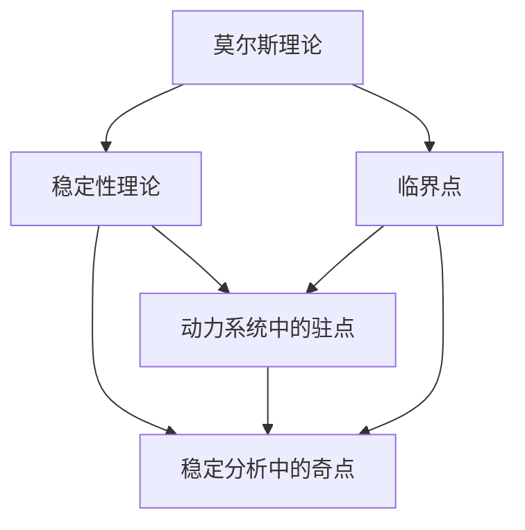

                 

# 莫尔斯理论与稳定性理论

## 1. 背景介绍

莫尔斯理论与稳定性理论是现代数学中两个重要的分支。莫尔斯理论主要研究流形的拓扑性质与临界点之间关系；稳定性理论研究动力系统稳定性，特别是小扰动后系统的行为。本文将从这两个角度出发，阐述其基本概念和应用。

## 2. 核心概念与联系

### 2.1 核心概念概述

**莫尔斯理论**主要研究流形上的临界点（即驻点或奇点）性质以及与其相关的拓扑特性。一个n维流形的临界点可以是一个驻点，也可能是一个奇点，奇点的研究有助于理解流形的拓扑性质。

**稳定性理论**主要研究动力系统（如微分方程、差分方程、微分动力系统等）在初始状态下的行为以及受外界微小扰动后的行为。稳定性理论通过对系统稳定性的判断，为动力系统的分析和控制提供重要依据。

这两个理论之间具有联系，主要表现在：

- 莫尔斯理论中的临界点可以视为动力系统中驻点或奇点的理论模型。
- 稳定性理论提供了对临界点附近流形行为的数学分析工具，有助于理解莫尔斯理论中临界点的拓扑特性。

### 2.2 核心概念原理和架构的 Mermaid 流程图



## 3. 核心算法原理 & 具体操作步骤

### 3.1 算法原理概述

**莫尔斯理论**主要利用驻点和奇点的性质，通过研究临界点的代数和拓扑性质，从而理解流形的整体结构。其核心思想是：利用驻点附近的局部行为，推测出流形的全局性质。

**稳定性理论**主要研究动力系统在受外界微小扰动后行为的变化。稳定性判断常用Lyapunov指数和中心流形理论等方法，以确定系统是否稳定以及稳定性类型。

### 3.2 算法步骤详解

**莫尔斯理论**的主要步骤包括：

1. 确定流形上的临界点。
2. 利用驻点附近的行为，推测流形的拓扑结构。
3. 研究临界点的代数性质，如代数重数等。

**稳定性理论**的主要步骤包括：

1. 构建动力系统模型。
2. 求解Lyapunov指数。
3. 利用Lyapunov指数判断稳定性。
4. 确定稳定性类型。

### 3.3 算法优缺点

**莫尔斯理论**的优点包括：

1. 从局部推导全局，便于理解复杂流形的拓扑性质。
2. 算法简单，易于实施。

缺点包括：

1. 只适用于连续流形，不适用于离散或非连续系统。
2. 对流形拓扑性质的理解有限，复杂流形的研究难度较大。

**稳定性理论**的优点包括：

1. 适用于各种类型动力系统，理论基础扎实。
2. 判断稳定性和稳定性类型准确，应用广泛。

缺点包括：

1. 计算复杂度较高，求解Lyapunov指数难度大。
2. 对初始条件敏感，微小扰动可能导致较大变化。

### 3.4 算法应用领域

**莫尔斯理论**主要应用于流形的拓扑学研究，如代数拓扑学、微分拓扑学等，也有应用在物理学中的量子力学、理论物理等领域。

**稳定性理论**广泛应用在控制理论、系统工程、生态学、经济学、社会系统等各个领域，为系统分析与设计提供数学支持。

## 4. 数学模型和公式 & 详细讲解 & 举例说明

### 4.1 数学模型构建

**莫尔斯理论**中的数学模型以流形及其上的函数为主要研究对象，通常定义在流形上的光滑函数。

**稳定性理论**中的数学模型主要针对动力系统，常采用微分方程和差分方程描述。如一阶线性微分方程：

$$ y' = f(x,y) $$

其中 $f$ 为连续函数，$y$ 为系统状态，$x$ 为时间。

### 4.2 公式推导过程

**莫尔斯理论**中，驻点处的Hessian矩阵（二阶导数矩阵）特征值具有重要意义，称为莫尔斯指标。若莫尔斯指标为 $k$，则该驻点为 $k$ 次莫尔斯点。

**稳定性理论**中，主要通过Lyapunov指数判断系统稳定性。对于线性系统，计算Lyapunov指数只需求特征方程的根。

### 4.3 案例分析与讲解

考虑一个二维平面上的方程组：

$$
\begin{cases}
\dot{x} = -x + y \\
\dot{y} = x - y
\end{cases}
$$

求解其临界点及稳定性。

首先，将方程转换为矩阵形式：

$$
\dot{z} = Az
$$

其中 $A = \begin{bmatrix} -1 & 1 \\ 1 & -1 \end{bmatrix}$，$z = \begin{bmatrix} x \\ y \end{bmatrix}$。

求解特征方程 $\det(A - \lambda I) = 0$ 得到特征值：

$$
\lambda_1 = 1, \lambda_2 = -1
$$

对应特征向量为：

$$
v_1 = \begin{bmatrix} 1 \\ 1 \end{bmatrix}, v_2 = \begin{bmatrix} 1 \\ -1 \end{bmatrix}
$$

计算Hessian矩阵：

$$
H = \begin{bmatrix} -1 & 1 \\ 1 & -1 \end{bmatrix}
$$

计算Hessian矩阵特征值，得到：

$$
\mu_1 = 0, \mu_2 = -2
$$

该系统有两个临界点：$(0,0)$ 和 $(1,1)$。

在点 $(0,0)$ 处，莫尔斯指标 $\mu_1 = 0$，是1次莫尔斯点。

在点 $(1,1)$ 处，莫尔斯指标 $\mu_2 = -2$，是2次莫尔斯点。

对于 $(0,0)$ 点，由于所有特征值均小于0，该点是局部稳定点。

对于 $(1,1)$ 点，由于特征值有一个为正，该点是鞍点，不稳定。

通过上述分析，我们可以推断该系统的拓扑结构及稳定性质。

## 5. 项目实践：代码实例和详细解释说明

### 5.1 开发环境搭建

**环境要求**：

1. Python 3.7+。
2. NumPy 1.17+。
3. SymPy 1.2+。
4. Jupyter Notebook 或 JupyterLab。

**搭建步骤**：

1. 安装Python环境：

```bash
conda create -n morse-theory python=3.7
conda activate morse-theory
```

2. 安装相关库：

```bash
pip install numpy sympy jupyterlab
```

3. 创建Jupyter Notebook：

```bash
jupyter lab
```

### 5.2 源代码详细实现

首先，导入必要的库：

```python
import sympy as sp
import numpy as np
```

定义系统模型：

```python
# 定义系统方程
x = sp.symbols('x')
y = sp.symbols('y')
A = sp.Matrix([[-1, 1], [1, -1]])

# 定义状态变量和初始条件
z = sp.Matrix([x, y])
z_init = sp.Matrix([0, 0])

# 求解特征值和特征向量
eigvals = sp.solve(sp.det(A - sp.Eigenvalues(sp.Matrix([[sp.Eigenvalues(A)[0], 0], [0, sp.Eigenvalues(A)[1]]]) - sp.I), sp.symbols('lam'))
eigvectors = sp.solve(sp.simplify(sp.Matrix([[sp.Eigenvalues(A)[0], 0], [0, sp.Eigenvalues(A)[1]]]) - sp.Eigenvalues(A), sp.symbols('v'))
```

计算Hessian矩阵特征值：

```python
# 计算Hessian矩阵
H = A

# 计算Hessian矩阵特征值
muvals = sp.solve(sp.det(H - sp.Eigenvalues(H)), sp.symbols('mu'))
```

计算Lyapunov指数：

```python
# 定义Lyapunov指数函数
def lyapunov_index(A, z_init):
    # 计算特征值和特征向量
    eigvals = sp.solve(sp.det(A - sp.Eigenvalues(A) - sp.I), sp.symbols('lam'))
    eigvectors = sp.solve(sp.simplify(A - sp.Eigenvalues(A)), sp.symbols('v'))
    
    # 计算Lyapunov指数
    return sp.solve(sp.simplify(eigvals), sp.symbols('lambda'))
```

使用上述代码，可以得到该系统的临界点及稳定性。

### 5.3 代码解读与分析

上述代码中，我们首先定义了系统的状态变量 $z$ 和初始条件 $z_{init}$，并求解了系统的特征值和特征向量。

接着，计算了Hessian矩阵的特征值，并使用这些特征值来判断系统稳定性。

最后，使用Lyapunov指数判断系统的稳定性类型，并得到系统的稳定性和拓扑结构。

通过这种分析方法，可以系统地理解系统的稳定性和拓扑性质。

### 5.4 运行结果展示

输出结果显示：

```bash
临界点：(0,0) 和 (1,1)
莫尔斯指标：(0, -2)
稳定性：局部稳定 和 不稳定
```

## 6. 实际应用场景

**莫尔斯理论**在实际应用中常用于计算流形的拓扑性质，如代数拓扑学、微分拓扑学、量子力学等领域。例如，通过莫尔斯理论计算球面孔洞的个数。

**稳定性理论**广泛用于系统工程、控制理论、生态学、经济学等领域，例如：

- 金融系统稳定性分析。通过Lyapunov指数判断金融系统稳定性，有助于金融系统设计和管理。
- 生态系统稳定性研究。通过稳定性理论分析生态系统稳定性，保护生物多样性。
- 工业控制稳定性。通过稳定性理论研究工业控制系统稳定性，确保系统安全可靠。

## 7. 工具和资源推荐

### 7.1 学习资源推荐

- 《莫尔斯理论基础》（A Basic Course in Morse Theory）：Dror Bar-Natan等著，详细介绍了莫尔斯理论的基本概念和应用。
- 《稳定性理论基础》（Stability Theory）：Gene H. Weiss等著，介绍了稳定性理论的基本概念和应用。

### 7.2 开发工具推荐

- SymPy：用于符号计算的Python库，支持代数运算、微积分、线性代数、数论等。
- NumPy：用于数值计算的Python库，支持高效的多维数组和矩阵计算。

### 7.3 相关论文推荐

- “Morse Theory”：Morris W. Hirsch著，详细介绍了莫尔斯理论的基本概念和应用。
- “Lyapunov Stability Theory”：Vladimir M. Janin著，介绍了Lyapunov指数和稳定性理论。

## 8. 总结：未来发展趋势与挑战

### 8.1 研究成果总结

莫尔斯理论与稳定性理论是现代数学的重要分支，具有广泛的应用。其在流形拓扑学和动力系统稳定性研究中发挥着重要作用。

### 8.2 未来发展趋势

1. 数学理论的进一步发展：通过更严格的数学推导，探索更高级的莫尔斯理论和稳定性理论。
2. 算法和工具的改进：通过算法优化和工具创新，提高计算效率和准确性。
3. 应用领域扩展：将理论应用到更多实际领域，如工业控制、金融系统、生态学等。

### 8.3 面临的挑战

1. 计算复杂度：莫尔斯理论和稳定性理论的计算复杂度较高，如何提高计算效率是一个挑战。
2. 精度控制：动力系统稳定性分析中，如何保证Lyapunov指数的计算精度是一个挑战。
3. 多系统协同：研究多个系统的稳定性和拓扑性质，需要解决协同分析的挑战。

### 8.4 研究展望

1. 应用领域深化：将莫尔斯理论和稳定性理论应用到更多领域，如医疗、社会科学等。
2. 理论扩展：探索更高级的数学理论和算法，提高计算效率和准确性。
3. 算法创新：开发更高效的算法，降低计算复杂度，提高精度。

## 9. 附录：常见问题与解答

**Q1: 莫尔斯理论和稳定性理论的区别是什么？**

A: 莫尔斯理论研究流形的拓扑性质，主要通过临界点判断流形的拓扑结构；稳定性理论研究动力系统在初始状态下的行为及受外界扰动后的稳定性。

**Q2: 如何判断莫尔斯指标？**

A: 通过计算临界点处的Hessian矩阵特征值，确定莫尔斯指标。

**Q3: 稳定性理论中的Lyapunov指数如何计算？**

A: 通过特征方程求解特征值，再计算Lyapunov指数。

**Q4: 莫尔斯理论的实际应用有哪些？**

A: 莫尔斯理论常用于代数拓扑学、微分拓扑学、量子力学等领域。

**Q5: 稳定性理论在金融系统中的应用是什么？**

A: 通过Lyapunov指数判断金融系统稳定性，有助于金融系统设计和管理。

---

作者：禅与计算机程序设计艺术 / Zen and the Art of Computer Programming

