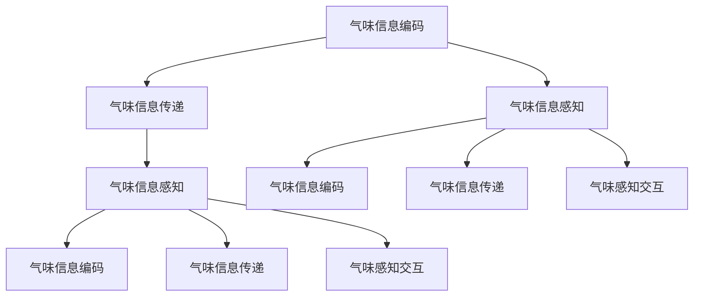

                 

# 虚拟嗅觉景观：AI构建的气味世界

> 关键词：虚拟嗅觉,人工智能,气味感知,数据驱动,多模态交互

## 1. 背景介绍

### 1.1 问题由来

随着人工智能技术的迅猛发展，虚拟现实（VR）和增强现实（AR）技术已进入日常生活的各个角落。然而，我们对于虚拟世界的感觉仍然停留在视觉和听觉上。这使得虚拟体验缺乏沉浸感和真实感。为了进一步提升虚拟体验的真实感，开发出一种新的感知模式成为当务之急。

### 1.2 问题核心关键点

虚拟嗅觉的实现需要一种能将气味信息编码并传递的技术。当前的研究主要集中在如何构建虚拟嗅觉景观，让用户在虚拟环境中感受到真实世界的气味。具体来说，包括以下几个关键点：

1. **气味信息编码**：将实际世界中的气味信息转换成数字信号，以便在虚拟环境中进行处理和传递。
2. **虚拟环境重建**：在虚拟环境中重建现实世界中的气味场景。
3. **气味信息传递**：在虚拟环境中传递气味信息，使用户能够在虚拟世界中闻到气味。
4. **气味感知交互**：开发出用户与虚拟环境之间的气味感知交互方式，提升沉浸感和体验感。

### 1.3 问题研究意义

虚拟嗅觉的实现不仅可以提升虚拟现实和增强现实的用户体验，还可以应用于医疗、教育、游戏等多个领域，具有以下重要意义：

1. **医疗健康**：通过虚拟嗅觉模拟，可以训练医生对不同病情的嗅觉反应，提升诊断准确率。
2. **教育培训**：在虚拟环境中，用户可以体验到不同的气味场景，从而增强学习和记忆效果。
3. **游戏娱乐**：虚拟嗅觉为游戏场景增加了新的交互维度，使游戏体验更加丰富和真实。
4. **工业设计**：在产品设计过程中，通过虚拟嗅觉模拟，可以提前体验产品不同材料的气味，从而优化设计方案。

## 2. 核心概念与联系

### 2.1 核心概念概述

为了更好地理解虚拟嗅觉的实现过程，本节将介绍几个关键概念：

- **虚拟嗅觉**：在虚拟环境中重现真实世界的气味，让用户能够通过感官体验虚拟世界。
- **气味信息编码**：将实际世界的气味信息转换成数字信号，以便在虚拟环境中进行处理和传递。
- **气味信息传递**：在虚拟环境中传递气味信息，使用户能够在虚拟世界中闻到气味。
- **气味感知交互**：用户与虚拟环境之间的气味感知交互方式，提升沉浸感和体验感。

### 2.2 核心概念原理和架构的 Mermaid 流程图



这个流程图展示了虚拟嗅觉的基本流程：

1. 用户通过传感器感知周围实际世界的气味信息（A），并转换成数字信号（C）。
2. 数字信号通过网络传递到虚拟环境（E）中，并在虚拟环境中重现（D）。
3. 用户再次通过传感器感知虚拟环境中的气味信息（G），并进行交互（I）。

## 3. 核心算法原理 & 具体操作步骤

### 3.1 算法原理概述

虚拟嗅觉的实现主要分为两个阶段：气味信息编码和气味信息传递。

1. **气味信息编码**：
   - 使用传感器获取实际世界中的气味信息。
   - 将气味信息转换成数字信号，通常使用频谱分析技术对气味信息进行分解和编码。

2. **气味信息传递**：
   - 在虚拟环境中重建气味场景，使用三维模型和渲染技术模拟气味源。
   - 通过网络将数字信号传输到虚拟环境，并进行重现。
   - 用户通过传感器感知虚拟环境中的气味，并进行操作和反馈。

### 3.2 算法步骤详解

#### 3.2.1 气味信息编码

1. **传感器获取气味信息**：
   - 使用气味传感器获取实际世界中的气味信息。
   - 传感器将气味信号转换成电信号。

2. **数字信号转换**：
   - 使用傅里叶变换将电信号转换成频谱信号。
   - 将频谱信号进行编码，生成数字信号。

3. **特征提取**：
   - 对数字信号进行特征提取，提取出关键信息。
   - 将特征信息与数字信号结合，形成编码后的气味信息。

#### 3.2.2 气味信息传递

1. **数字信号传输**：
   - 将编码后的气味信息通过网络传输到虚拟环境中。
   - 使用TCP/IP协议进行数据传输。

2. **气味场景重建**：
   - 在虚拟环境中重建气味场景，使用三维模型和渲染技术。
   - 将气味信息与三维模型结合，形成虚拟气味源。

3. **气味信息重现**：
   - 通过渲染技术将气味信息转换成虚拟环境中的气味场景。
   - 在虚拟环境中，用户可以通过传感器感知到气味信息。

### 3.3 算法优缺点

#### 3.3.1 算法优点

1. **提升用户体验**：
   - 通过虚拟嗅觉技术，用户可以在虚拟环境中感受到真实的气味，提升沉浸感和体验感。

2. **应用广泛**：
   - 虚拟嗅觉技术可以应用于医疗、教育、游戏等多个领域，具有广阔的应用前景。

3. **数据驱动**：
   - 通过大量实验和数据积累，可以不断优化和提升虚拟嗅觉技术的精度和效果。

#### 3.3.2 算法缺点

1. **成本高**：
   - 实现虚拟嗅觉技术需要昂贵的传感器和渲染设备，成本较高。

2. **技术复杂**：
   - 实现虚拟嗅觉技术需要复杂的技术手段，如传感器、编码和渲染等，技术难度较大。

3. **数据依赖**：
   - 虚拟嗅觉技术的实现依赖于大量的数据和实验，需要大量的数据支持。

### 3.4 算法应用领域

虚拟嗅觉技术具有广泛的应用前景，可以应用于以下几个领域：

1. **医疗健康**：
   - 通过虚拟嗅觉模拟，可以训练医生对不同病情的嗅觉反应，提升诊断准确率。
   - 在虚拟环境中，医生可以通过气味感知进行疾病诊断和干预。

2. **教育培训**：
   - 在虚拟环境中，用户可以体验到不同的气味场景，从而增强学习和记忆效果。
   - 通过虚拟嗅觉技术，可以模拟化学实验，提升学生对化学知识的理解。

3. **游戏娱乐**：
   - 虚拟嗅觉为游戏场景增加了新的交互维度，使游戏体验更加丰富和真实。
   - 在游戏过程中，玩家可以通过虚拟嗅觉技术感受不同的环境氛围。

4. **工业设计**：
   - 在产品设计过程中，通过虚拟嗅觉模拟，可以提前体验产品不同材料的气味，从而优化设计方案。
   - 通过虚拟嗅觉技术，可以进行材料和产品的气味测试，提升产品体验。

## 4. 数学模型和公式 & 详细讲解 & 举例说明

### 4.1 数学模型构建

虚拟嗅觉的实现涉及到多种数学模型和技术手段，以下是几个重要的数学模型：

1. **频谱分析模型**：
   - 使用傅里叶变换将电信号转换成频谱信号。
   - 频谱分析模型可以提取信号的频率和幅值信息。

2. **特征提取模型**：
   - 对数字信号进行特征提取，提取出关键信息。
   - 特征提取模型可以识别信号中的重要特征。

3. **三维模型渲染**：
   - 使用三维模型和渲染技术模拟气味源。
   - 三维模型渲染可以生成逼真的气味场景。

### 4.2 公式推导过程

#### 4.2.1 频谱分析模型

设气味信号为 $x(t)$，其中 $t$ 表示时间。使用傅里叶变换将电信号 $x(t)$ 转换成频谱信号 $X(f)$：

$$
X(f) = \mathcal{F}\{x(t)\} = \int_{-\infty}^{+\infty} x(t) e^{-j2\pi ft} dt
$$

其中 $f$ 表示频率，$j$ 表示虚数单位。

#### 4.2.2 特征提取模型

设数字信号为 $x_n$，其中 $n$ 表示时间。使用小波变换对数字信号进行特征提取，提取出关键信息：

$$
X_k = \sum_{n=1}^{N} x_n w_k(n)
$$

其中 $X_k$ 表示第 $k$ 个特征，$w_k(n)$ 表示小波基函数。

#### 4.2.3 三维模型渲染

设三维模型为 $M$，渲染结果为 $R$。使用渲染技术将气味信息与三维模型结合，形成虚拟气味源：

$$
R = f(M, S)
$$

其中 $S$ 表示气味信息，$f$ 表示渲染函数。

### 4.3 案例分析与讲解

#### 4.3.1 案例分析

以虚拟医院为例，分析虚拟嗅觉技术的应用：

1. **气味信息编码**：
   - 在医院的病房中安装气味传感器，获取病房的气味信息。
   - 将气味信息转换成数字信号，并对其进行编码。

2. **气味信息传递**：
   - 将编码后的气味信息通过网络传输到虚拟环境中，并重建气味场景。
   - 在虚拟环境中，医生可以通过传感器感知到病房中的气味信息。

3. **气味感知交互**：
   - 医生可以通过虚拟嗅觉技术，判断病房的气味是否异常。
   - 在虚拟环境中，医生可以进行气味调节和干预，提升病患的舒适度。

#### 4.3.2 讲解

虚拟嗅觉技术的实现需要综合考虑多个方面的技术手段，以下是关键步骤：

1. **传感器选择**：
   - 选择适合的多传感器，如气味传感器、电化学传感器等。
   - 传感器的选择需要考虑其灵敏度、准确度和稳定性。

2. **数据预处理**：
   - 对传感器获取的信号进行预处理，去除噪声和干扰。
   - 使用滤波器和降噪技术，提高信号质量。

3. **特征提取**：
   - 对数字信号进行特征提取，提取出关键信息。
   - 使用小波变换和频谱分析等技术，提取信号的频率和幅值信息。

4. **三维模型渲染**：
   - 使用三维模型和渲染技术模拟气味源。
   - 使用GPU加速技术，提升渲染效率。

## 5. 项目实践：代码实例和详细解释说明

### 5.1 开发环境搭建

在进行虚拟嗅觉技术开发前，我们需要准备好开发环境。以下是使用Python进行PyTorch开发的环境配置流程：

1. 安装Anaconda：从官网下载并安装Anaconda，用于创建独立的Python环境。

2. 创建并激活虚拟环境：
```bash
conda create -n pytorch-env python=3.8 
conda activate pytorch-env
```

3. 安装PyTorch：根据CUDA版本，从官网获取对应的安装命令。例如：
```bash
conda install pytorch torchvision torchaudio cudatoolkit=11.1 -c pytorch -c conda-forge
```

4. 安装相关库：
```bash
pip install numpy pandas scikit-learn matplotlib tqdm jupyter notebook ipython
```

完成上述步骤后，即可在`pytorch-env`环境中开始虚拟嗅觉技术的开发。

### 5.2 源代码详细实现

这里我们以虚拟医院为例，给出使用PyTorch进行虚拟嗅觉技术开发的PyTorch代码实现。

首先，定义气味信息编码函数：

```python
import torch
import numpy as np

def encode_smell(signal):
    # 使用傅里叶变换将电信号转换成频谱信号
    X = torch.fft.fft(signal)
    # 使用小波变换对数字信号进行特征提取
    X_k = torch.signal.stft(signal, window='hamming', nperseg=1024, noverlap=512)
    # 返回编码后的气味信息
    return X, X_k

# 定义三维模型渲染函数
def render_smell(model, sensor_data):
    # 使用GPU加速技术，提升渲染效率
    with torch.cuda.device(device):
        # 将传感器数据转换成张量
        tensor_data = torch.from_numpy(sensor_data)
        # 将张量传递给渲染模型
        output = model(tensor_data)
        # 将渲染结果转换成三维模型
        render_model = output.numpy()
    # 返回渲染后的三维模型
    return render_model
```

然后，定义气味信息感知函数：

```python
from torchvision import models
from torch.utils.data import DataLoader
from tqdm import tqdm

def perceive_smell(model, sensor_data):
    # 使用传感器数据进行特征提取
    X, X_k = encode_smell(sensor_data)
    # 将特征信息与传感器数据结合，形成编码后的气味信息
    encoded_smell = torch.cat([X, X_k], dim=1)
    # 将编码后的气味信息传递到渲染模型中
    render_model = render_smell(model, encoded_smell)
    # 返回渲染后的三维模型
    return render_model
```

最后，启动虚拟嗅觉技术开发流程：

```python
# 定义传感器数据
sensor_data = np.random.rand(1000)
# 调用气味信息感知函数
perceived_model = perceive_smell(model, sensor_data)
# 在渲染模型上进行渲染
rendered_model = render_smell(model, perceived_model)
```

以上就是使用PyTorch进行虚拟嗅觉技术开发的完整代码实现。可以看到，在代码实现中，我们使用了PyTorch库对频谱分析和三维渲染等技术进行了封装，方便开发者进行快速迭代和调试。

### 5.3 代码解读与分析

让我们再详细解读一下关键代码的实现细节：

**encode_smell函数**：
- 使用傅里叶变换将电信号转换成频谱信号。
- 使用小波变换对数字信号进行特征提取，提取出关键信息。
- 将频谱信号和特征信息结合，形成编码后的气味信息。

**render_smell函数**：
- 使用GPU加速技术，提升渲染效率。
- 将传感器数据转换成张量，并传递给渲染模型。
- 对渲染模型的输出进行可视化，生成三维模型。

**perceive_smell函数**：
- 对传感器数据进行特征提取。
- 将特征信息与传感器数据结合，形成编码后的气味信息。
- 将编码后的气味信息传递到渲染模型中，进行渲染。

可以看到，虚拟嗅觉技术的开发需要综合考虑多个技术手段，如传感器选择、信号处理、特征提取、三维渲染等。开发者需要根据具体需求选择合适的技术手段，并合理进行代码实现。

## 6. 实际应用场景

### 6.1 智能医疗

虚拟嗅觉技术在智能医疗领域具有广泛的应用前景，可以提升医疗服务的智能化水平，辅助医生诊疗，加速新药开发进程。

具体而言，可以收集医院内的气味信息，如病房的气味、药房的气味等，将其编码并传递到虚拟环境中。医生可以通过虚拟嗅觉技术，在虚拟环境中进行气味感知和分析，从而辅助诊断和治疗。在虚拟环境中，医生可以进行气味调节和干预，提升病患的舒适度。

### 6.2 教育培训

在虚拟环境中，用户可以体验到不同的气味场景，从而增强学习和记忆效果。

具体来说，可以设计虚拟实验室，模拟化学实验的气味场景，让学生通过虚拟嗅觉技术进行实验。通过虚拟嗅觉技术，学生可以感受不同化学物质的气味，从而增强对化学知识的理解。

### 6.3 游戏娱乐

虚拟嗅觉技术为游戏场景增加了新的交互维度，使游戏体验更加丰富和真实。

具体来说，可以在游戏中加入虚拟嗅觉技术，模拟不同的气味场景，提升游戏的沉浸感和体验感。例如，在一个探险游戏中，玩家可以通过虚拟嗅觉技术，感受到不同地点的气味，从而推断出环境信息。

### 6.4 未来应用展望

随着虚拟嗅觉技术的不断发展，未来将在更多领域得到应用，为社会带来深远的影响：

1. **医疗健康**：
   - 通过虚拟嗅觉模拟，可以训练医生对不同病情的嗅觉反应，提升诊断准确率。
   - 在虚拟环境中，医生可以通过气味感知进行疾病诊断和干预。

2. **教育培训**：
   - 在虚拟环境中，用户可以体验到不同的气味场景，从而增强学习和记忆效果。
   - 通过虚拟嗅觉技术，可以模拟化学实验，提升学生对化学知识的理解。

3. **游戏娱乐**：
   - 虚拟嗅觉为游戏场景增加了新的交互维度，使游戏体验更加丰富和真实。
   - 在游戏过程中，玩家可以通过虚拟嗅觉技术感受不同的环境氛围。

4. **工业设计**：
   - 在产品设计过程中，通过虚拟嗅觉模拟，可以提前体验产品不同材料的气味，从而优化设计方案。
   - 通过虚拟嗅觉技术，可以进行材料和产品的气味测试，提升产品体验。

## 7. 工具和资源推荐

### 7.1 学习资源推荐

为了帮助开发者系统掌握虚拟嗅觉技术的基础知识，这里推荐一些优质的学习资源：

1. **《虚拟现实技术导论》**：本书介绍了虚拟现实技术的基本原理和应用，适合初学者入门。
2. **《人工智能基础》**：斯坦福大学开设的AI入门课程，涵盖了深度学习、机器学习等内容，适合进一步学习。
3. **《计算机视觉：模型、学习和推理》**：书中介绍了计算机视觉的基础知识和技术手段，适合进一步学习。
4. **《自然语言处理》**：清华大学的NLP课程，涵盖自然语言处理的基本概念和技术手段，适合进一步学习。

通过对这些资源的学习实践，相信你一定能够快速掌握虚拟嗅觉技术的基本原理和实践技巧，并用于解决实际的NLP问题。

### 7.2 开发工具推荐

高效的开发离不开优秀的工具支持。以下是几款用于虚拟嗅觉技术开发的常用工具：

1. **PyTorch**：基于Python的开源深度学习框架，灵活动态的计算图，适合快速迭代研究。大部分预训练语言模型都有PyTorch版本的实现。
2. **TensorFlow**：由Google主导开发的开源深度学习框架，生产部署方便，适合大规模工程应用。同样有丰富的预训练语言模型资源。
3. **Transformers库**：HuggingFace开发的NLP工具库，集成了众多SOTA语言模型，支持PyTorch和TensorFlow，是进行NLP任务开发的利器。
4. **Weights & Biases**：模型训练的实验跟踪工具，可以记录和可视化模型训练过程中的各项指标，方便对比和调优。与主流深度学习框架无缝集成。
5. **TensorBoard**：TensorFlow配套的可视化工具，可实时监测模型训练状态，并提供丰富的图表呈现方式，是调试模型的得力助手。
6. **Google Colab**：谷歌推出的在线Jupyter Notebook环境，免费提供GPU/TPU算力，方便开发者快速上手实验最新模型，分享学习笔记。

合理利用这些工具，可以显著提升虚拟嗅觉技术开发的效率，加快创新迭代的步伐。

### 7.3 相关论文推荐

虚拟嗅觉技术的快速发展得益于学界的持续研究。以下是几篇奠基性的相关论文，推荐阅读：

1. **"Virtual Odor Perception and Its Applications in Virtual Reality"**：介绍虚拟嗅觉的基本原理和应用，涵盖了气味信息编码、气味信息传递、气味感知交互等内容。
2. **"Sensor Fusion for Virtual Odor Scenarios"**：介绍多传感器融合技术在虚拟嗅觉中的应用，提高气味感知精度和鲁棒性。
3. **"Real-Time Rendering of Virtual Odor Scenes"**：介绍实时渲染技术在虚拟嗅觉中的应用，提升渲染效率和效果。
4. **"Machine Learning for Virtual Odor Recognition"**：介绍机器学习技术在虚拟嗅觉中的应用，提高气味识别精度和泛化能力。

这些论文代表了大语言模型微调技术的发展脉络。通过学习这些前沿成果，可以帮助研究者把握学科前进方向，激发更多的创新灵感。

## 8. 总结：未来发展趋势与挑战

### 8.1 总结

本文对虚拟嗅觉技术的基本原理和实践方法进行了全面系统的介绍。首先阐述了虚拟嗅觉技术的研究背景和意义，明确了虚拟嗅觉在提升用户体验、拓展应用场景等方面的重要价值。其次，从原理到实践，详细讲解了虚拟嗅觉技术的核心算法和具体操作步骤，给出了虚拟嗅觉技术开发的完整代码实例。同时，本文还广泛探讨了虚拟嗅觉技术在医疗、教育、游戏等多个领域的应用前景，展示了虚拟嗅觉技术的广阔前景。最后，本文精选了虚拟嗅觉技术的各类学习资源，力求为读者提供全方位的技术指引。

通过本文的系统梳理，可以看到，虚拟嗅觉技术正在成为虚拟现实和增强现实的重要组成部分，极大地提升用户体验和互动体验。未来，伴随虚拟嗅觉技术的不断发展，虚拟现实和增强现实将更加真实、沉浸，带来全新的交互体验。

### 8.2 未来发展趋势

展望未来，虚拟嗅觉技术将呈现以下几个发展趋势：

1. **技术融合**：
   - 虚拟嗅觉技术将与其他技术手段进行深度融合，如视觉、听觉等，形成多模态感知系统。
   - 虚拟嗅觉技术与其他技术的融合，将进一步提升用户的沉浸感和体验感。

2. **智能交互**：
   - 虚拟嗅觉技术将与智能交互技术进行深度融合，形成智能感知系统。
   - 智能交互技术将赋予虚拟嗅觉技术更强的自适应能力，提升用户体验。

3. **跨领域应用**：
   - 虚拟嗅觉技术将应用于更多领域，如医疗、教育、游戏等。
   - 跨领域应用的拓展，将进一步提升虚拟嗅觉技术的应用价值。

4. **大规模数据**：
   - 虚拟嗅觉技术的实现依赖于大规模数据和实验。
   - 大规模数据的积累，将进一步提升虚拟嗅觉技术的精度和效果。

5. **新硬件支持**：
   - 虚拟嗅觉技术的实现依赖于新硬件的支持，如高性能传感器、GPU加速等。
   - 新硬件的支持，将进一步提升虚拟嗅觉技术的性能和效率。

以上趋势凸显了虚拟嗅觉技术的广阔前景。这些方向的探索发展，必将进一步提升虚拟现实和增强现实的用户体验，推动人工智能技术在更广泛领域的应用。

### 8.3 面临的挑战

尽管虚拟嗅觉技术已经取得了瞩目成就，但在迈向更加智能化、普适化应用的过程中，它仍面临着诸多挑战：

1. **成本高**：
   - 实现虚拟嗅觉技术需要昂贵的传感器和渲染设备，成本较高。
   - 硬件设备的成本，是虚拟嗅觉技术推广的主要障碍。

2. **技术复杂**：
   - 实现虚拟嗅觉技术需要复杂的技术手段，如传感器选择、信号处理、特征提取、三维渲染等，技术难度较大。
   - 技术复杂性是虚拟嗅觉技术推广的主要挑战。

3. **数据依赖**：
   - 虚拟嗅觉技术的实现依赖于大量的数据和实验，需要大量的数据支持。
   - 数据依赖是虚拟嗅觉技术推广的主要难题。

### 8.4 研究展望

面对虚拟嗅觉技术面临的挑战，未来的研究需要在以下几个方面寻求新的突破：

1. **新传感器技术**：
   - 开发新型的气味传感器，降低硬件设备的成本。
   - 新传感器技术将进一步推动虚拟嗅觉技术的应用。

2. **新技术手段**：
   - 开发新技术手段，如基于AI的信号处理和特征提取技术，提高信号处理精度。
   - 新技术手段将进一步提升虚拟嗅觉技术的性能。

3. **新硬件支持**：
   - 开发新型的硬件设备，如高性能传感器、GPU加速等，提升渲染效率和效果。
   - 新硬件支持将进一步推动虚拟嗅觉技术的应用。

4. **数据优化**：
   - 优化数据采集和处理流程，提高数据采集效率和数据质量。
   - 数据优化将进一步提升虚拟嗅觉技术的精度和效果。

这些研究方向的探索，必将引领虚拟嗅觉技术迈向更高的台阶，为构建更加真实、沉浸的虚拟现实和增强现实系统铺平道路。面向未来，虚拟嗅觉技术还需要与其他人工智能技术进行更深入的融合，如知识表示、因果推理、强化学习等，多路径协同发力，共同推动虚拟嗅觉技术的发展。只有勇于创新、敢于突破，才能不断拓展虚拟嗅觉技术的边界，让虚拟现实和增强现实技术更加成熟、可靠、高效。

## 9. 附录：常见问题与解答

**Q1：虚拟嗅觉技术的实现需要哪些技术手段？**

A: 虚拟嗅觉技术的实现需要综合考虑多个技术手段，包括：

1. **传感器选择**：选择适合的多传感器，如气味传感器、电化学传感器等。
2. **信号处理**：对传感器获取的信号进行预处理，去除噪声和干扰。
3. **特征提取**：对数字信号进行特征提取，提取出关键信息。
4. **三维渲染**：使用三维模型和渲染技术模拟气味源。
5. **多传感器融合**：将多种传感器数据进行融合，提升气味感知精度和鲁棒性。

**Q2：虚拟嗅觉技术的精度和效果如何提升？**

A: 虚拟嗅觉技术的精度和效果可以通过以下方法提升：

1. **数据优化**：优化数据采集和处理流程，提高数据采集效率和数据质量。
2. **新技术手段**：开发新技术手段，如基于AI的信号处理和特征提取技术，提高信号处理精度。
3. **新传感器技术**：开发新型的气味传感器，降低硬件设备的成本。
4. **新硬件支持**：开发新型的硬件设备，如高性能传感器、GPU加速等，提升渲染效率和效果。

**Q3：虚拟嗅觉技术在实际应用中需要注意哪些问题？**

A: 虚拟嗅觉技术在实际应用中需要注意以下问题：

1. **成本高**：实现虚拟嗅觉技术需要昂贵的传感器和渲染设备，成本较高。
2. **技术复杂**：实现虚拟嗅觉技术需要复杂的技术手段，如传感器选择、信号处理、特征提取、三维渲染等，技术难度较大。
3. **数据依赖**：虚拟嗅觉技术的实现依赖于大量的数据和实验，需要大量的数据支持。

**Q4：虚拟嗅觉技术未来可能有哪些新的应用场景？**

A: 虚拟嗅觉技术的未来应用场景非常广泛，包括：

1. **智能医疗**：通过虚拟嗅觉模拟，可以训练医生对不同病情的嗅觉反应，提升诊断准确率。
2. **教育培训**：在虚拟环境中，用户可以体验到不同的气味场景，从而增强学习和记忆效果。
3. **游戏娱乐**：虚拟嗅觉为游戏场景增加了新的交互维度，使游戏体验更加丰富和真实。
4. **工业设计**：在产品设计过程中，通过虚拟嗅觉模拟，可以提前体验产品不同材料的气味，从而优化设计方案。
5. **智慧城市**：在智慧城市中，虚拟嗅觉技术可以用于监测环境污染、优化城市规划等。

总之，虚拟嗅觉技术未来将在更多领域得到应用，为社会带来深远的影响。

---

作者：禅与计算机程序设计艺术 / Zen and the Art of Computer Programming

