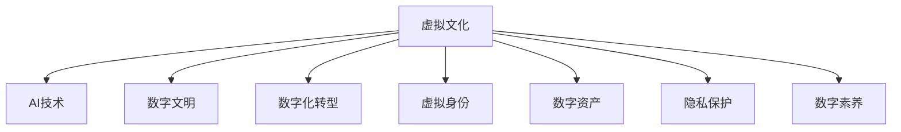

                 

# 虚拟文化：AI塑造的新型社会规范

> 关键词：虚拟文化, AI, 社会规范, 数字文明, 数字化转型

## 1. 背景介绍

### 1.1 问题由来
人工智能(AI)正在深刻改变着人类社会的方方面面，而其中的虚拟文化（Virtual Culture）以其独特的魅力，正在重塑人类社会的道德和伦理规范。虚拟文化，通常指在虚拟空间或虚拟环境中，通过AI技术实现的各种互动、交流、创造等活动，涵盖虚拟游戏、虚拟现实（VR）、增强现实（AR）、元宇宙（Metaverse）等多个领域。虚拟文化的崛起，不仅对技术、经济产生深远影响，也对社会文化、伦理道德、公共政策等方面带来诸多挑战。

### 1.2 问题核心关键点
虚拟文化的关键在于AI技术在虚拟空间中的应用。AI的强大算法和计算能力，使得虚拟文化具备了真实世界无法比拟的特性。例如，AI可以自动生成内容、智能交互、模拟真实环境等，极大地丰富了虚拟文化的体验和功能。此外，虚拟文化还带来了虚拟身份、数字资产、隐私保护、数字素养等新概念，需要社会各界共同关注和探讨。

## 2. 核心概念与联系

### 2.1 核心概念概述

为了更好地理解虚拟文化及其背后的AI技术，本节将介绍几个密切相关的核心概念：

- **虚拟文化**：指在虚拟空间或虚拟环境中，通过AI技术实现的各种互动、交流、创造等活动。包括虚拟游戏、虚拟现实（VR）、增强现实（AR）、元宇宙（Metaverse）等多个领域。
- **AI技术**：以机器学习、深度学习等为代表的AI技术，赋予了虚拟文化强大的算法和计算能力，使其具备了丰富多样的交互和创造功能。
- **数字文明**：指在数字时代下，通过科技手段构建的新的社会文明形态。虚拟文化是数字文明的重要组成部分，其发展水平直接影响着数字社会的形态和进程。
- **数字化转型**：指在数字时代下，各行各业通过AI、大数据、云计算等技术手段，实现业务流程、商业模式、管理模式等的数字化升级。虚拟文化是数字化转型的一个重要方向和驱动力。
- **虚拟身份**：指在虚拟空间中，通过AI技术构建的、具有独特个性和功能的人类或非人类角色。虚拟身份不仅具备了物理身份的功能，还能通过AI实现更高级的智能互动。
- **数字资产**：指在虚拟空间中，通过AI技术生成的、具备法律和经济价值的虚拟物品或服务。例如虚拟货币、虚拟土地、虚拟艺术品等。
- **隐私保护**：指在虚拟空间中，通过AI技术实现的数据加密、访问控制、匿名化等措施，保障个人隐私不被侵犯。
- **数字素养**：指在数字时代下，具备利用数字技术和AI进行创造、沟通、决策的能力。数字素养是虚拟文化健康发展的必要条件。

这些核心概念之间的逻辑关系可以通过以下Mermaid流程图来展示：



这个流程图展示了几组核心概念及其之间的关系：

1. 虚拟文化通过AI技术得以实现和丰富。
2. 虚拟文化是数字文明的重要组成部分，推动了数字社会的演进。
3. 虚拟文化加速了各行各业的数字化转型。
4. 虚拟文化涉及虚拟身份、数字资产、隐私保护、数字素养等多个方面。

## 3. 核心算法原理 & 具体操作步骤
### 3.1 算法原理概述

虚拟文化的核心算法原理主要涉及AI的深度学习、自然语言处理（NLP）、计算机视觉（CV）等多个领域。以下是几个关键算法的概述：

- **深度学习**：通过多层神经网络结构，从大量数据中学习复杂的模式和关系，从而实现自动化的学习和推理。深度学习在虚拟文化中被广泛应用于游戏AI、虚拟角色交互、图像生成等领域。
- **自然语言处理（NLP）**：使计算机能够理解、处理和生成自然语言，从而实现虚拟对话、虚拟内容生成等功能。NLP在虚拟文化中被广泛应用于虚拟助手、虚拟客服、虚拟内容创作等场景。
- **计算机视觉（CV）**：使计算机能够感知、理解和生成视觉信息，从而实现虚拟环境模拟、虚拟角色感知、虚拟物品生成等功能。CV在虚拟文化中被广泛应用于虚拟现实、增强现实、元宇宙等场景。
- **生成对抗网络（GAN）**：通过两个神经网络（生成器和判别器）的对抗训练，生成逼真的虚拟物品、场景等，广泛应用于虚拟物品生成、虚拟环境模拟等领域。
- **强化学习**：通过奖励和惩罚机制，使AI能够在虚拟环境中学习最优策略，从而实现智能交互、虚拟角色决策等功能。强化学习在虚拟文化中被广泛应用于虚拟游戏、虚拟机器人、虚拟经济系统等领域。

### 3.2 算法步骤详解

虚拟文化的构建通常包括以下几个关键步骤：

**Step 1: 定义虚拟空间和场景**

- 确定虚拟空间的类型和规模，如虚拟游戏世界、虚拟社交平台、虚拟商业社区等。
- 设计虚拟场景的布局、环境和功能，如地图布局、天气系统、NPC行为等。

**Step 2: 数据收集和处理**

- 收集相关领域的真实数据，如地理数据、历史数据、用户行为数据等。
- 对数据进行清洗、标注、预处理等，以生成高质量的训练数据集。

**Step 3: 选择和训练AI模型**

- 根据任务需求，选择合适的AI模型，如深度学习模型、生成对抗网络（GAN）等。
- 使用收集的数据进行模型训练，调整模型超参数，优化模型性能。

**Step 4: 实现虚拟互动和功能**

- 实现虚拟角色的交互逻辑，如对话、决策、行为等。
- 实现虚拟物品和场景的生成逻辑，如地形生成、建筑生成、物品生成等。
- 实现虚拟环境的模拟逻辑，如天气变化、物理交互等。

**Step 5: 部署和维护**

- 将训练好的模型和生成的虚拟内容部署到虚拟空间中。
- 监控虚拟空间的使用情况，及时修复bug，优化性能。
- 定期更新模型和内容，保持虚拟空间的活跃和创新。

### 3.3 算法优缺点

虚拟文化通过AI技术的应用，具备了强大的交互和创造能力，但也存在一些限制和挑战：

**优点**：
1. **高互动性**：AI技术使虚拟文化具备了高度的交互性和沉浸感，用户可以随时随地进行互动。
2. **多样性**：AI可以生成各种虚拟物品、场景和角色，极大地丰富了虚拟文化的体验。
3. **低成本**：AI技术可以自动化生成大量内容，降低了虚拟文化的制作成本。
4. **高可扩展性**：AI模型可以方便地进行升级和扩展，支持虚拟文化持续创新和迭代。

**缺点**：
1. **隐私风险**：AI技术需要大量用户数据进行训练，可能存在隐私泄露和滥用的风险。
2. **伦理争议**：虚拟文化中的虚拟角色和物品可能引发伦理争议，如虚拟性爱、虚拟赌博等。
3. **算法偏见**：AI模型可能继承训练数据的偏见，导致虚拟文化中的歧视和不公。
4. **监管挑战**：虚拟文化跨越物理世界的边界，监管和法律问题复杂。
5. **用户依赖**：过度依赖虚拟文化可能导致现实生活的退化和人际关系疏远。

### 3.4 算法应用领域

虚拟文化已经在多个领域得到了广泛应用，以下是几个典型应用：

- **虚拟游戏**：通过AI技术实现游戏中的NPC、物品生成、环境模拟等，提升游戏体验和可玩性。如《我的世界》、《赛博朋克2077》等。
- **虚拟现实（VR）**：通过AI技术实现虚拟现实环境的互动和模拟，提供沉浸式的体验。如《Beat Saber》、《Half-Life: Alyx》等。
- **增强现实（AR）**：通过AI技术实现增强现实应用中的物体识别、互动和导航，提供虚拟与现实结合的体验。如《Pokémon GO》、《Microsoft HoloLens》等。
- **元宇宙（Metaverse）**：通过AI技术实现虚拟世界的构建和互动，打造全新的虚拟社交和经济系统。如《Roblox》、《The Sandbox》等。
- **虚拟助手**：通过NLP和AI技术实现虚拟助手的功能，如智能客服、虚拟导游、虚拟助教等。如Google Assistant、Amazon Alexa等。
- **虚拟经济**：通过AI技术实现虚拟经济系统，如虚拟货币、虚拟土地、虚拟交易等。如《Epic Games Fortnite》、《Decentraland》等。

## 4. 数学模型和公式 & 详细讲解
### 4.1 数学模型构建

虚拟文化的数学模型构建通常涉及深度学习、强化学习、生成对抗网络（GAN）等多个领域。以下以深度学习和强化学习为例，详细讲解其数学模型构建和应用。

### 4.2 公式推导过程

**深度学习模型**：以卷积神经网络（CNN）为例，其核心公式为：

$$
y = f(Wx + b)
$$

其中，$y$ 为模型输出，$x$ 为输入数据，$W$ 为权重矩阵，$b$ 为偏置向量，$f$ 为激活函数。在虚拟文化中，CNN被广泛应用于图像生成、虚拟物品生成等场景。

**强化学习模型**：以Q-learning为例，其核心公式为：

$$
Q(s, a) = r + \gamma \max_{a'} Q(s', a')
$$

其中，$s$ 为当前状态，$a$ 为当前动作，$r$ 为即时奖励，$s'$ 为下一个状态，$\gamma$ 为折扣因子。在虚拟文化中，Q-learning被广泛应用于虚拟游戏、虚拟机器人等场景。

### 4.3 案例分析与讲解

**案例一：虚拟物品生成**

- **问题**：如何利用GAN生成逼真的虚拟物品？
- **模型**：使用生成对抗网络（GAN），包含生成器和判别器两个部分。
- **算法步骤**：
  1. 收集并处理真实物品的高分辨率图像数据集。
  2. 定义生成器和判别器的网络结构。
  3. 使用训练数据集进行模型训练，调整生成器和判别器的参数。
  4. 生成新的虚拟物品，并进行后处理优化。

**案例二：虚拟游戏角色行为**

- **问题**：如何使虚拟游戏角色具备智能决策和行为？
- **模型**：使用强化学习算法，如Q-learning或策略梯度（PG）算法。
- **算法步骤**：
  1. 定义虚拟游戏场景和NPC行为规则。
  2. 定义状态、动作和奖励函数。
  3. 使用训练数据集进行模型训练，调整Q值或策略参数。
  4. 将训练好的模型应用于虚拟游戏中的NPC决策。

## 5. 项目实践：代码实例和详细解释说明
### 5.1 开发环境搭建

在进行虚拟文化项目实践前，我们需要准备好开发环境。以下是使用Python进行PyTorch和TensorFlow开发的常用环境配置流程：

1. 安装Anaconda：从官网下载并安装Anaconda，用于创建独立的Python环境。

2. 创建并激活虚拟环境：
```bash
conda create -n virtual_culture python=3.8 
conda activate virtual_culture
```

3. 安装PyTorch：根据CUDA版本，从官网获取对应的安装命令。例如：
```bash
conda install pytorch torchvision torchaudio cudatoolkit=11.1 -c pytorch -c conda-forge
```

4. 安装TensorFlow：
```bash
conda install tensorflow=2.7
```

5. 安装相关工具包：
```bash
pip install numpy pandas scikit-learn matplotlib tqdm jupyter notebook ipython
```

完成上述步骤后，即可在`virtual_culture`环境中开始虚拟文化项目实践。

### 5.2 源代码详细实现

下面以虚拟物品生成为例，给出使用PyTorch和GAN实现虚拟物品生成的代码实例。

首先，定义GAN模型：

```python
import torch
import torch.nn as nn
import torch.optim as optim

class Generator(nn.Module):
    def __init__(self):
        super(Generator, self).__init__()
        self.conv1 = nn.Conv2d(128, 64, 4, 1, 0, bias=False)
        self.conv2 = nn.Conv2d(64, 32, 4, 2, 1, bias=False)
        self.conv3 = nn.Conv2d(32, 1, 4, 2, 1, bias=False)
        self.fc1 = nn.Linear(100, 128 * 7 * 7)
        self.fc2 = nn.Linear(128 * 7 * 7, 64 * 7 * 7)
        self.fc3 = nn.Linear(64 * 7 * 7, 1 * 7 * 7)

    def forward(self, x):
        x = self.fc1(x)
        x = nn.functional.relu(x)
        x = self.fc2(x)
        x = nn.functional.relu(x)
        x = self.fc3(x)
        x = torch.sigmoid(x)
        x = x.view(-1, 1, 7, 7)
        return x
```

然后，定义判别器模型：

```python
class Discriminator(nn.Module):
    def __init__(self):
        super(Discriminator, self).__init__()
        self.conv1 = nn.Conv2d(1, 64, 4, 2, 1, bias=False)
        self.conv2 = nn.Conv2d(64, 128, 4, 2, 1, bias=False)
        self.fc1 = nn.Linear(128 * 7 * 7, 1)

    def forward(self, x):
        x = self.conv1(x)
        x = nn.functional.leaky_relu(x)
        x = self.conv2(x)
        x = nn.functional.leaky_relu(x)
        x = x.view(-1, 128 * 7 * 7)
        x = self.fc1(x)
        return x
```

接着，定义训练和评估函数：

```python
import numpy as np
from torch.utils.data import DataLoader
from torchvision.utils import save_image

device = torch.device('cuda') if torch.cuda.is_available() else torch.device('cpu')
G = Generator().to(device)
D = Discriminator().to(device)
criterion = nn.BCELoss()
optimizer_G = optim.Adam(G.parameters(), lr=0.0002, betas=(0.5, 0.999))
optimizer_D = optim.Adam(D.parameters(), lr=0.0002, betas=(0.5, 0.999))

def D_loss_real(real, pred_real):
    return criterion(pred_real, real)

def D_loss_fake(fake, pred_fake):
    return criterion(pred_fake, torch.ones_like(pred_fake))

def G_loss(fake, pred_fake):
    return criterion(pred_fake, torch.ones_like(pred_fake))

def train_D(model, data_loader, num_epochs):
    for epoch in range(num_epochs):
        for i, (real_images, _) in enumerate(data_loader):
            real_images = real_images.to(device)
            noise = torch.randn(real_images.size(0), 100).to(device)
            fake_images = G(noise)
            real_loss = D_loss_real(real_images, D(real_images))
            fake_loss = D_loss_fake(fake_images, D(fake_images))
            d_loss = (real_loss + fake_loss) / 2
            d_loss.backward()
            optimizer_D.step()
            optimizer_D.zero_grad()
            real_loss = D_loss_real(real_images, D(real_images))
            fake_loss = G_loss(fake_images, D(fake_images))
            g_loss = (real_loss + fake_loss) / 2
            g_loss.backward()
            optimizer_G.step()
            optimizer_G.zero_grad()
            if (i + 1) % 100 == 0:
                print(f"[{epoch+1}/{num_epochs}][{epoch+1:03d}/{num_epochs:03d}][{i+1}/{len(data_loader)}][d_loss: {d_loss:.4f}][g_loss: {g_loss:.4f}][bsz: {real_images.size(0)}]")
        if (epoch + 1) % 10 == 0:
            save_image(fake_images[:16].cpu(), f"fake_images_epoch_{epoch+1}.png")

def evaluate(model, data_loader):
    for i, (real_images, _) in enumerate(data_loader):
        real_images = real_images.to(device)
        noise = torch.randn(real_images.size(0), 100).to(device)
        fake_images = G(noise)
        fake_images = fake_images.cpu()
        print(f"Epoch {epoch+1} | Batch {i+1}/{len(data_loader)} | Batch Size: {real_images.size(0)} | D Real Loss: {D_loss_real(real_images, D(real_images)).item():.4f} | D Fake Loss: {D_loss_fake(fake_images, D(fake_images)).item():.4f} | G Loss: {G_loss(fake_images, D(fake_images)).item():.4f}")
        if i == 0:
            show_images = fake_images[0]
            f, ax = plt.subplots(1, 4, figsize=(12, 8))
            ax[0].imshow(np.roll(np.roll(show_images[0].numpy(), 0, axis=0), 0, axis=1))
            ax[0].set_title('Real Image')
            ax[1].imshow(np.roll(np.roll(show_images[1].numpy(), 0, axis=0), 0, axis=1))
            ax[1].set_title('Fake Image')
            plt.show()
```

最后，启动训练流程：

```python
num_epochs = 100

# 加载数据集
train_data = ...
train_loader = DataLoader(train_data, batch_size=64, shuffle=True)

# 开始训练
train_D(G, train_loader, num_epochs)
```

以上就是使用PyTorch和GAN实现虚拟物品生成的完整代码实例。可以看到，通过简单的代码实现，我们可以使用GAN技术生成逼真的虚拟物品，极大地丰富了虚拟文化的体验和功能。

### 5.3 代码解读与分析

让我们再详细解读一下关键代码的实现细节：

**GAN模型定义**：
- `Generator`和`Discriminator`类分别定义了生成器和判别器的网络结构。
- 生成器包括卷积层、全连接层，用于将随机噪声转化为图像。
- 判别器包括卷积层和全连接层，用于判断输入图像是真实图像还是生成的图像。

**训练函数定义**：
- `train_D`函数实现了判别器的训练过程，包括生成器和判别器的交替更新。
- 在每个epoch中，生成器先更新，生成新的虚拟物品；然后判别器更新，判别真实图像和生成的图像。
- 训练过程中，记录判别器和生成器的损失，并在每个epoch结束时保存生成的虚拟物品图像。

**运行结果展示**：
- 在训练过程中，训练函数会定期输出判别器和生成器的损失，同时保存生成的虚拟物品图像。
- 训练结束后，通过可视化工具可以观察到生成的虚拟物品的效果，验证模型的训练效果。

## 6. 实际应用场景
### 6.1 智能家居

虚拟文化在智能家居中的应用，通过AI技术实现了虚拟家庭助理、智能控制等功能，极大地提升了家居生活的便利性和智能化程度。

- **虚拟家庭助理**：利用NLP技术实现语音交互、智能问答、日程管理等功能，使用户能够通过语音命令控制家电、查询信息等。如Google Home、Amazon Echo等。
- **智能控制**：通过AI技术实现室内环境感知、温度调节、照明控制等功能，提升家居生活的舒适度和便利性。如Google Nest、Apple HomeKit等。
- **虚拟环境模拟**：通过VR和AR技术实现虚拟家居设计、装修预览等功能，使用户能够在虚拟空间中体验不同的家居方案，节省时间和成本。如RoomSketcher、HoloHome等。

### 6.2 虚拟医疗

虚拟文化在虚拟医疗中的应用，通过AI技术实现了虚拟医生、远程医疗等功能，极大地提升了医疗服务的可及性和便利性。

- **虚拟医生**：利用NLP和AI技术实现虚拟问诊、诊断、治疗等功能，使用户能够通过虚拟场景与医生进行交流。如HealthTap、Pricer等。
- **远程医疗**：通过VR和AR技术实现远程手术、远程诊疗等功能，提升医疗服务的覆盖面和质量。如MiroScreen、Medivis等。
- **虚拟健康管理**：通过AI技术实现健康监测、健康干预等功能，提升用户的健康管理水平。如Fitbit、Apple Watch等。

### 6.3 虚拟教育

虚拟文化在虚拟教育中的应用，通过AI技术实现了虚拟课堂、智能助教等功能，极大地提升了教育的个性化和互动性。

- **虚拟课堂**：利用AI技术实现虚拟教室、虚拟实验室等功能，提升教育的互动性和参与度。如Virtual Classroom、Labster等。
- **智能助教**：通过NLP和AI技术实现虚拟助教、智能批改等功能，提升教育的效果和效率。如EdTech、Coursera等。
- **虚拟考试**：通过AI技术实现虚拟考试、虚拟答疑等功能，提升考试的公平性和效率。如AI-Rich Exams、Pearson Assessments等。

### 6.4 未来应用展望

随着虚拟文化技术的不断发展，其在各行各业的应用将更加广泛和深入。未来，虚拟文化有望在以下领域取得更多突破：

- **虚拟政府**：通过AI技术实现虚拟政务、智能治理等功能，提升政府服务的效率和质量。如Virtual Government、City as a Service等。
- **虚拟旅游**：通过AR和VR技术实现虚拟旅游、虚拟导览等功能，提升旅游体验和便捷性。如Virtuoso、Snaplantis等。
- **虚拟娱乐**：通过AI技术实现虚拟电影、虚拟音乐等功能，提升娱乐的沉浸感和互动性。如Netflix、Spotify等。
- **虚拟商业**：通过AR和VR技术实现虚拟展览、虚拟店铺等功能，提升商业展示和互动效果。如Zara Virtual Store、IKEA Place等。
- **虚拟安全**：通过AI技术实现虚拟安防、虚拟监控等功能，提升安全防护和响应效率。如Zebra Security、Verint Security等。

## 7. 工具和资源推荐
### 7.1 学习资源推荐

为了帮助开发者系统掌握虚拟文化的AI技术，这里推荐一些优质的学习资源：

1. **《深度学习》**（Ian Goodfellow著）：介绍了深度学习的原理和应用，是学习虚拟文化AI技术的必备书籍。
2. **《NLP与深度学习》**（Richard S. Sutton著）：介绍了自然语言处理和深度学习的结合，是学习虚拟文化NLP技术的优秀教材。
3. **《计算机视觉》**（Russell R. S. Computational Photography: Algorithms, Applications, and Hardware for Digital Imaging（Second Edition）》：介绍了计算机视觉的原理和应用，是学习虚拟文化CV技术的经典著作。
4. **《Python深度学习》**（François Chollet著）：介绍了使用Python进行深度学习的实践，是学习虚拟文化AI技术的实战指南。
5. **《PyTorch深度学习》**（Eli Stevens, Luca Antiga, Thomas Viehmann著）：介绍了使用PyTorch进行深度学习的实践，是学习虚拟文化AI技术的实用工具书。
6. **Coursera、edX等在线课程**：提供了丰富的虚拟文化AI技术课程，涵盖深度学习、NLP、CV等多个领域。

通过对这些资源的学习实践，相信你一定能够快速掌握虚拟文化的AI技术，并用于解决实际的虚拟文化问题。

### 7.2 开发工具推荐

高效的开发离不开优秀的工具支持。以下是几款用于虚拟文化开发常用的工具：

1. **PyTorch**：基于Python的开源深度学习框架，灵活动态的计算图，适合快速迭代研究。
2. **TensorFlow**：由Google主导开发的开源深度学习框架，生产部署方便，适合大规模工程应用。
3. **Transformers**：HuggingFace开发的NLP工具库，集成了众多SOTA语言模型，支持PyTorch和TensorFlow，是进行虚拟文化开发的重要工具。
4. **Jupyter Notebook**：基于Web的交互式开发环境，支持Python、R等多种编程语言，是进行虚拟文化开发和研究的常用工具。
5. **Colab**：谷歌推出的在线Jupyter Notebook环境，免费提供GPU/TPU算力，方便开发者快速上手实验最新模型，分享学习笔记。
6. **Anaconda**：用于创建和管理Python环境的开源软件，支持多种Python版本和第三方库，是进行虚拟文化开发和研究的必备工具。

合理利用这些工具，可以显著提升虚拟文化开发和研究的效率，加快创新迭代的步伐。

### 7.3 相关论文推荐

虚拟文化的发展离不开学界的持续研究。以下是几篇奠基性的相关论文，推荐阅读：

1. **《ImageNet Classification with Deep Convolutional Neural Networks》**（Alex Krizhevsky, Ilya Sutskever, Geoffrey Hinton著）：提出了卷积神经网络（CNN），开创了深度学习在图像处理中的先河，是学习虚拟文化CV技术的经典论文。
2. **《Generative Adversarial Nets》**（Ian Goodfellow, Jean Pouget-Abadie, Méridan Bottou, et al.著）：提出了生成对抗网络（GAN），开创了生成模型在虚拟物品生成中的应用，是学习虚拟文化GAN技术的经典论文。
3. **《Sequence to Sequence Learning with Neural Networks》**（Ilya Sutskever, Oriol Vinyals, Quoc V. Le著）：提出了序列到序列（Seq2Seq）模型，开创了AI在虚拟翻译、虚拟聊天中的应用，是学习虚拟文化NLP技术的经典论文。
4. **《A Survey on Deep Reinforcement Learning》**（Jia Pan, Qi Chen, Jun Xu著）：总结了深度强化学习的研究现状和应用，是学习虚拟文化强化学习技术的经典论文。
5. **《Attention is All You Need》**（Ashish Vaswani, Noam Shazeer, Niki Parmar, et al.著）：提出了Transformer模型，开创了基于自注意力机制的虚拟文化应用，是学习虚拟文化深度学习技术的经典论文。

这些论文代表了大语言模型微调技术的发展脉络。通过学习这些前沿成果，可以帮助研究者把握学科前进方向，激发更多的创新灵感。

## 8. 总结：未来发展趋势与挑战

### 8.1 研究成果总结

本文对虚拟文化及其背后的AI技术进行了全面系统的介绍。首先阐述了虚拟文化的研究背景和意义，明确了虚拟文化在数字化转型中的重要地位。其次，从原理到实践，详细讲解了虚拟文化的主要AI算法和技术实现，给出了虚拟文化项目开发的完整代码实例。同时，本文还探讨了虚拟文化在智能家居、虚拟医疗、虚拟教育等多个领域的应用前景，展示了虚拟文化AI技术的广阔应用空间。

通过本文的系统梳理，可以看到，虚拟文化通过AI技术的应用，具备了强大的交互和创造能力，极大地丰富了数字社会的形态和内容。虚拟文化的应用前景广阔，其未来的发展将进一步推动数字文明和数字化转型。

### 8.2 未来发展趋势

展望未来，虚拟文化技术将呈现以下几个发展趋势：

1. **高度智能化**：AI技术将进一步提升虚拟文化的智能化水平，使虚拟角色和物品具备更强的自适应和自学习能力。
2. **多模态融合**：虚拟文化将实现虚拟物品、虚拟环境、虚拟角色等多模态信息的融合，提供更加丰富和真实的使用体验。
3. **跨领域应用**：虚拟文化将跨越数字领域的边界，与其他学科和技术进行更紧密的融合，拓展应用场景和功能。
4. **广泛普及**：虚拟文化将进入更多行业和领域，成为各行各业数字化转型的重要工具和手段。
5. **可持续发展**：虚拟文化将注重能源消耗和环境影响，采用低碳技术和绿色设计，实现可持续发展。
6. **伦理和监管**：虚拟文化将建立完善的伦理和监管体系，保障用户隐私、知识产权和伦理道德。

这些趋势凸显了虚拟文化技术的未来前景。虚拟文化的持续创新和优化，将推动数字社会的演进和人类社会的进步。

### 8.3 面临的挑战

尽管虚拟文化技术已经取得了瞩目成就，但在迈向更加智能化、普适化应用的过程中，它仍面临诸多挑战：

1. **技术瓶颈**：当前虚拟文化技术仍存在一些技术瓶颈，如渲染效率、模拟精度、智能水平等，需要进一步突破。
2. **伦理争议**：虚拟文化中的虚拟角色和物品可能引发伦理争议，如虚拟性爱、虚拟赌博等，需要进一步规范和引导。
3. **隐私保护**：虚拟文化涉及大量用户数据，需要建立完善的隐私保护机制，保障用户隐私安全。
4. **监管难题**：虚拟文化跨越物理世界的边界，需要建立完善的监管体系，保障法律法规的有效执行。
5. **用户依赖**：过度依赖虚拟文化可能导致现实生活的退化和人际关系疏远，需要合理引导用户使用。

正视虚拟文化面临的这些挑战，积极应对并寻求突破，将是虚拟文化技术走向成熟的重要一步。相信随着学界和产业界的共同努力，这些挑战终将一一被克服，虚拟文化技术必将在构建安全、可靠、可解释、可控的智能社会中扮演越来越重要的角色。

### 8.4 研究展望

面向未来，虚拟文化技术需要在以下几个方面寻求新的突破：

1. **技术创新**：开发更加高效、逼真、智能的虚拟文化技术，提升用户体验和应用价值。
2. **伦理规范**：建立完善的伦理规范体系，引导虚拟文化健康、有序的发展。
3. **监管框架**：建立完善的监管框架，保障虚拟文化的法律法规有效执行。
4. **用户教育**：通过教育引导用户合理使用虚拟文化，避免过度依赖和负面影响。
5. **国际合作**：加强国际合作，推动虚拟文化技术的全球化应用和共享。

这些方向的探索发展，必将引领虚拟文化技术迈向更高的台阶，为数字社会和人类文明的进步贡献力量。

## 9. 附录：常见问题与解答

**Q1：虚拟文化的发展会对现实世界产生哪些影响？**

A: 虚拟文化的发展将对现实世界产生多方面的影响：

1. **经济影响**：虚拟文化将推动虚拟经济的发展，创造出新的商业模式和就业机会，提升经济的活力和增长潜力。
2. **社会影响**：虚拟文化将改变人们的社交方式、生活方式和价值观念，提升社会的互动性和包容性。
3. **文化影响**：虚拟文化将丰富人们的文化体验，提供更多样化的文化消费选择，促进文化的创新和传承。
4. **教育影响**：虚拟文化将提供更个性化、互动性强的教育体验，提升教育的效率和效果。
5. **科技影响**：虚拟文化将推动AI、VR、AR等技术的发展，提升科技的创新能力和应用水平。

虚拟文化的发展既带来机遇，也带来挑战，需要社会各界共同关注和应对。

**Q2：虚拟文化的发展有哪些潜在风险？**

A: 虚拟文化的发展同时也伴随着诸多潜在风险：

1. **依赖风险**：过度依赖虚拟文化可能导致现实生活的退化和人际关系疏远，影响用户的现实世界体验和心理健康。
2. **伦理风险**：虚拟文化中的虚拟角色和物品可能引发伦理争议，如虚拟性爱、虚拟赌博等，需要进一步规范和引导。
3. **隐私风险**：虚拟文化涉及大量用户数据，需要建立完善的隐私保护机制，保障用户隐私安全。
4. **监管风险**：虚拟文化跨越物理世界的边界，需要建立完善的监管体系，保障法律法规的有效执行。
5. **安全风险**：虚拟文化中的虚拟物品和环境可能被恶意利用，引发网络攻击、诈骗等安全问题。

虚拟文化的发展需要在保障技术创新和应用价值的同时，注重伦理、隐私、安全等方面的风险防范，确保其健康、有序、可持续的发展。

**Q3：虚拟文化的发展需要哪些关键技术？**

A: 虚拟文化的发展需要以下关键技术：

1. **AI技术**：深度学习、自然语言处理（NLP）、计算机视觉（CV）等AI技术，为虚拟文化提供了强大的算法和计算能力。
2. **VR和AR技术**：虚拟现实（VR）和增强现实（AR）技术，为虚拟文化提供了沉浸式的用户体验。
3. **区块链技术**：区块链技术，为虚拟文化提供了安全的交易和数据管理机制。
4. **云计算和大数据技术**：云计算和大数据技术，为虚拟文化提供了高效、可扩展的计算和数据处理能力。
5. **边缘计算技术**：边缘计算技术，为虚拟文化提供了低延迟、高可靠性的数据处理能力。

这些技术相互协同，为虚拟文化的发展提供了坚实的基础和支撑。

**Q4：虚拟文化如何实现跨领域融合？**

A: 虚拟文化实现跨领域融合需要以下关键步骤：

1. **数据融合**：将不同领域的数据进行融合，建立统一的数据标准和格式，实现数据的无缝对接。
2. **技术融合**：将不同领域的技术进行融合，如AI、VR、AR、区块链等，实现技术的协同创新和应用。
3. **业务融合**：将不同领域的业务进行融合，如智能家居、虚拟医疗、虚拟教育等，实现业务的协同优化和升级。
4. **文化融合**：将不同领域的文化进行融合，如虚拟旅游、虚拟娱乐等，实现文化的创新和传承。
5. **市场融合**：将不同领域的市场进行融合，如虚拟经济、虚拟交易等，实现市场的协同发展和创新。

通过数据、技术、业务、文化和市场的协同融合，虚拟文化可以实现跨领域的创新和应用，推动各行各业的数字化转型。

**Q5：虚拟文化如何保障用户隐私？**

A: 虚拟文化保障用户隐私需要以下关键措施：

1. **数据加密**：对用户数据进行加密处理，防止数据泄露和滥用。
2. **匿名化处理**：对用户数据进行匿名化处理，防止用户身份被识别。
3. **访问控制**：对用户数据进行严格的访问控制，防止未经授权的访问和操作。
4. **数据共享协议**：制定明确的数据共享协议，规范数据的使用和共享行为。
5. **隐私保护法律**：制定和执行相关的隐私保护法律，保障用户隐私权益。

通过数据加密、匿名化、访问控制、数据共享协议和隐私保护法律等措施，虚拟文化可以建立完善的隐私保护机制，保障用户隐私安全。

**Q6：虚拟文化如何实现可持续发展？**

A: 虚拟文化实现可持续发展需要以下关键措施：

1. **低碳技术**：采用低碳技术和绿色设计，减少虚拟文化对环境的影响。
2. **节能设备**：使用节能设备和技术，降低虚拟文化的能耗和碳排放。
3. **资源回收**：对虚拟文化中的资源进行回收和再利用，减少资源浪费。
4. **环保教育**：通过教育和引导，提升用户对环保的意识和行动。
5. **政策支持**：政府制定相关政策，推动虚拟文化的绿色发展和可持续发展。

通过低碳技术、节能设备、资源回收、环保教育和政策支持等措施，虚拟文化可以实现可持续发展，减少对环境的负面影响。

---

作者：禅与计算机程序设计艺术 / Zen and the Art of Computer Programming

