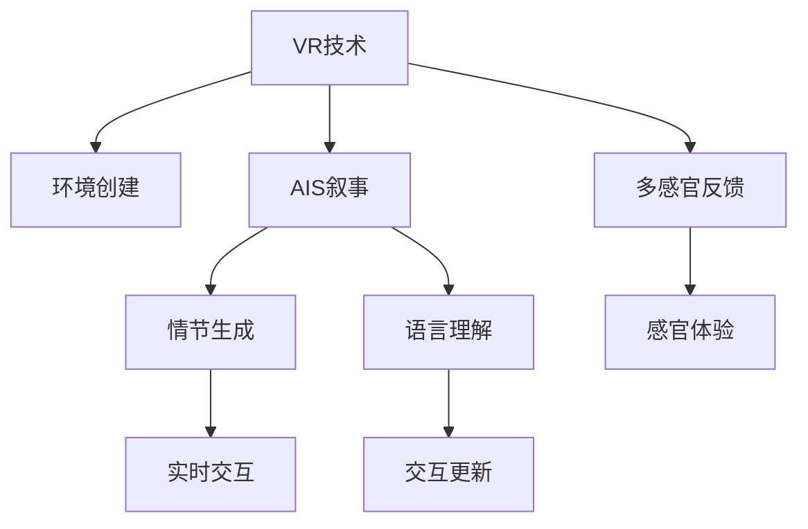
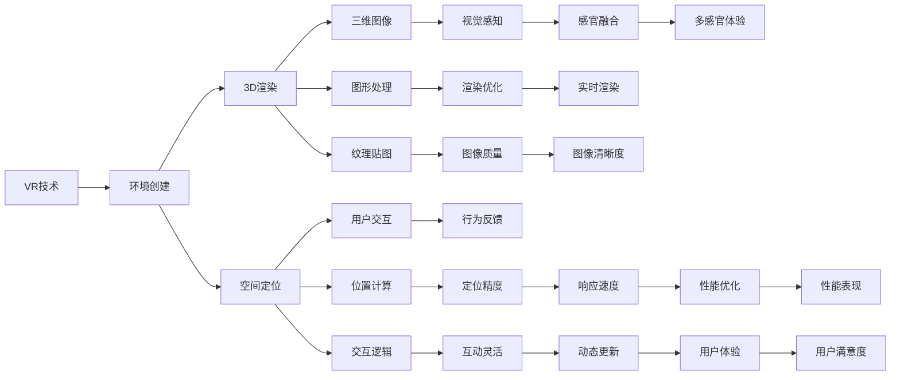

                 

# 虚拟现实与AI叙事：沉浸式故事体验

## 1. 背景介绍

在信息爆炸的时代，人们的注意力被海量内容分散，传统文本、视频等媒体形式难以吸引用户长时间关注。为了提升内容的沉浸感和吸引力，虚拟现实(VR)技术结合人工智能(AI)叙事手段，催生了沉浸式故事体验。

### 1.1 问题由来
沉浸式故事体验（Immersive Storytelling）是一种通过虚拟现实和人工智能手段，模拟真实世界环境，让用户能够身临其境地体验故事的新兴媒介。这种体验形式不仅能够带来视觉、听觉等感官上的冲击，还能利用AI生成个性化的故事情节，从而极大地提升用户的沉浸感和参与感。

传统故事叙述方式单一、乏味，难以满足用户的多样化需求。特别是面对受众个性化的交互方式和叙事风格，传统叙事方式往往显得力不从心。而虚拟现实和人工智能技术，则通过高度拟真和多维度互动，改变了叙事的基本形态，提升了故事的动态性和参与感。

### 1.2 问题核心关键点
沉浸式故事体验的核心在于如何通过VR和AI技术，构建一个高度拟真、多维度互动的故事环境，同时生成个性化的故事情节，引导用户深度参与。主要的技术点包括：
- 虚拟现实技术：创建沉浸式的三维环境，支持多感官反馈。
- 人工智能叙事：利用AI生成个性化的故事情节，实时交互更新。
- 自然语言处理：通过理解用户的语言输入，动态生成故事情节。
- 机器学习：实现用户行为和偏好分析，个性化推荐故事情节。

这些技术点之间的逻辑关系可以通过以下Mermaid流程图来展示：



## 2. 核心概念与联系

### 2.1 核心概念概述

为了更好地理解沉浸式故事体验，本节将介绍几个密切相关的核心概念：

- 虚拟现实（Virtual Reality，VR）：利用计算机技术生成仿真三维环境，通过视觉、听觉等感官刺激，模拟真实世界，使用户能够沉浸在虚拟环境中。
- 人工智能叙事（AI Storytelling）：结合自然语言处理、机器学习等技术，让AI能够生成个性化故事情节，动态更新故事内容，满足用户的多样化需求。
- 自然语言处理（Natural Language Processing，NLP）：通过解析用户的语言输入，提取语义信息，让AI能够理解用户的意图和情感，从而生成更符合用户期望的故事内容。
- 机器学习（Machine Learning，ML）：利用用户行为数据，训练模型预测用户偏好，个性化推荐故事情节，增强用户的沉浸感和体验效果。
- 多感官反馈（Multisensory Feedback）：通过触觉、嗅觉等多种感官的模拟，增强用户体验的真实感和互动性。

这些核心概念之间的逻辑关系可以通过以下Mermaid流程图来展示：


### 2.2 核心概念原理和架构的 Mermaid 流程图


## 3. 核心算法原理 & 具体操作步骤

### 3.1 算法原理概述

沉浸式故事体验的实现，涉及到虚拟现实、人工智能叙事、自然语言处理、机器学习等多个领域的融合。其核心算法原理包括：

- 环境生成算法：通过VR技术，生成高度逼真的三维环境，使用户沉浸在虚拟世界。
- 情节生成算法：结合自然语言处理和机器学习，生成个性化的故事情节，实时更新故事内容。
- 用户交互算法：利用多感官反馈和实时交互，增强用户体验的真实感和互动性。
- 数据分析算法：通过分析用户行为数据，训练机器学习模型，优化故事情节推荐。

### 3.2 算法步骤详解

#### 3.2.1 环境生成
沉浸式故事体验的第一步是创建逼真的三维环境。以下是具体步骤：
1. 收集场景数据：使用传感器和摄像头等设备，收集场景的几何、纹理、光照等数据。
2. 三维建模：将收集到的数据转化为三维模型，并根据需要进行简化和优化。
3. 渲染优化：对三维模型进行渲染优化，提升图像质量和渲染速度。

#### 3.2.2 情节生成
情节生成是沉浸式故事体验的核心。以下是具体步骤：
1. 自然语言处理：使用NLP技术解析用户的语言输入，提取语义信息。
2. 情节生成模型：根据解析出的语义信息，利用AI模型生成个性化的故事情节。
3. 实时更新：根据用户的反馈和行为，动态更新故事情节，增强故事的可互动性和个性化。

#### 3.2.3 用户交互
用户交互是沉浸式故事体验的关键。以下是具体步骤：
1. 多感官反馈：通过触觉、嗅觉等多种感官模拟，增强用户体验的真实感。
2. 实时交互：利用AI模型实时解析用户的行为和反馈，动态更新故事内容。
3. 行为分析：通过机器学习模型分析用户的行为和偏好，个性化推荐故事情节。

### 3.3 算法优缺点

沉浸式故事体验结合了VR和AI技术，具有以下优点：
- 高度沉浸：通过虚拟现实技术，创造高度逼真的三维环境，让用户身临其境。
- 个性化生成：利用AI叙事，生成个性化的故事情节，满足用户多样化需求。
- 动态交互：结合自然语言处理和机器学习，实现实时互动和更新，提升用户体验。

同时，也存在一些缺点：
- 技术门槛高：需要集成多种先进技术，对开发者和硬件要求较高。
- 成本高：初期建设和维护成本较高，需要大量资金投入。
- 易受干扰：用户行为和环境变化可能影响故事体验，需要频繁调整优化。

### 3.4 算法应用领域

沉浸式故事体验技术已经广泛应用于多个领域，例如：
- 教育培训：通过虚拟环境和个性化故事，提升学习效果和参与感。
- 游戏娱乐：创造沉浸式游戏场景，增加用户互动和体验。
- 影视娱乐：制作虚拟现实影片和游戏，提升观影和游戏体验。
- 医疗健康：模拟虚拟手术和康复训练，增强医疗体验和效果。
- 旅游体验：创建虚拟旅游场景，提升旅游体验和安全性。

## 4. 数学模型和公式 & 详细讲解 & 举例说明

### 4.1 数学模型构建

沉浸式故事体验的数学模型包括多个部分，涵盖环境生成、情节生成、用户交互等多个环节。以下是各个环节的数学模型构建：

- 环境生成模型：
  - 三维几何模型：通过点云和多边形表示场景的几何结构。
  - 纹理贴图模型：使用纹理贴图技术，增强场景的真实感。
  - 光照模型：通过光照计算，模拟真实场景的光影效果。

- 情节生成模型：
  - 自然语言处理模型：通过解析用户输入，提取语义信息。
  - 情节生成模型：利用RNN、GAN等模型，生成个性化的故事情节。

- 用户交互模型：
  - 多感官反馈模型：通过传感器模拟多感官反馈，增强用户体验。
  - 实时交互模型：利用AI模型实时解析用户行为和反馈，动态更新故事情节。

### 4.2 公式推导过程

#### 4.2.1 环境生成公式推导
环境生成的核心是三维几何模型的构建和渲染。以下是具体的公式推导：

- 三维几何模型：
  - 点云表示：三维几何模型由点云表示，每个点包含几何坐标和颜色信息。
  - 多边形表示：三维几何模型由多个三角形组成，每个三角形表示一个平面。

- 纹理贴图模型：
  - 纹理映射：将纹理贴图映射到三维模型表面，增强视觉真实感。
  - 纹理采样：从纹理贴图中采样，生成模型的颜色信息。

- 光照模型：
  - 光照计算：通过计算光源与物体的几何关系，计算光照强度和阴影。
  - 阴影效果：通过渲染技术生成逼真的阴影效果。

#### 4.2.2 情节生成公式推导
情节生成是沉浸式故事体验的核心。以下是具体的公式推导：

- 自然语言处理模型：
  - 语言解析：通过解析用户输入，提取语义信息。
  - 语义表示：将语义信息转换为向量表示，输入到情节生成模型。

- 情节生成模型：
  - RNN模型：使用循环神经网络，生成基于上下文的故事情节。
  - GAN模型：使用生成对抗网络，生成个性化的故事情节。

### 4.3 案例分析与讲解

#### 4.3.1 教育培训应用案例
某教育培训机构开发了一套虚拟现实课堂系统，利用沉浸式故事体验提升学生的学习效果和参与感。具体案例分析如下：
- 环境生成：创建虚拟课堂环境，模拟真实课堂场景，增强学生的沉浸感。
- 情节生成：根据学生的行为和反馈，动态更新课堂内容和互动环节，提升学生的参与度。
- 用户交互：通过触觉反馈、多感官模拟等技术，增强学生的体验效果。
- 数据分析：利用机器学习模型分析学生行为和反馈，个性化推荐学习内容，提升学习效果。

## 5. 项目实践：代码实例和详细解释说明

### 5.1 开发环境搭建

在进行沉浸式故事体验的开发之前，需要准备好开发环境。以下是使用Python进行VR开发的环境配置流程：

1. 安装Anaconda：从官网下载并安装Anaconda，用于创建独立的Python环境。
2. 创建并激活虚拟环境：
```bash
conda create -n vrt-env python=3.8 
conda activate vrt-env
```

3. 安装必要的VR库和工具：
```bash
pip install pyopengl numpy pyglet
```

4. 安装VR设备驱动：
```bash
pip install pyvr
```

5. 安装机器学习库：
```bash
pip install scikit-learn pandas numpy
```

完成上述步骤后，即可在`vrt-env`环境中开始VR开发。

### 5.2 源代码详细实现

下面以一个简单的VR场景生成为例，给出使用PyOpenGL和Pyglet库实现三维场景的代码实现。

```python
from pyglet import graphics, gl
from pyglet.window import keyboard
from pyglet import glutils
from pyglet import mouse

# 定义场景顶点和颜色
vertices = (
    0, 0, -5,  # 左下角顶点
    0, 0, 5,   # 右上角顶点
    0, 10, -5, # 左下角顶点
    0, 10, 5,  # 右上角顶点
    10, 0, -5, # 左下角顶点
    10, 0, 5   # 右上角顶点
    10, 10, -5 # 左下角顶点
    10, 10, 5  # 右上角顶点
)

colors = (
    1, 0, 0,  # 左下角顶点颜色
    0, 1, 0,  # 右上角顶点颜色
    0, 0, 1,  # 左下角顶点颜色
    1, 1, 0,  # 右上角顶点颜色
    0, 1, 1,  # 左下角顶点颜色
    1, 0, 1   # 右上角顶点颜色
)

# 创建渲染窗口
window = pyglet.window.Window(800, 600)

# 渲染函数
def render():
    gl.clear(gl.COLOR_BUFFER_BIT | gl.DEPTH_BUFFER_BIT)

    # 绘制场景
    glBegin(gl.TRIANGLE_STRIP)
    for i in range(0, len(vertices), 3):
        glColor3fv(colors[i / 3])
        glVertex3fv(vertices[i:i+3])
    glEnd()

    # 更新窗口
    window.dispatch_events()
    window.flip()

# 事件处理
@window.event
def on_resize(x, y):
    glViewport(0, 0, x, y)

@window.event
def on_key_press(symbol, modifiers):
    if symbol == keyboard.ESCAPE:
        window.close()

# 运行循环
pyglet.clock.schedule_interval(render, 1/60)
pyglet.main()
```

### 5.3 代码解读与分析

让我们再详细解读一下关键代码的实现细节：

- 顶点和颜色数组：定义了场景的顶点坐标和颜色信息，用于绘制三维场景。
- 渲染窗口：创建了一个800x600的窗口，用于渲染三维场景。
- 渲染函数：定义了渲染函数，在窗口中绘制场景。
- 事件处理：处理窗口的resize和key_press事件，响应用户操作。
- 循环调用：使用pyglet库的clock和main函数，循环调用渲染函数。

通过上述代码实现，我们创建了一个简单的VR场景，展示了如何利用OpenGL和Pyglet库进行三维场景的渲染。开发者可以根据实际需求，在此基础上扩展场景内容和交互逻辑。

## 6. 实际应用场景

### 6.1 教育培训

沉浸式故事体验在教育培训领域有广泛应用。传统的教育培训方式往往枯燥乏味，难以吸引学生的注意力。通过沉浸式故事体验，可以创建互动性强的虚拟课堂，提升学生的学习效果和参与感。

具体实现方式如下：
- 创建虚拟课堂环境，模拟真实课堂场景。
- 根据学生的行为和反馈，动态更新课堂内容和互动环节。
- 通过触觉反馈和多感官模拟，增强学生的体验效果。
- 利用机器学习模型分析学生行为和反馈，个性化推荐学习内容，提升学习效果。

### 6.2 游戏娱乐

沉浸式故事体验在游戏娱乐领域有广阔的应用前景。通过创建虚拟游戏场景，可以提升游戏的互动性和体验效果。

具体实现方式如下：
- 创建虚拟游戏场景，模拟真实游戏环境。
- 根据玩家的行为和反馈，动态更新游戏情节和内容。
- 通过触觉反馈和多感官模拟，增强游戏体验。
- 利用机器学习模型分析玩家行为和偏好，个性化推荐游戏内容。

### 6.3 影视娱乐

沉浸式故事体验在影视娱乐领域也有广泛应用。通过创建虚拟现实影片和游戏，可以提升观影和游戏体验。

具体实现方式如下：
- 创建虚拟影视场景，模拟真实影视环境。
- 根据观众的行为和反馈，动态更新影片情节和内容。
- 通过触觉反馈和多感官模拟，增强观影体验。
- 利用机器学习模型分析观众行为和偏好，个性化推荐影片内容。

## 7. 工具和资源推荐

### 7.1 学习资源推荐

为了帮助开发者系统掌握沉浸式故事体验的理论基础和实践技巧，这里推荐一些优质的学习资源：

1. 《VR技术基础与实践》系列博文：由VR技术专家撰写，深入浅出地介绍了VR技术的原理、应用和开发技巧。
2. 《自然语言处理与深度学习》课程：斯坦福大学开设的NLP明星课程，涵盖自然语言处理和深度学习的基本概念和经典模型。
3. 《深度学习与机器学习》书籍：综合介绍深度学习和机器学习的基础知识，适合初学者和进阶者。
4. 《虚拟现实与增强现实技术》书籍：全面介绍VR和AR技术的基本原理和开发技巧，适合开发者学习。
5. 《沉浸式故事体验开发指南》：综合介绍沉浸式故事体验的开发技巧和实践经验，适合VR和AI开发人员学习。

通过对这些资源的学习实践，相信你一定能够快速掌握沉浸式故事体验的精髓，并用于解决实际的VR和AI问题。

### 7.2 开发工具推荐

高效的开发离不开优秀的工具支持。以下是几款用于沉浸式故事体验开发的常用工具：

1. PyOpenGL和Pyglet：用于三维场景的渲染和交互，适合Python开发。
2. Unity和Unreal Engine：流行的游戏引擎，支持VR和AR开发，具有强大的渲染和交互功能。
3. Blender：开源的三维建模软件，适合创建高质量的三维场景和角色。
4. TensorFlow和PyTorch：流行的深度学习框架，支持自然语言处理和机器学习模型开发。
5. Weights & Biases：模型训练的实验跟踪工具，可以记录和可视化模型训练过程中的各项指标，方便对比和调优。
6. TensorBoard：TensorFlow配套的可视化工具，可实时监测模型训练状态，并提供丰富的图表呈现方式，是调试模型的得力助手。

合理利用这些工具，可以显著提升沉浸式故事体验的开发效率，加快创新迭代的步伐。

### 7.3 相关论文推荐

沉浸式故事体验的发展源于学界的持续研究。以下是几篇奠基性的相关论文，推荐阅读：

1. 《虚拟现实技术的发展与趋势》：总结了虚拟现实技术的最新进展和未来发展方向。
2. 《人工智能叙事的新方向》：探讨了AI叙事在虚拟现实中的新应用场景。
3. 《自然语言处理与深度学习的结合》：讨论了自然语言处理和深度学习在叙事中的应用。
4. 《多感官反馈在虚拟现实中的作用》：分析了多感官反馈在虚拟现实中的重要性和实现方法。
5. 《机器学习在沉浸式故事体验中的应用》：介绍了机器学习在个性化推荐和情节生成中的应用。

这些论文代表了大语言模型微调技术的发展脉络。通过学习这些前沿成果，可以帮助研究者把握学科前进方向，激发更多的创新灵感。

## 8. 总结：未来发展趋势与挑战

### 8.1 总结

本文对沉浸式故事体验的实现原理、关键技术和具体应用进行了全面系统的介绍。首先阐述了沉浸式故事体验的背景和意义，明确了其在大规模游戏娱乐、教育培训、影视娱乐等多个领域的应用前景。其次，从原理到实践，详细讲解了沉浸式故事体验的数学模型和关键算法，给出了VR开发和AI叙事的代码实例。同时，本文还广泛探讨了沉浸式故事体验的未来发展趋势和面临的挑战。

通过本文的系统梳理，可以看到，沉浸式故事体验作为新兴媒介，通过VR和AI技术的融合，正在改变人们的信息消费方式，拓展了故事叙事的边界。未来，伴随技术的持续演进，沉浸式故事体验必将在更多领域得到应用，为人类认知智能的进化带来深远影响。

### 8.2 未来发展趋势

展望未来，沉浸式故事体验技术将呈现以下几个发展趋势：

1. 技术融合加速：未来沉浸式故事体验将更加融合VR、AR、AI等技术，创造出更加真实、互动、个性化的故事体验。
2. 多感官融合增强：通过触觉、嗅觉、味觉等多种感官的模拟，增强用户的沉浸感和体验效果。
3. 动态情节生成：利用AI生成算法，实时生成个性化的故事情节，增强用户参与感和互动性。
4. 个性化推荐系统：结合机器学习模型，个性化推荐故事情节，满足用户多样化需求。
5. 虚拟社交平台：通过沉浸式故事体验，创建虚拟社交平台，增强用户之间的互动和连接。

以上趋势凸显了沉浸式故事体验技术的广阔前景。这些方向的探索发展，必将进一步提升用户体验和故事叙事的动态性，为未来故事创作和传播带来新的可能性。

### 8.3 面临的挑战

尽管沉浸式故事体验技术已经取得了瞩目成就，但在迈向更加智能化、普适化应用的过程中，它仍面临着诸多挑战：

1. 技术门槛高：沉浸式故事体验需要集成多种先进技术，对开发者和硬件要求较高。
2. 成本高：初期建设和维护成本较高，需要大量资金投入。
3. 易受干扰：用户行为和环境变化可能影响故事体验，需要频繁调整优化。
4. 设备兼容性：不同设备之间的兼容性问题，可能影响用户的体验效果。
5. 数据隐私：用户在虚拟环境中的行为数据可能涉及隐私问题，需要采取有效保护措施。

### 8.4 研究展望

面对沉浸式故事体验面临的种种挑战，未来的研究需要在以下几个方面寻求新的突破：

1. 降低技术门槛：开发更加易用、通用的开发工具和框架，降低开发难度和成本。
2. 优化性能：通过算法优化和资源管理，提升渲染速度和交互效率，降低设备需求。
3. 增强互动性：通过多感官反馈和动态情节生成，增强用户的互动性和参与感。
4. 保护隐私：采用隐私保护技术和机制，确保用户数据的安全性和隐私性。
5. 提升可访问性：通过技术手段降低使用门槛，让更多人能够享受沉浸式故事体验。

这些研究方向的探索，必将引领沉浸式故事体验技术迈向更高的台阶，为人类认知智能的进化带来新的突破。相信随着学界和产业界的共同努力，这些挑战终将一一被克服，沉浸式故事体验必将在构建人机协同的智能时代中扮演越来越重要的角色。

## 9. 附录：常见问题与解答

**Q1：沉浸式故事体验与传统媒体相比，有哪些优势？**

A: 沉浸式故事体验相比传统媒体，具有以下优势：
1. 高度沉浸：通过虚拟现实技术，创造高度逼真的三维环境，让用户身临其境。
2. 动态互动：结合自然语言处理和机器学习，实现实时互动和更新，提升用户体验。
3. 个性化生成：利用AI叙事，生成个性化的故事情节，满足用户多样化需求。
4. 多媒体融合：通过视觉、听觉、触觉等多种感官的模拟，增强用户体验的真实感和互动性。

**Q2：沉浸式故事体验的开发过程中，如何保证用户体验的真实感？**

A: 保证用户体验的真实感是沉浸式故事体验的关键。以下是一些具体方法：
1. 高精度建模：通过高精度的三维建模，模拟真实场景的几何结构和纹理。
2. 逼真渲染：使用高效的渲染算法，生成逼真的光照和阴影效果。
3. 多感官反馈：通过触觉反馈、嗅觉模拟等多种感官模拟，增强用户体验的真实感。
4. 实时交互：利用AI模型实时解析用户行为和反馈，动态更新故事情节，增强互动性。
5. 优化算法：通过算法优化和资源管理，提升渲染速度和交互效率，减少卡顿和延迟。

**Q3：沉浸式故事体验的开发过程中，如何提高故事情节的个性化程度？**

A: 提高故事情节的个性化程度，是沉浸式故事体验的重要目标。以下是一些具体方法：
1. 自然语言处理：利用NLP技术解析用户输入，提取语义信息，指导情节生成。
2. 个性化生成模型：使用基于生成对抗网络(GAN)、循环神经网络(RNN)等模型，生成个性化的故事情节。
3. 实时更新：结合用户行为和反馈，动态更新故事情节，增强用户体验。
4. 个性化推荐：利用机器学习模型，分析用户行为和偏好，个性化推荐故事情节，提升参与度。
5. 多场景设计：设计多种故事情节，供用户选择，增强用户的主动性和参与感。

**Q4：沉浸式故事体验在教育培训中的应用，有哪些典型案例？**

A: 沉浸式故事体验在教育培训领域有广泛应用，以下是一些典型案例：
1. 虚拟教室：创建虚拟教室环境，模拟真实课堂场景，提升学生的沉浸感和学习效果。
2. 互动游戏：开发互动游戏，通过沉浸式故事体验提升学生的参与感和学习兴趣。
3. 模拟实验：创建虚拟实验环境，增强学生的实验体验和理解深度。
4. 个性化学习：结合机器学习模型，个性化推荐学习内容，提升学习效果。
5. 虚拟实习：创建虚拟实习环境，增强学生的实践体验和职业技能。

**Q5：沉浸式故事体验在影视娱乐中的应用，有哪些典型案例？**

A: 沉浸式故事体验在影视娱乐领域有广泛应用，以下是一些典型案例：
1. 虚拟电影：创建虚拟电影环境，提升观影体验和互动性。
2. 互动剧情：开发互动剧情，通过沉浸式故事体验增强观影者的参与感和体验效果。
3. 虚拟角色：创建虚拟角色，增强故事叙述的生动性和真实感。
4. 个性化推荐：结合机器学习模型，个性化推荐影片内容，提升用户满意度。
5. 多平台传播：通过VR、AR等技术，多平台传播影视内容，增强用户互动和体验。

作者：禅与计算机程序设计艺术 / Zen and the Art of Computer Programming

