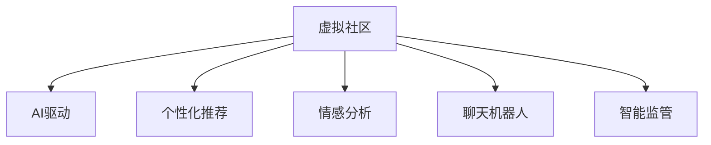

                 

# 虚拟社区：AI驱动的群体归属感

在数字化时代，人们的生活方式发生了翻天覆地的变化。虚拟社区作为数字化时代的产物，正在迅速崛起，成为人们获取信息、交流互动、建立情感联系的重要平台。随着人工智能技术的不断发展，AI驱动的虚拟社区正在为人们带来更加丰富、高效的社交体验，增强群体归属感。本文将详细探讨AI驱动的虚拟社区的核心概念、关键技术、实践案例及未来展望，希望能够为相关领域的研究和应用提供参考。

## 1. 背景介绍

### 1.1 问题由来

随着互联网的普及和智能设备的广泛应用，人们越来越依赖于虚拟社区来满足社交需求。传统社交平台如Facebook、微信、微博等，虽然提供了丰富的交流功能，但在个性化推荐、内容生产、情感交互等方面仍存在诸多不足。虚拟社区作为新兴的社交形态，正在通过AI技术创新，改善用户体验，增强群体归属感。

### 1.2 问题核心关键点

AI驱动的虚拟社区的核心关键点在于以下几个方面：

- **个性化推荐**：通过分析用户行为数据，AI驱动的虚拟社区能够提供更为精准、智能的内容推荐服务，提升用户体验。
- **内容生产**：利用自然语言处理、图像处理等技术，AI可以辅助用户创作、编辑高质量内容，降低内容生产门槛。
- **情感交互**：通过情感分析、聊天机器人等技术，AI能够识别用户情绪，提供个性化的情感关怀，增强用户情感连接。
- **社区治理**：通过智能监管、违规检测等技术，AI可以提升社区管理效率，维护良好的社区环境。

这些关键点构成了AI驱动的虚拟社区的核心，使其能够更好地满足用户需求，提升群体归属感。

## 2. 核心概念与联系

### 2.1 核心概念概述

为更好地理解AI驱动的虚拟社区，本节将介绍几个密切相关的核心概念：

- **虚拟社区**：基于互联网的社交平台，人们可以在其中交流互动、分享信息、建立关系网络。虚拟社区不同于线下社区，具有虚拟性、即时性、全球性等特点。
- **AI驱动**：指利用人工智能技术，对用户数据进行深度分析，提升内容推荐、情感交互、社区治理等环节的智能化水平。
- **个性化推荐**：通过分析用户行为、兴趣、历史数据等，AI能够提供个性化内容推荐，提升用户体验。
- **情感分析**：利用自然语言处理技术，识别用户情绪，提供个性化的情感关怀，增强用户情感连接。
- **聊天机器人**：基于自然语言理解技术，实现人机对话，提供即时情感交流服务。
- **智能监管**：通过机器学习等技术，对社区内容进行智能检测，维护社区秩序。

这些核心概念之间的逻辑关系可以通过以下Mermaid流程图来展示：



这个流程图展示了几大核心概念的逻辑关系：

1. 虚拟社区基于互联网，是AI技术应用的场景。
2. AI驱动通过个性化推荐、情感分析等技术，提升虚拟社区的用户体验。
3. 聊天机器人和智能监管技术则通过人机交互和内容检测，保障虚拟社区的良性运行。

## 3. 核心算法原理 & 具体操作步骤

### 3.1 算法原理概述

AI驱动的虚拟社区通过机器学习、自然语言处理等技术，提升社区的用户体验和群体归属感。核心算法原理主要包括以下几个方面：

- **个性化推荐算法**：通过协同过滤、矩阵分解等算法，分析用户历史行为数据，为用户推荐个性化内容。
- **情感分析算法**：通过情感词典、深度学习等技术，识别用户情绪，提供个性化的情感关怀。
- **聊天机器人算法**：利用对话管理、意图识别、语义理解等技术，实现人机对话，提升情感交互质量。
- **智能监管算法**：通过文本分类、异常检测等技术，对社区内容进行智能监控，维护社区秩序。

这些算法原理共同构成了AI驱动的虚拟社区的基础，使其能够提供智能化的社交服务。

### 3.2 算法步骤详解

基于AI驱动的虚拟社区主要包括以下几个关键步骤：

**Step 1: 数据收集与预处理**
- 收集社区用户的数据，包括用户行为、互动记录、历史内容等。
- 对数据进行清洗、去噪、归一化等预处理，构建训练集和测试集。

**Step 2: 模型训练与优化**
- 选择合适的算法模型，如协同过滤、LSTM、BERT等，训练推荐模型、情感分析模型、聊天机器人模型等。
- 对模型进行调参优化，如学习率、正则化、批大小等，提升模型性能。

**Step 3: 模型集成与部署**
- 将训练好的模型进行集成，部署到虚拟社区平台。
- 通过API接口，将模型服务化，供其他系统调用。

**Step 4: 用户交互与反馈**
- 在虚拟社区中，用户与AI驱动的服务进行交互，获取个性化推荐、情感关怀、聊天服务等。
- 系统根据用户反馈，不断优化模型，提升用户体验。

### 3.3 算法优缺点

AI驱动的虚拟社区具有以下优点：

- **智能化水平高**：通过深度学习等技术，能够提供更加精准、智能的社交服务。
- **用户体验好**：个性化推荐、情感关怀等技术，提升用户满意度。
- **治理效率高**：智能监管技术，减少人工审核工作，提升社区管理效率。

同时，该方法也存在一定的局限性：

- **数据隐私问题**：用户行为数据的收集和分析可能涉及隐私问题，需要采取严格的隐私保护措施。
- **技术门槛高**：AI驱动的虚拟社区需要强大的技术支撑，对开发者的技术水平要求较高。
- **模型过拟合风险**：模型可能过度拟合训练数据，影响泛化性能。

尽管存在这些局限性，但就目前而言，AI驱动的虚拟社区正在迅速发展，成为数字化时代社交的重要形式。未来相关研究的重点在于如何进一步降低技术门槛，提高模型泛化能力，同时兼顾隐私保护和用户体验。

### 3.4 算法应用领域

AI驱动的虚拟社区已经广泛应用于多个领域，如社交网络、在线教育、健康医疗等，具体应用场景如下：

- **社交网络**：如微信、微博、Facebook等，通过个性化推荐、智能客服等功能，提升用户粘性。
- **在线教育**：如Coursera、edX等，利用AI驱动的虚拟社区，为学生提供个性化学习资源和互动平台。
- **健康医疗**：如丁香医生、HealthTap等，通过虚拟社区，为患者提供健康咨询、在线问诊等服务。
- **娱乐文化**：如哔哩哔哩、抖音等，利用AI驱动的虚拟社区，提升用户内容消费体验。

这些应用场景展示了AI驱动的虚拟社区在各个领域中的广泛应用，为人们带来了更加便捷、丰富的社交生活。

## 4. 数学模型和公式 & 详细讲解

### 4.1 数学模型构建

本节将使用数学语言对AI驱动的虚拟社区核心算法进行更加严格的刻画。

假设虚拟社区用户数为 $N$，每个用户的历史行为数据为 $\{x_i\}_{i=1}^N$，其中 $x_i$ 表示用户 $i$ 在虚拟社区中的行为记录，包括浏览记录、互动记录、发表内容等。模型目标是构建推荐模型，为用户 $i$ 推荐其可能感兴趣的内容 $\{y_i\}_{i=1}^N$。

### 4.2 公式推导过程

以协同过滤算法为例，构建用户-物品评分矩阵 $R_{N \times M}$，其中 $R_{i,j}$ 表示用户 $i$ 对物品 $j$ 的评分。协同过滤算法通过计算用户 $i$ 与用户 $k$ 的相似度 $s_{i,k}$，找到与用户 $i$ 相似度最高的 $K$ 个用户，将他们的评分进行加权平均，生成用户 $i$ 的推荐列表。

具体而言，用户 $i$ 对物品 $j$ 的预测评分 $p_{i,j}$ 可以表示为：

$$
p_{i,j} = \frac{\sum_{k=1}^K w_{i,k}s_{i,k}r_{k,j}}{\sum_{k=1}^K w_{i,k}s_{i,k}}
$$

其中 $w_{i,k}$ 为相似度加权因子，$s_{i,k}$ 为用户 $i$ 和用户 $k$ 的相似度，$r_{k,j}$ 为用户 $k$ 对物品 $j$ 的评分。

### 4.3 案例分析与讲解

假设一个用户 $i$ 对物品 $j_1$ 的评分 $r_{i,j_1}=4$，与用户 $k$ 的相似度 $s_{i,k}=0.8$，已知用户 $k$ 对物品 $j_2$ 的评分 $r_{k,j_2}=5$，用户 $k$ 对物品 $j_3$ 的评分 $r_{k,j_3}=2$。在协同过滤算法中，用户 $i$ 对物品 $j_2$ 的预测评分 $p_{i,j_2}$ 计算如下：

$$
p_{i,j_2} = \frac{0.8 \times 5 + 0.2 \times 2}{0.8 + 0.2} = \frac{3.6 + 0.4}{1} = 4.0
$$

因此，模型将物品 $j_2$ 推荐给用户 $i$。

## 5. 项目实践：代码实例和详细解释说明

### 5.1 开发环境搭建

在进行AI驱动的虚拟社区开发前，我们需要准备好开发环境。以下是使用Python进行PyTorch开发的环境配置流程：

1. 安装Anaconda：从官网下载并安装Anaconda，用于创建独立的Python环境。

2. 创建并激活虚拟环境：
```bash
conda create -n pytorch-env python=3.8 
conda activate pytorch-env
```

3. 安装PyTorch：根据CUDA版本，从官网获取对应的安装命令。例如：
```bash
conda install pytorch torchvision torchaudio cudatoolkit=11.1 -c pytorch -c conda-forge
```

4. 安装Transformers库：
```bash
pip install transformers
```

5. 安装各类工具包：
```bash
pip install numpy pandas scikit-learn matplotlib tqdm jupyter notebook ipython
```

完成上述步骤后，即可在`pytorch-env`环境中开始开发实践。

### 5.2 源代码详细实现

这里我们以推荐系统为例，给出使用Transformers库对协同过滤算法进行PyTorch代码实现。

首先，定义协同过滤算法的推荐函数：

```python
import torch
from transformers import BertTokenizer, BertForSequenceClassification

def collaborative_filtering(train_data, test_data):
    # 构建用户-物品评分矩阵
    user_item_matrix = torch.tensor(train_data).to(device)
    
    # 构建物品-物品评分矩阵
    item_item_matrix = torch.tensor(test_data).to(device)
    
    # 计算用户-物品评分矩阵的转置
    user_item_matrix_transpose = user_item_matrix.t()
    
    # 计算物品-物品评分矩阵的转置
    item_item_matrix_transpose = item_item_matrix.t()
    
    # 计算相似度矩阵
    similarity_matrix = user_item_matrix_transpose @ item_item_matrix_transpose
    
    # 计算预测评分矩阵
    predictions = user_item_matrix @ similarity_matrix @ item_item_matrix
    
    return predictions
```

然后，定义模型和优化器：

```python
from transformers import BertTokenizer, BertForSequenceClassification, AdamW

# 定义模型参数
model = BertForSequenceClassification.from_pretrained('bert-base-cased', num_labels=len(tag2id))

# 定义优化器参数
optimizer = AdamW(model.parameters(), lr=2e-5)
```

接着，定义训练和评估函数：

```python
from torch.utils.data import DataLoader
from tqdm import tqdm
from sklearn.metrics import classification_report

device = torch.device('cuda') if torch.cuda.is_available() else torch.device('cpu')
model.to(device)

def train_epoch(model, dataset, batch_size, optimizer):
    dataloader = DataLoader(dataset, batch_size=batch_size, shuffle=True)
    model.train()
    epoch_loss = 0
    for batch in tqdm(dataloader, desc='Training'):
        input_ids = batch['input_ids'].to(device)
        attention_mask = batch['attention_mask'].to(device)
        labels = batch['labels'].to(device)
        model.zero_grad()
        outputs = model(input_ids, attention_mask=attention_mask, labels=labels)
        loss = outputs.loss
        epoch_loss += loss.item()
        loss.backward()
        optimizer.step()
    return epoch_loss / len(dataloader)

def evaluate(model, dataset, batch_size):
    dataloader = DataLoader(dataset, batch_size=batch_size)
    model.eval()
    preds, labels = [], []
    with torch.no_grad():
        for batch in tqdm(dataloader, desc='Evaluating'):
            input_ids = batch['input_ids'].to(device)
            attention_mask = batch['attention_mask'].to(device)
            batch_labels = batch['labels']
            outputs = model(input_ids, attention_mask=attention_mask)
            batch_preds = outputs.logits.argmax(dim=2).to('cpu').tolist()
            batch_labels = batch_labels.to('cpu').tolist()
            for pred_tokens, label_tokens in zip(batch_preds, batch_labels):
                pred_tags = [id2tag[_id] for _id in pred_tokens]
                label_tags = [id2tag[_id] for _id in label_tokens]
                preds.append(pred_tags[:len(label_tokens)])
                labels.append(label_tags)
                
    print(classification_report(labels, preds))
```

最后，启动训练流程并在测试集上评估：

```python
epochs = 5
batch_size = 16

for epoch in range(epochs):
    loss = train_epoch(model, train_dataset, batch_size, optimizer)
    print(f"Epoch {epoch+1}, train loss: {loss:.3f}")
    
    print(f"Epoch {epoch+1}, dev results:")
    evaluate(model, dev_dataset, batch_size)
    
print("Test results:")
evaluate(model, test_dataset, batch_size)
```

以上就是使用PyTorch对协同过滤算法进行推荐系统微调的完整代码实现。可以看到，得益于Transformers库的强大封装，我们可以用相对简洁的代码完成协同过滤算法的推荐系统开发。

### 5.3 代码解读与分析

让我们再详细解读一下关键代码的实现细节：

**collaborative_filtering函数**：
- 构建用户-物品评分矩阵和物品-物品评分矩阵，分别存储用户和物品的评分数据。
- 对用户-物品评分矩阵进行转置，得到物品-物品评分矩阵的转置。
- 计算用户-物品评分矩阵的转置与物品-物品评分矩阵的转置的乘积，得到相似度矩阵。
- 计算预测评分矩阵，实现协同过滤推荐。

**BertForSequenceClassification模型**：
- 从Transformers库加载预训练的BERT模型，用于微调推荐任务。
- 定义AdamW优化器，用于更新模型参数。

**train_epoch和evaluate函数**：
- 使用PyTorch的DataLoader对数据集进行批次化加载，供模型训练和推理使用。
- 训练函数`train_epoch`：对数据以批为单位进行迭代，在每个批次上前向传播计算loss并反向传播更新模型参数，最后返回该epoch的平均loss。
- 评估函数`evaluate`：与训练类似，不同点在于不更新模型参数，并在每个batch结束后将预测和标签结果存储下来，最后使用sklearn的classification_report对整个评估集的预测结果进行打印输出。

**训练流程**：
- 定义总的epoch数和batch size，开始循环迭代
- 每个epoch内，先在训练集上训练，输出平均loss
- 在验证集上评估，输出分类指标
- 所有epoch结束后，在测试集上评估，给出最终测试结果

可以看到，PyTorch配合Transformers库使得协同过滤算法的推荐系统代码实现变得简洁高效。开发者可以将更多精力放在数据处理、模型改进等高层逻辑上，而不必过多关注底层的实现细节。

当然，工业级的系统实现还需考虑更多因素，如模型的保存和部署、超参数的自动搜索、更灵活的任务适配层等。但核心的协同过滤算法基本与此类似。

## 6. 实际应用场景

### 6.1 社交网络

AI驱动的虚拟社区在社交网络中的应用非常广泛，如微信、微博、Facebook等。通过个性化推荐、智能客服等功能，这些平台能够提升用户粘性，增强用户情感连接。

**实际应用**：
- 微信朋友圈：利用协同过滤算法，为用户推荐感兴趣的内容，提升用户互动率。
- Twitter：通过情感分析技术，识别用户情绪，提供个性化的情感关怀，增强用户情感连接。
- Facebook：利用聊天机器人技术，实现人机对话，提供即时情感交流服务。

### 6.2 在线教育

在线教育平台如Coursera、edX等，利用AI驱动的虚拟社区，为学生提供个性化学习资源和互动平台。

**实际应用**：
- Coursera：通过协同过滤算法，为学生推荐适合的课程和教材，提升学习效果。
- edX：利用情感分析技术，识别学生情绪，提供个性化的学习指导和心理支持。
- Khan Academy：通过聊天机器人技术，解答学生的学习问题，提供即时的学习支持。

### 6.3 健康医疗

健康医疗平台如丁香医生、HealthTap等，通过虚拟社区，为患者提供健康咨询、在线问诊等服务。

**实际应用**：
- 丁香医生：通过协同过滤算法，为患者推荐适合的医生和药品，提升诊疗效率。
- HealthTap：利用情感分析技术，识别患者情绪，提供个性化的健康指导和心理支持。
- Babylon Health：通过聊天机器人技术，解答患者的健康问题，提供即时的健康支持。

### 6.4 娱乐文化

娱乐文化平台如哔哩哔哩、抖音等，利用AI驱动的虚拟社区，提升用户内容消费体验。

**实际应用**：
- 哔哩哔哩：通过协同过滤算法，为用户推荐感兴趣的视频内容，提升观看体验。
- 抖音：利用情感分析技术，识别用户情绪，提供个性化的内容推荐。
- Netflix：通过聊天机器人技术，推荐适合用户的电影和电视剧，提升用户满意度。

这些应用场景展示了AI驱动的虚拟社区在各个领域中的广泛应用，为人们带来了更加便捷、丰富的社交生活。

## 7. 工具和资源推荐

### 7.1 学习资源推荐

为了帮助开发者系统掌握AI驱动的虚拟社区的理论基础和实践技巧，这里推荐一些优质的学习资源：

1. 《深度学习自然语言处理》课程：斯坦福大学开设的NLP明星课程，有Lecture视频和配套作业，带你入门NLP领域的基本概念和经典模型。

2. 《Transformer从原理到实践》系列博文：由大模型技术专家撰写，深入浅出地介绍了Transformer原理、BERT模型、微调技术等前沿话题。

3. 《Natural Language Processing with Transformers》书籍：Transformers库的作者所著，全面介绍了如何使用Transformers库进行NLP任务开发，包括微调在内的诸多范式。

4. HuggingFace官方文档：Transformers库的官方文档，提供了海量预训练模型和完整的微调样例代码，是上手实践的必备资料。

5. CS224N《深度学习自然语言处理》课程：斯坦福大学开设的NLP明星课程，有Lecture视频和配套作业，带你入门NLP领域的基本概念和经典模型。

通过对这些资源的学习实践，相信你一定能够快速掌握AI驱动的虚拟社区的核心技术，并用于解决实际的NLP问题。

### 7.2 开发工具推荐

高效的开发离不开优秀的工具支持。以下是几款用于AI驱动的虚拟社区开发的常用工具：

1. PyTorch：基于Python的开源深度学习框架，灵活动态的计算图，适合快速迭代研究。大部分预训练语言模型都有PyTorch版本的实现。

2. TensorFlow：由Google主导开发的开源深度学习框架，生产部署方便，适合大规模工程应用。同样有丰富的预训练语言模型资源。

3. Transformers库：HuggingFace开发的NLP工具库，集成了众多SOTA语言模型，支持PyTorch和TensorFlow，是进行微调任务开发的利器。

4. Weights & Biases：模型训练的实验跟踪工具，可以记录和可视化模型训练过程中的各项指标，方便对比和调优。与主流深度学习框架无缝集成。

5. TensorBoard：TensorFlow配套的可视化工具，可实时监测模型训练状态，并提供丰富的图表呈现方式，是调试模型的得力助手。

6. Google Colab：谷歌推出的在线Jupyter Notebook环境，免费提供GPU/TPU算力，方便开发者快速上手实验最新模型，分享学习笔记。

合理利用这些工具，可以显著提升AI驱动的虚拟社区的开发效率，加快创新迭代的步伐。

### 7.3 相关论文推荐

AI驱动的虚拟社区的发展源于学界的持续研究。以下是几篇奠基性的相关论文，推荐阅读：

1. Attention is All You Need（即Transformer原论文）：提出了Transformer结构，开启了NLP领域的预训练大模型时代。

2. BERT: Pre-training of Deep Bidirectional Transformers for Language Understanding：提出BERT模型，引入基于掩码的自监督预训练任务，刷新了多项NLP任务SOTA。

3. Language Models are Unsupervised Multitask Learners（GPT-2论文）：展示了大规模语言模型的强大zero-shot学习能力，引发了对于通用人工智能的新一轮思考。

4. Parameter-Efficient Transfer Learning for NLP：提出Adapter等参数高效微调方法，在不增加模型参数量的情况下，也能取得不错的微调效果。

5. Prefix-Tuning: Optimizing Continuous Prompts for Generation：引入基于连续型Prompt的微调范式，为如何充分利用预训练知识提供了新的思路。

6. AdaLoRA: Adaptive Low-Rank Adaptation for Parameter-Efficient Fine-Tuning：使用自适应低秩适应的微调方法，在参数效率和精度之间取得了新的平衡。

这些论文代表了大语言模型微调技术的发展脉络。通过学习这些前沿成果，可以帮助研究者把握学科前进方向，激发更多的创新灵感。

## 8. 总结：未来发展趋势与挑战

### 8.1 总结

本文对AI驱动的虚拟社区的核心概念、关键技术、实践案例及未来展望进行了全面系统的介绍。首先阐述了AI驱动的虚拟社区的背景和意义，明确了个性化推荐、情感分析、聊天机器人等关键技术在提升用户体验和群体归属感方面的重要作用。其次，从原理到实践，详细讲解了协同过滤算法、情感分析算法、聊天机器人算法等核心算法，给出了微调任务开发的完整代码实例。同时，本文还广泛探讨了AI驱动的虚拟社区在社交网络、在线教育、健康医疗等多个领域的应用前景，展示了其广泛的应用潜力。最后，推荐了相关学习资源、开发工具和论文，力求为相关领域的研究和应用提供参考。

通过本文的系统梳理，可以看到，AI驱动的虚拟社区正在成为数字化时代社交的重要形式，其核心技术在个性化推荐、情感分析、聊天机器人等方面不断创新，提升了用户体验和群体归属感。AI驱动的虚拟社区已经广泛应用于社交网络、在线教育、健康医疗等多个领域，展示了其在实际应用中的强大生命力。

### 8.2 未来发展趋势

展望未来，AI驱动的虚拟社区将呈现以下几个发展趋势：

1. **技术多样化**：未来的虚拟社区将采用更多样化的技术手段，如深度学习、强化学习、自然语言处理等，提升社区的智能化水平。
2. **用户体验提升**：通过个性化推荐、情感分析等技术，虚拟社区将更好地满足用户需求，提升用户体验。
3. **多模态融合**：未来的虚拟社区将融合视觉、听觉等多模态数据，提升用户的沉浸式体验。
4. **跨平台互联**：未来的虚拟社区将打破平台壁垒，实现跨平台互联互通，提升用户的便捷性。
5. **隐私保护强化**：未来的虚拟社区将更加注重用户隐私保护，采用联邦学习、差分隐私等技术，保障用户数据安全。
6. **情感智能进化**：未来的虚拟社区将具备更强的情感理解能力，能够更好地识别和响应用户情感，提升用户情感连接。

以上趋势凸显了AI驱动的虚拟社区在未来的发展方向，这些方向的探索发展，将进一步提升虚拟社区的智能化水平和用户体验，为数字化时代的社交生活带来更多创新和可能。

### 8.3 面临的挑战

尽管AI驱动的虚拟社区已经取得了瞩目成就，但在迈向更加智能化、普适化应用的过程中，它仍面临着诸多挑战：

1. **技术复杂性**：AI驱动的虚拟社区需要强大的技术支撑，对开发者的技术水平要求较高。
2. **数据隐私问题**：用户行为数据的收集和分析可能涉及隐私问题，需要采取严格的隐私保护措施。
3. **模型泛化能力**：AI驱动的虚拟社区需要具备良好的泛化能力，以适应不同的用户需求和环境变化。
4. **交互自然性**：人机对话的自然性和流畅性仍需进一步提升，避免出现生硬或不自然的情况。
5. **情感理解的复杂性**：用户情感的复杂性和多样性使得情感分析技术仍需进一步优化。
6. **系统稳定性**：虚拟社区的稳定性、鲁棒性仍需进一步提升，避免出现系统崩溃或异常情况。

这些挑战凸显了AI驱动的虚拟社区在实际应用中的技术复杂性和潜在风险，需要在技术、法律、伦理等多个方面进行全面考虑。

### 8.4 研究展望

面对AI驱动的虚拟社区所面临的诸多挑战，未来的研究需要在以下几个方面寻求新的突破：

1. **技术创新**：开发更高效、更智能的算法模型，提升虚拟社区的智能化水平和用户体验。
2. **隐私保护**：采用联邦学习、差分隐私等技术，保障用户数据隐私和安全。
3. **多模态融合**：研究多模态数据的融合技术，提升用户的沉浸式体验。
4. **情感理解**：研究更高级的情感分析技术，提升虚拟社区的情感理解和响应能力。
5. **系统稳定性**：研究系统的稳定性、鲁棒性优化技术，提升虚拟社区的可靠性。
6. **伦理与安全**：研究虚拟社区的伦理导向和安全保障机制，避免有害信息传播和滥用。

这些研究方向的探索，将引领AI驱动的虚拟社区技术迈向更高的台阶，为构建智能化的社交平台提供更强大的技术支撑。

## 9. 附录：常见问题与解答

**Q1：AI驱动的虚拟社区是否适用于所有社交场景？**

A: AI驱动的虚拟社区在大多数社交场景中都能取得不错的效果，特别是在用户行为数据较为丰富的场景中，如社交网络、在线教育、健康医疗等。但在一些特定场景下，如小型社区、低互动性社区，由于数据量不足，可能难以获得理想的效果。

**Q2：微调模型在落地部署时需要注意哪些问题？**

A: 将AI驱动的虚拟社区模型转化为实际应用，还需要考虑以下因素：
1. 模型裁剪：去除不必要的层和参数，减小模型尺寸，加快推理速度。
2. 量化加速：将浮点模型转为定点模型，压缩存储空间，提高计算效率。
3. 服务化封装：将模型封装为标准化服务接口，便于其他系统调用。
4. 弹性伸缩：根据请求流量动态调整资源配置，平衡服务质量和成本。
5. 监控告警：实时采集系统指标，设置异常告警阈值，确保服务稳定性。
6. 安全防护：采用访问鉴权、数据脱敏等措施，保障数据和模型安全。

AI驱动的虚拟社区需要开发者根据具体任务，不断迭代和优化模型、数据和算法，方能得到理想的效果。

**Q3：AI驱动的虚拟社区如何处理用户隐私问题？**

A: AI驱动的虚拟社区在处理用户隐私问题时，需要采取以下措施：
1. 数据匿名化：对用户数据进行匿名化处理，去除个人隐私信息。
2. 差分隐私：采用差分隐私技术，保护用户数据的隐私性。
3. 联邦学习：利用联邦学习技术，在云端进行模型训练，避免用户数据泄露。
4. 透明透明：提供透明的隐私政策，告知用户数据使用情况。

通过这些措施，AI驱动的虚拟社区可以在保障用户隐私的前提下，提供高质量的社交服务。

**Q4：AI驱动的虚拟社区的情感分析技术如何提升用户体验？**

A: AI驱动的虚拟社区通过情感分析技术，可以识别用户情绪，提供个性化的情感关怀，提升用户体验。具体而言，情感分析技术可以通过自然语言处理技术，识别用户情感倾向，如积极、消极、中性等。在虚拟社区中，根据用户的情感状态，系统可以提供相应的情感关怀服务，如提供心理支持、推荐适合的娱乐内容等，从而提升用户体验。

**Q5：AI驱动的虚拟社区的推荐系统如何处理长尾物品？**

A: AI驱动的虚拟社区的推荐系统可以采用多种方法处理长尾物品，如协同过滤、基于内容的推荐、混合推荐等。协同过滤算法通过分析用户历史行为数据，为用户推荐其可能感兴趣的内容，即使在长尾物品较少的情况下，也能取得较好的效果。基于内容的推荐通过分析物品属性，为用户推荐相似的物品，可以处理长尾物品。混合推荐则结合多种推荐算法，提升推荐效果，处理长尾物品。

通过这些方法的综合应用，AI驱动的虚拟社区可以更好地处理长尾物品，提升用户的推荐体验。

---

作者：禅与计算机程序设计艺术 / Zen and the Art of Computer Programming

