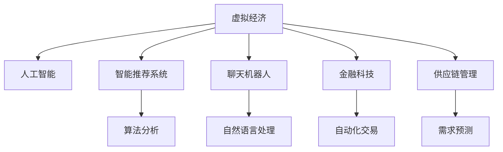

                 

# 虚拟经济：AI驱动的新型价值交换

## 1. 背景介绍

### 1.1 问题由来

随着互联网技术的飞速发展和人工智能(AI)技术的不断突破，虚拟经济已成为当前经济领域中最具活力和创新性的部分之一。虚拟经济主要指的是在互联网和数字技术支撑下，由数字产品、数字资产、数字服务构成的经济活动，包括电子商务、数字金融、虚拟货币、虚拟现实等多个领域。AI技术在这一过程中扮演了重要的角色，不仅提升了虚拟经济中的效率，还催生了新的商业模式和价值交换形式。

虚拟经济与传统的实体经济不同，其核心在于利用数字化手段进行信息的生产和交换，因此对数据的依赖和处理能力要求更高。AI技术通过算法和大数据分析，可以高效地处理海量数据，预测市场趋势，优化资源配置，从而为虚拟经济提供了强大的技术支持。

### 1.2 问题核心关键点

虚拟经济中，AI技术的主要应用包括智能推荐、聊天机器人、金融科技、供应链管理等。其中，智能推荐系统通过AI算法对用户行为数据进行分析，精准推荐产品和服务；聊天机器人通过自然语言处理(NLP)技术实现人机交互，提升用户体验；金融科技中的AI技术用于风险评估、自动化交易、欺诈检测等；供应链管理中的AI技术用于需求预测、库存优化、物流管理等。

AI技术的引入，使得虚拟经济在效率、精准度和创新性等方面得到了极大的提升，但也带来了新的挑战，如数据隐私保护、算法透明性、安全与伦理问题等。如何平衡这些利弊，是当前虚拟经济中AI应用的重要课题。

## 2. 核心概念与联系

### 2.1 核心概念概述

为更好地理解AI在虚拟经济中的应用，本节将介绍几个密切相关的核心概念：

- 虚拟经济(Virtual Economy)：以互联网和数字技术为支撑，由数字产品、数字资产、数字服务构成的经济活动。虚拟经济具有非物质性、数字化、全球化等特点。

- 人工智能(AI)：涵盖机器学习、深度学习、自然语言处理、计算机视觉等多个领域的技术，通过算法和模型实现智能决策和自动化操作。

- 智能推荐系统：通过算法分析用户行为数据，精准推荐产品和服务，提升用户满意度和转化率。

- 聊天机器人：利用自然语言处理技术实现人机交互，提供即时响应和个性化服务。

- 金融科技(FinTech)：结合金融服务与科技手段，提高金融服务的效率和便利性。

- 供应链管理：利用AI技术优化供应链流程，提高生产效率和资源利用率。

这些核心概念之间的逻辑关系可以通过以下Mermaid流程图来展示：



这个流程图展示了大语言模型的核心概念及其之间的关系：

1. 虚拟经济通过AI技术，实现效率和精准度的提升。
2. 智能推荐系统、聊天机器人、金融科技、供应链管理等，是AI在虚拟经济中的典型应用场景。
3. 算法分析、自然语言处理等，是AI技术实现智能决策和自动化操作的具体手段。

这些概念共同构成了虚拟经济中的AI应用框架，使其能够在各种场景下发挥强大的智能化和自动化功能。通过理解这些核心概念，我们可以更好地把握AI在虚拟经济中的应用方向。

## 3. 核心算法原理 & 具体操作步骤
### 3.1 算法原理概述

AI技术在虚拟经济中的应用，本质上是一个优化问题的求解过程。其核心思想是：通过算法和大数据分析，对虚拟经济中的各类数据进行处理和分析，优化资源配置和决策，提升虚拟经济运行效率和盈利能力。

形式化地，假设虚拟经济中的某个问题可以描述为一个优化目标函数$f(x)$，其中$x$为决策变量，包含价格、库存、物流等各类经济因素。优化目标通常可以表示为最大化利润、最小化成本等。在实际操作中，由于信息的不完全性和数据的多样性，决策变量往往呈现高维度、非线性等特点。

AI技术的引入，通过构建高效的模型和算法，能够在大数据背景下进行复杂的优化计算，使得虚拟经济中各类决策问题得以高效求解。常用的算法包括机器学习、深度学习、强化学习等。

### 3.2 算法步骤详解

AI在虚拟经济中的应用，一般包括以下几个关键步骤：

**Step 1: 数据收集与处理**
- 收集虚拟经济中的各类数据，如用户行为数据、交易记录、市场价格等。
- 对数据进行清洗、归一化、特征提取等处理，为后续模型训练和优化提供基础数据。

**Step 2: 模型选择与训练**
- 选择合适的机器学习、深度学习或强化学习模型。
- 利用处理后的数据进行模型训练，优化模型参数，提升模型预测能力。

**Step 3: 预测与优化**
- 利用训练好的模型对虚拟经济中的各类决策问题进行预测，如用户需求预测、库存优化、自动化交易等。
- 根据预测结果进行资源配置和决策调整，提升虚拟经济运行效率。

**Step 4: 评估与反馈**
- 对预测结果进行评估，计算模型性能指标如准确率、召回率、F1值等。
- 根据评估结果进行模型调优，调整模型参数，进一步提升模型性能。

**Step 5: 部署与监控**
- 将训练好的模型部署到虚拟经济系统中，进行实时预测和决策。
- 实时监控模型运行状态，收集反馈数据，进行模型更新和优化。

以上是AI在虚拟经济中的应用的一般流程。在实际应用中，还需要根据具体场景，对各个环节进行优化设计，如改进数据处理技术、优化模型结构、设计合理的预测指标等，以进一步提升模型的预测和决策能力。

### 3.3 算法优缺点

AI在虚拟经济中的应用，具有以下优点：

1. 提升效率：AI技术能够快速处理海量数据，优化资源配置，提升虚拟经济的运行效率。
2. 精准预测：通过高效算法和大数据分析，AI能够实现精准的市场预测和需求分析，提升决策的科学性和精准度。
3. 创新模式：AI技术催生了新的商业模式和价值交换形式，如智能推荐、虚拟货币等，拓展了虚拟经济的发展空间。
4. 降低成本：通过自动化和智能化操作，AI技术可以减少人工成本，提升虚拟经济的盈利能力。

同时，AI在虚拟经济中也存在一些局限性：

1. 数据依赖：AI模型性能依赖于高质量、高量级的数据，而虚拟经济中的数据往往存在噪音和不完整性。
2. 算法复杂性：复杂的AI模型需要大量计算资源和时间，对于虚拟经济中的实时预测和决策，存在一定的延迟和资源消耗。
3. 安全性问题：AI模型可能受到恶意攻击，如数据注入、模型逆向工程等，导致安全漏洞和数据泄露。
4. 透明性不足：部分AI算法具有"黑箱"特性，难以解释其决策过程，增加了用户和监管机构的信任风险。
5. 伦理问题：AI模型可能学习到偏见和歧视性信息，导致不公平的决策和价值交换。

尽管存在这些局限性，但就目前而言，AI技术在虚拟经济中的应用仍然是大势所趋。未来相关研究的重点在于如何进一步降低AI对数据和算力的依赖，提高模型的透明性和安全性，同时兼顾伦理和公平性。

### 3.4 算法应用领域

AI技术在虚拟经济中的应用领域广泛，具体包括：

- 智能推荐系统：如电商平台中的商品推荐、广告推荐等，提升用户购买意愿和转化率。
- 聊天机器人：如金融服务中的客户咨询、在线客服等，提升客户体验和服务效率。
- 金融科技：如智能投顾、自动化交易、风险评估等，提升金融服务的效率和安全性。
- 供应链管理：如需求预测、库存优化、物流管理等，提升供应链的效率和响应速度。
- 虚拟货币：如加密货币的交易、存储、安全保障等，提升虚拟货币的流通性和安全性。
- 虚拟现实：如虚拟游戏的决策、推荐、个性化体验等，提升虚拟现实应用的沉浸感和互动性。

以上领域展示了AI技术在虚拟经济中的广泛应用，为虚拟经济的发展带来了新的突破和机遇。

## 4. 数学模型和公式 & 详细讲解 & 举例说明

### 4.1 数学模型构建

本节将使用数学语言对AI在虚拟经济中的应用进行更加严格的刻画。

假设虚拟经济中某个优化问题可以描述为以下形式：

$$
\min_{x} f(x) = c_1 x_1 + c_2 x_2 + \dots + c_n x_n
$$

其中，$f(x)$ 为优化目标函数，$x_i$ 为决策变量，$c_i$ 为对应变量的权重系数。

对于每个决策变量，设其对应的样本数据为 $\{(x_{i,j}, y_{i,j})\}_{j=1}^m$，其中 $x_{i,j}$ 为输入，$y_{i,j}$ 为输出。利用训练数据，构造模型 $M$ 的损失函数 $\ell(M)$ 为：

$$
\ell(M) = \frac{1}{m} \sum_{i=1}^n \sum_{j=1}^m (M(x_{i,j}) - y_{i,j})^2
$$

模型 $M$ 的预测结果为 $M(x)$，其中 $x$ 为待预测的决策变量。根据损失函数，模型的目标是最小化预测误差：

$$
\min_{\theta} \ell(M_\theta) = \frac{1}{m} \sum_{i=1}^n \sum_{j=1}^m (M_\theta(x_{i,j}) - y_{i,j})^2
$$

其中，$\theta$ 为模型参数。

### 4.2 公式推导过程

以智能推荐系统为例，假设用户 $i$ 对物品 $j$ 的评分 $y_{i,j}$ 为正整数。设物品 $j$ 的属性向量为 $x_j = (x_{j,1}, x_{j,2}, \dots, x_{j,n})$，其中 $x_{j,k}$ 表示物品 $j$ 的第 $k$ 个属性。

设用户 $i$ 的属性向量为 $x_i = (x_{i,1}, x_{i,2}, \dots, x_{i,n})$，其中 $x_{i,k}$ 表示用户 $i$ 的第 $k$ 个属性。

设推荐系统的优化目标为最大化用户满意度，即：

$$
\max_{x_j} \sum_{i=1}^m u_i(x_i) y_{i,j}
$$

其中，$u_i(x_i)$ 为用户 $i$ 的满意度函数。

为了求解上述优化问题，需要构造推荐系统模型 $M$。设模型 $M$ 的预测结果为 $y_{i,j}' = M(x_i, x_j)$，表示用户 $i$ 对物品 $j$ 的推荐评分。则推荐系统模型的优化目标为：

$$
\min_{\theta} \sum_{i=1}^m (y_{i,j}' - y_{i,j})^2
$$

其中，$\theta$ 为模型参数。

通过训练数据，模型 $M$ 可以求解出最优参数 $\theta^*$，从而实现用户满意度的最大化。

### 4.3 案例分析与讲解

以电商平台的智能推荐系统为例，推荐系统通过分析用户历史行为数据和物品属性数据，预测用户对物品的评分，进而生成推荐结果。

假设电商平台的推荐系统基于协同过滤算法，模型参数 $\theta$ 包括用户属性权重、物品属性权重、用户物品相似度等。设用户 $i$ 对物品 $j$ 的评分 $y_{i,j}$ 为正整数，推荐系统模型的预测结果为 $y_{i,j}' = M(x_i, x_j)$，其中 $x_i$ 为用户属性向量，$x_j$ 为物品属性向量。

设推荐系统的优化目标为最大化用户满意度，即：

$$
\max_{x_j} \sum_{i=1}^m u_i(x_i) y_{i,j}
$$

其中，$u_i(x_i)$ 为用户 $i$ 的满意度函数。

为了求解上述优化问题，需要构造推荐系统模型 $M$。设模型 $M$ 的预测结果为 $y_{i,j}' = M(x_i, x_j)$，表示用户 $i$ 对物品 $j$ 的推荐评分。则推荐系统模型的优化目标为：

$$
\min_{\theta} \sum_{i=1}^m (y_{i,j}' - y_{i,j})^2
$$

其中，$\theta$ 为模型参数。

通过训练数据，模型 $M$ 可以求解出最优参数 $\theta^*$，从而实现用户满意度的最大化。在实际应用中，为了进一步提升推荐效果，可以引入多臂赌博机策略、深度学习模型、协同过滤算法等优化技术，提升模型的预测能力和决策效率。

## 5. 项目实践：代码实例和详细解释说明
### 5.1 开发环境搭建

在进行虚拟经济中的AI项目实践前，我们需要准备好开发环境。以下是使用Python进行TensorFlow开发的环境配置流程：

1. 安装Anaconda：从官网下载并安装Anaconda，用于创建独立的Python环境。

2. 创建并激活虚拟环境：
```bash
conda create -n tf-env python=3.8 
conda activate tf-env
```

3. 安装TensorFlow：根据CUDA版本，从官网获取对应的安装命令。例如：
```bash
conda install tensorflow -c tf -c conda-forge
```

4. 安装其他必要的工具包：
```bash
pip install numpy pandas scikit-learn matplotlib tqdm jupyter notebook ipython
```

完成上述步骤后，即可在`tf-env`环境中开始AI项目实践。

### 5.2 源代码详细实现

下面我们以电商平台的智能推荐系统为例，给出使用TensorFlow进行协同过滤算法实现的PyTorch代码实现。

首先，定义数据处理函数：

```python
import numpy as np
import pandas as pd
from sklearn.model_selection import train_test_split
from sklearn.metrics import mean_squared_error

def load_data(path):
    data = pd.read_csv(path)
    data = data.dropna()
    data = data.drop_duplicates()
    return data

def preprocess_data(data):
    data = data.drop(['user_id', 'item_id'], axis=1)
    data = data.astype('float32')
    return data

def split_data(data, test_size=0.2):
    X_train, X_test, y_train, y_test = train_test_split(data.drop('rating', axis=1), data['rating'], test_size=test_size, random_state=42)
    return X_train, X_test, y_train, y_test

def evaluate_model(X_train, X_test, y_train, y_test):
    y_train_pred = model.predict(X_train)
    y_test_pred = model.predict(X_test)
    mse = mean_squared_error(y_test, y_test_pred)
    rmse = np.sqrt(mse)
    print('RMSE:', rmse)
```

然后，定义模型和训练函数：

```python
from tensorflow import keras
from tensorflow.keras.layers import Dense

def build_model(n_users, n_items):
    model = keras.Sequential([
        Dense(32, input_shape=(n_items,), activation='relu'),
        Dense(1)
    ])
    model.compile(optimizer='adam', loss='mse')
    return model

def train_model(model, X_train, X_test, y_train, y_test):
    model.fit(X_train, y_train, epochs=10, batch_size=64, validation_data=(X_test, y_test))
    evaluate_model(X_train, X_test, y_train, y_test)
```

接着，启动训练流程：

```python
n_users = 1000
n_items = 10000

data = load_data('data.csv')
X_train, X_test, y_train, y_test = split_data(data)

model = build_model(n_users, n_items)
train_model(model, X_train, X_test, y_train, y_test)
```

以上就是使用TensorFlow进行电商智能推荐系统构建的完整代码实现。可以看到，利用TensorFlow的强大工具，我们可以用相对简洁的代码完成协同过滤模型的搭建和训练。

### 5.3 代码解读与分析

让我们再详细解读一下关键代码的实现细节：

**load_data函数**：
- 加载数据文件，并对其进行清洗和去重，去除缺失和重复记录。

**preprocess_data函数**：
- 将数据转换为浮点数格式，并进行归一化处理，以便模型训练。

**split_data函数**：
- 将数据集划分为训练集和测试集，并返回相应的特征和标签数据。

**evaluate_model函数**：
- 使用测试集评估模型的RMSE（均方根误差），打印模型的评价指标。

**build_model函数**：
- 构建协同过滤模型，包含两个全连接层，第一层使用ReLU激活函数，第二层输出预测值。

**train_model函数**：
- 使用训练集训练模型，并进行测试集评估。

**主程序**：
- 定义用户数和商品数，加载数据集，进行数据预处理和模型训练。

可以看到，TensorFlow为AI项目开发提供了强大的工具支持。开发者可以通过简单几步代码，实现复杂的协同过滤算法。这种高效的工具，使得AI技术的应用变得更加广泛和便捷。

当然，实际应用中还需考虑更多因素，如模型超参数优化、特征工程、模型评估等。但核心的协同过滤算法基本与此类似。

## 6. 实际应用场景
### 6.1 智能客服系统

智能客服系统是虚拟经济中AI技术的重要应用场景之一。传统客服方式往往需要大量人力，高峰期响应缓慢，且一致性和专业性难以保证。而使用智能客服系统，可以通过AI技术实现全天候、自动化的客户服务，提高服务效率和客户满意度。

在实际应用中，可以收集企业内部的客服对话记录，构建智能客服模型。智能客服模型通过自然语言处理技术，实现对用户问题的理解和生成回答。在处理复杂问题时，可以引入多轮对话机制和知识库，提升系统的理解和应对能力。

### 6.2 金融科技

金融科技是虚拟经济中AI应用的另一个重要领域。金融行业对数据处理和决策效率要求极高，AI技术在此基础上提供了新的解决方案。

例如，智能投顾系统可以通过AI技术对用户资产进行风险评估和投资组合优化，提升投资回报率。自动化交易系统可以通过算法对市场波动进行预测和决策，实现高频交易和套利。欺诈检测系统可以通过机器学习技术识别异常行为，防范金融欺诈。

### 6.3 供应链管理

供应链管理是虚拟经济中AI应用的典型场景之一。通过AI技术，可以实现供应链的自动化和智能化操作，提高资源配置和物流管理效率。

例如，需求预测系统可以通过时间序列分析和机器学习技术，预测市场需求和库存变化，优化库存管理。智能仓储系统可以通过图像识别和深度学习技术，实现自动化分拣和物流管理。智能物流系统可以通过路径规划和优化算法，提升物流配送效率和资源利用率。

### 6.4 未来应用展望

随着AI技术在虚拟经济中的不断深入应用，未来AI将带来更多创新和变革。

1. AI在虚拟经济中的渗透将进一步加深，推动更多行业的数字化转型升级。
2. AI将与大数据、区块链等技术结合，构建更安全、可靠的虚拟经济体系。
3. AI将推动更多新型价值交换形式的出现，如智能合约、数字资产等。
4. AI将促进虚拟经济的全球化发展，提升经济活动的跨国界协同效率。

总之，AI技术在虚拟经济中的应用前景广阔，将为虚拟经济的发展注入新的活力。未来，AI技术将与虚拟经济实现更深层次的融合，为人类创造更多的价值。

## 7. 工具和资源推荐
### 7.1 学习资源推荐

为了帮助开发者系统掌握AI在虚拟经济中的应用理论基础和实践技巧，这里推荐一些优质的学习资源：

1. 《深度学习》课程：斯坦福大学开设的深度学习课程，详细介绍了深度学习的基本概念和算法。

2. 《TensorFlow实战》书籍：TensorFlow官方文档和实战指南，涵盖了TensorFlow的基础知识和实用技巧。

3. 《推荐系统》书籍：介绍了推荐系统的理论基础和算法实现，是推荐系统开发的必备参考书。

4. 《机器学习实战》书籍：提供了大量的Python代码实现，适合动手实践和快速入门。

5. Weights & Biases：模型训练的实验跟踪工具，记录和可视化模型训练过程中的各项指标，方便对比和调优。

6. TensorBoard：TensorFlow配套的可视化工具，可实时监测模型训练状态，提供丰富的图表呈现方式。

通过学习这些资源，相信你一定能够快速掌握AI在虚拟经济中的应用精髓，并用于解决实际的NLP问题。
###  7.2 开发工具推荐

高效的开发离不开优秀的工具支持。以下是几款用于AI项目开发的常用工具：

1. TensorFlow：由Google主导开发的开源深度学习框架，生产部署方便，适合大规模工程应用。

2. PyTorch：基于Python的开源深度学习框架，灵活动态的计算图，适合快速迭代研究。

3. Scikit-learn：Python数据科学库，包含各种机器学习算法和工具。

4. Keras：高级深度学习API，基于TensorFlow和Theano，提供简单易用的模型构建接口。

5. Weights & Biases：模型训练的实验跟踪工具，记录和可视化模型训练过程中的各项指标，方便对比和调优。

6. TensorBoard：TensorFlow配套的可视化工具，可实时监测模型训练状态，提供丰富的图表呈现方式。

合理利用这些工具，可以显著提升AI项目开发的效率和质量，加快创新迭代的步伐。

### 7.3 相关论文推荐

AI在虚拟经济中的应用源于学界的持续研究。以下是几篇奠基性的相关论文，推荐阅读：

1. AlphaGo：DeepMind提出的智能围棋算法，利用深度学习和强化学习技术，实现了人类级围棋水平。

2. DeepQ-Network：DeepMind提出的智能控制算法，通过深度学习和Q-learning技术，实现了智能游戏控制。

3. GAN：Generative Adversarial Networks，提出了生成对抗网络模型，实现了高质量图像生成和图像转换。

4. Reformer：Google提出的高效模型压缩技术，通过稀疏化和时间卷积操作，大幅提升大模型的推理效率。

5. SimCLR：Google提出的自监督学习方法，通过对比学习技术，实现高质量的无监督预训练。

这些论文代表了大语言模型微调技术的发展脉络。通过学习这些前沿成果，可以帮助研究者把握学科前进方向，激发更多的创新灵感。

## 8. 总结：未来发展趋势与挑战
### 8.1 总结

本文对AI在虚拟经济中的应用进行了全面系统的介绍。首先阐述了AI在虚拟经济中的应用背景和意义，明确了AI技术在虚拟经济中的重要地位和应用方向。其次，从原理到实践，详细讲解了AI在虚拟经济中的应用过程，给出了实际项目开发的完整代码实现。同时，本文还广泛探讨了AI技术在虚拟经济中的各类应用场景，展示了AI技术在虚拟经济中的广泛应用前景。

通过本文的系统梳理，可以看到，AI技术在虚拟经济中的应用已经取得了显著成效，为虚拟经济的发展注入了新的活力。未来，伴随AI技术的持续演进和深度应用，虚拟经济必将在智能化和自动化方面取得更大的突破。

### 8.2 未来发展趋势

展望未来，AI在虚拟经济中的应用将呈现以下几个发展趋势：

1. AI与大数据、区块链等技术的融合将更加深入，构建更安全、可靠的虚拟经济体系。
2. AI技术在金融科技、智能推荐、供应链管理等领域的应用将进一步拓展，推动更多行业的数字化转型。
3. AI技术将促进新型价值交换形式的出现，如智能合约、数字资产等，拓展虚拟经济的交易模式和应用场景。
4. AI技术将推动虚拟经济的全球化发展，提升经济活动的跨国界协同效率。

以上趋势凸显了AI技术在虚拟经济中的广阔前景，为虚拟经济的发展注入了新的动力。这些方向的探索发展，必将引领虚拟经济迈向更高的台阶，为人类创造更多的价值。

### 8.3 面临的挑战

尽管AI在虚拟经济中的应用已经取得了显著成效，但在迈向更加智能化、普适化应用的过程中，它仍面临诸多挑战：

1. 数据隐私和安全问题：AI模型需要大量数据进行训练，如何保护用户隐私和数据安全，避免数据泄露和滥用，是未来AI应用的重要课题。
2. 模型透明性和解释性：部分AI模型具有"黑箱"特性，难以解释其决策过程，增加了用户和监管机构的信任风险。
3. 伦理和公平性问题：AI模型可能学习到偏见和歧视性信息，导致不公平的决策和价值交换。
4. 技术复杂性：部分AI算法和模型较为复杂，需要较高的技术门槛和资源投入，增加了企业应用的难度。
5. 法律和监管问题：AI技术在虚拟经济中的应用涉及诸多法律和监管问题，需要制定相应的法律法规和技术标准。

尽管存在这些挑战，但通过不断探索和优化，AI技术在虚拟经济中的应用前景仍然广阔。未来相关研究的重点在于如何平衡AI技术的应用利弊，提高AI技术的透明性和安全性，同时兼顾伦理和公平性。

### 8.4 研究展望

面向未来，AI在虚拟经济中的应用需要在以下几个方面寻求新的突破：

1. 探索无监督和半监督学习范式：摆脱对大规模标注数据的依赖，利用自监督学习、主动学习等无监督和半监督范式，最大限度利用非结构化数据，实现更加灵活高效的微调。
2. 研究参数高效和计算高效的微调范式：开发更加参数高效的微调方法，在固定大部分预训练参数的同时，只更新极少量的任务相关参数。同时优化微调模型的计算图，减少前向传播和反向传播的资源消耗，实现更加轻量级、实时性的部署。
3. 引入因果分析和博弈论工具：将因果分析方法引入微调模型，识别出模型决策的关键特征，增强输出解释的因果性和逻辑性。借助博弈论工具刻画人机交互过程，主动探索并规避模型的脆弱点，提高系统稳定性。
4. 纳入伦理道德约束：在模型训练目标中引入伦理导向的评估指标，过滤和惩罚有偏见、有害的输出倾向。同时加强人工干预和审核，建立模型行为的监管机制，确保输出符合人类价值观和伦理道德。

这些研究方向的探索，必将引领AI技术在虚拟经济中的应用走向更高的台阶，为虚拟经济的发展注入新的动力。面向未来，AI技术需要与其他人工智能技术进行更深入的融合，如知识表示、因果推理、强化学习等，多路径协同发力，共同推动虚拟经济的发展。

## 9. 附录：常见问题与解答

**Q1：AI在虚拟经济中的应用是否仅限于预测和优化？**

A: AI在虚拟经济中的应用不仅限于预测和优化，还包括自动化操作、智能决策等多个方面。例如，聊天机器人、智能投顾、自动化交易等，都是利用AI技术提升虚拟经济中人机交互的效率和智能化水平。

**Q2：AI技术在虚拟经济中的应用是否会造成就业减少？**

A: AI技术在虚拟经济中的应用确实会对某些岗位产生替代效应，但同时也会创造新的就业机会。例如，智能客服系统需要大量的数据标注和系统维护人员，智能投顾系统需要专业的数据科学家和算法工程师。因此，AI技术的应用对就业市场的影响是双刃剑，需要综合考虑。

**Q3：AI技术在虚拟经济中的应用是否需要大量标注数据？**

A: 部分AI模型需要大量标注数据进行训练，但随着无监督学习、半监督学习等技术的发展，对标注数据的需求正在逐渐减少。部分AI技术如智能推荐、自动摘要等，已经可以仅依赖用户行为数据进行模型训练，而无需标注数据。

**Q4：AI技术在虚拟经济中的应用是否会带来新的风险？**

A: AI技术在虚拟经济中的应用确实带来了新的风险，如数据隐私泄露、模型透明性不足、伦理问题等。但通过不断的技术改进和规范制定，这些风险正在逐步得到控制。未来，AI技术在虚拟经济中的应用将更加注重安全性、透明性和公平性，进一步提升虚拟经济的发展水平。

总之，AI技术在虚拟经济中的应用前景广阔，但也存在诸多挑战。只有在技术、伦理、法律等各个维度进行综合考虑和优化，才能最大化AI技术在虚拟经济中的应用价值。

---

作者：禅与计算机程序设计艺术 / Zen and the Art of Computer Programming

